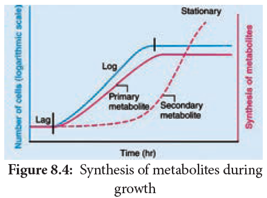
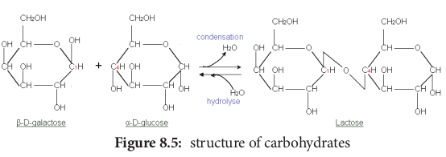
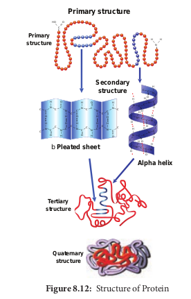
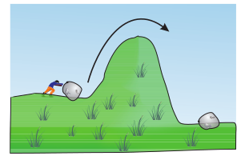

  

**Chapter Outline 8.1** Water **8.2** Primary and Secondary Metabolites **8.3** Carbohydrates **8.4** Lipids **8.5** Proteins **8.6** Enzymes **8.7** Nucleic Acids

**Bio**

**Chapter**

**8**

The learner will be able to, _- Recognise the basic structure of_

_carbohydrates, proteins, lipids and nucleic acids and differentiate the various pattern of classification with respect to structure._

_- Familiarise with the general structure of amino acids and its classification based on the functional group._

_- know the structure and classification of enzymes properties_

_- Understand lipids as a biomolecule and discuss the properties of lipids._

_- Have a deeper knowledge about structure of nucleic acids._

**Learning Objectives**

**Unit II B**  

**molecules**

Having learnt the structure of the cell, we can now understand that each component of the cell is responsible for a specific function. The cell components are made of collection of molecules called as **cellular pool**, which consists of both inorganic and organic compounds. Inorganic compounds include salts, mineral ions and water.

Organic compounds include carbohydrates, lipids, amino acids, proteins, nucleotides, hormones and vitamins. Some organic molecules remain in colloidal form in the aqueous intracellular fluid. Others exist in non-aqueous phases like the lipid membrane and cell walls. The cell maintains this pool by the intake and elimination of specific molecules (Figure 8.1).

**Biomolecules**

o

N

N

NH 2

O

O

O

P

O

O O CH 2

H H H

H

HOH

CH 2

OH H

H

OH

OHOH H

O

H HO

CH 2

OH

H O

H

C

CH 2

H 2

N COO

**Organic compounds: Biomolecules**

Level 4: The cell

Level 3:

complexes

Level 2: Level 1: Monomeric units

and its organelles Supramolecular Macromolecules

Chromosome DNA Nucleotides

Plasma membrane Protein Amino acids

Cell wall Cellulose Sugars

are of two types: **macronutrients**, which are required in larger amounts (Eg. potassium, phosphorus, calcium, magnesium, sulphur and iron) and **micronutrients**, which are required in trace amounts Eg. cobalt, zinc, boron, copper, molybdenum and manganese are essential for enzyme action. Example,

**I: Cell biology and iomolecules**

  

O HH

Covalent Bond

Manganese is required for activity of enzyme needed for synthesis of oligosaccharides and glycoproteins. Molybdenum is necessary for fixation of nitrogen by enzyme nitrogenase.

**Component** % **of the total cellular mass**

Water 70 Proteins 15 Carbohydrates 3 Lipids 2 Nucleic acids 6 Ions 4

## Water
 Water is the most abundant component in living organisms. Life on earth is inevitably linked to water. Water makes up 70% of human cell and upto 95% of mass of a plant cell (Figure 8.2).

**30 %**

**C he**

**m ic**

**al70 %**

**W at**

**er**

**70 %**

**30 %**

**(15%)Proteins**

**(4%) Small**

**molecules**

**(6%) RNA**

**(2%) Phospholipids**

**(1%) D NA**

**(2%) P olysacharid**

**es**

### Chemistry of Water

Water is a tiny polar molecule that can readily pass through membranes. Two electronegative atoms of oxygen share a hydrogen bonds of two water molecule. Thus, they can stick together by cohesion and results in lattice formation (Figure 8.3).  

### Properties of Water
 - Adhesion and cohesion propert. 
- High latent heat of vaporisatio. 
- High melting and boiling poin. 
- Universal solven. 
- Specific heat capacity

## Primary and Secondary Metabolites
 Most plants, fungi and other microbes synthesizes a number of organic compounds called as **metabolites** which are intermediates and products of metabolism. The term metabolite is usually restricted to small molecules. It can be catergorized into two types namely primary and secondary metabolites based on their role in metabolic process (Figure 8.4).

**Primary metabolites** are those that are required for the basic metabolic processes like photosynthesis, respiration, protein and lipid metabolism of living organisms.

**Secondary metabolites** does not show any direct function in growth and development of organisms.

**Morphine** is the first alkaloid to be found. It comes from the plant Opium poppy (_Papaver somniferum_).

It is used as a pain reliever in patients with severe pain levels and cough suppressant.

| Component |% of the totalcellular mass |
|------|------|
| Water |70 |
| Proteins |15 |
| Carbohydrates |3 |
| Lipids |2 |
| Nucleic acids |6 |
| Ions |4 |
  

**Metabolites Examples**

**Primary**

Enzymes protease, lipase, peroxidase

Amino acid proline, leucine

Organic acid acetic acid, lactic acid

Vitamins A, B, C

**Secondary**

Pigments carotenoids, anthocyanins

Alkaloids morphine, codeine

Essential oil lemon grass oil, rose oil

Toxins abrin, ricin

Lectins concanavalin A

Drugs vinblastin, curcumin

Polymeric substances

rubber, gums, cellulose

### Organic Molecules
 Organic molecules may be small and simple. These simple molecules assemble and

Carbo (Saccharid

Monosaccharides (simple sugars)

Oligosac ( 2 to 10 su

**Di - saccharides**

**Tri - saccharides sac**

**Functional**

**Examples**

**group**

**Aldoses Trioses Glyceraldehyde**

**e**

**Maltose Raffinose St**

**Lactose**

**Sucrose**

**Tetroses Erythrose Pentoses Ribose**

**Number of carbon atoms**

**Glucose Ketos Fructose**

**Hexose Glucose**

**Classification of**  

form large and complex molecules called **macromolecules**. These include four main classes – carbohydrates, lipids, proteins and nucleic acids. All macromolecules except lipids are formed by the process of polymerisation, a process in which repeating subunits termed monomers are bound into chains of different lengths. These chains of monomers are called **polymers**.

## Carbohydrates
 Carbohydrates are organic compounds made of carbon and water. Thus one molecule of water combines with a carbon atom to form CH2O and is repeated several (n) times to form **(CH2O)n** where n is an integer ranging from 3–7. These are also called as **saccharides**. The common term sugar refers to a simple carbohydrate such as a monosaccharide or disaccharide that tastes sweet are soluble in water (Figure 8.7).

### Monosaccharides – The Simple Sugars

**Monosaccharides** are relatively small molecules constituting single sugar unit.

hydrates es or sugars)

charides gar units)

**Tetra - charides**

**Penta - saccharides**

**Hetero polysaccharides**

**Homo polysaccharides**

Polysaccharides ( more than10 sugar units)

**Starchachyose Verbascose**

**Glycogen**

**Cellulose Chondroitin sulphate**

**Chitin**

**Inulin**

**Peptidoglycan**

**Hyaluronic acid**

**Keratan sulphate**

**Agar agar Carbohydrates**

| Metabolites |Examples |
|------|------|
| Primar y |
| Enzymes |protease, lipase,peroxidase |
| Amino acid |proline, leucine |
| Organic acid |acetic acid, lactic acid |
| Vitamins |A, B, C |
| Secondar y |
| Pigments |carotenoids,anthocyanins |
| Alkaloids |morphine, codeine |
| Essential oil |lemon grass oil, rose oil |
| Toxins |abrin, ricin |
| Lectins |concanavalin A |
| Drugs |vinblastin, curcumin |
| Polymericsubstances |rubber, gums, cellulose |

  

Glucose has a chemical formula of C6H12O6. It is a six carbon molecule and hence is called as **hexose.**

All monosaccharides contain one or two functional groups. Some are aldehydes, Eg: glucose and are referred as **aldoses**; other are ketones, Eg: fructose and are referred as **ketoses**.

Glucose is one of the most well-known molecules due to its nature as an essential nutrient for

human health. You ingest glucose in your food, and then your body uses blood to carry the glucose to the cells of every organ for the purpose of energy production.

### Disaccharides
 Disaccharides are formed when **two monosaccharides** join together. An example is **sucrose**. Sucrose is formed from a molecule of α-glucose and a molecule of fructose. This is a condensation reaction releasing water. The bond formed between the glucose and fructose molecule by removal of water is called **glycosidic bond**. This is another example of strong, covalent bond.

In the reverse process, a disaccharide is digested to the component monosaccharide in a hydrolysis reaction. This reaction involves addition of a water (hydro) molecule and splitting (lysis) of the glycosidic bond.

### Polysaccharides
 These are made of **hundreds of monosaccharide units**. Polysaccharides also called "**Glycans**". Long chain of branched or unbranched monosaccharides are held together by glycosidic bonds. Polysaccharide is an example of giant molecule, a macromolecule and consists of only one type of monomer. Polysaccharides are insoluble in water and are sweetless. **Cellulose** is an example built from repeated units of glucose monomer (Figure 8.6).

Depending on the function, polysaccha- rides are of two types - **storage polysaccha- ride and structural polysaccharide.**

### Starch
 Starch is a storage polysaccharide made up of repeated units of **amylose and amylopectin**. Starch grains are made up of successive layers of amylose and amylopectin, which can be seen as growth rings. Amylose is a

linear, unbranched polymer which makes up 80% of starch. Amylopectin is a polymer with some 1, 6 linkages that gives it a branched structure.

### Test for Starch
 We test the presence of starch by adding a solution of iodine in potassium iodide. Iodine molecules fit nearly into the starch helix, producing a **blue-black colour**.

Amylose

Amylopectin

Starch Glycogen Cellulose (fibre)

ohydrates

  

Tri-iodide ion

Glucose chain

**Test for starch** a. Test on potato; b. test on starch at varied concentrations; c. starch – iodine reaction

### Celluloses
 Cellulose is a structural polysaccharide made up of thousands of glucose units. In this case, β-glucose units are held together by 1,4 glycosidic linkage, forming long unbranched chains. Cellulose fibres are straight and uncoiled. It has many industrial uses which include cellulose fibres as cotton, nitrocellulose for explosives, cellulose acetate for fibres of multiple uses and cellophane for packing (Figure 8.7).

### Chitin
 Chitin is a homo polysaccharide with amino acids added to form **mucopolysaccharide**. The basic unit is a nitrogen containing

a b

c  

glucose derivative known as **N-acetyl glucosamine.** It forms the exoskeleton of insects and other arthropods. It is also present in the cell walls of fungi (Figure 8.8).

**Do mushroom cells have cell wall?**

Mine too

My hard shells are made of chitin tooMy cell walls are made of

chitin. Chitin is made of glucose and chitin is primarily used as a structural component, strengthening exoskeletons, shells, and cell walls of fungus.

### Test for Reducing Sugars
 Aldoses and ketoses are reducing sugars. This means that, when heated with an alkaline solution of copper (II) sulphate (a blue solution called **benedict’s solution**), the aldehyde or ketone group reduces Cu2+ ions to Cu+ ions forming brick red precipitate of copper(I) oxide. In the process, the aldehyde or ketone group is oxidised to a carboxyl group (–COOH). This reaction is used as test for reducing sugar and is known as **Benedict’s test.** The results of benedict’s test depends on concentration of the sugar. If there is no reducing sugar it remains blue. 
- Sucrose is not a reducing suga. 
- The greater the concentration of reducing

sugar, the more is the precipitate formed and greater is the colour change.

  

Blue Solution

None

Orange precipitate

Moderate reducing sugar

Green/yellow precipitate

Trace of reducing sugar

Brick-red precipitate

Large amount of

reducing sugar

**Test for sugar**

## Lipids
 The term lipid is derived from _greek_ word lipos, meaning fat. These substances are not soluble in polar solvent such as water but soluble in non-polar solvents such as benzene, ether, chloroform. This is because they contain long hydrocarbon chains that are non-polar and thus are hydrophobic.

**Other Sugar Compounds Other**

**Polysaccharides Structure**

Inulin Polymer of fructose

Hyaluronic acid Heteropolymer of d glucuro and D-N acetyl glucosamine

Agar Mucopolysaccharide from re

Heparin Glycosamino glycan contain sulphated disaccharide unit liver

Chondroitin sulphate

Sulphated glycosaminoglycan of altering sugars (N-acetylglu and glucuronic acid)

Keratan sulphate

Sulphated glycosaminoglyca structural carbohydrate  

The main groups of compounds classified as lipids are triglycerides, phospholipids, steroids and waxes.

### Triglycerides
 Triglycerides are composed of single molecule of glycerol bound to 3 fatty acids. These include fats and oils. Fatty acids are long chain hydrocarbons with a carboxyl group at one end which binds to one of the hydroxyl groups of glycerol, thus forming an ester bond. Fatty acids are structural unit of lipids and are carboxylic acid of long chain hydrocarbons. The hydrocarbon can vary in length from 4 – 24 carbons and the fat may be saturated or unsaturated. In saturated fatty acids the hydrocarbon chain is single bonded (Eg. palmitic acid, stearic acid) and in unsaturated fatty acids (Eg. oleic acid, linoleic acid) the hydrocarbon chain is double bonded (one/two/three). In general solid fats are saturated and oils are unsaturated, in which most are globules.

**Functions**

It is not metabolised in the human body and is readily filtered through the kidney

nic acid It accounts for the toughness and flexibility of cartilage and tendon

d algae Used as solidifying agent in culture medium in laboratory

s variably present in

Used as an anticoagulant

composed cosamine

Dietery supplement for treatment of osteoarthritis

n and is a Acts as cushion to absorb mechanical shock

| OtherPolysaccharides |Structure |Functions |
|------|------|------|
| Inulin |Polymer of fructose |It is not metabolised in thehuman body and is readilyfiltered through the kidney |
| Hyaluronic acid |Heteropolymer of d glucuronic acidand D-N acetyl glucosamine |It accounts for the toughness andflexibility of cartilage and tendon |
| Agar |Mucopolysaccharide from red algae |Used as solidifying agent inculture medium in laborator y |
| Heparin |Glycosamino glycan contains variablysulphated disaccharide unit present inliver |Used as an anticoagulant |
| Chondroitinsulphate |Sulphated glycosaminoglycan composedof altering sugars (N-acetylglucosamineand glucuronic acid) |Dietery supplement fortreatment of osteoarthritis |
| Keratansulphate |Sulphated glycosaminoglycan and is astructural carbohydrate |Acts as cushion to absorbmechanical shock |
  

**Cellular Structure Po**

**Chromosome DNA s**

**_N uc_**

**_le ic_**

**_a ci_**

**_d Li_**

**_pi d_**

**Adipose cell with fat droplets**

**Poly**

**_Pr ot_**

**_ei n_**

**Intermediate**

**Ala Val**

**Starch grains in a chloroplast St**

**_C ar_**

**_bo hy_**

**_dr at_**

**_e_**  

**Monomerlymer**

**trand Nucleotide**

**5-carbon sugar**

**Nitrogenous base**

**Phosphategroup**

oP

**Fatty acidTriglyceride HO**

**C O C**

**H**

**H C H**

**H C H**

**H C H**

**H C H**

**H C H**

**H C H**

**H C H**

**H C H**

**H H**

**peptide Amino acid**

**N C C OH H**

**H H O**

**CH3**

**Ser Val Ala**

**arch Monosaccharide**

H

OH H

OH

OH

H

CH OH2

H H

HO

O

  

## Proteins
 Proteins are the most diverse of all macromolecule. Proteins make up 2/3 of total dry mass of a cell. The term protein was coined by **Gerardus Johannes Mulder** and is derived form a _greek_ word proteos which means of the first rank.

Amino acids are building blocks of proteins. There are about 20 different amino acids exist naturally. All amino acids have a basic skeleton consisting of a carbon (a-carbon) linked to a basic amino group.

**H**

**H**

**N**

**H**

**C**

**R**

**OH**

**O**

**C** Amino Group Carboxyl Acid

Group

Variable Side Chain

(NH2), an acidic carboxylic group (COOH) and a hydrogen atom (H) and side chain or variable R group. The amino acid is both an acid and a base and hence is called **amphoteric**.

A **zwitterion** also called as **dipolar ion**, is a molecule with two or more functional groups, of which at least one has a positive and other has a negative electrical charge and the net charge of the entire molecule is zero. The pH at which this happens is known as the **isoelectric point** (Figure 8.10).

### Classification of Amino acids
 Based on the R group amino acids are classified as acidic, basic, polar, non-polar.  

The amino group of one amino acid reacts with carboxyl group of other amino acid, forming a **peptide bond**. Two amino acids can react together with the loss of water to form a **dipeptide**. Long strings of amino acids linked by peptide bonds are called **polypeptides**. In 1953, Fred Sanger first sequenced the Insulin protein (Figure 8.11 a and b).

**Figure 8.11(a):** Formation of peptide bond

Linus Pauling and Robert Corey in 1951 proposed the α-helix and β sheet secondary structures of proteins. They were awarded Nobel prize in 1954

First protein Insulin was sequenced by Fred Sange.

  

### Structure of Protein
 Protein are synthesised on the ribosome as a linear sequence of amino acids which are held together by peptide bonds. After synthesis, the protein attains conformational change into

a specific 3D form for proper functioning. According to the mode of folding, four levels of protein organisation have been recognised namely primary, secondary, tertiary and quaternary (Figure 8.12). 
- The **primary structure** is linear

arrangement of amino acids in a polypeptide chain**.**

**Figure 8.11(b):** Classification  

- **Secondary structure** arises when various functional groups are exposed on outer surface of the molecular interaction by forming hydrogen bonds. This causes the aminoacid chain to twist into coiled configuration called α-**helix** or to fold into a flat β-pleated sheets.

- **Tertiary protein structure** arises when the secondary level proteins fold into globular structure called domains.

- **Quaternary protein structure** may be assumed by some complex proteins in which more than one polypeptide forms a large multiunit protein. The individual polypeptide chains of the protein are called **subunits** and the active protein itself is called a **multimer.**

of Amino Acids

  

For example: Enzymes serve as catalyst for chemical reactions in cell and are non-specific. Antibodies are complex glycoproteins with specific regions of attachment for various organisms.

H H

N

HO O

C

H

N C C

C

O

N

H

O

N

O

C C

N

H

H

O

C

C

C

O

C N

H

C

N

H

O

C C

N

H C

O

C C

O

N

C

H

C

C

H

N C

H

O

N

O

C

C

C

C

H

NC

O

O

C

H

N C

O

H

N

C H O

N C H

C

OH

N

C

C

O

N N

H

C H

H C

C N

O

C N

C C

C

O

O

C C

**Primary structure**

**Primary structure**

**Secondary structure**

b **Pleated sheet**

**Tertiary structure**

**Alpha helix**

**Quaternary structure**

### Protein Denaturation
 Denaturation is the loss of 3D structure of protein. Exposure to heat causes atoms to vibrate violently, and this disrupts the hydrogen and ionic bonds. Under these conditions, protein molecules become elongated, disorganised strands. Agents such as soap, detergents, acid, alcohol and some disinfectants disrupt the interchain bond and cause the molecule to be non-functional (Figure 8.13).

Christian Anfinsen explained denaturation of proteins by heat treatment leading to breakage of non-covalent bond.  

\_SH \_ S-S

(b) Protein thermal lrreversible denaturatio

(a)

\_ soluble

Albumen

Water Insoluble

Native albumen Denaturation Crosslinking

### Protein Bonding
 There are four types of chemical bonds

C

CH2

CH2

CH

CH

CH3H C3

H C3 CH3

O H

OH

O

Hydrogen bond

CH2 CH2S S

CH2 CH2CH2 CH2 C CH2

O

ONH3

Ionic bond

Disulfide bond

Polypeptide backbone

**Hydrophobic Interactions and van der Waals Interactions**

**Hydrogen Bond** It is formed between some hydrogen atoms of oxygen and nitrogen in polypeptide chain. The hydrogen atoms have a small positive charge and oxygen and nitrogen have small negative charge. Opposite charges attract to form hydrogen bonds.

Though these bonds are weak, large number of them maintains the molecule in 3D shape (Figure 8.14).

**Ionic Bond** It is formed between any charged groups that are not joined together by peptide bond. It is stronger than hydrogen bond and can be broken by changes in pH and temperature.

  

**Disulfide Bond** Some amino acids like cysteine and methionine have sulphur. These form disulphide bridge between sulphur atoms and amino acids.

**Hydrophobic Bond** This bond helps some protein to maintain structure. When globular proteins are in solution, their hydrophobic groups point inwards away from water.

### Test for Proteins
 The biuret test is used as an indicator for presence of protein as it gives a purple colour in the presence of peptide bonds (–C–N–). To protein solution, an equal quantity of sodium hydroxide solution is added and mixed. Then a few drops of 0.5% copper (II) sulphate is added with gentle mixing. A distinct purple colour develops without heating (Figure 8.15 a and b).

**Figure 8.15(a):** Biuret test

**Figure 8.15(b):** Colour intensity increases with increase in concentration  

The more the distance between the sulphur atoms, the more the proteins bend; the more the hair curls.

## Enzymes
 Enzymes are globular proteins that catalyse the many thousands of metabolic reactions taking place within cells and organism. The molecules involved in such reactions are metabolites. Metabolism consists of chains and cycles of enzyme-catalysed reactions, such as respiration, photosynthesis, protein synthesis and other pathways. These reactions are classified a. 
- **anabolic** (building up of organic

molecules). Synthesis of proteins from amino acids and synthesis of polysaccharides from simple sugars are examples of anabolic reactions.

- **catabolic** (breaking down of larger molecules). Digestion of complex foods and the breaking down of sugar in respiration are examples of catabolic reactions (Figure 8.16).

secreted and work externally exported from cells. Eg. digestive enzymes; or **intracellular enzymes** that remain within cells and work there. These are found inside organelles or within cells. Eg. insulin.

  

### Properties of Enzyme
 - All are globular proteins. 
- They act as catalysts and effective even in

small quantity. 
- They remain unchanged at the end of the

reaction. 
- They are highly specific. 
- They have an active site where the reaction

takes place. 
- Enzymes lower activation energy of the

reaction they catalyse.

**RUBISCO** is the abundant protein in the whole biosphere

As molecules react, they become unstable, high energy intermediates. But they are in this transition state only momentarily. Energy is required to raise molecules to this transition state and this minimum energy needed is called the **activation energy**. This could be explained schematically by ‘boulder on hillside’ model of activation energy (Figure 8.17).

### Lock and Key Mechanism of Enzyme
 In a enzyme catalysed reaction, the starting substance is the substrate. It is converted to the product. The substrate binds to the

This graph shows the activation energies o 

specially formed pocket in the enzyme – **the active site**, this is called **lock and key mechanism** of enzyme action. As the enzyme and substrate form a **ES complex**, the substrate is raised in energy to a transition state and then breaks down into products plus unchanged enzyme (Figure 8.18).

Substrate

Enzyme Enzyme

Product

Enzyme - Substrate complex

### Enzyme Cofactors
 Many enzymes require non-protein components called **cofactors** for their efficient activity. Cofactors may vary from simple inorganic ions to complex organic molecules. They are of three types: **inorganic ions, prosthetic groups and coenzymes** (Figure 8.19). 
- **Holoenzyme** – active enzyme with its

non protein component. 
- **Apoenzyme** – the inactive enzyme

without its non protein component.

En er

gy in

th e

re ac

tio n

Enzyme

Reactant

Product

Time

Activation energy without enzymes

Activation energy with enzymes

f a reaction with and without enzymes ivation energy

| Activation energywithout enzyme sActivation energywith enzyme sProduct |
|------|------|------|------|
| EnzymeReactant |

  

Coenzyme

Apoenzyme

Catalytic site Cofactor

Holoenzyme

- **Inorganic ions** help to increase the rate of reaction catalysed by enzymes. Example: Salivary amylase activity is increased in the presence of chloride ions.

- **Prosthetic groups** are organic molecules that assist in catalytic function of an

### Classification of Enzymes
 Enzymes are classified into six groups based on

**Enzymes Mode of action Gen**

Oxidoreductase Oxidation and reduction (redox) reactions

Ared + B

Transferase Transfer a group of atoms from one molecule to another

A – B +

Hydrolases Hydrolysis of substrate by addition of water molecule

A – B +

Isomerase Control the conversion of one isomer to another by transferring a group of atoms from one molecule to another

A – B –

Lyase Break chemical bond without addition of water

A – B

Ligase Formation of new chemical bonds using ATP as a source of energy

A + B +  

their mode of action**.**

**eral scheme of reaction Example**

ox Aox + Bred Dehydrogenase

C A + C – B Transaminase, phosphotransfer- ase

H2O A – H + B – OH Digestive enzymes

C A – C – B Isomerase

A + B Decarboxylase

ATP A – B + ADP + Pi DNA ligase

enzyme. Flavin adenine dinucleotide (FAD) contains riboflavin (vit B2), the function of which is to accept hydrogen. ‘Haem’ is an iron-containing prosthetic group with an iron atom at its centre.

- **Coenzymes** are organic compounds which act as cofactors but do not remain attached to the enzyme. The essential chemical components of many coenzymes are vitamins. Eg. NAD, NADP, Coenzyme A, ATP

**Ribozyme - Non Protein Enzyme -** A Ribozyme, also called as catalytic RNA; is a

ribonucleic acid that acts as enzyme. It is found in ribosomes

| Enzymes |Mode of action |General scheme of reaction |Example |
|------|------|------|------|
| Oxidoreductase |Oxidation and reduction (redox) reactions |A  + B  A  + Bred ox ox red |Dehydrogenase |
| Transferase |Transfer a group of atoms from onemolecule to another |A – B + C   A + C – B |Transaminase,phosphotransfer-ase |
| Hydrolases |Hydrolysis of substrate by addition of water molecule |A – B + H O   A – H + B – OH2 |Digestive enzymes |
| Isomerase |Control the conversionof one isomer to anotherby transferring a groupof atoms from onemolecule to another |A – B – C   A – C – B |Isomerase |
| Lyase |Break chemic al b ondwithout addition ofwater |A – B   A + B |Decarboxylase |
| Ligase |Formation of new chemical bonds using ATP as a source of energ y |A + B + ATP   A – B + ADP + Pi |DNA ligase |
  

### Uses of Enzymes Enzyme Source Application
 Bacterial protease

Bacillus Biological detergents

Bacterial glucose isomerase

Bacillus Fructose syrup manufacture

Fungal lactase

Kluyvero- myces

Breaking down of lactose to glucose and galactose

Amylases Aspergillus Removal of starch in woven cloth production

## Nucleic Acids
 As we know DNA and RNA are the two kinds of nucleic acids. These were originally isolated from cell nucleus. They are present in all known **cells** and **viruses** with special coded genetic programme with detailed and specific instructions for each organism heredity.

DNA and RNA are polymers of monomers called **nucleotides**, each of which is composed of a nitrogen base, a pentose sugar and a phosphate. A purine or a pyrimidine and a ribose or deoxyribose sugar is called **nucleoside**. A nitrogenous base is linked to pentose sugar through n-glycosidic linkage and forms a nucleoside. When a phosphate group is attached to a nucleoside it is called a  

**nucleotide**. The nitrogen base is a heterocyclic compound that can be either a **purine** (two rings) or a **pyrimidine** (one ring). There are **2 types of purines – adenine (A) and guanine (G) and 3 types of pyrimidines – cytosine (C), thymine (T) and uracil (U)** (Figure 8.20 and 21)**.** A characteristic feature that differentiates DNA from RNA is that DNA contains nitrogen bases such as Adenine, guanine, thymine (5-methyl uracil) and cytosine and the RNA contains nitrogen bases such as adenine, guanine, cytosine and uracil instead of thymine. The nitrogen base is covalently bonded to the sugar ribose in RNA and to deoxyribose (ribose with one oxygen removed from C2) in DNA. Phosphate group is a derivative of (PO4

3-) phosphoric acid, and forms phosphodiester linkages with sugar molecule (Figure 8.22).

**Telomerase** - A ribonucleic Protein. T e l o m e r e

protects the end of the chromosomes from damage. Telomerase is a ribonucleo protein also called as terminal transferase.

| Enzyme |Source |Application |
|------|------|------|
| Bacterialprotease |Bacillus |Biologicaldetergents |
| Bacterialglucoseisomerase |Bacillus |Fructose syrupmanufacture |
| Fungallactase |Kluyvero-myces |Breaking downof lactose toglucose andgalactose |
| Amylases |Aspergillus |Removal ofstarch in wovencloth production |
  

### Formation of Dinucleotide and Polynucleotide

Two nucleotides join to form **dinucleotide** that are linked through 3′-5′ phosphodiester linkage by condensation between phosphate groups of one with sugar of other. This is repeated many times to make **polynucleotide**.

**Nucleoside Nucleotide** It is a combination of base and sugar.

It is a combination of nucleoside and phosphoric acid.

**Examples Examples**

Adenosine = Adenine \+ Ribose

Adenylic acid = Adenosine + Phosphoric acid

Guanosine = Guanine \+ Ribose

Guanylic acid = Guanosine + Phosphoric acid

Cytidine = Cytosine \+ Ribose

Cytidylic acid = Cytidine + Phosphoric acid

Deoxythymidine \= Thymine + Deoxyribose

Uridylic acid = Uridine + Phosphoric acid

**Friedrich Miescher** _was the first to isolate a non-protein substance in nuclei of pus cells and named it as ‘_**Nuclein’**.

DNA and RNA

### Structure of DNA
 Watson and Crick shared the **Nobel Prize** in **1962** for their discovery, along with **Maurice Wilkins**, who had produced the crystallographic data supporting the model.  

**Rosalind Franklin** (1920–1958) had earlier produced the first clear crystallographic evidence for a helical structure. **James Watson** and **Francis Crick** of Cavendish laboratory in Cambridge built a scale model of double helical structure of DNA which is the most prevalent form of DNA, the **B-DNA**. This is the secondary structure of DNA.

As proposed by **James Watson and Francis Crick**, DNA consists of right handed double helix with 2 helical polynucleotide chains that are coiled around a common axis to form right handed B form of DNA. The coils are held together by hydrogen bonds which occur between complementary pairs of nitrogenous bases. The sugar is called **2**′**\-deoxyribose** because there is no hydroxyl at position 2′. Adenine and thiamine base pairs has two hydrogen bonds while guanine and cytosine base pairs have three hydrogen bonds. As published by **Erwin Chargaff** in 1949, a purine pairs with pyrimidine and vice versa**.** Adenine (A) always pairs with Thymine (T) by double bond and Guanine (G) always pairs with Cytosine (C) by triple bond.

Erwin Chargaff 

Rosalind franklin

| Nucleoside |Nucleotide |
|------|------|
| It is a combination ofbase and sugar. |It is a combinationof nucleoside andphosphoric acid. |
| Examples |Examples |
| Adenosine = Adenine+ Ribose |Adenylic acid =Adenosine +Phosphoric acid |
| Guanosine = Guanine + Ribose |Guanylic acid =Guanosine +Phosphoric acid |
| Cytidine = Cytosine+ Ribose |Cytidylic acid =Cytidine +Phosphoric acid |
| Deoxythymidine= Thymine +Deoxyribose |Uridylic acid =Uridine +Phosphoric acid |
  

_In 1950s,_ **Maurice Wilkins and Rosalind Franklin** _of Kings College, London studied the X-ray_

_crystallography and revealed experimental data on the structure of DNA_

### Features of DNA
 - If one strand runs in the 5′-3′ direction,

the other runs in 3′-5′ direction and thus are antiparallel (they run in opposite direction). The 5′ end has the phosphate group and 3’end has the OH group.

- The angle at which the two sugars protrude from the base pairs is about 120°, for the narrow angle and 240° for the wide angle. The narrow angle between the sugars generates a **minor groove** and the large angle on the other edge generates **major groove.**

- Each base is 0.34 nm apart and a complete turn of the helix comprises 3.4 nm or 10 base pairs per turn in the predominant B form of DNA.

- DNA helical structure has a diameter of 20 A° and a pitch of about 34 A°. X-ray crystal study of DNA takes a stack of about 10 bp to go completely around the helix (360°).

- Thermodynamic stability of the helix and specificity of base pairing includes (i) the hydrogen bonds between the complementary bases of the double helix (ii) stacking interaction between bases tend to stack about each other perpendicular to the direction of helical axis. Electron cloud interactions (∏ – ∏) between the bases in the helical stacks contribute to the stability of the double helix.

- The phosphodiester linkages gives an inherent polarity to the DNA helix. They form strong covalent bonds, gives the strength and stability to the polynucleotide chain (Figure 8.32).  

AT

AT

AT

A T

A T

AT

A T

AT

A

GC

GC

G C

G C

G C

A T

GC

G C

Blue bands - Two sugar-phosphate chains

Major GrooveMinor Groove

5’

5’

3’

3’

The two chains run in opposite direction

Complementary base parings: A=T and C G

5’

5’ 3’

3’

o 3.4A

o 3.4A

o 20A

of the DNA are wrapped around each other in a helix, making it impossible to simply move them apart without breaking the entire structure. Whereas in paranemic coiling the two strands simply lie alongside one another, making them easier to pull apart.

- Based on the helix and the distance between each turns, the DNA is of three forms – **A DNA, B DNA and Z DNA** (Figure 8.27).

### Ribonucleic Acid (RNA) Ribonucleic acid
 (**RNA**) is a polymeric molecule essential in various biological roles in

  

coding, decoding, regulation and expression of genes. RNA is single stranded and is unstable when compared to DNA. ### Types of RNA
 - **mRNA (messenger RNA):** Single

stranded, carries a copy of instructions for assembling amino acids into proteins. It is very unstable and comprises 5% of total RNA polymer. Prokaryotic mRNA (Polycistronic) carry coding sequences for many polypeptides. Eukaryotic mRNA (Monocistronic) contains information for only one polypeptide.

**Feature B** Type of helix Rig Helical diameter (nm) Rise per base pair (nm) Distance per complete turn (pitch) (nm) Number of base pairs per complete turn Topology of major groove W Topology of minor groove Narr

RibosomMessenger **RNA** (m**RNA**) 

**Summary** ™ **Cells** are composed of water, inorganic

compounds and organic molecules. The biomolecules of the cells include carbohydrates, lipids, proteins, enzymes and nucleic acids.

™ **Carbohydrates** include simple sugars (monosaccharides) and polysaccharides. Polysaccharide serve as storage forms of sugar and structural components of cell.  

- **tRNA (transfer RNA):** Translates the code from mRNA and transfers amino acids to the ribosome to build proteins. It is highly folded into an elaborate 3D structure and comprises about 15% of total RNA. It is also called as **soluble RNA**.

- **rRNA (ribosomal RNA):** Single stranded, metabolically stable, make up the two subunits of ribosomes. It constitutes 80% of the total RNA. It is a polymer with varied length from 120–3000 nucleotides and gives ribosomes their shape. Genes for rRNA are highly conserved and employed for phylogenetic studies (Figure 8.28).

**\-DNA A-DNA Z-DNA** ht-handed Right-handed Left-handed

2.37 2.55 1.84 0.34 0.29 0.37 3.4 3.2 4.5 10 11 12

ide, deep Narrow, deep Flat ow, shallow Broad, shallow Narrow, deep

al **RNA** (r**RNA**) Transfer **RNA** (t**RNA**) ypes of RNA

™ **Lipids** are the principle components of cell membrane, and they serve as energy storage and signalling molecules.

™ **Proteins** are polymers of 20 different amino acids, each of which has a distinct side chain with specific chemical properties. Each protein has a unique aminoacid sequence which determines its 3D structure.

| Feature |B-DNA |A-DNA |Z-DNA |
|------|------|------|------|
| Type of helix |Right-handed |Right-handed |Left-handed |
| Helical diameter (nm) |2.37 |2.55 |1.84 |
| Rise per base pair (nm) |0.34 |0.29 |0.37 |
| Distance per complete turn (pitch) (nm) |3.4 |3.2 |4.5 |
| Number of base pairs per complete turn |10 |11 |12 |
| Topology of major groove |Wide, deep |Narrow, deep |Flat |
| Topology of minor groove |Narrow, shallow |Broad, shallow |Narrow, deep |
  

™ **Nucleic acids** are the principle information molecules of the cell. Both DNA and RNA are polymers of purine and pyrimidine nucleotides.

**Evaluation** 1\. The most basic amino acid is

a. Arginine b. Histidine c. Glycine d. Glutamine

2\. An example of feedback inhibition is a. Cyanide action on cytochrome b. Sulpha drug on folic acid

synthesiser bacteria c. Allosteric inhibition of hexokinase

by glucose-6-phosphate d. The inhibition of succinic

dehydrogenase by malonate 3. Proteins perform many physiological

functions. For example some functions as enzymes. One of the following represents an additional function that some proteins discharge: a. Antibiotics b. Pigment conferring colour to skin

**ICT Corner ENZY**

**Bio CatalSteps*. 
- Scan the QR cod. 
- Click Enzymati. 
- Start a new gam. 
- Select yes if you using touch

screen mobile / table. 
- Tap or click her. 
- Click experiments

**Activity*. 
- Move the slide to change

temperatur. 
- Go to next concep. 
- Try Quiz after experiments

**Step 1**

**Step 2 URL: https://www.biomanbio.com/HTML5GamesandLabs/LifeChemgam** \* Pictures are indicative only  

c. Pigments making colours of flowers d. Hormones

4\. Given below is the diagrammatic representation of one of the categories of small molecular weight organic compounds in the living tissues. Identify the category shown & one blank component “ X” in it.

O

HOH2C **X**

OH OH

**Category Compound** Cholesterol Guanine Amino acid NH2

Nucleotide Adenine Nucleoside Uracil

5\. Distinguish between nitrogenous base and a base found in inorganic chemistry.

6\. Write the characteristic feature of DNA.

7\. Explain the structure and function of different types of RNA.

**MES**

**yst**

**Step 3**

**Step 4 es/ lifechem.html**

