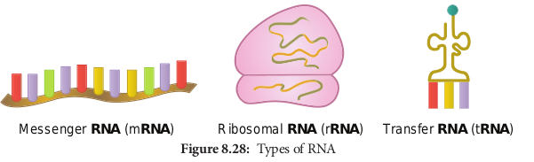

# Chapter Outline

**8.1** Water
**8.2** Primary and Secondary Metabolites
**8.3** Carbohydrates
**8.4** Lipids
**8.5** Proteins
**8.6** Enzymes
**8.7** Nucleic Acids

## Water

Water is the most abundant component in living organisms. Life on earth is inevitably linked to water. Water makes up 70% of human cell and upto 95% of mass of a plant cell (Figure 8.2).

### Chemistry of Water

Water is a tiny polar molecule that can readily pass through membranes. Two electronegative atoms of oxygen share a hydrogen bonds of two water molecule. Thus, they can stick together by cohesion and results in lattice formation (Figure 8.3).  

### Properties of Water

- Adhesion and cohesion propert.
- High latent heat of vaporisatio.
- High melting and boiling poin.
- Universal solven.
- Specific heat capacity

## Primary and Secondary Metabolites

Most plants, fungi and other microbes synthesizes a number of organic compounds called as **metabolites** which are intermediates and products of metabolism. The term metabolite is usually restricted to small molecules. It can be catergorized into two types namely primary and secondary metabolites based on their role in metabolic process (Figure 8.4).

**Primary metabolites** are those that are required for the basic metabolic processes like photosynthesis, respiration, protein and lipid metabolism of living organisms.

**Secondary metabolites** does not show any direct function in growth and development of organisms.

**Morphine** is the first alkaloid to be found. It comes from the plant Opium poppy (_Papaver somniferum_).

|     Metabolites      |           Examples            |
| :------------------: | :---------------------------: |
|     **Primary**      |                               |
|       Enzymes        | protease, lipase, peroxidase  |
|        Amino         |     acid proline, leucine     |
|       Organic        | acid acetic acid, lactic acid |
|       Vitamins       |            A, B, C            |
|    **Secondary**     |                               |
|       Pigments       |   carotenoids, anthocyanins   |
|      Alkaloids       |       morphine, codeine       |
|      Essential       | oil lemon grass oil, rose oil |
|        Toxins        |         abrin, ricin          |
|       Lectins        |        concanavalin A         |
|        Drugs         |     vinblastin, curcumin      |
| Polymeric substances |    rubber, gums, cellulose    |

### Organic Molecules

Organic molecules may be small and simple. These simple molecules assemble and form large and complex molecules called **macromolecules**. These include four main classes – carbohydrates, lipids, proteins and nucleic acids. All macromolecules except lipids are formed by the process of polymerisation, a process in which repeating subunits termed monomers are bound into chains of different lengths. These chains of monomers are called **polymers**.

## Carbohydrates

Carbohydrates are organic compounds made of carbon and water. Thus one molecule of water combines with a carbon atom to form CH2O and is repeated several (n) times to form **(CH2O)n** where n is an integer ranging from 3–7. These are also called as **saccharides**. The common term sugar refers to a simple carbohydrate such as a monosaccharide or disaccharide that tastes sweet are soluble in water (Figure 8.7).

### Monosaccharides – The Simple Sugars

**Monosaccharides** are relatively small molecules constituting single sugar unit.

Glucose has a chemical formula of C6H12O6. It is a six carbon molecule and hence is called as **hexose.**

All monosaccharides contain one or two functional groups. Some are aldehydes, Eg: glucose and are referred as **aldoses**; other are ketones, Eg: fructose and are referred as **ketoses**.

### Disaccharides

Disaccharides are formed when **two monosaccharides** join together. An example is **sucrose**. Sucrose is formed from a molecule of α-glucose and a molecule of fructose. This is a condensation reaction releasing water. The bond formed between the glucose and fructose molecule by removal of water is called **glycosidic bond**. This is another example of strong, covalent bond.

In the reverse process, a disaccharide is digested to the component monosaccharide in a hydrolysis reaction. This reaction involves addition of a water (hydro) molecule and splitting (lysis) of the glycosidic bond.

### Polysaccharides

These are made of **hundreds of monosaccharide units**. Polysaccharides also called "**Glycans**". Long chain of branched or unbranched monosaccharides are held together by glycosidic bonds. Polysaccharide is an example of giant molecule, a macromolecule and consists of only one type of monomer. Polysaccharides are insoluble in water and are sweetless. **Cellulose** is an example built from repeated units of glucose monomer (Figure 8.6).

Depending on the function, polysaccha- rides are of two types - **storage polysaccha- ride and structural polysaccharide.**

### Starch

Starch is a storage polysaccharide made up of repeated units of **amylose and amylopectin**. Starch grains are made up of successive layers of amylose and amylopectin, which can be seen as growth rings. Amylose is a linear, unbranched polymer which makes up 80% of starch. Amylopectin is a polymer with some 1, 6 linkages that gives it a branched structure.

### Test for Starch

We test the presence of starch by adding a solution of iodine in potassium iodide. Iodine molecules fit nearly into the starch helix, producing a **blue-black colour**.

a. Test on potato; b. test on starch at varied concentrations; c. starch – iodine reaction

### Celluloses

Cellulose is a structural polysaccharide made up of thousands of glucose units. In this case, β-glucose units are held together by 1,4 glycosidic linkage, forming long unbranched chains. Cellulose fibres are straight and uncoiled. It has many industrial uses which include cellulose fibres as cotton, nitrocellulose for explosives, cellulose acetate for fibres of multiple uses and cellophane for packing (Figure 8.7).

### Chitin

Chitin is a homo polysaccharide with amino acids added to form **mucopolysaccharide**. The basic unit is a nitrogen containing glucose derivative known as **N-acetyl glucosamine.** It forms the exoskeleton of insects and other arthropods. It is also present in the cell walls of fungi (Figure 8.8).

### Test for Reducing Sugars

Aldoses and ketoses are reducing sugars. This means that, when heated with an alkaline solution of copper (II) sulphate (a blue solution called **benedict’s solution**), the aldehyde or ketone group reduces Cu2+ ions to Cu+ ions forming brick red precipitate of copper(I) oxide. In the process, the aldehyde or ketone group is oxidised to a carboxyl group (–COOH). This reaction is used as test for reducing sugar and is known as **Benedict’s test.** The results of benedict’s test depends on concentration of the sugar. If there is no reducing sugar it remains blue.

- Sucrose is not a reducing suga.
- The greater the concentration of reducing

sugar, the more is the precipitate formed and greater is the colour change.
| OtherPolysaccharides | Structure | Functions |
| :------------------: | :-------: | :-------: |
| Inulin | Polymer of fructose | It is not metabolised in thehuman body and is readilyfiltered through the kidney |
| Hyaluronic acid | Heteropolymer of d glucuronic acidand D-N acetyl glucosamine | It accounts for the toughness andflexibility of cartilage and tendon |
| Agar | Mucopolysaccharide from red algae | Used as solidifying agent inculture medium in laborator y |
| Heparin | Glycosamino glycan contains variablysulphated disaccharide unit present inliver | Used as an anticoagulant |
| Chondroitinsulphate | Sulphated glycosaminoglycan composedof altering sugars (N-acetylglucosamineand glucuronic acid) | Dietery supplement fortreatment of osteoarthritis |
| Keratansulphate | Sulphated glycosaminoglycan and is astructural carbohydrate | Acts as cushion to absorbmechanical shock |

## Lipids

The term lipid is derived from _greek_ word lipos, meaning fat. These substances are not soluble in polar solvent such as water but soluble in non-polar solvents such as benzene, ether, chloroform. This is because they contain long hydrocarbon chains that are non-polar and thus are hydrophobic. The main groups of compounds classified as lipids are triglycerides, phospholipids, steroids and waxes.

### Triglycerides

Triglycerides are composed of single molecule of glycerol bound to 3 fatty acids. These include fats and oils. Fatty acids are long chain hydrocarbons with a carboxyl group at one end which binds to one of the hydroxyl groups of glycerol, thus forming an ester bond. Fatty acids are structural unit of lipids and are carboxylic acid of long chain hydrocarbons. The hydrocarbon can vary in length from 4 – 24 carbons and the fat may be saturated or unsaturated. In saturated fatty acids the hydrocarbon chain is single bonded (Eg. palmitic acid, stearic acid) and in unsaturated fatty acids (Eg. oleic acid, linoleic acid) the hydrocarbon chain is double bonded (one/two/three). In general solid fats are saturated and oils are unsaturated, in which most are globules.

## Proteins

Proteins are the most diverse of all macromolecule. Proteins make up 2/3 of total dry mass of a cell. The term protein was coined by **Gerardus Johannes Mulder** and is derived form a _greek_ word proteos which means of the first rank.

Amino acids are building blocks of proteins. There are about 20 different amino acids exist naturally. All amino acids have a basic skeleton consisting of a carbon (a-carbon) linked to a basic amino group.

(NH2), an acidic carboxylic group (COOH) and a hydrogen atom (H) and side chain or variable R group. The amino acid is both an acid and a base and hence is called **amphoteric**.

A **zwitterion** also called as **dipolar ion**, is a molecule with two or more functional groups, of which at least one has a positive and other has a negative electrical charge and the net charge of the entire molecule is zero. The pH at which this happens is known as the **isoelectric point** (Figure 8.10).

### Classification of Amino acids

Based on the R group amino acids are classified as acidic, basic, polar, non-polar.

The amino group of one amino acid reacts with carboxyl group of other amino acid, forming a **peptide bond**. Two amino acids can react together with the loss of water to form a **dipeptide**. Long strings of amino acids linked by peptide bonds are called **polypeptides**. In 1953, Fred Sanger first sequenced the Insulin protein (Figure 8.11 a and b).

### Structure of Protein

Protein are synthesised on the ribosome as a linear sequence of amino acids which are held together by peptide bonds. After synthesis, the protein attains conformational change into a specific 3D form for proper functioning. According to the mode of folding, four levels of protein organisation have been recognised namely primary, secondary, tertiary and quaternary (Figure 8.12).

- The **primary structure** is linear arrangement of amino acids in a polypeptide chain.

- **Secondary structure** arises when various functional groups are exposed on outer surface of the molecular interaction by forming hydrogen bonds. This causes the aminoacid chain to twist into coiled configuration called α-**helix** or to fold into a flat β-pleated sheets.

- **Tertiary protein structure** arises when the secondary level proteins fold into globular structure called domains.

- **Quaternary protein structure** may be assumed by some complex proteins in which more than one polypeptide forms a large multiunit protein. The individual polypeptide chains of the protein are called **subunits** and the active protein itself is called a **multimer.**

For example: Enzymes serve as catalyst for chemical reactions in cell and are non-specific. Antibodies are complex glycoproteins with specific regions of attachment for various organisms.

### Protein Denaturation

Denaturation is the loss of 3D structure of protein. Exposure to heat causes atoms to vibrate violently, and this disrupts the hydrogen and ionic bonds. Under these conditions, protein molecules become elongated, disorganised strands. Agents such as soap, detergents, acid, alcohol and some disinfectants disrupt the interchain bond and cause the molecule to be non-functional (Figure 8.13).

### Protein Bonding

There are four types of chemical bonds

**Hydrogen Bond**
It is formed between some hydrogen atoms of oxygen and nitrogen in polypeptide chain. The hydrogen atoms have a small positive charge and oxygen and nitrogen have small negative charge. Opposite charges attract to form hydrogen bonds.

Though these bonds are weak, large number of them maintains the molecule in 3D shape (Figure 8.14).

**Ionic Bond**
It is formed between any charged groups that are not joined together by peptide bond. It is stronger than hydrogen bond and can be broken by changes in pH and temperature.

**Disulfide Bond**
Some amino acids like cysteine and methionine have sulphur. These form disulphide bridge between sulphur atoms and amino acids.

**Hydrophobic Bond**
This bond helps some protein to maintain structure. When globular proteins are in solution, their hydrophobic groups point inwards away from water.

### Test for Proteins

The biuret test is used as an indicator for presence of protein as it gives a purple colour in the presence of peptide bonds (–C–N–). To protein solution, an equal quantity of sodium hydroxide solution is added and mixed. Then a few drops of 0.5% copper (II) sulphate is added with gentle mixing. A distinct purple colour develops without heating (Figure 8.15 a and b).

## Enzymes

Enzymes are globular proteins that catalyse the many thousands of metabolic reactions taking place within cells and organism. The molecules involved in such reactions are metabolites. Metabolism consists of chains and cycles of enzyme-catalysed reactions, such as respiration, photosynthesis, protein synthesis and other pathways. These reactions are classified a.

- **anabolic** (building up of organic

molecules). Synthesis of proteins from amino acids and synthesis of polysaccharides from simple sugars are examples of anabolic reactions.

- **catabolic** (breaking down of larger molecules). Digestion of complex foods and the breaking down of sugar in respiration are examples of catabolic reactions (Figure 8.16).

Enzymes can be extracellular enzymesecreted and work externally exported from cells. Eg. digestive enzymes; or **intracellular enzymes** that remain within cells and work there. These are found inside organelles or within cells. Eg. insulin.

### Properties of Enzyme

- All are globular proteins.
- They act as catalysts and effective even in small quantity.
- They remain unchanged at the end of the reaction.
- They are highly specific.
- They have an active site where the reaction takes place.
- Enzymes lower activation energy of the reaction they catalyse.

As molecules react, they become unstable, high energy intermediates. But they are in this transition state only momentarily. Energy is required to raise molecules to this transition state and this minimum energy needed is called the **activation energy**. This could be explained schematically by ‘boulder on hillside’ model of activation energy (Figure 8.17).

### Lock and Key Mechanism of Enzyme

In a enzyme catalysed reaction, the starting substance is the substrate. It is converted to the product. The substrate binds to the specially formed pocket in the enzyme – **the active site**, this is called **lock and key mechanism** of enzyme action. As the enzyme and substrate form a **ES complex**, the substrate is raised in energy to a transition state and then breaks down into products plus unchanged enzyme (Figure 8.18).

### Enzyme Cofactors

Many enzymes require non-protein components called **cofactors** for their efficient activity. Cofactors may vary from simple inorganic ions to complex organic molecules. They are of three types: **inorganic ions, prosthetic groups and coenzymes** (Figure 8.19).

- **Holoenzyme** – active enzyme with its non protein component.

- **Apoenzyme** – the inactive enzyme without its non protein component.

- **Inorganic ions** help to increase the rate of reaction catalysed by enzymes. Example: Salivary amylase activity is increased in the presence of chloride ions.

- **Prosthetic groups** are organic molecules that assist in catalytic function of an enzyme. Flavin adenine dinucleotide (FAD) contains riboflavin (vit B2), the function of which is to accept hydrogen. ‘Haem’ is an iron-containing prosthetic group with an iron atom at its centre.

- **Coenzymes** are organic compounds which act as cofactors but do not remain attached to the enzyme. The essential chemical components of many coenzymes are vitamins. Eg. NAD, NADP, Coenzyme A, ATP

### Classification of Enzymes

Enzymes are classified into six groups based on their mode of action.

| Enzymes        | Mode of action                                                                                            | General scheme of reaction   | Example                          |
| -------------- | --------------------------------------------------------------------------------------------------------- | ---------------------------- | -------------------------------- |
| Oxidoreductase | Oxidation and reduction (redox) reactions                                                                 | A + B A + Bred ox ox red     | Dehydrogenase                    |
| Transferase    | Transfer a group of atoms from onemolecule to another                                                     | A – B + C A + C – B          | Transaminase,phosphotransfer-ase |
| Hydrolases     | Hydrolysis of substrate by addition of water molecule                                                     | A – B + H O A – H + B – OH2  | Digestive enzymes                |
| Isomerase      | Control the conversionof one isomer to anotherby transferring a groupof atoms from onemolecule to another | A – B – C A – C – B          | Isomerase                        |
| Lyase          | Break chemic al b ondwithout addition ofwater                                                             | A – B A + B                  | Decarboxylase                    |
| Ligase         | Formation of new chemical bonds using ATP as a source of energ y                                          | A + B + ATP A – B + ADP + Pi | DNA ligase                       |

### Uses of Enzymes Enzyme Source Application

| Enzyme                    | Source         | Application                                    |
| ------------------------- | -------------- | ---------------------------------------------- |
| Bacterialprotease         | Bacillus       | Biologicaldetergents                           |
| Bacterialglucoseisomerase | Bacillus       | Fructose syrupmanufacture                      |
| Fungallactase             | Kluyvero-myces | Breaking downof lactose toglucose andgalactose |
| Amylases                  | Aspergillus    | Removal ofstarch in wovencloth production      |

## Nucleic Acids

As we know DNA and RNA are the two kinds of nucleic acids. These were originally isolated from cell nucleus. They are present in all known **cells** and **viruses** with special coded genetic programme with detailed and specific instructions for each organism heredity.

DNA and RNA are polymers of monomers called **nucleotides**, each of which is composed of a nitrogen base, a pentose sugar and a phosphate. A purine or a pyrimidine and a ribose or deoxyribose sugar is called **nucleoside**. A nitrogenous base is linked to pentose sugar through n-glycosidic linkage and forms a nucleoside. When a phosphate group is attached to a nucleoside it is called a **nucleotide**. The nitrogen base is a heterocyclic compound that can be either a **purine** (two rings) or a **pyrimidine** (one ring). There are **2 types of purines – adenine (A) and guanine (G) and 3 types of pyrimidines – cytosine (C), thymine (T) and uracil (U)** (Figure 8.20 and 21).

A characteristic feature that differentiates DNA from RNA is that DNA contains nitrogen bases such as Adenine, guanine, thymine (5-methyl uracil) and cytosine and the RNA contains nitrogen bases such as adenine, guanine, cytosine and uracil instead of thymine. The nitrogen base is covalently bonded to the sugar ribose in RNA and to deoxyribose (ribose with one oxygen removed from C~2~) in DNA. Phosphate group is a derivative of (PO~4~ ^3-^) phosphoric acid, and forms phosphodiester linkages with sugar molecule (Figure 8.22).

### Formation of Dinucleotide and Polynucleotide

Two nucleotides join to form **dinucleotide** that are linked through 3′-5′ phosphodiester linkage by condensation between phosphate groups of one with sugar of other. This is repeated many times to make **polynucleotide**.

| Nucleoside                            | Nucleotide                                           |
| ------------------------------------- | ---------------------------------------------------- |
| It is a combination ofbase and sugar. | It is a combinationof nucleoside andphosphoric acid. |
| Examples                              | Examples                                             |
| Adenosine = Adenine+ Ribose           | Adenylic acid =Adenosine +Phosphoric acid            |
| Guanosine = Guanine + Ribose          | Guanylic acid =Guanosine +Phosphoric acid            |
| Cytidine = Cytosine+ Ribose           | Cytidylic acid =Cytidine +Phosphoric acid            |
| Deoxythymidine= Thymine +Deoxyribose  | Uridylic acid =Uridine +Phosphoric acid              |

### Structure of DNA

Watson and Crick shared the **Nobel Prize** in **1962** for their discovery, along with **Maurice Wilkins**, who had produced the crystallographic data supporting the model.

**Rosalind Franklin** (1920–1958) had earlier produced the first clear crystallographic evidence for a helical structure. **James Watson** and **Francis Crick** of Cavendish laboratory in Cambridge built a scale model of double helical structure of DNA which is the most prevalent form of DNA, the **B-DNA**. This is the secondary structure of DNA.

As proposed by **James Watson and Francis Crick**, DNA consists of right handed double helix with 2 helical polynucleotide chains that are coiled around a common axis to form right handed B form of DNA. The coils are held together by hydrogen bonds which occur between complementary pairs of nitrogenous bases. The sugar is called **2**′**\-deoxyribose** because there is no hydroxyl at position 2′. Adenine and thiamine base pairs has two hydrogen bonds while guanine and cytosine base pairs have three hydrogen bonds.

As published by **Erwin Chargaff** in 1949, a purine pairs with pyrimidine and vice versa**.** Adenine (A) always pairs with Thymine (T) by double bond and Guanine (G) always pairs with Cytosine (C) by triple bond.

### Features of DNA

- If one strand runs in the 5′-3′ direction,the other runs in 3′-5′ direction and thus are antiparallel (they run in opposite direction). The 5′ end has the phosphate group and 3’end has the OH group.

- The angle at which the two sugars protrude from the base pairs is about 120°, for the narrow angle and 240° for the wide angle. The narrow angle between the sugars generates a **minor groove** and the large angle on the other edge generates **major groove.**

- Each base is 0.34 nm apart and a complete turn of the helix comprises 3.4 nm or 10 base pairs per turn in the predominant B form of DNA.

- DNA helical structure has a diameter of 20 A° and a pitch of about 34 A°. X-ray crystal study of DNA takes a stack of about 10 bp to go completely around the helix (360°).

- Thermodynamic stability of the helix and specificity of base pairing includes (i) the hydrogen bonds between the complementary bases of the double helix (ii) stacking interaction between bases tend to stack about each other perpendicular to the direction of helical axis. Electron cloud interactions (∏ – ∏) between the bases in the helical stacks contribute to the stability of the double helix.

- The phosphodiester linkages gives an inherent polarity to the DNA helix. They form strong covalent bonds, gives the strength and stability to the polynucleotide chain (Figure 8.32).

- Plectonemic coiling - the two strands](8.26.png "") of the DNA are wrapped around each other in a helix, making it impossible to simply move them apart without breaking the entire structure. Whereas in paranemic coiling the two strands simply lie alongside one another, making them easier to pull apart.

- Based on the helix and the distance between each turns, the DNA is of three forms – **A DNA, B DNA and Z DNA** (Figure 8.27).

### Ribonucleic Acid (RNA) Ribonucleic acid

(**RNA**) is a polymeric molecule essential in various biological roles in

| Feature                                 | B-DNA           | A-DNA          | Z-DNA        |
| --------------------------------------- | --------------- | -------------- | ------------ |
| Type of helix                           | Right-handed    | Right-handed   | Left-handed  |
| Helical diameter (nm)                   | 2.37            | 2.55           | 1.84         |
| Rise per base pair (nm)                 | 0.34            | 0.29           | 0.37         |
| Distance per complete turn (pitch) (nm) | 3.4             | 3.2            | 4.5          |
| Number of base pairs per complete turn  | 10              | 11             | 12           |
| Topology of major groove                | Wide, deep      | Narrow, deep   | Flat         |
| Topology of minor groove                | Narrow, shallow | Broad, shallow | Narrow, deep |

coding, decoding, regulation and expression of genes. RNA is single stranded and is unstable when compared to DNA.

### Types of RNA

- **mRNA (messenger RNA):** Single stranded, carries a copy of instructions for assembling amino acids into proteins. It is very unstable and comprises 5% of total RNA polymer. Prokaryotic mRNA (Polycistronic) carry coding sequences for many polypeptides. Eukaryotic mRNA (Monocistronic) contains information for only one polypeptide.

- **tRNA (transfer RNA):** Translates the code from mRNA and transfers amino acids to the ribosome to build proteins. It is highly folded into an elaborate 3D structure and comprises about 15% of total RNA. It is also called as **soluble RNA**.

- **rRNA (ribosomal RNA):** Single stranded, metabolically stable, make up the two subunits of ribosomes. It constitutes 80% of the total RNA. It is a polymer with varied length from 120–3000 nucleotides and gives ribosomes their shape. Genes for rRNA are highly conserved and employed for phylogenetic studies (Figure 8.28).
  
