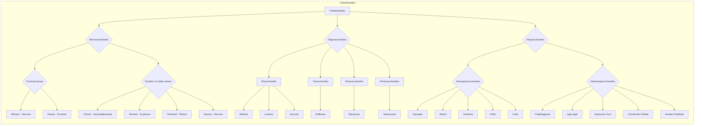
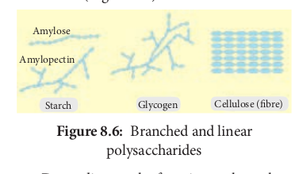
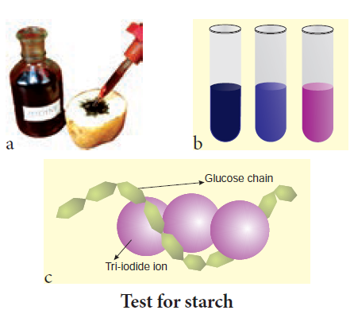
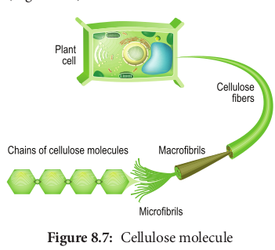
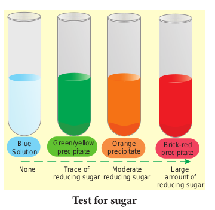

Carbohydrates are organic compounds made of carbon and water. Thus one molecule of water combines with a carbon atom to form CH2O and is repeated several (n) times to form **(CH2O)n** where n is an integer ranging from 3–7. These are also called as **saccharides**. The common term sugar refers to a simple carbohydrate such as a monosaccharide or disaccharide that tastes sweet are soluble in water (Figure 8.7).

### Monosaccharides – The Simple Sugars

**Monosaccharides** are relatively small molecules constituting single sugar unit.

Glucose has a chemical formula of C6H12O6. It is a six carbon molecule and hence is called as **hexose.**

All monosaccharides contain one or two functional groups. Some are aldehydes, Eg: glucose and are referred as **aldoses**; other are ketones, Eg: fructose and are referred as **ketoses**.

### Disaccharides

Disaccharides are formed when **two monosaccharides** join together. An example is **sucrose**. Sucrose is formed from a molecule of α-glucose and a molecule of fructose. This is a condensation reaction releasing water. The bond formed between the glucose and fructose molecule by removal of water is called **glycosidic bond**. This is another example of strong, covalent bond.

In the reverse process, a disaccharide is digested to the component monosaccharide in a hydrolysis reaction. This reaction involves addition of a water (hydro) molecule and splitting (lysis) of the glycosidic bond.

### Polysaccharides

These are made of **hundreds of monosaccharide units**. Polysaccharides also called "**Glycans**". Long chain of branched or unbranched monosaccharides are held together by glycosidic bonds. Polysaccharide is an example of giant molecule, a macromolecule and consists of only one type of monomer. Polysaccharides are insoluble in water and are sweetless. **Cellulose** is an example built from repeated units of glucose monomer (Figure 8.6).

Depending on the function, polysaccha- rides are of two types - **storage polysaccha- ride and structural polysaccharide.**

### Starch

Starch is a storage polysaccharide made up of repeated units of **amylose and amylopectin**. Starch grains are made up of successive layers of amylose and amylopectin, which can be seen as growth rings. Amylose is a linear, unbranched polymer which makes up 80% of starch. Amylopectin is a polymer with some 1, 6 linkages that gives it a branched structure.

### Test for Starch

We test the presence of starch by adding a solution of iodine in potassium iodide. Iodine molecules fit nearly into the starch helix, producing a **blue-black colour**.

a. Test on potato; b. test on starch at varied concentrations; c. starch – iodine reaction

### Celluloses

Cellulose is a structural polysaccharide made up of thousands of glucose units. In this case, β-glucose units are held together by 1,4 glycosidic linkage, forming long unbranched chains. Cellulose fibres are straight and uncoiled. It has many industrial uses which include cellulose fibres as cotton, nitrocellulose for explosives, cellulose acetate for fibres of multiple uses and cellophane for packing (Figure 8.7).

### Chitin

Chitin is a homo polysaccharide with amino acids added to form **mucopolysaccharide**. The basic unit is a nitrogen containing glucose derivative known as **N-acetyl glucosamine.** It forms the exoskeleton of insects and other arthropods. It is also present in the cell walls of fungi (Figure 8.8).

### Test for Reducing Sugars

Aldoses and ketoses are reducing sugars. This means that, when heated with an alkaline solution of copper (II) sulphate (a blue solution called **benedict’s solution**), the aldehyde or ketone group reduces Cu2+ ions to Cu+ ions forming brick red precipitate of copper(I) oxide. In the process, the aldehyde or ketone group is oxidised to a carboxyl group (–COOH). This reaction is used as test for reducing sugar and is known as **Benedict’s test.** The results of benedict’s test depends on concentration of the sugar. If there is no reducing sugar it remains blue.

- Sucrose is not a reducing suga.
- The greater the concentration of reducing

sugar, the more is the precipitate formed and greater is the colour change.
| OtherPolysaccharides | Structure | Functions |
| :------------------: | :-------: | :-------: |
| Inulin | Polymer of fructose | It is not metabolised in thehuman body and is readilyfiltered through the kidney |
| Hyaluronic acid | Heteropolymer of d glucuronic acidand D-N acetyl glucosamine | It accounts for the toughness andflexibility of cartilage and tendon |
| Agar | Mucopolysaccharide from red algae | Used as solidifying agent inculture medium in laborator y |
| Heparin | Glycosamino glycan contains variablysulphated disaccharide unit present inliver | Used as an anticoagulant |
| Chondroitinsulphate | Sulphated glycosaminoglycan composedof altering sugars (N-acetylglucosamineand glucuronic acid) | Dietery supplement fortreatment of osteoarthritis |
| Keratansulphate | Sulphated glycosaminoglycan and is astructural carbohydrate | Acts as cushion to absorbmechanical shock |

