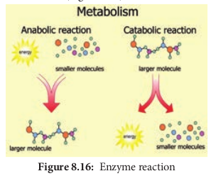
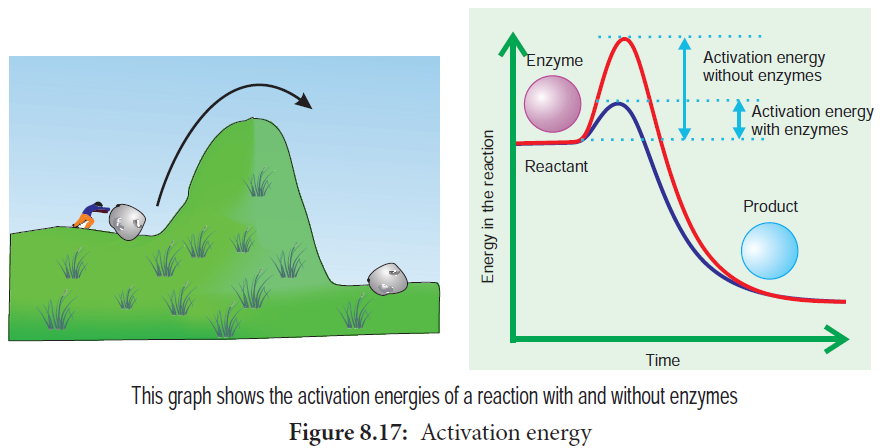
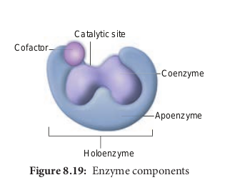

Enzymes are globular proteins that catalyse the many thousands of metabolic reactions taking place within cells and organism. The molecules involved in such reactions are metabolites. Metabolism consists of chains and cycles of enzyme-catalysed reactions, such as respiration, photosynthesis, protein synthesis and other pathways. These reactions are classified a.

- **anabolic** (building up of organic

molecules). Synthesis of proteins from amino acids and synthesis of polysaccharides from simple sugars are examples of anabolic reactions.

- **catabolic** (breaking down of larger molecules). Digestion of complex foods and the breaking down of sugar in respiration are examples of catabolic reactions (Figure 8.16).

Enzymes can be extracellular enzymesecreted and work externally exported from cells. Eg. digestive enzymes; or **intracellular enzymes** that remain within cells and work there. These are found inside organelles or within cells. Eg. insulin.

### Properties of Enzyme

- All are globular proteins.
- They act as catalysts and effective even in small quantity.
- They remain unchanged at the end of the reaction.
- They are highly specific.
- They have an active site where the reaction takes place.
- Enzymes lower activation energy of the reaction they catalyse.

As molecules react, they become unstable, high energy intermediates. But they are in this transition state only momentarily. Energy is required to raise molecules to this transition state and this minimum energy needed is called the **activation energy**. This could be explained schematically by ‘boulder on hillside’ model of activation energy (Figure 8.17).

### Lock and Key Mechanism of Enzyme

In a enzyme catalysed reaction, the starting substance is the substrate. It is converted to the product. The substrate binds to the specially formed pocket in the enzyme – **the active site**, this is called **lock and key mechanism** of enzyme action. As the enzyme and substrate form a **ES complex**, the substrate is raised in energy to a transition state and then breaks down into products plus unchanged enzyme (Figure 8.18).

### Enzyme Cofactors

Many enzymes require non-protein components called **cofactors** for their efficient activity. Cofactors may vary from simple inorganic ions to complex organic molecules. They are of three types: **inorganic ions, prosthetic groups and coenzymes** (Figure 8.19).

- **Holoenzyme** – active enzyme with its non protein component.

- **Apoenzyme** – the inactive enzyme without its non protein component.

- **Inorganic ions** help to increase the rate of reaction catalysed by enzymes. Example: Salivary amylase activity is increased in the presence of chloride ions.

- **Prosthetic groups** are organic molecules that assist in catalytic function of an enzyme. Flavin adenine dinucleotide (FAD) contains riboflavin (vit B2), the function of which is to accept hydrogen. ‘Haem’ is an iron-containing prosthetic group with an iron atom at its centre.

- **Coenzymes** are organic compounds which act as cofactors but do not remain attached to the enzyme. The essential chemical components of many coenzymes are vitamins. Eg. NAD, NADP, Coenzyme A, ATP

### Classification of Enzymes

Enzymes are classified into six groups based on their mode of action.

| Enzymes        | Mode of action                                                                                            | General scheme of reaction   | Example                          |
| -------------- | --------------------------------------------------------------------------------------------------------- | ---------------------------- | -------------------------------- |
| Oxidoreductase | Oxidation and reduction (redox) reactions                                                                 | A + B A + Bred ox ox red     | Dehydrogenase                    |
| Transferase    | Transfer a group of atoms from onemolecule to another                                                     | A – B + C A + C – B          | Transaminase,phosphotransfer-ase |
| Hydrolases     | Hydrolysis of substrate by addition of water molecule                                                     | A – B + H O A – H + B – OH2  | Digestive enzymes                |
| Isomerase      | Control the conversionof one isomer to anotherby transferring a groupof atoms from onemolecule to another | A – B – C A – C – B          | Isomerase                        |
| Lyase          | Break chemic al b ondwithout addition ofwater                                                             | A – B A + B                  | Decarboxylase                    |
| Ligase         | Formation of new chemical bonds using ATP as a source of energ y                                          | A + B + ATP A – B + ADP + Pi | DNA ligase                       |

### Uses of Enzymes Enzyme Source Application

| Enzyme                    | Source         | Application                                    |
| ------------------------- | -------------- | ---------------------------------------------- |
| Bacterialprotease         | Bacillus       | Biologicaldetergents                           |
| Bacterialglucoseisomerase | Bacillus       | Fructose syrupmanufacture                      |
| Fungallactase             | Kluyvero-myces | Breaking downof lactose toglucose andgalactose |
| Amylases                  | Aspergillus    | Removal ofstarch in wovencloth production      |
