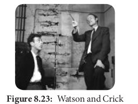
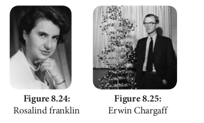
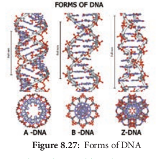

**Nucleic Acids** 

As we know DNA and RNA are the two kinds of nucleic acids. These were originally isolated from cell nucleus. They are present in all known **cells** and **viruses** with special coded genetic programme with detailed and specific instructions for each organism heredity.

DNA and RNA are polymers of monomers called **nucleotides**, each of which is composed of a nitrogen base, a pentose sugar and a phosphate. A purine or a pyrimidine and a ribose or deoxyribose sugar is called **nucleoside**. A nitrogenous base is linked to pentose sugar through n-glycosidic linkage and forms a nucleoside. When a phosphate group is attached to a nucleoside it is called a **nucleotide**. The nitrogen base is a heterocyclic compound that can be either a **purine** (two rings) or a **pyrimidine** (one ring). There are **2 types of purines – adenine (A) and guanine (G) and 3 types of pyrimidines – cytosine (C), thymine (T) and uracil (U)** (Figure 8.20 and 21).

A characteristic feature that differentiates DNA from RNA is that DNA contains nitrogen bases such as Adenine, guanine, thymine (5-methyl uracil) and cytosine and the RNA contains nitrogen bases such as adenine, guanine, cytosine and uracil instead of thymine. The nitrogen base is covalently bonded to the sugar ribose in RNA and to deoxyribose (ribose with one oxygen removed from C~2~) in DNA. Phosphate group is a derivative of (PO~4~ ^3-^) phosphoric acid, and forms phosphodiester linkages with sugar molecule (Figure 8.22).

### Formation of Dinucleotide and Polynucleotide

Two nucleotides join to form **dinucleotide** that are linked through 3′-5′ phosphodiester linkage by condensation between phosphate groups of one with sugar of other. This is repeated many times to make **polynucleotide**.

| Nucleoside                            | Nucleotide                                           |
| ------------------------------------- | ---------------------------------------------------- |
| It is a combination ofbase and sugar. | It is a combinationof nucleoside andphosphoric acid. |
| Examples                              | Examples                                             |
| Adenosine = Adenine+ Ribose           | Adenylic acid =Adenosine +Phosphoric acid            |
| Guanosine = Guanine + Ribose          | Guanylic acid =Guanosine +Phosphoric acid            |
| Cytidine = Cytosine+ Ribose           | Cytidylic acid =Cytidine +Phosphoric acid            |
| Deoxythymidine= Thymine +Deoxyribose  | Uridylic acid =Uridine +Phosphoric acid              |

### Structure of DNA

Watson and Crick shared the **Nobel Prize** in **1962** for their discovery, along with **Maurice Wilkins**, who had produced the crystallographic data supporting the model.

**Rosalind Franklin** (1920–1958) had earlier produced the first clear crystallographic evidence for a helical structure. **James Watson** and **Francis Crick** of Cavendish laboratory in Cambridge built a scale model of double helical structure of DNA which is the most prevalent form of DNA, the **B-DNA**. This is the secondary structure of DNA.

As proposed by **James Watson and Francis Crick**, DNA consists of right handed double helix with 2 helical polynucleotide chains that are coiled around a common axis to form right handed B form of DNA. The coils are held together by hydrogen bonds which occur between complementary pairs of nitrogenous bases. The sugar is called **2**′**\-deoxyribose** because there is no hydroxyl at position 2′. Adenine and thiamine base pairs has two hydrogen bonds while guanine and cytosine base pairs have three hydrogen bonds.

As published by **Erwin Chargaff** in 1949, a purine pairs with pyrimidine and vice versa. Adenine (A) always pairs with Thymine (T) by double bond and Guanine (G) always pairs with Cytosine (C) by triple bond.

### Features of DNA

- If one strand runs in the 5′-3′ direction,the other runs in 3′-5′ direction and thus are antiparallel (they run in opposite direction). The 5′ end has the phosphate group and 3’end has the OH group.

- The angle at which the two sugars protrude from the base pairs is about 120°, for the narrow angle and 240° for the wide angle. The narrow angle between the sugars generates a **minor groove** and the large angle on the other edge generates **major groove.**

- Each base is 0.34 nm apart and a complete turn of the helix comprises 3.4 nm or 10 base pairs per turn in the predominant B form of DNA.

- DNA helical structure has a diameter of 20 A° and a pitch of about 34 A°. X-ray crystal study of DNA takes a stack of about 10 bp to go completely around the helix (360°).

- Thermodynamic stability of the helix and specificity of base pairing includes (i) the hydrogen bonds between the complementary bases of the double helix (ii) stacking interaction between bases tend to stack about each other perpendicular to the direction of helical axis. Electron cloud interactions (∏ – ∏) between the bases in the helical stacks contribute to the stability of the double helix.

- The phosphodiester linkages gives an inherent polarity to the DNA helix. They form strong covalent bonds, gives the strength and stability to the polynucleotide chain (Figure 8.32).

- Plectonemic coiling - the two strands](8.26.png "") of the DNA are wrapped around each other in a helix, making it impossible to simply move them apart without breaking the entire structure. Whereas in paranemic coiling the two strands simply lie alongside one another, making them easier to pull apart.

- Based on the helix and the distance between each turns, the DNA is of three forms – **A DNA, B DNA and Z DNA** (Figure 8.27).

### Ribonucleic Acid (RNA) Ribonucleic acid

(**RNA**) is a polymeric molecule essential in various biological roles in

| Feature                                 | B-DNA           | A-DNA          | Z-DNA        |
| --------------------------------------- | --------------- | -------------- | ------------ |
| Type of helix                           | Right-handed    | Right-handed   | Left-handed  |
| Helical diameter (nm)                   | 2.37            | 2.55           | 1.84         |
| Rise per base pair (nm)                 | 0.34            | 0.29           | 0.37         |
| Distance per complete turn (pitch) (nm) | 3.4             | 3.2            | 4.5          |
| Number of base pairs per complete turn  | 10              | 11             | 12           |
| Topology of major groove                | Wide, deep      | Narrow, deep   | Flat         |
| Topology of minor groove                | Narrow, shallow | Broad, shallow | Narrow, deep |

coding, decoding, regulation and expression of genes. RNA is single stranded and is unstable when compared to DNA.

### Types of RNA

- **mRNA (messenger RNA):** Single stranded, carries a copy of instructions for assembling amino acids into proteins. It is very unstable and comprises 5% of total RNA polymer. Prokaryotic mRNA (Polycistronic) carry coding sequences for many polypeptides. Eukaryotic mRNA (Monocistronic) contains information for only one polypeptide.

- **tRNA (transfer RNA):** Translates the code from mRNA and transfers amino acids to the ribosome to build proteins. It is highly folded into an elaborate 3D structure and comprises about 15% of total RNA. It is also called as **soluble RNA**.

- **rRNA (ribosomal RNA):** Single stranded, metabolically stable, make up the two subunits of ribosomes. It constitutes 80% of the total RNA. It is a polymer with varied length from 120–3000 nucleotides and gives ribosomes their shape. Genes for rRNA are highly conserved and employed for phylogenetic studies (Figure 8.28).
  
