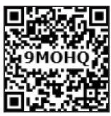
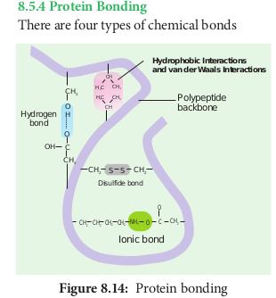

Proteins are the most diverse of all macromolecule. Proteins make up 2/3 of total dry mass of a cell. The term protein was coined by **Gerardus Johannes Mulder** and is derived form a _greek_ word proteos which means of the first rank.

Amino acids are building blocks of proteins. There are about 20 different amino acids exist naturally. All amino acids have a basic skeleton consisting of a carbon (a-carbon) linked to a basic amino group.

(NH2), an acidic carboxylic group (COOH) and a hydrogen atom (H) and side chain or variable R group. The amino acid is both an acid and a base and hence is called **amphoteric**.

A **zwitterion** also called as **dipolar ion**, is a molecule with two or more functional groups, of which at least one has a positive and other has a negative electrical charge and the net charge of the entire molecule is zero. The pH at which this happens is known as the **isoelectric point** (Figure 8.10).

### Classification of Amino acids

Based on the R group amino acids are classified as acidic, basic, polar, non-polar.

The amino group of one amino acid reacts with carboxyl group of other amino acid, forming a **peptide bond**. Two amino acids can react together with the loss of water to form a **dipeptide**. Long strings of amino acids linked by peptide bonds are called **polypeptides**. In 1953, Fred Sanger first sequenced the Insulin protein (Figure 8.11 a and b).

### Structure of Protein

Protein are synthesised on the ribosome as a linear sequence of amino acids which are held together by peptide bonds. After synthesis, the protein attains conformational change into a specific 3D form for proper functioning. According to the mode of folding, four levels of protein organisation have been recognised namely primary, secondary, tertiary and quaternary (Figure 8.12).

- The **primary structure** is linear arrangement of amino acids in a polypeptide chain.

- **Secondary structure** arises when various functional groups are exposed on outer surface of the molecular interaction by forming hydrogen bonds. This causes the aminoacid chain to twist into coiled configuration called α-**helix** or to fold into a flat β-pleated sheets.

- **Tertiary protein structure** arises when the secondary level proteins fold into globular structure called domains.

- **Quaternary protein structure** may be assumed by some complex proteins in which more than one polypeptide forms a large multiunit protein. The individual polypeptide chains of the protein are called **subunits** and the active protein itself is called a **multimer.**

For example: Enzymes serve as catalyst for chemical reactions in cell and are non-specific. Antibodies are complex glycoproteins with specific regions of attachment for various organisms.

### Protein Denaturation

Denaturation is the loss of 3D structure of protein. Exposure to heat causes atoms to vibrate violently, and this disrupts the hydrogen and ionic bonds. Under these conditions, protein molecules become elongated, disorganised strands. Agents such as soap, detergents, acid, alcohol and some disinfectants disrupt the interchain bond and cause the molecule to be non-functional (Figure 8.13).

### Protein Bonding

There are four types of chemical bonds

**Hydrogen Bond**
It is formed between some hydrogen atoms of oxygen and nitrogen in polypeptide chain. The hydrogen atoms have a small positive charge and oxygen and nitrogen have small negative charge. Opposite charges attract to form hydrogen bonds.

Though these bonds are weak, large number of them maintains the molecule in 3D shape (Figure 8.14).

**Ionic Bond**
It is formed between any charged groups that are not joined together by peptide bond. It is stronger than hydrogen bond and can be broken by changes in pH and temperature.

**Disulfide Bond**
Some amino acids like cysteine and methionine have sulphur. These form disulphide bridge between sulphur atoms and amino acids.

**Hydrophobic Bond**
This bond helps some protein to maintain structure. When globular proteins are in solution, their hydrophobic groups point inwards away from water.

### Test for Proteins

The biuret test is used as an indicator for presence of protein as it gives a purple colour in the presence of peptide bonds (–C–N–). To protein solution, an equal quantity of sodium hydroxide solution is added and mixed. Then a few drops of 0.5% copper (II) sulphate is added with gentle mixing. A distinct purple colour develops without heating (Figure 8.15 a and b).

