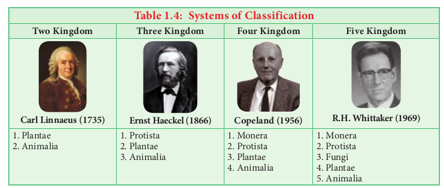
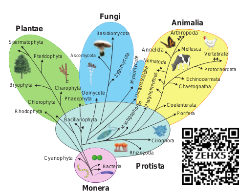
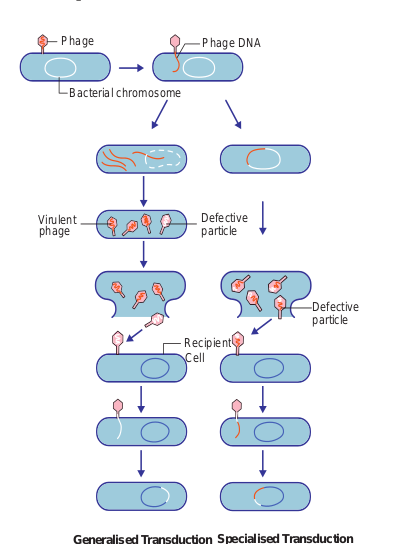
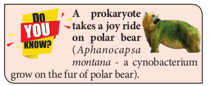
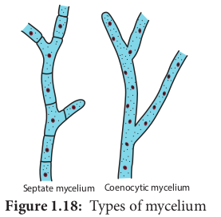
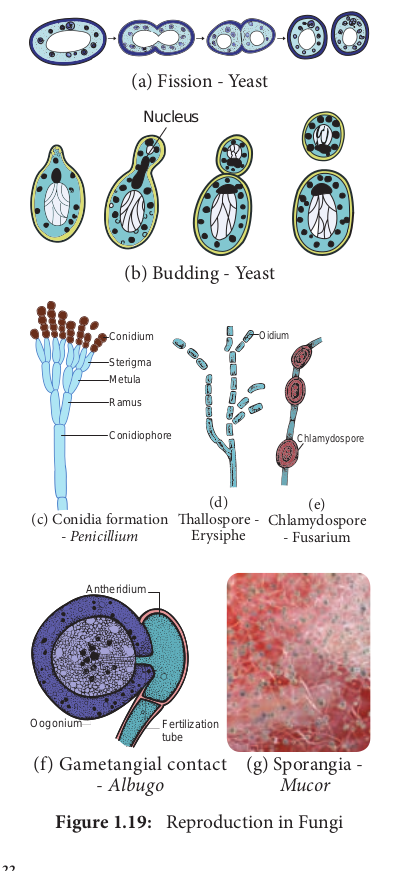

  

The learner will be able to, _- Differentiate living and non-living_

_things. 
- Appreciate the attributes of living_

_organisms. 
- Compare the different classifications_

_proposed by biologists. 
- Recognize the general characters,_

_structure and reproduction of Bacteria._

_- Identify the characteristic features of Archaebacteria, Cyanobacteria, Mycoplasma and Actinomycetes._

_- Describe the characteristic features of fungi._

_- Outline the classification of fungi. 
- Describe the structure and_

_reproduction in Agaricus. 
- Discuss the structure and uses of_

_Mycorrhizae and Lichens._

**Chapter**

**1**

**Learning Objectives**

**Chapter Outline 1.1** Attributes of Living organisms **1.2** Viruses **1.3** Classification of Living world **1.4** Bacteria **1.5** Fungi

Earth was formed some 4.6 billion years ago. It is the life supporting planet with land forms like mountains, plateaus, glaciers, etc. Life on earth exists within a complex structure called **biosphere**. There exist many mysteries and

**Unit Li**

**Li**  

wonders in the living world some are not visible but the activity of some capture the attention of all. For example the response of sun flower to the sunlight, the twinkling firefly in the dark forest, the rolling water droplets on the surface of lotus leaf, the closure of the leaf of venus fly trap on insect touch and a squid squeezing ink to escape from its predator. From this it is clear that the wonder planet earth harbours both landforms and life forms. Have you thought of DNA molecule? It is essential for the regulation of life and is made up of carbon, hydrogen, oxygen, nitrogen and phosphorus. thus nonliving and living things exist together to make our planet unique.

According to a survey made by Mora _et al.,_ 2011 the number of estimated species on earth is 8.7 million. The living world includes microbes, plants, animals and human beings which possess unique and distinct characteristic feature.

**I: Diversity of ving World**

**ving World**

  

## Attributes of living organisms
 The attributes of living organisms are given below and is represented in Figure 1.1.

**ExcretionIrritabilityRespiration**

**Metabolism ATTRIBUTES**

**OF LIVING ORGANISMS**

**MovementNutritionGrowth**

**Reproduction**

**Growth** Growth is an intrinsic property of all living organisms through which they can increase cells both in number and mass. Unicellular and multicellular organisms grow by cell division. In plants, growth is indefinite and occurs throughout their life. In animals, growth is definite and occurs for some period. Growth in non-living objects is **extrinsic**. Mountains, boulders and sand mounds grow by simple aggregation of material on the surface. Living cells grow by the addition of new protoplasm within the cells. Therefore, growth in living thing is **intrinsic**. In unicellular organisms like Bacteria and Amoeba growth occurs by cell division and such cell division also leads to the growth of their population. Hence, growth and reproduction are mutually inclusive events.

**Cellular structure** All living organisms are made up of cells which may be prokaryotic or eukaryotic. **Prokaryotes** are unicellular, lack membrane bound nuclei and organelles like mitochondria, endoplasmic reticulum, golgi bodies and so on (Example: Bacteria and Blue green algae). In **Eukaryotes** a definite nucleus and membrane bound organelles are present. Eukaryotes may be unicellular (_Amoeba_) or multicellular (_Oedogonium_).  

**Reproduction** Reproduction is one of the fundamental characteristic features of living organisms. It is the tendency of a living organism to perpetuate its own species. There are two types of reproduction namely asexual and sexual (Figure 1.2).

Nucleus

**(a) (b)**

**(c) (d) Figure 1.2:** Types of Asexual Reproduction (a) Conidia formation-_Penicillium_, (b) Budding-Yeast, (c) Fragmentation- _Spirogyra,_ (d) Regeneration-_Planaria_ Asexual reproduction refers to the production of the progeny possessing features more or less similar to those of parents. The sexual reproduction brings out variation through **recombination.** Asexual reproduction in living organisms occurs by the production of conidia (_Aspergillus, Penicillium_), budding (_Hydra_ and Yeast), binary fission (Bacteria and _Amoeba_) fragmentation (_Spirogyra_), protonema (Mosses) and regeneration (_Planaria_). Exceptions are the sterile worker bees and mules.

**Response to stimuli** All organisms are capable of sensing their environment and respond to various physical, chemical and biological stimuli. Animals sense

  

their surroundings by sense organs. This is called **Consciousness**. Plants also respond to the stimuli. Bending of plants towards sunlight, the closure of leaves in touch-me-not plant to touch are some examples for response to stimuli in plants. This type of response is called **Irritability.**

**Homeostasis** Property of self-regulation and tendency to maintain a steady state within an external environment which is liable to change is called **Homeostasis**. It is essential for the living organism to maintain internal condition to survive in the environment.

**Metabolism** The sum of all the chemical reactions taking place in a cell of living organism is called **metabolism**. It is broadly divided into **anabolism** and **catabolism.** The difference between anabolism and catabolism is given in Table 1.1.

**Table 1.1: Difference between anabolism and catabolism**

**Anabolism Catabolism** Building up process Breaking down process

Smaller molecules combine together to form larger molecule

Larger molecule break into smaller units

Chemical energy is formed and stored

The stored chemical energy is released and used

Example: Synthesis of proteins from amino acids

Example: Breaking down of glucose to CO2 and water

Movement, Nutrition, Respiration and Excretion are also considered as the property of living things. The levels of organization in living organism begin with atoms and end in **Biosphere**. Each level cannot exist in isolation instead they form levels of integration as given in Figure 1.3.  

**Atoms Mixture**

**Molecules & Compounds**

**Crystals**

**Organelles Colloids**

**Living cells**

**Tissues**

**Organs**

**Organ systems**

**Individual organism**

**Population**

**Community**

**Ecosystem**

**Biosphere**

**N o**

**n L**

**iv in**

**L iv**

**in g**

**Ecosystem**

**Individual**

**organism**

**Living cellsI**

**II**

**III**

**Activity 1.1** Collect _Vallisneria_ leaves or _Chara_ from nearby aquarium and observe a leaf or _Chara_ thallus (internodal region)under the microscope. You could see cells clearly under the microscope. Could you notice the movement of cytoplasm? The movement of cytoplasm is called cytoplasmic streaming or **cyclosis**.

## Viruses
 Did you go through the headlines of newspapers in recent times? Have you heard of the terms EBOLA, ZIKA, AIDS, SARS, H1N1 etc.? There are serious entities which are considered as **“Biological Puzzle”** and cause disease in man. They are called viruses. We have learnt about the attributes of living world in the previous chapter. Now we shall discuss about viruses which connect the living and nonliving world.

| Tab l e 1.1: Dif ferenc e b e twe enana b o lis m a nd c ata b o lis m |
|------|------|
| Ana b o lis m |C ata b o lis m |
| Building up process |Breaking down process |
| Smaller moleculescombine togetherto form largermolecule |Larger moleculebreak into smallerunits |
| Chemical energy isformed and stored |The stored chemicalenergy is releasedand used |
| Example: Synthesisof proteins fromamino acids |Example: Breakingdown of glucose toCO  and water2 |
  

The word virus is derived from Latin meaning ‘Poison’. Viruses are sub- microscopic, obligate intracellular parasites. They have nucleic acid core surrounded by protein coat. Viruses in their native state contain only a single type of nucleic acid which may be either DNA or RNA. The study of viruses is called **Virology**.

An American Scientist obtained virus in crystallised form from infected tobacco juice in the year 1935. He was jointly awarded “Nobel Prize” with Dr. J.H. Northrop for Chemistry in 1946.

**W.M. Stanley (1904-1971)**

### Milestones in Virology
 1796 Edward Jenner used vaccination for

small pox 1886 Adolf Mayer demonstrated the

infectious nature of Tobacco mosaic virus using sap of mosaic leaves

1892 Dimitry Ivanowsky proved that viruses are smaller than bacteria

1898 M.W. Beijierink defined the infectious agent in tobacco leaves as ῾_Contagium vivum fluidum_’

1915 F.W.Twort identified Viral infection in Bacteria

1917 d’Herelle coined the term ‘Bacteriophage’

1984 Luc Montagnier and Robert Gallo discovered HIV (Human Immuno Deficiency Virus).

### Size and Shape
 Viruses are ultramicroscopic particles. They are smaller than bacteria and their diameter range from 20 to 300 nm. (1nm = 10-9metres). Bacteriophage measures about 10-100 nm in size. The size of TMV is 300×20 nm.

Generally viruses are of three types based on shape and symmetry (Figure 1.4).  

i. Cuboid symmetry – Example: Adenovirus, Herpes virus.

ii. Helical symmetry – Example: Influenza virus, TMV.

iii. Complex or Atypical – Example: Bacteriophage, Vaccinia virus.

(a) Adenovirus, (b) Tobacco Mosaic virus, (c) T4 Bacteriophage

Protein

DNA

Fibre Capsid

RNA Head DNA Collar

Sheath

Basal plate

Tail fibre

**(a)** (**b) (c)**

### Characteristic Features of Viruses Living Characters
 - Presence of nucleic acid and protein. 
- Capable of mutatio. 
- Ability to multiply within living cells. 
- Able to infect and cause diseases in living

beings. 
- Show irritability. 
- Host –specific **Non-living Characters*. 
- Can be crystallized. 
- Absence of metabolism. 
- Inactive outside the host. 
- Do not show functional autonomy. 
- Energy producing enzyme system is absent. ### Classification of Viruses
 Among various classifications proposed for viruses the classification given by David Baltimore in the year 1971 is given below. The classification is based on mechanism of RNA production, the nature of the genome (single stranded –ss or double stranded - ds), RNA or DNA, the use of reverse transcriptase (RT), ss RNA may be (+) sense or (–) antisense. Viruses are classified into seven classes (Table 1.2). **Viral genome** Each virus possesses only one type of nucleic acid either DNA or RNA. The nucleic acid may be in a linear or circular form. Generally

  

nucleic acid is present as a single unit but in wound tumour virus and in influenza virus it is found in segments. The viruses possessing DNA are called **‘Deoxyviruses’** whereas those possessing RNA are called **‘Riboviruses’**. Majority of animal and bacterial viruses are DNA viruses (HIV is the animal virus which possess RNA). Plant viruses generally contain RNA (Cauliflower Mosaic virus possess DNA). The nucleic acids may be single stranded or double stranded. On the basis of nature of nucleic acid viruses are classified into four Categories. They are Viruses with ssDNA (Parvo viruses), dsDNA (Bacteriophages), ssRNA (TMV)and dsRNA(Wound Tumour Virus).

**Table 1.2: Different Classes of viruses Class Example** Class 1 – Viruses with dsDNA Class 2 –Viruses with (+) sense ssDNA Class 3 – Viruses with dsRNA Class 4 – Viruses with (+)sense ssRNA Class 5 – Viruses with (–)sense ssRNA Class 6 – Viruses with (+) sense ssRNA

–RT: that replicate with DNA intermediate in life cycle

Class 7 – Viruses with ds DNA –RT: that replicate with RNA intermediate in life cycle

Adeno viruses Parvo viruses Reo viruses Toga viruses Rhabdo viruses Retro viruses

Hepadna viruses

### Tobacco Mosaic Virus (TMV)
 Tobacco mosaic virus was discovered in 1892 by Dimitry Ivanowsky from the Tobacco plant. Viruses infect healthy plants through vectors like aphids, locusts etc. The first visible symptom of TMV is discoloration of leaf colour along the veins and show typical yellow and green mottling which is the mosaic symptom. The downward curling and distortion of young apical leaves occurs, plant becomes stunted and yield is affected.

**Structure** Electron microscopic studies have revealed that TMV is a rod shaped (Figure 1.4b)  

helical virus measuring about 300x20nm with a molecular weight of 39x106 Daltons. The virion is made up of two constituents, a protein coat called **capsid** and a core called **nucleic acid**. The protein coat is made up of approximately 2130 identical protein subunits called **capsomeres** which are present around a central single stranded RNA molecule. The genetic information necessary for the formation of a complete TMV particle is contained in its RNA. The RNA consists of 6,500 nucleotides.

### Bacteriophage
 Viruses infecting bacteria are called **Bacteriophages**. It literally means ‘eaters of bacteria’ (Gr: Phagein = to eat). Phages are abundant in soil, sewage water, fruits, vegetables, and milk.

**Structure of T4 bacteriophage** The T4 phage is tadpole shaped and consists of head, collar, tail, base plate and fibres (Figure 1.4). The head is hexagonal which consists of about 2000 identical protein subunits. The long helical tail consists of an inner tubular core which is connected to the head by a collar. There is a base plate attached to the end of tail. The base plate contains six spikes and tail fibres. These fibres are used to attach the phage on the cell wall of bacterial host during replication. A dsDNA molecule of about 50 µm is tightly packed inside the head. The DNA is about 1000 times longer than the phage itself. ### Multiplication or Life Cycle of

**Phages** Phages multiply through two different types of life cycle. a. Lytic or Virulent cycle b. Lysogenic or Avirulent life cycle. **_a. Lytic Cycle_** During lytic cycle of phage, disintegration of host bacterial cell occurs and the progeny virions are released (Figure 1.5a). The steps involved in the lytic cycle are as follows:

| Tab l e 1.2: Dif ferent C l ass es o f v ir us es |
|------|------|
| Class |Example |
| Class 1 – Viruses with dsDNAClass 2 –Viruses with (+) sense ssDNAClass 3 – Viruses with dsRNAClass 4 – Viruses with (+)sense ssRNAClass 5 – Viruses with (–)sense ssRNAClass 6 – Viruses with (+) sense ssRNA–RT: that replicate with DNAintermediate in life cycleClass 7 – Viruses with ds DNA –RT:that replicate with RNAintermediate in life cycle |Adeno virusesParvo virusesReo virusesToga virusesRhabdo virusesRetro virusesHepadnaviruses |
  

**(i) Adsorption** Phage (T4) particles interact with cell wall of host (_E. coli_). The phage tail makes contact between the two, and tail fibres recognize the specific receptor sites present on bacterial cell surface. The lipopolysaccharides of tail fibres act as receptor in phages. The process involving the recognition of phage to bacterium is called **landing**. Once the contact is established between tail fibres and bacterial cell, tail fibres bend to anchor the pins and base plate to the cell surface. This step is called **pinning. (ii) Penetration** The penetration process involves mechani- cal and enzymatic digestion of the cell wall of the host. At the recognition site phage digests certain cell wall structure by viral enzyme (lysozyme). After pinning the tail sheath contracts (using ATP) and appears shorter and thicker. After contraction of the base plate enlarges through which DNA is injected into the cell wall without using met- abolic energy. The step involving injection of DNA particle alone into the bacterial cell is called **Transfection**. The empty protein coat leaving outside the cell is known as **‘ghost’**. **(iii) Synthesis** This step involves the degradation of bacterial chromosome, protein synthesis and DNA replication. The phage nucleic acid takes over the host biosynthetic machinery. Host DNA gets inactivated and breaks down. Phage DNA suppresses the synthesis of bacterial protein and directs the metabolism of the cell to synthesis the proteins of the phage particles and simultaneously replication of Phage DNA also takes place. **(iv) Assembly and Maturation** The DNA of the phage and protein coat are synthesized separately and are assembled to form phage particles. The process of assembling the phage particles is known as **maturation**. After 20 minutes of infection, about 300 new phages are assembled.  

**(v) Release** The phage particle gets accumulated inside the host cell and are released by the lysis of host cell wall.

Bacterial genome

Capsid DNA

Phage DNA

Host cell

Release of new phage particle

Adsorption

Penetration

Synthesis

Assembly and maturation

Release

Phage

Phage DNA

Bacterial chromosome

Circular phage DNA

Prophage

Reproducing bacterial cell

(a) Lytic cycle (b) Lysogenic cycle

**_b. Lysogenic Cycle_** In the lysogenic cycle the phage DNA gets integrated into host DNA and gets multiplied along with nucleic acid of the host. No independent viral particle is formed (Figure 1.5b).

As soon as the phage injects its linear DNA into the host cell, it becomes circular and integrates into the bacterial chromosome by recombination. The integrated phage DNA is now called **prophage.** The activity of the prophage gene is repressed by two repressor proteins which are synthesized by phage genes. This checks the synthesis of new phages within the host cell. However, each time the bacterial

Viruses infecting blue green algae are called **Cyanophages** and are first reported by Safferman

and Morris in the year 1963(Example LPP1 - _Lyngbya, Plectonema_ and _Phormidium_). Similarly, Hollings(1962) reported viruses infecting cultivated Mushrooms and causing die back disease. The viruses attacking fungi are called **Mycoviruses** or **Mycophages.**

  

cell divides, the prophage multiplies along with the bacterial chromosome. On exposure to UV radiation and chemicals the excision of phage DNA may occur and results in lytic cycle.

**Virion** is an intact infective virus particle which is non-replicating outside a host cell.

**Viroid** is a circular molecule of ssRNA without a capsid and was discovered by T.O.Diener in the year 1971. The RNA of viroid has low molecular weight. Viroids cause citrus exocortis and potato spindle tuber disease in plants.

**Virusoids** were discovered by J.W.Randles and Co-workers in 1981.They are the small circular RNAs which are similar to viroids but they are always linked with larger molecules of the viral RNA.

**Prions** were discovered by Stanley B. Prusiner in the year 1982 and are protein- aceous infectious particles. They are the caus- ative agents for about a dozen fatal degenerative disorders of the central nervous system of humans and other animals. For example Creutzfeldt – Jakob Disease (CJD), Bovine Spongiform Encephalopathy (BSE) – com- monly known as mad cow disease and scrapie disease of sheep.

**Table 1.3: Vi Plant diseases Animal disea**

1.Tobacco mosaic 2. Cauliflower mosaic 3. Sugarcane mosaic 4. Potato leaf roll 5. Bunchy top of banana 6. Leaf curl of papaya 7. Vein clearing of Lady’s finger 8. Rice Tungro disease 9. Cucumber mosaic 10. Tomato mosaic disease

1\. Foot and m cattle

2\. Rabies of d 3. Encephalom  

### Viral diseases
 Viruses are known to cause disease in plants, animals and Human beings (Figure 1.6). A list of viral disease is given in Table 1.3.

**(a)**

**(b)**

Blister like pustules

**ral diseases ses Human diseases**

outh disease of

og yelitis of horse

1\. Common cold 2. Hepatitis B 3. Cancer 4. SARS(Severe Acute

Respiratory Syndrome) 5. AIDS(Acquired Immuno

Deficiency Syndrome) 6. Rabies 7. Mumps 8. Polio 9. Chikungunya 10. Small Pox 11. Chicken pox 12. Measles

Streaks on Tulip flowers are due to Tulip Breaking Virus which belong to Potyviridae group.

Viruses of Baculoviridae group are commercially exploited as insecticides. Cytoplasmic Polyhedrosis Granulo viruses and Entomopox viruses were employed as potential insecticides.

|------|------|

| Table 1.3: Viral diseases |
|------|------|------|
| Plant diseases |Animal diseases |Human diseases |
| 1.Tobacco mosaic2. Cauliflower mosaic3. Sugarcane mosaic4. Potato leaf roll5. Bunchy top of banana6. Leaf curl of papaya7. Vein clearing of Lady’s finger8. Rice Tungro disease9. Cucumber mosaic10. Tomato mosaic disease |1. Foot and mouth disease ofcattle2. Rabies of dog3. Encephalomyelitis of horse |1. Common cold2. Hepatitis B3. Cancer4. SARS(Severe AcuteRespirator y Syndrome)5. AIDS(Acquired ImmunoDeficiency Syndrome)6. Rabies7. Mumps8. Polio9. Chikungunya10. Small Pox11. Chicken pox12. Measles |
  

## Classification of Living World
 From the previous chapter we know that the planet earth is endowed with living and non -living things. In our daily life we see several things in and around us. Imagine, you are on a trip to Hill station. You are enjoying the beauty of mountains, dazzling colour of the flowers, and melodious sound of the birds. You may be capturing most of the things you come across in the form of photography. Now, from this experience can you mention the objects you have come across? Can you record your observations and tabulate them?. How will you organize the things? Will you place mountain and flowers together or tall trees and trailing herbs in one category or place it in different category? If you place it in different category, what made you to place them in different category? So classification is essential and could be done only by understanding and comparing the things based on some characters. In this chapter we shall learn about classification of living world.

Many attempts have made in the past to classify the organisms on earth. **Theophrastus**, “Father of Botany” used the morphological characters to classify plants into trees, shrubs and herbs. Aristotle classified animals into two groups. i.e., _Enaima_ (with red blood) and _Anaima_ (without red blood).

Carl Linnaeus classified living world into two groups namely Plants and Animals based

**Table 1.4: Systems Two Kingdom Three Kingdom**

**Carl Linnaeus (1735) Ernst Haeckel (1866)** 1\. Plantae 2. Animalia

1\. Protista 2. Plantae 3. Animalia  

on morphological characters. His classification faced major setback because Prokaryotes and Eukaryotes were grouped together. Similarly fungi, heterotrophic organisms were placed along with the photosynthetic plants. In course of time, the development of tools compelled taxonomists to look for different areas like cytology, anatomy, embryology, molecular biology, phylogeny etc., for classifying organisms on earth. Thus, new dimensions to classifications were put forth from time to time. ### Need of Classification
 Classification is essential to achieve following needs. 
- To relate things based on common

characteristic features. 
- To define organisms based on the salient

features. 
- Helps in knowing the relationship

amongst different groups of organisms. 
- It helps in understanding the evolutionary

relationship between organisms. ### Classification of Living World
 A comparison of classification proposed for classification of living world is given in Table 1.4. ### Five Kingdom Classification
 R.H.Whittaker, an American taxonomist proposed five Kingdom classification in the year 1969. The Kingdoms include **Monera,**

**of Classification Four Kingdom Five Kingdom**

**Copeland (1956) R.H. Whittaker (1969)**

1\. Monera 2. Protista 3. Plantae 4. Animalia

1\. Monera 2. Protista 3. Fungi 4. Plantae 5. Animalia

| Tab l e 1.4: Systems o f C l ass if i c ati on |
|------|------|------|------|
| Two K in gd om |Thr e e K in gd om |Four K in gd om |Fiv e K in gd om |
| Carl Linnaeus (1735) |Ernst Haeckel (1866) |C opeland (1956) |R.H. Whittaker (1969) |
| 1. Plantae2. Animalia |1. Protista2. Plantae3. Animalia |1. Monera2. Protista3. Plantae4. Animalia |1. Monera2. Protista3. Fungi4. Plantae5. Animalia |
  

**Ta bl**

**e 1.**

**5: C**

**om pa**

**ri so**

**n of**

**F iv**

**e K**

**in gd**

**om s**

**C ri**

**te ri**

**a K**

**in gd**

**om M**

**on er**

**a Pr**

**ot is**

**ta Fu**

**ng i**

**Pl an**

**ta e**

**A ni**

**m al**

**ia**

**C el**

**l t yp**

**e** Pr

ok ar

yo tic

Eu ka

ry ot

ic Eu

ka ry

ot ic

Eu ka

ry ot

ic Eu

ka ry

ot ic

**Le ve**

**l o f**

**or ga**

**ni za**

**ti on**

M os

tly U

ni ce

llu la

r, ra

re ly

m ul

tic el

lu r

U ni

ce llu

la r

M ul

tic el

lu la

r an

d un

ic el

lu la

r Ti

ss ue

/o rg

an Ti

ss ue

/o rg

an /o

rg an

sy

st em

**C el**

**l w al**

**l** Pr

es en

t (m

ad e

up o

f Pe

pt id

og ly

ca n

an d

M uc

op ep

tid es

)

Pr es

en t i

n so

m e

(m ad

e up

o f

ce llu

lo se

), ab

se nt

in

ot he

rs

Pr es

en t (

m ad

e up

o f

ch iti

n or

c el

lu lo

se )

Pr es

en t (

m ad

e up

o f

ce llu

lo se

) ab

se nt

**N ut**

**ri ti**

**on** A

ut ot

ro ph

ic (P

ho to

tr op

hi c,

A ut

ot ro

ph ic

\- Ph

ot os

yn th

et ic

. H

et er

ot ro

ph ic

\- pa

ra si

tic o

r A

ut ot

ro ph

ic

(P ho

to sy

nt he

tic )

H et

er ot

ro ph

ic (H

ol oz

oi c)  

C he

m oa

ut ot

ro ph

ic )

H et

er ot

ro ph

ic (p

ar as

iti c

an d

sa pr

op hy

tic )

H et

er ot

ro ph

ic Sa

pr op

hy tic

**M ot**

**ili ty**

M ot

ile o

r no

n- m

ot ile

M ot

ile o

r no

n- m

ot ile

N on

\-m ot

ile M

os tly

N on

\-m ot

ile M

os tly

m ot

ile

**O rg**

**an is**

**m s**

A rc

ha eb

ac te

ri a,

Eu

ba ct

er ia

, C

ya no

ba ct

er ia

, A

ct in

om yc

et es

a nd

M

yc op

la sm

a

C hr

ys op

hy te

s, D

in of

la ge

lla te

s, Eu

gl en

oi ds

, S lim

e m

ol ds

, _A m_

_oe ba_

_, Pl_

_as m_

_od iu_

_m ,_

_Tr yp_

_an os_

_om a,_

_Pa_

_ra m_

_ec iu_

_m_

Ye as

t, M

us hr

oo m

s an

d M

ol ds

A lg

ae , B

ry op

hy te

s, Pt

er id

op hy

te s,

G ym

no sp

er m

s a nd

A

ng io

sp er

m s

Sp on

ge s,

In ve

rt eb

ra te

s a nd

Ve

rt eb

ra te

s

| msogdine Kivf Fn oorisapmoCle 1.5:baT |mogdinK |alinimaA |ticoyrkauE |nrgan/orgaissue/o temT sys |tenbsa |hicptro ic)o zoer loet oH (H |tileotly mos M |dntes a, ra tess teb braSponge Inver Verte |
|------|------|------|------|------|------|------|------|------|
| taenlaP |ticoyrkauE |nrgaissue/oT |fp oade ue)t (mresen llulosP ce |ic)etic thh nrop tosyutot hoA (P |tileon-motly NosM |des, nphyt es, ms a s, Bryo phyt osper permido ioslgae er ymn ngA Pt G A |
| ignFu |ticoyrkauE |rular llulallectiul d unicenM a |fp o e)losade u llur cet (mresen hitin oP c |phic- r icotro tic o phyter si roet ara pH p Sa |tileon-moN |smooshr su ldost, Ma d Me nY a |
| taisrotP |ticoyrkauE |rlalluniceU |t ine enmo f bsp o e), at in sresen ade u llulos hersP (m ce ot |ic.et hicutotrophic- hotosynth eterotropA P H |r tileootile o on-mM n |e, ysophytes, oflagellates, lenoids, Slim lds, Amoeba smodium, panosoma, ameciumhr ug o la ry arC Din E m P T P |
| arenMo |ticoyarkoPr |r,llula llurnice ulticetly U ly mos reM ra |dnn ap of lyca tides)t eppresen ade u eptidog ucoP (m P M |hic)putotrophic hototrophic, hemoautotro eterotrophic arasitic and aprophytic)A (P C H (p s |r tileootile o on-mM n |dnia, ia, es archaebacter ubacteria, yanobacter ctinomycet ycoplasmaA E C A M |
| iaeritrC |epl tyelC |ntiof o nizaavele rgL o |llll waeC |noitiutrN |ylittioM |msnisaOrg |
  

**Protista, Fungi, Plantae and Animalia** (Figure 1.7). The criteria adopted for the classification include cell structure, thallus organization, mode of nutrition, reproduction and phylogenetic relationship**.** A comparative account of the salient features of each Kingdom is given in Table 1.5 **Merits*. 
- The classification is based on the complexity

of cell structure and organization of thallus. 
- It is based on the mode of nutritio. 
- Separation of fungi from plant. 
- It shows the phylogeny of the organisms **Demerits*. 
- The Kingdom Monera and protista

accommodate both autotrophic and heterotrophic organisms, cell wall lacking and cell wall bearing organisms thus making these two groups more heterogeneous.

- Viruses were not included in the system. Carl Woese and co-workers in the year 1990 introduced three domains of life _viz.,_ **Bacteria**, **Archaea** and **Eukarya** based on the difference in rRNA nucleotide sequence, lipid structure of the cell membrane. A revised six Kingdom classification for living world was proposed by Thomas Cavalier-Smith in the year 1998 and the Kingdom **Monera** is divided in to **Archaebacteria** and **Eubacteria.** Recently

Annelida

Nematoda

Spermatophyta

aCharophytBryophyta

Rhodophyta

Chlorophyta hPhaeop yta

Pteridophyta Ascomyco

aBasidiomycot

Cha

Coelente Pori

phoraCilio

hizopodaR

riaBacte

Mo

Mas tig

op ho

ra n

**Protista**

**Monera**

Oomycete

Bacillariophyta Zy

go m

yc ot

a m

yc et

e M

yx o

Pl at

yh el

m in

th es

Di ct

yo st

el iid

ae

**Anim Fungi**

**Plantae** Arthro

Cyanophyta

ta

Ruggierio _et al_., 2015 published a seven Kingdom classification which is a practical extension of Thomas Cavalier’s six Kingdom scheme. According to this classification there are two Super Kingdoms. (**Prokaryota** and **Eukaryota**) **Prokaryota** includes two Kingdoms namely **Archaebacteria** and **Eubacteria.** Eukaryota includes the **Protozoa, Chromista, Fungi, Plantae** and **Animalia.** A new Kingdom, the **Chromista** was erected and it included all algae whose chloroplasts contain chlorophyll a and c, as well as various colourless forms that are closely related to them.

Diatoms, Brown algae, Cryptomonads and Oomycetes were placed under this Kingdom. **Activity 1.2** Visit to a pond and record the names of the biotic components of it with the help of your teacher. Tabulate the data and segregate them according to Five Kingdom Classification.

Red tide is caused by toxic bloom of Dinoflagellates like _Gymnodinium_ _breve_ and _Gonyaulax_ _tamarensis_.

A major red tide incident in west coast of Florida in the year 1982 killed Hundreds and thousands of fishes.

## Bacteria _Bacteria Friends or Foes?_
 Have you noticed the preparation of curd in our home? A little drop of curd turns the milk into curd after some time. What is responsible for this change? Why it Sours? The change is brought by _Lactobacillus lactis_, a bacterium present in the curd. The sourness is due to the formation of Lactic

eVertebrat

ordataProtoch

aEchinodermat etognatha

rata eraf

llusca

**alia** poda

tion

  

acid. Have you been a victim of Typhoid? It is a bacterial disease caused by _Salmonella_ _typhi,_ a bacterium. So we can consider this prokaryotic organism as friend and foe, due to their beneficial and harmful activities.

**Robert Koch (1843–1910)** Robert Heinrich Hermann Koch was a German physician and microbiologist. He is considered as the founder of modern bacteriology.

He identified the causal organism for Anthrax, Cholera and Tuberculosis. The experimental evidence for the concept of infection was proved by him (Koch’s postulates). He was awarded Nobel prize in Medicine/Physiology in the year 1905.

### Milestones in Bacteriology
 1829 C.G. Ehrenberg coined the term

Bacterium 1884 Christian Gram introduced Gram

staining method 1923 David H. Bergy published First edition

of Bergey’s Manual 1928 Fredrick Griffith discovered Bacterial

transformation 1952 Joshua Lederberg discovered of Plasmid Bacteria are prokaryotic, unicellular, ubiq- uitous, microscopic organisms. The study of Bacteria is called Bacteriology. Bacteria were first discovered by a Dutch scientist, Anton van Leeuwenhoek in 1676 and were called “animalcules”.

### General characteristic features of Bacteria

- They are Prokaryotic organisms and lack nuclear membrane and membrane bound organelles.

- The Genetic material is called **nucleoid** or **genophore** or **incipient** **nucleus**

- The cell wall is made up of Polysaccharides and proteins

- Most of them lack chlorophyll, hence they are heterotrophic (_Vibrio cholerae_)  

but some are autotrophic and possess Bacteriochlorophyll (_Chromatium_)

- They reproduce vegetatively by Binary fission and endospore formation.

- They exhibit variations which are due to genetic recombination and is achieved through conjugation, transformation and transduction.

The shape and flagellation of the bacteria varies and is given in Figure 1.8.

Monotrichous

Lophotrichous

Amphitrichous

Peritrichous

Atrichous

DiplobacillusBacillus

Spirillum

Vibrio

Coccus

Staphylococcus Tetracoccus

Sarcina Streptococcus

Diplococcus

### Ultrastructure of a Bacterial cell
 The bacterial cell reveals three layers (i) Capsule/Glycocalyx (ii) Cell wall and (iii) Cytoplasm (Figure 1.9). **Capsule/Glycocalyx** Some bacteria are surrounded by a gelatinous substance which is composed of polysaccharides or polypeptide or both. A thick layer of **glycocalyx** bound tightly to the

Plasma membrane

Mesosom

Cell wall

Nucleoid (DNA) Cytoplasm

Flagellum

Plasmid Inclusion Polyribosome

Pilus

Capsule

  

cell wall is called **capsule**. It protects cell from desiccation and antibiotics. The sticky nature helps them to attach to substrates like plant root surfaces, Human teeth and tissues. It helps to retain the nutrients in bacterial cell.

Duodenal and Gastric ulcers are caused by _Helicobacter pylori,_ a Gram negative bacterium

**•** Bt toxin from _Bacillus thuringiensis_ finds application in raising insect resistant crops (Bt Crops).

**Cell wall** The bacterial cell wall is granular and is rigid. It provides protection and gives shape to the cell. The chemical composition of cell wall is rather complex and is made up of peptidoglycan or mucopeptide (N-acetyl glucosamine, N-acetyl muramic acid and peptide chain of 4 or 5 aminoacids). One of the most abundant polypeptide called porin is present and it helps in the diffusion of solutes. **Plasma membrane** The plasma membrane is made up of lipoprotein. It controls the entry and exit of small molecules and ions. The enzymes involved in the oxidation of metabolites (i.e., the respiratory chain) as well as the photosystems used in photosynthesis are present in the plasma membrane. **Cytoplasm** Cytoplasm is thick and semitransparent. It contains ribosomes and other cell inclusions. Cytoplasmic inclusions like glycogen, poly-β- hydroxybutyrate granules, sulphur granules and gas vesicles are present. **Bacterial chromosome** The bacterial chromosome is a single circular DNA molecule, tightly coiled and is not enclosed in a membrane as in Eukaryotes. This genetic material is called **Nucleoid or Genophore.** It is amazing to note that the DNA of _E.coli_ which measures about 1mm long when  

uncoiled, contains all the genetic information of the organism. The DNA is not bound to **histone** proteins. The single chromosome or the DNA molecule is circular and at one point it is attached to the plasma membrane and it is believed that this attachment may help in the separation of two chromosomes after DNA replication.

**Plasmid** Plasmids are extra chromosomal double stranded, circular, self-replicating, autonomous elements. The size of a plasmid varies from 1 to 500 kb usually plasmids contribute to about 0.5 to 5.0% of the total DNA of bacteria. They contain genes for fertility, antibiotic resistant and heavy metals. It also help in the production of bacteriocins and toxins which are not found in bacterial chromosome. The number of plasmids per cell varies. Plasmids are classified into different types based on the function. Some of them are F (Fertility) factor, R (Resistance) plasmids, Col (Colicin) plasmids, Ri (Root inducing) plasmids and Ti (Tumour inducing) plasmids.

**Mesosomes** These are localized infoldings of plasma membrane produced into the cell in the form of vesicles, tubules and lamellae. They are clumped and folded together to maximize their surface area and helps in respiration and in binary fission. **Polysomes / Polyribosomes** The ribosomes are the site of protein synthesis. The number of ribosome per cell varies from 10,000 to 15,000. The ribosomes are 70S type and consists of two subunits (50S and 30S). The ribosomes are held together by mRNA and form polyribosomes or polysomes. **Flagella** Certain motile bacteria have numerous thin hair like projections of variable length emerge from the cell wall called flagella. It is 20–30 μm in diameter and 15 μm in length. The flagella of Eukaryotic cells contain 9+2 microtubles

  

but each flagellum in bacteria is made up of a single fibril. Flagella are used for locomotion. Based on the number and position of flagella there are different types of bacteria (Figure 1.8) **Fimbriae or Pili** Pili or fimbriae are hair like appendages found on surface of cell wall of gram-negative bacteria (Example: _Enterobacterium_). The pili are 0.2 to 20 µm long with a diameter of about 0.025µm. In addition to normal pili there are special type of pili which help in conjugation called sex pili are also found. ### Gram staining procedure
 The Gram staining method to differentiate bacteria was developed by Danish Physician Christian Gram in the year1884. It is a differential staining procedure and it classifies bacteria into two classes - Gram positive and Gram negative. The steps involved in Gram staining procedure is given in Figure 1.10. The Gram positive bacteria retain crystal violet and appear dark violet whereas Gram negative type loose the crystal violet and when counterstained by safranin appear red under a microscope.

Most of the gram positive cell wall contain considerable amount of teichoic acid and teichuronic acid. In addition, they may contain

**Table 1.6: Difference between Gram P S. No. Characteristics Gram positive Ba**

1\. Cell wall Thick layered wit (0.015 µm-0.02µm

2\. Rigidity of cell wall Rigid due to prese of Peptidoglycans

3\. Chemical composition Peptidoglycans-8 Polysaccharide-20 Teichoic acid pres

4\. Outer membrane Absent 5. Periplasmic space Absent 6. Susceptibility to penicillin Highly susceptibl 7. Nutritional requirements Relatively comple 8. Flagella Contain 2 basal b 9. Lipid and lipoproteins Low

10\. Lipopolysaccharides Absent  

polysaccharide molecules. The gram negative cell wall contains three components that lie outside the peptidoglycan layer. 1. Lipoprotein 2. Outer membrane 3.Lipopolysaccharide. Thus the different results in the gram stain

**ositive and Gram Negative Bacteria cteria Gram negative Bacteria**

h )

Thin layered with (0.0075µm–0.012µm)

nce Elastic due to presence of lipoprotein- polysaccharide mixture

0% % ent

Peptidoglycans-3 to 12% rest is polysaccharides and lipoproteins. Teichoic acid absent Present Present

e Low susceptible x Relatively simple ody rings Contain 4 basal body rings

High Present

Prepare a smear of bacterial culture

Stain with Crystal violet for 30 seconds

Rinse in distilled water for 2 seconds

Grams Iodine for 1 minute

Rinse in distilled water

Wash in 95% ethanol or acetone for 10 to 30 seconds

Rinse in distilled water

Safranin for 30–60 seconds

Rinse in distilled water and blot

Observe under microscope

| Table 1.6: Difference between Gram Positive and Gram Negative Bacteria |
|------|------|------|------|
| S. No. |Characteristics |Gram positive Bacteria |Gram negative Bacteria |
| 1. |Cell wall |Thick layered with(0.015 µm-0.02µm) |Thin layered with(0.0075µm–0.012µm) |
| 2. |Rigidity of cell wall |Rigid due to presenceof Peptidoglycans |Elastic due to presence of lipoprotein-polysaccharide mixture |
| 3. |Chemical composition |Peptidoglycans-80%Polysaccharide-20%Teichoic acid present |Peptidoglycans-3 to 12% rest ispolysaccharides and lipoproteins.Teichoic acid absent |
| 4. |Outer membrane |Absent |Present |
| 5. |Periplasmic space |Absent |Present |
| 6. |Susceptibility to penicillin |Highly susceptible |Low susceptible |
| 7. |Nutritional requirements |Relatively complex |Relatively simple |
| 8. |Flagella |Contain 2 basal body rings |Contain 4 basal body rings |
| 9. |Lipid and lipoproteins |Low |High |
| 10. |Lipopolysaccharides |Absent |Present |
  

are due to differences in the structure and composition of the cell wall. The difference between Gram Positive and Gram negative bacteria is given in Table 1.6.

**What are Magnetosomes ?** Intracellular chains of 40-50 magnetite (Fe3O4) particles are found in bacterium _Aquaspirillum magnetotacticum_. and it help the bacterium to locate nutrient rich sediments.

### Life processes in Bacteria _Respiration_

Two types of respiration are found in Bacteria. They are 1. Aerobic respiration 2. Anaerobic respiration. **1\. Aerobic respiration**

These bacteria require oxygen as terminal acceptor and will not grow under anaerobic conditions. (i.e. in the absence of O2) **Example:** _Streptococcus._

**Obligate aerobes** Some _Micrococcus_ **species** are obligate

aerobes (i.e. they must have oxygen to survive). **2\. Anaerobic respiration**

These bacteria do not use oxygen for growth and metabolism but obtain their energy from fermentation reactions.**Example:** _Clostridium._

**Facultative anaerobes** There are bacteria that can grow either

using oxygen as a terminal electron acceptor or anaerobically using fermentation reaction to obtain energy. When a facultative anaerobe such as _E. coli_ is present at a site of infection like an abdominal abscess, it can rapidly consume all available O2 and change to anaerobic metabolism producing an anaerobic environment and thus allow the anaerobic bacteria that are present to grow and cause disease. **Example:** _Escherichia coli_ and _Salmonella._ **Capnophilic Bacteria** Bacteria which require CO2 for their growth are called as capnophilic bacteria. **Example:** _Campylobacter._  

**_Nutrition_** On the basis of their mode of nutrition bacteria are classified into two types namely autotrophs and heterotrophs.

**I Autotrophic Bacteria** Bacteria which can synthesise their own food are called autotrophic bacteria. They may be further subdivided as **A. Photoautotrophic bacteria** Bacteria use sunlight as their source of energy to synthesize food. They may be

**1\. Photolithotrophs** In photolithotrophs the hydrogen donor is an inorganic substance. **a. Green sulphur bacteria:** In this type of bacteria the hydrogen donor is H2S and possess pigment called **Bacterioviridin.** Example: _Chlorobium._ **b. Purple sulphur bacteria:** For bacteria belong to this group the hydrogen donor is thiosulphate, **Bacteriochlorophyll** is present**.** Chlorophyll containing chlorosomes are present Example: _Chromatium_.

**2\. Photoorganotrophs** They utilize organic acid or alcohol as hydrogen donor. Example: Purple non sulphur bacteria – _Rhodospirillum._

**B. Chemoautotrophic bacteria** They do not have photosynthetic pigment hence they cannot use sunlight energy. This type of bacteria obtain energy from organic or inorganic substance.

**1\. Chemolithotrophs** This type of bacteria oxidize inorganic compound to release energy. Examples: 1. Sulphur bacteria - _Thiobacillus thiooxidans_ 2\. Iron bacteria - _Ferrobacillus ferrooxidans_ 3\. Hydrogen bacteria - _Hydrogenomonas_ 4\. Nitrifying bacteria - _Nitrosomonas_ and

_Nitrobacter_

  

**2\. Chemoorganotrophs** This type of bacteria oxidize organic compounds to release energy. Examples: 1. Methane bacteria – _Methanococcus_ 2\. Acetic acid bacteria – _Acetobacter_ 3\. Lactic acid bacteria – _Lactobacillus_

**II. Heterotrophic Bacteria** They are Parasites (_Mycobacterium_) Saprophytes (_Bacillus mycoides_) or Symbiotic _(Rhizobium_ in root nodules of leguminous crops).

### Reproduction in Bacteria
 Bacteria reproduces asexually by binary fission, conidia and endospore formation (Figure 1.11). Among these, binary fission is the most common one.

**Binary fission** Under favourable conditions the cell divides into two daughter cells. The nuclear material divides first and it is followed by the formation of a simple median constriction which finally results in the separation of two cells.

(**a)** (**b)**

Daughter cells

Cell wall Nucleoid Endospore

Thick wall

**Endospores** During unfavourable condition bacteria produce endospores. Endospores are produced in _Bacillus megaterium_, _Bacillus sphaericus_  

and _Clostridium tetani._ Endospores are thick walled resting spores. During favourable condition, they germinate and form bacteria. **Sexual Reproduction** Typical sexual reproduction involving the formation and fusion of gametes is absent in bacteria. However gene recombination can occur in bacteria by three different methods they are 1. Conjugation 2. Transformation 3. Transduction **1\. Conjugation** J. Lederberg and Edward L. Tatum demonstrated conjugation in _E. coli_. in the year 1946. In this method of gene transfer the donor cell gets attached to the recipient cell with the help of pili. The pilus grows in size and forms the conjugation tube. The plasmid of donor cell which has the F+ (fertility factor) undergoes replication. Only one strand of DNA is transferred to the recipient cell through conjugation tube. The recipient completes the structure of double stranded DNA by synthesizing the strand that complements the strand acquired from the donor (Figure 1.12).

F plasmid

Conjugation pilus

Chromosome

**F+ cell F+ cell**

**F+ cell F- cell**

  

demonstrated transformation in Mice using _Diplococcus pneumoniae_. Two strains of this bacterium are present. One strain produces smooth colonies and are virulent in nature (S-type). In addition another strain produce rough colonies and are avirulent (R-type). When S-type of cells were injected into the mouse, the mouse died. When R-type of cells were injected, the mouse survived. He injected heat killed S-type cells into the mouse. The mouse did not die. When the mixture of heat killed S-type cells and R-type cells were injected into the mouse, the mouse died. The avirulent rough strain of _Diplococcus_ had been transformed into S-type cells. The hereditary material of heat killed S-type cells had transformed R-type cell into virulent smooth strains. Thus the phenomenon of changing the character of one strain by transferring the

(b) Mechanism of Transformation

Mouse lives Mouse dies Mouse lives Mouse dies

R-Strain Heat-Killed S-Strain killed S- StrainS-Strain R-Strain and Heat-**(a)**

**(b)**

Donar cell

Donar DNA

Host DNA

Recipient cell

Integration  

DNA of another strain into the former is called Transformation. **3\. Transduction** Zinder and Lederberg (1952) discovered Transduction in _Salmonella typhimurum_. Phage mediated DNA transfer is called Transduction (Figure 1.14).

**Transduction is of two types** (i) Generalized transduction (ii) Special- ized or Restricted transduction

**(i) Generalized Transduction** The ability of a bacteriophage to carry genetic material of any region of bacterial DNA is called generalised transduction.

(ii) **Specialized or Restricted Transduction**

The ability of the bacteriophage to carry only a specific region of the bacterial DNA is called specialized or restricted transduction.

Phage Phage DNA

phage particle

particle

Recipient Cell

Bacterial chromosome

Virulent Defective

Defective

**Generalised Transduction Specialised Transduction**

  

### Economic importance of Bacteria
 Bacteria are both beneficial and harmful. The ben

**Table 1.7: Economic im Beneficial aspects Bacteria 1. Soil fertility**

Ammonification 1. _Bacillus ramosus_ 2\. _Bacillus mycoides_

Nitrification 1. _Nitrobacter_ 2\. _Nitrosomonas_

Nitrogen fixation 1. _Azotobacter_ 2. _Clostridium_ 3\. _Rhizobium_

**2\. Antibiotics** 1\. Streptomycin _Streptomyces griseus_

2\. Aureomycin _Streptomyces aureofaciens_

3\. Chloromycetin _Streptomyces venezuelae_ 4\. Bacitracin _Bacillus licheniformis_ 5\. Polymyxin _Bacillus polymyxa_ **3\. Industrial Uses**

1\. Lactic acid _Lactobacillus lactis_ and _Lactobacillus bulgaricus_

2\. Butter _Lactococcus lactis, Leuconostoc citrovorum_

3\. cheese _Lactobacillus acidophilus, Lactobacillus lactis_

4\. Curd _Lactobacillus lactis_ 5\. Yoghurt _Lactobacillus bulgaricus_

6\. Vinegar (Acetic acid) _Acetobacter aceti_

7\. Alcohol and Acetone (i) Butyl alcohol (ii) Methyl alcohol

_Clostridium acetobutylicum_

8\. Retting of fibres _Clostridium tertium_

9\. Vitamins _Escherichia coli_

_Clostridium_ _acetobutylicum_

10\. Curing of Tea and Tobacco

_Micrococcus candicans,_ _Bacillu megatherium_  

eficial activities of bacteria are given in table 1.7. **portance of Bacteria**

**Role**

Convert complex proteins in the dead bodies of plants and animals into ammonia which is later converted into ammonium salt Convert ammonium salts into nitrites and nitrates (i) Converting atmospheric nitrogen into

organic nitrogen (ii) The nitrogenous compounds are also

oxidized to nitrogen (iii) All these activities of bacteria increase

soil fertility

It cures urinary infections, tuberculosis, meningitis and pneumonia It is used as a medicine to treat whooping cough and eye infections It cure typhoid fever It is used to treat syphilis It cure some bacterial diseases

Convert milk sugar lactose into lactic acid

Convert milk into butter, cheese, curd and yoghurt

This bacteria oxidizes ethyl alcohol obtained from molasses by fermentation to vinegar(acetic acid)

Alcohols and acetones are prepared from molasses by fermentation activity of the anaerobic bacterium.

The fibres from the fibre yielding plants are separated by the action of _Clostridium_ is called retting of fibres. Living in the intestine of human beings produce large quantities of vitamin K and vitamin B complex. Vitamins B2 is prepared by the fermentation of sugar.

_s_ The special flavor and aroma of the tea and tobacco are due to fermentation.

| Table 1.7: Economic importance of Bacteria |
|------|------|------|
| Beneficial aspects |Bacteria |Role |
| 1. Soil fertility |
| Ammonification |1. Bacillus ramosus2. Bacillus mycoides |Convert complex proteins in the dead bodiesof plants and animals into ammonia which islater converted into ammonium salt |
| Nitrification |1. Nitrobacter2. Nitrosomonas |Convert ammonium salts into nitrites andnitrates |
| Nitrogen fixation |1. Azotobacter2. Clostridium3. Rhizobium |(i)  Converting atmospheric nitrogen intoorganic nitrogen(ii)  The nitrogenous compounds are alsooxidized to nitrogen(iii)  All these activities of bacteria increasesoil fertility |
| 2. Antibiotics |
| 1. Streptomycin |Streptomyces griseus |It cures urinary infections, tuberculosis,meningitis and pneumonia |
| 2. Aureomycin |Streptomyces aureofaciens |It is used as a medicine to treat whoopingcough and eye infections |
| 3. Chloromycetin |Streptomyces venezuelae |It cure typhoid fever |
| 4. Bacitracin |Bacillus licheniformis |It is used to treat syphilis |
| 5. Polymyxin |Bacillus polymyxa |It cure some bacterial diseases |
| 3. Industrial Uses |
| 1. Lactic acid |Lactobacillus lactis andLactobacillus bulgaricus |Convert milk sugar lactose into lactic acid |
| 2. Butter |Lactococcus lactis, Leuconostoccitrovorum |Convert milk into butter, cheese, curd andyoghurt |
| 3. cheese |Lactobacillus acidophilus,Lactobacillus lactis |
| 4. Curd |Lactobacillus lactis |
| 5. Yoghurt |Lactobacillus bulgaricus |
| 6. Vinegar(Acetic acid) |Acetobacter aceti |This bacteria oxidizes ethyl alcoholobtained from molasses by fermentation tovinegar(acetic acid) |
| 7. Alcohol andAcetone(i) Butyl alcohol(ii) Methyl alcohol |Clostridium acetobutylicum |Alcohols and acetones are prepared frommolasses by fermentation activity of theanaerobic bacterium. |
| 8. Retting of fibres |Clostridium tertium |The fibres from the fibre yielding plants areseparated by the action of Clostridium iscalled retting of fibres. |
| 9. Vitamins |Escherichia coli |Living in the intestine of human beingsproduce large quantities of vitamin K andvitamin B complex. |
| Clostridium acetobutylicum |Vitamins B is prepared by the fermentationof sugar.2 |
| 10. Curing of Teaand Tobacco |Micrococcus candicans, Bacillusmegatherium |The special flavor and aroma of the tea andtobacco are due to fermentation. |
  

Bacteria are known to cause disease in plants, an Table 1.8, 1.9, 1.10 and Figure 1.15.

**Table 1.8: Plant diseas S.No. Name of the Host Name of the diseas**

1 Rice Bacterial blight **2** Apple Fire blight **3** Carrot Soft rot **4** Citrus Citrus canker **5** Cotton Angular leaf spot

**6** Potato Ring rot

**7** Potato Scab

**Table 1.9: Animal disea S. No Name of the Animal Name of the d**

1\. Sheep Anthrax 2. Cattle Brucellosis 3. Cattle Bovine tuberc 4. Cattle Black leg

**Table 1.10: Human diseases caused by Bacteria Serial No.**

**Name of the disease Name of the pathogen**

1\. Cholera _Vibrio cholerae_ 2\. Typhoid _Salmonella typhi_ 3\. Tuberculosis _Mycobacterium tuberculosis_ 4\. Leprosy _Mycobacterium leprae_ 5\. Pneumonia _Diplococcus pneumoniae_ 6\. Plague _Yersinia pestis_ 7\. Diphtheria _Corynebacterium diptheriae_ 8\. Tetanus _Clostridium tetani_

9\. Food poisoning _Clostridium botulinum_

10\. Syphilis _Treponema pallidum_

**(a) (b)**  

imals and Human beings. The List is given in

**es caused by Bacteria e Name of the pathogen**

_Xanthomonas oryzae Erwinia amylovora Erwinia caratovora Xanthomonas citri Xanthomonas malvacearum Clavibacter michiganensis_ subsp. _sepedonicus Streptomyces scabies_

**ses caused by Bacteria isease Name of the pathogen**

_Bacillus anthracis Brucella abortus_

ulosis _Mycobacterium bovis Clostridium chauvoei_

**Have you heard about the word “Probiotics”** Probiotic milk products and tooth paste are available in the market. _Lactobacillus and Bifidobacterium_ are used to prepare probiotic yoghurt and tooth paste

**Activity 1.3** Collect some root nodules of leguminous crops. Draw diagram. Wash it in tap water and prepare a smear by squeezing the content into a clean slide. Follow Gram staining method and identify the bacteria.

Bacteria forms Biofilms and leads to dental caries and Urinary tract infection (UTI)

_Ralstonia_ synthesize PHB (Poly-β-hydroxyl butyrate) a microbial plastic which is biodegradable.

### Archaebacteria
 Archaebacteria are primitive prokaryotes and are adapted to thrive in extreme environments like hot springs, high salinity, low pH and so

| Table 1.8: Plant diseases caused by Bacteria |
|------|------|------|------|
| S.No. |Name of the Host |Name of the disease |Name of the pathogen |
| 1 |Rice |Bacterial blight |Xanthomonas oryzae |
| 2 |Apple |Fire blight |Erwinia amylovora |
| 3 |Carrot |Soft rot |Erwinia caratovora |
| 4 |Citrus |Citrus canker |Xanthomonas citri |
| 5 |Cotton |Angular leaf spot |Xanthomonas malvacearum |
| 6 |Potato |Ring rot |Clavibacter michiganensis subsp.sepedonicus |
| 7 |Potato |Scab |Streptomyces scabies |

| Table 1.9: Animal diseases caused by Bacteria |
|------|------|------|------|
| S. No |Name of the Animal |Name of the disease |Name of the pathogen |
| 1. |Sheep |Anthrax |Bacillus anthracis |
| 2. |Cattle |Brucellosis |Brucella abortus |
| 3. |Cattle |Bovine tuberculosis |Mycobacterium bovis |
| 4. |Cattle |Black leg |Clostridium chauvoei |

| Table 1.10: Human diseases caused by Bacteria |
|------|------|------|
| SerialNo. |Name of thedisease |Name of the pathogen |
| 1. |Cholera |Vibrio cholerae |
| 2. |Typhoid |Salmonella typhi |
| 3. |Tuberculosis |Mycobacterium tuberculosis |
| 4. |Leprosy |Mycobacterium leprae |
| 5. |Pneumonia |Diplococcus pneumoniae |
| 6. |Plague |Yersinia pestis |
| 7. |Diphtheria |Corynebacterium diptheriae |
| 8. |Tetanus |Clostridium tetani |
| 9. |Foodpoisoning |Clostridium botulinum |
| 10. |Syphilis |Treponema pallidum |
  

on. They are mostly chemoautotrophs. The unique feature of this group is the presence of lipids like glycerol & isopropyl ethers in their cell membrane. Due to the unique chemical composition the cell membrane show resistance against cell wall antibiotics and lytic agents. Example: _Methanobacterium, Halobacterium, Thermoplasma_.

### Cyanobacteria (Blue Green Algae) How old are Cyanobacteria ?

**Stromatolites reveals the truth.** Stromatolites are deposits formed when colonies of cyanobacteria bind with calcium carbonate. They have a geological age of 2.7 billion years. Their abundance in the fossil record indicates that cyanobacteria helped in raising the level of free oxygen in the atmosphere.

_- Pseudomonas putida_ is a superbug genetically engineered which breakdown hydrocarbons.

**•** “Pruteen” is a single cell protein derived from _Methylophilus_ _methylotrophus_.

- _Agrobacterium tumefaciens_ cause crown gall disease in plants but its inherent tumour inducing principle helps to carry the desired gene into the plant through Genetic engineering.

- _Thermus aquaticus_ is a thermophilic gram negative bacteria which produces Taq Polymerase a key enzyme for Polymerase Chain Reaction (PCR).

- _Methanobacterium_ is employed in biogas production. _Halobacterium_, an extremophilic bacterium grows in high salinity. It is exploited for the production β carotene.

**Cyanobacteria** are popularly called as 'Blue green algae' or 'Cyanophyceae'. They are photosynthetic, prokaryotic organisms. According to evolutionary record Cyanobacteria are primitive forms and are found in different habitats. Most of them are fresh water and few  

are marine (_Trichodesmium_ and _Dermacarpa_) _Trichodesmium erythraeum_ a cyanobacterium imparts red colour to Red sea. Species of _Nostoc_, _Anabaena_ lead an endophytic life in the coralloid root of _Cycas_, leaves of aquatic fern _Azolla_ by establishing a symbiotic association and fix atmospheric nitrogen. Members like _Gloeocapsa,_ _Nostoc_, _Scytonema_ are found as phycobionts in lichen thalli.

**Salient features*. 
- The members of this group are prokaryotes

and lack motile reproductive structures. 
- The thallus is unicellular in _Chroococcus_,

Colonial in _Gloeocapsa_ and filamentous trichome in _Nostoc_.

- Gliding movement is noticed in some species (_Oscillatoria_).

- The protoplasm is differentiated into central region called centroplasm and peripheral region bearing chromatophore called chromoplasm.

- The photosynthetic pigments include c-phyocyanin and c-phycoerythrin along with myxoxanthin and myxoxanthophyll.

- The reserve food material is Cyanophycean starch.

- In some forms a large colourless cell is found in the terminal or intercalary position called Heterocysts. They are involved in nitrogen fixation.

- They reproduce only through vegetative methods and produce Akinetes (thick wall dormant cell formed from vegetative cell), Hormogonia (a portion of filament get detached and reproduce by cell division), fission and endospores.

- The presence of mucilage around the thallus is characteristic feature of this group. Therefore, this group is also called Myxophyceae.

- Sexual reproduction is absent_.. 
- _Microcystis aeruginosa_, _Anabaena_

_flos-aquae_ cause water blooms and release toxins and affect the aquatic organism.

  

Most of them fix atmospheric nitrogen and are used as biofertilizers (Example: _Nostoc, Anabaena_). _Spirulina_ is rich in protein hence it is used as single cell protein. The thallus organisation and methods of reproduction is given in Figure 1.16.

**A prokaryote takes a joy ride on polar bear** (_Aphanocapsa montana_ \- a cynobacterium

grow on the fur of polar bear).

_Chroococcus Gloeocapsa Nostoc_

_Spirulina_

Akinete _(Anabaena)_

Fission _(Synechocystis)_

Endospore _(Dermacarpa)_

### Mycoplasma or Mollicutes
 The Mycoplasma are very small (0.1–0.5µm), pleomorphic gram negative microorganisms. They are first isolated by Nocard and co- workers in the year 1898 from pleural fluid of cattle affected with bovine pleuropneumonia. They lack cell wall and appear like “Fried Egg” in culture. The DNA contains low Guanine and Cytosine content than true bacteria. They cause disease in animals and plants. Little leaf of brinjal, witches broom of legumes phyllody of cloves, sandal spike are some plant diseases caused by mycoplasma. Pleuropneumonia is caused by _Mycoplasma mycoides._ The structure of Mycoplasma is given in Figure 1.17.  

Cell membrane

Ribosome

DNA Strand

 Actinomycetes are also called ‘Ray fungi’ due to their mycelia like growth. They are anaerobic or facultative anaerobic microorganisms and are Gram positive. They do not produce an aerial mycelium. Their DNA contains high guanine and cytosine content (Example: _Streptomyces_)_._

_Frankia_ is a symbiotic actinobacterium which produces root nodules and fixes nitrogen in non – leguminous plants such as _Alnus_ and _Casuarina_. They produce multicellular sporangium. _Actinomyces bovis_ grows in oral cavities and cause lumpy jaw.

_Streptomyces_ is a mycelial forming Actinobacteria which lives in soil, they impart “earthy odour” to soil after rain which is due to the presence of Geosmin (volatile organic compound). Some important antibiotics namely, Streptomycin, Chloramphenicol, and Tetracycline are produced from this genus.

## Fungi World War II and Penicillin History speaks on fungi Sir Alexander Fleming
 Discovery of Penicillin in the year 1928 is a serendipity in the world of medicine. The History of World War II recorded the use of Penicillin in the form of yellow powder to save lives of soldiers. For this discovery - The wonderful antibiotic he

  

shared Nobel Prize in Medicine in the year 1945 along with Ernest Boris chain and Sir Howard Walter Florey. ### Milestones in Mycology
 1729 P.A.Micheli conducted spore culture

experiments 1767 Fontana proved that Fungi could

cause disease in plants 1873 C.H. Blackley proved fungi could

cause allergy in Human beings 1904 A.F.Blakeslee reported heterothallism

in fungi 1952 Pontecorvo and Roper reported

Parasexual cycle The word ‘fungus’ is derived from Latin

meaning ‘mushroom’. Fungi are ubiquitous, eukaryotic, achlorophyllous heterotrophic organisms. They exist in unicellular or multicellular forms. The study of fungi is called mycology. (Gr. mykes – mushroom: logos – study). P.A. Micheli is considered as founder of Mycology. Few renowned mycologists include Arthur H.R. Buller, John Webster, D.L.Hawksworth, G.C.Ainsworth, B.B.Mundkur, K.C.Mehta, C.V. Subramanian and T.S. Sadasivan.

E.J. Butler is the Father of Indian Mycology. He established Imperial Agricultural Research Institute at Pusa, Bihar. It was later shifted to New Delhi and at present known as Indian Agricultural Research Insitute (IARI). He published a book, ‘Fungi and Disease in Plants’ on Indian plant diseases in the year 1918.

**E.J. Butler (1874-1943)**

### General characteristic features
 - Majority of fungi are made up of thin,

filamentous branched structures called  

hyphae. A number of hyphae get interwoven to form mycelium.The cell wall of fungi is made up of a polysaccharide called **chitin** (polymer of N-acetyl glucosamine) and fungal cellulose.

- The fungal mycelium is categorised into two types based on the presence or absence of septa (Figure 1.18). In lower fungi the hypha is aseptate, multinucleate and is known as coenocytic mycelium (Example: _Albugo_). In higher fungi a septum is present between the cells of the hyphae. Example: _Fusarium._

Septate mycelium Coenocytic mycelium

or compactly interwoven fungal tissues called **plectenchyma**. It is further divided into two types **prosenchyma** and **pseudoparenchyma**. In the former type the hyphae are arranged loosely but parallel to one another. In the latter hyphae are compactly arranged and loose their identity.

- In holocarpic forms the entire thallus is converted into reproductive structure whereas in Eucarpic some regions of the thallus are involved in the reproduction other regions remain vegetative. Fungi reproduce both by asexual and sexual methods. The asexual phase is called **Anamorph** and the sexual phase is called **Teleomorph**. Fungi having both phases are called **Holomorph**.

  

General sexual reproduction in fungi includes three steps 1. Fusion of two protoplasts (plasmogamy) 2. Fusion of nuclei (karyogamy) and 3. Production of haploid spores through meiosis. Methods of reproduction in fungi is given in Figure 1.19.

### Methods of Reproduction in Fungi Asexual Reproduction
 1\. Zoospores: They are flagellate structures

produced in zoosporangia (Example: Chytrids).

2\. Conidia: The spores produced on condiophores (Example_: Aspergillus, Penicillium_).

3\. Oidia/Thallospores/Arthrospores: The hypha divided and developed in to spores called oidia (Example: _Erysiphe_)_._

4\. Fission: The vegetative cell divides into 2 daughter cells. (Example: _Schizosaccharomyces-_yeast)_._

5\. Budding: A small outgrowth is developed on parent cell, which gets detached and becomes independent. (Example: _Saccharomyces-_ yeast_)_

6\. Chlamydospore: Thick walled resting spores are called chlamydospores (Example: _Fusarium_)_._

**Sexual Reproduction** 1\. Planogametic copulation: Fusion of motile

gamete is called planogametic copulation. a. Isogamy – Fusion of morphologically and physiologicall similar gametes. (Example: _Synchytrium)_. b. Anisogamy – Fusion of morphologically or physiologically dissimilar gametes (Example: _Allomyces_). c. Oogamy – Fusion of both morphologically and physiologically dissimilar gametes. (Example: _Monoblepharis_).

2\. Gametangial contact: During sexual reproduction a contact is established between antheridium and Oogonium (Example: _Albugo_).  

3\. Gametangial copulation: Fusion of gametangia to form zygospore (Example: _Mucor, Rhizopus_).

4\. Spermatization: In this method a uninucleate pycniospore/microconidium is transferred to receptive hyphal cell (Example: _Puccinia, Neurospora_)

5\. Somatogamy: Fusion of two somatic cells of the hyphae (Example: _Agaricus_)

(a) Fission - Yeast

Nucleus

(b) Budding - Yeast

Conidium

Sterigma Metula

Ramus

Conidiophore

Oidium

Chlamydospore

(c) Conidia formation - _Penicillium_

(d) Thallospore -

Erysiphe

(e) Chlamydospore

\- Fusarium

Oogonium

Antheridium

Fertilization tube

(f) Gametangial contact - _Albugo_

(g) Sporangia - _Mucor_

  

(h) Gametangial copulation - _Rhizopus_

‘+’ Strain ‘\_’ Strain

Progametangium

Zygospore

Zygosporangium

Trichogyne

Microconidium

Archicarp

(i) Spermatisation - _Neurospora_

### Classification of Fungi
 Many mycologists have attempted to classify fungi based on vegetative and reproductive characters. Traditional classifications categorise fungi into 4 classes – Phycomycetes, Ascomycetes, Basidiomycetes and Deuteromycetes. Among these ‘Phycomycetes’ include fungal species of Oomycetes, Chytridiomycetes and Zygomycetes which are considered as lower fungi indicating algal origin of fungi. Constantine J. Alexopoulos and

The outline of the classification is given below **KINGDOM -**

**DIVISION – GYMNOMYCOTA SUBDIVISION – 1** ACRASIOGYMNOMYCOTINA CLASS – Acrasiomycetes

**SUBDIVISION – 2** PLASMODIOGYMNOMYCOTI-

NA CLASS – Protosteliomycetes CLASS- Myxomycetes

**DIVISION - MASTIGOMYC SUBDIVISION –** HAPLOMASTIGO CLASS – Chytridio CLASS – Hyphoch CLASS – Plasmodi

**SUBDIVISION –** DIPLOMASTIGO CLASS - Oomycet  

Charles W. Mims in the year 1979 proposed the classification of fungi in the book entitled ‘Introductory Mycology’. They classified fungi into three divisions namely Gymnomycota, Mastigomycota and Amastigomycota. There are 8 subdivisions, 11 classes, 1 form class and 3 form subclasses in the classification proposed by them.

### Kingdom : Myceteae (Fungi)
 These include achlorophyllous, saprophytic or parasitic organisms with unicellular or multicellular (Mycelium) thallus surrounded by chitinous cell wall. Nutrition is absorptive except slime molds.Reproduction is through asexual and sexual methods. **Division : I Gymnomycota** Nutrition is phagotrophic, members of this group lack cell wall. Example. _Dictyostelium_ **Division :II Mastigomycota**

Flagellate cells are present (Gamete/ Zoospore). Nutrition absorptive, mycelium coenocytic. Example : _Albugo._ **Division : III Amastigomycota** Unicellular to multicellular forms are included. The mycelium is septate. Asexual reproduction occurs by budding,

: **MYCETEAE**

**OTA 1**

MYCOTINA mycetes

ytridiomycetes ophoromycetes

**2** MYCOTINA es

**DIVISION – AMASTIGOMYCOTA SUBDIVISION -1** ZYGOMYCOTINA Class – Zygomycetes Class- Trichomycetes **SUBDIVISION -2** ASCOMYCOTINA CLASS – Ascomycetes **SUBDIVISION -3** BASIDIOMYCOTINA CLASS – Basidiomycetes **SUBDIVISION -4** DEUTEROMYCOTINA CLASS - Deuteromycetes

  

fragmentation, sporangiospores, conidia etc., Meiosis is zygotic. Example : _Peziza_

Recently, with the advent of molecular methods myxomycetes and oomycetes were reclassified and treated under chromista.

The salient features of some of the classes – Oomycetes, Zygomycetes, Ascomycetes, Basidiomycetes and Form class Deuteromycetes are discussed below. **Oomycetes** Coenocytic mycelium is present. The cell wall is made up of Glucan and Cellulose. Zoospore with one whiplash and one tinsel flagellum is present. Sexual reproduction is oogamous. Example: _Albugo._ **Zygomycetes*. 
- Most of the species are saprophytic and

live on decaying plant and animal matter in the soil. Some lead parasitic life (Example: _Entomophthora_ on housefly).

- Bread mold fungi (Example: _Mucor, Rhizopus_) and coprophilous fungi (Fungi growing on dung Example: _Pilobolus_) belong to this group (Figure 1.20).

Columella Sporangium

Sporangiospore

Sporangiophore

Rhizoids

- The mycelium is branched and coenocytic. 
- Asexual reproduction by means of spores

produced in sporangia. 
- Sexual reproduction is by the fusion of

the gametangia which results in thick  

walled zygospore. It remains dormant for long periods. The zygospore undergoes meiosis and produce spores.

**Ascomycetes*. 
- Ascomycetes include a wide range of

fungi such as yeasts, powdery mildews, cup fungi, morels and so on (Figure 1.21).

**(a)** _Peziza_ **(b)** Cleistothecium

Ascus Paraphysis Ascospore

Ascus

Paraphysis Ascospore

Ostiole Ascus Paraphysis Ascospore

Ascus

Paraphysis Ascospore

Ostiole

**(c)** V.S. of Perithecium **(d)** V.S. of Apothecium

Ascospore

**(e)** Steps involved in the development of Ascus

- Although majority of the species live in terrestrial environment, some live in aquatic environments both fresh water and marine.

- The mycelium is well developed, branched with simple septum.

- Majority of them are saprophytes but few parasites are also known (Powdery mildew – _Erysiphe_).

  

- Asexual reproduction takes place by fission, budding, oidia, conidia, and chlamydospore.

- Sexual reproduction takes place by the fusion of two compatible nuclei.

- Plasmogamy is not immediately followed by karyogamy, instead a dikaryotic condition is prolonged for several generations.

- A special hyphae called ascogenous hyphae is formed.

- A crozier is formed when the tip of the ascogenous hyphae recurves forming a hooked cell. The two nuclei in the penultimate cell of the hypha fuse to form a diploid nucleus. This cell forms young ascus.

- The diploid nucleus undergo meiotic division to produce four haploid nuclei, which further divide mitotically to form eight nuclei. The nucleus gets organised into 8 ascospores.

- The ascospores are found inside a bag like structure called ascus. Due to the presence of ascus, this group is popularly called "Sac fungi".

- Asci gets surrounded by sterile hyphae forming fruit body called ascocarp.

- There are 4 types of ascocarps namely **Cleistothecium** (Completely closed), **Perithecium** (Flask shaped with ostiole), **Apothecium** (Cup shaped, open type) and **Pseudothecium**.

**Basidiomycetes*. 
- Basidiomycetes include puff balls, toad

stools, Bird’s nest fungi, Bracket fungi, stink horns, rusts and smuts (Figure 1.22).

- The members are terrestrial and lead a saprophytic and parasitic mode of life.

- The mycelium is well developed, septate with dolipore septum(bracket like). Three types of mycelium namely primary (Monokaryotic), secondary (Dikaryotic) and tertiary are found.  

**(b)** Dolipore septum

Nucleus

**(c)** Clamp connection

**(a)** _Geaster_

- Clamp connections are formed to maintain dikaryotic condition.

- Asexual reproduction is by means of conidia, oidia or budding.

- Sexual reproduction is present but sex organs are absent. Somatogamy or spermatisation results in plasmogamy. Karyogamy is delayed and dikaryotic phase is prolonged. Karyogamy takes place in basidium and it is immediately followed by meiotic division.

- The four nuclei thus formed are transformed into basidiospores which are borne on sterigmata outside the basidium (Exogenous ). The basidium is club shaped with four basidiospores, thus this group of fungi is popularly called “Club fungi”. The fruit body formed is called Basidiocarp**.**

**Deuteromycetes or Fungi Imperfecti** The fungi belonging to this group lack sexual reproduction and are called imperfect fungi. A large number of species live as saprophytes in soil and many are plant and animal parasites. Asexual reproduction takes place by the production of conidia, chlamydospores, budding, oidia etc.,

  

Conidia are also produced in special structures called **pycnidium**, **acervulus**, **sporodochium** and **synnemata** (Figure 1.23). Parasexual cycle operates in this group of fungi. This brings genetic variation among the species.

(b) Acervulus - Colletotrichum

Conidiophore Seta Conidium

Conidia

(c) Synnema - Graphium

Pycniospore

**(a)** Pycnidium - _Phoma_

### Economic importance
 Fungi provide delicious and nutritious food called mushrooms. They recycle the minerals by decomposing the litter thus adding fertility to the soil. Dairy industry is based on a single celled fungus called yeast. They deteriorate the timber. Fungi cause food poisoning due the production of toxins. The Beneficial and harmful activities of fungi are discussed below: **Beneficial activities Food** Mushrooms like _Lentinus edodes, Agaricus bisporus, Volvariella volvaceae_ are consumed for their high nutritive value. Yeasts provide vitamin B and _Eremothecium ashbyii_ is a rich source of Vitamin B12.

**Medicine** Fungi produce antibiotics which arrest the growth or destroy the bacteria. Some of the antibiotics produced by fungi include Peni- cillin (_Penicillium notatum_) Cephalosporins (_Acremonium_ _chrysogenum_) Griseofulvin (_Penicillium griseofulvum_). Ergot alkaloids  

(Ergotamine) produced by _Claviceps purpurea_ is used as vasoconstrictors. **Industries Production of Organic acid:** For the commercial production of organic acids fungi are employed in the Industries. Some of the organic acids and fungi which help in the production of organic acids are: citric acid and gluconic acid – _Aspergillus niger_, Itaconic acid – _Aspergillus terreus_, Kojic acid – _Aspergillus oryzae._ **Bakery and Brewery** Yeast(_Saccharomyces cerevisiae_) is used for fermentation of sugars to yield alcohol.Bakeries utilize yeast for the production of Bakery products like Bread, buns, rolls etc., _Penicillium roquefortii_ and _Penicillium camemberti_ were employed in cheese production. **Production of enzymes** _Aspergillus oryzae_, _Aspergillus niger_ were employed in the production of enzymes like amylase, protease, lactase etc. **Rennet** which helps in the coagulation of milk in cheese manufacturing is derived from _Mucor_ spp. **Agriculture** Mycorrhiza forming fungi like _Rhizoctonia, Phallus_, _Scleroderma_ helps in absorption of water and minerals.

Fungi like _Beauveria bassiana, Metarhizium anisopliae_ are used as Biopesticides to eradicate the pests of crops. Gibberellin, produced by a fungus _Gibberella fujikuroi_ induce the plant growth and is used as growth promoter. **Harmful activities** Fungi like _Amanita phalloides_, _Amanita verna_, _Boletus satanus_ are highly poisonous due to the production of Toxins. These fungi are commonly referred as **“Toad stools”**.

_Aspergillus_, _Rhizopus, Mucor_ and _Penicilium_ are involved in spoilage of food materials. _Aspergillus flavus_ infest dried foods and

  

produce carcinogenic toxin called aflatoxin. Patulin, ochratoxin A are some of the

toxins produced by fungi.Fungi cause diseases in Human beings and plants (Table 1.11). **Activity 1.4** Get a button mushroom. Draw diagram of the fruit body. Take a thin longitudinal section passing through the gill and observe the section under a microscope. Record your observations.

Dermatophytes are fungi which cause infection in skin. Example: _Trichophyton_**,** _Tinea_**,**

_Microsporum_ and _Epidermophyton_ The late blight disease of Potato by

_Phytophthora infestans_ caused a million deaths, and drove more to emigrate from Ireland (1843-1845)_._ In India _Helminthosporium oryzae,_ Blight of Paddy is also a factor for Bengal famine in 1942-1943.

**Activity 1.5** Keep a slice of bread in a clean plastic tray or plate. Wet the surface with little water. Leave the setup for 3 or 4 days. Observe the mouldy growth on the surface of the bread. Using a

**Table 1.11: Disease Name of the disease _Causal o_ Plant diseases** Blast of Paddy _Magnap_ Red rot of sugarcane _Colletotr_ Anthracnose of Beans _Colletotr_ White rust of crucifers _Albugo c_ Peach leaf curl _Taphrin_ Rust of wheat _Puccinia_ **Human diseases** Athlete’s foot _Epiderm_ Candidiasis _Candida_ Coccidioidomycosis _Coccidio_ Aspergillosis _Aspergil_  

needle remove some mycelium and place it on a slide and stain the mycelium using lactophenol cotton blue. Observe the mycelium and sporangium under the microscope and record your observation and identify the fungi and its group based on characteristic features. ### Agaricus
 Class — Basidiomycetes Order — Agaricales Family — Agaricaceae Genus — _Agaricus_ It is a saprophytic fungus found on wood logs, manure piles, fresh litter, pastures etc,. The fruit bodies are the visible part of the fungi. They are found in rings in some species like _Agaricus arvensis_, _Agaricus_ _tabularis_ and hence popularly called ‘Fairy rings”. _Agaricus campestris_ is the most common ‘field mushroom’.

**Vegetative structure**

Pileus

Gill

Annulus Stipe

**s caused by fungi _rganism_**

_orthe grisea ichum falcatum ichum lindemuthianum andida_

_a deformans graminis tritici_

_ophyton floccosum albicans ides immitis lus fumigatus_

| Tab l e 1.11: Dis e as es c aus e d b y fun g i |
|------|------|
| Name o f the dis e as e |C au s al  o r g ani sm |
| Pl ant dis e as esBl ast o f P add y |Mag na por the  g r i s ea |
| R e d r ot o f s uga rc ane |C ol leto tr ichum  fa lcatum |
| Ant hracn os e o f B e ans |C olletotr ichum  l inde muthi anum |
| Whi te r ust o f cr ucif er s |Albug o  c andida |
| Pe ac h le af c ur l |Taphr ina  d e for man s |
| Rust o f w he at |Pucci nia g ramini s t r itici |
| Huma n dis e as es |
| At h let e’s f o ot |Epi de r mophy ton  f loccosum |
| C andidi asi s |C andida  a lbic an s |
| C o ccidio ido mycosi s |C oc c id io ide s  i mmiti s |
| Asp er g i l losi s |Asper g illu s f umiga tu s |
  

The thallus is made up of branched structures called hyphae. A large number of hyphae constitute the mycelium. Three types of mycelia are seen namely primary mycelium, secondary mycelium and tertiary mycelium. The primary mycelium develops from the germination of basidiospore. It is septate, uninucleate and haploid. It is also called **monokaryotic mycelium**. Fusion of two primary mycelium of opposite strains give rise to secondary mycelium or **dikaryotic mycelium. The dikaryotic mycelium develops** into hyphal cords called **Rhizomorphs**, and perennates the soil for a long period. The tertiary mycelium found in the fruit body called **basidiocarp**. Each cell of the hyphae posssess a cell wall made up of chitin and cell organelles like mitochondria, golgibodies, endoplasmic reticulum etc., are also present.

**Asexual reproduction** _Agaricus_ produces chlamydospores during asexual reproduction. During favourable condition the chlamydospores germinate to produce mycelium.

**Sexual reproduction** _Agaricus_ reproduces by sexual method but sex organs are absent. Majority of the species are heterothallic. _Agaricus bisporus_ is a homothallic species. The opposite strains of mycelium fuse (somatogamy) and results in the formation of dikaryotic or secondary mycelium. Karyogamy takes place in basidium and it is immediately followed by meiosis giving rise to four haploid basidiospores. The basidiospores are borne on sterigmata. The subterranean mycelial strands called rhizomorphs posssess dense knots of dikaryotic hyphae. These knots develop into basidiocarps.

**Basidiocarp** The mature basidiocarp is umbrella shaped and is divided into 3 parts namely stipe, pileus and gill. The stipe is thick, fleshy and cylindrical in structure. The upper part of the stipe possess a membranous structure called annulus. The upper convex surface is called **pileus** which  

is white or cream in colour (Figure 1.24). The inner surface of pileus shows radially arranged **gills or lamellae. The gills vary in length. On** both the sides of the gills a fertile layer called **hymenium is present. The stipe is hollow from** the centre and the central part is made up of loosely arranged hyphae whereas the periphery is made up of compactly arranged hyphae forming pseudoparenchymatous tissue. The gill region is divided into 3 regions. The central part of gill between two hymenial layers is called **Trama (Figure 1.25). The subhymenial layers** have closely compact tissue . The hymenium is the fertile layer and possess club shaped basidia. The basidium is interspersed with sterile hyphae called paraphysis. Each basidium bears 4 basidiospores, of these two basidiospores belong to (+) strain and other two of them will be (–) strain. The basidiospores are borne on stalk like structures called sterigmata. The basidiospore on germination produces the haploid primary mycelium.

rhizomorph secondary mycelium

dikaryotic cell

somatogamy

basidiocarp

basidia with diploid nucleus ( Karyogamy)

**meiosis**

basidiospores

basidiospores

monokaryotic mycelium monokaryotic mycelium

 _Agaricus_

**AGARICUS**

Plasmogamy

Di ka

ry ot

isa tio

n

(2n)

(+) (+)

(-) (-)

Basidiospore Basidium

Hymenium Sub hymenium

Trama

  

Thus the life cycle of Agaricus shows a very short diploid phase, haploid phase and a prolonged dikaryotic phase (Figure 1.26).

### Mycorrhizae
 The symbiotic association between fungal mycelium and roots of plants is called as mycorrhizae. In this relationship fungi absorb nutrition from the root and in turn the hyphal network of mycorrhizae forming fungi helps the plant to absorb water and mineral nutrients from the soil (Figure 1.27). Mycorrhizae is classified into three types (Table 1.12)

Vesicle

Epiblema Arbuscle

**EctomycorrhizaeEndomycorrhizae**

Mycelium Cortex

Fungal sheath

**Importance of Mycorrhizae*. 
- Helps to derive nutrition in _Monotropa_,

a saprophytic angiosperm,

**Mycorr Ectomycorrhizae Endomycor** The fungal myceli- um forms a dense sheath around the root called mantle. The hyphal net- work penetrate the intercellular spac- es of the epidermis and cortex to form Hartig net. Exam- ple: _Pisolithus tinc- torius_

The hyphae grows main penetrate the outer cortic root. A small portion found outside the root. Th Vesicular Arbuscular Myc Fungi) due to the presence like haustoria 1. Arbuscular mycorrhizae Example: _Gigaspora_ 2\. Ericoid mycorrhizae -Ex 3. Orchid mycorrhizae -Ex  

- Improves the availability of minerals and water to the plants.

- Provides drought resistance to the plant. 
- Protects roots of higher plants from the

attack of plant pathogens ### Lichens
 The symbiotic association between algae and fungi is called lichens. The algal partner is called Phycobiont or Photobiont., and the fungal partner is called Mycobiont. Algae provide nutrition for fungal partner in turn fungi provide protection and also help to fix the thallus to the substratum through rhizinae. Asexual reproduction takes place through fragmentation, Soredia and Isidia. Phycobionts reproduce by akinetes, hormogonia, aplanospore etc., Mycobionts undergo sexual reproduction and produce ascocarps. **Classification*. 
- Based on the habitat lichens are classified

into following types: **Corticolous**( on Bark) **Lignicolous**(on Wood) **Saxicolous**(on rocks) **Terricolous**(on ground) Marine(on siliceous rocks of sea) Fresh water(on siliceous rock of fresh water).

- On the basis of morphology of the thallus they are divided into **Leprose** (a distinct fungal layer is absent) **Crustose**\-crust like; Foliose-leaf like; **Fruticose**\- branched pendulous shrub like (Figure 1.28).

**hizae rhizae Ectendomycorrhizae** ly inside the roots, al cells of the plant

of the mycelium is is form is also called orrhizal fungi (VAM of Vesicle or arbuscle

(AM)

ample: _Oidiodendron_ ample: _Rhizoctonia_

The fungi form both mantle and also pen- etrates the cortical cells.

| Mycorrhizae |
|------|------|------|
| E ctomycorrhizae |Endomycorrhizae |E ctendomycorrhizae |
| The fungal myceli-um f orms a den se sheath a round t heroot called mantle. The h yphal n et-work penetrate the intercellular s pac-es of the epidermis and cortex to form Hartig n et. E xam-ple: Pisolithus tinc-torius |The h yphae g rows m ainly in side t he r oots, penetrate t he o uter co rtical ce lls o f t he p lant root. A sm all p ortion o f t he m ycelium i s found o utside t he r oot. Thi s f orm  is a lso c alled Vesicular A rbuscular M ycorrhizal f ungi (VAM Fungi) due to the presence of Vesicle or arbuscle like haustoria1. Arbuscular mycorrhizae(AM) Example: Gigaspora2. Ericoid mycorrhizae -Example: Oidiodendron3. Orchid mycorrhizae -Example: Rhizoctonia |The f ungi f orm b oth mantle a nd a lso p en-etrates  the co rtical cells. |
  

**(a)** Crustose lichen

**(b)** Foliose Lichen **(c)** Fruticose Lichen 

- The distribution of algal cells distinguishes lichens into two forms namely **Homoiomerous** (Algal cells evenly distributed in the thallus) and **Heteromerous** (a distinct layer of algae and fungi present).

- If the fungal partner of lichen belongs to ascomycetes, it is called **Ascolichen** and if it is basidiomycetes it is called **Basidiolichen**.

Lichens secrete organic acids like Oxalic acids which corrodes the rock surface and helps in weathering of rocks, thus acting as pioneers in Xerosere. Usnic acid produced from lichens show antibiotic properties. Lichens are sensitive to air pollutants especially to sulphur-di-oxide. Therefore, they are considered as pollution indicators. The dye present in litmus paper used as acid base indicator in the laboratories is obtained from _Roccella montagnei. Cladonia rangiferina_ (Reindeer mose) is used as food for animals living in Tundra regions.

**Summary** Earth is endowed with living and nonliving things. The attributes of living things include growth, metabolism, reproduction, irritability and so on. Viruses are considered as Biological puzzle and exhibit both living and non living characteristic features. They are ultramicroscopic, obligate parasites and cause disease in plants and animals. They multiply by lytic and lysogenic cycle.  

Five Kingdom classification was proposed by Whittaker, which include Monera, Protista, Fungi, Plantae and Animalia. Carl woese divided the living world into 3 domains- Bacteria, Archaeae and Eukarya. The domain Eukarya include Plantae, Animalia and Fungi. A new Kingdom called Chromista was erected to include Diatoms, Cryptomonads and Oomycetes. Bacteria are microscopic, prokaryotic organisms and possess peptidoglycan in their cell wall. Based on Gram Staining method they are classified into Gram positive and Gram negative type. They reproduce asexually by binary fission. Sexual reproduction occurs through conjugation, transformation and transduction. Archaebacteria are prokaryotic and are adapted to thrive in extreme environments.

Cyanobacteria are prokaryotic organisms and are also called Blue Green Algae. The members of this group are ensheathed by mucilage cover. They reproduce by vegetative and asexual methods.

Fungi are eukaryotic, heterotrophic, unicellular or multicellular organisms. The cell wall is made up of chitin. They reproduce asexually by producing sporangiospores, conidia, thallospores, chlamydospores etc., The sexual reproduction is isogamous, ansiogamous and oogamous. In addition, gametic copulation, gametic fusion, spermatisation are also found. They are beneficial to mankind. Some are known to cause disease in plants and human beings.

_Agaricus_ belongs to the class Basidiomycetes. It is a saprophytic fungus. Three types of mycelium, primary, secondary and tertiary mycelium are produced. Sexual reproduction is present. Basidiocarps are produced after the sexual reproduction. It bears basidia on which four basidiospores are produced.

  

The symbiotic association between the roots of higher plants and fungal mycelium is called mycorrhizae. Lichen thallus includes both phycobiont and mycobiont. It is an example for symbiotic association. **Evaluation**

1\. Which one of the following statement about virus is correct? a. Possess their own

metabolic system b. They are facultative

parasites c. They contain DNA or RNA d. Enzymes are present

2\. Identify the incorrect statement about the Gram positive bacteria a. Teichoic acid absent b. High percentage of peptidoglycan is

found in cell wall c. Cell wall is single layered d. Lipopolysaccharide is present in cell

wall

3\. Identify the Archaebacterium a. _Acetobacter_ b. _Erwinia_ c. _Treponema_ d. _Methanobacterium_

4\. The correct statement regarding Blue green algae is \_\_\_\_\_\_\_\_\_\_\_\_ a. lack of motile structures b. presence of cellulose in cell wall c. absence of mucilage around the thallus d. presence of floridean starch  

5\. Identify the correctly matched pair a. Actinomycete – a) Late blight b. Mycoplasma – b) lumpy jaw c. Bacteria – c) Crown gall d. Fungi – d) sandal spike

6\. Differentiate homoiomerous and heteromerous lichens.

7\. Write the distinguishing features of monera.

8\. Why do farmers plant leguminous crops in crop rotations/mixed cropping?

9\. Briefly discuss on five Kingdom classification. Add a note on merits and demerits.

10\. Give a general account on lichens. 11. Write the outline of the life cycle of

_Agaricus_. 12. What is Sterigma? 13. Name the types of mycelium found in

_Agaricus_. 14. Differentiate oidium and

Chlamydospore. 15. Name the fungal group which possess

dolipore septum. 16. Mention the diseases caused by fungi in

plants. 17. Give two examples for mycorrhizae

forming fungi. 18. Differentiate Gram positive and Gram

negative bacteria.

  

URL:

**https://play.google.com/store/apps/details?id=com**

**Bacte**

**Step 1 Step 4**

**Step 2**

**Steps**

- Scan the QR code or go to google p educational VR 3D

- Download the app and install i. 
- Follow the above steps and explore the in

Let’s explore the structure and shapes of **Bacteria.**

\* Pictures are indicative only

**Activity**

- Select structure tap and note the intern. 
- Click cell wall and note the difference b  

**.rendernet.bacteria&hl=en**

**ria**

**Step 3**

**Step 5**

lay store and type bacteria interactive

teractives of each part and its functions.

l structure of bacteria etween different shapes

