  

**Ph**

The learner will be able to. 
- _Learn the Ultra structure of Chloroplast .. 
- _Realise the importance of solar energy_

_and properties of light.. 
- _Acquire knowledge of Quantum,_

_Quantum yield and Quantum requirement._

- _Develop curiosity for photosynthetic experiments like Red drop, Emerson Enhancement effect and Hill’s Reaction._

- _Analyse the pathway of electron- PS I and PS II._

- _Recognise the Photo-Oxidative and Photo Chemical Pathway._

- _Develop skill in Photosynthetic pathways and ability to draw C3, C4, C2 and CAM cycle._

**Learning Objectives**

**Chapter**

**13**

**Chapter Outline 13.1 Definition, Significance and Site of**

photosynthesis **13.2** Photosynthetic pigments **13.3** Spectrum of electromagnetic radiation **13.4** Photosynthetic unit **13.5** Absorption spectrum and Action

spectrum **13.6** Emerson’s experiments & Hill’s reaction **13.7** Modern concept of photosynthesis **13.8** Photo-oxidation phase of light reaction **13.9** Photochemical phase of light reaction **13.10** Photophosphorylation **13.11** Dark reaction or C3 cycle **13.12** Hatch & Slack Pathway or C4 Cycle

**Unit V (Functi**  

**otosynthesis**

**13.13** CAM cycle or Crassulacean Acid Metabolism

**13.14** Photorespiration or C2 Cycle ## Factors affecting photosynthesis 13.16
 Photosynthesis in bacteria

Life on earth is made up of organic compounds. How do we get these organic compounds? Ultimately, plants are the main source of all kinds of carbon compounds in this planet. We directly or indirectly depend on plants for this. Plants are the major machinery which produce organic compounds like carbohydrates, lipids, proteins, nucleic acids and other biomolecules.

Though man has reached the glory of achievements still he is not able to imitate the metabolic activities of plants which produces energy resources and other biomolecules.

The plants get energy from sun by converting solar or radiant energy into chemical energy by the process of Photosynthesis, which acts as a driving force for both biotic and abiotic world. Photosynthesis produces 1700 million tonnes of dry matter per year by fixing 75 × 1012 Kg of carbon every year. Photosynthetic organisms use only 0.2 % of incident solar light on earth. Carbohydrates produced by photosynthesis are the basic raw material for respiration and also to produce many organic compounds. It maintains atmospheric oxygen and carbon dioxide level. Photosynthesis consumes atmospheric carbon dioxide which is continuously added by the respiration of organisms. Photosynthesis is the

**: Plant Physiology onal Organisation)**

  

**A quest for future energy** Hydrogen is considered as a promising energy vector for the next generation. It can be used for “green” electricity production or developing cogeneration systems such as fuel cells. The sustainability of its employment depends on the energy source used to synthesize it from hydrogen-rich compounds such as water or biomass. The splitting of water in hydrogen and oxygen by means of solar radiation in Photolysis is common in plants. Water splitting is not an easy process to mimic artificially but preliminary success is achieved so far. If young minds take up this as their research ambition a revolution can be made in green energy.

H2H2

H Fuel cell 2H O2

Hydrolysis

Hydrogen storage **4H** O2

O2

2H O2

PSII

+

In leaf cell Chloroplast

4e-

e-

e- e-

e-

+

major endergonic reaction. In this chapter, we will study about the energy yielding process of photosynthesis and various types of energy utilization processes to produce carbohydrates. ## Definition, Significance and Site

**of Photosynthesis 13.1.1 Definition of Photosynthesis** Photosynthesis is referred as photochemical oxidation and reduction reactions carried out with the help of light, converting solar energy into chemical energy. It is the most important anabolic process. Plants and photosynthetic bacteria use simple raw materials like carbon dioxide water and with the help of light energy synthesize carbohydrates and evolve oxygen. The overall chemical equation for photosynthesis is: 6CO2 1 6H2O C6H12O6 1 6O2↑

**Ruben** and **Kamen** (1941) demonstrated Chlorophyll

Light  

six molecules of water as insufficient for the evolution of 6 molecules of O2 and modified the equation as:

6CO2 1 12H2O C6H12O6 1 6 H2O1 6O2↑

Light

Chlorophyll

Photosynthesis is a collection of oxidation and reduction reactions (Redox reaction). **Oxidation**\- Water is oxidised into oxygen (loss of electrons). **Reduction** – CO2 is reduced into Carbohydrates (gain of electrons).

In some bacteria, oxygen is not evolved and is called as **non-oxygenic** and **anaerobic photosynthesis**. Examples: Green sulphur, Purple sulphur and green filamentous bacteria. ### Significance of Photosynthesis
 1\. Photosynthetic organisms provide food for

all living organisms on earth either directly or indirectly.

2\. It is the only natural process that liberates oxygen in the atmosphere and balances the oxygen level.

3\. Photosynthesis balances the oxygen and carbon cycle in nature.

4\. Fuels such as coal, petroleum and other fossil fuels are from preserved photosynthetic plants.

5\. Photosynthetic organisms are the primary producers on which all consumers depend for energy.

6\. Plants provide fodder, fibre, fire wood, timber, useful medicinal products and these sources come by the act of photosynthesis.

### Site of Photosynthesis
 Chloroplasts are the main site of photosynthesis and both energy yielding process (Light reaction) and fixation of carbon di oxide (Dark reaction)that takes place in chloroplast. It is a double wall membrane bounded organelle, discoid or lens shaped, 4–10 µm in diameter and 1–33 µm in thickness. The membrane is a unit membrane and space between them is 100 to 200 A°. A colloidal and proteinaceous matrix called stroma is present inside.

  

A sac like membranous system called **thylakoid** or **lamellae** is present in stroma and they are arranged one above the other forming a stack of coin like structure called **granum** (plural grana). Each chloroplast contains 40 to 80 grana and each granum consists of 5 to 30 thylakoids.

Thylakoids found in granum are called grana lamellae and in stroma are called stroma lamellae. Thylakoid disc size is 0.25 to 0.8 micron in diameter. A thinner lamella called Fret membrane connects grana. Pigment system I is located on outer thylakoid membrane facing stroma and Pigment system II is located on inner membrane facing lumen of thylakoid. Grana lamellae have both PS I and PS II whereas stroma lamellae have only PS I. Chloroplast contains 30–35 Proteins, 20–30% phospholipids, 5–10% chlorophyll,

**Table 13.1: Types of Pho Chlorophyll**

1\. Chlorophyll 'a' (C55H72O5N4Mg) – Green plants and Cyanobacteria

1\. Caroten (Red)

2\. Chlorophyll 'b' (C55H70O6N4Mg) – Green algae and all higher plants

2\. Xanthop colour – xanthin

3\. Chlorophyll 'c' (C55H32O5N4Mg) – Dinoflagellates 4. Chlorophyll 'd' – Red Algae 5. Chlorophyll 'e' – Xathophycean Algae 6. Bacteriochlorophyll 'a' 7. Bacteriochlorophyll 'b' 8. Chlorobium Chlorophyll 650 9. Chlorobium Chlorophyll 666

(b)(a)  

4–5% Carotenoids, 70S ribosomes, circular DNA and starch grains. Inner surface of lamellar membrane consists of small spherical structure called as **Quantasomes**. Presence of 70S ribosome and DNA gives them status of semi-autonomy and proves endosymbiotic hypothesis which says chloroplast evolved from bacteria. Thylakoid contains pigment systems which produces ATP and NADPH 1 H1 using solar energy. Stroma contains enzyme which reduces carbon di oxide into carbohydrates. In Cyanobacteria thylakoid lies freely in cytoplasm without envelope (Figure 13.1).

## Photosynthetic Pigments
 A photosynthetic pigment is a pigment that is present in chloroplasts or photosynthetic bacteria which captures the light energy necessary for photosynthesis (Table 13.1).

**tosynthetic pigments Carotenoids Phycobilins**

e (C40H56) – Lycopene 1. Phycocyanin – Cyanobacteria

hyll (C40H56O2 Yellow Violaxanthin, Fuco- (Brown Algae) and Lutein

2\. Phycoerythrin – Red Algae

, Diatoms and Brown Algae

st (b) Sectional view of chloroplast

| Table 13.1: Types of Photosynthetic pigments |
|------|------|------|
| Chlorophyll |Carotenoids |Phycobilins |
| 1. Chlorophyll 'a' (C H O N Mg) –Green plants and Cyanobacteria55 72 5 4 |1. Carotene (C H ) – Lycopene(Red)40 56 |1. Phycocyanin –Cyanobacteria |
| 2. Chlorophyll 'b' (C H O N Mg) –Green algae and all higher plants55 70 6 4 |2. Xanthophyll (C H O  Yellowcolour –Violaxanthin, Fuco-xanthin (Brown Algae) and Lutein40 56 2 |2. Phycoerythrin –Red Algae |
| 3. Chlorophyll 'c' (C H O N Mg) – Dinoagellates, Diatoms and Brown Algae55 32 5 4 |
| 4. Chlorophyll 'd' – Red Algae |
| 5. Chlorophyll 'e' – Xathophycean Algae |
| 6. Bacteriochlorophyll 'a' |
| 7. Bacteriochlorophyll 'b' |
| 8. Chlorobium Chlorophyll 650 |
| 9. Chlorobium Chlorophyll 666 |
  

### Chlorophyll
 Chlorophyll 'a' is the primary pigment which acts as a reaction centre and all other pigments act as accessory pigments and trap solar energy and then transfer it to chlorophyll 'a'. Chlorophyll molecules have a tadpole like structure. It consists of Mg-Porphyrin head (Hydrophilic Head) and (Lipophilic tail) Phytol tail. The Porphyrin head consists of four pyrrol rings linked together by C-H bridges. Each pyrrole ring comprises of four carbons and one nitrogen atom. Porphyrin ring has several side groups which alter the properties of the pigment. Different side groups are indicative of various types of chlorophyll. The Phytol tail made up of 20 carbon alcohol is attached to carbon 7 of the Pyrrole ring IV. It has a long propionic acid ester bond. Long lipophilic tail helps in anchoring chlorophyll to the lamellae. ### Carotenoids

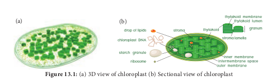

Carotenoids are yellow to orange pigments, mostly tetraterpens and these pigments absorb light strongly in the blue to violet region of visible spectrum. These pigments protect chlorophyll from photo-oxidative damage. Hence, they are called as shield pigments. These pigments absorb light and transfer these to chlorophyll. Almost all carotenoid pigments have 40 carbon atoms. Ripening of fruits, floral colours and leaf colour change during autumn is due to Carotenoids (Carotene and Xanthophyll) (Figure 13.2). **i. Carotenes:** Orange, Red, Yellow and Brownish pigments, hydrocarbons (Lipids) **F**  

and most of them are tetraterpenes(C40H56). Carotene is the most abundant Carotene in plants and it is a precursor of Vitamin A. Lycopene is the red pigment found in the fruits of tomato, red peppers and roses. **ii. Xanthophylls:** Yellow (C40H56O2) pigments are like carotenes but contain oxygen. Lutein is responsible for yellow colour change of leaves during autumn season. Examples: Lutein, Violaxanthin and Fucoxanthin.

### Phycobilins
 They are proteinaceous pigments, soluble in water, and do not contain Mg and Phytol tail. They exist in two forms such as 1. Phycocyanin found in cyanobacteria 2. Phycoerythrin found in rhodophycean algae (Red algae).

## Spectrum of Electromagnetic Radiation

In the total electromagnetic spectrum,visible light is the smallest part. The entire life on earth depends on light and is the driving force for all organisms. Plants have natural potential to utilize solar energy directly. In the given picture electromagnetic radiation spectrum and components of visible spectrum are mentioned. The wavelength of solar radiation which reaches the earth

**igure 13.4:** Electromagnetic Spectrum

  

is between 300 to 2600 nm. The visible spectrum ranges between 390 to 763 nm (3900 å to 7630 å). The colour of the light is determined by the wavelength. Energy of the quantum is inversely proportional to wavelength. Shorter wavelength has more energy than longer wavelength. Electromagnetic spectrum consists of 7 types of radiations such as gamma rays, X rays, U-V rays, Visible light spectrum, infrared rays, electric rays and radio rays (Figure 13. 4).

Light is extremely variable and if radiation is evenly distributed over the globe it is sufficient to melt 35 m thick ice layer.

**Properties of Light** 1\. Light is a transverse electromagnetic

wave. 2. It consists of oscillating electric and

magnetic fields that are perpendicular to each other and perpendicular to the direction of propagation of the light.

3\. Light moves at a speed of 3 × 108 ms–1

4\. Wavelength is the distance between successive crests of the wave.

5\. Light as a particle is called **photon**. Each photon contains an amount of energy known as **quantum**.

6\. The energy of a photon depends on the frequency of the light (Figure 13.5).

Magnetic-field component

Wavelenth (λ)

Electric-field Component

Direction of Propagation

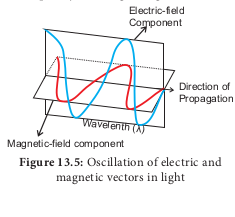

**Separation of Chlorophyll pigments by paper Chromatography method** Step 1. Extract chlorophyll pigment from the leaves using 80% Acetone. Step 2. Allow to concentrate by evaporation. Step 3. Apply few drops on one end above 2 cm from the edge of a chromatographic paper. Step 4. A solvent with mixture of Petroleum ether and acetone in the ratio of 9:1 is prepared and poured into development chamber. Step 5. Place the strip above the solvent by placing one end of the strip touching the solvent. **Observation** After one hour observe the chromatographic paper. You can find the pigments being separated into four distinct spots (Figure 13. 4).

Test tube

Chromatography

Paper

Carotenes

Xanthophyll

Chlorophyll a

Chlorophyll b

Ether acetone solvent

## Photosynthetic Unit (Quantasome)
 Quantasomes are the morphological expression of physiological photosynthetic units, located on the inner membrane of thylakoid lamellae. Each quantasome measures about 180 Ao × 160 Ao and 100 Aothickness. In 1952, **Steinman** observed granular structures in chloroplast lamellae under electron microscope. Later, **Park and Biggins (1964) confirmed these** granular structures as physiological units of photosynthesis and coined the term Quantasome. According to them one

|------|------|------|

| Wavelenth (λ) |
  

quantasome contains about 230 chlorophyll molecules. A minimum number of chlorophyll and other accessory pigments act together in a photochemical reaction to release one oxygen or to reduce one molecule of CO2. It constitutes a photosynthetic unit. (Figure 13.6) **Emerson** and **Arnold** (1932) based on flashing light experiment found 2500 chlorophyll molecules are required to fix one molecule of CO2. However, the reduction or fixation of one CO2 requires 10 quanta of light and so each unit would contain 1/10 of 2500 i.e. 250 molecules. Usually 200 to 300 chlorophyll molecules are considered as a physiological unit of photosynthesis. According to Emerson 8 quanta of light are required for the release of one oxygen molecule or reduction of one Carbon dioxide molecule. The quantum yield is 1/8 or 12 %.

Thylakoid

Antenna Molecule

Chlorophyll b Carotenoid

**Spectrum 13.5.1 Absorption Spectrum** The term absorption refers to complete retention of light, without reflection or transmission. Pigments absorb different wavelengths of light. A curve obtained by plotting the amount of absorption of different wavelengths of light by a pigment is called its **absorption spectrum**. 
- Chlorophyll 'a' and chlorophyll 'b' absorb

quanta from blue and red regio. 
- Maximum absorption peak for different

forms of chlorophyll 'a' is 670 to 673, 680 to 683 and 695 to 705nm.  

- Chlorophyll 'a' 680 (P680) and Chlorophyll 'a' 700 (P700) function as trap centre for PS II and PS I respectively.

### Action Spectrum
 The effectiveness of different wavelength of light on photosynthesis is measured by plotting against quantum yield. The curve showing the rate of photosynthesis at different wavelengths of light is called **action spectrum**. From the graph showing action spectrum, it can be concluded that maximum photosynthesis takes place in blue and red region of the spectrum. This wavelength of the spectrum is the absorption maxima for Chlorophyll (a) and Chlorophyll (b). The Action Spectrum is instrumental in the discovery of the existence of two photosystems in O2 evolving photosynthesis (Figure 13.7).

100

80

60

40

400 500 600 700

20

0

Chlorophyll a

Wavelength (nm)

Chlorophyll b Carotene

Ph ot

os yn

th et

ic ra

te /

Ab so

rp tio

n ra

te

Action spectrum

Absorption spectrum

## Emerson’s Experiments and Hill’s Reaction

### Red Drop or Emerson’s First Effect Emerson
 conducted experiment in _Chlorella_ using only one wavelength of light (monochromatic light) at a time and he measured quantum yield. He plotted a graph of the quantum yield in terms of O2 evolution at various wavelengths of light. His focus was to determine at which wavelength the photochemical yield of oxygen was maximum. He found that in the wavelength of 600 to 680 the yield was constant but suddenly dropped in the region above 680 nm (red region). The fall in the photosynthetic yield beyond red region of the spectrum is referred as **Red drop or Emerson’s first effect.**

  

### Emerson’s Enhancement Effect
 Emerson modified his first experiment by supplying shorter wavelength of light (red light) along with longer wavelength of light (far red light). He found that the monochromatic light of longer wavelength (far red light) when supplemented with shorter wavelength of light (red light) enhanced photosynthetic yield and recovered red drop. This enhancement of photosynthetic yield is referred to as Emerson’s Enhancement Effect (Figure 13.8).

R at

e of

P ho

to sy

nt he

si s

650nm (Red)

710nm (Far red)

650 +710 (Red + Far red)

λ of light exposed (nm)

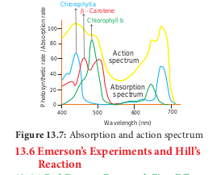

Photosynthetic rate at far red light (710 nm) 5 10 Photosynthetic rate at red light (650 nm) 5 43.5 Photosynthetic rate at red 1 far red (650 1 710 nm) 5 72.5 (Enhancement effect). ### Hill’s Reaction R. Hill
 (1937) isolated chloroplasts and when they were illuminated in the presence of suitable electron acceptors such as ferricyanide, they were reduced to ferrocyanide and oxygen is evolved. Hill’s Reaction is now considered to be equivalent to Light Reaction. _Conclusions of Hill’s Reaction:_

1\. During photosynthesis oxygen is evolved from water.

2\. Electrons for the reduction of CO2 are obtained from water.

3\. Reduced substance produced, later helps to reduce CO2 2H2O 1 2A 2 AH2 1 O2

A is the Hydrogen acceptor, the common _in vitro_ hydrogen acceptors are ferricyanide,  

benzoquinone and Di Chloro Phenol Indole Phenol (DCPIP). ## Modern Concept of Photosynthesis
 Photosynthesis is an Oxidation and Reduction process. Water is oxidised to release O2 and CO2 is reduced to form sugars. The first phase requires light and is called **light reaction or Hill’s reaction**. **1\. Light reaction:** It is a photochemical reaction whereas dark reaction is a thermochemical reaction.

Solar energy is trapped by chlorophyll and stored in the form of chemical energy (assimilatory power)as ATP and reducing power NADPH 1 H1. NADPH 1 H1 alone are known as reducing powers. This reaction takes place in thylakoid membrane of the chloroplast. Oxygen is evolved as a result of splitting of water molecules by light.

Light reaction is discussed in two phases: **_i. Photo-oxidation Phase:_**

- Absorption of light energy. 
- Transfer of energy from accessory

pigments to reaction centre. 
- Activation of Chlorophyll 'a' molecule.

**_ii. Photo Chemical Phase:_*. 
- Photolysis of water and oxygen evolutio. 
- Electron transport and synthesis of

assimilatory power.

  

Hence, it is called as **Dark reaction or Calvin- Benson cycle** (Figure 13.9). ## Photo-Oxidation Phase of Light

**Reaction** The action of photon plays a vital role in excitation of pigment molecules to release an electron. When the molecules absorb a photon, it is in excited state. When the light source turned off, the high energy electrons return to their normal low energy orbitals as the excited molecule goes back to its original stable condition known as **ground state**. When molecules absorb or emit light they change their electronic state. Absorption of blue light excites the chlorophyll to higher energy state than absorption of Red light, because the energy of photon is higher when their wavelength is shorter. When the pigment molecule is in an excited state, this excitation energy is utilised for the phosphorylation. Phosphorylation takes place with the help of light generated electron and hence it is known as **photophosphorylation**.

### Photosystem and Reaction Centre
 - Thylakoid membrane

contains Photosystem I (PS I) and Photosystem II (PS II).

- PS I is in unstacked region of granum facing stroma of chloroplast.

- PS II is found in stacked region of thylakoid membrane facing lumen of thylakoid.

Pho

Tr

**Table 13.2: Differences between Ph Photosystem I**

1\. The reaction centre is P700 2. PS I is involved in both cyclic and non-cyclic. 3. Not involved in photolysis of water and

evolution of oxygen 4. It receives electrons from PS II during non-

cyclic photophosphorylation 5. Located in unstacked region granum facing

chloroplast stroma 6. Chlorophyll and Carotenoid ratio is 20 to 30:1  

- Each Photosystem consists of central core complex (CC) and light harvesting Complex (LHC) or Antenna molecules (Figure 13.10).

- The core complex consists of respective reaction centre associated with proteins, electron donors and acceptors.

- PS I – CC I consists of reaction centre P700 and LHC I.

- PS II – CC II consists of reaction centre P680 and LHC II (Table 13.2).

- Light Harvesting Complex consists of several chlorophylls, carotenoids and xanthophyll molecules.

- The main function of LHC is to harvest light energy and transfer it to their respective reaction centre.

## Photo chemical phase of light reaction

In this phase electrons pass through electron carrier molecules and generate assimilatory powers ATP and NADPH 1 H1. Splitting of water molecule generates electrons replacing electrons produced by the light.

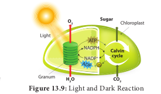

ton

ansfer of energy

Reaction center Chlorophyll

Primary electron acceptorElectron transfer

Antenna pigment molecules

**Reaction center**

**otosystem I and Photosystem II Photosystem II**

1\. Reaction centre is P680 2. PS II participates in Non-cyclic pathway 3, Photolysis of water and evolution of oxygen

take place.

4\. It receives electrons by photolysis of water

5\. Located in stacked region of thylakoid membrane facing lumen of thylakoid.

6\. Chlorophyll and Carotenoid ratio is 3 to 7:1

| Table 13.2: Dierences between Photosystem I and Photosystem II |
|------|------|
| Photosystem I |Photosystem II |
| 1. e reaction centre is P700 |6801. Reaction centre is P |
| 2. PS I is involved in both cyclic and non-cyclic. |2. PS II participates in Non-cyclic pathway |
| 3. Not involved in photolysis of water andevolution of oxygen |3, Photolysis of water and evolution of oxygentake place. |
| 4. It receives electrons from PS II during non-cyclic photophosphorylation |4. It receives electrons by photolysis of water |
| 5. Located in unstacked region granum facingchloroplast stroma |5. Located in stacked region of thylakoidmembrane facing lumen of thylakoid. |
| 6. Chlorophyll and Carotenoid ratio is 20 to 30:1 |6. Chlorophyll and Carotenoid ratio is 3 to 7:1 |
  

### Photolysis of Water
 The process of Photolysis is associated with **Oxygen Evolving Complex** (OEC) or water splitting complex in pigment system II and is catalysed by the presence of Mn11 and Cl–. When the pigment system II is active it receives light and the water molecule splits into OH– ions and H1 ions. The OH–ions unite to form water molecules again and release O2 and electrons (Figure 13.11).

**s**

**s s**

**s**

**s**

**3**

**2 1**

**0**

**4**

H+

H+ H+

H+

2H O2

O2

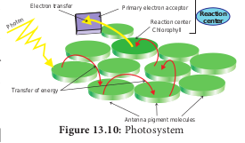

4 H2O 4 H1 1 4 OH–

4 OH– 2 H2O 1 O2 1 4 e–

2H2O 4 H1 1 O2 1 4 e–

### Electron Transport Chain of Chloroplast
 Electron Transport Chain in each photosystem involves four complexes. 
- _Core Complex (CC):_ CC I in PS I the reaction

centre is P700, CC II in PS II the reaction centre is P680

- Light Harvesting Complex or Antenna complex (LHC):

- Two types: LHC I in PS I and LHC II in PS II.

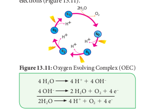

- Cytochrome b6 f complex: It is the non-pigmented protein complex connecting PS I and PS II. Plastoquinone (PQ) and Plastocyanin (PC) are intermediate complexes acting as mobile or shuttle electron carriers of Electron Transport Chain. PQ acts as shuttle between PS II and Cytochrome b6- f complex and PC connects

- Cytochrome b6-f and PS I complex. 
- _ATPase complex or Coupling factor:_ It is found

in the surface of thylakoid membrane. This complex is made up of CF1 and CF0 factors. This complex utilizes energy from ETC and converts ADP and inorganic phosphate (Pi) into ATP (Figure 13.12).

## Photophosphorylation
 Phosphorylation taking place during respiration is called as **oxidative phosphorylation** and ATP produced by the breakdown of substrate is known as **substrate level phosphorylation**. In this topic, we are going to learn about phosphorylation taking place in chloroplast with the help of light. During the movement of electrons through carrier molecules ATP and NADPH 1 H1 are produced. Phosphorylation is the process of synthesis of ATP by the addition of inorganic phosphate to ADP. The addition of phosphate here takes place with the help of light generated electron and so it is called as **photophosphorylation**. It takes place in both cyclic and non-cyclic electron transport.

### Cyclic Photophosphorylation
 Cyclic photophosphorylation refers to the electrons ejected from the pigment system I (Photosystem I) and again cycled back to the PS I. When the photons activate P700 reaction centre photosystem II is activated. Electrons are raised to the high energy level. The primary electron acceptor is Ferredoxin Reducing Substance (FRS) which transfers electrons to Ferredoxin roplast

  

(Fd), Plastoquinone (PQ), cytochrome b6-f complex, Plastocyanin (PC) and finally back to chlorophyll P700 (PS I). During this movement of electrons Adenosine Di Phosphate (ADP) is phosphorylated, by the addition of inorganic phosphate and generates Adenosine Tri Phosphate (ATP). Cyclic electron transport produces only ATP and there is no NADPH 1 H1 formation. At each step of electron transport, electron loses potential energy and is used by the transport chain to pump H1 ions across the thylakoid membrane. The proton gradient triggers ATP formation in ATP synthase enzyme situated on the thylakoid membrane. Photosystem I need light of longer wave length (> P700 nm). It operates under low light intensity, less CO2 and under anaerobic conditions which makes it considered as earlier in evolution (Figure 13.13).

**Cyt f**

**Cyt b6**

**PC P700 PS I LHC I**

**FRS**

**Ferredoxin**

**ADP+ Pi**

**ADP+ Pi**

**ATP**

**ATP**

\-2e

\-2e

\-2e -2e

\-2e

\-2e

Light

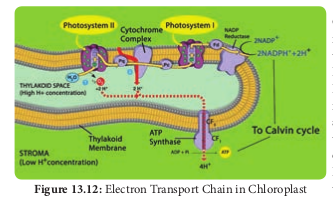

**Q Pheophytin**

**PQ Cyt b6,f complex**

**PC**

**P680 PS II LHC II**

**ADP+ Pi**

**ATP**

**2H O2 ++ ++ Ca , ,Cn lM _O Evolving 2_**

**_Complex_**

\- 4e

\- 4e

\- 4e

\- 4e -

4e

\- 4e

\- 4e

**\+** 4H

O2

+1.0

0

\-1.0

\-2.0

Light

Light

\-

### Non-Cyclic Photophosphorylation
 When photons are activated reaction centre of pigment system II(P680), electrons moved to the high energy level. Electrons from high energy state passes through series of electron carriers like pheophytin, plastoquinone, cytochrome complex, plastocyanin and finally accepted by PS I (P700). During this movement of electrons from PS II to PS I ATP is generated (Figure 13. 16). PS I (P700) is activated by light, electrons are moved to high energy state and accepted by electron acceptor molecule ferredoxin reducing Substance (FRS). During the downhill movement through ferredoxin, electrons are transferred to NADP1 and reduced into NADPH 1 H1

(H1 formed from splitting of water by light). Electrons released from the photosystem II

are not cycled back. It is used for the reduction of NADP1 in to NADPH 1 H1. During the electron transport it generates ATP and hence this type of photophosphorylation is called **non-cyclic photophosphorylation. The** electron flow looks like the appearance of letter ‘Z’ and so known as **Z scheme**. When there is availability of NADP1 for reduction and when there is splitting of water molecules both PS I and PS II are activated (Table 13.3). Non-cyclic electron transport PS I and PS II both are involved co-operatively to transport electrons from water to NADP1 (Figure 13.14). ### Bio energetics of light reaction

- To release one electron from pigment system it requires two quanta of light.

- One quantum is used for transport of electron from water to PS I.

- Second quantum is used for transport of electron from PS I to NADP1

- Two electrons are required to generate one NADPH 1 H1.

**P700 PS I LHC I**

**FRS**

**Ferredoxin**

**\+ 2NADP**

**\+ 2NADPH+H**

\- 4e

\- 4e

sphorylation

  

- During Non-Cyclic electron transport two NADPH 1 H1 are produced and it requires 4 electrons.

- Transportation of 4 electrons requires 8 quanta of light.

**Check your grasp!** Name the products produced from Non-Cyclic photophosphorylation? Why does PS II require electrons from water? Can you find the difference in the Pathway of electrons during PS I and PS II?

### Chemiosmotic Theory
 Chemiosmosis theory was proposed by **P. Mitchell** (1966). According to this theory electrons are transported along the membrane through PS I and PS II and connected by Cyto- chrome b6-f complex. The flow of electrical current is due to difference in electrochemical potential of protons across the membrane. Splitting of water molecule takes place inside the membrane. Protons or H1 ions accumulate within the lumen of the thylakoid (H1 increase 1000 to 2000 times). As a result, proton concentration is increased inside the thylakoid lumen. These protons move across the membrane because the primary acceptor of electron is located outside the membrane. Protons in stroma less in number and creates a proton gradient. This gradient is broken down due to the movement of proton across the membrane to the stroma through CFO of the ATP synthase enzyme. The proton motive force created inside the lumen of thylakoid or chemical gradient of H1 ion across the membrane stimulates ATP generation

**Table 13.3 Differences between Cyclic Photophosph Cyclic Photophosphorylation**

1\. PS I only involved 1 2. Reaction centre is P700 2 3. Electrons released are cycled back 3 4. Photolysis of water does not take place 4 5. Only ATP synthesized 5 6. Phosphorylation takes place at two places 6 7. It does not require an external electron donor 7 8. It is not sensitive to di chloro di methyl urea (DCMU) 8  

The evolution of one oxygen molecule (4 electrons required) requires 8 quanta of light. C3 plants utilise 3 ATPs and 2 NADPH 1 H1 to evolve one Oxygen molecule. To evolve 6 molecules of Oxygen 18 ATPs and 12 NADPH 1 H1 are utilised. C4 plants utilise 5 ATPs and 2 NADPH 1 H1 to evolve one oxygen molecule. To evolve 6 molecules of Oxygen 30 ATPs and 12 NADPH 1 H1 are utilised. ## Dark Reaction or C3 Cycle or Biosynthetic Phase or Photosynthetic Carbon Reduction (PCR)Cycle
 Biosynthetic phase of photosynthesis utilises assimilatory powers(ATP and NADPH 1 H1) produced during light reaction are used to fix and reduce carbon di oxide into carbohydrates. This reaction does not require light. Therefore, it is named Dark reaction. Ribulose 1,5 bisphosphate (RUBP) act as acceptor molecule of carbon di oxide and fix the CO2 by RUBISCO enzyme. The first product of the pathway is a 3- carbon compound (Phospho Glyceric Acid) and so it is also called as C3 Cycle. It takes place in the stroma of the chloroplast.

**orylation and Non-Cyclic Photophosphorylation Non-Cyclic Photophosphorylation**

. PS I and PS II involved

. Reaction centre is P680

. Electron released are not cycled back

. Photolysis of water takes place

. ATP and NADPH 1 H1are synthesized

. Phosphorylation takes place at only one place

. Requires external electron donor like H2O or H2S

. It is sensitive to DCMU and inhibits electron flow

PS II

PS I

Cytochromes b & f

ATP Synthase

**+H +H**

**+H**

**+H**

**+H +H**

**+H**

ADP ATP

+NADP +NADPH+H

NEMUL Thylakoid membrane

STROMA

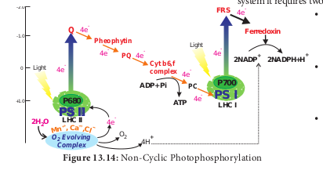

| Table 13.3 Dierences between Cyclic Photophosphorylation and Non-Cyclic Photophosphorylation |
|------|------|
| Cyclic Photophosphorylation |Non-Cyclic Photophosphorylation |
| 1. PS I only involved |1. PS I and PS II involved |
| 2. Reaction centre is P700 |2. Reaction centre is P680 |
| 3. Electrons released are cycled back |3. Electron released are not cycled back |
| 4. Photolysis of water does not take place |4. Photolysis of water takes place |
| 5. Only ATP synthesized |5. ATP and NADPH 1 H are synthesized1 |
| 6. Phosphorylation takes place at two places |6. Phosphorylation takes place at only one place |
| 7. It does not require an external electron donor |7. Requires external electron donor like H O or H S 2 2 |
| 8. It is not sensitive to di chloro di methyl urea (DCMU) |8. It is sensitive to DCMU and inhibits electron ow |
  

**M. Melvin** **Calvin, A.A. Benson** and their co-workers in the year 1957 found this path way of carbon fixation. Melvin Calvin was awarded Nobel Prize for this in 1961 and this pathway named after the discoverers as **Calvin-Benson** Cycle. Dark reaction is temperature dependent and so it is also called thermo-chemical reaction.

Dark reaction consists of three phases: (Figure 13.16).

1\. Carboxylation (fixation) 2. Reduction (Glycolytic Reversal) 3. Regeneration

**Phase 1- Carboxylation (Fixation)** The acceptor molecule Ribulose 1,5 Bisphosphate (RUBP) a 5 carbon compound

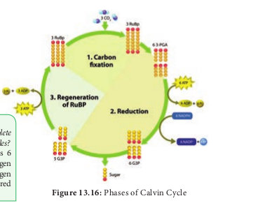

**4C**

**(6) 3-Phospho Glycerate**

**Ery 4 Ph**

**Sedoheptulose 1,7 Bis Phosphate**

**Sedohep 7 Phos**

**Ribose 5-Phosphate**

**(3) Ribulose 5-Phosphate**

**(3) Ribulose 1,5-Bis Phosphate**

**Xylulose 5 Phosphate**

6 NADPH 6 NA

6 ATP

3 ATP

6 ADP+

3 ADP

**(3)CO2**

**_Kinase_**

**_Kinase_**

**_A_**

**_Epimerase_**

**_Isomerase_**

**_Ep im_**

**_er as_**

**_e_**

**_Ph_**

**_Dehydrogenase_3C**

**5C**

**5C5C**

**5C**

**7C**

RUBISCO

**Check your grasp!** _What will be the quanta requirement for complete light reaction which releases 6 oxygen molecules?_ **Solution**: Complete light reaction releases 6 oxygen molecules. If one molecule of oxygen evolution requires 8 quanta means, for 6 oxygen molecules 6 × 8 5 48 quanta of light required for complete light reaction.  

with the help of RUBP carboxylase oxygenase (RUBISCO) enzyme accepts one molecule of carbon dioxide to form an unstable 6 carbon compound. This 6C compound is broken down into two molecules of 3-carbon compound phospho glyceric acid (PGA) (Figure 13.17). RUBP 1 CO2 Rubisco 2 molecules PGA

Calvin cycle

**_Glyceraldehyde 3 -Phosphate (G3P) pool_**

**Dihydroxy Acetone**

**Phoshate (DHAP)**

**DHAP DHAP**

**Fructose 1,6 Bis Phosphate**

**Fructose 6 Phosphate**

**Glucose 6 Phosphate**

**Glucose 1 Phosphate**

**Starch**

**throse osphate**

**tulose phate**

**Xylulose 5 Phosphate**

+DP

6 Pi

**_Aldolase_**

**_ldolase_**

**_Phosphatase osphatase_**

**3C**

**3C**

**5C**

**6C**

**6C**

**7C**

**G3P G3P G3P G3P G3P G3P**

Export

P**i** P**i**

**_St ro_**

**_m al_**

**_h ex_**

**_os e_**

**_ph os_**

**_ph at_**

**_e po_**

**_ol_**

  

**Phase 2 – Glycolytic Reversal / Reduction** Phospho glyceric acid is phosphorylated by ATP and produces 1,3 bis phospho glyceric acid by PGA kinase. 1,3 bis phospho glyceric acid is reduced to glyceraldehyde 3 Phosphate (G-3-P) by using the reducing power NADPH 1 H1. Glyceraldehyde 3 phosphate is converted into its isomeric form di hydroxy acetone phosphate (DHAP).

PGA 1,3 bisphosphoglyceric acidPGA Kinase

ATP ADP

1,3 bisphosphoglceric acid

Glyceraldehyde-3-Phosphate

NADPH 1 H1 NADP1

**Phase 3 – Regeneration** Regeneration of RUBP involves the formation of several intermediate compounds of 6-carbon, 5-carbon,4-carbon and 7- carbon skeleton. Fixation of one carbon dioxide requires 3 ATPs and 2 NADPH 1 H1, and for the fixation of 6 CO2 requires 18 ATPs and 12 NADPH 1 H1 during C3 cycle. One 6 carbon compound is the net gain to form hexose sugar.

ATP ADP RU5P RUBP

Overall equation for dark reaction: 6CO2 1 18ATP 1 12NADPH 1 H1 C6H12O6 1 6H2O1 18ADP 1 18Pi 1 12NADP1

RUBISCO – RUBP Carboxylase Oxygenase enzyme, is the most abundant protein found on earth. It

constitutes 16 % of the chloroplast protein. It acts as carboxylase in the presence of CO2 and oxygenase in the absence of CO2.

## Hatch & Slack Pathway or C4 Cycle or Dicarboxylic Acid Pathway or Dicarboxylation Pathway

Till 1965, Calvin cycle is the only pathway for CO2 fixation. But in 1965, Kortschak, Hart and **Burr** made observations in sugarcane and found C4 or dicarboxylic acid pathway. Malate and aspartate are the major labelled

ve (v ti

Pho cell pla  

products. This observation was confirmed by Hatch & Slack in 1967. This alternate pathway for the fixation of CO2 was found in several tropical and sub-tropical grasses and some dicots. C4 cycle is discovered in more than 1000 species. Among them 300 species belong to dicots and rest of them are monocots. C4 plants represent about 5% of Earth’s plant biomass and 1% of its known plant species. Despite this scarcity, they account for about 30% of terrestrial carbon fixation. Increasing the proportion of C4 plants on earth could assist biosequestration of CO2 and represent an important climate change avoidance strategy.

C4 pathway is completed in two phases, first phase takes place in stroma of mesophyll cells, where the CO2 acceptor molecule is 3-Carbon compound, phospho enol pyruvate (PEP) to form 4-carbon Oxalo acetic acid (OAA). The first product is a 4-carbon and so it is named as C4 cycle. oxalo acetic acid is a dicarboxylic acid and hence this cycle is also known as **dicarboxylic acid pathway** (Figure 13.18). Carbon dioxide fixation takes place in two places one in mesophyll and another in bundle sheath cell (di carboxylation pathway). It is the adaptation of tropical and sub tropical plants growing in warm and dry conditions. Fixation of CO2 with minimal loss is due to absence of photorespiration. C4 plants require 5 ATP and 2 NADPH 1 H1 to fix one molecule of CO2.

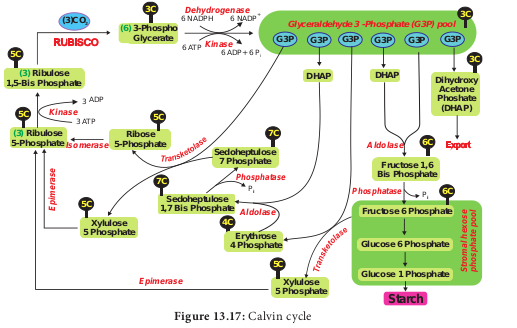

ADP

ATP

CO

The C4 pathway

Mesophyll cell PEP carboxylase

Oxaloacetate (4c) PEP (3c)

Malate (4c)

Pyruvate (3c) CO2

calvin cycle

Sugar

Vascular tissue

Bundle sheath cell

C4 leaf anatomy

stoma

in ascular ssue)

Mesophyll cell

Bundle- sheath cell

tosynthetic s of C4 nt leaf

  

### Stage: I Mesophyll Cells
 Phosphoenol Pyruvate 1 CO2

(PEP) (3C)

Oxaloacetic acid (OAA) (4C)

PEP carboxylase

Oxaloacetic acid (OAA) is converted into malic acid or aspartic acid and is transported to the bundle sheath cells through plasmodesmata. ### Stage: II Bundle Sheath Cells
 Malic acid undergoes decarboxylation and produces a 3 carbon compound Pyruvic acid and CO2. The released CO2 combines with RUBP and follows the calvin cycle and finally sugar is released to the phloem. Pyruvic acid is transported to the mesophyll cells. Rubisco

RUBP 1 CO2 2 PGA (5C) (3C)

**Activity*. 
- Collect the leaves of Paddy (C3) and Sugar cane (C4).

- Take the cross section. 
- Observe the sections under the microscope. 
- See the difference in their anatomy (Dimorphic chloroplast and Kranz anatomy).

**Table 13.4: Differences be C3 Plants**

1\. CO2 fixation takes place in mesophyll cells only 1. 2. CO2 acceptor is RUBP only 2. 3. First product is 3C- PGA 3. 4. Kranz anatomy is not present 4. 5. Granum is present in mesophyll cells 5.

6\. Normal Chloroplast 6. 7. Optimum temperature 20o to 25oC 7. 8. Fixation of CO2 at 50 ppm 8. 9. Less efficient due to higher photorespiration 9. 10. RUBP carboxylase enzyme used for

fixation 10.

11\. 18 ATPs used to synthesize one glucose 11. 12. Example: Paddy, Wheat, Potato and so on 12.  

### Significance of C4 cycle
 1\. Plants having C4 cycle are mainly of tropical

and sub-tropical regions and are able to survive in environment with low CO2 concentration.

2\. C4 plants are partially adapted to drought conditions.

3\. Oxygen has no inhibitory effect on C4 cycle since PEP carboxylase is insensitive to O2.

4\. Due to absence of photorespiration, CO2 Compensation Point for C4 is lower than that of C3 plants.

Differences between C3 Plants (C3 Cycle) and C4 Plants (C4 Cycle) are given in table 13.4.

**tween C3 and C4 plants C4 Plants**

CO2 fixation takes place mesophyll and bundle sheath PEP in mesophyll and RUBP in bundle sheath cells First product is 4C- OAA Kranz anatomy is present Granum present in mesophyll cells and absent in bundle sheath Dimorphic chloroplast Optimum temperature 30o to 45oC Fixation of CO2 even less than 10 ppm More efficient due to less photorespiration PEP carboxylase and RUBP carboxylase used

Consumes 30 ATPs to produce one glucose. Example: Sugar cane, Maize, _Sorghum_,

_Amaranthus_ and so on

**Kranz Anatomy:** It is the German term meaning a halo or wreath. In C4 plants vascular bundles are surrounded by a layer of

bundle sheath. Bundle sheath is surrounded by a ring of mesophyll cells. The characteristic feature of C4 plants is the presence of dimorphic chloroplast: _Bundle sheath chloroplast:_ Larger chloroplast, thylakoids not arranged in granum and rich in starch. _Mesophyll Chloroplast:_ Smaller chloroplast, thylakoids arranged in granum and less starch.

| Table 13.4: Dierences between C  and C  plants3 4 |
|------|------|
| C  Plants3 |C  Plants4 |
| 1. CO  xation takes place in mesophyll cells only2 |1. CO  xation takes place mesophyll and bundle sheath2 |
| 2. CO  acceptor is RUBP only2 |2. PEP in mesophyll and RUBP in bundle sheath cells |
| 3. First product is 3C- PGA |3. First product is 4C- OAA |
| 4. Kranz anatomy is not present |4. Kranz anatomy is present |
| 5. Granum is present in mesophyll cells |5. Granum present in mesophyll cells and absent inbundle sheath |
| 6. Normal Chloroplast |6. Dimorphic chloroplast |
| 7. Optimum temperature 20  to 25 Co o |7. Optimum temperature 30  to 45 Co o |
| 8. Fixation of CO at 50 ppm2 |8. Fixation of CO even less than 10 ppm2 |
| 9. Less ecient due to higher photorespiration |9. More ecient due to less photorespiration |
| 10. RUBP carboxylase enzyme used forxation |10. PEP carboxylase and RUBP carboxylase used |
| 11. 18 ATPs used to synthesize one glucose |11. Consumes 30 ATPs to produce one glucose. |
| 12. Example: Paddy, Wheat, Potato and so on |12. Example: Sugar cane, Maize, Sorghum, Amaranthus and so on |
  

**Check your grasp!** C4 plants requires 30 ATPs and 12 NADPH 1 H1 to synthesize one glucose, but C3 plants requires only 18 ATPs and 12 NADPH 1 H1 to synthesize one glucose molecule. If then, how can you say C4 plants are more advantageous? Solution: C4 plants are more advantageous than C3 plants because most of the energy lost during photo respiration in C3 plants.

## Crassulacean Acid Metabolism or CAM cycle

It is one of the carbon pathways identified in succulent plants growing in semi-arid or xerophytic condition. This was first observed in crassulaceae family plants like _Bryophyllum_, _Sedum_, _Kalanchoe_ and is the reason behind the name of this cycle. It is also noticed in plants from other families Examples: _Agave_, _Opuntia, Pineapple and Orchids. The stomata_ are closed during day and are open during night (Scotoactive). This reverse stomatal rhythm helps to conserve water loss through transpiration and will stop the fixation of CO2 during the day time. At night time CAM plants fix CO2 with the help of Phospho Enol Pyruvic acid (PEP) and produce oxalo acetic acid

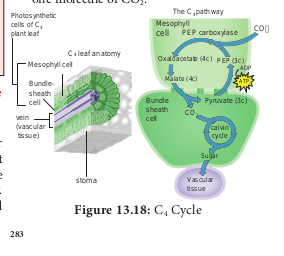

CO2 uptake and fixation leaf acidification

Atmospheric CO2

Open stoma permits entry of CO2 and loss of H2O

PEP carboxylase Phosphoenol-

pyruvate Oxaloacetate

NAD+ malic dehydro genase

Malate

NADH NAD+

Triose phosphate

Starch Chloroplast

Malic acid Vacuole

D m in

**Night: Open stomata**  

(OAA). Subsequently OAA is converted into malic acid like C4 cycle and gets accumulated in vacuole increasing the acidity. During the day time stomata are closed and malic acid is decarboxylated into pyruvic acid resulting in the decrease of acidity. CO2 thus formed enters into Calvin Cycle and produces carbohydrates (Figure13.19). **Significance of CAM Cycle** 1\. It is advantageous for succulent plants to

obtain CO2 from malic acid when stomata are closed.

2\. During day time stomata are closed and CO2 is not taken but continue their photosynthesis.

3\. Stomata are closed during the day time and help the plants to avoid transpiration and water loss.

## Photorespiration or C2 Cycle or Photosynthetic Carbon Oxidation (PCO) Cycle

Respiration is a continuous process for all living organisms including plants. **Decker** (1959) observed that rate of respiration is more in light than in dark. Photorespiration is the excess respiration taking place in photosynthetic cells due to absence of CO2

CAM cycle

ecarboxylation of stored alate and refixation of ternal CO2 deacidification

Closed stoma prevents H2O loss and CO2 uptake

NADP+ malk enzyme Malate Malic acid

Vacuole

Chloroplast

Starch

Pyruvate

CO2

Calvin cycle

**Day: Closed stomata**

| prevents Hand CO2 |
|------|------|------|

  

and increase of O2(Table 13.5). This condition changes the carboxylase role of RUBISCO into oxygenase. C2 Cycle takes place in chloroplast, peroxisome and mitochondria. RUBP is converted into PGA and a 2C-compound phosphoglycolate by Rubisco enzyme in chloroplast. Since the first product is a 2C-compound, this cycle is known as **C2 Cycle**. Phosphoglycolate by loss of phosphate becomes glycolate. Glycolate formed in chloroplast enters into peroxisome to form glyoxylate and hydrogen peroxide. Glyoxylate is converted into glycine and transferred into mitochondria. In mitochondria, two molecules of glycine combine to form serine. Serine enters into peroxisome to form hydroxy pyruvate. Hydroxy pyruvate with help of NADH 1 H1 becomes glyceric acid. Glyceric acid is cycled back to chloroplast util ising ATP and becomes Phosphoglyceric acid (PGA) and enters into the Calvin cycle (PCR cycle). Photorespiration does not yield any free energy in the form of ATP. Under certain conditions 50% of the photosynthetic potential is lost because of Photorespiration (Figure 13.20). ### Significance of photorespiration
 1\. Glycine and Serine synthesised during

this process are precursors of many biomolecules like chlorophyll, proteins, nucleotides.

2\. It consumes excess NADH 1 H1 generated. 3. Glycolate protects cells from Photo

oxidation.

**Table 13.5: Differences between Phot Photorespiration**

1\. It takes place in photosynthetic green cells 2. It takes place only in the presence of light 3. It involves chloroplast, peroxisome and

mitochondria 4. It does not involve Glycolysis, Kreb’s Cycle, and ET 5. Substrate is glycolic acid 6. It is not essential for survival 7. No phosphorylation and yield of ATP 8. NADH2 is oxidised to NAD1

9\. Hydrogen peroxide is produced 10. End products are CO2 and PGA  

### Carbon Dioxide Compensation Point

When the rate of photosynthesis equals the rate of respiration, there is no exchange of oxygen and carbon dioxide and this is called as carbon dioxide **compensation** **point. This will happen at particular light** intensity when exchange of gases becomes zero. When light is not a limiting factor and atmospheric CO2 concentration is between 50 to 100 ppm the net exchange is zero.

## Factors affecting Photosynthesis
 In 1860, **Sachs** gave three cardinal points theory explaining minimum, optimum and maximum factors that control photosynthesis.

**orespiration and Dark Respiration Dark respiration**

1\. It takes place in all living cells 2. It takes place all the time 3. It involves only mitochondria

S 4. It involves glycolysis, Kreb’s Cycle and ETS 5. Substrate is carbohydrates, protein or fats 6. Essential for survival 7. Phosphorylation produces ATP energy 8. NAD1 is reduced to NADH2

9\. Hydrogen peroxide is not produced 10. End products are CO2 and water

(2) **Ribulose 1,5 bis phosphate**

(2) **Phospho Glycolate**

(2) **Glycolate**

(2) **Glycolate**

(2) **Glyoxylate**

(2) **Glycine**

(2) **GlycineSerine**

**Serine**

**Hydroxy pyruvate**

**Glycerate**

**PGA**

**Glycerate** +NAD NADH+H

**CO2**

**NH3**

**ADP ATP**

(2) Pi

**(2) O2**

**O2 H O2 2**

**H O +** ½ **O2 2**

**Calvin Cycle**

**PERO X**

**ISO M**

**E** MITO

C H

O N

DRION

**5C**

**2C**

**2C**

**2C**

**2C3C**

**3C**

**3C**

**3C**

**3C 3C**

**2C**

**2C**

(2) PGA

**\+ +**

| Table 13.5: Dierences between Photorespiration and Dark Respiration |
|------|------|
| Photorespiration |Dark respiration |
| 1. It takes place in photosynthetic green cells |1. It takes place in all living cells |
| 2. It takes place only in the presence of light |2. It takes place all the time |
| 3. It involves chloroplast, peroxisome andmitochondria |3. It involves only mitochondria |
| 4. It does not involve Glycolysis, Kreb’s Cycle, and ETS |4. It involves glycolysis, Kreb’s Cycle and ETS |
| 5. Substrate is glycolic acid |5. Substrate is carbohydrates, protein or fats |
| 6. It is not essential for survival |6. Essential for survival |
| 7. No phosphorylation and yield of ATP |7. Phosphorylation produces ATP energy |
| 8. NADH  is oxidised to NAD12 |8. NAD  is reduced to NADH12 |
| 9. Hydrogen peroxide is produced |9. Hydrogen peroxide is not produced |
| 10. End products are CO and PGA2 |10. End products are CO and water2 |
  

In 1905, **Blackman** put forth the importance of smallest factor. **Blackman’s law of limiting factor is actually a modified Law proposed** by **Liebig’s Law of minimum**. According to Blackman, _“When a process is conditioned as to its rapidity by a number of separate factors, the rate of the process is limited by the pace of the lowest factor”._ To conclude in an easy way _“at any given point of time the lowest factor among essentials will limit the rate of photosynthesis”._ For example, when even sufficient light intensity is available, photosynthesis may be low due to low CO2 in the atmosphere. Here, CO2 acts as a limiting factor. If CO2 is increased in the atmosphere the rate of photosynthesis also increases. Further increase in photosynthesis is possible only if the available light intensity is also increased proportionately (Figure 13.21).

Factors affecting photosynthesis are further grouped into External or Environmental factors and Internal factors.

I. **External factors:** Light, carbon dioxide, temperature, water, mineral and pollutants.

II. **Internal factors:** Pigments, protoplasmic factor, accumulation of carbohydrates, anatomy of leaf and hormones.

A

B

C

D HIGH LIGHT INTENSITY

MEDIUM LIGHT INTENSITY

LOW LIGHT INTENSITY

CO CONCENTRATION2

R AT

E O

F PH

O TO

SY N

TH ES

IS

### External factors 1. Light
 Energy for photosynthesis comes only from light. Photooxidation of water and excitation of pigment molecules are directly controlled by light. Stomatal movement leading to diffusion of CO2 is indirectly controlled by light.  

**a. Intensity of Light:** Intensity of light plays a direct role in the rate of photosynthesis. Under low intensity the photosynthetic rate is low and at higher intensity photosynthetic rate is higher. It also depends on the nature of plants. Heliophytes (Bean Plant) require higher intensity than Sciophytes (_Oxalis_). **b. Quantity of Light:** In plants which are exposed to light for longer duration (Long day Plants) photosynthetic rate is higher. **c. Quality of light:** Different wavelengths of light affect the rate of photosynthesis because pigment system does not absorb all the rays equally. Photosynthetic rate is maximum in blue and red light. **Photosynthetically Active Radiation** (PAR) is between 400 to 700 nm. Red light induces highest rate of photosynthesis and green light induces lowest rate of photosynthesis. **2\. Carbon dioxide** CO2 is found only 0.3 % in the atmosphere but plays a vital role. Increase in concentration of CO2 increases the rate of photosynthesis (CO2 concentration in the atmosphere is 330 ppm). If concentration is increased beyond 500ppm, rate of photosynthesis will be affected showing the inhibitory effect. **3\. Oxygen** The rate of photosynthesis decreases when there is an increase of oxygen concentration. This Inhibitory effect of oxygen was first discovered by **Warburg** (1920) using green algae _Chlorella._ **4\. Temperature** The optimum temperature for photosynthesis varies from plant to plant. Temperature is not uniform in all places. In general, the optimum temperature for photosynthesis is 25oC to 35oC. This is not applicable for all plants. The ideal temperature for plants like _Opuntia_ is 55oC, Lichens 20oC and Algae growing in hot spring photosynthesis is 75oC. Whether high temperature or low temperature it will close the stomata as well as inactivate the enzymes responsible for photosynthesis (Figure 13.22).

| DINTENSITYMEDIUM LIGHTINTENSITYLOW LIGHTINTENSITY |
|------|------|
| CBA |
  

**Figure 13.22: Factors affecting Photosynthesis**

R at

e of

P ho

to sy

nt he

si s

R at

e of

P ho

to sy

nt he

si s

R at

e of

P ho

to sy

nt he

si s

Light intensity CO Concentration2 Temperature

**5\. Water** Photolysis of water provides electrons and protons for the reduction of NADP, directly. Indirect roles are stomatal movement and hydration of protoplasm. During water stress, supply of NADPH 1 H1 is affected. **6\. Minerals** Deficiency of certain minerals affect photosynthesis e.g. mineral involved in the synthesis of chlorophyll (Mg, Fe and N), Phosphorylation reactions (P), Photolysis of water (Mn and Cl), formation of plastocyanin (Cu). **7\. Air pollutants** Pollutants like SO2, NO2, O3 (Ozone) and Smog affects rate of photosynthesis. ### Internal Factors 1. Photosynthetic Pigments
 It is an essential factor and even a small quantity is enough to carry out photosynthesis. **2\. Protoplasmic factor** Hydrated protoplasm is essential for photosynthesis. It also includes enzymes responsible for Photosynthesis.

**Table 13.6: Difference between photosynthes Photosynthesis in Plants**

1\. Cyclic and non-cyclic phosphorylation takes place

2\. Photosystem I and II involved 3. Electron donor is water 4. Oxygen is evolved 5. Reaction centres are P700 and P680 6. Reducing agent is NADPH 1 H1

7\. PAR is 400 to 700 nm 8. Chlorophyll, carotenoid and xanthophyll 9. Photosynthetic apparatus – chloroplast  

**3\. Accumulation of Carbohydrates** Photosynthetic end products like carbohydrates are accumulated in cells and if translocation of carbohydrates is slow then this will affect the rate of photosynthesis. **4\. Anatomy of leaf** Thickness of cuticle and epidermis, distribution of stomata, presence or absence of Kranz anatomy and relative proportion of photosynthetic cells affect photosynthesis. **5\. Hormones** Hormones like gibberellins and cytokinin increase the rate of photosynthesis.

## Photosynthesis in bacteria
 Though we study about bacterial photosynthesis as the last part, bacterial photosynthesis formed first and foremost in evolution. Bacteria does not have specialized structures like chloroplast. It has a simple type of photosynthetic apparatus called chlorosomes and chromatophores (Table 13.6). **Van Neil** (1930) discovered a bacterium that releases sulphur instead of oxygen during photosynthesis. Here, electron donor is hydrogen sulphide (H2S) and only one photosystem is involved (PS I) and the reaction centre is P870. Pigments present in bacteria are bacteriochlorophyll a, b, c, d, e and g and carotenoids. Photosynthetic bacteria are classified into three groups: 1. Green sulphur bacteria. Example:

_Chlorobacterium_ and _Chlorobium._

**is in plants and photosynthesis in bacteria Photosynthesis in Bacteria**

1\. Only cyclic phosphorylation takes place

2\. Photosystem I only involved 3. Electron donor is H2S 4. Oxygen is not evolved 5. Reaction centre is P870

6\. Reducing agent is NADH 1 H1

7\. PAR is above 700 nm 8. Bacterio chlorophyll and bacterio viridin 9. It is chlorosomes and chromatophores

| Tabl e 13.6: Dif ferenc e b e twe en p ho tos y nthes is in p l ants a nd p ho tos y nthes is in b ac teri a |
|------|------|
| Pho tos y nthes is in P l ants |Pho tos y nthes is in Bac teri a |
| 1. Cyclic and non-cyclic phosphor ylation takes place |1. Only cyclic phosphor ylation takes place |
| 2. Photosystem I and II involved |2. Photosystem I only involved |
| 3. Electron donor is water |3. Electron donor is H S2 |
| 4.  Oxygen is evolved |4. Oxygen is not evolved |
| 5. Reaction centres are P700 and P680 |5. Reaction centre is P870 |
| 6. Reducing agent is NADPH 1 H1 |6. Reducing agent is NADH 1 H1 |
| 7. PAR is 400 to 700 nm |7. PAR is above 700 nm |
| 8. Chlorophyll, carotenoid and xanthophyll |8. Bacterio chlorophyll and bacterio viridin |
| 9. Photosynthetic apparatus – chloroplast |9. It is chlorosomes and chromatophores |
  

2\. Purple sulphur bacteria. Example: _Thiospirillum and Chromatium._

3\. Purple non-sulphur bacteria. Example: _Rhodopseudomonas_ and _Rhodospirillum_.

**Test tube funnel experiment or Experiment to prove oxygen evolved**

**during Photosynthesis** 1\. Place _Hydrilla_ plant at the bottom of a

beaker containing water. 2. Cover the plant with an inverted funnel. 3. Invert a test tube over the funnel. 4. Keep this setup in sunlight. Note your observations (Figure 13.23).

waterdisplacement of

ydrillaH

Gas collected by downward

Test tube

Pond water

Inverted funnel

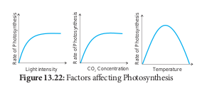

**Summary** Photosynthesis is an oxidation and reduction process. It has two phases: the light reaction and dark reaction. During light reaction water is oxidised to release O2 and during dark reaction CO2is reduced to form sugars. Solar energy is trapped by pigment system I and pigment system II. P700 and P680 act as reaction centres for PS I and PS II respectively. Splitting of water molecule (Photolysis) produces electrons, protons and oxygen. Photophosphorylation takes place through cyclic and non-cyclic mechanisms and generates energy and reducing power. Dark reaction or biosynthetic phase of photosynthesis use the products of light energy (ATP and NADPH 1 H1) and carbon dioxide is reduced to Carbohydrates. Carbon pathway in C3 cycle has RUBP as  

the acceptor molecule and the first product is PGA (3C). Carbon pathway in C4 plants involves mesophyll and bundle sheath cells, Kranz anatomy. Dimorphic chloroplast, no photorespiration, acceptor molecule as PEP and first product as OAA (4C) are some of the unique characters of C4 cycle. C2 Cycle or photorespiration is operated when less amount of CO2 is used for reduction and O2 increases. Rubisco starts to play oxygenase role. Succulent and xerophytic plants show reverse stomatal rhythm as they open during night time and close during day time and follow CAM cycle. Night time produces malic acid and during day time malate is converted into pyruvate and produces CO2 which is reduced to carbohydrates. Photosynthesis is affected by internal and external factors. Bacterial photosynthesis is the primitive type of photosynthesis and it involves only photosystem I. **Evaluation**

1\. **Assertion (A):** Increase in Proton gradient inside lumen responsible for ATP synthesis

**Reason (R):** Oxygen evolving complex of PS I located on thylakoid membrane facing Stroma, releases H1 ions a. Both Assertion and Reason are True. b. Assertion is True and Reason is False. c. Reason is True and Assertion is False. d. Both Assertion and Reason are False.

2\. Which chlorophyll molecule does not have a phytol tail? a. Chl- a b. Chl-b c. Chl- c d. Chl -d

3\. The correct sequence of flow of electrons in the light reaction is a. PS II, plastoquinone, cytochrome,

PS I, ferredoxin. b. PS I, plastoquinone, cytochrome,

PS II ferredoxin. c. PS II, ferredoxin, plastoquinone,

cytochrome, PS I. d. PS II, plastoquinone, cytochrome,

PS II, ferredoxin.

  

t

Web URL: **https://biomanbio.com/HTML5GamesandLabs/PhotoRespgame**

**ICT Corner Photosy**

 **Step1 Step2 Step3**

**Steps*. 
- Scan th. 
- Start a . 
- Click li. 
- After co

follow th

Let’s play **photosynthesis**

**Activ*. 
- Observe the cycle and record i. 
- Check your grasp

4\. For every CO2 molecule entering the C3 cycle, the number of ATP & NADPH required a. 2ATP 1 2NADPH b. 2ATP 1 3NADPH c. 3ATP 1 2NADPH d. 3ATP 1 3NADPH

5\. Identify true statement regarding light reaction of photosynthesis. a. Splitting of water molecule is

associate with PS I. b. PS I and PS II involved in the

formation of NDPH1H1.

c. The reaction center of PS I is Chlorophyll a with absorption peak at 680 nm.

d. The reaction center of PS II is Chlorophyll a with absorption peak at 700 nm.

6\. Two groups (A & B) of bean plants of similar size and same leaf area were placed in identical conditions. Group A was exposed to light of wavelength  

**s/photointeractivehtml5page.html**

**nthesis**

**Step4**

QR code ew game and tap ht dependent reaction and follow the steps mpletion – move back and Click Calvin cycle reaction and e steps

\* Pictures are indicative only

**ity** by click the Quiz ta. 
- Conclude your observations.

400-450nm & Group B to light of wavelength of 500-550nm. Compare the photosynthetic rate of the 2 groups giving reasons.

7\. A tree is believed to be releasing oxygen during night time. Do you believe the truthfulness of this statement? Justify your answer by giving reasons.

8\. Grasses have an adaptive mechanism to compensate photorespiratory losses- Name and describe the mechanism.

9\. In Botany class, teacher explains_,_ Synthesis of one glucose requires 30 ATPs in C4 plants and only 18 ATPs in C3plants. The same teacher explains C4 plants are more advantageous than C3 plants. Can you identify the reason for this contradiction?

10\. When there is plenty of light and higher concentration of O2, what kind of pathway does the plant undergo?Analyse the reasons.

