  

The learner will be able to. 
- Define growth. 
- List out and differentiate the phases of

_growth.. 
- _Explain the structure, precursor, bioassay_

_and physiological effects of plant growth regulators._

**Plant Grow**

**Learning Objectives**

**Chapter Outline 15.1** Characteristics of growth **15.2** Plant growth regulators **15.3** Plant movements **15.4** Photoperiodism **15.5** Vernalization **15.6** Seed germination and dormancy **15.7** Senescence **15.8** Stress physiology

**Chapter**

**15**

The Banyan tree continues to grow for thousands of years and some others particularly annual plants cease growth within a season or within a year. Can you understand the reasons? How does a zygote give rise to an embryo and an embryo to a seedling? How does a new plant structure arise from the pre-existing structure? Growth is defined as an irreversible permanent increase in size, shape, number,volume and dry weight. Plant growth occurs by cell division, cell enlargement, differentiation and maturation.

Growth is measurable, it is amazing to know that one single maize root apical meristem can give rise to

more than 17,500 new cells per hour and cells in a watermelon may increase in size upto 3,50,000 times.

**Unit V (Functi**  

**th and Development**

## Characteristics of Growth
 - Growth increases in protoplasm at cellular

level. 
- Stem and roots are indeterminate in

growth due to continuous cell division and is called **open form of growth**.

- The primary growth of the plant is due to the activity of apical meristem where, new cells are added to root and shoot apex causing linear growth of plant body.

- The secondary vascular cambium and cork cambium add new cells to cause increase in girth.

- Leaves, flowers and fruits are limited in growth or determinate or **closed form growth.**

- Monocarpic annual plants produce flowers only once during lifetime and dies. Example: Paddy and Bean

Bamboos are evergreen grasses and certain species of it can grow at the rate of growth 91 cm per day. The Saguaro Cactus is a tree like cactus and is a slow growing

plant. The rate of growth is one inch in the first ten years and it does not begin to flower until it is about 60 years old. It’s lifespan exceeds 150 years and takes 75–100 years to grow a side arm.

**: Plant Physiology onal Organisation)**

  

- Monocarpic perennials produce flowers only once during life time but the plants survive for many years. Example: Bamboo.

- Polycarpic perennials produce flowers every year during life time. Example: Coconut.

### Kinetics of growth
 It is an analysis of the motion of cells or expansion. **1\. Stages in Growth rate** The total period from initial to the final stage of growth is called the **grand period of growth.** The total growth is plotted against time and ‘S’ shaped sigmoid curve (Grand period curve) is obtained. It consists of four phases. They are:

i. Lag phase ii. Log phase iii. Decelerating phase iv. Maturation phase

**i. Lag phase** In this phase new cells are formed from pre-existing cells slowly. It is found in the tip of the stem, root and branches. It is the initial stage of growth. In other words, growth starts from this period. **ii. Log phase or exponential growth** Here, the newly formed cell increases in size rapidly by deposition of cell wall material. Growth rate is maximum and reaches top because of cell division and physiological processes are quite fast. The volume of protoplasm also increases. It results in rapid growth and causes elongation of internode in the stem. **iii. Decelerating phase or Decline phase or**

**slow growth phase** The rate of growth decreases and becomes limited owing to internal and external or both the factors because the metabolic process becomes slow.

**iv. Steady state period or maturation phase** In this phase cell wall thickening due to new particle deposition on the inner surface of the cell wall takes place. The overall growth ceases and becomes constant. The growth rate becomes zero.  

**2\. Types of growth rate** The increased growth per unit time is termed as growth rate. An organism or part of an organism can produce more cells through arithmetic growth or geometric growth or both.

**i. Arithmetic Growth Rate** If the length of a plant organ is plotted against time, it shows a linear curve and this growth is called **arithmetic growth**.

- The rate of growth is constant and it increases in an arithmetic manner.

- Only one cell is allowed to divide between the two-resulting progeny cell.

- One continues to divide but the other undergoes cell cycle arrest and begins to develop, differentiate and mature.

- After each round of cell division, only a single cell remains capable of division and one new body cell forms.

For example, starting with a single cell after round 1 of cell division there is one dividing cell and one body cell. After round 2 there are two body cells, after round 3 there are three and so on (Figure 15.1).

Dividing cell

Body Cell

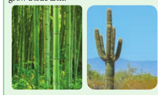

undergo one million rounds of nuclear and

  

cellular division. If each round requires one day, this type of arithmetic increase would require one million days or 2739.7 years. This arithmetic rate is capable of producing small number of cells present in very small parts of plants. For example the hair on many leaves and stems consists of just a single row of cells produced by the division of the basal cell, the cell at the bottom of the hair next to other epidermal cells. Hair may contain 5 to 10 cells by the division of the basal cell. So, all its cells could be produced in just five to ten days. In the figure 15.2, on plotting the hight of the plant against time a linear curve is obtained. Mathematically it is expressed as:

Time

He igh

t o f t

he p

lan t

**ii. Geometric growth rate:** This growth occurs in many higher plants and plant organs and is measured in size or weight. In plant growth, geometric cell division results if all cells of an organism or tissue are active mitotically. Example: Round three in the given figure 15.3, produces 8 cells as 23 = 8 and after round 20 there are 220

\= 1,048,576 cells.  

The large plant or animal parts are produced this way. In fact, it is common in animals but rare in plants except when they are young and small. Exponential growth curve can be expressed as,

Mother cell

2 Progeny cells

8 Progeny cells

4 Progeny cells

**_W1_** = Final size (weight, height and number)

**_W0_** = Initial size at the beginning of the period

**_r_** = Growth rate **_t_** = Time of growth **_e_** = Base of the natural logarithms

Here ‘_r’_ is the relative growth rate and also a measure of the ability of the plant to produce new plant material, referred to as efficiency index. Hence, the final size of W1 depends on the initial size _W0_.

**iii. Arithmetic and Geometric Growth of Embryo** Plants often grow by a combination

of arithmetic and geometric growth patterns. A young embryonic plant grows geometrically and cell division becomes restricted to certain cells at the tips of roots and shoots. After this point, growth is of the slower arithmetic type, but some of the new cells that are produced can develop into their mature condition and begin carrying

|------|------|
| `a |

  

out specialized types of metabolism (Figure 15.4). Plants are thus a mixture of older, mature cells and young, dividing cells.

Quantitative comparisons between the growth of living system can also be made in two ways and is explained in the table 1.

In figure 15.5, two leaves A and B are drawn at a particular time. Then A1and B1 are drawn after a given time. A and B = Area of leaves at a particular time. A1

and B1 = Area of leaves after a given time. (A1-A) and (B1-B) represents an absolute increase in area in the given time. Leaf A increases from 5 cm2 to 10 cm2; 5 cm2 in a given time. Leaf B increases from 50 cm2 to 55 cm2 ; 5 cm2 in a given time. Hence, both leaves A and B increase their area by 5 cm2 in a given time. This is absolute growth. Relative growth is faster in leaf A because of initial small size. It decreases with time.  

**Measurement of Growth Experiment: 1. Arc auxanometer:** The increase in the length of the stem tip can easily be measured by an arc auxanometer which consists of a small pulley to the axis of which is attached a long pointer sliding over a graduated arc. A thread one end of which is tied to the stem tip and another end to a weight passes over the pulley tightly. As soon as the stem tip increases in length, the pulley moves and the pointer slide over the graduated arc (Figure 15.6). The reading is taken. The actual increase in the length of the stem is then calculated by knowing the length of the pointer and the radius of the pulley. If the distance travelled by the pointer is 10 and the radius of the pulley is 4 inches and the length of the pint is 20 inches, the actual grown is measured as follows: Actual growth in length = (Distance travelled by the pointer × radius of the pulley) / Length of the pointer. For example, actual growth in length **=** (10 × 4 inches)/ 20 inches = 2 inches

Arc

Pointer Pulley

Weight

Potted plant Stand

  

## Plant Growth Regulators
 Plant Growth Regulators (chemical messenger) are defined as organic substances which are synthesized in minute quantities in one part of the plant body and transported to another part where they influence specific physiological processes. Five major groups of hormones _viz._, auxins, gibberellins, cytokinins, ethylene and abscisic acid are presently known to coordinate and regulate growth and development in plants. The term phytohormones is implied to those chemical substances which are synthesized by plants and thus, naturally occurring. On the other hand, there are several manufactured chemicals which often resemble the hormones in physiological action and even in molecular structure. Recently, another two groups, the brassinosteroids and polyamines were also known to behave like hormones. **1\. Plant growth regulators – classification** Plant Growth Regulators are classified as natural and synthetic based on their source and a detailed flow diagram is given in Figure 15.7.

**Plant Growth Regulators (PGRs)**

**Natural (Phytohormones) Synthetic**

**Plant Growth Promoters Growth inhibitors**

**Auxin**

**Gibberellin Cytokinin**

**Ethylene**

**Abscisic acid**

**NAA**

**2,4 -D**

**2,4,5 - T**

**Figure 15.7: Classification of Plant Growth** Regulators

**2\. Characteristics of phytohormones** i. Usually produced in tips of roots, stems

and leaves. ii. Transfer of hormones from one place to

another takes part through conductive systems.

iii. They are required in trace quantities. iv. All hormones are organic in nature. v. There are no specialized cells or organs for

their secretion.  

vi. They are capable of influencing physiological activities leading to promotion, inhibition and modification of growth.

**3\. Synergistic and Antagonistic effects** i. Synergistic effects: The effect of one or

more substance in such a way that both promote each others activity. Example: Activity of auxin and gibberellins or cytokinins.

ii. Antagonistic effects: The effect of two substances in such a way that they have opposite effects on the same process. One accelerates and other inhibits. Example: ABA and gibberellins during seed or bud dormancy. ABA induces dormancy and gibberellins break it.

### Auxins 1. Discovery
 During 1880, **Charles Darwin** noted the unilateral growth and curvature of Canary grass (_Phalaris canariensis_) coleoptile to light. The term auxin (Greek: Auxin – to Grow) was first used by F. W. Went in 1926 using Oats (_Avena_) coleoptile and isolated the auxin. F. W. Went in 1928 collected auxin in agar jelly. **Kogl** and **Haugen Smith** (1931) isolated Auxin from human urine, and called it as **Auxin A**. Later on in 1934, similar active substances was isolated from corn grain oil and was named as **Auxin B**. Kogl _et al.,_ (1934) found heteroauxin in the plant and chemically called it as **Indole Acetic Acid** (IAA) **2\. Occurrence** Auxin is generally produced by the growing tips of the stem and root, from where they migrate to the region of the action. **3\. Types of Auxin** Auxins are divided into two categories Natural auxins and Synthetic auxins.

**Anti-auxins** Anti-auxin compounds when applied to the plant inhibit the effect of auxin. Example: 2, 4, 5-Tri Iodine Benzoic Acid (TIBA) and Napthylpthalamine.

| Plant Growth Regulators (PGRs) |
|------|------|------|
| Synthetic |
| Natural (Phytohormones) |

  

**(i) Free auxin** They move out of tissues as they are easily diffusible. Example: IAA. **(ii) Bound Auxin** They are not diffusible. Example: IAA. **4\. Precursor** The amino acid Tryptophan is the precursor of IAA and zinc is required for its synthesis. **5\. Chemical structure** Auxin has similar chemical structure of IAA. **6\. Transport in Plants** Auxin is polar in transport. It includes basipetal and acropetal transport. Basipetal means transport through phloem from shoot to root and acropetal means transport through xylem from root to shoot. **7\. Bioassay (Avena Curvature Test /**

**Went Experiment)** Bioassay means testing of substances for their activity in causing a growth response in a living plant or its part. **The procedure involves the following steps:** When the _Avena_ seedlings have attained a height of 15 to 30 mm, about 1mm of the coleoptile tip is removed. This apical part is the source of natural auxin. The tip is now placed on agar blocks for few hours. During this period, the auxin diffuses out of these tips into the agar. The auxin containing agar block is now placed on one side of the decapitated stump of Avena coleoptile. The auxin from the agar blocks diffuses down through coleoptile along the side to which the auxin agar block is placed. An agar block without auxin is placed on another decapitated coleoptile. Within an hour, the coleoptiles with auxin agar block bends on the opposite side where the agar block is placed.

**Types of Auxin**

**Natural Synthe** Auxin occuring in plants are called “Natural auxin”

1\. Indole Acetic Acid (IAA) 2. Indole Propionic Acid (IPA) 3. Indole Butyric Acid (IBA) 4. Phenyl Acetic Acid (PAA)

These are synthesized artific properties like Auxin.

1\. 2,4-Dichloro Phenoxy Acet 2. 2,4,5-Trichloro Phenoxy Ac 3. Napthalene Acetic Acid (NA  

This curvature can be measured (Figure 15.8). **8\. Physiological Effects*. 
- They promote cell elongation in

stem and coleoptile. 
- At higher concentrations

auxins inhibit the elongation of roots but extermely lower concentrations promotes growth of root.

- Suppression of growth in lateral bud by apical bud due to auxin produced by apical bud is termed as **apical dominance**.

- Auxin prevents abscission. 
- It is used to eradicate weeds. Example: 2,4-D

and 2,4,5-T. 
- Synthetic auxins are used in the formation of

seedless fruits (Parthenocarpic fruit). 
- It is used to break the dormancy in seeds.

Auxin in the _Avena_ coleoptile

Coleoptile placed on Agar Block

Auxin diffuses in to agar block

Decapited stump

Auxin containing agar block in one side of stump

Diffusion of Auxin from agar block

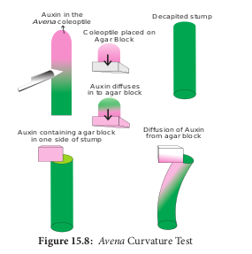

### Gibberellins 1. Discovery
 The effect of gibberellins had been known in Japan since early 1800 where certain rice plants were found to suffer from ‘Bakanae’ or foolish seedling disease. This disease was found by **Kurosawa** (1926) to be caused by a fungus _Gibberella fujikuroi. The active substance_ was separated from fungus and named as

**tic** ially and have

ic Acid (2,4-D) etic Acid (2,4,5-T) A)

  

gibberellin by Yabuta (1935). These are more than 100 gibberellins reported from both fungi and higher plants. They are noted as GA1, GA2, GA3 and so on. GA3 is the first discovered gibberellin. In 1938, **Yabuta** and **Sumiki** isolated gibberellin in crystalline form. In1955, **Brain** _et al.,_ gave the name **gibberellic acid**. In 1961, Cross _et al.,_ established its structure.

**Agent Orange** Mixture of two phenoxy herbicides 2,4-D and 2,4,5-T is given the name ‘Agent orange’ which was used by USA in Vietnam war for defoliation of forest (chemical warfare).

In botanical gardens and tea gardens, gardeners trim the plants regularly so that they remain bushy. Does this practice have any scientific explanation?

Yes, trimming of plants removes apical buds and hence apical dominance. The lateral buds sprout and make the plants bushy.

**2\. Occurrence** The major site of gibberellin production in plants is parts like embryo, roots and young leaves near the tip. Immature seeds are rich in gibberellins. **3\. Precursors** The gibberellins are chemically related to terpenoids (natural rubber, carotenoids and steroids) formed by 5-C precursor, an Isoprenoid unit called Iso Pentenyl Pyrophosphate (IPP) through a number of intermediates. The primary precursor is acetate. **4\. Chemical structure** All gibberellins have gibbane ring structure. **5\. Transport in plants** The transport of gibberellins in plants is non- polar. Gibberellins are translocated through  

phloem and also occur in xylem due to lateral movement between vascular bundles. **6\. Bioassay (Dwarf Pea assay)** Seeds of dwarf pea are allowed to germinate till the formation of the coleoptile. GA solution is applied to some seedlings. Others are kept under control. Epicotyl length is measured and as such, GA stimulating epicotyl growth can be seen. **7\. Physiological Effects*. 
- It produces extraordinary elongation of stem

caused by cell division and cell elongation. 
- Rosette plants (genetic dwarfism) exhibit

excessive internodal growth when they are treated with gibberellins. This sudden elongation of stem followed by flowering by the application of gibberellin is called bolting (Figure 15.9).

- Gibberellin breaks dormancy in potato tubers.

- Many biennials usually flower during second year of their growth. For flowering in the first year it self these plants should be treated with gibberellins.

- Formation of seedless fruits without fertili- zation is induced by gibberellins Example: Seedless tomato, apple and cucumber.

- Promotes elongation of inter-node in sugarcane without decreasing sugar content.

- Promotion of flowering in long day plants even under short day conditions.

- It stimulates the seed germination.

(a) Untreated plant (b) Treated plant showing bolting.

Rosette leaves

### Cytokinins (Cytos – cell, Kinesis – division) 1. Discovery
 The presence of cell division inducing substances in plants was first demonstrated by **Haberlandt** in 1913 in Coconut milk (liquid

  

endosperm of coconut) which contains cell division inducing substances. In 1954, Skoog and Miller discovered that autoclaved DNA from herring sperm stimulated cell division in tobacco pith cells. They called this cell division inducing principle as kinetin (chemical structure: 6-Furfuryl Amino Acid). This does not occur in plants. In 1963, Letham introduced the term cytokinin. In 1964, Letham and Miller isolated and identified a new cytokinin called Zeatin from unripe grains of maize. The most widely occurring cytokinin in plants is Iso Pentenyl adenine (IPA). **2\. Occurrence** Cytokinin is formed in root apex, shoot apex, buds and young fruits. **3\. Precursor** Cytokinins are derivatives of the purine adenine. **4\. Bioassay (Neem Cotyledon Assay)** Neem cotyledons are measured and placed in cytokinin solution as well as in ordinary water. Enlargement of cotyledons is an indication of cytokinin activity. **5\. Transport in plants** The distribution of cytokinin in plants is not as wide as those of auxin and gibberellins but found mostly in roots. Cytokinins appear to be translocated through xylem.

**G R**

**O W**

**TH I**

**N H**

**IB IT**

**O R**

**S**

**Plant G Regul**

**Antagonis**

**Synergist**

**ABA**

Ethylene

**ABA Induces**

**seed dormancy**

**Auxin, G Cytokinin**

**Plant g**

**Ethylene**

**Induce Abscission**

**Induce Abscission**

**Fruit ripening**

**Radial growth**

**Yellowing of leaf**

**Closure of stomata**

**ABA**

**ABA**  

**6\. Physiological effect*. 
- Cytokinin promotes cell division in the

presence of auxin (IAA). 
- Cytokinin induces cell enlargement

associated with IAA and gibberellin. 
- Cytokinin can break the dormancy of

certain light-sensitive seeds like tobacco and induces seed germination.

- Cytokinin promotes the growth of lateral bud in the presence of apical bud.

- Application of cytokinin delays the process of aging by nutrient mobilization. It is known as Richmond Lang effect.

- Cytokinin (i) increases rate protein synthesis (ii) induces the formation of inter-fascicular cambium (iii) overcomes apical dominance (iv) induces formation of new leaves, chloroplast and lateral shoots.

- Plants accumulate solutes very actively with the help of cytokinins.

### Ethylene (Gaseous Phytohormone)
 Almost all plant tissues produce ethylene gas in minute quantities. **1\. Discovery** In 1924, **Denny** found that ethylene stimulates the ripening of lemons. In 1934, **R.** **Gane** found that ripe bananas contain abundant ethylene. In 1935, Cocken et al., identified ethylene as a natural plant hormone.

**SR ET**

**O MO**

**RP**

**HT WO**

**RG**

**rowth ators**

**tic effects**

**ic effects Auxin**

**Gibberellins**

**Cytokinins**

x X

**Apical dominance**

**Prevents abscission Weedicide**

X

**Root /Shoot initiation from**

**Callus**

**Delaying ageing**

**process**

**Promote lateral bud**

**growth**

x

**Bolting**

12

6

9 3

**GA3 Breaks seed dormancy**

**A and 3 induces rowth**

  

**2\. Occurrence** Maximum synthesis occurs during climacteric ripening of fruits (_see_ Box info) and tissues undergoing senescence. It is formed in almost all plant parts like roots, leaves, flowers, fruits and seeds. **3\. Transport in plants** Ethylene can easily diffuse inside the plant through intercellular spaces. **4\. Precursor** It is a derivative of amino acid methionine, linolenic acid and fumaric acid. **5\. Bioassay (Gas Chromatography)** Ethylene can be measured by gas chromatography. This technique helps in the detection of exact amount of ethylene from different plant tissues like lemon and orange. **6\. Physiological Effects*. 
- Ethylene stimulates respiration and ripening

in fruits. 
- It breaks the dormancy of buds, seeds and

storage organs. 
- It stimulates formation of abscission zone

in leaves, flowers and fruits. This makes the leaves to shed prematurely.

- Inhibition of stem elongation (shortening the internode).

- Growth of lateral roots and root hairs. This increases the absorption surface of the plant roots.

- Ethylene normally reduces flowering in plants except in Pine apple and Mango.

### Abscisic Acid (ABA) (Stress Phyto hormone)

**1\. Discovery** In 1963, the hormone was first isolated by **Addicott _et al.,_** from young cotton bolls and named as **Abscission II**. Eagles and Wareing during 1963–64 isolated a dormancy inducing substance from leaves of _Betula_ and called it as dormin. In 1965, it was found by Cornsforth _et al_., that both dormin and abscission are chemically same compounds and called **Abscisi**c **Acid (ABA)**. **2\. Occurrence** This hormone is found abundantly inside  

**3\. Precursors** The hormone is formed from mevalonic acid pathway or xanthophylls. **4\. Transport in plants** Abscisic acid is transported to all parts of the plant through diffusion as well as through phloem and xylem. **5\. Chemical structure** It has carotenoid structure. **6\. Bioassay (Rice Coleoptile)** The inhibition of IAA induces straight growth of rice seedling coleoptiles. **7\. Physiological effects*. 
- It helps in reducing transpiration rate by

closing stomata. 
- ABA is a powerful growth inhibitor. It

causes 50% inhibition of growth in Oat coleoptile.

- It induces bud and seed dormancy. 
- It promotes the abscission of leaves, flowers

and fruits by forming abscission layers. 
- ABA plays an important role in plants

during water stress and during drought conditions. It results in loss of turgor and closure of stomata.

- In Cannabis sativa, induces male flower formation on female plants.

- It promotes sprouting in storage organs like Potato.

- It inhibits the shoot growth and promotes growth of root system. This character protect the plants from water stress. Hence, ABA is called as **stress hormone.**

## Plant Movements
 Plants have the capacity for changing their positions in response to external or internal stimuli, which are known as **plant movements**. Movements are basically of two types: I. Vital movements and II. Physical movements (hygroscopic) (Figure 15.10). **I. Vital movements** Vital movements are those which are exhibited by the living cells or plants or

  

organs and they are always related to the irritability of the protoplasm. These movements are of two types:

A. Movements of locomotion B. Movements of curvature

**A. Movements of locomotion** These movements include the movement of protoplasm inside the cell or movement of whole unicellular or multicellular plant body as in _Chlamydomonas_, gametes and zoospores. **i. Autonomic movements of locomotion** The movements arising from internal changes or internal stimuli of plant body is called **autonomic movements** of locomotion. This movement takes place due to the presence of cilia or flagella and movement of cytoplasm (Cyclosis).

**Plant Movement**

**Vital Movement**

**Variation Movement**

**Tropic (Growth Movem**

**Autonomic (Spontaneous)**

**Autonomic (Spontaneous)**

**Paratonic (Tactic/ Induced)**

**Par (Tactic/**

**Movement of locomotion Movement of curvature**

**Physical Movement**

Ciliary Amoeboid Cyclosis

Phototactic Chemotactic Thermotactic

Geotropic Phototropi Thigmotro Hydrotropi Chemotrop Thermotro Aerotropic

**Growth Movement** Hyponastic Epinastic Nutational

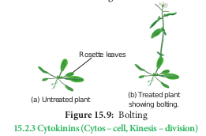

These movements occur in response to light. Example: Zoospores of _Chlamydomonas_

It occurs in response to chemical stimulus. Example: Antherozoids in B r y o p h y t e s a n d P t e r i d o p h y t e s a r e attracted to chemical substances of Archegonia

It occurs in re to heat stimulu Example: _Chlamydomon_ moves from co warm water

**Phototactic Chemotactic Thermota**

**Paratonic or Tactic (induced) movement of locom**

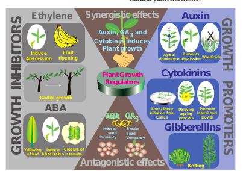

**ii. Paratonic or Tactic (induced) movements of locomotion** The movements due to external factors or stimuli like light, temperature and chemicals are called paratonic movement of locomotion (Figure 15.11). **B. Movement of curvature** In higher plants they are restricted only to bending or curvature of some of their parts. There are mainly two types:

They are i) Autonomic movement of curvature and ii) Paratonic movement of curvature. **i. Autonomic movements of curvature** The movement arising from internal changes or internal stimuli of plant body is called **autonomic movement of curvature. This** does not require any external stimulus. They are two types: a. **Autonomic movement of growth:** It is of

the following types:

Hyponasty Epinasty

 high temperature and remains closed at

**ent)**

**atonic Induced)**

**Nastic (Variation Movement)**

Nyctinastic Seismonastic Thigmonastic

c pic c ic

pic

ments

sponse s.

_as_ ld to

**ctic**

**otion**

s

| Thermotactic |
|------|
| It occurs in  response to heat stimulus. Example: Chlamydomonas moves from cold to warm water |

| Phototactic |Chemotactic |
|------|------|
| These  movements occur  in  response  to light.Example: Zoospores of Chlamydomonas |It  occurs  in  response  to chemical stimulus.Example:  Antherozoids  in Bryophytes  and Pteridophytes  are attracted  to  c hemicalsubstances of Archegonia |

  

3\. Nutation: The growth of the stem apices occurs in a zig-zag manner. It is because the two sides of the stem apex alternatively grow more. Such growth movements are called as nutational movements. In some plants nutational movements allow the shoots apex to grow in helical path in upward direction. This movement is called circumnutation. It is commonly found in the stems of climbers of _Cucurbitaceae_ (Figure 15.13).

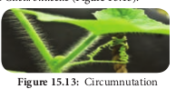

It happens in Indian telegraph plant. (_Desmodium gyrans_). The com pound leaf consists of a larger terminal and two smaller lateral leaflets. During day time, the two lateral leaflets move upward at an angle of 90° and come to lie parallel to the rachis. Again, they may move downward at 180° so that they are parallel to the rachis. They may again move upward at 90° to come in their original position. All these movements occur with jerks after intervals, each movement being completed in about 2 minutes (Figure 15.14).

**ii. Paratonic (induces) movements of curvature**

The movement arising from external stimulus is called **Paratonic** (Induced) movements of curvature. They are of two types. 1) Tropic movements 2) Nastic movements (Table 2)

**Table 2: Differences between Tropic M Tropic Movements**

1\. Movement occurs due to unidirectional stimulus. 2. The stimulus acts on protoplasm from one

direction only. 3. The response is directly related to the direction of

the stimulus. 4. These are movements of curvature caused

by unilateral growth. 5. Tropic movements may be phototropic, geotropic,

hydrotropic, thigmotropic, chemotropic, thermotropic or aerotropic.  

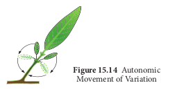
 Autonomic Movement of Variation

**a. Tropic movements** A movement that occurs in response to an unidirectional stimulus is called **tropic movement or tropism. There are seven types** in tropic movements (Geotropic, Phototropic, Thigmotropic, Chemotropic, Hydrotropic, Thermotropic and Aerotropic) **1\. Geotropism** The movements which take place in response to gravity stimulus are called **geotropic movements. The primary roots growing** down into soil are **positive geotropic.** Primary stems that grow away from soil (against gravity) are **negative geotropic**. Secondary roots growing at right angles to the force of gravity are **Diageotropic**. Secondary lateral roots which grow obliquely downwards are **Plagiogeotropic**. Lateral roots and branches which are not sensitive to gravitational stimulus are **Apogeotropic**. **2\. Phototropism** The tropic movement taking place as a response to light stimulus is called **phototropism**. Some of the plant parts such as stems, branches, leaves and pedicels of flowers move towards the stimulus of light and are said to be **positively phototropic** **ovements and Nastic movements**

**Nastic movements** These movements occur due to a diffused stimulus. The stimulus acts on the protoplasm from all sides.

The response has no relation to the direction of the stimulus but with organ. These are also the movement of curvature but they are caused by reversible turgor changes. Nastic movements may be seismonastic, photonastic or thermonastic

| Table 2: Dierences between Tropic Movements and Nastic movements |
|------|------|
| Tropic Movements |Nastic movements |
| 1. Movement occurs due to unidirectional stimulus. |ese movements occur due to a diused stimulus. |
| 2. e stimulus acts on protoplasm from onedirection only. |e stimulus acts on the protoplasm from all sides. |
| 3. e response is directly related to the direction ofthe stimulus. |e response has no relation to the direction of thestimulus but with organ. |
| 4. ese are movements of curvature causedby unilateral growth. |ese are also the movement of curvature but theyare caused by reversible turgor changes. |
| 5. Tropic movements may be phototropic, geotropic,hydrotropic, thigmotropic, chemotropic,thermotropic or aerotropic. |Nastic movements may be seismonastic, photonasticor thermonastic |
  

while others such as roots and rhizoids which move away from the stimulus of light are called **negatively phototropic**. **b. Nastic Movements** When growth movements occur in response to an external stimulus which is not unidirectional but diffused, they are called nastic or paratonic movements of variation. Paratonic variation movements are determined by some external stimuli, light, temperature, chemicals and touch. They are: **1\. Nyctinastic movement (or) sleep**

**movement** The diurnal (change in day-night) movements of leaves and flowers of some species which take up sleep position at night are called **nyctinastic movements. They are caused by relative changes** in cell size on the opposite sides of the leaf base called pulvinus. The movements are attributed to the amount of auxin and K1 ions. The entry of water to the lower side of the pulvinus causes the leaves to stand erect and exit of water causes them to drop. They are of two types: **i. Photonasty** The nastic movement caused in response to light is called **photonasty** or **photonastic**

**Experiment to demonstrate negative geotropism in aerial stem** The Clinostat has a rotating pot like container mounted on an axis rod. A potted plant is fitted horizontally on the Clinostat and rotated slowly which completely eliminates gravity as all the sides of the plant are equally stimulated. If the rotation of the Clinostat is stopped for a considerable period of time then the tip of the stem is observed to curve and grow upwards this proves that the stem tip is negatively geotropic (Figure 15.15).

Clinostat

  

**movement. The opening of leaves and flowers** during daytime and their close at night is an example. **ii. Thermonasty** The nastic movement taking place in response to temperature is called **thermonasty** or **thermonastic movement**. In _Crocus_ the flowers open at high temperature and close at low temperature. **2\. Seismonastic movement** This means a response to shaking. The best example is _Mimosa pudica_ (Touch-me-not plant) which is a sensitive plant (Figure 15.17). Such plants respond to stimuli such as touch, blow or metallic shock by folding their leaflets and lowering their leaves .This effect is caused by the movement of water in

**Experiment to demonstrate positive phototropism in shoot tips** A darkened black box is taken having a small window on one side. A well-watered potted plant is placed inside the box. This is referred to as a phototropic chamber or heliotropic chamber. If the window is kept closed for about 24 hours the plant shows normal growth. If the window is kept opened, it is found after two days that the shoot tip bends and grows towards light proving that it is positively phototropic (Figure 15.16).

**Open WindowClosed Window**

**Direction of LightDarkness**

**Figure15.16** Experiment to demonstrate Photropism

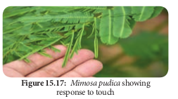

  

and out of the parenchymatous cells of the pulvinus (Figure 15.18).

turgid extensor cells

flexor cells

pu lvi

nu s

stretched flexor cells

flaccid extensor cells

(d)

(e) plasma membrane

cell wall H2O

Ca 2+

TnV N

turgid state

swellingshrinking

H 2 O

K+

Cl-

H+

H 2 O

K+

Cl-

H +

flaccid state

H2O H2O H2O

H2OH2O TnV

N

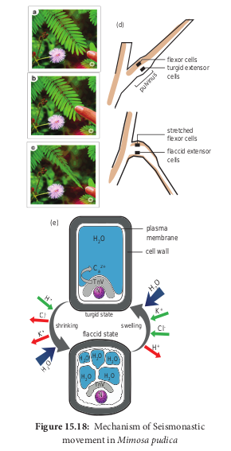

**3\. Thigmonastic movement** The movements found in the leaves of _Drosera and Dionaea (Venus fly trap) result_ in response to the touch stimulus of insects. As soon as an insect sits on the leaf the cilia curve inward to trap the insect and trigger hairs are activated. Similarly, in dionaea, the two halves of the leaf curve upwards along the midrib. These parts of the leaves come  

to their normal position after the insect has been digested (Figure 15.19).

**Figure 15.19: Thigmonasty in Dionaea**

**II Physical Movement (Hygroscopic Movements)**

Physical movements are those which are found in dead parts of the plants and they are not related to any irritability of the protoplasm. They are also called hygroscopic **movements** or **mechanical movements**. Dispersal of spores and seeds, dehiscence of sporangia, bursting of seeds and movement of elaters are the examples of physical or hygroscopic movement.

## Photoperiodism
 Trees take several years for initiation of flowering whereas an annual herb flowers within few months. Each plant requires a specific time period to complete their vegetative phase which will be followed by reproductive phase as per their internal control points through Biological Clock. The physiological mechanisms in relation to flowering are controlled by (i) light period (Photoperiodism) and (ii) temperature (Vernalization). The physiological change on flowering due to relative length of light and darkness (photoperiod) is called Photoperiodism. The term photoperiodism was coined by **Garner** and **Allard** (1920) when they observed this in ‘Biloxi’ variety of soybean (_Glycine max_) and ‘Maryland mammoth’ variety of tobacco (Nicotiana tabacum). The photoperiod required to induce flowering is called critical **day length**. Maryland mammoth (tobacco variety) requires 12 hours of light and cocklebur (_Xanthium pensylvanicum_) requires 15.05 hours of light for flowering.

  

**1\. Classification of plants based on Photoperiodism**

i. Long day plants: The plants that require long critical day length for flowering are called long day plants or short night plants. Example: Pea, Barley and Oats.

ii. Short day plants: The plants that require a short critical day length for flowering are called short day plants or long night plants. Example: Tobacco, Cocklebur, Soybean, Rice and _Chrysanthemum_.

iii. Day neutral plants: There are a number of plants which can flower in all possible photoperiods. They are also called photo **neutrals** or **indeterminate plants**. Example: Potato, _Rhododendron_, Tomato and Cotton.

**2\. Photoperiodic induction** An appropriate photoperiod in 24 hours’ cycle constitutes one inductive cycle. Plants may require one or more inductive cycles for flowering. The phenomenon of conversion of leaf primordia into flower primordia under the influence of suitable inductive cycles is called **photoperiodic induction**. Example: _Xanthium_ (SDP) – 1 inductive cycle and _Plantago_ (LDP) – 25 inductive cycles. **3\. Site of Photoinductive perception**

**A B C D E F**

Short Day Long Day

Short Day

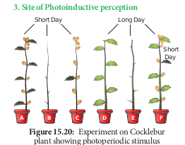

Photoperiodic stimulus is perceived by the leaves. Floral hormone is synthesised in leaves and translocated to the apical tip to promote flowering. This can be explained by a simple experiment on Cocklebur (_Xanthium pensylvanicum_), a short day plant.  

Usually Xanthium will flower under short day conditions. If the plant is defoliated and kept under short day conditions it will not flower. Flowering will occur even when all the leaves are removed except one leaf. If a cocklebur plant is defoliated and kept under long day conditions, it will not flower. If one of its leaves is exposed to short day condition and rest are in long day condition, flowering will occur (Figure 15.20). **4\. Importance of photoperiodism** 1\. The knowledge of photoperiodism

plays an important role in hybridisation experiments.

2\. Photoperiodism is an excellent example of physiological pre-conditioning that is using an external factor to induce physiological changes in the plant.

**5\. Phytochrome**

**P** 660nm

730nm Physiological response**X**

**X**

r **Pfr Pfr**

**_Day_**

**_Night_**

Phytochrome is a bluish biliprotein pigment responsible for the perception of light in photo physiological process. **Butler** **_et al.,_** (1959) named this pigment and it exists in two interconvertible forms: (i) red light absorbing pigment which is designated as Pr and (ii) far red light absorbing pigment which is designated as Pfr. The Pr form absorbs red light in 660nm and changes to Pfr. The Pfr form absorbs far red light in 730nm and changes to Pr. The Pr form is biologically inactive and it is stable whereas Pfr form is biologically active and it is very unstable. In short day plants, Pr promotes flowering and Pfr inhibits the flowering whereas in long day plants flowering is promoted by Pfr and inhibited by Pr form. Pfr is always associated with hydrophobic area of membrane systems while Pr is found in diffused state in the cytoplasm. The interconversion of the two forms of phytochrome is mainly involved in flower induction and also additionally plays

  

a role in seed germination and changes in membrane conformation.

## Vernalization (_Vernal_ – Spring Like)
 Besides photoperiod certain plants require a low temperature exposure in their earlier stages for flowering. Many species of biennials and perennials are induced to flower by low temperature exposure (0oC to 5oC). This process is called Vernalization. The term Vernalization was first used by T. **D. Lysenko** (1938).

**1\. Mechanism of Vernalization:** Two main theories to explain the mechanism of vernalization are:

i. Hypothesis of phasic development ii. Hypothesis of hormonal involvement

**i. Hypothesis of phasic development** According to Lysenko, development of an annual seed plant consists of two phases. First  

phase is **thermostage**, which is vegetative phase requiring low temperature and suitable moisture. Next phase is **photo stage** which requires high temperature for synthesis of florigen (flowering hormone).

**ii. Hypothesis of hormonal involvement** According to **Purvis** (1961), formation of a substance A from its precursor, is converted into B after chilling. The substance B is unstable. At suitable temperature B is converted into stable compound D called **Vernalin**. Vernalin is converted to F (Florigen). Florigen induces flower formation. At high temperature B is converted to C and devernalization occurs (Figure 15.21).

**2\. Technique of Vernalization:** The seeds are first soaked in water and allowed to germinate at 10o C to 12o C. Then seeds are transferred to low temperature (3oC to 5oC) from few days to 30 days. Germinated seeds

  

after this treatment are allowed to dry and then sown. The plants will show quick flowering when compared to untreated control plants.

**A**

**B D**

**F** Translocation of flower

inducing substance

**C**

**Chilling**

**Precursor**

**Vernalin**

**Florigen**

High temperature

**Devernalization**

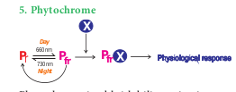

and induces the plant to flower earlier. 2. It increases the cold resistance of the plants. 3. It increases the resistance of plants to fungal

disease. 4. Plant breeding can be accelerated.

## Seed Germination and Dormancy I. Seed Germination
 The activation and growth of embryo from seed into seedling during favourable conditions is called **seed** **germination**. **1\. Types of germination** There are two methods of seed germination. Epigeal and hypogeal. **i. Epigeal germination** During epigeal germination cotyledons are pushed out of the soil. This happens due to the elongation of the hypocotyl. Example: Castor and Bean. **ii. Hypogeal germination** During hypogeal germination cotyledons remain below the soil due to rapid elongation of epicotyls (Figure 15.22). Example: Maize, Pea. **2\. Factors affecting germination** Seed germination is directly affected by external and internal factors:  

**i. External factors** a. **Water**: It activates the enzymes which

digest the complex reserve foods of the seed. If the water content of the seed goes below a critical level, seeds fail to germinate.

b. **Temperature**: Seeds fails to germinate at very low and high temperature. The optimum temperature is 25oC to 35oC for most tropic species.

c. **Oxygen**: It is necessary for germination. Since aerobic respiration is a physiological requirement for germination most will germinate well in air containing 20% oxygen.

d. Light: There are many seeds which respond to light for germination and these seeds said to be photoblastic.

e. **Soil conditions**: Germination of seed in its natural habit is influenced by soil conditions such as water holding capacity, mineral composition and aeration of the soil.

**ii. Internal factors** a. Maturity of embryo: The seeds of some

plants, when shed will contain immature embryo. Such seeds germinate only after maturation of embryo.

b. **Viability**: Usually seeds remain viable or living only for a particular period. Viability

Foliage leaves

Hypocotyl

Radicle

**(b) Pea**

Epicotyl

Cotyledon

Hypocotyl

Epicotyl

Hypocotyl

Cotyledon

Foliage leaves

Hypocotyl

Radicle

**(a) Bean**

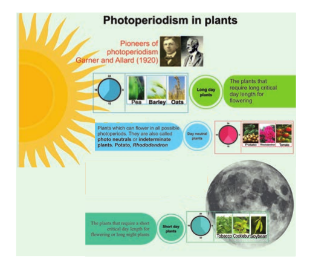

  

of seeds range from a few days (Example: _Oxalis_) to more than hundred years. Maximum viability (1000 years) has been recorded in lotus seeds. Seeds germinate only within the period of viability.

c. **Dormancy**: Seeds of many plants are dormant at the time of shedding. A detailed treatment is given below.

**II. Seed Dormancy** The seeds of most plants germinate under favourable environmental conditions but some seeds do not germinate when suitable conditions like water, oxygen and favourable temperature are not available. Germination of such seeds may be delayed for days, months or years. The condition of a seed when it fails to germinate even in suitable environmental condition is called seed dormancy. There are two main reasons for the development of dormancy: Imposed dormancy and innate dormancy. Imposed dormancy is due to low moisture and low temperature. Innate dormancy is related to the properties of seed itself. **1\. Factors causing dormancy of seeds:**

i. Hard, tough seed coat causes barrier effect as impermeability of water, gas and restriction of the expansion of embryo prevents seed germination.

ii. Many species of seeds produce imperfectly developed embryos called **rudimentary embryos** which promotes dormancy.

iii. Lack of specific light requirement leads to seed dormancy.

iv. A range of temperatures either higher or lower cause dormancy.

v. The presence of inhibitors like phenolic compounds which inhibits seed germination cause dormancy.

**2\. Methods of breaking dormancy:** The dormancy of seeds can be broken by different methods. These are: i. Scarification: Mechanical and chemical

treatments like cutting or chipping of hard tough seed coat and use of organic solvents to remove waxy or fatty compounds are called as Scarification.  

ii. **Impaction**: In some seeds water and oxygen are unable to penetrate micropyle due to blockage by cork cells. These seeds are shaken vigorously to remove the plug which is called **Impaction**.

iii. Stratification: Seeds of rosaceous plants (Apple, Plum, Peach and Cherry) will not germinate until they have been exposed to well aerated, moist condition under low temperature (0oC to 10oC) for weeks to months. Such treatment is called **Stratification.**

iv. **Alternating temperatures**: Germination of some seeds is strongly promoted by alternating daily temperatures. An alternation of low and high temperature improves the germination of seeds.

v. Light: The dormancy of photoblastic seeds can be broken by exposing them to red light.

## Senescence
 Plant life comprises some sequential events, _viz_: germination, juvenile stage, maturation, old age and death. Old age is called **senescence** in plants. Senescence refers to all collective, progressive and deteriorative processes which ultimately lead to complete loss of organization and function. Unlike animals, plants continuously form new organs and older organs undergo a highly regulated senescence program to maximize nutrient export.

The branch of botany which deals with ageing, abscission and senescence is called **Phytogerontology**

**1\. Types of Senescence Leopold** (1961) has recognised four types of senescence:

i. Overall senescence ii. Top senescence iii. Deciduous senescence iv. Progressive senescence i. Overall senescence: This kind of

senescence occurs in annual plants when entire plant gets affected and dies.

  

Example: Wheat and Soybean. It also occurs in few perennials also. Example: _Agave_ and Bamboo.

ii. **Top senescence**: It occurs in aerial parts of plants. It is common in perennials, underground and root system remains viable. Example: Banana and _Gladiolus_.

iii. **Deciduous senescence**: It is common in deciduous plants and occurs only in leaves of plants, bulk of the stem and root system remains alive. Example: Elm and Maple.

iv. Progressive senescence: This kind of senescence is gradual. First it occurs in old leaves followed by new leaves then stem and finally root system. It is common in annuals (Figure 15.23).

**Overall senescence**

**Top senescence**

**Deciduous senescence**

**Progressive senescence**

**Figure 15.23: Different types of** senescence in plants

**2\. Physiology of Senescence*. 
- Cells undergo changes in structure. 
- Vacuole of the cell acts as lysosome and

secretes hydrolytic enzymes. 
- The starch content is decreased in the cells. 
- Photosynthesis is reduced due to loss of

chlorophyll accompanied by synthesis and accumulation of anthocyanin pigments, therefore the leaf becomes red.

- There is a marked decrease in protein content in the senescing organ.

- RNA content of the leaf particularly rRNA level is decreased in the cells due to increased activity of the enzyme RNAase.

- DNA molecules in senescencing leaves degenerate by the increased activity of enzyme DNAase.

**3\. Factors affecting Senescence:*. 
- ABA and ethylene accelerate senescence

while auxin and cytokinin retard senescence.

**Mitochondria**

**Vacuole**

**Nucleus**

**Plastid**

**Mitochondria**

**Vacuole**

**Nucleus**

**Plastid**  

- Nitrogen deficiency increases senescence whereas nitrogen supply retards senescence.

- High temperature accelerates senescence but low temperature retards senescence.

- Senescence is rapid in dark than in light. 
- Water stress leads to accumulation of ABA

leading to senescence. **4\. Programmed cell death (PCD)**

**Mitochondria**

**Vacuole**

**Nucleus**

**Plastid**

**Mitochondria**

**Vacuole**

**Nucleus**

**Plastid**

![ Programmed cell death Senescence is controlled by plants own genetic programme and death of the plant or plant part consequent to senescence is called **Programmed Cell Death**. In short senescence of an individual cell is called **PCD**. The proteolytic enzymes involving PCD in plants are **phytaspases** and in animals are **caspases. The nutrients and other substrates** from senescing cells and tissues are remobilized and reallocated to other parts of the plant that survives. The protoplasts of developing xylem vessels and tracheids die and disappear at maturity to make them functionally efficient to conduct water for transport. In aquatic plants, aerenchyma is normally formed in different parts of the plant such as roots and stems which encloses large air spaces that are created through PCD. In the development of unisexual flowers, male and female flowers are present in earlier stages, but only one of these two completes its development while other aborts through PCD (Figure 15.24).](15.24.png "")

  

**5\. Abscission** Abscission is a physiological process of shedding of organs like leaves, flowers, fruits and seeds from the parent plant body. When these parts are removed the plant seals off its vascular system to prevent loss of water and nutrients. Final stage of senescence is abscission. In temperate regions all the leaves of deciduous plants fall in autumn and give rise to naked appearance, then the new leaves are developed in the subsequent spring season. But in evergreen plants there is gradual abscission of leaves, the older leaves fall while new leaves are developed continuously throughout the year.

**6\. Morphological and Anatomical changes during abscission** Leaf abscission takes place at the base of petiole which is marked internally by a distinct zone of few layers of thin walled cells arranged transversely. This zone is called **abscission zone or abscission layer**. An abscission layer is greenish-grey in colour and is formed by rows of cells of 2 to 15 cells thick. The cells of abscission layer separate due to dissolution of middle lamella and primary wall of cells by the activity of enzymes **pectinase** and **cellulase** resulting in loosening of cells. Tyloses are also formed blocking the conducting vessels. Degrading of chlorophyll occur leading to the change in the colour of leaves, leaf detachment from the plant and leaf fall. After abscission, outer layer of cells becomes suberized by the development of periderm (Figure 15.25). **7\. Hormones influencing abscission** All naturally occurring hormones influence the process of abscission. Auxins and cytokinins retard abscission, while abscisic acid (ABA) and ethylene induce it.

**8\. Significance of abscission** 1\. Abscission separates dead parts

of the plant, like old leaves and ripe fruits. **Figur**

**Allelopathy**  

2\. It helps in dispersal of fruits and continuing the life cycle of the plant.

3\. Abscission of leaves in deciduous plants helps in water conservation during summer.

4\. In lower plants, shedding of vegetative parts like gemmae or plantlets help in vegetative reproduction.

Abscission layer

Cortex

Pholoem

Xylem

## Stress Physiology
 Like all other organisms, plants are also subjected to various environmental stresses such as water deficit, drought, cold, heat, salinity and air pollution. The study of functioning of plants under adverse environmental conditions is called **stress physiology**. **Jacob Levitt (1972) first used the term biological stress** in relation to plants and according to him stress is “any change in environmental condition that might adversely change the growth and development of a plant”.

**e 15.26: Classification of Stress types in plants**

**Environmental Stress**

**Biotic**

**Atmospheric**

**Water**

**Pathogenecity Edaphic**

**Salt Light Temperature Air pollution**

**Abiotic**

| Biotic |Abiotic |
|------|------|------|------|------|

| Pathogenecity |Atmospheric |
  

The reaction of plants facing stress is called **strain**. For example, if a normal plant growing under favourable light conditions is subjected to low light intensity, its photosynthesis is reduced. Thus, low light intensity is referred as stress and reduction of photosynthesis is referred as strain. Biological strains are of two types; Elastic biological strain and Plastic biological strain. If the reaction of plant function is temporary and when it returns to its original state it is called **elastic biological strain**. Example: Temporary wilting. If the reaction is permanent and the plant function does not return to the normal state it is called **plastic biological strain**. Example: Permanent wilting. Some plants get adapted to stress condition and are not adversely affected by stress. Such plants are called **stress resistant** or **stress tolerant** plants. Example: Mangroves. Some plants cannot face stress and they pass their adverse period in dormant state and so they are called **stress enduring plants**. Ephemeral plants are short lived desert plants, which complete their life cycle during the seasonal rains before the onset of dry season. These ephemeral plants are called **stress escapers**. Stress in plants can be classified as given in figure 15.26. **1\. Biotic Stresses** These are adverse effects on plants caused by other living organisms such as viruses, bacteria, fungi, parasites, insects, weeds and competing plants. Biotic environmental stress is also caused due to the activity of man by cutting herbs and trees, twigs for fodders, fuels and agricultural purposes. The biotic stresses caused by bacteria, fungi and nematodes that are ever present in the environment are called potential biotic stresses. These are divided into two types. They are: **i) Allelopathy** An organism producing one or more biochemical substances that greatly influence the germination, growth and  

reproduction of other organisms is called Allelopathy. These biochemicals are known as allelochemicals. They are beneficial (positive allelopathic) or detrimental (negative allelopathic). These allelochemicals are obtained from leaf after leaching on the ground and also from roots. The term allelopathy is from Greek words _allelon-each other and pathos-to suffer_ and first used in 1937 by Hans Molisch. Allelopathic effect may occur with weeds on crops and _vice versa_ (Figure 15.27).

Allelochemicals

Positive Allelopathy Allelopathic plant

Negative Allelopathy

SOIL

Retard growth

Promote growth

One of the most famous allelopathic plants is Black walnut (Juglans nigrum). The chemical which is present in Black walnut is Juglone and it is a respiratory inhibitor. Solanaceous plants such as tomato, capsicum and eggplant are susceptible to juglone. These plants when exposed to these allelochemicals exhibit symptoms such as wilting, chlorosis and death.

**Check your grasp!** Are all plants allelopathic? Can allelopathic chemicals affect animals and humans?

Tree of heaven (_Ailanthus altissima_) is a recent addition to the list of allelopathic trees. **Ailanthone** an allelochemical extracted from the root of _Ailanthus_ acts as potent herbicide. In _Sorghum_ plant the allelochemical sorgolone possess allelopathic activity. It is found in root exudates of most _Sorghum_ species. Root exudation of maize inhibits the growth of some weeds such as _Chenopodium album_ and _Amaranthus retroflexus. The seed exudates of_ oat (Avena fatua) affect the germination of wheat seedling.

  

**ii. Pathogenecity** The effect of microbes that cause diseases in plants. Example: _Xanthomonas citri_ **2\. Abiotic Stresses** Abiotic stress may occur due to an atmospheric condition (atmospheric stress) or soil condition (edaphic stress). Atmospheric stresses may occur due to excess and deficient levels of light, temperature and air pollutants. **i. Light Stress** Light limits the distribution of species. In low light intensity **Sciophytes** (shade loving plants) develop, while in high light intensity **Heliophytes** (high light loving plants) develop. In low light intensity, stomata do not fully open hence there is less diffusion of gases. As a result, there is less photosynthesis and the chlorophyll synthesis is also affected. High light intensity also inhibits photosynthesis. Change in photoperiod inhibits flowering. **ii. Temperature** Plants are adapted to a particular region and they face temperature stress in another region. **a. High temperature** High temperature causes soil and atmospheric drought. Plants are subjected to permanent wilting in soil drought and temporary wilting in atmospheric drought. Plants generally die above temperature of 44oC. However, some organisms like _Mastigocladus_ (a cyanobacterium) grow well at 85oC to 90oC in hot springs. At 42oC synthesis of normal protein declines and new protein called Heat Shock Proteins (HSPs) appears. These proteins were discovered in fruit fly (Drosophila melanogaster) and since then they have also been discovered in animals, plants and microorganisms. At high temperature all physiological processes decline. Photosynthesis decreases and respiration increases. So, plants face a shortage of organic substances.  

Apple, a temperate plant, when planted in tropical condition fails to produce fruits and growth is also affected.

**b. Low Temperature** Low temperature stress is quite harmful to plants and the temperature near freezing point causes irreversible damage so that the plants fail to survive under extreme cold conditions. However, some plants growing in alpine and arctic regions can survive under low temperature and such plants are said to be **cold resistant**. Stress due to freezing temperature is called **frost stress**. Temperature below 10oC, decreases root growth, increases leakage of ions and ethylene production.

Some plant parts like Seeds, pollen grains and embryos can be stored at very low temperature (–196oC).

**iii. Air pollutants** Important atmospheric pollutants prevalent in the Indian sub-continent are CO2, CO, SO2, NO2, O3, fluoride and H2S. These pollutants do not cause visible injury but cause hidden injury. If the concentration of these pollutants increases visible injury like chlorotic and necrotic spots appear on leaves as well as inhibit photosynthetic carbon metabolism and biomass formation. Some pollutants at low concentration stimulate plant growth. Example: SO2, NO2

and NO. Respiration and photorespiration are sensitive to air pollutants. If the concentration of air pollutants is high, it inhibits respiration whereas at lower concentration stimulates respiration. Nitrogenous air pollutants under chronic exposure increases chlorophyll content while NO2 reduces pigment content at acute exposure.

  

**iv. Edaphic Stress** They are divided into two types. They are water **stress** and **salt stress: a. Water stress** A common stress condition arising from lack of water or excess of water is called **water stress. The abundance of water leads to a stress** called flood stress and scarcity of water leads to a stress called **drought stress**. **I. Flood Stress** The temporary inundation of plants and its parts by flooding causes oxygen deficiency to the roots and soil borne microorganisms. Effects of flooding are as follows: Nitrogen turnover in the soil is reduced; Abscisic acid, ethylene and ethylene precursors are formed in larger amount; Stimulation of partial stomatal closure, epinasty and abscission in leaves; Cellular membrane systems break down, mitochondria and microbodies disintegrate and enzymes are partially inhibited. Flood tolerant plants include those found on permanently wet soils. Examples: Marsh plants, shore plants and hydrophytes. Tree species found dominant in flooded sites are also tolerant. Examples: _Taxodium disticum,_ Mangroves and palms are tolerant to flood stress. **II. Drought Stress** The term ‘drought’ denotes a period without appreciable precipitation, during which the water content of the soil is reduced to such an extent that plants suffer from water deficiency. Effects of drought are as follows: Decrease in cellular growth and synthesis of cell wall components cause the cells to become smaller in size; Nitrogen fixation and its reduction are decreased by decreasing the activity of certain enzymes; Increase in abscisic acid level ultimately closes down the stomatal apparatus to the minimum, hence, transpiration declines; Protochlorophyll formation is inhibited and photosynthetic process declines; ; Wilting in mature leaves is associated with carbohydrate depletion due to mobilization export, followed by leaf senescence.  

**Mechanism of drought resistance** Xerophytes are well adapted for drought either because,

i. the protoplasm of such plants does not die when it faces extreme or prolonged desiccation (dehydration) hence, it tolerates or endures such conditions. Example: Creosote bush (_Larrea tridentata_) can survive water content drops upto 30% whereas, in most plants the lethal level is below 50–70% or these plants are able to avoid or postpone the lethal level of desiccation because they have developed structural or physiological adaptations. Plants have developed following mechanisms:

- To avoid or postpone desiccation improved water uptake by developing the roots to deep water source

- Improved water uptake by roots which penetrate deep water source; Increasing and enlarging the conductive tissues.

- Stomata present only on the lower epidermis with by dense trichomes;

- Rolling of leaves and water storage in succulent tissue.

During drought stress an essential protection mechanism that stabilizes the cell structure is induced gene expression of **stress protein (dehydrin and osmotin)**. These proteins protect the macromolecules in the cytoplasm and in the nucleus, the cytoskeleton (biomembranes) against denaturation. High desiccation tolerance implies that the protoplasm rehydrates when water becomes available. Plants growing in deserts and arid regions are usually drought resistant.

Resurrection plants, those plants having ability to survive near total drying which causes them to appear

dead. They recover when water is available. Example: _Selaginella lepidophylla_

  

**b. Salt Stress** Presence of high salt concentration in the soil restricts the growth and development of plants. Most commonly the plants which are present near the seashore and estuaries are subjected to salt stress. According to an estimate about one third of irrigated land on earth is affected by salt stress. Na1, Cl2, K1, Ca11 and Mg11 ions usually contribute to soil salinity. Plants growing in such areas face two problems: 1. Absorption of water from the soil with

negative water potential 2. Interaction with high concentration of

toxic sodium carbonate and chloride ions. On the basis of salt tolerance, they are

grouped into two categories: 1. Halophytes 2. Non-halophytes or glycophytes

Halophytes are native to saline soils. The halophytes which can resist a range of salt concentration are called as **euryhaline** and those with narrow range of resistance are called **stenohaline**. Non-halophytes cannot resist salts as the halophytes. _Helianthus annus tolerates high Mn21 ions. Those which_ are present in salt regions face two problems. 
- One is high concentration of salts in soil

water leads to decrease in water potential so they grow in opposite direction. Example: _Salicornia._

- Injuries in salt affected plants caused by both osmotic effects and specification effects. Accumulation of chloride ions reduces water absorption and transpiration. Salt stress due to deficiency of mineral

elements (K, P, S, Fe, Mo, Zn, Mg, Mn) causes physiological disorders which lead to reduced growth and yields. 1. Salt accumulators absorb and store salts

so that the osmotic potential of their cells continues to remain negative throughout the growing region.

2\. In some salt hardy plants, the excess salt is excluded on the surface of leaves. Some  

plants have salt glands which secrete salt (mostly NaCl). The exuded salt absorbs water hygroscopically from the atmosphere.

3\. Some plants lose their excess salt by leaching into the soil or by dropping their salt filled leaves.

4\. Salt tolerant plants (true halophytes) synthesize large amounts of the amino acid proline, galactosyl glycerol and some organic acids which function in osmotic adjustments.

**Mechanism of salt tolerance** The plants growing in salty habitats like halophytes face the problem of excessive dissolved salts in the solution. Excess of salt creates comparatively more negative osmotic potential so that the plants tend to lose water into surrounding medium. Under such conditions the plants tend to lose water only when their water potential becomes more negative. It is possible only if they absorb excess of salt and accumulate it in their cell saps to maintain the same or higher concentrations as those of outside plants. **The drawbacks:**

1\. Salt accumulates in the vacuoles 2. The plants become succulents 3. Accumulated salt dehydrates the

cytoplasm 4. Sodium chloride cannot be tolerated in

the cytoplasm and it denatures several enzymes

Thus, absorption and accumulation of inorganic salts fail to solve the problem. The plants however tolerate the salt stress by synthesizing organic compounds that can exist at high salt concentrations without denaturing the enzymes. These organic compounds are called **nontoxic organic osmotica**. Examples: Proline and Betalin (osmoregulators).

**Summary** Growth occurs by cell division, cell elongation and cell maturation. The first phase is lag phase, the second is log phase and the final phase is steady state phase. The

  

log phase is otherwise known as **exponential phase. The three phases are collectively** called Grand period of growth. Plant growth and development are controlled by both internal and external factors. The internal factors are chemical substances called Plant Growth Regulators (PGRs). The hormones are classified into five groups: Auxins, gibberellins, cytokinins, abscisic acid and ethylene. These PGRs are synthesized in various parts of the plant. PGRs may act synergistically or antagonistically. Mechanism of flowering is controlled by light period (photoperiodism) and temperature (vernalization). The physiological changes on flowering with effect from relative length of light and darkness (photoperiodism) are called photoperiodism. A bluish biliprotein responsible for the perception of light in photophysiological process (induction and inhibition of flowering) is called **Phytochrome**. Besides photoperiod certain plants require a low temperature in the earlier stages for flowering. Many biennial and perennial plants are induced to flower by low temperature (0oC to 5oC). This process is called vernalization and the reversal effect of vernalization is called **devernalization**. The condition of a seed when it fails to germinate even in suitable environmental condition is called seed dormancy. Thus, dormancy can be overcome by following methods such as scarification, impaction, stratification, alternating temperatures and light. Senescence refers to all collective, progressive and deteriorative processes which ultimately lead to complete loss of organization and function. Senescence is of four types and they are overall, top, deciduous and progressive. Senescence is controlled by plant’s own genetic programme. Death of the plant or its parts consequent to senescence is called **Programmed Cell Death** (PCD). The final stage of senescence is abscission.  

Abscission is a physiological process of shedding of organs from the parent plant body. The study of functioning of plants under adverse environmental conditions is called stress physiology. The environmental stress may broadly be divided into biotic and abiotic stress. The adverse effect on plants caused by other living organisms such as viruses, bacteria, fungi, parasites, insects, weeds is competing plants are called biotic stress. Abiotic stress may occur due to an atmospheric condition or soil condition.

**Evaluation** 1\. Select the wrong

statement from the following:

a. Formative phase of the cells retain the capability of cell division.

b. In elongation phase development of central vacuole takes place.

c. In maturation phase thickening and differentiation takes place.

d. In maturation phase, the cells grow further.

2\. If the diameter of the pulley is 6 inches, length of pointer is 10 inches and distance travelled by pointer is 5 inches. Calculate the actual growth in length of plant. a. 1.5inches b. 6 inches c. 12 inches d. 30 inches

3\. \_\_\_\_\_\_\_\_ is the powerful growth inhibitor a. Ethanol b. Cytokinins c. ABA d. Auxin

4\. Select the correctly matched one A) Human urine i) Auxin –B B) Corn gram oil ii) GA3 C) Fungus iii) Abscisic acid II D) Herring fish iv) Kinitin

sperm

  

E) Unripe maize v) Auxin A grains

F) Young cotton vi) Zeatin bolls

a) A-iii, B-iv, C-v, D-vi, E-i, F-ii, b) A-v, B-i, C-ii, D-iv, E-vi, F-iii, c) A-iii, B-v, C-vi, D-i, E-ii, F-iv, d) A-ii, B-iii, C-v, D-vi, E-iv, F-i

5\. Seed dormancy allows the plants to a. overcome unfavourable climatic

conditions b. develop healthy seeds c. reduce viability d. prevent deterioration of seeds

Web URL: https://www.classzone.com/books/hs/ca/sc/bio\_0

**How do Plants respon**

**Step 1 Step 2 Step 3**

**Steps*. 
- Scan the Q. 
- Click Explo. 
- Select item. 
- Follow the . 
- Record your

Let’s Stimulate **the Plants.**

**Activity*. 
- Observe th. 
- Conclude yo  

6\. Which one of the following method are used to break the seed dormancy?

a) Scarification b) Impaction c) Stratification d) All the above.

7\. Write the physiological effects of Cytokinins.

8\. Describe the mechanism of photoperiodic induction of flowering.

9\. Give a brief account on Programmed Cell Death (PCD)

10\. What are the physiological effects of plants facing drought condition?

11\. Explain the mechanism of biotic stress.

**7/virtual\_labs/virtualLabs.html**

**d to different stimuli?**

**Step 4**

code ing plant responses and complete the check list rocedure – 1 to 10 steps prediction and not your observation in lab note – Right top

\* Pictures are indicative only

movements of plant seedlings and plant parts. ur observations.

|------|------|------|

  

S. No. Botanical Name Comm 1. _Abrus precatorius_ Crab’s eye 2. _Acacia nilotica_ Babul tree 3. _Acalypha indica_ Indian Acaly 4. _Achyranthes aspera_ Chaff flower 5. _Albizia lebbeck_ Indian siris 6. _Allium cepa_ Onion 7. _Allium sativum_ Garlic 8.. _Aloe vera_ Indian aloe 9. _Alstonia scholaris_ Devilwood

10\. _Amorphophallus paeoniifolius_ Elephant fo 11. _Argemone mexicana_ Mexican pop 12. _Areca catechu_ Betel nut 13. _Avicennia marina_ White mang 14. _Azadirachta indica_ Neem 15. _Beta vulgaris_ Beetroot 16. _Bombax ceiba_ White Silk c 17. _Bambosa bambos_ Bamboo 18. _Borassus flabellifer_ Palmyra pal 19. _Bougainvillea_ Paper flower 20. _Brassica juncea_ Mustard 21. _Brassica oleracea var. botrytis_ Cauliflower 22. _Brassica oleracea var. capitata_ Cabbage 23. _Caesalpinia pulcherrima_ Peacock flow 24. _Calotropis gigantea_ Giant milkw 25. _Canna indica_ Canna 26. _Carica papaya_ Papaya 27. _Cassia auriculata_ Avaram 28. _Cassia fistula_ Indian labur 29. _Casuarina equisetifolia_ Whistling pi 30. _Ceiba pentandra_ Red silk cott 31. _Centella asiatica_ Indian penn 32 _Chrysanthemum indicum_ Chrysanthem 33 _Cinnamomum zeylanicum_ Cinnamon 34 _Cocos nucifera_ Coconut 35 _Coffea arabica_ Coffee plant 36 _Colocasia esculenta_ Cocoyam 37 _Coriandrum sativum._ Coriander 38 _Corypha umbraculifera_ Talipot palm 39 _Couroupita guianensis_ Cannonball 40 _Crotalaria retusa_ Rattle weed 41 _Cucumis sativus_ Cucumber 42. _Curcuma amada_ Mango ging 43. _Cuscuta reflexa_ Dodder plan 44. _Daucus carota_ Carrot 45. _Delonix regia Gulmohar,fl_

**Botanical Names an**  

on Name Tamil Name குன்றிமணி கருவேலம்

pha குப்பைவமனி நாயுருவி ோ்க வேஙகாயம் வேள்ளைபபூண்டு வ�ாற்றுககற்்ா்ை ஏழி்லபபைா்ல

ot yam கரு்ைக கிைஙகு

py குடிவயாட்டிப பூண்டு பைாககு / கமுகு

rove வேள்ளை அ்லயாற்றி வேம்பு பீட்ருட்

otton இலேம் பைஞ்சு மூஙகில்

m பை்ை காகிதபபூ கடுகு காலிஃபிளைேர் முட்்டைகவகாசு

er மயிற்வகான்்்

eed எருககு கல்ோ்ை பைபபைாளி ஆோ்ை

num வகான்்்

ne �வுககு

on வ�வ்விலே மைம்

y wort ேல்லா்ை

um �ாமந்தி பைட்்டை வதன்்ை காிஃபி தாேைம் வ�்ைக கிைஙகு வகாத்துமல்ல தாழிபபை்ை

tree நாகலஙகமைம் கிலுகிலுப்பை வேளளைரி

er மா இஞ்சி

t அம்்மயார் கூந்தல் காைட்

ame tree. வ�ம்மயிற்வகான்்்.

**d Common Names**

| S. No. |B otanical Name |Common Name |Tamil Name |
|------|------|------|------|
| 1. |Abrus precatorius |Crab’s eye |¤å†ம~ |
| 2. |Acacia nilotica |Babul tree |க±வேலÝ |
| 3. |Acalypha indica |Indian Acalypha |¤ப்Hவம |
| 4. |Achyranthes aspera |Cha ower |நா°±Š |
| 5. |Albizia lebbeck |Indian siris |ோ்க |
| 6. |Allium cepa |Onion |வேஙகாயÝ |
| 7. |Allium sativum |Garlic |வேள்NபÁÙ© |
| 8.. |Aloe vera |Indian aloe |வ�ாä²ககä்ா்ை |
| 9. |Alstonia scholaris |Devilwood |ஏ‰்லபHா்ல |
| 10. |Amorphophallus paeoniifolius |Elephant foot yam |க±்ை க xைங¤ |
| 11. |Argemone mexicana |Mexican poppy |¤}வயாØ}ப ÁÙ© |
| 12. |Areca catechu |Betel nut |Hாக¤ / க¯¤ |
| 13. |Avicennia  marina |White mangrove |வேள்N அ்லயாä† |
| 14. |Azadirachta indica |Neem |வேÝ® |
| 15. |Beta vulgaris |Beetroot |˜Ø±Ø |
| 16. |Bombax ceiba |White Silk cotton |இலேÝ Hצ |
| 17. |Bambosa bambos |Bamboo |Âஙxà |
| 18. |Borassus abellifer |Palmyra palm |H்ை |
| 19. |Bougainvillea |Paper ower |காxதபÁ |
| 20. |Brassica juncea |Mustard |க©¤ |
| 21. |Brassica oleracea var. botrytis |Cauliower |கால1‚ Nேß |
| 22. |Brassica oleracea var. capitata |Cabbage |¯Ø்Cக வகா¦ |
| 23. |Caesalpinia pulcherrima |Peacock ower |ம„äவ காå்் |
| 24. |Calotropis gigantea |Giant milkweed |எ±க ¤ |
| 25. |Canna indica |Canna |கàோ்ை |
| 26. |Carica papaya |Papaya |HபHாˆ |
| 27. |Cassia auriculata |Avaram |ஆோ்ை |
| 28. |Cassia stula |Indian laburnum |வகாå ்் |
| 29. |Casuarina equisetifolia |Whistling pine |�¶க ¤ |
| 30. |Ceiba pentandra |Red silk cotton |வ� áŠலே மைÝ |
| 31. |Centella asiatica |Indian penny wort |ேàலா்ை |
| 32 |Chrysanthemum indicum |Chr ysanthemum |�ாமÛ |
| 33 |Cinnamomum zeylanicum |Cinnamon |HØ்C |
| 34 |Cocos nucifera |Coconut |வதå ்ை |
| 35 |Coea arabica |Coee plant |கா1‚ தாேைÝ |
| 36 |Colocasia esculenta |Cocoyam |வ�்ை க  xைங¤ |
| 37 |Coriandrum sativum. |Coriander |வகா Ú«மàல |
| 38 |Corypha umbraculifera |Talipot palm |தா‰பH்ை |
| 39 |Couroupita guianensis |Cannonball tree |நாகல ஙகமைÝ |
| 40 |Crotalaria retusa |Rattle weed |x³x³ப்H |
| 41 |Cucumis sativus |Cucumber |வ ேளN… |
| 42. |Curcuma amada |Mango ginger |மா இ×z |
| 43. |Cuscuta reexa |Dodder plant |அÝ்மயாß ·Ûதà |
| 44. |Daucus carota |Carrot |காைØ |
| 45. |Delonix regia |Gulmohar,ame tree. |வ�Ýம „äவ காå்். |
  

46\. _Dioscorea bulbifera_ Potato yam 47. _Dolichos biflorus_ Horsegram 48. _Eugenia jambolana_ Jamun 49. _Ficus benghalensis_ Banyan. 50. _Ficus carica_ Common fig 51. _Ficus racemosa_ Indian fig 52. _Ficus religiosa_ Peepal. 53. _Gloriosa superba_ Malabar glo 54. _Gossypium herbaceum_ Cotton 55. _Hibiscus rosa-sinensis_ Shoe flower 56. _Hiptage benghalensis_ Clustered hi 57. _Hordeum vulgare._ Barley 58. _Jasminum officinale_ Jasmine 59. _Mangifera indica_ Mango 60. _Mimosa pudica_ Touch me n 61. _Mitrogyna parvifolia_ Kadamb 62. _Moringa oleifera_ Drumstick 63. _Murraya koenigii_ Curry leaf 64. _Musa paradisiaca_ Banana 65. _Nelumbo nucifera_ Indian lotus 66. _Neolamarckia cadamba_ Ven Kadam 67. _Nerium oleander_ Oleander 68. _Numphaea rubra_ Red Water li 69. _Nymphaea nouchali_ Blue water li 70. _Nymphaea pubescens_ White water 71. _Ocimum sanctum_ Tulsi 72. _Ocimum tenuiflorum_ Tulsi 73. _Oryza sativa_ Paddy, Rice 74. _Phaseolus vulgaris._ Beans 75. _Physalis angulata_ Balloon che 76. _Piper nigrum_ Pepper 77. _Prosopis juliflora_ Honey mesq 78. _Raphanus sativus_ Radish 79. _Saraca indica_ Ashoka 80. _Solanum nigrum_ Black night 81. _Solanum lycopersicum_ Tomato 82. _Solanum melongena_ Brinjal 83. _Solanum tuberosum_ Potato 84. _Sorghum bicolor_ Sorghum 85. _Theobroma cacao_ Cocoa tree 86. _Triticum aestivum_ Wheat 87. _Vitis vinifera_ Grapes 88. _Zea mays_ Maize, corn 89. _Zingiber officinale_ Ginger 90. _Zizyphus jujuba_ Jujube  

வகாடிககிைஙகு வகாளளு நாேல் ஆலமைம் சீ்ம அத்தி அத்தி அை� மைம்

ry lilly வ�ஙகாந்தள பைருத்தி

, China rose. வ�ம்பைருத்தி

ptage மாதவிகவகாடி பைார்ல மல்ல்க மா

ot plant வதாட்டைாற்சுருஙகி கடைம்பு முருங்க கறிவேபபி்ல ோ்ை தாம்ை

bu வேண்கடைம்பை மைம் அைளி

lly வ�வ்ேல்ல

lly நீல ஆம்பைல்

lilly வேள்ளை அல்ல, வநயதல் துளைசி கருந்துளைசி வநல் பீன்ஸ்

rry வ�ாடைககுத்தககாளி மிளைகு

uite சீ்மககருவேலம் முளளைஙகி அவ�ாக மைம்

shade மணித்தககாளி தககாளி கத்திரி உரு்ளை வ�ாளைம் வகாகவகா மைம் வகாது்ம திைாட்்� மககாசவ�ாளைம் இஞ்சி இலந்்த

| 46. |Dioscorea bulbifera |Potato yam |வகா}க xைங¤ |
|------|------|------|------|
| 47. |Dolichos biorus |Horsegram |வகாள´ |
| 48. |Eugenia jambolana |Jamun |நாேà |
| 49. |Ficus benghalensis |Banyan. |ஆலமைÝ |
| 50. |Ficus carica |Common g |்ம அÚ |
| 51. |Ficus racemosa |Indian g |அÚ |
| 52. |Ficus religiosa |Peepal. |அை� மைÝ |
| 53. |Gloriosa superba |Malabar glor y lilly |வ�ஙகாÛதள |
| 54. |Gossypium herbaceum |Cotton |H±Ú |
| 55. |Hibiscus rosa-sinensis |Shoe ower, China rose. |வ�ÝH±Ú |
| 56. |Hiptage benghalensis |Clustered hiptage |மாதŠக வகா} |
| 57. |Hordeum vulgare. |Barley |Hாßல |
| 58. |Jasminum ocinale |Jasmine |மàல்க |
| 59. |Mangifera indica |Mango |மா |
| 60. |Mimosa pudica |Touch me not plant |வதாØCா䦱ஙx |
| 61. |Mitrog yna parvifolia |Kadamb |கCÝ® |
| 62. |Moringa oleifera |Drumstick |¯±ங்க |
| 63. |Murraya koenigii |Curr y leaf |க†வேப‚்ல |
| 64. |Musa  paradisiaca |Banana |ோ்ை |
| 65. |Nelumbo nucifera |Indian lotus |தாம்ை |
| 66. |Neolamarckia cadamba |Ven Kadambu |வேÙகCÝH மைÝ |
| 67. |Nerium oleander |Oleander |அைˆ |
| 68. |Numphaea rubra |Red Water lilly |வ�áேàல |
| 69. |Nymphaea nouchali |Blue water lilly |–ல ஆÝHà |
| 70. |Nymphaea pubescens |White water lilly |வேள்N அàல , வநயதà |
| 71. |Ocimum sanctum |Tulsi |«Nz |
| 72. |Ocimum tenuiorum |Tulsi |க±Û«Nz |
| 73. |Oryza sativa |Paddy, Rice |வநà |
| 74. |Phaseolus vulgaris. |Beans |˜åæ |
| 75. |Physalis angulata |Balloon cherr y |வ�ாCக ¤Úதக காˆ |
| 76. |Piper nigrum |Pepper |ƒN¤ |
| 77. |Prosopis juliora |Honey mesquite |்மக க±வேலÝ |
| 78. |Raphanus sativus |Radish |¯ளNஙx |
| 79. |Saraca indica |Ashoka |அவ�ாக மைÝ |
| 80. |Solanum nigrum |Black night shade |ம~Úதக காˆ |
| 81. |Solanum lycopersicum |Tomato |தக காˆ |
| 82. |Solanum melongena |Brinjal |கÚ… |
| 83. |Solanum tuberosum |Potato |உ±்N |
| 84. |Sorghum bicolor |Sorghum |வ�ாNÝ |
| 85. |eobroma cacao |Cocoa tree |வகாக வகா மைÝ |
| 86. |Triticum aestivum |Wheat |வகா«்ம |
| 87. |Vitis vinifera |Grapes |ைாØ்� |
| 88. |Zea mays |Maize, corn |மக காசவ�ாNÝ |
| 89. |Zingiber ocinale |Ginger |இ×z |
| 90. |Zizyphus jujuba |Jujube |இலÛ்த |
  

**References Unit 1: Diversity of Living World**

1\. **Alexopoulos, C.J. and Mims, C.W.**, 1985. _Introduct_ 2\. **Alison M.Smith, George Coupland, Liam Dolan,**

**Robert Sablowski** and **Abigail Amey** (2012) _Plant_ LLC.

3\. Bryce Kendrick, 2000. The Fifth Kingdom, Focus Pu 4. **Dubey, R.C. and Maheswari, D.K**. 2010. _A Text B_

Delhi. 5. **Dutta, A.C.** 1999, _Botany for Degree Students,_ Oxfor 6. **Landecker, E.M.** 1996, _Fundamentals of Fungi_ (4th e

07458\. 7. **Parihar, N.S. 1987**, _An Introduction to Embryophyta_ 8\. **Raven, P.H.,Evert, R.F. and Eichhorn, S.E.** _Biology_

York,10003. 9. **Singh, V., Pande,P.C. and Jishain,D.K., 2010,** _A Tex_ 10\. **Taylor, D.J. Green, N.P.O and Stout, G.W.** _Biologi_

Press, UK. 11. **Van den Hoek,** and **Jah C. Mann, D.G** and **Jahns, H.**

University Press. 12. Willis, K.J. and McElwain, J.C. 2005. The Evolution 13. **Webster, J.** and **Weber, R.** 2011. _Introduction to fung_

**Unit 2: Plant Morphology and Taxonomy o** 1\. **Bhattacharyya. B**, 2005 – _Systematic Botany,_ Narosa 2. **Gurcharan Singh**, 2016. _Plant Systematics_ 3rd Edit 3. **Simpson G. Michael.,** 2010. _Plant Systematics_ 2nd E

Data. 4. **Anupam Dikshit, M.O. Siddiqui, Ashutosh pat**

Molecular aspects and Future Prospects. 5. James W. Byng et.al. Plant Gateway’s The Global Fl

World, Special Edition January 2018. 6. **Radford E. Albert.** _Fundamentals of plant systemati_

**Unit 3: Cell Biology and Biomolecules** 1\. **Albert L. Lehninger, David L. Nelson** and **Michae**

Second Edition. 2. **Alison M. Smith**, **George Coupland, Liam, Dolan**

**Robert Sablowski** and **Abigail Amey.** 2010. _Plant Bi_ 3\. **Clegg C. J.** 2014\. _Biology._ Hodder Education compa 4. Geoffrey M. Cooper and Robert E. Hausman. 200

Fifth Edition. 5. **James Watson, Tania A. Baker, Stephen P. Bell,** **Al**

2017\. _Molecular Biology of the gene._ Pearson India Se 6. **Joanne Willey, Linda Sherwood and Chris Woo**

companies Inc. Eighth edition 7. **Linda E. Graham, James M. Graham** and **Lee W.**

Second edition.  

_ory Mycology_ (3rd Edition)Wiley Eastern Limited. **Nicholas Harberd, Jonathan Jones, Cathie Martin,** _biology,_ Garland Science Taylor and Francis Group,

blishing R. Pullins Company, Newburyport. _ook of Microbiology,_ S. Chand &Company Ltd., New

d University Press. Calcutta.J. dition) Prentice Hall, Upper Saddle River, New Jersey

Volume 1 Bryophyta, Central Book Depot, Allahabad. _of Plants_ (5th edition) 1992. Worth Publishers, New

_t Book of Botany,_ Rastogi Publications, Meerut, India. _cal Science_ (3rd Edition) 2005 Cambridge University

**M** 2012. _Algae An introduction to phycology,_ Cambridge

_of Plants,_ Oxford University Press, New Delhi. _i._ Cambridge University Press,UK.

**f Angiosperm** Publishing House Pvt. Ltd.

ion Oxford & IBH Publishing Company Private Ltd. dition, Library of compress cataloging –in-Publication

**hak,** _Taxonomy of Angiosperms._ Basic Concepts,

_ora A Practical Flora to Vascular Plant Species of The_

_cs_ - Harper international edition

**l M. Cox.** _Principles of Biochemistry._ CBS Publishers.

**, Nicholas Harberd, Jonathan Jones, Cathie Martin,** _ology._ Garland Science. Taylor and Francis Group LLC. ny, A Hachette UK Company. First Edition. 9. The Cell, Molecular Edition. Sinauer Associates Inc.

**exander Gann, Michael Levine** and **Richard Losick.** rvices Pvt. Ltd. Seventh Edition. **lverton.** 2011\. Prescott’s _Microbiology._ McGraw Hill

**Wilcox.** 2006. _Plant Biology._ Pearson Education Inc.

  

8\. **Michael J. Pelczer, Chan E. C** and **Noel R. Kreg.** 201 Edition.

9. **Suzanne Bell** and **Keith Morris.** 2010\. _An Introducti_ 10\. **Taylor D. J., Green N. P. O** and **Stout G. W.** _Biologica_ 11\. Thomas D. Pollard and William C. Earnshaw. 2008

**Unit – 4 Plant Anatomy** 1\. **Fahn.A,** (1990), _Plant Anatomy,_ 3rd edition, Oxford 2. **Gangulee,Das& Data**, (2011) _College Botany,_Vol-II 3. **Katherine Esau**, (2006), _Anatomy of Seed Plants,_ 2n 4. **PandeyB.P,** (2015), _A Textbook of Botany: Angiosper_ 5\. **Pijush Roy**, (2012), _Plant Anatomy,_ New Central Bo 6. **Ray.F.Evert**, (2007), _Esau’s Plant Anatomy,_ 3rd Editi

**Unit – 5 Plant Physiology** 1\. **Campbell and Reece** (2005) _Biology_ Vol I, 7th Editi 2. **Clegg C J** (2014) _Biology,_ London, Hooder Educatio 3. **Data.S.C** (1990) _Plant Physiology,_ New Delhi,Willey 4. **Devlin, R. M.** (2017). _Outline of Plant Physiology._ M 5. **Dey P.M & Harborne J.B** (1997) _Plant Bio chemistr_ 6\. **Dey, P. M. and Harborne, J. B.** (2013). _Plant Bio che_ 7\. Helgiopik and Stephan Rolfe (2005) The Physiology

University Press. 8. **Jain V.K.** (2017) F_undamentals of Plant Physiology,_ 9\. **Jain. J L., Sunjay Jain and Nitin Jain.** (2005). _Fund_

Chand and Co.,. 10. **Jane B Reece etal.** (2011) _Campbell Biology,_ 10th Ed 11. K.N.Rao, G. Sudhakara Rao, S. Bharatan (1987) Th 12. **Kumar.A & Purohit S.S** (2002) _Plant Physiology_: _Fu_ 13\. **Leninger, Nelson and Cox.** (2017). _Principles of Bioc_ 14\. **Maria Duca** (2015) _Plant Physiology_, Switzerland, Sp 15. **Mukherji, S. and Ghosh, A. K.** (2015). _Plant Physio_ 16\. **Noggle, G. R. and Fritz, G. J.** (1983). _Introductory P_ 17\. **R.K.Sinha** (2004) _Modern plant Physiology,_ Alpha 18. **Salisbury, F. and Ross,** C. (1991). _Plant Physiology,_ 4 19. **Sinha, R. K.** (2003). _Modern Plant Physiology,_ 2nd E 20. **Srivastava H.N** (2004) _Plant Physiology,_ Pradeep pu 21. **Stern, Jansky, Bidlack** (2003) _Introductory Plant Bio_ 22\. **SundaraRajan.S** (2000) _Plant Physiology,_ New Delh 23. **Taiz.L and Zeigar.E** (2010) _Plant Physiology,_ 3rd Ed 24. **Taiz, L., Zeiger, E., Moller, I. M. and Murphy, A.** (20

Ingram International Inc. 25. **Verma S.K and MohitVerma,** (2016) _A Text Book of_

Delhi, S.Chand& Co,. 26 **Walter Larcher,** (2003). _Physiological Plant Ecology,_ 4  

6\. Microbiology. McGraw Hill Education Pvt. Ltd. Fifth

_on to microscopy._ CRC Press Taylor and Francis group. _l Science. Cambridege University Press. Third Edition._ . _Cell Biology._ Saunders Elseviers. Second Edition.

; New York; Pergamon Press , New Central Bool Agency d Edition, John Wiley & Sons, Inc. _ms,_ New Delhi, S. Chand & Company Ltd. ok Agency (P) Ltd. on. Wiley-Liss

on, Boston, Pearson,. n,. Eastern. edtech Pubs. _y,_ London, Academic press _mistry._ Elsevier. _of Flowering Plants,_ 4th Edition, London, Cambridge

19th Edition, New Delhi, S.Chand & Co. _amentals of Biochemistry,_ 6th Edition. New Delhi S.

ition, Pearson. _e functioning plant,_ S. Viswanathan Pvt.Ltd.

_ndamentals and Applications_, 2nd Edition, Agro-Bios. _hemistry,_ 7th Edition. NewDelhi, Macmillan Learning. ringer international publishing house.

_logy._ London, New Central Book Agency Pvt. Ltd., _lant Physiology_, Second edition. Prentice Hall India.

Publishing th Edition. India, Thomson Publications. d. Kolkata,Narosa Publishing House. blication, Jalandhar. _logy,_ 9th Edition, New York, McGraw Hill,. i, Anmol Publication,. ition, Sunderland, Sinauer Associates, 14). _Plant Physiology and Development,_ Sixth Edition.

_Plant Physiology, Biochemistry and Biotechnology,_ New

th Edition. New York, Springer International Edition,.

  

**Abscission zone** A region near the base of p **Absorption Spectrum** A curve obtained by p

wavelengths of light by a p **Acetyl CoA** Small, water-soluble met

coenzyme A (CoA). **Action Spectrum** A graphic representation

wavelengths of light is call **Active site** Region of an enzyme mol

catalyzed reaction. **Aeroponics** A technique of growing pla

chamber. Nutrient sprayed **Agar** Jelly-like substance, derive **Akinetes** Thick walled, dormant, no **Aleurone** Outer layer of the endospe **Allelopathy** The chemical substances r

another plant **Amphicribal/ Hadrocentric**

Xylem in the centre w (Polypodium)

**Amphivasal / Leptocentric**

Phloem in the centre with Dracena and Yucca

**Anabolic** It is an enzyme catalyzed r molecules from simple mo

**Anamorph** Asexual or imperfect state **Anisogamy** Fusion of morphologically **Apical cell theory** Single apical cell growing **Apogamy** Formation of sporophyte f

gametes. **Apospory** Development of the gamet

of spores **Axil Parenchyma** Parenchyma arranged lon **Balausto** Fleshy in dehiscent fruit **Basal body** Structure at the base of ci

the axoneme radiate **Biosphere** The region of earth on wh **Buffer** A solution of the acid and b

in pH when small quantities **Callose** Sieve pores are blocked by **Carbonic acid** A weak acidic solution of **Carcinogen** Any chemical or physical a

s are exposed to it. **Catabolic** It is an enzyme catalyzed

molecules into simple sub **Chelating agents** A chelate is the soluble p

ligand donate electrons to **Chemotaxonomy** Classification based on the **Chlorosis** Breakdown of chlorophyll **Clades** Group of species comprisi **Cladistics** Methodology used to class

**Glossary**  

etiole of leaf which contains abscission layer. lotting the amount of absorption of different igment is called its absorption spectrum. abolite comprising an acetyl group linked to

showing the rate of photosynthesis at different ed action spectrum ecule where the substrate binds and undergoes a

nts suspended over the nutrient solution in a mist by motor driven rotor on the roots. d from red algae n motile asexual spores. rm

eleased by one plant species which affect or benefit

ith phloem surrounding it. Example: Ferns

xylem surrounding it. Example: Dragon plant –

eaction in a cell that involves synthesis of complex lecules which uses energy.

of fungi and physiologically dissimilar gametes

into whole plant rom the gametophytic tissue without the fusion of

ophyte from the sporophyte without the formation

gitudinally along the axis

lia and flagella from which microtubules forming

ich life exist ase form of a compound that undergoes little change of strong acid or base are added. substances called callose carbon-di-oxide dissolved in water gent that can cause cancer when cells or organism

reaction in a cell that involves degradation of units which release energy. roduct formed when certain atoms in an organic the cation. biochemical constituents of plants

s leads to yellowing of leaves ng common ancestor and its descendants ify organisms into monophyletic group

| Abscission zone |A region near the base of petiole of leaf which contains abscission layer. |
|------|------|
| Absorption Spectrum |A c urve o btained b y p lotting t he a mount o f a bsorption o f di erentwavelengths of light by a pigment is called its absorption spectrum. |
| Acetyl CoA |Small, wa ter-soluble m etabolite co mprising a n acet yl g roup lin ked t ocoenzyme A (CoA). |
| Action Spectrum |A g raphic r epresentation s howing t he ra te o f p hotosynthesis a t di erentwavelengths of light is called action spectrum |
| Active site |Region o f a n enzyme m olecule w here t he s ubstrate b inds a nd un dergoes acatalyzed reaction. |
| Aeroponics |A technique of growing plants suspended over the nutrient solution in a mistchamber.  Nutrient sprayed by motor driven rotor on the roots. |
| Agar |Jelly-like substance, derived from red algae |
| Akinetes |ick walled, dormant, non motile asexual spores. |
| Aleurone |Outer layer of the endosperm |
| Allelopathy |e chemical substances released by one plant species which aect or benetanother plant |
| Amphicribal/Hadrocentric |Xylem in t he cen tre w ith p hloem s urrounding i t. E xample: F erns(Polypodium) |
| Amphivasal /Leptocentric |Phloem in t he centre w ith xy lem surrounding i t. E xample: Dragon p lant –Dracena and Yucca |
| Anabolic |It is an enzyme catalyzed reaction in a cell that involves synthesis of complexmolecules from simple molecules which uses energy. |
| Anamorph |Asexual or imperfect state of fungi |
| Anisogamy |Fusion of morphologically and physiologically dissimilar gametes |
| Apical cell theor y |Single apical cell growing into whole plant |
| Apogamy |Formation of sporophyte from the gametophytic tissue without the fusion ofgametes. |
| Apospor y |Development of the gametophyte from the sporophyte without the formationof spores |
| Axil Parenchyma |Parenchyma arranged longitudinally along the axis |
| Balausto |Fleshy in dehiscent fruit |
| Basal body |Structure at t he b ase of ci lia and  agella f rom w hich microtubules formingthe axoneme radiate |
| Biosphere |e region of earth on which life exist |
| Buer |A solution of the acid and base form of a compound that undergoes little changein pH when small quantities of strong acid or base are added. |
| Callose |Sieve pores are blocked by substances called callose |
| Carbonic acid |A weak acidic solution of carbon-di-oxide dissolved in water |
| Carcinogen |Any chemical or physical agent that can cause cancer when cells or organisms are exposed to it. |
| Catabolic |It i s a n enzy me c atalyzed r eaction in a ce ll t hat in volves deg radation o fmolecules into simple subunits which release energy. |
| Chelating agents |A c helate i s t he s oluble p roduct f ormed w hen cer tain a toms in a n o rganicligand donate electrons to the cation. |
| Chemotaxonomy |Classication based on the biochemical constituents of plants |
| Chlorosis |Breakdown of chlorophylls leads to yellowing of leaves |
| Clades |Group of species comprising common ancestor and its descendants |
| Cladistics |Methodology used to classify organisms into monophyletic group |
  

**Closed vascular bundle**

Cambium absent between

**Codon** Sequence of three nucleot amino acid during protein

**Coenocytic condition** Aseptate, multinucleate co **Coenzyme** A non-protein molecule

transfer of protons or elec **Colloidal** An evenly distributed mix

losing its own properties. **Dalton** Unit of molecular mass ap

(1.66 × 10−24 g) **Deamination** The enzymatic removal of

corresponding keto acid. **Desiccation tolerance** Ability of plants which can

**Drought resistance** Capacity of a plant to limi **EDTA** Ethylene Diamine Tetra

possible by forming solubl **Endergonic** A chemical reaction with

reactions. **Endosperm** Nutritive tissue for the em **Endospore** Thick walled, resting spore **Eusporangiate** Sporangium formed from **Exergonic** A chemical reaction with

reactions. **Extra stellar ground tissue**

Tissues outside the stele

**Fibre-Tracheids** Transitional form between **Fluorescence** Emission of light by a

luminescence. **Fossil** The remains or impression **Gametophyte** The haploid plant body **Gelatin** An animal-based product **Genome** Complete set of genes in a **Germ** Protein rich embryo **Granum** A stack of thylakoid in a st **Hadrome** Xylem-by Haberlandt **Halophytes** Plants native to saline soils **Heliophytes** Plants which are adapted t **Heterospory** Production of spores of di **Histogenesis Differentiate tissues from Indeterminate growth** Plants grow throughout th **Intrastelar ground tissue**

Tissues within the stele

**Isomerisation** Rearrangement of atomic or gain of atoms.

**Karyogamy** Fusion of nucleus **Karyotype** Number, sizes, and shapes

eukaryotic cell.  

xylem and phloem Example: Monocot stem

ides in DNA or mRNA that specifies a particular synthesis; also called triplet ndition involved in enzyme catalyzed reactions serves as trons between various molecules ture of two different particles in a system without

proximately equal to the mass of a hydrogen atom

an amino group from an amino acid to form its

tolerate extreme water stress without being killed.

t and control consequences of water deficit. Acetic acid, chelating agent makes iron uptake e complex in an alkaline soil. a positive free energy charge or ATP utilizing

bryo s

a group of initials a negative free energy charge or ATP producing

fibre and tracheids substance that has absorbed light in the form

of plant or animal of the past geological age

used as a gelling agent. n organism

roma of chloroplast

and complete their life cycle o light fferent sizes: megaspores and microspores undifferentiated cells of meristem eir life

groups within the same molecule without any loss

of the entire set of metaphase chromosomes of a

| Closed vas cularbundle |Cambium absent between xylem and phloem Example: Monocot stem |
|------|------|
| Codon |Sequence of t hree nucleotides in D NA or mRNA t hat s pecies a p articularamino acid during protein synthesis; also called triplet |
| Coenoc ytic condition |Aseptate, multinucleate condition |
| Coenzyme |A n on-protein m olecule in volved in enzy me c atalyzed r eactions s erves a stransfer of protons or electrons between various molecules |
| Colloidal |An evenly distributed mixture of two dierent particles in a system withoutlosing its own properties. |
| Dalton |Unit of molecular mass approximately equal to the mass of a hydrogen atom(1.66 × 10−24 g) |
| Deamination |e enzymatic removal o f a n a mino g roup f rom a n a mino acid t o f orm i tscorresponding keto acid. |
| Desiccation tolerance |Ability of plants which can tolerate extreme water stress without being killed. |
| Drought resistance |Capacity of a plant to limit and control consequences of water decit. |
| EDTA |Ethylene Di amine T etra A cetic acid , c helating a gent m akes ir on u ptakepossible by forming soluble complex in an alkaline soil. |
| Endergonic |A c hemical r eaction w ith a p ositive f ree en ergy c harge o r A TP u tilizingreactions. |
| Endosperm |Nutritive tissue for the embryo |
| Endospore |ick walled, resting spores |
| Eusporangiate |Sporangium formed from a group of initials |
| Exergonic |A c hemical r eaction w ith a n egative f ree en ergy c harge o r ATP p roducingreactions. |
| Extra  stellar  groundtissue |Tissues outside the stele |
| Fibre-Tracheids |Transitional form between bre and tracheids |
| Fluorescence |Emission o f lig ht b y a s ubstance t hat h as a bsorbed lig ht in t he f ormluminescence. |
| Fossil |e remains or impression of plant or animal of the past geological age |
| Gametophyte |e haploid plant body |
| Gelatin |An animal-based product used as a gelling agent. |
| Genome |Complete set of genes in an organism |
| Germ |Protein rich embr yo |
| Granum |A stack of thylakoid in a stroma of chloroplast |
| Hadrome |Xylem-by Haberlandt |
| Halophytes |Plants native to saline soils and complete their life cycle |
| Heliophytes |Plants which are adapted to light |
| Heterospor y |Production of spores of dierent sizes: megaspores and microspores |
| Histogenesis |Dierentiate tissues from undierentiated cells of meristem |
| Indeterminate growth |Plants grow throughout their life |
| Intrastelar g roundtissue |Tissues within the stele |
| Isomerisation |Rearrangement of atomic groups within the same molecule without any lossor gain of atoms. |
| Karyogamy |Fusion of nucleus |
| Kar yotype |Number, sizes, and shapes of the entire set of metaphase chromosomes of aeukar yotic cell. |
  

**Km** A parameter that describ equals the substrate conce

**Leptome** Phloem – by Haberlandt **Leptosporangiate** Sporangium formed from **Lumen** Space inside the tracheid/v **Malate Shuttle mechanism**

It is a biochemical system f across inner membrane of

**Mass meristem** Meristem which divides in **Microgreens** Young vegetable greens ad **Monograph** Complete account of a tax **Monosulcate** Pollen grain with single fu **Mycobank** Online database documen **Necrosis** Death of tissue **Non heme iron** An iron porphyrin prosth **Nucleoid** Genetic material of bacter **Nutation** The growing stems of twin **Oogamy** Fusion of morphologically **Open vascular bundle** Cambium present between **Oxidation** Water is oxidised into Oxy **PAR** The wavelength at whic

‘Photosynthetically Active **Parthenocarphy** Fruit developed without fe **Pendulous** Hanging downward loose **Petrifaction** A process of fossil forma

period **pH** A measure of the acidity

logarithm of the hydrogen **Phosphorescence** Phosphorescence is the de **Photolysis** Splitting of water molecul

oxygen. **Photon** Light is electromagnetic r

photons. A discrete Physic **Photoperiodism** The response of plants to t **Phylogeny** Evolution of group of orga **Phytochrome** A photo reversible protein

that absorbs red and far re **Pistillode** Sterile pistil **Pitted thickening** Uniformly thick except at **Plasmogamy** Fusion of cytoplasm **Pluriocular** An ovary with two or mor **Preparatory phase** First half of glycolysis co

molecule of glucose spl phosphate with consumpt

**Prickles Stiff and sharp outgrowth Prophage** The integrated phage DNA  

es the affinity of an enzyme for its substrate and ntration that yields the half-maximal reaction rate;

a single initial essel/fibres

or translocating electrons produced from glycolysis mitochondrion for oxidative phosphorylation. all planes d flavour in culinary on of any rank rrow or pores ting new mycological names

etic group of heme proteins from plant origin ium er and tendrils show automatic movement and physiologically dissimilar gametes xylem and phloem Example: Dicot stem gen (loss of electrons)

h the rate of photosynthesis is more is called Radiations’ which falls between 400 to 700 nm. rtilization

ly or freely (like catkin) tion through infiltration of minerals over a long

or alkalinity of a solution defined as the negative ion concentration in moles per liter layed emission of absorbed radiations. es by light which generate protons, electrons and

adiant energy and travels as tiny particles called al unit of light energy.

he photoperiod expressed in the form of flowering. nisms aceous plant pigment in very low concentration

d light which controls flowering.

their pits

e locus mprising five enzymatic reactions in which one itting into two molecules of glyceraldehyde 3 ion of two ATP molecules.

with host DNA

| Km |A p arameter t hat des cribes t he a nity o f a n enzy me f or i ts s ubstrate a ndequals the substrate concentration that yields the half-maximal reaction rate; |
|------|------|
| Leptome |Phloem – by Haberlandt |
| Leptosporangiate |Sporangium formed from a single initial |
| Lumen |Space inside the tracheid/vessel/bres |
| Malate S huttlemechanism |It is a biochemical system for translocating electrons produced from glycolysisacross inner membrane of mitochondrion for oxidative phosphor ylation. |
| Mass meristem |Meristem which divides in all planes |
| Microgreens |Young vegetable greens add avour in culinary |
| Monograph |Complete account of a taxon of any rank |
| Monosulcate |Pollen grain with single furrow or pores |
| Mycobank |Online database documenting new mycological names |
| Necrosis |Death of tissue |
| Non heme iron |An iron porphyrin prosthetic group of heme proteins from plant origin |
| Nucleoid |Genetic material of bacterium |
| Nutation |e growing stems of twiner and tendrils show automatic movement |
| Oogamy |Fusion of morphologically and physiologically dissimilar gametes |
| Open vascular bundle |Cambium present between xylem and phloem Example: Dicot stem |
| Oxidation |Water is oxidised into Oxygen (loss of electrons) |
| PAR |e wa velength a t w hich t he ra te o f p hotosynthesis i s m ore i s c alled‘Photosynthetically Active Radiations’ which falls between 400 to 700 nm. |
| Parthenocarphy |Fruit developed without fertilization |
| Pendulous |Hanging downward loosely or freely (like catkin) |
| Petrifaction |A p rocess  of f ossil f ormation t hrough in ltration o f min erals o ver a lo ngperiod |
| pH |A m easure o f t he acidity o r a lkalinity o f a s olution den ed a s t he n egativelogarithm of the hydrogen ion concentration in moles per liter |
| Phosphorescence |Phosphorescence is the delayed emission of absorbed radiations. |
| Photolysis |Splitting o f water m olecules by lig ht w hich g enerate p rotons, e lectrons a ndoxygen. |
| Photon |Light i s e lectromagnetic radi ant en ergy a nd t ravels a s t iny p articles c alledphotons. A discrete Physical unit of light energy. |
| Photoperiodism |e response of plants to the photoperiod expressed in the form of owering. |
| Phylogeny |Evolution of group of organisms |
| Phytochrome |A p hoto r eversible p roteinaceous p lant p igment in v ery lo w co ncentrationthat absorbs red and far red light which controls owering. |
| Pistillode |Sterile pistil |
| Pitted thickening |Uniformly thick except at their pits |
| Plasmogamy |Fusion of cytoplasm |
| Pluriocular |An ovary with two or more locus |
| Preparator y phase |First h alf o f g lycolysis co mprising  ve enzy matic r eactions in w hich o nemolecule o f g lucose s plitting in to t wo m olecules o f g lyceraldehyde 3phosphate with consumption of two ATP molecules. |
| Prickles |Sti and sharp outgrowth |
| Prophage |e integrated phage DNA with host DNA |
  

**Protologue** Set of information associa valid publication containi

**Quantasome** Morphological expression on the inner membrane o contains 200 to 300 chloro

**Quantum The energy contained in a Quantum requirement The number of photons or**

during photosynthesis **Quantum yield The number of oxygen mo**

**Quiescent centre concept**

Inactive region of root me

**Rachilla** Central axis of a spikelet **Radial vascular bundles** Xylem and phloem presen **Ray Parenchyma** Parenchyma cells arranged **Redox reactions** Oxidation (loss of electron

called redox reactions. **Reduction** CO2 is reduced into Carb **Rib-meristem** Meristem which divides an **RUBISCO** Enzyme responsible for

protein (Ribulose 1,5 bisph **Salt stress** Adverse effects of excess m **Sap** It is a fluid consist of water **Slime body** A special protein (Phloem **Sporophyte** Diploid plant body **Stellate hairs** Star shaped hairs **Stratification** A process of breaking the

requirements **Subsidiary cells** Surrounding guard cells in **Sucrose** Non-reducing disaccharid **Teloemorph** Sexual or perfect state of t **Thallospores** Asedual spores formed du **Trichoblasts** One type of epidermal cel **Trichomes** Unicellular or multicellula **Triplicate** Pollen grain with three fur **Tunica-carpus theory** Two zones of apical merist **X-Ray crystallography** Most commonly used te

structure of macromolecu passing x-rays

**Xylos** Wood **Zoospore** Motile, asexual spores **Zygospore** Thick walled diploid resti  

ted with the scientific name of a taxon at its first ng the entire original material regarding the taxon of physiological photosynthetic units, located f thylakoid lamellae. Act as photosynthetic unit phyll molecules. photon is represented as quantum quanta required to release one molecule of oxygen

lecules produced per quantum of light absorbed.

ristem

t on different radii in radial rows s) and Reduction (gain of electrons) reactions are

ohydrates (gain of electrons) ticlinally in two planes

fixation of Carbon dioxide, the most abundant osphate Carboxylase Oxygenase) ineral salts on plants and dissolved minerals Protein) in sieve tubes

dormancy of some plants resulting from chilling

the leaf epidermis e composed of glucose and fructose he fungi e to the fragmentation of hyphae ls that is also called short cell r appendages rows or pores em Tunica and Carpus chnique for determining the three-dimensional les (particularly proteins and nucleic acids) by

ng spores

| Protologue |Set of information a ssociated w ith t he s cientic name o f a t axon a t i ts rstvalid  publication containing the entire original material regarding the taxon |
|------|------|
| Quantasome |Morphological exp ression o f p hysiological p hotosynthetic uni ts, lo catedon  the  inner  membrane  of  thylakoid  lamellae.  Act  as  photosynthetic  unitcontains 200 to 300 chlorophyll molecules. |
| Quantum |e energy contained in a photon is represented as quantum |
| Quantum requirement |e number of photons or quanta required to release one molecule of oxygenduring photosynthesis |
| Quantum yield |e number of oxygen molecules produced per quantum of light absorbed. |
| Quiescent c entreconcept |Inactive region of root meristem |
| Rachilla |Central axis of a spikelet |
| Radial vascular bundles |Xylem and phloem present on dierent radii |
| Ray Parenchyma |Parenchyma cells arranged in radial rows |
| Redox reactions |Oxidation (loss of electrons) and Reduction (gain of electrons) reactions arecalled redox reactions. |
| Reduction |CO2 is reduced into Carbohydrates (gain of electrons) |
| Rib-meristem |Meristem which divides anticlinally in two planes |
| RUBISCO |Enzyme r esponsible f or xa tion o f C arbon dio xide, t he m ost a bundantprotein (Ribulose 1,5 bisphosphate Carboxylase Oxygenase) |
| Salt stress |Adverse eects of excess mineral salts on plants |
| Sap |It is a uid consist of water and dissolved minerals |
| Slime body |A special protein (Phloem Protein) in sieve tubes |
| Sporophyte |Diploid plant body |
| Stellate hairs |Star shaped hairs |
| Stratication |A process of breaking t he dormancy of s ome p lants resulting f rom c hillingrequirements |
| Subsidiar y cells |Surrounding guard cells in the leaf epidermis |
| Sucrose |Non-reducing disaccharide composed of glucose and fructose |
| Teloemorph |Sexual or perfect state of the fungi |
| allospores |Asedual spores formed due to the fragmentation of hyphae |
| Trichoblasts |One type of epidermal cells that is also called short cell |
| Trichomes |Unicellular or multicellular appendages |
| Triplicate |Pollen grain with three furrows or pores |
| Tunica-carpus theor y |Two zones of apical meristem Tunica and Carpus |
| X-Ray crystallography |Most co mmonly u sed t echnique f or det ermining t he t hree-dimensionalstructure o f m acromolecules (p articularly p roteins a nd n ucleic acid s) b ypassing x-rays |
| Xylos |Wood |
| Zoospore |Motile, asexual spores |
| Zygospore |ick walled diploid  resting spores |
  

Abscission உதிர்தல்

Abscission zone உதிரும் அடுககு

Absorption spectrum ஒளி ஈர்பபு நி்மா்ல Acropetal succession (arrangement)

நுனி வநாககிய ேரி்�

Action spectrum ஒளி வ�யல்தி்ன் நி்மா்ல

Activated diffusion வமம்பைடுத்தபபைட்டை பைைேல்

Active transport ஆற்்ல்�ார் கடைத்தல்

Adhesion ஒட்டி்ைவு

Aeroponics காற்றூடைக ேளைர்பபு

Aggregatte fruit திைளகனி

Akinetes உ்கக நகைாவித்து

Anabolic வ�ர்க்கச வ�யல்

Anamorph பைாலலாநி்ல

Anisogamy �மமற்் வகமீட்களின் இ்ைவு

Annual rings ஆண்டு ே்ளையஙகள

Antenna molecules ஏற்பி மூலககூறுகள

Anthrophytes பூககும் தாேைஙகளின் முன்வைாடிகள

Apical cell theory நுனி வ�ல் வகாள்க

Apogamy பைால்ைவின்்ம

Apospory குன்்லல்லா வித்துத்தன்்ம

Arbitary marker தன்னிச்�யாை குறிபபைான்

Arithmetic growth எண் கணித ேளைர்சசி

Ascent of sap �ாவ்ற்்ம்

Assimilatory power தன்மயமாககும் ஆற்்ல்

Autonomous movement தன்னிச்�யாை அ்�வுகள Autumn wood or late wood

குளிர்ககாலக கட்்டை அல்லது பின்பைருேக கட்்டை

Axial parenchyma அசசு பைாைங்கமா

Basipetal succession அடி வநாககிய ேரி்� Bicollateral vascular bundle

இருபைகக ஒருஙக்மந்த ோஸ்குலக கற்்்

Biosequestration உயிர்ேளி தனி்மபபைடுத்துதல்

Biosphere உயிர்கவகாளைம்

Biosynthetic phase உயிர்மவதாற்் நி்ல

Brown heart disease ்மய கருககல் வநாய

Buttress root பைல்க வேர்

Callus திசுத்திைள Carbon di oxide compensation point

கார்பைன்-்டை-ஆக்ஸைட் ஈடு வ�யயும் புளளி

Carbon fixation கார்பைன் நி்லநிறுத்தம்

Carrier protein தாஙகிப புைதம்/வகாண்டு வ�ல்லும் புைதம்

Catabolic சி்தககும் வ�யல்

Catalytic amination வி்ையூகக அ்மவைாோககம்

**English – Tamil**  

Cavitation குமிைாதல்

Centrifugal ்மயம் விலகியது

Centripetal ்மயம் வநாககியது

Channel protein கால்ோய புைதம்

Chelating agents பி்ைககும் காைணி

Chemiosmotic theory வேதி �வ்வூடு பைைேல் வகாட்பைாடு

Chlorophyll பைச்�யம்

Chloroplast பைசுஙகணிகம்

Chlorosis பைச்�ய வ�ா்க

Cladogram கி்ளை ே்ைபைடைம் Closed collateral vascular bundles

மூடிய ஒருஙக்மந்த ோஸ்குலக கற்்்கள

Coenocytic பைல்உட்கரு நி்ல

Cohesion கூட்டி்ைவு Collateral vascular bundles

ஒருஙக்மந்த ோஸ்குலக கற்்்கள

Companion cells து்ைச வ�ல்கள

Compensation point ஈடுவ�யயும் புளளி

Concentration gradient வ�றிவு �ரிவு ோட்டைம் Concentric vascular bundles

சூை்மந்த ோஸ்குலக கற்்்கள

Conjugation இ்ைவு

Core complex ்மய ஆதாை கூட்டை்மபபு

Cotyledons வி்தயி்லகள

Critical concentration தீர்வுக கட்டை வ�றிவு

Day neutral plants நாள நடுநி்ல தாேைஙகள

Deamination அமிவைா நீககம்

Dendrochronology மை ேயதியல்

Deplasmolysis பிளைாஸ்மா சி்தவு மீட்சி Dicarboxylic acid pathway

்டைகார்பைாகசிலக அமில சுைற்சி

Die back of shoot தண்டின் நுனி அடி இ்பபு

Diffusion பைைேல்

Dimorphic chloroplast இருேடிே பைசுஙகணிகம்

Drought resistance ே்ட்சி்ய எதிர்பபை்ே

Dry dehiscent fruit உலர் வேடிகனி

Dry indehiscent fruit உலர் வேடியாககனி

Efflux அயனி வேளிபபுகல் Electro magnetic spectrum

மின்காந்த நி்மா்ல

Electron transport chain எலகட்ைான் கடைத்து �ஙகில

Embryo கரு Emerson’s enhancement effect

எமர்�னு்டைய வமம் பைடுத்தபபைட்டை வி்ளைவு

Endergonic ஆற்்ல் ஏற்கும் வி்ை

Endosperm கருவூண்திசு Endospores அகவித்துகள

**Terminology**

  

Endosymbiotic hypothesis அக கூட்டுயிர் வகாட்பைாடு Eukaryote உண்்ம உட்கரு உயிரி Eusporangiate உண்்ம வித்தகத்தன்்ம Eutrophication மி்க ஊட்டை நி்ல Exarch Xylem வேளிவநாககு ்�லம் Exergonic ஆற்்ல் வேளியிடும் வி்ை Extinction point அழிவுப புளளி Fermentation வநாதித்தல் Fibre Tracheids நார் டிைககீடுகள Flourescence உடைன் ஒளிர்தல் Flux அயனிபுகல் Fossil வதால்லுயிவைச�ம் Funicle சூல்காம்பு Gametophyte வகமீட்டைக தாேைம் Gene marker மைபைணு குறிபபைான் Genome மைபைணுத் வதாகுபபு

Geocarpic fruit புவிபு்த கனி/நிலத்தகத்துக கனி

Geometric growth ஜிவயாமித ேளைர்சசி

Geophytes நிலத்தகத்துத் தூண்வ�ர் தாேைம்

Grand period of growth வமாத்த ேளைர்சசிக காலம் Growth rate வபைரும ேளைர்சசி வீதம் Gynobasic சூற்்பை அடி சூலகத்தண்டு Halophiles உேர்நாட்டைவுயிரிகள Halophytes உேர்நி்ல தாேைஙகள Heart wood ்ேைககட்்டை

Heliophytes ஒளி்ய விரும்பும் தாேைஙகள

Heterospory மாற்று வித்தகத்தன்்ம Histogen theory ஹிஸ்வடைாஜன் வகாள்க Histogenesis ஹிஸ்வடைாவஜனிசிஸ் HMP shunt HMP மாற்றுேழிப பைா்த Homeostasis �மசசீர் நி்ல Hydathode நீர்கசிவுத் து்ளை Hydrochory நீர்மூலம் பைைவுதல் Hydroponics நீர் ஊடைக ேளைர்பபு Imbibition உளளீர்த்தல் Indeterminate ேைம்பைற்் ேளைர்சசி Influx அயனி உட்புகல் Interveinal chlorosis நைம்பி்டை பைச்�ய வ�ா்க Irritability உறுத்துைர்சசி Isogamy ஒத்த வகமீட்களின் இ்ைவு Isomerisation மாற்றியமாதல் Karyogamy உட்கரு இ்ைவு Karyokinesis காரிவயா்கைசிஸ் Lag phase உருோகக நி்ல  

Leaf primodium இ்லத்வதாற்றுவி Legume / Pod வி்தப்பை Lenticel பைட்்டைத்து்ளை Leptosporangiate வமல வித்தகத்தன்்ம Light harvesting complex ஒளி அறுே்டை கூட்டை்மபபு Link reaction இ்ைபபு வி்ை Log phase நீட்சியுறு நி்ல Macro nutrients வபைரும ஊட்டை மூலஙகள Malate Shuttle mechanism மாவலட் திருபபு வ�யல்

Mass meristem வபைாருண்்ம ஆககுதிசு Matric potential ஊடைக உட்தி்ன் Maturation promoting factor (MPF)

முதிர்சசி்ய ஊககபபைடுத்தும் காைணி

Merosity எண்ணிக்க அ்மவு Metabolism ேளைர்சி்தமாற்்ம் Micro nutrients நுண் ஊட்டை மூலஙகள Middle Lamella இ்டைவமன் அடுககு Mineral Nutrition கனிம ஊட்டைம்

Mitochondrial matrix ்மட்வடைாகாண்ட்ரிய உட்கூழமம்

Monograph தனிககட்டு்ை Multiple fruit கூட்டுககனி Mycobank பூஞ்்� ேஙகி Necrosis ்நவுப புண்கள Nitrate Assimilation ்நட்வைட் தன்மயமாதல்

Nitrogen metabolism ்நட்ைஜன் ேளைர்சி்த மாற்்ம்

Non-porous wood து்ளைகளைற்் கட்்டை Nuclear envelope நியூகளியர் உ்்

Nuclear organizer நியுகளிவயாலார் அ்மபபைான்கள

Nucleoid உட்கரு ஒத்த அ்மபபு Nutation சுைல்�வு Obligate parasite கட்டைாய ஒட்டுண்ணி Oogamy முட்்டை கருவுறுதல் Open vascular bundle தி்ந்த ோஸ்குலக கற்்் Oxygen evolving complex (OEC)

ஆகஸிஜன் உருோககும் கூட்டை்மபபு

Paper chromatography ேண்ை பிரி்கதாள ே்ைபபைடைம்

Paratonic movement தூண்டைபபைடும் அ்�வுகள Parthenocarpy வி்தயிலாக கனி Passive transport ஆற்்ல்�ாைா கடைத்தல் Pay off phase வி்ளை நி்ல Pendulous வதாஙகுகின்் Pericarp கனி உ்் Petrification கல்லாதல்

Phosphorescence நின்வ்ாளிர்தல் / தாமத மறு ஒளிர்தல்

  

Photo chemical phase ஒளி வேதிநி்ல Photo oxidation phase ஒளி ஆகஸிஜவைற்் நி்ல Photo respiration ஒளி சுோ�ம் Photolysis ஒளியின் நீைாற் பைகுபபு Photon ஒளித்துகள Photoperiodic induction

ஒளிக காலத்துே தூண்டுதல்

Photoperiodism ஒளிககாலத்துேம்

Photophosphorylation ஒளி பைாஸ்பைரிகைைம் / ஒளி பைாஸ்பைைஸ் வ�ர்க்க

Photosynthetic carbon reduction cycle

ஒளிசவ�ர்்கயின் கார்பைன் ஒடுகக சுைற்சி

Photosynthetic unit (Quantasome)

ஒளிசவ�ர்க்க அலகு (குோண்வடைாவ�ாம்)

Photosystem நி்மி அ்மபபு / ஒளி அ்மபபு

Pili or Fimbriae நுண் சிலும்புகள Pistillode மலட்டு சூலகம்

Plant antitranspirants நீைாவிபவபைாககுத் தடுபபைான்கள

Plasmogamy ்�ட்வடைாபிளைா� இ்ைவு Plasmolysis பிளைாஸ்மா சி்தவு Plasticity உருமாறும் தன்்ம Plumule மு்ளைககுருத்து Plurilocular பைல்ல்் சூற்்பை Polymorphism பைலபைடிவுடை்ம Porous woods து்ளைககட்்டை Preparatory phase ஆயத்த நி்ல Pressure potential அழுத்தயியல் தி்ன் Primary adapter முதன்்ம மாற்றி Primary growth முதல்நி்ல ேளைர்சசி Probe ஆயவி

Programmed cell death திட்டைமிடைபபைட்டை வ�ல் இ்பபு

Prokaryote வதால்லுட்கரு உயிரி Prophage ிஃபைாஜ் முன்வைாடி Proton gradient புவைாட்டைான் �ரிவு Pumps உந்திகள Quiescent centre concept உ்கக ்மயக வகாள்க

Rachilla சிறுகதிரின் ்மயஅசசு Radial vascular bundles

ஆைபவபைாகக்மந்த ோஸ்குலக கற்்்கள

Radicle மு்ளை வேர் Ray parenchyma கதிர் பைாைங்கமா Reaction Centre வி்ை ்மயம் Red drop சிேபபு வீழசசி

Redox reaction ஆகஸிஜவைற்் ஒடுககவி்ை

Reducing power ஒடுககும் ஆற்்ல் Respiratory quotient சுோ� ஈவு  

Restriction site ே்ையறு தளைம்

Reverse osmosis பின்வைாககிய �வ்வூடு பைைேல்

Rib meristem ேரி்� ஆககுத்திசு Ring Bark ே்ளைய பைட்்டை Sap wood �ாற்றுககட்்டை Scale Bark வ�தில் பைட்்டை Seed வி்த Seed coat வி்த உ்் Seed dormancy வி்த உ்ககம் Semi autonomy பைாதி சுய�ார்புதன்்ம Senescence மூபபை்டைதல் Serotaxonomy ஊநீர் ே்கபபைாட்டியல் Sink வதஙகிடைம் Slime bodies ஸ்்லம் உடைலஙகள Solute potential க்ைவபைாருள தி்ன் Source வதாற்றுோய Sporophyte வித்தகத்தாேைம்

Spring wood or early wood

ே�ந்தககாலக கட்்டை அல்லது முன்பைருேக கட்்டை

Stress escapers வநருககடி்ய தபபித்துக வகாளளும் தாேைஙகள

Stress physiology வநருககடி �ார் ோழவியல் Substrate phosphorylation

தளைபவபைாருள பைாஸ்பைரிகைம்

Sunken stomata உட்குழிந்த இ்லத்து்ளை Synaptonemal complex ்�ைாபடினிமல் வதாகுதி Systematics மு்்பபைாட்டு தாேைவியல்

Tandem repeat ஒருவ�யல நிகழும் மாறிகள

Taxon ே்கபபைாட்டுத் வதாகுதி Telomorph பைால்நி்ல Terminal oxidation இறுதி ஆகஸிஜவைற்்ம் Thallospores உடைல வித்துகள Thermonastic வேபபை தூண்டைல் Thigmotactic வதாடு உைர்வு அ்�வு Transamination அ்மவைா மாற்்ம் Transduction மைபைணு ஊடுகடைத்தல் Transformation மைபைணு மாற்்ம் True fruit வமயககனி Tunica corpus theory டூனிகா கார்பைஸ் வகாள்க Vernalization தட்பைபபைதைம் Water potential நீரியல் தி்ன்

Xeric Succession ே்ள தாேை பைடிநி்ல ேளைர்சசி

Zoospore இயஙகு வித்து Zygospore உ்கக கருமுட்்டை

  

**Competitive Exami**

**Unit – 1 Diversity of Living World** 1\. Which of the following are found in extreme

saline conditions? (NEET-2017) **a. Archaebacteria** b. Eubacteria c. Cyanobacteria d. Mycobacteria 2. Select the mismatch (NEET – 2017) a. _Frankia Alnus_ **b. Rhodospirillum Mycorrhiza** c. Anabaena Nitrogen fixer d. _Rhizobium Alfalfa_ 3\. Which among the following are the smallest

living cells, known without a definite cell wall, pathogenic to plants as well as animals and can survive without oxygen? (NEET – 2017)

a. _Bacillus_ b. _Pseudomonas_ **c. Mycoplasma** d. _Nostoc_ 4\. Read the following statements ( A to E ) and

select the option with all correct statements (AIPMT – 2015)

A. Mosses and Lichens are the first organisms to colonise a bare rock.

B. _Selaginella_ is a homosporous pteridophyte. C. Coralloid roots in _Cycas_ have VAM. D. Main plant body in bryophytes is

gametophytic, whereas in pteridophytes it is sporophytic.

E. In gymnosperms, male and female gametophytes are present within sporangia located on sporophyte.

a. B, C and E b. A, C and D c. B, C and D **d. A, D and E** 5\. An example of colonial alga is (NEET – 2017) a. _Chlorella_ **b. Volvox** c. _Ulothrix_ d. _Spirogyra_ 6\. Five kingdom system of classification

suggested by R.H. Whittaker is not based on (AIPMT – 2014)

a. Presence or absence of a well defined **nucleus**

b. Mode of reproduction c. Mode of nutrition d. Complexity of body organisation 7. Mycorrhizae are the example of (NEET – 2017) \` a. Fungitasis c. Amensalism b. Antibiosis **d. Mutualism**  

8\. Which of the following shows coiled RNA strand and capsomeres? (AIPMT – 2014)

a. Polio virus **b. Tobacco mosaic virus** c. Measles virus d. Retrovirus 9. Viroids differ from viruses in having : (NEET – 2017) a. DNA molecules with protein coat b. DNA molecules without protein coat c. RNA molecules with protein coat **d. RNA molecules without protein coat** 10\. Select the mismatch (NEET – 2017) **a. Pinus — Dioecious** b. Cycas — Dioecious c. _Salvinia_ — Heterosporous d. _Equisetum_ — Homosporous 11. Life cycle of _Ectocarpus_ and _Fucus_ respectively

are (NEET – 2017) a. Haplontic, Diplontic b. Diplontic, Haplodiplontic **c. Haplodiplontic, Diplontic** d. Haplodiplontic, Halplontic 12. Zygote meiosis is characterisitic of (NEET – 2017) a. _Marchantia_ b. _Fucus_ c. _Funaria_ **d. Chlamydomonas** 13\. Which of the following is correctly matched

for the product produced by them? (NEET – 2017)

a. _Acetobacter acetic_ : Antibiotics b. _Methanobacterium_ : Lactic acid c. _Penicillium notatum_ : Acetic acid **d. Saccharomyces cerevisiae : Ethanol** 14\. Which of the following components provides

sticky character to the bacterial cell? (NEET – 2017)

a. Cell wall b. Nuclear membrane c. Plasma membrane **d. Glycocalyx** 15\. Which of the following statements is wrong for

viroids? (NEET – 2016) a. They lack a protein coat b. They are smaller than viruses c. They causes infections d. Their RNA is a high molecular weight 16. In bryophytes and pteridophytes, transport of

male gametes require (NEET – 2016) a. Wind b. Insects c. Birds **d. Water**

**nation Questions**

  

17\. How many organisms in the list below are autotrophs? (AIPMT Mains 2012)

_Lactobacillus_, _Nostoc, Chara, Nitrosomonas, Nitrobacter, Streptomyces, Saccharomyces,_

_Trypanosoma, Porphyra, Wolffia_ a. Four b. Five c. Six d. Three 18. Which of the following would appear as the

pioneer organisms on bare rocks? (NEET – 2016) **a. Lichens** b. Liverworts c. Mosses d. Green algae 19. Monoecious plant of _Chara_ shows occurrence

of (NEET-2013) a. Stamen and carpel on the same plant b. Upper antheridium and lower oogonium

on the same plant **c. Upper oogonium and lower antheridium**

**on the same plant** d. Antheridiophore and archegonio-

phore on the same plant 20. Read the following five statement (A-E) and answer

as asked next to them (AIPMT Prelims – 2012) a. In _Equisetum_, the female gametophyte

is retained on the parent sporophyte b. In _Ginkgo_, male gametophyte is not

independent c. The sporophyte in Riccia is more developed

than that in _Polytrichum_ d. Sexual reproduction in _Volvox_ is isogamous e. The spores of slime moulds lack cell walls How many of the above statement are correct?

(AIPMT Prelims – 2012) a. Two b. Three c. Four **d. One** 21 One of the major components of cell wall of

most fungi is (NEET – 2016) **a. Chitin** b. Peptidoglycan c. Cellulose d. Hemicellulose 22. Which one of the following statements is

wrong? (NEET – 2016) a. Cyanobacteria are also called blue-green

algae b. Golden algae are also called desmids **c. Eubacteria are also called false bacteria** d. Phycomycetes are also called algal fungi 23. Flagellated male gametes are present in all the

three of which one of the following sets? (AIPMT Prelims – 2007  

**a. Riccia, Dryopteris and Cycas** b. _Anthoceros, Funaria_ and _Spirogyra_ c. _Zygnema, Saprolegnia_ and _Hydrilla_ d. _Fucus, Marsilea_ and _Calotropis_ 24\. Ectophloic siphonostele is found in (AIPMT

Prelims – 2005) a. _Adiantum_ and Cucurbitaceae **b. Osmunda and Equisetum** c. _Marsilea_ and _Botrychium_ d. _Dicksonia_ and maiden hair fern 25. Which part of the tobacco plant is infected by

_Meloidogyne_ _incognita_? (NEET – 2016)

a. Flower b. Leaf c. Stem **d. Root** 26\. Select the correct statement (NEET – 2016) a. Gymnosperms are both homosporous and

heterosporous b _Salvinia, Ginkgo_ and _Pinus_ all are

gymnosperms **c. Sequoia is one of the tallest trees** d. The leaves of gymnosperms are not well

adapted to extremes of climate 27. Seed formation without fertilization in

flowering plants involves the process of (NEET – 2016)

a. Sporulation b. Budding c. Somatic hybridization **d. Apomixis** 28\. Chrysophytes, Euglenoids, Dinoflagellates and

Slime moulds are included in the kingdom (NEET – 2016)

a. Animalia **b, Monera** c. Protista d. Fungi 29. The primitive prokaryotes responsible for the

production of biogas from the dung of ruminant animals, include the (NEET – 2016)

a. Halophiles b. Thermoacidophiles **c. Methanogens** d. Eubacteria **Unit – 2 Plant Morphology and Taxonomy of**

**Angiosperm** 1\. Leaves become modified into spines in

\[AIPMT-2015\] a. Silk Cotton **b. Opuntia** c. Pea d. Onion

2\. Keel is the characteristic feature of flower of \[AIPMT-2015\] a. Tomato b. Tulip **c. Indigofera** d. _Aloe_

3\. Perigynous flowers are found in \[AIPMT-2015\] **a. Rose** b. Guava c. Cucumber d. China rose

  

4\. Which one of the following statements is correct \[AIPMT-2014\] a. The seed in grasses is not endospermic b. Mango is a parthenocarpic fruit **c. A proteinaceous aleurone layer is present in**

**maize grain** d. A sterile pistil is called a staminode

5\. An example of edible underground stem is \[AIPMT-2014\] a. Carrot b. Groundnut c. Sweet potato **d. Potato**

6\. Placenta and pericarp are both edible portions in \[AIPMT-2014\]

a. Apple b. Banana **c. Tomato** d. Potato 7. When the margins of sepals or petals overlap

one another without any particular direction, the condition is termed as \[AIPMT-2014\]

a. Vexillary **b. Imbricate** c. Twisted d. Valvate 8. An aggregate fruit is one which develops from

\[AIPMT-2014\] a. Multicarpellary syncarpous gynoecium **b. Multicarpellary apocarpous gynoecium** c. Complete inflorescence d. Multicarpellary superior ovary

9\. Non-albuminous seed is produced in \[AIPMT-2014\]

a. Maize b. Castor c. Wheat **d. Pea** 10\. Seed coat is not thin, membranous in \[NEET-2013\]

**a. Coconut** b. Groundnut c. Gram d. Maize 11. In china rose the flower are \[NEET-2013\]

a. Actinomorphic. Epigynous with valvate aestivation

b. Zygomorphic, hypogynous with imbricate aestivation

c. Zygomorphic, epigynous with twisted aestivation

**d. Actinomorphic, hypogynous with twisted aestivation**

12\. Placentation in tomato and lemon is \[AIPMT Prelims-2012\] a. Marginal **b. Axile** c. Parietal d. Free central

13\. Vexillary aestivation is characteristic of the family \[AIPMT Prelims-2012\] a. Solanaceae b. Brassicaceae **c. Fabaceae** d. Asteraceae

14\. Phyllode is present in \[AIPMT Prelims-2012\] **a. Australian Acacia** b. _Opuntia_ c. _Asparagus_ d. _Euphorbia_  

15\. How many plants in the list given below have composite fruits that develop from an inflorescence? Walnut, poppy, radish, pineapple, apple, tomato. \[AIPMT Prelims-2012\] a. Two b. Three c. Four d. Five

16\. Cymose inflorescence is present in \[AIPMT Prelims-2012\] a. _Trifolium_ b. _Brassica_ **c. Solanum** d. _Sesbania_

17\. Which one of the following organism is correctly matched with its three characteristics? \[AIPMT Mains -2012\] a. Pea : C3 pathway, Endospermic seed, Vexillary

aestivation b. Tomato : Twisted aestivation, Axile

placentation, Berry c. Onion: Bulb, Imbricate aestivation, Axile

placentation **d. Maize : C3 pathway, Closed vascular**

**bundles, scutellum** 18\. How many plants in the list given below have

marginal placentation? Mustard, Gram, Tulip, _Asparagus,_ Arhar, sun

hemp, Chilli, _Colchicine,_ Onion, Moong, Pea, Tobacco, Lupin \[AIPMT Mains -2012\] a. Four b. Five c. Six d. Three

19\. The Eyes of the potato tuber are \[AIPMT Prelims-2011\] **a. Axillary buds** b. Root buds c. Flower buds d. Shoot buds

20\. Which one of the following statements is correct? \[AIPMT Prelims-2011\] a. Flower of tulip is a modified shoot b. In tomato, fruit is a capsule c. Seeds of orchids have oil – rich endosperm **d. Placentation in primrose is basal**

21\. A drup develops in \[AIPMT Prelims-2011\] a. Tomato **b. Mango** c. Wheat d. Pea

**Unit 3 Cell biology and Biomolecules** 1\. Who invented electron microscope? (2010 AIIMS,

2008 JIPMER) a. Janssen b. Edison **c. Knoll and Ruska** d. Landsteiner

2\. Specific proteins responsible for the flow of materials and information into the cell are called (2009 AIIMS) a. Membrane receptors **b. carrier proteins** c. integeral proteins d. none of these

  

3\. Omnis-cellula-e-cellula was given by (2007 AIIMS) **a. Virchow** b. Hooke c. Leeuwenhoek d. Robert Brown

4\. Which of the following is responsible for the mechanical support, protein synthesis and enzyme transport (2007 AIIMS) a. cell membrane b. mitochondria c. dictyosomes **d. endoplasmic reticulum**

5\. Genes present in the cytoplasm of eukaryotic cells are found in (2006 AIIMS) **a. mitochondria and inherited via egg**

**cytoplasm** b. lysosomes and peroxisomes c. Golgi bodies and smooth endoplasmic

reticulum d. Plastids inherited via male gametes

6\. In which one the following would you expect to find glyoxysomes(2005 AIIMS) a. Endosperm of wheat **b. endosperm of castor** c. Palisade cells in leaf d. Root hairs

7\. A quantosome is present in (JIPMER 2012) a. Mitochondria **b. Chloroplast** c. Golgi bodies d. ER

8\. In mitochondria the enzyme cytochrome oxidase is present in (2012 JIPMER) a. Outer mitochondrial membrane **b. inner mitochondrial membrane** c. Stroma d. Grana

9\. Which organelle is present in higher number in secretory cell (2008 JIPMER) a. Mitochondria b. Chloroplast c. Nucleus **d. Dictyosomes**

10\. Major site for the synthesis of lipids (2013 NEET) a. Rough ER **b. smooth ER** c. Centriole d. Lysosome

11\. Golgi complex plays a major role in. (2013 NEET) **a. post translational modification of proteins**

**and glycosidation of lipids** b. translation of proteins c. Transcription of proteins d. Synthesis of lipid  

12\. Main arena of various types of activities of a cell is (2010 AIPMT) a. Nucleus b. Mitochondria **c. Cytoplasm** d. Chloroplast

13\. The thylakoids in chloroplast are arranged in (2005 JIPMER) a. regular rings b. linear array c. diagonal direction **d. stacked discs**

14\. Sequences of which of the following is used to know the phylogeny (2002 JIPMER) a. mRNA **b. rRNA** c. tRNA d. Hn RNA

15\. Structures between two adjacent cells which is an effective transport pathway- (2010 AIPMT) **a. Plasmodesmata** b. Middle lamella c. Secondary wall layer d. Primary wall layer

16\. In active transport carrier proteins are used, which use energy in the form of ATP to a. transport molecules against concentration

gradient of cell wall b. transport molecules along concentration

gradient of cell membrane **c. transport molecules against concentration**

**gradient of cell membrane** d. transport molecules along concentration

gradient of cell wall 17. The main organelle involved in modification

and routing of newly synthesised protein to their destinations is (AIPMT 2005) a. Mitochondria b. Glyoxysomes c. Spherosomes **d. Endoplasmic reticulum**

18\. Algae have cell wall made up of (AIPMT 2010) **a. Cellulose, galactans and mannans** b. Cellulose, chitin and glucan c. Cellulose, Mannan and peptidoglycan d. Muramic acid and galactans

**Unit -4 – Plant Anatomy** 1\. The balloon – shaped structures called tyloses

(NEET II – 2016 ) a. originate in the lumen of vessels b. characterise the sap wood **c. are extensions of xylem parenchyma cells**

**into vessels** d. are linked to the ascent of sap through

xylem vessels

  

2\. Cortex is the region found between (NEET II – 2016)

**a. epidermis and stele** b. pericycle and endodermis c. endodermis and pith d. endodermis and vascular bundle 3. Read I – IV and find the correct order of

components from outer side to inner side in a woody dicot stem (CBSE -AIPMT – 2015)

(I) secondary Cortex (II) wood (III) secondary phloem (IV) phellem

a. III, IV, II and I b. I, II, IV and III **c. IV, I, III and II** d. IV, III, I and II 4. You are given a fairly old piece of a dicot stem and

a dicot root. Which of the following anatomical structures will you use to distinguish between the two? (CBSE -AIPMT 2014)

a. secondary xylem b. secondary phloem **c. protoxylem** d. cortical cells 5. Heart wood differs from sapwood in (CBSE

\-AIPMT 2010) a. the presence of rays and fibres b. the absence of vessels and parenchyma **c. having dead and non-conducting elements** d. being susceptible to hosts and pathogens 6. The annular and spirally thickened conducting

elements generally develop in the protoxylem when the root or stem is (CBSE -AIPMT 2009)

a. maturing b. elongating c. widening d. differentiating 7. Anatomically fairly old dicotyledonous root is

distinguished from the dicotyledonous stem by the (CBSE- AIPMT 2009)

a. absence of secondary xylem b. absence of secondary phloem c. presence of cortex **d. position of protoxylem** 8\. In barley stem, vascular bundles are (CBSE

\-AIPMT 2009) a. open and scattered **b. closed and scattered** c. open and in a ring d. closed and radial 9. Palisade parenchyma is absent in the leaves of

(CBSE- AIPMT 2009) **a. sorghum** b. mustard c. soyabean d. gram  

10\. Sugarcane plant has (AIIMS 2009) a. reticulate venation b. capsular fruits c. pentamerous flowers **d. dump-bell shaped guard cells** 11\. Vascular tissues in flowering plants develop

from (CBSE- AIPMT 2008 & JIPMER 2012) a. phellogen **b. plerome** c. periblem d. dermatogen 12. The length of different internodes in a culm of

sugarcane is variable because of (CBSE -AIPMT 2008)

a. short apical meristem b. position of axillary buds c. size of leaf lamina at the node below each

internode **d. intercalary meristems** 13\. Passage cells are thin-walled cells found in

(CBSE -AIPMT 2007) **a. endodermis of roots facilitating rapid**

**transport of water from cortex to pericycle** b. phloem elements that serve as entry points

for substances for transport to other plant parts

c. testa of seeds to enable emergence of growing embryonic axis during seed germination

d. central region of style through which the pollen tube grows towards the ovary

14\. Which one of the following is not a lateral meristem (CBSE -AIPMT 2010)

a. interfascicular cambium b. phellogen **c. intercalary meristem** d. intrafascicular cambium 15. A common feature of vessel elements and sieve

tube elements is (CBSE- AIPMT 2007) **a. enucleate condition** b. presence of P. Protein c. thick secondary wall d. pores on lateral walls 16. In a longitudinal section of a root, starting from

the tip upward, the four zones occur in the following order (CBSE -AIPMT 2004)

**a. root cap, cell division, cell enlargement, cell maturation**

b. root cap, cell division, cell maturation, cell enlargement

c. cell division, cell enlargement, cell maturation, root cap

  

d. cell division, cell maturation, cell enlargement, root cap

17\. The cells of the quiescent centre are characterized by (CBSE -AIPMT 2003)

**a. having dense cytoplasm and prominent nucleus**

b. having light cytoplasm and small nucleus c. dividing regularly to add to the corpus d. dividing regularly to add to tunica 18. P. Protein is found in (CBSE- AIPMT 2000) a. parenchyma b. collenchyma **c. sieve tube** d. xylem 19. Specialized epidermal cells surrounding the

guard cells are called (NEET (I) 2016) a. bulliform cells b. lenticels c. complementary cells **d. subsidiary cells Directions:** The following questions 20 & 21 consist of

two statements, one labelled **Assertion** and the another labelled **Reason**. Select the correct answer from the codes given below:

a) Both assertion and reason are true and reason is the correct explanation of assertion

b) Both assertion and reason are true, but reason is not the correct explanation of assertion

c) Assertion is true but reason is false d) Assertion and reason are false 20. **Assertion:** Conducting tissues, especially

xylem show greatest reduction in submerged hydrophytes.

**Reason:** Hydrophytes live in water. So no need of tissues. (AIIMS – 2010) Ans: c.

21\. Assertion: Long distance flow of photo assimilates in plants occurs through sieve tubes.

**Reason:** Mature sieve tubes have partial cytoplasm and perforated sieve plates (AIIMS – 2012)

Ans: a. 22. Duramen is present in (JIPMER 2016) **a. the inner region of secondary wood** b. a part of sap wood c. the outer region of secondary wood d. region of pericycle 23. The interxylary phloem is found in the stem of

(JIPMER 2013) a. Cucurbita b. Salvia **c. Calotropis** d. none of these  

24\. Wound healing is due to (JIPMER 2013) a. ventral meristem **b. secondary meristem** c. primary meristem d. all of these 25. Which of the following tissues consists of living

cells (JIPMER 2012) a. vessels b. tracheids **c. companion cell** d. sclerenchyma 26. The Quiescent centre in root meristem serves as

a (JIPMER 2011) a. site for storage of food, which is utilized

during maturation b. reservoir of growth hormones **c. reserve for replenishment of damaged cells**

**of the meristem** d. region for absorption of water 27. In the sieve elements, which one of the following

is the most likely function of P.Proteins? (JIPMER 2011)

a) Deposition of callose on sieve plates b. Providing energy for active translocation c. Autolytic enzymes **d. Sealing-off mechanism on wounding** 28 .Which of the following is made up of dead cells?

(NEET 2017) a. Xylem parenchyma b. Collenchyma **c. Phellem** d. Phloem 29. The vascular cambium normally gives rise to

(NEET 2017) a. phelloderm b.primary phloem **c. secondary xylem** d. periderm 30. Which of the following plants shows multiple

epidermis? (Manipal 2012) a. Croton b. Allium **c. Nerium** d. Cucurbita

**Unit -5 Plant Physiology** 1\. The water potential of pure water is (NEET

2017) a. Less than zero b. More than zero but less than one c. More than one **d. Zero** 2\. Transpiration and root pressure cause water to

rise in plants by (NEET 2015) a. pulling it upward **b. pulling and pushing it, respectively**

  

c. pushing it upward d. pushing and pulling it, respectively 3. Movement of ions or molecules in a direction

opposite to that of prevailing electro-chemical gradient is known as (C.B.S.E. 2000)

**a. Active transport** b. Pinocytosis c. Brownian movement d. Diffusion 4. Correct sequence of events in wilting? (P.M.T.

Kerala 2001) a. Exosmosis-deplasmolysis-temporary and

permanent wilting **b. Exosmosis-plasmolysis-temporary and**

**permanent wilting** c. Endosmosis-plasmolysis-temporary and

permanent wilting d. Endosmosis-deplasmolysis - temporary

and permanent wilting e. Exosmosis-deplasmolysis-plasmolysis -

temporary and permanent wilting 5. What will be the direction of net osmotic

movement of water if a solution 'A', enclosed in a semi permeable membrane, having an osmotic potential of '- 30' bars and turgor pressure of '5' bars is submerged in a solution 'B' with an osmotic potential of '- 10' bars and '0' turgor pressure ? (C.E.T. Karnataka 2002)

a. Equal movement in both directions **b. 'B' to 'A'** c. No movement d. 'A' to 'B' 6. The pressure exerted by a swollen vacuole on

the cell wall is (C.M.C. Vellore 2002) a. OP b. WP **c. TP** d. DPD 7. Who said that ‘transpiration is a necessary evil’?

(JIPMER-2006) **a. Curtis** b. Steward c. Anderson d. J.C.Bose 8. Which one gives the most valid and recent

explanation for stomatal movements? (NEET 2015)

a. Transpiration **b. Potassium influx and efflux** c. Starch hydrolysis d. Guard cell photosynthesis  

9\. Carrier proteins are involved in (PMT- UP-1998)

**a. Active transport of ions** b. Passive transport of ions c. Water transport d. Water evaporation 10. Active transport of ions in the cell requires

(PMT MP 2002) a. High temperature **b. ATP** c. Alkaline pH d. Salts 11. Guttated liquid is (AFMC 2002) a. Pure water **b. Water plus minerals** c. Water plus enzymes d. All of these 12. Stomata of a plant open due to (CBSE 2003) **a. Influx of potassium ions** b. Efflux of potassium ions c. Influx of hydrogen ions d. Influx of calcium ions 13. Potometer works on the principle of (CBSE 2000) a. Osmotic pressure **b. Amount of water absorbed equals the**

**amount transpired** c. Potential difference between the tip of the

tube and then of the plant d. Root pressure 14. Most suitable theory for ascent of sap is

(CBSE 1991, CPMT-UP 1995) **a. Transpirational pull and cohesion theory**

**of Dixon and Jolly** b. Pulsation theory of J.C. Bose c. Relay pump theory of Godlewski d. None of these 15. If a cell kept in a solution of unknown

concentration gets deplasmolysed, the solution is, (CPMT-UP 1996)

a. Detonic **b. Hypertonic** c. Isotonic d. Hypotonic 16. Which is essential for the growth of root tip ?

(NEET PHASE II 2016) a. Zn b. Fe **c. Ca** d. Mn 17. On the basis of symptoms of chlorosis in leaves,

a student inferred that this was due to deficiency of nitrogen. The inference could be correct only if we assume that yellowing of leaves appeared first in (AIIMS 2007)

**a. old leaves** b. young leaves

  

c. young leaves followed by mature leaves d. mature leaves followed by young leaves. 18. Cytochrome oxidase contains (UP CPMT 2006) a. Iron b. Magnesium c. Zinc **d. Copper** 19\. Which is correct to saprophytic angiosperms?

(UP CPMT 2006) **a. They secrete enzyme outside the body and**

**absorb** b. They have mycorrhizae fungi c. They take food and then digest it d. They are photosynthetic 20. The ability of the venus fly trap to capture

insects is due to (JIPMER 2008) a. chemical stimulation by the prey b. a passive process requiring no special ability

on the part of the plant. c. Specialized muscle like cells **d. rapid turgor pressure changes** 21\. Boron in green plants assists in (RPMT 2007) a. photosynthesis **b. Sugar transport** c. activation of enzyme d. acting as enzyme cofactor 22. Which of the following elements is very

essential for the uptake of Ca2+ and membrane function? (Kerala CEE 2007)

a. phosphorus b. molybdenum c. manganese **d. boron** 23\. Sulphur is not a constituent of (AMU 2011) a. cysteine b. methionine c. ferredoxin **d. pyridoxine** 24\. Deficiency symptoms of nitrogen and potassium

are visible first in \_\_\_\_\_ (AIPMT 2014) **a. senescent leaves** b. young leaves c. roots d. buds 25. The first stable product of fixation of

atmospheric nitrogen in leguminous plants is \_\_\_\_\_ (AIPMT 2013)

a. NO-3 b. glutamate c. NO-2 **d. ammonia** 26\. C4 plants are more efficient in photosynthesis

than C3 plants due to (AIPMT 2010) a. presence of thin cuticle **b. lower rate of photorespiration** c. higher leaf area d. presence of larger number of chloroplast in

the leaf cells.  

27\. Chlorophyll b is (JIPMER 1980) a. C54H70 O6 N4 Mg **b. C55H70 O6 N4 Mg** c. C55H72 O5 N4 Mg d. C45H72 O5 N4 Mg 28. Synthesis of ADP + Pi → ATP in grana is

(AIIMS 1993) a. phosphorylation **b. photophosphorylation** c. oxidative phosphorylation d. photolysis 29. In chloroplast, chlorophyll is present in the

(AIPMT 2004) a. stroma b. outer membrane c. inner membrane **d. thylakoids** 30\. Electrons from the excited chlorophyll

molecule of photosystem II are accepted first by (AIPMT 2008)

**a. quinone** b. ferredoxin c. cytochrome-b d. cytochrome-f 31. Read the following four statements A,B,C and

D. Select the right option (AIPMT 2010) A. Z scheme of light reaction takes place in the

presence of PS I only B. only PS I is functional in cyclic

photophosphorylation C. cyclic photophosphorylation results into

synthesis of ATP and NADPH2 D. stroma lamellae lack PS II as well as NADP a. A and B b. B and C c. C and D **d. B and D** 32\. Photolysis of each water molecule in light

reaction will yield \_\_\_ (Kerala CEE 2007) a. 2 electrons and 4 protons b. 4 electrons and 4 protons c. 4 electrons and 3 protons **d. 2 electrons and 2 protons** 33\. Photosynthetic active radiation (PAR) has the

following range of wavelength (AIPMT 2005) **a. 400-700 nm** b. 450-920 nm c. 340-450 nm d. 500-600 nm 34. Phosphoenol pyruvate (PEP) is the primary

CO2 acceptor in \_\_ (NEET 2017) a. C3 plants **b. C4 plants** c. C2 plants d. C3 and C4 plants

  

35\. With reference to factors affecting the rate of photosynthesis, which of the following statements is not correct? (NEET 2017)

a light saturation for CO2 fixation occurs at 10 % of full sunlight

b. increasing atmospheric CO2 concentration up to 0.05% can enhance CO2 fixation rate

**c. C3 plants respond to higher temperature with enhanced photosynthesis while C4 plants have much lower temperature optimum.**

d. tomato is a greenhouse crop which can be grown in CO2 enriched atmosphere for higher yield

36\. A plant in your garden avoids photorespiratory losses, has improved water use efficiency, shows high rates of photosynthesis at high temperatures and has improved efficiency of nitrogen utilization. In which of the following physiological groups would you assign this plant? (NEET PHASE I 2016)

**a. C4** b. CAM c. Nitrogen fixer d. C3

37\. Emerson's enhancement effect and Red drop have been instrumental in the discovery of (NEET PHASE I 2016)

**a. two photosystems operating simultaneously** b. photophosphorylation and cyclic electron

transport c. oxidative phosphorylation d. photophosphorylation and non-cyclic

electron transport 38. The process which makes major difference between

C3 and C4 plants is (NEET PHASE II 2016) a. glycolysis b. calvin cycle **c. photorespiration** d. respiration 39. In a chloroplast the highest number of protons

are found in (NEET PHASE I 2016) **a. lumen of thylakoids** b. inter membrane space c. antennae complex d. stroma 40. Oxidative phosphorylation is (NEET 2016) a. formation of ATP by transfer of phosphate

group from a substrate to ADP b. oxidation of phosphate group in ATP c. Aaddition of phosphate group to ATP **d. formation of ATP by energy released from**

**electrons during substrate oxidation.**  

41\. Which of the biomolecules is common to respiration-mediated breakdown of fats, carbohydrates and proteins? (NEET 2013, 2016)

a. glucose-6-phosphate b. fructose1,6-bisphosphate c. pyruvic acid **d. acetyl CoA** 42 Which statement is wrong for Krebs cycle?

(NEET 2017) a. there is one point in the cycle where FAD is

reduced to FADH2

b. during conversion of succinyl CoA to succinic acid, a molecule of GTP is synthesised.

**c. the cycle starts with condensation of acetyl group a.cetyl CoA. with pyruvic acid to yield citric acid**

d. there are three points in the cycle where NAD+ is reduced to NADH+H+

43\. The three boxes in this diagram represents the three major biosynthetic pathways in aerobic respiration and arrows represent net reacts or products. (NEET 2013)

Arrows numbered 4, 8 and 12 can be **a. ATP** b. H2O c. FAD or FADH2 d. NADH 44. The energy released metabolic process in

which substrate is oxidised without an external electron acceptor is called (AIPMT 2010)

a. glycolysis **b. fermentation** c. aerobic respiration d. photorespiration 45. Krebs cycle starts with the formation of six

carbon compound by a reaction between (CPMT 1980)

a. malic acid and acetyl coenzyme **b. oxaloacetic acid and acetyl coenzyme** c. succinic acid and pyruvic acid d. fumaric acid and pyruvic acid 46. Respiration is a process in which (CPMT 1980) a. energy is used up b. energy is stored in the form of ADP **c. energy is released and stored in the form of**

**ATP** d. energy is not released at all

  

47\. The common phase between aerobic and anaerobic respiration is called (CPMT 1984)

**a. glycolysis** b. krebs cycle c. tricarboxylic acid cycle d. oxidative phosphorylation 48. ATP synthesis occurs on/in the (AIIMS 1984) a. matrix b. outer membrane of mitochondrion **c. innermembrane of mitochondrion** d. none of the above 49. Which 5-carbon organic acid of the Krebs cycle

is a key compound in the N2 metabolism of a cell (AIIMS 1989)

a. citric acid b. fumaric acid c. oxalosuccinic acid **d. α-Ketoglutaric acid** 50\. Which one of the following acts as a hormone

involved in ripening of fruits (CBSE PMT 2000)

a. naphthalene acetic acid **b. ethylene** c. indole acetic acid d. zeatin 51. Coconut milk factor is (PMT 2003) a. auxin b. gibberellin c. abscisic acid **d. cytokinin** 52\. Banana is seedless because (JIPMER 2004) **a. it produces asexually** b. auxin is sprayed c. both A and B d. none of the above 53. Pruning of plants promotes branching due to

sensation of axillary buds by (AIIMS 2004) a. Ethylene b. Gibberellin **c. IAA** d. Cytokinin 54 Avena curvature test is bioassay for activity of

(AIIMS 2006) (NEET 2016) **a. Auxin** b. Ethylene c. Cytokinin d. Gibberellin 55. One of the synthetic auxin is (AIPMT 2009) a. IBA **b. NAA** c. IAA d. GA  

56 Which one of the following acids is derivative of carotenoids (AIPMT 2009)

**a. Abscisic acid** b. Indole butyric acid c. Indole – 3 acetic d. Gibberellic acid 57. Photoperiodism was first characterized in

(AIPMT 2010) a. Cotton **b. Tobacco** c. Potato d. Tomato 58. One of the commonly used plant growth

hormone in tea plantations is (AIPMT 2010) a. Abscisic acid b. Zeatin **c. Indole – 3 – acetic acid** d. Ethylene 59. Root development is promoted by (AIPMT

2010) **a. Auxin** b. Gibberellin c. Ethylene d. Abscisic acid 60. Senscence as an active developmental cellular

process in the growth and functioning of a flowering plant is indicated in (AIPMT 2008)

a. Annual plants b. Floral plants c. Vessels and Tracheid differentiation **d. Leaf abscission** 61\. You are given a tissue with its potential for

differentiation in an artificial culture. Which of the following pairs of hormones would you add to the medium to secure shoots as well as roots? (NEET 2016)

a. Gibberellin and abscissic acid b. IAA and gibberellins **c. Auxin and cytokinin** d. Auxin and abscisic acid 62. Phytochrome is a (NEET 2016) **a. Chromo protein** b. Flavo protein c. Glyco protein d. Lipo protein 63. Typical growth curve in plants is

(NEET 2016) a. Linear b. Stair – steps shaped c. Parabolic **d. Sigmoid**

  

Botany - C List of Authors

Reviewers **Dr. K.V. Krishnamurthy,** Professor and Head (Rtd), Bharathidasan University, Trichy **Dr. P. Ravichandran,** Associate Professor and Head, Department of Botany, MS University, Tirunelveli **Dr. R. Ravindhran,** Associate Professor and Head, Department of Plant Biology and Biotechnology, Loyola College, Chennai. **Dr. M.P. Ramanujam,** Associate Professor of Botany Kanchi Mamunivar Center for Post Graduate Studies Pondichery

Academic Coordinators **K. Manjula,** Lecturer in Botany, DIET, Triplicane, Chennai.

**J.Radhamani,** Lecturer in Botany, DIET, Kaliyampoondi.Kancheepuram

**V.Kokila Devi,** P.G. Assistant in Botany,Mahendravadi,Vellore.

Graphics **Gopu Rasuvel, Karthik kalaiarasu**

Illustration **A. Jeyaseelan,** Art Teacher GBHSS, Uthangarai, Krishnagiri. **S.Gopu, Dr. N. Maheshkumar, Sathish, Srinivasan**

Art and Design Team

Layout Yogesh B Adison Raj A Prasanth P Pakkirisamy Annadurai In-House **Rajesh Thangappan Jerald Wilson** Wrapper Design Kathir Arumugam Co-ordination **Ramesh Munisamy**

Typist **Pavithran,** SCERT, Chennai

Domain Experts **Dr. S.S. Rathinakumar,**Principal (Rtd.), Sri Subramania Swamy Government Arts College, Thiruthani. **Dr. D. Narashiman,** Professor and Head (Rtd.), Plant Biologly & BioTechnology, MCC College, Tambaram, Kancheepuram. **Dr. Mujeera Fathima,** Associate Professor of Botany, Govt. Arts & Science College, Nandanam, Chennai. **Dr. K.P. Girivasan,** Associate Professor of Botany, Govt. Arts & Science College, Nandanam, Chennai. **Dr. C.V. Chitti Babu,** Associate Professor of Botany, Presidency College, Chennai. **Dr. Renu Edwin,** Associate Professor of Botany, Presidency College, Chennai. **Dr. D. Kandavel,** Associate Professor of Botany, Periyar EVR College, Trichy. **Dr. T. Sekar,** Associate Professor of Botany, Pachaiyappa's College, Chennai. **Dr. D. Kathiresan,** Assosiate Professor of Botany, Saraswathi Narayana College, Madurai. **Dr. S. Nagaraj,** Assistant Professor of Botany, University of Madras, Guindy Campus, Chennai. **Dr. M. Kumar,** Assistant Professor of Botany, MCC College, Tambaram, Kancheepuram.  

lass XI and Reviewers

Authors **P. Senthil,** P.G. Assistant in Botany, GBHSS, Uthangarai, Krishnagiri. **P. Saravanakumaran,** P.G. Assistant in Botany, GHSS, Koduvilarpatti, Theni. **Dr. N. Maheshkumar,** Dist. Environmental Coordinator, Chief Educational Office, Namakkal. **P. Anandhimala,** P.G. Assistant in Botany, GGHSS,Pochampalli, Krishnagiri. **Dr. P. Sivashankar,** P.G. Assistant in Botany, GGHSS, Nachiyar Koil. Thanjavur. **G. Muthu,** P.G. Assistant in Botany, GHSS (ADW) Achampatti, Madurai. **J. Mani,** P.G. Assistant in Botany, GHSS, R Gobinathampatti, Dharmapuri. **U. Kalirajan,**P.G. Assistant in Botany, ADWHSS, Meenambakkam, Kancheepuram. **G. Sathiyamoorthy,** PGTGHSS, Jayapuram, Vellore. **S.B. Amuthavalli,** P.G. Assistant in Botany, GHSS, Ottery (Extension), Vandalur, Kancheepuram. **M. Vijayalakshmi ,** P.G. Assistant in Botany, Model School, Asthinapuram, Ariyalur. **S. Malar Vizhi,**P.G. Assistant in Botany, GHSS, Chenbagaramanputhoor, Kannyakumari. **G. Bagyalakshmi,** P.G. Assistant in Botany, GGHSS, Jalagandapuram, Salem. **M. Chelladurai,** P.G. Assistant in Botany, GGHSS, Samuthiram, Salem. **C. Kishore Kumar,** P.G. Assistant in Botany, GHSS, Thattaparai,Vellore. **M. Lakshmi,** P.G. Assistant in Botany, Sri Sankara Senior Secondary School, Adyar, Chennai. **M. Chamundeswari,** P.G. Assistant in Botany, Prince MHSS, Nanganallur, Kancheepuram.

Content Readers **Dr. T. S. Subha,** Associate Professor in Botany, Bharathi Women’s College, Chennai. **Dr. M. Pazhanisami,** Associate Professor in Botany, Govt. Arts College, Nandanam, Chennai **Dr. G. Rajalakshmi,** Assistant Professor in Botany, Bharathi Women’s College, Chennai. **Dr. R. Kavitha,** Assistant Professor in Botany, Bharathi Women’s college, Chennai.

This book has been printed on 80 G.S.M. Elegant Maplitho paper.

Printed by offset at:

ICT Coordinator **N. Rajesh Kumar,** B.T. Assistant, CCMAGGHSS, Coimbatore

