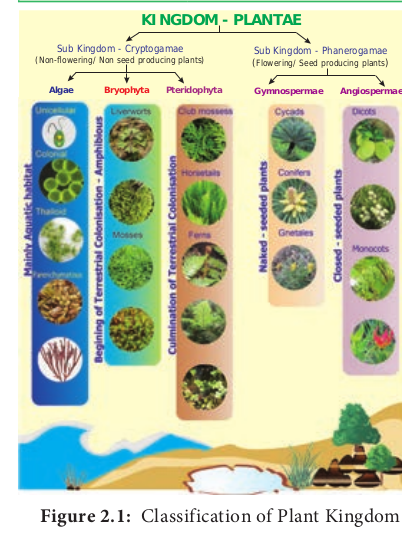
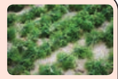
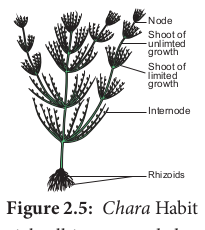
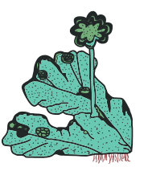
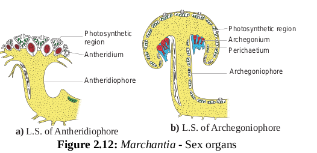
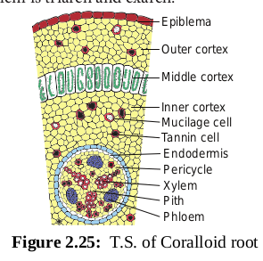
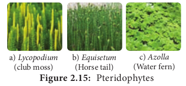
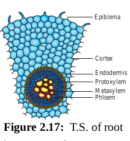
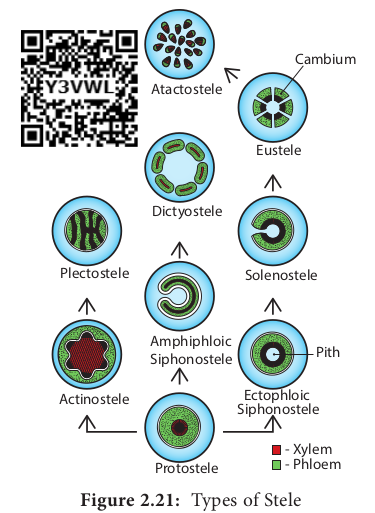
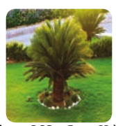

The learner will be able to, _- Outline the classification of plant. 
- Illustrate the life cycles in plant. 
- Recognize the general characteristic_

_features and reproduction of Alga. 
- Describe the structure, reproduction_

_of Char. 
- Recognize the general characteristic_

_features of Bryophyte. 
- Describe the structure, reproduction_

_of Marchanti. 
- Recognize the general characteristic_

_features of Pteridophyte. 
- Describe the structure, reproduction_

_of Selaginell. 
- Describe the general characteristic_

_features of Gymnosperm. 
- Explain the structure, reproduction_

_of Cyca. 
- Recognize the salient features of_

_Angiosperms_

**Learning Objectives**

**Chapter Outline**

**2.1** Classification of Plants **2.2** Life Cycle patterns in Plants **2.3** Algae **2.4** Bryophytes **2.5** Pteridophytes **2.6** Gymnosperms **2.7** Angiosperms

**Unit Li**  

**ant Kingdom**

Traditionally organisms existing on the earth were classified into plants and animals based on nutrition, locomotion and presence or absence of cell wall. Bacteria, Fungi, Algae, Bryophytes, Pteridophytes, Gymnosperms and Angiosperms were included under plant group. Recently, with the aid of molecular characteristics. Bacteria and Fungi were segregated and placed under separate kingdoms. Botany is one of the oldest science in the world because its origin was from time immemorial as early men explored and identified plants for the needs of food, clothing, medicine, shelter etc., Plants are unique living entities as they are endowed with the power to harvest the light energy from the sun and to convert it to chemical energy in the form of food through the astounding reaction, **photosynthesis**. They not only supply nutrients to all living things on earth but sequester carbon-di-oxide during photosynthesis, thus minimizing the effect of one of the major green house gases that increase the global temperature. Plants are diverse in nature, ranging from microscopic algae to macroscopic highly developed angiosperms. There are mysteries and wonders in the plant world in terms of size, shape, habit, habitat, reproduction etc., Although plants are all made up of cells there exists high diversity in form and structure (Table 2.1).

## Classification of Plants
 Classification widely accepted for plants now include Embryophyta which is divided into Bryophyta and Tracheophyta. The latter is further divided into Pteridophyta and Spermatophyta (Gymnospermae and Angiospermae). An outline Classification of Plant Kingdom is given in Figure 2.1

**I: Diversity of ving World**

  

Sub Kingdom - Cryptogamae (Non-flowering/ Non seed producing plants)

Sub Kingdom - Phanerogamae (Flowering/ Seed producing plants

**Bryophyta Pteridophyta AngiosperGymnospermae**

**KINGDOM - PLANTAE**

**Algae**

**M a**

**in ly**

**A q**

**u a**

**ti c h**

**a b**

**it a**

**t**

**B e**

**g in**

**in g**

**o f**

**T e**

**rr e**

**s tr**

**ia l**

**C o**

**lo n**

**is a**

**ti o**

**n -**

**A m**

**p h**

**ib io**

**u s**

Dicots

Monocot

**C u**

**lm in**

**a ti**

**o n**

**o f**

**T e**

**rr e**

**s tr**

**ia l**

**C o**

**lo n**

**is a**

**ti o**

**n**

Unicellular Liverworts Club mossess

Horsetails

Cycads

Conifers

GnetalesFernsMosses

Colonial

Thalloid

**Parenchymatous N a**

**k e**

**d -**

**s e**

**e d**

**e d**

**p la**

**n ts**

**C lo**

**s e**

**d -**

**s e**

**e d**

**e d**

**p la**

**n ts**

**Table 2.1: Total Number of Plant**

**Plant group Num**

**World#** Algae 40,000 Bryophytes 16,236 Pteridophytes 12,000 Gymnosperms 1,012 Angiosperms 2,68,600 _\* Singh, P. and Dash, S.S. 2017-Plants discoveries 2016-Ne # Chapman, A.D. 2009. Number of living species in Aust Department of environment, water Heritage and Arts._

**Haplontic**

Gametogenesis

Syngamy

Meiosis

Spores (n)

Gametophyte (n)

Zygote (2n)

(a)

Sporophyt (2n)

**Diplontic**

Zygote (2n) Syngamy

(n)

(b)  

)

**mae**

s

m

## Life Cycle Patterns in Plants Alternation of Generation
 Alternation of generation is common in all plants. Alternation of the haploid gametophytic phase (n) with diploid sporophytic phase (2n) during the life cycle is called alternation of generation. Following type of life cycles are found in plants (Figure 2.2). **Haplontic Life Cycle** Gametophytic phase is dominant, photosynthetic and independent, whereas sporophytic phase is represented by the zygote. Zygote undergoes meiosis to restore haploid condition. Example: _Volvox_, _Spirogyra_. **Diplontic Life Cycle** Sporophytic phase (2n) is dominant, photosynthetic and independent. The gametophytic phase is represented by the single to few celled gametophyte.

**groups in the World and India ber of known species**

**India\*** 7,357 2,748 1,289

79 18,386

_w Genera, species and new records, BSI, India. ralia and the world 2nd edition. Australian government,_

aplontic, b) Diplontic, c) Haplo-diplontic

e

genesisGameto

Meiosis

| Tab l e 2.1: Tota l N um b er o f P l ant g roups in the W orl d a nd I ndi a |
|------|------|------|
| Pl ant  g rou p |Num b er o f k no w n s p e ci es |
| Worl d# |Indi a* |
| A lgae |40,000 |7,357 |
| Br yo phy te s |16,236 |2,748 |
| Pt er ido phyt es |12,000 |1,289 |
| Gy mn os p er ms |1,012 |79 |
| Ang ios p er ms |2,68,600 |18,386 |
| * Singh, P. a nd D as h, S.S. 2017-P lants d i s cover ies 2016-N e w G en era, s peci es a nd n e w r ecord s, BS I, I ndia.# Ch apman, A.D . 2009. N umber o f l iv ing s peci es i n A u stralia a nd t he w orld 2 edition. A u stralian go ver nment,D epar tment o f en v ironment, w ater H er itage a nd A r ts.nd |
  

The gametes fuse to form zygote which develops into sporophyte. Example: _Fucus,_ gymnosperms and angiosperms **Haplodiplontic Life Cycle** This type of life cycle is found in bryophytes and pteridophytes which is intermediate between haplontic and diplontic type. Both the phases are multicellular. but they differ in their dominant phase.

In bryophytes dominant independent phase is gametophyte and it alternates with short-lived multicellular sporophyte totally or partially dependent on the gametophyte.

In pteridophytes sporophyte is the independent phase. It alternates with multicellular saprophytic or autotrophic, independent, short lived gametophyte(n).

## Algae
 Rain brings joy and life to various organisms on earth. Have you noticed some changes in and around you after the rain? Could you identify the reason for the slippery nature of the terrace and green patches on the wall of our home, green colour of puddles and ponds? Why should we clean our water tanks very often? The reason is algae. Algae are simple plants that lack true roots, true stems and true leaves. Two-third of our earth’s surface is covered by oceans and seas. The photosynthetic plants called algae are present here. More than half of the total primary productivity of the world

**M.O.Parthasarathy (1886-1963) ‘Father of Indian Phycology’.**

He conducted research on structure, cytology, reproduction

and taxonomy of Algae. He published a Monograph on Volvocales. New algal forms like _Fritschiella, Ecballocystopsis, Charasiphon_ and _Cylindrocapsopsis_. were reported by him.  

depends on this plant group. Further, other aquatic organisms also depend upon them for their existence.

Algae are autotrophs, and grow in a wide range of habitats. Majority of them are aquatic, marine (_Gracilaria,_ and _Sargassum_) and freshwater (_Oedogonium,_ and _Ulothrix_) and also found in soils (_Fritschiella,_ and _Vaucheria_). _Chlorella_ lead an endozoic life in hydra and sponges whereas _Cladophora crispata_ grow on the shells of molluscs. Algae are adapted to thrive in harsh environment too. _Dunaliella salina_ grows in salt pans (**Halophytic alga**). Algae growing in snow are called **Cryophytic algae**. _Chlamydomonas nivalis_ grow in snow covered mountains and impart red colour to the snow (**Red snow**). A few algae grow on the surface of aquatic plants and are called **epiphytic algae** (_Coleochaete,_ and _Rhodymenia_). The study of algae is called **algology** or **phycology**. Some of the eminent algologists include F.E. Fritsch, F.E. Round, R.E. Lee, M.O.Parthasarathy Iyengar, M.S. Randhawa, Y. Bharadwaja, V.S. Sundaralingam and T.V.Desikachary. ### General Characteristic features
 The algae show a great diversity in size, shape and structure. A wide range of thallus organisation is found in algae. Unicellular motile (_Chlamydomonas_), unicellular non- motile (_Chlorella_), Colonial motile (_Volvox_), Colonial non motile (_Hydrodictyon_), siphonous (_Vaucheria_), unbranched filamentous (_Spirogyra_), branched filamentous (_Cladophora_), discoid (_Coleochaete_) heterotrichous (_Fritschiella_), Foliaceous (_Ulva_) to giant kelps (_Laminaria_ and _Macrocystis_). The thallus organization in algae is given in Figure 2.3.

Algae are eukaryotes except blue green algae. The plant body does not show differentiation into tissue systems. The cell wall of algae is made up of cellulose and hemicellulose. Siliceous walls are present in diatoms. In _Chara_ the thallus is encrusted with calcium carbonate. Some algae possess algin, polysulphate esters of polysaccharides

  

Nucleus

a) _Chlorella_

Flagella

Chloroplast

Pyrenoid

b) _Chlamydomonas_

h) g) _Ulva_

Seta

e) _Coleochaete_ f) _Fritschiella_

a) Fragmentaion-_Spirogyra_ b) Zoospo formation-_Cla_

which are the sources for the alginate, agar agar and carrageenan. The cell has a membrane bound nucleus and cell organelles like chloroplast, mitochondria, endoplasmic reticulum, golgi bodies etc., Pyrenoids are present. They are proteinaceous bodies  

rganization in Algae

Oogonium

Antheridium

Central Vacuole

c) _Vaucheria_

Air vesicle

Stipe Hold fast

_Fucus_

Lateral branch

Air bladder

i) _Sargassum_

Hold fast

Cap cell

d) _Oedogonium_

re _dophora_

c) Isogamy

duction in Algae e) Oogamy

f) Scalariform conjugation- _Zygnema_

found in chromatophores and assist in the synthesis and storage of starch. The pigmentation, reserve food material and flagellation differ among the algal groups.

Algae reproduces by vegetative, asexual and sexual methods (Figure 2.4). Vegetative

|------|------|

  

reproduction includes fission (In unicellular forms the cell divides mitotically to produce two daughter cells Example: _Chlamydomonas)_; Fragmentation (fragments of parent thallus grow into new individual Example: _Ulothrix_) budding (A lateral bud is formed in some members like _Protosiphon_ and helps in reproduction) bulbils, (a wedge shaped modified branch develop in _Sphacelaria_) akinetes (Thick walled spores meant for perennation and germinates with the advent of favourable condition Example: _Pithophora_) and Tubers (Structures found on the rhizoids and the lower nodes of _Chara_ which store food materials).

Asexual reproduction takes place by the production of zoospores motile spores (_Ulothrix, Oedogonium_) aplanospore (thin walled non motile spores Example: _Vaucheria_); autospores (spores which look similar to parent cell Example: _Chlorella_); hypnospore (thick walled aplanospore – Example: _Chlamydomonas nivalis_) and Tetraspores (Diploid thallus of _Polysiphonia_ produce haploid spores after meiosis).

Sexual reproduction in algae is of three types 1. Isogamy (Fusion of morphologically and Physiologically similar gametes Example: _Ulothrix_) 2. Anisogamy (Fusion of either morphologically or physiologically dissimilar gametes Example: _Pandorina_) 3. Oogamy (Fusion of both morphologically and physiologically dissimilar gametes. Example: _Sargassum_). The life cycle shows distinct alternation of generation.

The Oldest recorded alga is Grypania, which was discovered in the banded

iron formations of northern Michigan and dated to approximately 2100Ma

### Classification
 F.E. Fritsch proposed a classification for

algae based on pigmentation, types of flagella,  

reserve food materials, thallus structure and reproduction. He published his classification in the book “The structure and reproduction of the Algae”(1935). He classified algae into 11 classes namely Chlorophyceae, Xanthophyceae, Chrysophyceae, Bacillariophyceae, Cryptophyceae, Dinophyceae, Chloromonadineae, Euglenophyceae, Phaeophyceae, Rhodophyceae, Cyanophyceae (Table 2.2).

The salient features of Chlorophyceae, Phaeophyceae and Rhodophyceae are given below. **Chlorophyceae** The members are commonly called **‘Green algae’**. Most of the species are aquatic(Fresh water-_Spirogyra_, Marine -_Ulva_). A few are terrestrial(_Trentipohlia_). Variation among the shape of the chloroplast is found in members of algae. It is cup shaped (_Chlamydomonas_), discoid (_Chara_), girdle shaped, (_Ulothrix_), reticulate (_Oedogonium_), spiral (_Spirogyra_), stellate (_Zygnema_) and plate like (_Mougeoutia_).

Chlorophyll ‘a’ and Chlorophyll ‘b’ are the major photosynthetic pigments. Storage bodies called pyrenoids are present in the chloroplast and store starch. They also contain proteins. The cell wall is made up of inner layer of cellulose and outer layer of pectin. Vegetative reproduction takes place by means of fragmentation and asexual reproduction is by the production of zoospores, aplanospores and akinetes. Sexual reproduction is present and may be isogamous, anisogamous or oogamous. Examples for this group of algae includes _Chlorella, Chlamydomonas, Volvox, Spirogyra, Ulothrix, Chara_ and _Ulva._ **Phaeophyceae** The members of this class are called **‘Brown algae’**. Majority of the forms are found in marine habitats. _Pleurocladia_ is a fresh water form. The thallus is filamentous (_Ectocarpus_) frond like (_Dictyota_)or may be giant kelps (_Laminaria_

  

and _Macrocystis_). The thallus is differentiated into leaf like photosynthetic part called fronds, a stalk like structure called stipe and a holdfast which attach thallus to the substratum.

The Pigments include Chlorophyll a, c, Carotenoids and Xanthophylls. A golden brown pigment called fucoxanthin is present and it gives shades of colour from olive green to brown to the algal members of this group. Mannitol and Laminarin are the reserve food materials. Motile reproductive structures are present. Two laterally inserted unequal flagella are present. Among these one is whiplash and another is tinsel. Although sexual reproduction ranges from isogamy to oogamy, Most of the forms show oogamous type. Alternation of generation is present (isomorphic, heteromorphic or diplontic). Examples for this group include _Sargassum, Laminaria, Fucus_ and _Dictyota._ **Rhodophyceae** Members of this group include ‘**Red algae**’ and are mostly marine. The thallus is

**Table 2.2 Classifi Class Pigments**

Chlorophyceae Chlorophyll a and b Carotenoids Xathophyll

Xanthophyceae Chlorophyll a and b Carotenoids Xathophyll

Chrysophyceae Chlorophyll a and b Carotenoids

Bacillariophyceae Chlorophyll a and c Carotenoids

Cryptophyceae Chlorophyll a and c carotenoids and xanthophyll

Dinophyceae Chlorophyll a and c carotenoids and xanthophyll

Chloromonadineae Chlorophyll a and b Carotenoids Xathophyll

Euglenophyceae Chlorophyll a and b

Phaeophyceae Chlorophyll a and c, Xanthophyl

Rhodophyceae Chlorophyll a, r-Phycoerthythrin

Cyanophyceae Chlorophyll a, carotenoids, c-Phycocyanin,Allophycocyanin  

multicellular, macroscopic and diverse in form. _Porphyridium_ is the unicellular form. Filamentous (_Goniotrichum_) ribbon like (_Porphyra_) are also present. _Corallina_ and _Lithothamnion_ are heavily impregnated with lime and form coral reefs. Apart from chlorophyll a, r-phycoerythrin and r-phycocyanin are the photosynthetic pigments. Asexual reproduction takes place by means of monospores, neutral spores and tetraspores.

The storage product is floridean starch. Sexual reproduction is oogamous. Male sex organ is spermatangium which produces spermatium. Female sex organ is called carpogonium. The spermatium is carried by the water currents and fuse with egg nucleus to form zygote. The zygote develops into carpospores. Meiosis occurs during carpospore formation. Alternation of generation is present. Examples for this group

**cation of Algae Flagella Reserve food**

, 1,2,4 or more equal anterior whiplash flagella

Starch

2, unequal anterior 1 tinsel and 1 whiplash

Fats and leucosin

, 1 or 2 unequal or equal anterior both whiplash or 1 whiplash and 1 tinsel

Oils and leucosin

, 1 anterior (only in male gametes) tinsel

Leucosin and Fats

unequal anterior both tinsel flagella

Starch

Two unequal (whiplash)lateral flagella in different plane

Starch and oil

, 2 equal flagella oil

One or two anterior tinsel flagella

Fats and paramylon

l Two unequal whiplash and tinsel lateral flagella

Laminarin starch and fats

absent Floridean starch

absent Cyanophycean starch

| Table 2.2 Classification of Algae |
|------|------|------|------|
| Class |Pigments |Flagella |Reser ve food |
| Chlorophyceae |Chlorophyll a and b Carotenoids, Xathophyll |1,2,4 or more equal anterior whiplash flagella |Starch |
| Xanthophyceae |Chlorophyll a and b Carotenoids Xathophyll |2, unequal anterior 1 tinsel and 1 whiplash |Fats and leucosin |
| Chr ysophyceae |Chlorophyll a and b Carotenoids, |1 or 2 unequal or equal anterior both  whiplash or 1 whiplash and 1 tinsel |Oils and leucosin |
| Bacillariophyceae |Chlorophyll a and c Carotenoids, |1 anterior (only in male gametes) tinsel |Leucosin and Fats |
| Cr yptophyceae |Chlorophyll a and c carotenoids and xanthophyll |unequal anterior both tinsel flagella |Starch |
| Dinophyceae |Chlorophyll a and c carotenoids and xanthophyll |Two unequal (whiplash)lateral flagella in different plane |Starch and oil |
| Chloromonadineae |Chlorophyll a and b Carotenoids, Xathophyll |2 equal flagella |oil |
| Euglenophyceae |Chlorophyll a and b |One or two anterior tinsel flagella |Fats and paramylon |
| Phaeophyceae |Chlorophyll a and c, Xanthophyll |Two unequal whiplash and tinsel lateral flagella |Laminarin starch and fats |
| Rhodophyceae |Chlorophyll a, r-Phycoerthythrin |absent |Floridean starch |
| Cyanophyceae |Chlorophyll a, carotenoids, c-Phycocyanin,Allophycocyanin |absent |Cyanophycean starch |
  

of algae include _Ceramium, Polysiphonia, Gelidium, Cryptonemia_ and _Gigartina_

A green alga _Botryococcus braunii_ is employed in Bio- fuel production. **Algae in Health care**

**Kelps** are the rich source of Iodine _Chlorella_ is used as single cell Protein (SCP).

_Dunaliella salina_ an alga, growing in salt pan is complement to our health and provide β carotene.

### Economic Importance

The Economic importance of Algae is given in Table 2.3

**Table 2.3: Economic i Name of the Algae**

**Beneficial** _Chlorella, Laminaria, Sargassum, Ulva, Enteromorpha_

Fo

_Gracilaria, Gelidiella, Gigartina_ Ag pre Pac

_Chondrus crispus_ Ca blo

_Laminaria, Ascophyllum_ Alg _Laminaria, Sargassum, Ascophyllum, Fucus_ Fo _Diatom (_Siliceous frustules_)_ Dia

ma _Lithophyllum, Chara, Fucus_ Fer _Chlorella_ Ch _Chlorella, Scenedesmus, Chlamydomonas_ Se

**Harmful** _Cephaleuros virescens_ Re

**A Productive Cultivation in Sea** Algae like _Kappaphycus alvare Gelidiella acerosa_ are commerc harvesting the phycocolloids.

**Sea Palm** It is _Postelia_ _palmaeformis_ a brow  

### Chara
 Class – Chlorophyceae Order – Charales Family – Characeae Genus – _Chara_

_Chara_ is commonly called as ‘ stone wort’ It is a submerged aquatic freshwater alga growing attached to the mud of the lakes and slow running streams. _Chara baltica_ grows in saline water. The thallus is often encrusted with calcium and magnesium carbonate.

**Thallus structure**

The plant body is multicellular, macroscopic and is differentiated into main axis and rhizoids. The rhizoids are thread-like,

**mportance of Algae Economic importance**

**activities** od

ar Agar – Cell wall material used for media paration in the microbiology lab. king canned food, cosmetic, textile paper industry rrageenan – Preparation of tooth paste, paint, od coagulant inate – ice cream, paints, flame proof fabrics

dder tomaceous earth– water filters, insulation terial, reinforcing agent in concrete and rubber. tilizer lorellin -Antibiotic

wage treatment, Pollution indicators **activity** d rust of coffee

_zii, Gracilaria edulis_ and ially grown in the sea for

n alga.

| Tab l e 2.3: E c ono mi c im p or ta nc e o f Alg ae |
|------|------|
| Name o f the Alg ae |E c ono mi c im p or ta nc e |
| B ene f i ci a l ac tiv iti es |
| Ch lorella, L aminar ia, S argas sum, Ul va,Ente rom or ph a |Food |
| Graci lar ia, G elidiella, G iga r tina |Agar Agar – Cell wall material used for mediapreparation in the microbiology lab.Packing canned food, cosmetic, textile paper industry |
| Ch ondr u s cr i spu s |C ar ra ge en an – P rep ara t io n o f t o ot h p aste, p ain t,blo o d co agu l ant |
| L amin ar ia ,  A s cophyllum |A lg in ate – ice cr e am, p ain ts, f l ame p ro of fa br ics |
| L aminar ia, S argas sum, A s cophyllum, F ucu s |Fo dder |
| D iatom  ( Si lice ous f r ustu les ) |Diatomaceous earth– water filters, insulation material, reinforcing agent in concrete and rubber. |
| Lithophyllum, Ch ara, F ucu s |Fer t i lizer |
| C hlo rella |C h lo rel lin -A nt ibio t ic |
| Ch lorella, S cen edesmu s, Ch lamydomonas |S e wa ge t re at men t, P ol lut io n in dic ators |
| Harmfu l ac tiv ity |
| C ephaleu ros v ires cens |R e d r ust o f co f fe e |
  

multicellular structures arise from the lower part of the thallus or peripheral cells of the lower node.They are characterised by the presence of oblique septa. The rhizoids fix the main axis on the substratum and helps in the absorption of salts and solutes _(_Figure 2.5).

The main axis is branched, long and is differentiated into nodes and internodes. The internode is made up of an elongated cell in the centre called axial cell or internodal cell. The axial cell is surrounded by vertically elongated small cells which originate from the node. They are called cortical cells. In _C. wallichii_ and _C. corallina_ the cortical cells are absent. Three types of appendages arise from the node. They are 1. Branches of limited growth 2. Branches of unlimited growth 3. Stipuloides. The growth of the main axis and its branching takes place by the apical cell.

The nodal cells are uninucleate with few ellipsoidal chloroplasts. The internodal cells are elongated and possesses a large central vacuole, many nuclei and numerous discoidal chloroplasts.

The cytoplasm is divided into outer ectoplasm and inner endoplasm. The endoplasm shows cytoplasmic streaming.

**Reproduction** _Chara_ reproduces by vegetative and sexual methods. Vegetative reproduction takes place by amylum stars, root bulbils, amorphous bulbils and secondary protonema.

Sexual reproduction - Sexual reproduction is oogamous. Sex organs are macroscopic and are produced on the branches of limited growth. The male sex organ is called antheridium or globule and the female sex organ is called Oogonium or nucule _(_Figure 2.6). The nucule

Node

Internode

Laterals

Nucule

Globule

**Fig 2.10 _Chara_ sex organsFigure 2.6:** _Chara_ sex organs

is located above the globule. The antheridium is spherical, macroscopic and its wall is made up of eight cells called shield cells. The antheridium has spermatogenous filaments. These filaments produce antherozoids. The nucule is covered by five spirally twisted tube cells and five coronal cells are present at the top of the nucule (Figure 2.6). The centre of the nucule possesses a single egg. At maturity the tube cells separate and a narrow slit is formed. The antherozoids penetrate the oogonium and one of them fuses with the egg to form a diploid oospore. The oospore secretes a thick wall around and germinate after the resting period. The nucleus of the oospore divides to form 4 haploid daughter nuclei of which, three degenerate. The oospore or zygote germinates to produce haploid protonema. The plant body of _Chara_ is haploid and The oospore is the only diploid phase in the life cycle. Therefore, the life cycle is of haplontic type. Alternation of generations is present _(_Figure 2.7).

secondary protonema

protonema (n)

nucule (n)

globule (n)

antherozoid (n)

egg (n)

**Sexual Reproduction**

**Asexual Reproduction**

**CHARA** (n)

fertilization

meiosis

zygote (2n)

amorphous bulbils bulbils

amylum stars

  

## Bryophytes Amphibians of Plant Kingdom
 In the previous chapter, we noticed a wide range of thallus organization in Algae. Majority of them are aquatic. The development of heterotrichous habit, development of parenchyma tissue and dichotomous branching in some algae supports the view that colonization of plants in land occurred in the past. Bryophytes are simplest and most primitive plant groups descended from alga – like ancestors. They are simple embryophytes. Let us learn about the structure and reproduction of these primitive land plants called Bryophytes in detail.

Bryophytes are simplest land inhabiting cryptogams and are restricted to moist, shady habitats. They lack vascular tissue and hence called **‘Non- vascular cryptogams’**. They are also called as ‘**amphibians of plant kingdom’** because they need water for completing their life cycle.

**Shiv Ram Kashyap (1882-1934)**

Father of Indian Bryology. He published a book- ‘Liverworts of Western Himalayas and Punjab

Plains’ He identified new genera like _Atchinsoniella, Sauchia, Sewardiella_ and _Stephansoniella._

### General characteristic features
 - The plant body of bryophyte is

gametophyte and is not differentiated into root, stem and leaf like structure.

- Most of them are primitive land dwellers. Some of them are aquatic (_Riella, Ricciocarpus_).  

- The gametophyte is conspicuous, long lived phase of the life cycle. Thalloid forms are present in liverworts and Hornworts. In Mosses leaf like, stem like structures are present. In Liverworts thallus grows prostrate on the ground and is attached to the substratum by means of rhizoids. Two types of rhizoids are present namely smooth walled and pegged or tuberculate. Multicellular scales are also present. In Moss the plant body is erect with central axis bearing leaf like expansions. Multicellular rhizoids are present. The structure and reproduction in Bryophytes is given in Figure 2.8

- Vascular tissue like xylem and phloem are completely absent, hence called ‘Non vascular cryptogams’.

- Vegetative reproduction takes place by the formation of adventitious buds (_Riccia fluitans_) tubers develop in _Anthoceros._ In some forms small detachable branches or brood bodies are formed, they help in vegetative reproduction as in _Bryopteris fruticulosa_. In _Marchantia_ propagative organs called gemmae are formed and help in reproduction.

- Sexual reproduction is oogamous. Antheridia and Archegonia are produced in a protective covering and are multicellular.

- The antheridia produces biflagellate antherozoids which swims in thin film of water and reach the archegonium and fuse with the egg to form diploid zygote.

- Water is essential for fertilization.

- The zygote is the first cell of the sporophyte generation. It undergoes mitotic division to form multicellular undifferentiated embryo. The embryogeny is exoscopic (the first division of the zygote is transverse and the apex of the embryo

  

develops from the outer cell). The embryo divides and give rise to sporophyte.

- The sporophyte is dependent on gametophyte.

- It is differentiated into three recognizable parts namely foot, seta and capsule.

- Foot is the basal portion and is embedded in the gametophyte through which water and nutrients are supplied for the sporophyte. The diploid spore mother cells found in the capsule region undergoes meiotic division and give rise to haploid spores. Bryophytes are homosporous. In some sporophytes elaters are present and help in dispersal of spores (Example: _Marchantia_). The spores germinate to produce gametophyte.

- The zygote, embryo and the sporogonium constitute sporophytic phase. The green long living haploid phase is called gametophytic phase. The haploid gametophytic phase alternates with diploid sporophyte and shows heterologous alternation of generation.

a) _Anthoceros_ c) Pegged and smooth

walled Rhizoids d

e) Fragmentation-_Riccia_

Tuber

Thallus

f) Tubers- _Anthoceros_

b) _Funaria_

Leaf

Rhizoids

Capsule  

### Classification of Bryophytes

Proskauer in the year 1957 classified Bryophytes into 3 Classes namely

i. **Hepaticopsida** (_Riccia, Marchantia, Porella_ and _Riella_)

ii. **Anthocerotopsida** (_Anthoceros_ and _Dendroceros_)

iii. **Bryopsida** (_Funaria, Polytrichum_ and _Sphagnum_).

The outline of the classification is given below

Hepaticopsida (Liverworts)

Anthocerotopsida (Hornworts)

Bryopsida (Mosses)

**Bryophyta**

**Class: Hepaticopsida** They are lower forms of Bryophytes. They are more simple in structure than mosses and more confined to damp and shady places. They have an undifferentiated thallus. Protonernal stage is absent. Sporophyte is very simple and short lived. In some, the foot and seta are absent. Example _Riccia_.

**Class: Anthocerotopsida** Gametophyte is an undifferentiated thallus. Rhizoids are unicellular and unbranched. Protonemal stage is absent. Sporophyte is differentiated into foot and capsule and seta is absent Example: _Anthoceros_.

**Class: Bryopsida** These are higher forms in which the gametophyte is differentiated into ‘stem’ like and ’leaf ’ like parts and the former showing radial symmetry. Rhizoids are multi-cellular and branched. Protonemal stage is present. Sporophyte is differentiated into foot, seta

yophytes

) _Sphagnum_

Gemma Cup

g) Gemmae- _Marchantia_

| Br yophy t a |
|------|------|------|

  

and capsule. They have more differentiated structure than liverworts. They often form dense cushions. Example: _Funaria_. ### Economic importance
 Dead thalli of _Sphagnum_ gets accumulated and compressed, hardened to form peat. In northern Europe (Netherlands)peat is used as fuel in commercial scale. Apart from this nitrates, brown dye and tanning materials are derived from peat. _Sphagnum_ and peat are also used in horticulture as packing material because of their water holding capacity. _Marchantia polymorpha_ is used to cure pulmonary tuberculosis. _Sphagnum_, _Bryum_ and _Polytrichum_ are used as food. Bryophytes play a major role in soil formation through succession and help in soil conservation.

_Buxbaumia aphylla_ and _Cryptothallus mirabilis_ are saprophytic bryophytes

### Marchantia
 Class - Hepaticopsida Order - Marchantiales Family - Marchantiaceae Genus - _Marchantia_

_Marchantia_ grows in cool moist shady places. _Marchantia polymorpha_ is the common species. **Gametophyte** The plant body of Marchantia is a gametophyte. It is prostrate,dorsiventral and dichotomously branched. The thallus on the dorsal surface possess conspicuous median midrib which is marked by a shallow groove on dorsal surface. The dorsal surface appears to have rhomboidal or polygonal diamond shaped areas which indicate the outline of the underlying air chambers of the thallus _(_Figure 2.9).

The dorsal surface also shows crescent shaped structures called gemma cups which contain vegetative reproductive structures called gemmae. The apical notch bears an apical cell which helps in the growth of the  

thallus.The ventral surface the thallus bears multicellular scales and rhizoids which help in fixation and absorption of water and minerals. The rhizoids are of two types namely smooth walled or pegged (tuberculate) type. On maturation the thallus bears erect antheriophores and archegoniophores.

**a) b)** Rhizoids

Antheridiophore

Gemma cup

Archegoniophore

**Internal structure of Thallus** In transverse section the _Marchantia_ thallus shows three parts namely: epidermis, photosynthetic region and storage region _(_Figure 2.10).

The epidermis has the upper and lower layers. The upper epidermis is single layered with thin walled parenchymatous cells. The cells possess chloroplasts. The upper epidermis is interrupted by many barrel shaped air pores which communicate with the air chambers. The pore is surrounded by 4 to 8 superimposed tiers of cells. Below the upper epidermis a number of air chambers are present in a single horizontal layer.

  

The floor of the chambers bears simple or branched green filaments. Cells of filaments are involved in photosynthesis. The photosynthetic region is followed by storage region. It is made up of several parenchymatous cells arranged without intercellular spaces. The cells of this region contain starch grains and protein granules. The lower epidermis possesses rhizoids and multicellular scales. **Reproduction** _Marchantia_ reproduces by vegetative and sexual methods.

1.Vegetative reproduction takes place by progressive death and decay of thallus, formation of adventitious branches and by germination of gemmae. Death and decay of the thallus starts from posterior end. When it reach the point of dichotomy, two apical parts of the thallus get separated. Each one develops into an independent thallus. Adventitious branches are produced on the ventral surface of the gametophyte. The branches get separated from the parent thallus and grow into independent gametophytes. Gemmae are specialized multicellular asexual reproductive bodies. They are formed in small cupules known as gemma cups, present on the dorsal surface of the thallus. Usually the gemmae present on the male thallus form male plants and those on the female thallus give rise to female plants (Figure 2.11).

Gemmae

Gemma cup Oil cells

Notch

Stalk

**a)** V.S. of Gemma cup **b)** A gemma enlarged 

_Marchantia_

**a)** L.S. of Anther **Figur**  

**1\. Sexual reproduction:** In _Marchantia_, sex organs are borne on special stalked receptacles called the gametophores. Those bearing antheridia are called antheridiophores and archegonia bearing structures are called archegoniophores _(_Figure 2.12). _Marchantia_ is heterothallic or dioecious. i.e., male and female receptacles are present on different thalli. The sex organs in bryophytes are multicellular. The Male sex organ is called antheridium. It produce biflagellate antherozoids. The Female sex organ is flask shaped called archegonium and produces a single egg. Water is essential for fertilization. The antherozoids are released into water and are attracted towards archegonium through chemotaxis. Although many antherozoids enter the archegonium, only one fuses with the egg to form zygote. The zygote represents the first cell of the sporophytic generation. Zygote develops in to a multicellular structure called sporophyte. (Figure 2.13).

Foot

Seta

Capsule

Spores

Elaters

Calyptra

Photosynthetic region

Antheridium

Antheridiophore

idiophore

Photosynthetic region Archegonium

Archegoniophore

Perichaetium

**b)** L.S. of Archegoniophore

**e 2.12:** _Marchantia -_ Sex organs

  

The sporophyte is not free-living but attached to the photosynthetic gametophyte and derives nutrition from it. Sporophyte is differentiated into foot, seta and capsule. The foot is bulbous and is embedded in the gametophyte. It derives nutrition from the gametophyte and transfers to the sporophyte. Seta is short and connects foot and capsule. The capsule consists of single layered jacket layer and encloses numerous haploid spores and elaters. The capsule is covered by protective covering called calyptra. On maturation the capsule dehisces and spores are released. Elaters helps in the dispersal of spores. The spores under favourable conditions germinate and develop into new gametophyte. The haploid gametophytic phase alternates with diploid sporophytic phase, thus the life cycle of _Marchantia_ shows alternation of generation _(_Figure 2.14).

FRAGMENTATION

ADVENTITIOUS

GEMMAE

BRANCHES

(DIOECIOUS)

MALE THALLUS

FEMALE THALLUS (n)

ANTHERDIOPHORE (n)

ARCHEGONIOPHORE (n)

GERM TUBE GERM TUBE

GERMINATION

SPORES (n)

SPORES TETRAD (n)

SPORES MOTHER CELLS

(2n)

SPOROGONIUM (2n)

EMBRYO (2n)

OOSPORE (2n)

EGG (n)

ARCHEGONIUM (n)

ANTHERIDIUM (n)

ANTHEROZOID (n)

**FERTILIZATION**

SPOROPHYTIC GENERATION

(2n)

GAMETOPHYTIC GENERATION

(n)

 _Marchantia_

**MEIOSIS**

(n)

MARCHANTIA

Vegetative Reproduction

Sexual Reproduction

## Pteridophytes Seedless Vascular Cryptogams
 From the previous section, we are aware of the salient features of amphibious plants called bryophytes. But there is a plant group called pteridophytes which are considered as first true land plants. Further, they were the first plants to acquire vascular tissue namely xylem and phloem, hence called vascular cryptogams. Club moss, horsetails, quill worts, water ferns and tree ferns belong to this group. This chapter deals with the characteristic features of Pteridophytes.

Pteridophytes are the vascular cryptogams and were abundant in the Devonian period of Palaeozoic era (400 million years ago). These plants are mostly small, herbaceous and grow well in moist, cool and shady places where water is available. The photographs for some pteridophytes are given in Figure 2.15.

a) _Lycopodium_ (club moss)

b) _Equisetum_ (Horse tail)

c) _Azolla_ (Water fern)

**Pteridophytes:*. 
- Plant body is sporophyte (2n) and it is the

dominant phase. It is differentiated into root, stem and leaves.

- Roots are adventitious. 
- Stem shows monopodial or dichotomous

branching. 
- Leaves may be microphyllous or

megaphyllous. 
- Stele is protostele but in some forms

siphonostele is present (_Marsilea_. 
- Tracheids are the major water conducting

elements but in _Selaginella_ vessels are found.

  

- Sporangia, spore bearing bag like structures are borne on special leaves called sporophyll. The Sporophylls get organized to form cone or strobilus. Example: _Selaginella_, _Equisetum_ .

- They may be **homosporous (**produce one type of spores-_Lycopodium_) or **Heterosporous (**produce two types of spores**\-**_Selaginella)_. Heterospory is the origin for seed habit.

- Development of sporangia may be **eusporangiate** (development of sporangium from group of initials) or **leptosporangiate** (development of sporangium from single initial).

- Spore mother cells undergo meiosis and produce spores (n).

- Spore germinates to produce haploid, multicellular green, cordate shaped independent gametophytes called prothallus.

- Fragmentation, resting buds, root tubers and adventitious buds help in vegetative reproduction.

- Sexual reproduction is oogamous. Sex organs, namely antheridium and archegonium are produced on the prothallus.

- Antheridium produces spirally coiled and multiflagellate antherozoids.

- Archegonium is flask shaped with broad venter and elongated narrow neck. The venter possesses egg or ovum and neck contain neck canal cells.

- Water is essential for fertilization. After fertilization a diploid zygote is formed and undergoes mitotic division to form embryo.

- Pteridophytes show **apogamy** and **apospory.**

### Classification of Pteridophytes
 Reimer (1954) proposed a classification for pteridophytes. In this classification, the pteridophytes are divided into five subdivisions. 1. Psilophytopsida 2. Psilotopsida 3. Lycopsida 4. Sphenopsida 5. Pteropsida. There are 19 orders and 48 families in the classification.  

### Economic Importance
 The Economic importance of Pteridophyte is given in Table 2.4

**Table 2.4: Economic importance of Pteridophyte**

**Pteridophyte Uses** _Rumohra adiantiformis_ (leather leaf fern)

Cut flower arrangements.

_Marsilea_ Food _Azolla_ Biofertilizer.

_Dryopteris filix–mas_ Treatment for tapeworm.

_Pteris vittata_ Removal of heavy metals from soils - Bioremediation

_Pteridium_ sp. Leaves yield green dye.

_Equisetum_ sp. Stems for scouring. _Psilotum, Lycopodium, Selaginella, Angiopteris, Marattia_

Ornamental plants

### Selaginella
 Division – Lycophyta Class – Ligulopsida Order – Selaginellales Family –Selaginellaceae Genus – _Selaginella_

_Selaginella_ is commonly called ‘spike moss’. They are distributed in humid temperate and tropical rain forests. _Selaginella_ _rupestris_ and _Selaginella lepidophylla_ are Xerophytic. _Selaginella kraussiana_, _Selaginella chrysocaulos, Selaginella megaphylla_ are some common species. In few _Selaginella_ species during dry season the entire plant body gets curled and become fresh, green when moisture is available. Due to this they are called **Resurrection plants**. Example _S. lepidophylla_

**External morphology Habit** The plant body of Selaginella is sporophyte (2n) and it is differentiated into root, stem, and leaves (Figure 2.16). There exist variations in the habit of _Selaginella_. Some species possess

| Table 2.4: E conomic importance of Pteridophyte |
|------|------|
| P te r i d op hy te |Use s |
| Rumohra adiantiformis(leather leaf fern) |Cut f lo werar ra ngem en ts. |
| Mars ile a |Food |
| Az oll a |Bio fer t i lizer . |
| D r yopter i s f ilix–m as |Tre at me nt  f orta p e worm . |
| P te r i s  v it tata |R em ova l o f h e av ymet a ls f rom s oi ls -Bio rem e di at io n |
| P te r idium sp. |L e aves y ie ld g re endye . |
| E qui s etum  s p. |Stem s f or s co ur in g . |
| Psilotum, Lycopodium,Selaginella, Angiopteris,Marattia |Or namen t a l p l ants |
  

prostrate creeping system (_S. kraussiana_); suberect (_S. rupestris_); erect (_Selaginella erythropus_); climbing (_Selaginella alligans_). _S. oregana_ is an epiphyte. Most of the species are perennials. On the basis of structure of stem and arrangement of leaves, _Selaginella_ is divided into two sub genera namely Homoeophyllum and Heterophyllum.

The success and dominance of vascular plants is due to the development of

- Extensive root system. 
- Efficient conducting tissues. 
- Cuticle to prevent desiccation. 
- Stomata for effective gaseous exchange.

Homeophyllum include species with erect stem and spirally arranged leaves.

**PsilotopsidaPsilophytopsida Lycop**

The plant body is rootless and have fungal association. Small, scaly appendages represent the leaves. Gametophyte is colourless and have fungal association. They are homosporous and spores are produced in sporangia or synangia. Example: _Psilotum._

The plant is differen into root, and leave Leaves ar univeined spirally ar Ligules ar present. Sporophy arranged form of s Both hom (_Lycopodi_ and heter (_Selaginel_ found. Example: _Selaginell_

All are extinct plants. Plant body had only stem and rhizome. Roots and leaves were absent. Homosporous Spore tetrads were borne at the terminal sporangia. Example: _Rhynia_.

**PTERIDODivision- Sub division**  

(Example: _S. upestris_ and _S. oregana_)_._ Heterophyllum include species with prosrate stem with short erect branches and dimorphic leaves (Example: _S. kraussiana_ and _S. lepidophylla_).

Rhizophore Stem

Cone

**sida Sphenopsida Pteropsida**

body tiated stem s. e small, , ranged. e

lls are in the trobilus.

ospory _um_) ospory _la_) are

_a._

The plant body is differentiated into root, stem and leaves. Stem shows jointed nodes and internodes. Small, scaly leaves are arranged at nodes in whorls. Peltate disc of sporangiophore possess compact strobilus. Homosporous but incipient heterospory is found in _Equisetum arvense_.

The plant body is differentiated into root, stem and leaves. Includes all the megaphyllous pteridophytes. leaf gap is present sporangia are organized into sorus. Both homosporus and heterosporus forms are present. Example: _Marsilea_

**PHYTA**

| n |
  

**Rhizophore** In many species long, cylindrical, unbranched and leafless structures arise from the lower side of the stem at the point of dichotomy called rhizophores. They grow vertically downwards and produce tufts of adventitious roots. **Stem**

The stem may be erect, dichotomously branched or prostrate with lateral branching. The prostrate stem is dorsiventral. **Leaves** The leaves are microphyllous, sessile and simple. A single midvein is present in the leaves. The vegetative leaf as well as the sporophyll bears a small membranous tongue like structure on adaxial surface called ligule. The basal part of the ligule possess a hemispherical mass of thin walled cells called **glossopodium**. The function of ligule is not known, but it is viewed to be associated with water absorption, secretion and prevent dessication of shoot. The members belonging to homeophyllum type possess same type of leaves spirally arranged on the stem whereas the heterophyllum type have two types of leaves- two dorsal rows of small leaves(Microphylls) and two ventral rows of large leaves(Megaphylls). **Internal structure Root** The transverse section of the root reveals an outermost layer called epidermis. It is made up of t a n g e nt i a l l y elongated cells. The cortex is homogeneous made up of thin walled parenchyma. The innermost layer of cortex is called endodermis. The stele is a protostele, monarch and xylem is exarch (Figure 2.17).

Cortex

Epiblema

Endodermis

Protoxylem

Metaxylem Phloem

**Stem** The anatomy of the stem reveals the presence of epidermis, cortex and stelar region (Figure 2.18).

The epidermis is parenchymatous and is covered with a thick cuticle. The cortex is parenchymatous with cells arranged without intercellular spaces. A sclerenchymatous hypodermis is noticed in _Selaginella lepidophylla_. The presence of radially elongated endodermal cells called **trabeculae** is the characteristic feature of _Selaginella_. The casparian strips are found on the lateral walls. The rapid stretching of the innermost cortical cells in comparison with stele results in air spaces and stele appears to be suspended in air space with the help of trabeculae. The stele is a protostele and exarch. A variation in number of steles is found. It may be monostelic (_S. spinulosa_); distelic (_S. kraussiana_) or polystelic (_S. laevigata_). The xylem is monarch(_S. kraussiana_) or diarch (_S. oregana_). Tracheids are present but vessels are also noticed in _S. densa_ and _S. rupestris_.

**Leaf** The leaf shows upper and lower epidermis. The epidermal cells have chloroplast. Stomata occur on both surfaces. The mesophyll is made up of loosely arranged thin walled cells with intercellular spaces. There is a median vascular bundle surrounded by a bundle sheath. In vascular bundle xylem is surrounded by phloem.

**Reproduction**

**Vegetative reproduction** _Selaginella_ reproduces vegetatively by fragmentation, bulbil formation, tuber formation and resting buds.

Epidermis Hypodermis

Trabeculae Xylem

Cortex

Phloem

  

**Sexual reproduction** During sexual reproduction spores are produced (Figure 2.19). _Selaginella_ is heterosporous and produces two types of spores namely microspores in microsporangium and megaspores in megasporangium. The sporangia are borne singly in the axils of microsporophyll and megasporophyll respectively. The sporophylls are arranged spirally around a central axis and aggregate to form strobili or cones. Variations in the distribution of microsporangia and megasporangia among the species are seen. In S. _selaginoides_ and _S. rupestris_ megasporangia are present in the basal part of the cone. _S. kraussiana_ possesses a single megasporangium at the base of the strobilus. In _S. inaequifolia_ one side of the strobilus bear only megasporangia and other microsporangia. Separate strobili for microsporangia and megasporangia are present in _S. gracilis_. and _S. atro- viridis_. **Fi**

Archegonium

Anthe

Antherozo

Egg

Fertilization (Syngamy)

Oospor

(n)

(n)

(n)

(2n)

Sporang

Tapetum

Microsp

Ligule

Megasporophyll

Microsporangium Microsporophyll Ligule

Axis

Megasporangium

**a)** L.S. of cone

**b)** A microsporangi enlarged

Meg

Ligu

**c)** A megasporang enlarged

The development of sporangium is of eusporangiate type. The sporangial initial divides periclinally to form outer jacket initials and inner archesporial initials. The archesporial initials by repeated anticlinal and periclinal divisions form sporogenous cells. Microspore mother cells of microsporangium undergo reduction division to produce halpoid microspores. Similarly the megaspore mother cell undergoes reduction division to produce 4 haploid megaspores. The microspore and megaspore represent the male and female gametophyte and germinate inside the sporangium. The microspores produce biflagellate antherozoids. Archegonia develop in the female gametophyte. The antherozoids swim in water and reach the archegonium. Fertilization brings the fusion of male and female nucleus which result in the

formation of a diploid zygote. The diploid zygote represents the first cell of sporophyte. It undergoes several mitotic division to form embryo. The embryo develops into a mature sporophytic plant.

In the life cycle of _Selaginella_ alternation of sporophytic and gametophytic generation is present (Figure 2.20).

**gure 2.20:** Life cycle of _Selaginella_

Meiosis R/D

 _Selaginella_

SELAGINELLA

Strobilus

Microsporophyll

Megasporangium

Female Gametophyte

ridium

id

**SPOROPHYTIC**

**GAMETOPHYTIC**

Embryo

e

Megasporophyll

Microsporangium

Megaspore Mother CellMicrospore

Mother Cell

Megaspores

Male Gametophyte Microspores

(2n) (2n)

(2n) (2n)

(2n) (2n)

(2n)(2n)

(n)

(n)(n)

(n)

(n)

(2n)

**GENERATION**

**GENERATION (2n)**

**(n)**

ial wall

ore

um

aspore

le

ium

  

### Types of Stele
 The term stele refers to the central cylinder of vascular tissues consisting of xylem, phloem, pericycle and sometimes medullary rays with pith (Figure 2.21).

Ectophloic Siphonostele

Actinostele

Plectostele

Amphiphloic Siphonostele

Dictyostele

Solenostele

Eustele

Cambium

Pith

Atactostele

Protostele - Xylem - Phloem

**1\. Protostele:** In protostele phloem surrounds xylem. The type includes Haplostele, Actinostele, Plectostele, and Mixed protostele. (i) **Haplostele**: Xylem surrounded by phloem is known as haplostele. Example: _Selaginella._ (ii) **Actinostele**: Star shaped xylem core is surrounded by phloem is known as actinostele. Example: _Lycopodium serratum._ (iii) **Plectostele**: Xylem plates alternates with phloem plates. Example: _Lycopodium clavatum._ (iv) **Mixed prototostele**: Xylem groups uniformly scattered in the phloem. Example: _Lycopodium cernuum_.  

**2\. Siphonostele:** In siphonostele xylem is surrounded by phloem with pith at the centre. It includes Ectophloic siphonostele, Amphiphloic siphonostele, Solenostele, Eustele, Atactostele and Polycylic stele. **(i) Ectophloic siphonostele:** The phloem is restricted only on the external side of the xylem. Pith is in centre. Example: _Osmunda._ **(ii) Amphiphloic siphonostele:** The phloem is present on both the sides of xylem. The pith is in the centre. Example: _Marsilea_.

**(iii) Solenostele:** The stele is perforated at a place or places corresponding the origin of the leaf trace. (**a) Ectophloic solenostele** – Pith is in the centre and the xylem is surrounded by phloem Example _Osmunda_. **(b) Amphiphloic solenostele** – Pith is in the centre and the phloem is present on both sides of the xylem. Example: _Adiantum pedatum_. **(c) Dictyostele** – The stele is separated into several vascular strands and each one is called meristele. Example: _Adiantum capillus-veneris_. **(iv) Eustele**: The stele is split into distinct collateral vascular bundles around the pith. Example: Dicot stem. (**v**) **Atactostele**: The stele is split into distinct collateral vascular bundles and are scattered in the ground tissue. Example: Monocot stem. **(vi) Polycyclicstele:** The vascular tissues are present in the form of two or more concentric cylinders. Example: _Pteridium_.

## Gymnosperms Naked seed producing Plants
 Michael Crichton’s Science Fiction is a book transformed into a Film of Steven Spielberg (1993) called **Jurassic Park**. In this film you might have noticed insects embedded in a transparent substance called amber which preserves the extinct forms. What is amber? Which group of plants produces Amber?

  

Amber is a plant secretion which is an efficient preservative that doesn’t get degraded and hence can preserve remains of extinct life forms. The amber is produced by **_Pinites succinifera_**, a Gymnosperm.

In this chapter we shall discuss in detail about one group of seed producing plants called **Gymnosperms**.

Gymnosperms (Gr. Gymnos = naked; sperma= seed) are naked seed producing plants. They were dominant in the Jurassic and Cretaceous periods of Mesozoic era. The members are distributed throughout the temperate and tropical region of the world ### General characteristic features
 - Most of the gymnosperms are evergreen,

woody trees or shrubs. Some are lianas (_Gnetum_)

- The plant body is sporophyte and is differentiated into root, stem and leaves.

- A well developed tap root system is present. Coralloid roots of _Cycas_ have symbiotic association with blue green algae. In _Pinus_ the roots have mycorrhizae.

- The stem is aerial, erect and branched or unbranched (_Cycas_) with leaf scars.

- In conifers two types of branches namely branches of limited growth (Dwarf shoot) and Branches of unlimited growth (Long shoot) is present.

- Leaves are dimorphic, foliage and scale leaves are present. Foliage leaves are green, photosynthetic and borne on branches of limited growth. They show xerophytic features.

- The xylem consists of tracheids but in _Gnetum_ and _Ephedra_ vessels are present.

- Secondary growth is present. The wood may be **Manoxylic** (Porous, soft, more parenchyma with wide medullary ray -_Cycas_) or **Pycnoxylic** (compact with narrow medullary ray-_Pinus_).  

- They are heterosporous. The plant may be monoecious (_Pinus_) or dioecious (_Cycas_).

- Microsporangia and megasporangia are produced on microsporophyll and megasporophyll respectively.

- Male and female cones are produced. 
- Anemophilous pollination is present. 
- Fertilization is siphonogamous and pollen

tube helps in the transfer of male nuclei. 
- Polyembryony (presence of many

embryo) is present. The naked ovule develops into seed. The **endosperm** is haploid and develop before fertilization.

- The life cycle shows alternation of generation. The sporophytic phase is dominant and gametophytic phase is highly reduced. The photograph of some of the gymnosperms is given in Figure 2.22

### Classification of Gymnosperms
 Sporne (1965) classified gymnosperms into 3 classes, 9 orders and 31 families. The classes include i) Cycadospsida ii) Coniferopsida iii) Gnetopsida.

**GYMNOSPERMS** Class-I Class-II Class-III

**Cycadopsida Coniferopsida Gnetopsida** Orders: 1. Pteridosper-

males 2. Bennettitales 3. Pentoxylales 4. Cycadales

Orders: 1. Cordaitales 2. Coniferales 3. Taxales 4. Ginkgoales

Order: 1. Gnetales

**General Characters of Main classes: Class I – Cycadopsida*. 
- Plants are palm-like or fern-like. 
- Compound, frond-like pinnate leaves. 
- Manoxylic wood.

| GY MN OS PERMS |
|------|------|------|
| C l ass-I |C l ass-II |C lass-III |
| Cy c a d op si d a |C onif erops i d a |Gn e top si d a |
| :Or der s1.  Pt er idos p er-ma les2.  B enn et t it a les3.  Pen toxy l a les4. C yc ad a les |:Or der s1. C ord ait a les2. C onif era les3. Taxa les4. G in kg o a les |:Or der1. G net a les |
  

**Table 2.6: Economic impo S.No Plants Pro**

1\. _Cycas circinalis, Cycas revoluta_ Sago 2. _Pinus gerardiana_ Roaste 3. _Abies balsamea_ Resin (

balsam 4. _Pinus insularis, Pinus_

_roxburghii_ Rosin Turpen

5\. _Araucaria_ (Monkey's puzzle)_, Picea_ and _Phyllocladus_

Tannin

6\. _Taxus brevifolia_ Taxol

- Sperms are motile. 
- Flower like structures are absent. Strobili

are simple. Example: _Cycas, Zamia_.

**Class II – Coniferopsida*. 
- Tall trees with simple leaves of varied shape. 
- Wood is pycnoxylic. 
- Cone like strobili are present. 
- Motile sperms are absent (except _Ginkgo_

_biloba_). Example: _Pinus_. **Class III – Gnetopsida*. 
- Shrubs, trees and lianas. 
- Leaves are elliptical or strap-shaped,

simple, opposite or whorled. 
- Motile sperms are absent. 
- Wood contains vessels. 
- Strobili is called as inflorescence. 
- Flower like structure with perianth is

present. Example: _Gnetum, Ephedra_.

**Table 2.5: Difference between G S.No Gymnosperms**

1\. Vessels are absent \[except Gnetales\] V 2. Phloem lacks companion cells C 3. Ovules are naked O 4. Wind pollination only In

p 5. Double fertilization is absent D 6. Endosperm is haploid E 7. Fruit formation is absent Fr 8. Flowers absent F

### Economic importance of Gymnosperms
  

**rtance of Gymnosperms ducts uses**

Starch used as food d seed Used as a food Canada )

Used as mounting medium in permanent slide preparation

and tine

Paper sizing and varnishes

s Bark yield tannins and is used in Leather industries Drug used for cancer treatment

### Comparison of Gymnosperm with Angiosperms Gymnosperms resemble with angiosperms in the following features
 - Presence of well organised plant body

which is differentiated into roots, stem and leaves.

- Presence of cambium in gymnosperms as in dicotyledons.

- Flowers in _Gnetum_ resemble the male flower of the angiosperm. The zygote represent the first cell of sporophyte.

- Presence of integument around the ovule. 
- Both plant groups produce seeds. 
- Pollen tube helps in the transfer of male

nucleus in both. 
- Presence of eustele. The difference between Gymnosperms and Angiosperms were given in Table 2.5

**ymnosperms and Angiosperms Angiosperms**

essels are present ompanion cells are present vules are enclosed within the ovary sects, wind, water, animals etc., act as

ollinating agents ouble fertilization is present ndosperm is triploid uit formation is present

lowers present

| Table 2.5: Difference between Gymnosperms and Angiosperms |
|------|------|------|
| S.No |Gymnosperms |Angiosperms |
| 1. |Vessels are absent [except Gnetales] |Vessels are present |
| 2. |Phloem lacks companion cells |Companion cells are present |
| 3. |Ovules are naked |Ovules are enclosed within the ovar y |
| 4. |Wind pollination only |Insects, wind, water, animals etc., act aspollinating agents |
| 5. |Double fertilization is absent |Double fertilization is present |
| 6. |Endosperm is haploid |Endosperm is triploid |
| 7. |Fruit formation is absent |Fruit formation is present |
| 8. |Flowers absent |Flowers present |

| Tab l e 2.6: E c ono mi c im p or ta nc e o f G y mnos p erms |
|------|------|------|------|
| S.N o |Pl ant s |Pro duct s |us es |
| 1. |Cycas ci rcinalis, Cycas r evoluta |S ago |St arch u s e d a s f o o d |
| 2. |Pinu s ger ardiana |R oa sted  s eed |Us e d a s a f o o d |
| 3. |Abie s  ba l s amea |R esin (C anad abal s am ) |Us e d a s m oun t in g m e di um inp er manen t s lide p rep ara t io n |
| 4. |Pinu s i ns ular i s, P inu srox bur g hii |R osin a ndTur p en t in e |Pap er sizin g a nd va r ni shes |
| 5. |Arau car ia (Mon ke y's p uzzle) , Pice a an d Phylloc la du s |Tannin s |B ark y ie ld t annin s a nd i s u s e d inL e at her in dust r ies |
| 6. |Ta x u s  br e v ifol ia |Taxol |Dr ug u s e d f or c ancer t re at men t |
  

### Cycas
 Class – Cycadopsida Order – Cycadales Family- Cycadaceae Genus - _Cycas_

It is widely distributed in tropical and sub tropical region of eastern hemisphere of the world. _Cycas revoluta_, _Cycas beddomei_, _Cycas circinalis, Cycas rumphii_ are some of the common species. The plant body is sporophyte and resemble a small palm. The growth is very slow. It is evergreen and xerophytic in nature.

**Sporophyte** The sporophyte is differentiated into root, stem and leaves. The stem is columnar bearing a crown of spirally arranged pinnately compound leaves (Figure 2.23).

**External features Root** Two types of roots are found in _Cycas_. They are the tap root and coralloid root.

The primary root persists and forms the tap root. Some of the lateral roots give rise to branches which grow vertically upward below the ground level. They branch repeatedly to form dichotomously branched coral- like roots called coralloid roots. The cortical region

7\. _Ephedra gerardiana_ Ephed

8\. _Pinus roxburghii_ Oleore

9\. _Pinus roxburghii_, _Picea smithiana_ Wood

10\. _Cedrus deodara_ wood

11\. _Cedrus atlantica_ oil 12 _Thuja, Cupressus, Araucaria,_

_and Cryptomeria_ whole  

Figure 2.41 Cycas - Coralloid roots

of the coralloid root contains the Blue green alga – _Anabaena_ sp. which helps in nitrogen fixation (Figure 2.24). **Stem** The stem is columnar, unbranched and woody. It is covered with persistent woody leaf bases. The stem also bears adventitious buds at the base. **Leaves** _Cycas_ has two types of leaves (i) Foliage or assimilatory leaves (ii) Scale leaves (i) Foliage or assimilatory leaves

Foliage leaves are large, pinnately compound and form a crown at the top of the stem. Each leaf has 80-100 pairs of sessile leaflets. The apex is acute or spiny. The leaflet has a single midvein. Lateral veins are absent. Circinate vernation is present and young leaves are covered with **ramenta**.

(ii) Scale leaves Scale leaves are brown, small, triangular

and persistent which are protective in function. They are covered with ramenta.

**Internal structure T.S. of Root** The internal organization of the primary root reveals the following parts. 1. Epiblema,

rine For the treatment of asthma, bronchititis

sin Used to make soap, varnishes and printing ink

pulp Used to make papers

Used to make doors, boats and railway sleepers Used in perfumery

plant Ornamental plants/Floral Decoration

| 7. |Ephedra  g e rardiana |Ephe d r i ne |For t he t re at men t o f a st hm a,bron ch it it is |
|------|------|------|------|
| 8. |Pinu s  r ox bur g hii |Ole oresin |Us e d t o m a ke s o ap, va r ni shesand p r in t in g in k |
| 9. |Pinus roxburghii, Picea smithiana |Wood  p u lp |Us e d t o m a ke p ap er s |
| 10. |C edr u s  de oda ra |wood |Us e d t o m a ke do ors, b o ats a ndra i lwa y s le ep er s |
| 11. |C edr u s  at lantica |oi l |Us e d in p er f um er y |
| 12 |Th uja, C upressu s, A raucar ia,and  C r y ptom e r ia |w hol e  pl ant |Or namen t a l p l ants/Flo ra lD e co ra t io n |
  

2\. Cortex 3. Vascular region (Figure 2.25). Epiblema is the outermost layer and is made up of single layered parenchyma. It is followed by thin walled parenchymatous cortex. The cortex is delimited by single layered endodermis. A multilayered parenchymatous pericycle is present and it surrounds the vascular tissue. The xylem is diarch in young root and tetrarch in older ones. Secondary growth is present. Coralloid root also shows similar structure but the middle cortex is characterized by the presence of Algal zone. Blue green alga called, Anabaena is found in this zone. The xylem is triarch and exarch.

Outer cortex

Middle cortex

Inner cortex

Endodermis Pericycle Xylem

Phloem

Mucilage cell Tannin cell

Pith

Epiblema

**T.S. of Stem** The cross section of young stem is irregular in outline due to the presence of persistent leaf bases. It is differentiated into epidermis, cortex and vascular cylinder. It resembles the structure of a dicot stem (Figure 2.26).

The epidermis is the outermost layer and is covered with thick cuticle. It is discontinuous due to the presence of leaf bases. The cortex constitutes the major part and is made up of thin walled parenchymatous cells. The cells are filled with starch grains. Cortex also possesses several mucilage ducts and tannin cells. In young stem the vascular bundles are arranged in the form of a ring. A broad medullary ray is present. The vascular bundles are conjoint, collateral, endarch and open. Xylem is made up  

of tracheids and phloem consists of sieve tubes and phloem parenchyma. Companion cells are absent. The cortical region shows a large number of leaf traces. The presence of direct leaf traces and girdling leaf trace is the unique feature of _Cycas_ stem. Secondary growth results in polyxylic condition. Phellogen and cork are formed which replace the epidermis. The wood formed belongs to manoxylic type.

Cortex Armour of leaf bases

Girdling leaf trace

Vascular bundles

Pith

Mucilage duct

**T.S. of Rachis** The outermost layer is epidermis and is covered by thick cuticle. The hypodermis is made up of two layers of sclerenchyma on the adaxial side and many layered on the abaxial side. The ground tissue is parenchymatous. The peculiar feature of the rachis is the arrangement of vascular bundle i.e., in an inverted Omega shape (Ω) pattern (Figure 2.27). Each vascular bundle is covered by a single layered sclerenchymatous bundle sheath. Vascular bundles are collateral, endarch and open. A diploxylic condition is present in the vascular bundles.(presence of both centripetal and centrifugal xylem).

Epidermis

Hypodermis

Ground tissue

Vascular bundle

Mucilage duct

  

**T.S. of Leaflet** The leaflet of Cycas in transverse section shows the presence of upper and lower epidermis. The epidermal cells are thick walled and are covered with thick cuticle. The lower epidermis is not continuous and is interrupted by sunken stomata. The hypodermis consists of sclerenchyma cells to prevent transpiration. The mesophyll is differentiated into palisade and spongy parenchyma. The cells of this layer are involved in photosynthesis. The spongy parenchyma present in close proximity to the lower epidermis bear large intercellular spaces which help in gaseous exchange.

Layers of colourless, elongated cells which run parallel to the leaf surface from the midrib to the margin of the leaflet are seen. These constitute the **Transfusion tissue** that helps in the lateral conduction of water. The vascular bundle has xylem facing upper epidermis and phloem facing lower epidermis. The protoxylem occupies the centre, hence the bundle is mesarch. The vascular bundle has a sclerenchymatous bundle sheath (Figure 2.28).

Transfusion tissue

Phloem

Xylem Palisade parenchyma Hypodermis

Spongy parenchyma

stomata

**Male cone** The male cone or staminate cone are borne singly on the terminal part of the stem. The growth of the stem is continued by the formation of axillary buds at the base of the cone. The male cone is displaced to one side showing sympodial growth in the stem. Male cones are stalked, compact, oval or conical and woody in structure. It consists of several microphylls which are arranged spirally around a central cone axis.

Microsporophyll

Apophysis

Microsporangia

Microsporangium

Microspores

**a)** Male cone entire

**b) A** microsporophyll enlarged

**c)** T.S. of Microsporophyll

**d)** Megasporophyll

Ovule

**Microsporophylls** Microsporophylls are flat, leaf-like and woody structures with narrow base and expanded upper portion. The upper expanded portion becomes pointed and is called apophysis. The narrow base is attached to the cone axis. Each microsporophyll contains thousands of microsporangia in groups called sori on abaxial (lower) surface. Development of sporangium is of eusporangiate type. The spore mother cell undergoes meiosis to produce halpoid microspores. Each microsporangium bears large number of microspores or pollen grains. Each microspore (Pollen grain) is a rounded, unicellular and uninucleate structure surrounded by outer thick exine and an inner thin intine. The microspore represents the male gametophyte.

|------|------|

  

**Megasporophylls** The megasporophylls of Cycas are not organised into cones. They occur in close spirals around the tip of the stem of female plant. The megasporophylls are flat and measuring 15-30 cm in length. Each megasporophyll is differentiated into a basal stalk and an upper leaf like portion. The ovules are attached to the lateral side of the sporophyll. The ovules contain megaspore and it represent the female gametophyte.

**Structure of Ovule** Micropyle

Pollen Chamber

Megaspore

Female Gametophyte Outer Layer Middle Layer Inner Layer

_Cycas_ produces the largest ovule of the plant kingdom. The ovules are orthotropous, unitegmic and possess a short stalk. The single integument is very thick and covers the ovule leaving a small opening called _micropyle_. The integument consists of 3 layers, the outer and inner are fleshy (sarcotesta), the middle layer is stony called **sclerotesta**. The inner layer remains fused with the nucellus. The nucellus grows out into a beak-like structure and the upper part dissolves and forms a cavity- like structure called **pollen chamber**. A single megaspore mother cell undergoes meiosis to form four haploid megaspores. The lowermost becomes functional and others

Embryo

Oospore

Fertilization

Male nuclei

(s

Emb

Antheroz (n

(n) (n)

(2n

(2n

egg

**F**  

get degenerated. The nucellus gets reduced in the form of a thin papery layer in mature seeds and encloses the female gametophyte An enlarged megaspore or the embryo-sac is present within the nucellus. An archegonial chamber with 3-6 archegonia are present in the archegonial chamber below the pollen chamber (Figure 2.30).

**Pollination and Fertilization** Pollination is carried out by wind and occurs at 3 celled stage(a prothallial cell, a large tube cell and a small generative cell). Pollen grains get lodged in the pollen chamber after pollination. The generative cell divides into a stalk and a body cell. The body cell divides to produce two large multiciliated antherozoids or sperms. During fertilization, one of the male gamete or multiciliated antherozoid fuses with the egg of the archegonium to form a diploid zygote (2n). The endosperm is haploid. The interval between pollination and fertilization is 4- 6 months. The zygote undergoes mitotic division and develops into embryo. The ovule is transformed into seed. The seed has two unequal cotyledons. Germination is hypogeal. The life cycle shows alternation of generations (Figure 2.31).

 _Cycas_

CYCAS (Male)

Male cone

Microsporangium

Microspore Mother cell

Megaspore Mother cell

Megasporangium

Female strobilus

CYCAS(female)Seed

yngamy)

**GAMETOPHYTIC GENERATION**

(n)

ryo sac

Megaspores oids

Microspores

Meiosis (R/D)

(2n) (2n)

(2n)

(2n)

(2n)

(2n)

(2n)

(2n)

(2n)

(n)

(n) )

(n)

)

)

**SPOROPHYTIC GENERATION**

(2n)

**igure 2.31:** c le of _Cycas_

  

**_Palaeobotany in India_** The National wood fossil park is situated in Tiruvakkarai, a Village of Villupuram district of Tamil Nadu. The park contains petrified wood fossils approximately 20 million years old. The term ‘form genera’ is used to name the fossil plants because the whole plant is not recovered as fossils instead organs or parts of the extinct plants are obtained in fragments. Shiwalik fossil park-Himachal Pradesh, Mandla Fossil park-Madhya Pradesh, Rajmahal Hills– Jharkhand, Ariyalur – Tamilnadu are some of the fossil rich sites of India. Some of the fossil representatives of different plant groups are given below Fossil Algae - _Palaeoporella_, _Dimorphosiphon_ Fossil Bryophytes – _Naiadita, Hepaticites, Muscites_ Fossil Pteridophytes – _Cooksonia, Rhynia,, Baragwanthia, Calamites_ Fossil Gymnosperms _– Medullosa, Lepido- carpon, Williamsonia, Lepidodendron_ Fossil Angiosperms – _Archaeanthus, Furcula_

**Prof. Birbal Sahni (1891-1949)**

Father of Indian Palaeobotany. He described Fossil plants from Rajmahal Hills of Eastern Bihar. _Pentoxylon sahnii_, _Nipanioxylon_ are some of the form genera described by him. Birbal Sahni

Institute of Palaebotany is located in Lucknow.

## Angiosperms

In the previous section, the characteristic features of one of the spermatophyte called Gymnosperms were discussed.  

Spermatophytes also include plants bearing ovules enclosed in a protective cover called ovary, such plants are called Angiosperms. They constitute major plant group of our earth and are adapted to the terrestrial mode of life. This group of plants appeared during the early cretaceous period (140 million years ago) and dominates the vegetation on a global scale. The sporophyte is the dominant phase and gametophyte is highly reduced.

### Salient features of Angiosperms
 - Vascular tissue (Xylem and Phloem) is

well developed. 
- Flowers are produced instead of con. 
- The Ovule remains enclosed in the ovary. 
- Pollen tube helps in fertilization, so water

is not essential for fertilization. 
- Double fertilization is present. The

endosperm is triploid. 
- Angiosperms are broadly classified into

two classes namely Dicotyledons and Monocotyledons.

### Characteristic features of Dicotyledons and Monocotyledons Dicotyledons Morphological features
 Reticulate venation is present in the leaves. Presence of two cotyledons in the seed. Primary root radicle persists as tap root. Flowers tetramerous or pentamerous. Tricolpate (3 furrow) pollen is present.

**Anatomical features*. 
- Vascular bundles are arranged in the form

of a ring in stem. 
- Vascular bundles are open (Cambium

present). 
- Secondary growth is present.

**Monocotyledons Morphological features** Parallel venation is present in the leaves. Presence of single cotyledon in the seed. Radicle doesn’t persist and fibrous root is present.

  

Flowers trimerous. Monocolpate (1 furrow) Pollen is present.

**Anatomical features*. 
- Vascular bundles are scattered in the ste. 
- Vascular bundles are closed (Cambium

absent). 
- Secondary growth is absent. Current Angiosperm Phylogeny Group (APG) System of classification doesn’t recognize dicots as a monophyletic group. Plants that are traditionally classified under dicots are dispersed in several clades such as early Magnolids and Eudicots**.**

**Summary** Plant Kingdom includes Algae, Bryophytes, Pteridophytes, Gymnosperms and Angiosperms

The life cycle in plants fall under three types 1. Haplontic,2. Diplontic and 3. Haplodiplontic

Algae are autotrophic, chlorophyll bearing organisms. The Plant body is not differentiated into root like, stem like or leaf like structures. A wide range of thallus organization is found in algae. They reproduce vegetatively through fragmentation, tuber and akinete formation. Zoospores, autospores and hypnospores are produced during asexual reproduction and sexual reproduction occurs through isogamy, anisogamy and oogamy.

_Chara_ is a fresh water alga and is popularly called “Stone Worts”. The plant body is multicellular, macroscopic and is differentiated into main axis and rhizoids. Sexual reproduction is oogamous.

Bryophytes are the simplest land plants. They are called amphibians of plant kingdom or nonvascular cryptogams. The plant body is gametophyte. The sporophyte depends upon gametophyte. Conducting tissues like xylem and phloem is absent. Vegetative reproduction takes place through fragmentation, formation of adventitious  

bud and gemmae. Sexual reproduction is oogamous. Water is essential for fertilization.

_Marchantia_ belongs to the class Hepaticopsida. The thallus is dorsiventral and is attached to the substratum by means of rhizoids. The internal structure of the thallus reveals the presence of photosynthetic region and a storage region. Vegetative reproduction takes place through fragmentation and formation of gemmae. The sexual reproduction is oogamous. Sporophyte bears spores. Alternation of generation is present.

Pteridophytes are also called vascular cryptogams. The plant body is sporophyte and is long lived, which is differentiated into root, stem and leaves. They may be homosporous or heterosporous. The sporangia with spores are found in sporophylls. The sporophylls organise to form cones or strobilus. The spores germinates to produce haploid, multicellular heart shaped independent gametophyte called prothallus. Sexual reproduction is oogamous. The life cycle shows alternation of generation.

The term stele includes central cylinder of vascular tissues comprising xylem, phloem, pericycle, endodermis and pith . There are two major types of stele namely protostele and siphonostele.

_Selaginella_ belongs to the class Lycopsida. The plant body is sporophyte. It is differentiated into stem, leaf, rhizophore and roots. Heterospory is found and two types of spores namely microspores and megaspores are produced in sporangia. The microsporangia and megasporania are borne on sporophylls. The sporophylls are organized to form cone. Sexual reproduction is oogamous. Alternation of generation is present.

Gymnosperms are naked seed producing plants. The plant body is sporophyte and it is the dominant phase. Coralloid roots are found in Cycas. The roots of Pinus possess

  

mycorrhizal association. Two types of branches called long shoot and dwarf shoot are present. Stem shows secondary growth. Spores are produced in cones. Pollen tube helps in fertilization. The endosperm is haploid. Alternation of generation is present

_Cycas belongs to cycadopsida. The plant_ body is sporophyte and looks like a small palm tree. Apart from taproot coralloid roots are present. It is dioecious, microsporophylls are organized into male cone. Ovules are borne on megasporophylls which are not organized into cone. Fertilization results in zygote and it develops into embryo. Alternation of generation is present.

Angiosperms are highly evolved plant group and their ovules remain enclosed in an ovary. A wide range of habit is present. These include trees, shrubs, herbs, climbers, lianas. Double fertilization is present. The endosperm is triploid. They are classified into dicotyledons and monocotyledons.

**Evaluation** 1\. Which of the

plant group has gametophyte as a dominant phase? a. Pteridophytes b. Bryophytes c. Gymnosperm d. Angiosperm

2\. Which of following represents gametophytic generation in pteridophytes? a. Prothallus b. Thallus c. Cone d. Rhizophore  

3\. The haploid number of chromosome for an angiosperm is 14, the number of chromosome in its endosperm would be a. 7 b. 14 c. 42 d. 28

4\. Endosperm in gymnosperm is formed a. At the time of fertilization b. Before fertilization c. After fertilization d. Along with the development of

embryo 5. Differentiate halpontic and diplontic

life cycle. 6. What is plectostele? give example. 7. What do you infer from the term

pycnoxylic? 8. Mention two characters shared by

gymnosperms and angiosperms. 9. Do you think shape of chloroplast

is unique for algae. Justify your answer?

10\. Do you agree with the statement ‘Bryophytes need water for fertilization’? Justify your answer.

11\. List the classes of algae. 12. Mention the pigments and storage food

of Dinophyceae. 13. What is Nucule? 14. Differentiate nodal and internodal cells

of _Chara_. 15. Explain the internal structure of _Cycas_

rachis.

  

URL:

**https://play.google.com/store/apps/details?id=in.e**

Alternate web:

**http://www.phschool.com/atschool/phbio/active\_ plantlifecycle.swf**

**Different form**

**Step 1**

**Step 2**

**Steps**

- Scan the QR code or go to google pla. 
- Type online labs and install it. 
- Select biology and select Characteristi. 
- Click theory to know the basic about . 
- Register yourself with mail-id and create

Is all the **plants** are same?

\* Pictures are indicative only

**Activity**

- Select video and record your observatio  

**du.olabs.olabs&hl=en**

**art/plant\_life\_cycle/**

**s of plants**

**Step 4**

**Step 3**

store

s of plants haracteristics of plants password to access online lab simulations

ns of different forms of plant group.

