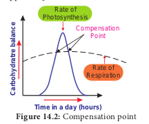
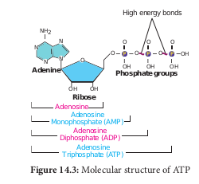
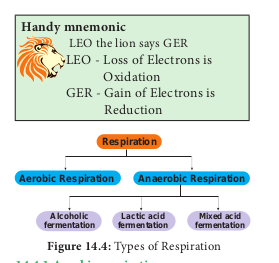
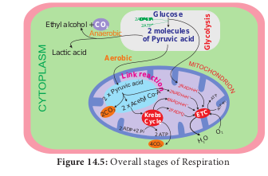
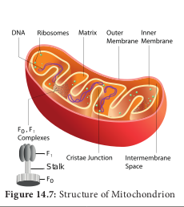
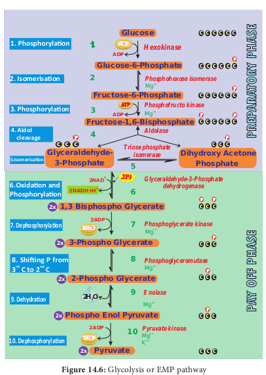
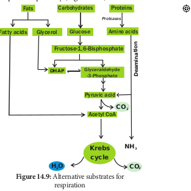
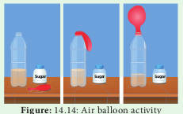

  

The learner will be able to. 
- _Recognize the stages of glucose_

_breakdown and its redox system.. 
- _Differentiate aerobic respiration from_

_anaerobic respiration.. 
- _Describe the conditions under which_

_respiration occurs.. 
- _Realize the role of mitochondria as_

_power house of the cell.. 
- _Understand, how ATP molecules are_

_generated during respiration._

**Re**

**Learning Objectives**

**Chapter**

**14**

**Chapter Outline 14.1** Gaseous exchange **14.2** Structure of ATP **14.3** Redox reactions **14.4** Types of Respiration **14.5** Stages of Respiration **14.6** Respiratory Quotient **14.7** Anaerobic Respiration **14.8** Factors Affecting Respiration **14.9** Pentose Phosphate Pathway

If you are sleeping under a tree during night time you will feel difficulty in breathing. During night, plants take up oxygen and release carbon dioxide and as a result carbon dioxide will be abundant around the tree. This process of CO2 evolution is called **respiration**. This process takes place during day time also (Figure 14.1). It is accompanied by breakdown of substrates and release of energy. In this chapter, respiration process in plants at cellular level will be dealt with.

**Unit V (Functi**  

**spiration**

**Plant and Animal Interdependence** In biosphere, plants and animals are complementary systems which are integrated to sustain life. In plants, oxygen enters through the stomata and it is transported to cells, where oxygen is utilized for energy production. Plants require carbon dioxide to survive, to produce carbohydrates and to release oxygen through photosynthesis. These oxygen molecules are inhaled by human through the nose, which reaches the lungs where oxygen is transported through the blood and it reaches cells. Cellular respiration takes place inside the cell. A specialized respiratory system is present in animals but is absent in plants for delivering oxygen inside the cell. But the cellular respiration stages are similar in both plants and animals which hint at evolutionary divergence.

**CO2**

**O2**

## Gaseous Exchange 14.1.1 Respiration
 The term respiration was coined by **Pepys** (1966). Respiration is a biological process in which oxidation of various food substances like carbohydrates, proteins and fats take place and as a result of this, energy is produced where O2 is taken in and CO2 is liberated. The organic substances which are oxidised during respiration are called respiratory substrates. Among these, glucose is the commonest respiratory substrate. Breaking of C-C bonds

**: Plant Physiology onal Organisation)**

|------|------|

  

O 2

CO 2

CO 2

O 2

O 2

CO 2

C6H12O6 1 6O2 → 6CO2 1 6H2O 1 Energy (686 K cal or 2868 KJ)

(1K cal = 4.184 KJ)

Depending upon the nature of respiratory substrate, **Blackman** divided respiration into,

1\. Floating respiration 2. Protoplasmic respiration

When carbohydrate or fat or organic acid serves as respiratory substrate and it is called **floating respiration.** It is a common mode of respiration and does not produce any toxic product. Whereas respiration utilizing protein as a respiratory substrate, it is called **protoplasmic respiration**. Protoplasmic respiration is rare and it depletes structural and functional proteins of protoplasm and liberates toxic ammonia.  

### Compensation point
 At dawn and dusk the intensity of light is low. The point at which CO2 released in respiration is exactly compensated by CO2 fixed in photosynthesis that means no net gaseous exchange takes place, it is called **compensation point**. At this moment, the amount of oxygen released from photosynthesis is equal to the amount of oxygen utilized in respiration. The two common factors associated with compensation point are CO2 and light (Figure 14.2). Based on this there are two types of compensation point. They are CO2 compensation point and light compensation point. C3 plants have compensation points ranging from 40-60 ppm (parts per million) CO2 while those of C4 plants ranges from 1-5 ppm CO2.

**Time in a day (hours)**

**C ar**

**bo hy**

**dr at**

**re b**

**al an**

**ce** Compensation Point

Rate of Photosynthesis

Rate of Respiration

 Respiration is responsible for generation of ATP. The discovery of ATP was made by **Karl Lohman** (1929). ATP is a nucleotide consisting of a base-adenine, a pentose sugar-ribose and three phosphate groups. Out of three phosphate groups the last two are attached by high energy rich bonds (Figure 14.3). On hydrolysis, it releases energy (7.3 K cal or 30.6 KJ/ATP) and it is found in all living cells and hence it is called **universal energy currency of the cell**. ATP is an instant source of energy within the cell. The energy contained in ATP is used in synthesis carbohydrates, proteins and lipids. The energy transformation concept was established by **Lipman** (1941).

  

**Adenine**

NH2

N

**Ribose**

**Phosphate groups**

N N

N O

OH OH

Adenosine

O

O

OH

P O

Adenosine Monophosphate (AMP)

Adenosine Diphosphate (ADP)

Adenosine Triphosphate (ATP)

O

OH

P O

O

OH

P OH

High energy bonds

## Redox Reactions
 NAD1 1 2e - 1 2H1 NADH 1 H1

FAD 1 2e- 1 2H1 FADH2

When NAD1 (Nicotinamide Adenine Dinucleotide-oxidised form) and FAD (Flavin Adenine Dinucleotide) pick up electrons and one or two hydrogen ions (protons), they get reduced to NADH 1 H1 and FADH2 respectively. When they drop electrons and hydrogen off they go back to their original form. The reaction in which NAD1 and FAD gain (reduction) or lose (oxidation) electrons are called **redox reaction** (Oxidation reduction reaction). These reactions are important in cellular respiration.

## Types of Respiration
 Respiration is classified into two types as aerobic and anaerobic respiration (Figure 14.4)

**Table 14.1: Differences between ae Aerobic respiration**

1\. It occurs in all living cells of higher organisms 2. It requires oxygen for breaking the respirator

substrate.

3\. The end products are CO2 and H2O.

4\. Oxidation of one molecule of glucose produce 36 ATP molecules.

5\. It consists of four stages-glycolysis, link reaction TCA cycle and electron transport chain.

6\. It occurs in cytoplasm and mitochondria.  

**Handy mnemonic** LEO the lion says GER LEO - Loss of Electrons is

Oxidation GER - Gain of Electrons is

Reduction

**Respiration**

**Aerobic Respiration Anaerobic Respiration**

**Alcoholic fermentation**

**Lactic acid fermentation**

**Mixed acid fermentation**

### Aerobic respiration
 Respiration occurring in the presence of oxygen is called **aerobic respiration**. During aerobic respiration, food materials like carbohydrates, fats and proteins are completely oxidised into CO2, H2O and energy is released. Aerobic respiration is a very complex process and is completed in four major steps:

1\. Glycolysis 2. Pyruvate oxidation (Link reaction) 3. Krebs cycle (TCA cycle) 4. Electron Transport Chain (Terminal

oxidation). ### Anaerobic respiration
 In the absence of molecular oxygen glucose is incompletely degraded into either ethyl alcohol or lactic acid (Table 14.1). It includes two steps:

1\. Glycolysis 2. Fermentation

**robic and anaerobic respiration Anaerobic Respiration**

. It occurs yeast and some bacteria. y Oxygen is not required for breaking the

respiratory substrate. The end products are alcohol, and CO2 (or) lactic acid. .

s Only 2 ATP molecules are produced.

, It consists of two stages-glycolysis and fermentation. It occurs only in cytoplasm.

| Table 14.1: Differences between aerobic and anaerobic respiration |
|------|------|
| Aerobic respiration |Anaerobic Respiration |
| 1. It occurs in all living cells of higher organisms. |It occurs yeast and some bacteria. |
| 2. It  requires oxygen for  breaking  the  respiratorysubstrate. |Oxygen i s n ot r equired f or b reaking t herespiratory substrate. |
| 3. The end products are CO  and H O.2 2 |The end products are alcohol, and CO (or)lactic acid. 2 . |
| 4. Oxidation of one molecule of glucose produces36 ATP molecules. |Only 2 ATP molecules are produced. |
| 5. It consists of four stages-glycolysis, link reaction,TCA cycle and electron transport chain. |It co nsists o f t wo s tages-glycolysis a ndfermentation. |
| 6. It occurs in cytoplasm and mitochondria. |It occurs only in cytoplasm. |
  

ATP is not only higher energy compound present in a cell. There are other higher energy compounds also present.

Example GTP (Guanosine Tri Phosphate) and UTP (Uridine Tri Phosphate).

## Stages of Respiration
 1\. Glycolysis-conversion of glucose into

pyruvic acid in cytoplasm of cell. 2. Link reaction-conversion of pyruvic acid

into acetyl coenzyme-A in mitochondrial matrix.

3\. Krebs cycle-conversion of acetyl coenzyme A into carbon dioxide and water in the mitochondrial matrix.

4\. Electron transport chain to tranfer electrons remove hydrogen ions and tranfer electrons from the products of glycolysis, link reaction and Krebs cycle It takes place in mitochondrial inner membrane to release ATP with water molecule by terminal oxidation (Figure 14.5).

### Glycolysis
 (_Gr:_ _Glykos_ 5 Glucose, _Lysis_ 5 Splitting) Glycolysis is a linear series of reactions in which 6-carbon glucose is split into two molecules of 3-carbon pyruvic acid. The enzymes which are required for glycolysis are present in the cytoplasm (Figure 14.6). The reactions of glycolysis were worked out in yeast cells by three scientists **Gustav Embden** (German), **Otto** **Meyerhoff** (German) and **J**

2CO2

4CO2

2 x Acetyl Co-A +

2NADH+H +

2NADH+H

+

6NADH+H 2FADH2

2 ADP+2 Pi

ADP+P i

2 ATP

ATP

**rek ani cL tion**

H O2 O2

**Krebs Cycle**

**ETC**

**G ly**

**co ly**

**si sGlucose**

**2 molecules of Pyruvic acid**

Ethyl alcohol + **CO2**

DP+ Pi 2A

2A 2 TP

Lactic acid

Anaerobic

**Aerobic**

**Parnas** (Polish) and so it is also called as **EMP pathway**. It is the first and common stage for both aerobic and anaerobic respiration. It is divided into two phases. 1. **Preparatory phase** or endergonic phase or

hexose phase (steps 1-5). 2. **Pay off phase** or oxidative phase or

exergonic phase or triose phase (steps 6-10). **1\. Preparatory phase** Glucose enters the glycolysis from sucrose which is the end product of photosynthesis. Glucose is phosphorylated into glucose-6- phosphate by the enzyme hexokinase, and subsequent reactions are carried out by different enzymes (Figure 14.6). At the end of this phase fructose-1, 6 - bisphosphate is cleaved into glyceraldehyde-3- phosphate and dihydroxy acetone phosphate by the enzyme aldolase. These two are isomers. Dihydroxy acetone phosphate is isomerised into glyceraldehyde-3- phosphate by the enzyme triose phosphate isomerase, now two molecules of glyceraldehyde 3 phosphate enter into pay off phase. During preparatory phase two ATP molecules are consumed in step-1 and step-3 (Figure 14.6).

**Check your grasp!** How many ATP molecules are produced from one sucrose molecule?

**2\. Pay off phase** Two molecules of glyceraldehyde-3- phosphate oxidatively phosphorylated into

two molecules of 1,3 - bisphospho glycerate. During this reaction 2NAD1 is reduced to 2NADH 1 H1 by glyceraldehyde- 3- phosphate dehydrogenase at step 6. Further reactions are carried out by different enzymes and at the end two molecules of pyruvate are produced. In this phase, 2ATPs are produced at step 7 and 2 ATPs at step10 (Figure 14.6). Direct transfer of phosphate moiety from substrate molecule to ADP and is converted into ATP is called **substrate phosphorylation**

  

or **direct phosphorylation** or **trans phosphorylation**. During the reaction at step 9, 2 phospho glycerate dehydrated into Phospho enol pyruvate. A water molecule is removed by the enzyme enolase. As a result, enol group is formed within the molecule. This process is called **Enolation. 3. Energy Budget** In the pay off phase totally 4ATP and 2NADH 1 H1 molecules are produced. Since 2ATP molecules are already consumed in the preparatory phase, the net products in glycolysis are 2ATPs and 2NADH 1 H1.

Glu

Glucose-6

Fructose-6

Fructose-1,6

Glyceraldehyde- 3-Phosphate

1,3 Bisphospho Gly

3-Phospho Glyce

2-Phospho Glyce

Phospho Enol Pyr

Pyruvate

ATP

2ATP

2ATP

ATP

ADP

2ADP

+2NAD

2ADP

ADP

_2Pi_ +2NADH+H

2x

2x

2x

2x

2x

P **c c c _Trio_**

**_i_**

**1\. Phosphorylaon**

**6.Oxidaon and Phosphorylaon**

**8\. Shi ing P from rd nd3 C to 2 C**

**10\. Dephosphorylaon**

**7\. Dephosphorylaon**

**9\. Dehydraon**

**4\. Aldol cleavage**

**5.Isomerisaon**

**3\. Phosphorylaon**

**2\. Isomerisaon**

1

2

3

4

5

6

7

8

9

10

**2H O2**  

The overall net reaction of glycolysis C6 H12O6 1 2ADP 1 2Pi 1 2NAD1

2x CH3COCOOH 1 2ATP 12NADH12H1

### Pyruvate Oxidation (Link reaction)
 Two molecules of pyruvate formed by glycolysis in the cytosol enters into the mitochondrial matrix. In aerobic respiration this pyruvate with coenzyme A is oxidatively decarboxylated into acetyl CoA by pyruvate dehydrogenase complex. This reaction is irreversible and produces two molecules of NADH 1 H1 and 2CO2. It is also called **transition reaction**

sis or EMP pathway

cose

\-Phosphate

\-Phosphate

\-Bisphosphate

Dihydroxy Acetone Phosphate

cerate

rate

rate

uvate

**c c c c c c**

PP **c c c c c c**

P **c c c c c c**

P **c c c c c c**

P **c c c**

PP **c c c**

P **c c c**

P **c c c**

P **c c c**

**c c c**

**_Hexokinase_**

**_Phosphohexose isomerase_**

**_Phosphofructo kinase_**

**_Aldolase_**

**_se phosphate somerase_**

**_Glyceraldehyde-3-Phosphate dehydrogenase_**

**_Phosphoglycerate kinase_**

**_Phosphoglyceromutase_**

**_Enolase_**

**_Pyruvate kinase_**

**PR EP**

**AR AT**

**OR Y**

**PH AS**

**E PA**

**Y OF**

**F P H**

**A S E**

++Mg

++Mg

++Mg

++Mg

++Mg ++K

++Mg

  

**c c**

**c**

**c c c c**

**c c c c**

**c c c c**

Succin

Succinate

Fumarate

Malate

Oxaloacetate

Pyruv

Acetyl

+NAD

+NAD

FADH2

+NADH+H

+NADH+H

FAD

Co A

H O2

H O2

**_Malate dehydrogenase_**

**_Fumarase_**

**_Succinate dehydrogenase_**

**_Succinyl Co-A synthetase_**

**_Citrat_**

ADP+Pi

ATP

7

8

9

10

**c c cc**

**CoA**

**Link Reaction**

**9\. Hydration**

**10\. Oxidation**

**7\. Hydration**

**8.Oxidation**

**Krebs cycle**

or **Link reaction**. The reaction of pyruvate oxidation is

2x CH3COCOOH 1 2NAD1 1 2CoA

2xCH3CO.CoA1 2NADH12H11 2CO2↑

Pyruvate dehydrogenase complex consist of three distinct enzymes, such as 1. Pyruvate dehydrogenase 2. Dihydrolipoyil transacetylase 3. Dihydrolipoyil dehydrogenase

and five different coenzymes, TPP (Thymine Pyro Phosphate), NAD1, FAD, CoA and lipoate.

### Krebs cycle or Citric acid cycle or TCA cycle:
 Two molecules of acetyl CoA formed from link reaction now enter into Krebs cycle. It is named after its discoverer, German Biochemist **Sir Hans Adolf Krebs** (1937). The enzymes necessary for TCA cycle are found in mitochondrial matrix except succinate dehydrogenase enzyme which is found in mitochondrial inner membrane (Figure 14.7).

Pyruvate dehydrogenase complex/ Mg11  

le or Citric acid cycle

**c c**

Citrate

Cis aconitate

Isocitrate

-ketoglutarate

yl CoA

ate

CoA

+NAD

+NAD

+NADH+H

+NADH+H

Co A

Co A

++Fe

++Mn

Co A

CO2

CO2

CO2

H O2

H O2

H O2

**_Pyruvate dehydrogenase_**

**_ketoglutarate dehydrogenase_**

**_Isocitrate dehydrogenase_**

**_Aconitase_**

**_Oxalosuccinate decarboxylase_**

**_Aconitase_**

**_e synthase_** 1

2

3

4

5

6

**c c c**

**c c**

**c**

**c**

**c**

**c**

**c**

**c**

**c**

**c**

**c**

**c**

**c**

**c**

**c**

**c**

**c**

**c**

**c**

**c**

**c**

**c**

**c**

**c**

**c**

**c**

**c**

**c**

**c**

**c**

**c**

**CoA**

**Oxidation and decarboxylation**

**1\. Condensation**

**2\. Dehydration**

**3\. Rehydration**

**4\. Oxidation**

**5\. Decarboxylation**

**6\. Oxidation and decarboxylation**

Oxalosuccinate

Stalk

**Sir Hans Adolf Krebs** was born in Germany on 25th August 1900. He was awarded Nobel Prize for his discovery of Citric acid cycle in Physiology in 1953.

TCA cycle starts with condensation of acetyl CoA with oxaloacetate in the presence of water to yield citrate or citric

  

acid. Therefore, it is also known as **Citric Acid Cycle (CAC)** or **Tri Carboxylic Acid (TCA) cycle**. It is followed by the action of different enzymes in cyclic manner. During the conversion of succinyl CoA to succinate by the enzyme succinyl CoA synthetase or succinate thiokinase, a molecule of ATP synthesis from substrate without entering the electron transport chain is called **substrate level phosphorylation.** In animals a molecule of GTP is synthesized from GDP1Pi. In a coupled reaction GTP is converted to GDP with simultaneous synthesis of ATP from ADP1Pi. In three steps (4, 6, 10) in this cycle NAD1 is reduced to NADH1 H1 and at step 8 (Figure14.8) where FAD is reduced to FADH2.

The summary of link reaction and Krebs cycle in Mitochondria is Pyruvic acid 1 4NAD1 1 FAD 1 4H2O 1 ADP1Pi

3CO21 4NADH14H1 1FADH2 1H2O1ATP.

Two molecules of pyruvic acid formed at the end of glycolysis enter into the mitochondrial matrix. Therefore, Krebs cycle is repeated twice for every glucose molecule where two molecules of pyruvic acid produces six molecules of CO2, eight molecules of NADH 1 H1, two molecules of FADH2 and two molecules of ATP. **1\. Significance of Krebs cycle:** 1\. TCA cycle is to provide energy in the form

of ATP for metabolism in plants. 2. It provides carbon skeleton or raw material

for various anabolic processes. 3. Many intermediates of TCA cycle are

further metabolised to produce amino acids, proteins and nucleic acids.

4\. Succinyl CoA is raw material for formation of chlorophylls, cytochrome, phytochrome and other pyrrole substances.

5\. α-ketoglutarate and oxaloacetate undergo reductive amination and produce amino acids.

6\. It acts as metabolic sink which plays a central role in intermediary metabolism.

Mitochondrial matrix.  

**2\. Amphibolic nature** Krebs cycle is primarily a catabolic pathway, but it provides precursors for various biosynthetic pathways there by an anabolic pathway too. Hence, it is called **amphibolic pathway**. It serves as a pathway for oxidation of carbohydrates, fats and proteins. When fats are respiratory substrate they are first broken down into glycerol and fatty acid. Glycerol is converted into DHAP and acetyl CoA. This acetyl CoA enter into the Krebs cycle. When proteins are the respiratory substrate they are degraded into amino acids by proteases. The amino acids after deamination enter into the Krebs cycle through pyruvic acid or acetyl CoA and it depends upon the structure. So respiratory intermediates form the link between synthesis as well as breakdown. The citric acid cycle is the final common pathway for oxidation of fuel molecules like amino acids, fatty acids and carbohydrates. Therefore, respiratory pathway is an amphibolic pathway (Figure 14.9).

CarbohydratesFats

Fatty acids Glycerol Amino acids

Proteins

Glucose

Fructose-1,6-Bisphosphate

DHAP Glyceraldehyde -3-Phosphate

Pyruvic acid

Acetyl CoA

H O2 CO2

CO2

NH3

na ti

on i

mae D

_Proteases_

Krebs cycle

### Electron Transport Chain (ETC) (Terminal oxidation)

During glycolysis, link reaction and Krebs cycle the respiratory substrates are oxidised

| Glycerol Glucose ProFructose-1,6-Bisphospha |
|------|------|------|------|------|------|
| Fatty acids |

  

at several steps and as a result many reduced coenzymes NADH 1 H1 and FADH2 are produced. These reduced coenzymes are transported to inner membrane of mitochondria and are converted back to their oxidised forms produce electrons and protons. In mitochondria, the inner membrane is folded in the form of finger projections towards the matrix called cristae. In cristae many oxysomes (F1 particles) are present which have electron transport carriers. According to **Peter Mitchell’s Chemiosmotic theory** this electron transport is coupled to ATP synthesis. Electron and hydrogen(proton) transport takes place across four multiprotein complexes(I-IV). They are **1\. Complex-I (NADH dehydrogenase).** It contains a flavoprotein(FMN) and associated with non-heme iron Sulphur protein (Fe-S). This complex is responsible for passing electrons and protons from mitochondrial NADH (**Internal)** to Ubiquinone (UQ). NADH 1 H1 1 UQ NAD1 1 UQH2

**In plants**, an additional NADH dehydrogenase (**External)** complex is present on the outer surface of inner membrane of mitochondria which can oxidise cytosolic NADH 1 H1. Because mitochondrial inner membrane cannot allow NADH molecules directly into the matrix.

Ubiquinone (UQ) or Coenzyme Quinone (CoQ) is a small, lipid soluble electron, proton carrier located within the inner membrane of mitochondria. **2\. Complex-II (Succinic dehydrogenase)** It contains FAD flavoprotein is associated with non-heme iron Sulphur (Fe-S) protein. This complex receives electrons and protons from succinate in Krebs cycle and is converted into fumarate and passes to ubiquinone.

Succinate 1 UQ → Fumarate 1 UQH2

**3.** **Complex-III (Cytochrome bc1 complex)** This complex oxidises reduced ubiquinone (ubiquinol) and transfers the electrons  

through Cytochrome bc1 Complex (Iron Sulphur center bc1 complex) to cytochrome c. Cytochrome c is a small protein attached to the outer surface of inner membrane and act as a mobile carrier to transfer electrons between complex III to complex IV.

UQH212Cyt c oxidised

UQ12Cyt c reduced12H1

Ubiquinone and cytochrome bc1 complex are structurally and functionally similar to

plastoquinone and cytochrome b6,f complex respectively in the photosynthetic electron transport chain.

**4\. Complex IV (Cytochome c oxidase)** This complex contains two copper centers (A and B) and cytochromes a and a3. Complex IV is the terminal oxidase and brings about the reduction of 1/2 O2 to H2O. Two protons are needed to form a molecule of H2O (terminal oxidation).

2Cyt coxidised 1 2H1 1 1/2 O2

2Cyt creduced 1H2O

The transfer of electrons from reduced coenzyme NADH to oxygen _via_ complexes I to IV is coupled to the synthesis of ATP from ADP and inorganic phosphate (Pi) which is called **Oxidative phosphorylation**. The F0F1-ATP synthase (also called complex V) consists of F0 and F1. F1 converts ADP and Pi to ATP and is attached to the matrix side of the inner membrane. F0 is present in inner membrane and acts as a channel through which protons come into matrix.

The synthesis of glucose from certain non- carbohydrate carbon substrates such as proteins

and lipids are called **gluconeogenesis.**

  

Oxidation of one molecule of NADH 1 H1 gives rise to 3 molecules of ATP and oxidation of one molecule FADH2

produces 2 molecules of ATP within a mitochondrion. But cytoplasmic NADH 1 H1 yields only two ATPs through external NADH d e h y d r o g e n a s e . Therefore, two reduced coenzyme (NADH 1 H1) molecules from glycolysis being extra mitochondrial will yield 2 3 2 5 4 ATP molecules instead of 6 ATPs (Figure 14.10). The Mechanism of mitochondrial ATP synthesis is based on Chemiosmotic hypothesis. According to this theory electron carriers present in the inner mitochondrial membrane allow for the transfer of protons (H1). For the production of single ATP, 3 protons (H1) are needed. The terminal oxidation of external NADH bypasses the first phosphorylation site and hence only two ATP molecules are produced per external NADH oxidised through mitochondrial electron transport chain. However, in those animal tissues in which malate shuttle mechanism is present, the oxidation of external NADH will yield almost 3 ATP molecules.

Complete oxidation of a glucose molecule in aerobic respiration results in the net gain

**Table 14.2: Net Products gained during ae**

**Stages CO**2 **ATP Redu**

Glycolysis 0 2 (2 3

Link reaction 2 0 (2 3

Krebs cycle 4 2 (6 3 **Total 6 4 ATPs 2**

of **36 ATP** **molecules in plants** as shown in table 14.2. Since huge amount of energy is generated in mitochondria in the form of ATP molecules they are called **_‘power house of the cell’._** In the case of aerobic prokaryotes due to lack of mitochondria each molecule of glucose produces 38 ATP molecules.

Abnormal rise in respiratory rate of ripening in fruits is called **Climacteric**. Examples are

apple, banana, mango, papaya, pear.

**Recent view** When the cost of transport of ATPs from matrix into the cytosol is considered, the number will be ## ATPs for each NADH
 1 **H**1 **and 1.5 ATPs for each FADH2**

oxidised during electron transport system.

**robic respiration per glucose molecule.**

**ced NAD**1 **Reduced FAD**

**Total ATP Production**

2 2 5 4) 0 6

2 3 5 6) 0 6

6 3 5 18)

2 (2 3 2 5 4) 24

**8 ATPs 4 ATPs 36 ATPs**

on Transport Chain and Terminal Oxidation

288.247 pt

| Table 14.2: Net Products gained during aerobic respiration per glucose molecule. |
|------|------|------|------|------|------|
| Stages |CO2 |ATP |Reduced NAD1 |ReducedFAD |Total ATPProduction |
| Glycolysis |0 |2 |2(2 3 2 5 4) |0 |6 |
| Link reaction |2 |0 |2(2 3 3 5 6) |0 |6 |
| Krebs cycle |4 |2 |6(6 3 3 5 18) |2(2 3 2 5 4) |24 |
| Total |6 |4 ATPs |28 ATPs |4 ATPs |36 ATPs |
  

Therefore, in plant cells net yield of 30 ATP molecules for complete aerobic oxidation of one molecule of glucose. But in those animal cells (showing malate shuttle mechanism) net yield will be 32 ATP molecules.

Cyanide resistant respiration is believed to be responsible for the climacteric in fruits

Cyanide resistant respiration is known to generate heat in thermogenic tissues.

The amount of heat produced in thermogenic tissues may be as high as 51°C.

Peter Mitchel, a British Bio- chemist received Nobel prize for Chemistry in 1978 for his work on the coupling of oxida- tion and phosphorylation in mitochondria.

## Respiratory Quotient (RQ)
 The ratio of volume of carbon dioxide given out and volume of oxygen taken in during respiration is called **Respiratory Quotient or Respiratory ratio**. RQ value depends upon respiratory substrates and their oxidation.

RQ 5 Volume of CO2 liberated

Volume of O2 consumed 1. The respiratory substrate is a carbohydrate, it will be completely oxidised in aerobic respiration and the value of the RQ will be equal to unity. C6H12O6 1 6O2 6CO2 ↑ 1 6H2O 1 Energy Glucose

RQ of glucose 5 6 molecules of CO2

6 molecules of O2

5 1 (unity) 2. If the respiratory substrate is a carbohydrate it will be incompletely oxidised when it goes through anaerobic respiration and the RQ value will be infinity. C6H12O6 2CO2↑1 2C2H5OH 1 Energy Glucose Ethyl alcohol  

}RQ of glucose 5

2 molecules of CO2 Anaerobically zero molecule of O2

5 ∞ (infinity) 3. In some succulent plants like O_puntia, Bryophyllum_ carbohydrates are partially oxidised to organic acid, particularly malic acid without corresponding release of CO2 but O2 is consumed hence the RQ value will be zero. 2C6H12O6 1 3O2 3C4H6O5 1 3H2O 1 Energy Glucose Malic acid

RQ of glucose 5 zero molecule of CO2

in succulents 3 molecules of O2

5 0 (zero) 4. When respiratory substrate is protein or fat, then RQ will be less than unity. 2(C51H98O6) 1 145O2 102CO2↑1 98H2O 1 Energy Tripalmitin(Fat)

RQ of 5 102 molecules of CO2

Tripalmitin 145 molecules of O2

5 0.7 (less than unity) 5. When respiratory substrate is an organic acid the value of RQ will be more than unity. C4H6O5 1 3O2 4CO2 ↑1 3H2O 1 Energy

Malic acid RQ of 5

4 molecules of CO2 malic acid 3 molecules of O2

5 1.33 (more than unity) **Significance of RQ** 1\. RQ value indicates which type of

respiration occurs in living cells, either aerobic or anaerobic.

2\. It also helps to know which type of respiratory substrate is involved.

Red colour in various parts of plants is due to the presence of anthocyanin, synthesis of which require

more O2 than CO2 evolved. RQ will be less than one.

  

**Activity**

Take a test tube with some germinated seeds and fill with water. Keep this test tube after some time until liberation of CO2**.** When the carbon dioxide from respiration is mixed to water, carbonic acid (H2CO3) is produced. Therefore, as more carbon dioxide is released, the solution becomes more acidic. You will see changes in pH as an indicator using blue litmus paper changed into red that respiration has occurred

CO21H2O H2CO3

The apparatus used for determining respiration and RQ is called Ganong’s Respirometer.

**Respiratory quotients of some other substances** Proteins : 0.8–0.9 Oleic acid (Fat) : 0.71 Palmitic acid (Fat) : 0.36 Tartaric acid : 1.6 Oxalic acid : 4.0

## Anaerobic Respiration 14.7.1 Fermentation
 Some organisms can respire in the absence of oxygen. This process is called **fermentation or anaerobic**

**Table 14.3: Comparison of alcoholic ferm Alcoholic fermentation**

1\. It produces alcohol and releases CO2 from pyruvic acid.

2\. It takes place in two steps.

3\. It involves two enzymes, pyruvate decarboxylase with Mg11 and alcohol dehydrogenase.

4\. It forms acetaldehyde as intermediate compound.

5\. It commonly occurs in yeast.

2 **A**  

**respiration** (Figure 14.12). There are three types of fermentation: 1. Alcoholic fermentation 2. Lactic acid fermentation 3. Mixed acid fermentation

**1\. Alcoholic fermentation** The cells of roots in water logged soil respire by alcoholic fermentation because of lack of oxygen by converting pyruvic acid into ethyl alcohol and CO2. Many species of yeast (_Saccharomyces_) also respire anaerobically. This process takes place in two steps:

(i) 2CH3COCOOH Pyruvate

decarboxylase TPP

2CH3CHO 1 2CO2↑ Pyruvic acid Acetaldehyde

(ii) 2CH3CHO 1 2NADH12H1

Alcohol dehydrogenase

Acetaldehyde

2CH3CH2OH 1 2NAD1

Ethyl alcohol

**entation and lactic acid fermentation Lactic acid fermentation**

It produces lactic acid and does not release CO2 from pyruvic acid. It takes place in single step.

It uses one enzyme, lactate dehydrogenase with Zn11.

Does not form any intermediate compound.

Occurs in bacteria, some fungi and vertebrate muscles.

Glucose

2 x Pyruvic Acid

2 x Lactic Acid x Ethyl alcohol + CO2

ATPNet gain of 2

+2NAD

+2 x NAD +2 x NAD

+2NADH+H

+2 x NADH+H+2 x NADH+H

_Alcohol dehydrogenase Lactate dehydrogenase_

**lcoholic fermentation Lactic acid fermentationor**

| Table 14.3: Comparison of alcoholic fermentation and lactic acid fermentation |
|------|------|
| nAlcoholic fermentatio |L actic acid fermentation |
| 1. It produces alcohol and releases COfrom pyruvic acid.2 |It produces lactic acid and does not release CO  from pyruvic acid.2 |
| 2. It takes place in two steps. |It takes place in single step. |
| 3. It involves two enzymes, pyruvate decarboxylase with Mg  and alcohol dehydrogenase.11 |It uses one enzyme, lactate dehydrogenase with Zn .11 |
| 4. It forms acetaldehyde as intermediate compound. |Does not form any intermediate compound. |
| 5. It commonly occurs in yeast. |Occurs in bacteria, some fungi and vertebrate muscles. |
  

**Industrial uses of alcoholic fermentation:** 1\. In bakeries, it is used for preparing

bread, cakes, biscuits. 2. In beverage industries for preparing

wine and alcoholic drinks. 3. In producing vinegar and in tanning,

curing of leather. 4. Ethanol is used to make gasohol (a fuel

that is used for cars in Brazil). **2\. Lactic acid fermentation** Some bacteria (_Bacillus_), fungi and muscles of vertebrates produce lactic acid from pyruvic acid (Table 14.3).

2CH3COCOOH 1 2NADH12H1

Pyruvic acid

2CH3CHOHCOOH 1 2NAD1

Lactic acid

**3\. Mixed acid fermentation** This type of fermentation is a characteristic feature of Enterobacteriaceae and results in the formation of lactic acid, ethanol, formic acid and gases like CO2 and H2.

**Characteristics of Anaerobic Respiration** 1\. Anaerobic respiration is less efficient than

the aerobic respiration (Figure 14.12). 2. Limited number of ATP molecules is

generated per glucose molecule (Table 14.4). 3. It is characterized by the production of

CO2 and it is used for Carbon fixation in photosynthesis.

**Table 14.4: Net products from one molecule of Glucose under Glycolysis and**

**Anaerobic respiration.**

**Stage Substrate level ATP**

**production**

**Reduced NAD**1

**Total ATP**

Glycolysis 2 2\* 8

Anaerobic respiration 2

2 reduced NAD1

re-oxidised 2

\*One reduced NAD1 equivalent to 3 ATPs

Lactate dehydrogenase  

**Demonstration of alcoholic fermentation** Take a Kuhne’s fermentation tube which consists of an upright glass tube with side bulb. Pour 10% sugar solution mixed with baker’s yeast into the fermentation tube the side tube is filled plug the mouth with lid. After some time, the glucose solution will be fermented. The solution will give out an alcoholic smell and level of solution in glass column will fall due to the accumulation of CO2 gas. It is due to the presence of zymase enzyme in yeast which converts the glucose solution into alcohol and CO2. Now introduce a pellet of KOH into the tube, the KOH will absorb CO2 and the level of solution will rise in upright tube (Figure 14.13).

fermentation experiment

Sugar solution and Yeast

CO2

**Activity**

Take a bottle filled with warm water mixed with baker’s yeast and sugar. After some time, you will notice water bubbling as yeast produces carbon dioxide. Attach a balloon to the mouth of the bottle. After 30 minutes you’ll notice balloon standing upright (Figure 14.14).

**Why the balloon has inflated?**

Yeast & sugar in warm water were poured

into a bottle After 15 minutes. After 30 minutes.

**Sugar Sugar Sugar**

**Figure:** 14.14: Air balloon activity

| Table 14.4: Net products from one moleculeof Glucose under Glycolysis andAnaerobic respiration. |
|------|------|------|------|
| Stage |Substratelevel ATPproduction |ReducedNAD1 |TotalATP |
| Glycolysis |2 |2* |8 |
| Anaerobicrespiration |2 |2 reducedNADre-oxidised1 |2 |
  

**Check your grasp!*. 
- Why Microorganisms respire

anaerobically. 
- Does anaerobic respiration take place

in higher plants?

## Pentose Phosphate Pathway (Phospho Gluconate Pathway)

During respiration breakdown of glucose in cytosol occurs both by glycolysis (about 2/3) as well as by oxidative pentose phosphate pathway (about 1/3). Pentose phosphate pathway was described by **Warburg**, **Dickens** and **Lipmann** (1938). Hence, it is also called **Warburg-Dickens-Lipmann pathway**. It takes place in cytoplasm of mature plant cells. It is an alternate way for breakdown of glucose (Figure 14.15).

Ribulose- 5-phosphate

Starch

Glucose

Pyruvic acid

Oxidation _via_ Pentose phosphate Pathway

Oxidation _via_ glycolysis

## Factors Affecting Respiration

**Factors affectin**

**Internal Factors**

**Ex Fa**

The amount of protoplasm and its state of activity influence the rate of respiration

Concentration of respiratory substrate is proportional to the rate of respiration

Light is an indirect facto aecting the rate of res

Some chemica l s u b s t a n c e acts as inhibitors. Example: Cyanides

Wounding of plant organs stimulates the rate of respiration in that region.

R a t e o f r e s p i r a d e c r e a s e s w d e c r e a s i n g a m o of water. Proper hydr is essential for respira  

It is also known as **Hexose monophosphate shunt (HMP Shunt)** or **Direct Oxidative** **Pathway**. It consists of two phases, oxidative phase and non-oxidative phase. The oxidative events convert six molecules of six carbon Glucose-6-phosphate to 6 molecules of five carbon sugar Ribulose-5 phosphate with loss of 6CO2 molecules and generation of 12 NADPH 1 H1 (not NADH). The remaining reactions known as **non-oxidative pathway**, convert Ribulose-5-phosphate molecules to various intermediates such as Ribose-5-phosphate(5C), Xylulose- 5-phosphate(5C), Glyceraldehyde-3- phosphate(3C), Sedoheptulose-7-Phosphate (7C), and Erythrose-4-phosphate (4C). Finally, five molecules of glucose-6- phosphate is regene-rated (Figure 14.16). The overall reaction is: **6 x Glucose-6-Phosphate** 1 **12NADP**1 1 **6H2O**

**5 x Glucose-6-Phosphate** 1 **6CO2** 1 **Pi** 1 **12NADPH** 1**12H**1

The net result of complete oxidation of one glucose-6-phosphate yield 6CO2 and 12NADPH 1 H1. The oxidative pentose

**g Respiration**

When sucient amount of O2 is available the rate of aerobic respirat ion wi l l be o p t i m u m a n d a n a e r o b i c respiration is completely stopped. This is called Extinction point.

**ternal ctors**

Optimum temperature for respiration is 30ºC. At low temperatures and very high temperatures rate of respiration decreases

High concentration of CO2 reduces the rate of respiration

r piration

A plant or tissue transferred from water to salt solution will increase the rate of respiration. It is called salt respiration

t i o n i t h u n t

ation tion

  

phosphate pathway is controlled by glucose- 6-phosphate dehydrogenase enzyme which is inhibited by high ratio of NADPH to NADP1.

Significance of pentose phosphate pathway 1. HMP shunt is associated with the generation

of two important products, NADPH and pentose sugars, which play a vital role in anabolic reactions.

2\. Coenzyme NADPH generated is used for reductive biosynthesis and counter damaging the effects of oxygen free radicals

3\. Ribose-5-phosphate and its derivatives are used in the synthesis of DNA, RNA, ATP, NAD1, FAD and Coenzyme A.

4\. Erythrose is used for synthesis of anthocyanin, lignin and other aromatic compounds.

5\. It plays a role on fixation of Co2 in photosynthesis through RUBP

**Summary** Respiration is a biological process in which energy is released by breaking down of complex organic substances into simple compounds. The respiratory substrates may be carbohydrate, protein or fats. Respiration is of two types,

Glucose-6-Phosphate Glucose-6

Glucose

Fructose-6-Phosphate

Various intermediate compounds such as 3C, 4C, 5C and 7C

phosphorylated sugars

NON OXIDATIVE PHASE

ATP

ADP

6C

6C

30 C

30 C

6 X

5 X

Hexokinase

Gluco dehydPhospho hexose isomerase

4

5

6

4\. Formation of phosphorylated compounds

5\. Conversion

6\. Isomerisation

Phosphorylation

\-Phosphate

6-Phospho Gluconolactone

6-Phospho Gluconate

Ribulose-5-Phosphate

OXIDATIVE PHASE

+6 x NADP

+6 x NADP

+6 x NADPH+H

+6 x NADPH+H

6CO2

36 C

36 C

36 C

30 C

6 X

6 X

6 X

se-6-Phosphate rogenase

Lactonase

6-Phospho gluconate dehydrogenase

1\. Oxidation

2\. Hydration

3\. Oxidation and Decarboxylation

1

2

3

**6H O2**

te pathway or HMP shunt

aerobic (with O2) and anaerobic (without O2). All plants, animals and most of the microbes derive energy from aerobic respiration. Some bacteria and fungi like yeast show anaerobic respiration. Aerobic respiration consists of four stages and they are glycolysis, link reaction, TCA cycle and ETS. Glycolysis is the first stage which occurs in cytosol and common for both aerobic and anaerobic respiration and it involves breaking down of glucose into two molecules of pyruvic acid. Acetyl CoA formed from pyruvic acid, acts as a link between glycolysis and Krebs cycle. Krebs cycle takes place in matrix of mitochondria and also called as citric acid cycle in which CO2 and H2O were produced. Hydrogen removed from the substrates is received by coenzymes which get reduced. They are again oxidised by removal of hydrogen. This hydrogen splits into protons and electrons. The electrons transferred through various electron transport carriers present in inner membrane of mitochondria is used for the synthesis of ATP with the help of ATP synthase. This process is called **oxidative phosphorylation**.

Anaerobic respiration involves incomplete breaking down of the substrate glucose into ethyl alcohol or lactic acid. In aerobic respiration 36 ATP molecules are produced in plant

  

mitochondria but in animals 38 ATP molecules are produced per glucose molecule. During anaerobic respiration only 2 ATP molecules are produced, therefore anaerobic respiration is less efficient than aerobic respiration. The respiratory quotient (RQ) is the ratio of carbon dioxide production to oxygen consumption and reflects the relative contributions of fat, carbohydrate, and protein to the oxidation. Pentose phosphate pathway is an alternative pathway to glycolysis and TCA cycle for oxidation of glucose. It occurs in cytoplasm of both prokaryotes and eukaryotes.

**Evaluation** 1\. The number of ATP molecules formed by

complete oxidation of one molecule of pyruvic acid is a. 12 b. 13 c. 14 d. 15

2\. During oxidation of two molecules of cytosolic NADH 1 H1, number of ATP molecules produced in plants are a. 3 b. 4 c. 6 d. 8

3\. The compound which links glycolysis and Krebs cycle is a. succinic acid b. pyruvic acid c. acetyl CoA d. citric acid

4\. Assertion (A): Oxidative phosphorylation takes place during the electron transport chain in mitochondria.

Reason (R): Succinyl CoA is phosphorylated into succinic acid by substrate phosphorylation.

t

URL: https://play.google.com/store/apps/details?id=in.edu.olabs.olabs&hl= Alternate web: http://www.sumanasinc.com/webcontent/animations/cont

**ICT Corner Rate of Re**

**Step1**

**Step3Step2**

**Steps*. 
- Scan the QR co. 
- Type online lab. 
- Select biology a. 
- Click theory to . 
- Register yoursel

**Activity*. 
- Press simulatio. 
- Conclude your

Let’s estimate **rate of respiration**  

a. A and R is correct. R is correct explanation of A

b. A and R is correct but R is not the correct explanation of A

c. A is correct but R is wrong d. A and R is wrong.

5\. Which of the following reaction is not involved in Krebs cycle. a. Shifting of phosphate from 3C to 2C b. Splitting of Fructose 1,6 bisphosphate of

into two molecules 3C compounds. c. Dephosphorylation from the substrates d. All of these

6\. What are enzymes involved in phosphorylation and dephosphorylation reactions in EMP pathway?

7\. Respiratory quotient is zero in succulent plants. Why?

8\. Explain the reactions taking place in mitochondrial inner membrane.

9\. What is the name of alternate way of glucose breakdown? Explain the process involved in it?

10\. How will you calculate net products of one sucrose molecule upon complete oxidation during aerobic respiration as per recent view?

**en ent/cellularrespiration.html**

**spiration**

**Step4**

e or go to google play store and install it. d select rate of respiration now the basic about respiration

f with mail-id and create password to access online lab simulations

_\* Pictures are indicative only_

to do the rate of respiration. observations.

