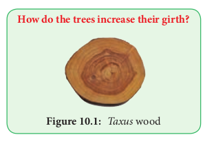
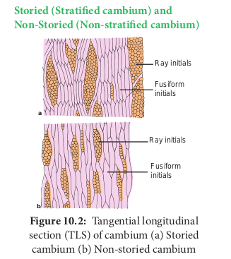
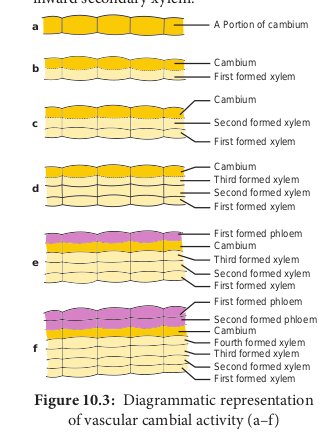
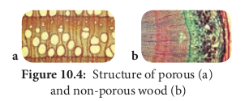
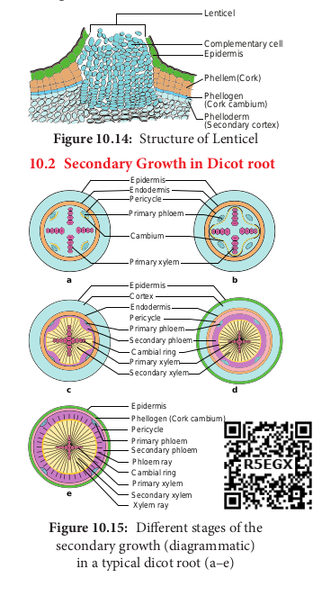
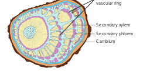
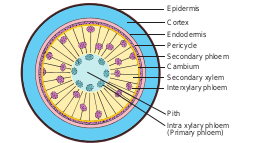
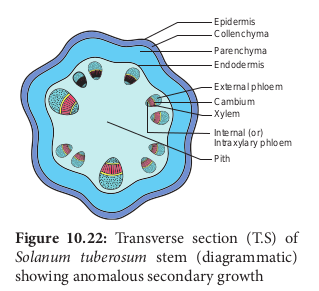
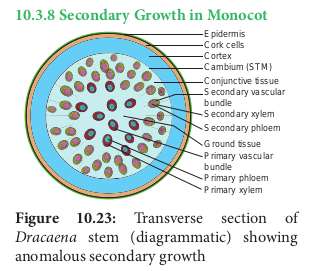
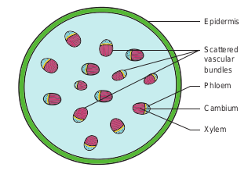

  

**How do the trees increase their girth?**

The students should be able to, _- Analyze primary and secondary_

_growth. 
- Discuss the increase_

_in length and width of the plant._

_- Explain secondary growth in dicot stems._

_- Explain secondary growth in dicot roots._

_- Discuss anomalous secondary growth in dicots and monocots._

**Secon**

**Learning Objectives**

**Chapter 10**

**Chapter Outline**

**10.1** Secondary Growth in Dicot Stem

**10.2** Secondary Growth in Dicot Root

**10.3** Anomalous Secondary Growth

**10.4** Timber

**Unit I (Struct**  

**dary Growth**

We have studied in the previous chapters the primary internal structure of monocots and dicots. If you look at the stem of grass (monocot), it is soft, whereas in the neem (dicot), the stem is very hard and woody, why? It is the secondary growth which confers the hardness to wood of dicot stems and roots. In monocots, usually there is no secondary growth and so they are soft.

The increase in girth is called secondary **growth** or **growth in girth** and we shall discuss the details of secondary growth in this chapter.

The plant organs originating from the apical meristems pass through a period of expansion in length and width. The roots and stems grow in length with the help of apical meristems. This is called primary growth **or longitudinal growth. The gymnosperms** and most angiosperms, including some monocots, show an increase in thickness of stems and roots by means of **secondary growth or latitudinal growth.**

The secondary growth in dicots and gymnosperms is brought about by two lateral meristems. 
- Vascular Cambium an. 
- Cork Cambium

**Activity** Generally monocots do not have secondary growth, but palms and bamboos have woody stems. Find the reason.

**V: Plant Anatomy ural Organisation)**

  

## Secondary Growth in Dicot Stem Vascular Cambium
 The vascular cambium is the lateral meristem that produces the secondary vascular tissues. i.e., secondary xylem and secondary phloem.

**Origin and Formation of Vascular Cambium** A strip of vascular cambium that is believed to originate from the procambium is present between xylem and phloem of the vascular bundle. This cambial strip is known as **intrafascicular or fascicular cambium**. In between the vascular bundles, a few parenchymatous cells of the medullary rays that are in line with the fascicular cambium become meristematic and form strips of vascular cambium. It is called **interfascicular cambium**.

This interfascicular cambium joins with the intrafascicular cambium on both sides to form a continuous ring. It is called a vascular cambial ring. The differences between interfascicular and intrafascicular cambia are summarised below:

**Intrafascicular cambium**

**Interfascicular cambium**

Present inside the vascular bundles

Present in between the vascular bundles.

Originates from the procambium.

Originates from the medullary rays.

Initially it forms a part of the primary meristem.

From the beginning it forms a part of the secondary meristem.

**Organization of Vascular Cambium** The cells of vascular cambium do not fit into the usual description of meristems which have isodiametric cells, with a dense cytoplasm and large nuclei. While the active vascular cambium possesses cells with large central vacuole (or vacuoles) surrounded by a thin, layers of dense cytoplasm.

Further, the most important character of the vascular cambium is the presence of two  

kinds of initials, namely, **fusiform initials** and **ray initials**.

**Fusiform Initials** These are vertically elongated cells. They give rise to the longitudinal or axial system of the secondary xylem (treachery elements, fibres, and axial parenchyma) and phloem (sieve elements, fibers, and axial parenchyma).

Based on the arrangement of the fusiform initials, two types of vascular cambium are recognized.

**Storied (Stratified cambium) and Non-Storied (Non-stratified cambium)**

**a**

**b**

Ray initials

Fusiform initials

Fusiform initials

Ray initials

If the fusiform initials are arranged in horizontal tiers, with the end of the cells of one tier appearing at approximately the same level, as seen in tangential longitudinal section (TLS), it is called storied (stratified) cambium. It is the characteristic of the plants with short fusiform initials. Whereas in plants with long fusiform initials, they strongly overlap at the ends, and this type of cambium is called **non- storied (non-startified) cambium.**

**Ray Initials** These are horizontally elongated cells. They give rise to the ray cells and form the elements of the radial system of secondary xylem and phloem.

| Intrafascicularcambium |Interfascicular cambium |
|------|------|
| Present inside the vascular bundles |Present in betweenthe vascular bundles. |
| Originates from the procambium. |Originates from the medullar y rays. |
| Initially it forms a part of the primar y meristem. |From the beginningit forms a part of thesecondary meristem. |
  

**Activity of Vascular Cambium**

The vascular cambial ring, when active, cuts off new cells both towards the inner and outer side. The cells which are produced outward form secondary phloem and inward secondary xylem.

**a**

**b**

**c**

**d**

**e**

**f**

Cambium First formed xylem

Second formed xylem

First formed xylem

Cambium Third formed xylem

First formed xylem Second formed xylem

First formed phloem Cambium

Second formed xylem Third formed xylem

First formed xylem First formed phloem

Cambium

Second formed xylem Third formed xylem

First formed xylem

Second formed phloem

Fourth formed xylem

Cambium

A Portion of cambium

At places, cambium forms some narrow horizontal bands of parenchyma which passes through secondary phloem and xylem. These are the rays.

Due to the continued formation of secondary xylem and phloem through vascular cambial activity, both the primary xylem and phloem get gradually crushed.

**Secondary Xylem** The secondary xylem, also called wood, is formed by a relatively complex meristem, the vascular cambium, consisting of vertically (axial) elongated fusiform initials and horizontally (radially) elongated ray initials.  

**Xylotomy** The study of wood by preparing sections for microscopic observation.

The axial system consists of vertical files of treachery elements, fibers, and wood parenchyma. Whereas the radial system consists of rows of parenchymatous cells oriented at right angles to the longitudinal axis of xylem elements.

The secondary xylem varies very greatly from species to species with reference to relative distribution of the different cell types, density and other properties. It is of two types.

**Porous Wood or Hard Wood**

Generally, the dicotyledonous wood, which has vessels is called **porous wood** or **hard wood**. Example: _Morus rubra._

**Non- Porous Wood or Soft Wood**

Generally, the gymnosperm wood, which lacks vessels is known as **non- porous wood** or soft wood. Example: Pinus.

and non-porous wood (b)

**Differences between Porous Wood and Non-porous Wood**

**Porous wood or Hard wood, Example: _Morus_**

**Non porous wood or Soft wood, Example: _Pinus_**

Common in angiosperms

Common in gymnosperms

Porous because it contains vessels

Non-porous because it does not contain vessels

**a b**

| Porous wood or Hard wood ,Example: Morus |Non porous wood or So wood ,Example: Pinus |
|------|------|
| Common in angiosperms |Common in g ymnosperms |
| Porous because it contains vessels |Non-porous because it does not contain vessels |
  

Complementary cells

Cork cambium (Phellogen)

(P er

id er

m )Cork (phellem)

Secondary cortex (Phelloderm) Collenchyma

Parenchyma

Secondary phloem

Cambium Autumn wood (secondary xylem) Spring wood (secondary xylem)

Secondary medullary ray

Primary xylem

Pith

Lenticel

Epidermis

Fascicular cambium

Pith**a b**

Secondary Phloem Vascular

cambial ring Secondary xylem

Phellem (Cork)

**c d**

Epidermis

Cortex Bundle cap

Primary Phloem

Primary Xylem

Inter fascicular cambium

Phellogen (Cork cambium) Phelloderm

(Secondary cortex)

Medullary ray

section (a–d)

**Annual Rings** The activity of vascular cambium is under the control of many physiological and  

environmental factors. In temperate regions, the climatic conditions are not uniform throughout the year. In the spring season, cambium is very active and produces a large number of xylary elements having vessels/tracheids with wide lumen. The wood formed during this season is called spring wood or early wood. The tracheary elements are fairly thin walled. In winter, the cambium is less active and forms fewer xylary elements that have narrow vessels/ tracheids and this wood is called **autumn wood or late wood.The treachery elements are with** narrow lumen, very thick walled.

- Usually more distinct annual rings are formed in the regions where climatic variations are sharp.

- Usually more distinct annual rings are formed in temperate plants and not in tropical plants.

- Usually least distinct annual rings are formed in seashore region because the climatic conditions remain same throughout the year.

- Generally annual rings are also less distinct in desert plants.

The spring wood is lighter in colour and has a lower density whereas the autumn wood is darker and has a higher density.

The annual ring denotes the combination of early wood and late wood and the ring becomes evident to our eye due to the high density of late wood. Sometimes annual rings are called **growth rings** but it should be remembered all the growth rings are not annual. In some trees more than one growth ring is formed with in a year due to climatic changes.

Additional growth rings are developed within a year due to adverse natural calamities like drought, frost, defoliation, flood, mechanical injury and biotic factors during the middle of a growing season,which

  

results in the formation of more than one annual ring. Such rings are called **pseudo-** or **false- annual rings**.

Each annual ring corresponds to one year’s growth and on the basis of these rings, the age of a particular plant can easily be calculated. The determination of the age of a tree by counting the annual rings is called **dendrochronology**.

**Importance of Studying Growth Rings*. 
- Age of wood can be calculated. 
- The quality of timber can be ascertained. 
- Radio-Carbon dating can be verified. 
- Past climate and archaeological dating

can be made. 
- Provides evidence in forensic

investigation.

**Dendroclimatology** It is a branch of dendrochronology concerned with constructing records of past climates and climatic events by analysis of tree growth characteristics, especially growth rings.

Early wood Late wood

Sap wood Heart wood

The age of American, _Sequoiadendron_ tree is about 3500 years.  

**Differences Between Spring Wood and Autumn Wood**

**Spring wood or Early wood**

**Autumn wood or Late wood**

The activity of cambium is faster.

Activity of cambium is slower

Produces large number of xylem elements.

Produces a fewer xylem elements.

Xylem vessels/ trachieds have wider lumen.

Xylem vessels/ trachieds have narrow lumen.

Wood is lighter in colour and has lower density

Wood is darker in colour and has a higher density.

Another feature of wood related to seasonal changes is the diffuse porous and ring porous condition. On the basis of diameter of xylem vessels, two main types of angiosperm woods are recognized.

™ **Diffuse porous woods** Diffuse porous woods are woods in which

the vessels or pores are rather uniform in size and distribution throughout an annual ring.

Example: _Acer_ ™ **Ring porous woods**

The pores of the early wood are distinctly larger than those of the late wood. Thus rings of wide and narrow vessels occur.

Example: _Quercus_

Late wood

Early wood

Rays

Tyloses

**a b**

| Spring wood or E arly wood |Autumn wood or L ate wood |
|------|------|
| e activity of cambium is faster. |Activity ofcambium is slower |
| Produces largenumber of xylemelements. |Produces a fewer xylem elements. |
| Xylem vessels/trachieds have wider lumen. |Xylem vessels/trachieds have narrow lumen. |
| Wood is lighter in colour and has lower density |Wood is darker in colour and has a higher density. |
  

The word “Porous” is used by the wood anatomists to refer to the appearance of the vessels as pores in transverse

section.

**Differences Between Diffuse Porous Wood and Ring Porous Wood Diffuse porous wood**

**Ring porous wood**

This type of wood is formed where the climatic conditions are uniform.

This type of wood is formed where the climatic conditions are not uniform.

The vessels are more or less equal in diameter in any annual ring.

The vessels are wide and narrow within any annual ring.

The vessels are uniformly distributed throughout the wood.

The vessels are not uniformly distributed throughout the wood.

**Tyloses** In many dicot plants, the lumen of the xylem vessels is blocked by many balloon- like ingrowths from the neighbouring parenchymatous cells. These balloon-like structures are called **tyloses**.

Vessel wall

Vessel lumen

Parenchyma cell

Tyloses

secondary xylem vessels that have last their function i.e., in heart wood.  

In fully developed tyloses, starchy crystals, resins, gums, oils, tannins or coloured substances are found.

There are tylosoids in gymnosperms and angiosperms

In **gymnosperms**, the resin ducts are blocked by tylose- like ingrowths from the neighbouring resin producing parenchyamatous cells. Example: _Pinus_.

In **angiosperms**, the sieve tubes are blocked by tylose- like ingrowths from the neighbouring parenchyamatous cells. Example: _Bombox._ These are called tylosoids

Wood is also classified into sap wood and **heart wood**. **Sap Wood and Heart Wood** Sap wood and heart wood can be distinguished in the secondary xylem. In any tree the outer part of the wood, which is paler in colour, is called sap wood or alburnum. The centre part of the wood, which is darker in colour is called heart wood or duramen. The sap wood conducts water while the heart wood stops conducting water. As vessels of the heart wood are blocked by tyloses, water is not conducted through them. Due to the presence of tyloses and their contents the heartwood becomes coloured, dead and the hardest part of the wood.

From the economic point of view, generally the heartwood is more useful than the sapwood. The timber from the heartwood is more durable and more resistant to the attack of microorganisms and insects than the timber from sapwood.

When, the heart wood of a tree is destroyed, no vital function of the plant is affected.

When, the sap wood is destroyed, the plant will die because conduction of water will be blocked.

| Diuse porouswood |Ring porouswood |
|------|------|
| is type of woodis formed where theclimatic conditionsare uniform. |is type of woodis formed where theclimatic conditionsare not uniform. |
| e vessels aremore or less equalin diameter in anyannual ring. |e vessels are wideand narrow withinany annual ring. |
| e vessels areuniformly distributedthroughout the wood. |e vessels are notuniformly distributedthroughout the wood. |
  

Bark

Sap wood

Heart wood

Annual rings

**Differences Between Sap Wood (alburnum) and Heart Wood (duramen)**

**Sap Wood (Alburnum)**

**Heart Wood (Duramen)**

Living part of the wood.

Dead part of the wood.

It is situated on the outer side of wood

It is situated in the centre part of wood

It is pale coloured It is dark coloured

Very soft in nature Hard in nature

Tyloses are absent Tyloses are present

It is not durable and not resistant to microorganisms

It is more durable and resists microorganisms

**Secondary Phloem** The vascular cambial ring produces secondary phloem or bast on the outer side of the vascular bundle.

Just as the secondary xylem, the secondary phloem also has two tissue systems – the axial (vertical) and the radial (horizontal) systems derived respectively from the vertically elongated fusiform initials and horizontally elongated ray initials of vascular cambium. While sieve elements, phloem fibre, and phloem parenchyma represent the axial system, phloem rays represent the radial system. Life span of secondary phloem is less compared to secondary xylem. Secondary phloem is a living tissue that transports soluble organic  

compounds made during photosynthesis to various parts of plant.

Some commercially important phloem or bast fibres are obtained from the following plants.

i. Flax-_Linum usitatissimum_ ii. Hemp-_Cannabis sativa_ iii. Sun hemp-_Crotalaria juncea_ iv. Jute-_Corchorus capsularis_

**Be friendly with your environment (Eco friendly)**

Why should not we use the natural products which are made by plant fibres like rope, fancy bags, mobile pouch, mat and gunny bags etc., instead of using plastics or nylon?

**Periderm**

Whenever stems and roots increase in thickness by secondary growth, the periderm, a protective tissue of secondary origin replaces the epidermis and often primary cortex. The periderm consists of phellem, phellogen, and phelloderm.

**Phellem (Cork)**

First cork cell

Cuticle Epidermis

Cortex

Phellogen (Cork cambium)

**a**

**b**

Phellem(Cork)

Cuticle Epidermis

Cortex

Phellogen (Cork cambium) Phelloderm (Secondary cortex)

**Figure 10.11: The cross section of** periderm (a–b)

It is the protective tissue composed of non- living cells with suberized walls and formed centrifugally (outward) by the phellogen (cork cambium) as part of the periderm. It replaces the epidermis in older stems and roots of many seed plants. It is characterized by regularly

| Sap Wood (Alburnum) |Heart Wood (Duramen) |
|------|------|
| Living part of the wood. |Dead part of thewood. |
| It is situated on the outer side of wood |It is situated in thecentre part of wood |
| It is pale coloured |It is dark coloured |
| Ver y so in nature |Hard in nature |
| Tyloses are absent |Tyloses are present |
| It is not durable and not resistant to microorganisms |It is more durable and resists microorganisms |
  

arranged tiers and rows of cells. It is broken here and there by the presence of lenticels.

**Phelloids** Phellem (Cork) like cells which lack suberin in their walls.

**Phellogen (Cork Cambium)** It is a secondary lateral meristem. It comprises homogenous meristematic cells unlike vascular cambium. It arises from epidermis, cortex, phloem or pericycle (extrastelar in origin). Its cells divide periclinally and produce radially arranged files of cells. The cells towards the outer side differentiate into phellem (cork) and those towards the inside as phelloderm (secondary cortex).

**Phelloderm (Secondary cortex)** It is a tissue resembling cortical living parenchyma produced centripetally (inward) from the phellogen as a part of the periderm of stems and roots in seed plants. **Differences Between Phellem and Phelloderm Phellem (Cork) Phelloderm**

**(Secondary cortex)** It is formed on the outer side of phellogen.

It is formed on the inner side of phellogen.

Cells are compactly arranged in regular tires and rows without intercellular spaces.

Cells are loosely arranged with intercellular spaces.

Protective in function.

As it contains chloroplast, it synthesises and stores food.

Consists of non- living cells with suberized walls.

Consists of living cells, parenchymatous in nature and does not have suberin.

Lenticels are present. Lenticels are absent.  

**Rhytidome** is a technical term used for the outer dead bark which consists of periderm and isolated

cortical or phloem tissues formed during successive secondary growth. Example: _Quercus_.

**Polyderm** is found in the roots and underground stems.eg. Rosaceae. It refers to a special type of protective tissues consisting of uniseriate suberized layer alternating with multiseriate nonsuberized cells in periderm.

**Bark** The term ‘bark’ is commonly applied to all the tissues outside the vascular cambium of stem (**i.e., periderm, cortex, primary phloem and secondary phloem**). Bark protects the plant from parasitic fungi and insects, prevents water loss by evaporation and guards against variations of external temperature. It is an insect repellent, decay proof, fireproof and is used in obtaining drugs or spices. The phloem cells of the bark are involved in conduction of food while secondary cortical cells involved in storage. If the phellogen forms a complete cylinder around the stem, it gives rise to **ring barks**. Example: _Quercus._ When the bark is formed in overlapping scale like layers, it is known as **scale bark**. Example: Guava. While ring barks normally do not peeled off, scale barks peeled off.

showing scale bark

| Phellem (C ork) |Phelloderm (Secondar y cortex) |
|------|------|
| It is formed on the outer side of phellogen. |It is formed on the inner side of phellogen. |
| Cells are compactly arranged in regular tires and rows without intercellular spaces. |Cells are loosely arranged with intercellular spaces. |
| Protective in function. |As it contains chloroplast, it synthesises and stores food. |
| Consists of non-living cells with suberized walls. |Consists of livingcells, parenchymatousin nature and doesnot have suberin. |
| Lenticels are present. |Lenticels are absent. |
  

**Lenticel** Lenticel is raised opening or pore on the epidermis or bark of stems and roots.

It is formed during secondary growth in stems. When phellogen is more active in the region of lenticels, a mass of loosely arranged thin-walled parenchyma cells are formed. It is called **complementary tissue** or filling tissue.

Lenticel is helpful in exchange of gases and transpiration called **lenticular transpiration**.

Lenticel

Complementary cell

Phellogen (Cork cambium) Phelloderm (Secondary cortex)

Epidermis

Phellem(Cork)

## Secondary Growth in Dicot root

Cambial ring

Pericycle

**a b**

**c d**

**e**

Epidermis Phellogen (Cork cambium)

Primary phloem Secondary phloem Phloem ray Cambial ring Primary xylem Secondary xylem Xylem ray

Epidermis Cortex Endodermis Pericycle Primary phloem Secondary phloem

Primary xylem Secondary xylem

Primary xylem

Cambium

Primary phloem

Pericycle Endodermis Epidermis

**Figure 10.15: Different stages of the** secondary growth (diagrammatic)

in a typical dicot root (a–e)  

Secondary growth in dicot roots is essential to provide strength to the growing aerial parts of the plants. It is similar to that of the secondary growth in dicot stem. However, there is marked difference in the manner of the formation of vascular cambium.

The vascular cambium is completely secondary in origin. It originates from a combination of conjunctive tissue located just below the phloem bundles, and as a portion of pericycle tissue present above the protoxylem to form a complete and continuous wavy ring. This wavy ring later becomes circular and produces secondary xylem and secondary phloem similar to the secondary growth in stems. **Differences Between Secondary Growth in Dicot Stem and Root**

**Secondary growth in dicot stem**

**Secondary growth in dicot root**

The cambial ring formed is circular in cross section from the beginning.

The cambial ring formed is wavy in the beginning and later becomes circular.

The cambial ring is partially primary (fascicular cambium)and partially secondary (Interfascicular cambium) in origin.

The cambial ring is completely secondary in origin.

Generally, periderm originates from the cortical cells (extrastelar in origin).

Generally, periderm originates from the pericyle. (intrastealar in origin)

More amount of cork is produced as stem is aboveground

Generally, less amount of cork is produced as root is underground.

Lenticels of periderm are prominent.

Lenticels of periderm are not very prominent.

| Primary phloe mSecondary phloem |
|------|------|------|

| Cambial ringPrimary xylem |

| Secondar y growth in dicot stem |Secondar y growth in dicot root |
|------|------|
| e cambial ringformed is circular incross section fromthe beginning. |e cambial ringformed is wavyin the beginningand later becomescircular. |
| e cambialring is partiallyprimary (fascicularcambium)andpartially secondary(Interfascicularcambium) in origin. |e cambial ringis completelysecondary in origin. |
| Generally, peridermoriginates fromthe cortical cells(extrastelar in origin). |Generally, peridermoriginates from thepericyle. (intrastealarin origin) |
| More amount of corkis produced as stem isaboveground |Generally, lessamount of cork isproduced as root isunderground. |
| Lenticels of peridermare prominent. |Lenticels ofperiderm are notvery prominent. |
  

## Cambial variants (Anomalous Secondary Growth)

Cambial variants (previously known as **anomalous secondary growth**) is a deviation from normal secondary growth and production of secondary vascular and non-vascular tissues. A normal cambium with abnormal activity, accessory (additional) cambia or abnormally situated cambia with normal activity can produce anomalous secondary growth. The anomalies may be listed as follows, ### Anomalous position of vascular cambium
 Unusual shapes in stems are formed by the unusual position of cambium. Example: _Thinonia scandens, Serjania ichthyoctona_ and Bauhinia langsdorffiana.

Periderm Secondary phloem

Cambium

Secondary xylem

Periderm

**a**

Periderm Secondary phloem Cambium Secondary xylem Main vascular cylinder Pith Peripheral vascular cylinder

Secondary phloem

### Abnormal behaviour of normal cambium
 Certain segments of cambia cease to produce secondary xylem. But at the same time, it produces secondary phloem only on the outer side. The remaining cambial segments do the normal activity; As a result, ridged and furrowed steles are formed. Example: _Bignonia._  

Sclerenchyma

Starch sheath Secondary phloem

Cambial strips

Secondary xylem

Pith

Epidermis Parenchyma

In plants like _Aviccenia, Cycas, Gnetum_ a number of cambial rings arise in succession and produce concentric rings of secondary tissues.

Secondary xylem

Secondary phloem

Cambium

Successive vascular ring

Epidermis

Cortex

Pericycle Endodermis

Secondary phloem Cambium

Interxylary phloem Secondary xylem

Pith Intra xylary phloem (Primary phloem)

 In this type, the normal vascular bundles are arranged in a ring from which a normal cambial

  

ring is formed. In addition, vascular bundles are scattered or found in a ring in the pith or medullary region. These are called medullary **vascular bundles**. Example: _Boerhaavia._

Epidermis Hypodermis (Collenchyma) Parenchyma Starch sheath Secondary phloem Cambium

Secondary xylem Conjunctive tissue

Medullary bundles (Primary)

Ground tissue

 In this type, a ring of vascular bundles are found, from which a normal cambial ring is formed. In addition, in the cortical region additional vascular bundles are found. Example: _Nyctanthes._

Epidermal hair Epidermis Parenchyma Cortex Endodermis Secondary phloem Cambium Secondary xylem Cortical vascular bundle (Inverted) Pith

### Intraxylary or Internal Phloem
 The cambium usually forms primary phloem on the outer side. In some plants,it forms the primary phloem on the inner side along with xylem towards pith. This is called **intraxylary** or **internal Phloem**. Example: _Solanum tuberosum_  

Epidermis Collenchyma

Parenchyma Endodermis

External phloem Cambium Xylem

Internal (or) Intraxylary phloem Pith

### Secondary Growth in Monocot
 Epidermis Cork cells Cortex Cambium (STM) Conjunctive tissue Secondary vascular bundle

Primary vascular bundle

Ground tissue

Primary phloem Primary xylem

Secondary xylem Secondary phloem

In some monocotyledons, the stems exhibit secondary growth. Example: _Dracaena_. Here, a secondary thickening meristems (STM) originate from the ground tissue outside of the vascular bundles. STM cuts off cells on the inside from which additional vascular bundles are formed along with parenchyma cells in between the vascular bundles. The STM consists of only one type of cells unlike normal vascular cambium. STM does not produce continuous xylem on the inside but only vascular bundle with xylem and phloem. Also no phloem is formed on the outer side.

### Anomalous primary growth I) Absence of vessels in the xylem.

Usually, vessels are found in the xylem of angiosperms, whereas some plants are

  

lacking vessels in the xylem. Example: _Hydrilla, Winteraceae_ family members.

**II) Scattered Vascular bundles along with cambial activity in dicots.** In dicot stem, normally the vascular

bundles are arranged in a ring, whereas some dicot stems possess scattered vascular bundles in the cortex like monocot stems. Example: _Piper, Peperomia._

Epidermis

Scattered vascular bundles

Phloem

Cambium

Xylem

## Timber
 Timber is derived from wood logs through the process of sawing. There are many methods of sawing. Among them, rib sawing is the most common method in making timber. Timber is mainly used for carpentry and building houses. In order to enrich the quality of timber, seasoning of wood is done. Timber is the most important tissue that sequestrates atmospheric carbon and this reduces global warming.

### Seasoning of wood

It is the process in which moisture content from the wood is removed. There are two types of seasoning.

**1\. Air Seasoning** is the process in which the moisture can be removed without resorting to artificial heat. In this method of artificial seasoning, the cut timber pieces are  

left exposed in the open air and the moisture is removed naturally and gradually by the heat of the sun. It increases the strength, the combustibility and renders the wood less subject to decay.

**2\. Kiln Seasoning** is the process in which the moisture can be removed by artificial method in an enclosed condition. The timber pieces are enclosed in a steam-heater chamber into which air is introduced and circulated by fans, ensuring the removal of moisture uniformly, rapidly and completely.

**Activity**

List out the uses of saw dust, shavings and wood flour.

### Grain, Texture, and Figure of Wood Grain
 refers to the structural arrangement of wood, while **texture** shows the relative size and quality of the various types of wood. **Figure of wood** refers to the pattern formed by grains in wood when the wood is cut in the longitudinal direction. It depends on the grain and texture and their exposure by direction of sawing.

**Ply wood:** It is manufactured by gluing together 3 to 9 thin layers or piles of wood

veneers. It is used in flooring, walls, false roof and vehicle interiors.

a. b.

**Activity**

Collect some pieces of plywood, analyse the layers and discuss yourself how it is made.

  

**Summary** Secondary growth deals with the formation of additional vascular tissue by the activities of vascular and cork cambia and secondary thickening meristem (STM). It increases the girth of stem and roots of gymnosperms, most angiosperms, and some monocot plants. Vascular cambium possesses two kinds of initials they are, fusiform and ray initials. Fusiform initials give rise to the axial tissue system whereas ray initials give rise to radial tissue system of stems and roots.

Wood is a very important product of secondary growth. It is classified into various types. Based on respectively on the presence or absence of vessels, - porous and non-porous wood. Based on the wood formed during seasons, - spring wood and autumn wood. The spring and autumn wood, together is called **annual ring. The lumen of the xylem vessels of** heart wood are blocked by many balloon like ingrowths from neighbouring parenchymatous cells called **tyloses**.

The periderm, a secondary protective tissue consists of phellem, phellogen and phelloderm. Secondary growth produces a corky bark around the tree trunk that protects the interior parts from heat, cold, infection etc. Secondary growth of root is different from stem in the method of formation of vascular cambium.

Anomalous secondary growth is now referred as cambial variants. They are abnormal types of secondary growth that occur in some dicots and monocots. Timber is derived from wood logs. In order to enrich the quality of timber, seasoning of wood is done through air and kiln drying. Wood is characterized by colour, grain, texture and figure.

**Evaluation** 1\. Consider the following statements

In spring season vascular cambium i. is less active

ii. produces a large number of xylary elements  

iii. forms vessels with wide cavities of these,

a. (i) is correct but (ii) and (iii) are not correct

b. (i) is not correct but (ii) and (iii) are correct

c. (i) and (ii) are correct but (iii) is not correct

d. (i) and (ii) are not correct but (iii) is correct.

2\. Usually, the monocotyledons do not increase their girth, because a. They possess active-

ly dividing cambium b. They do not possess actively

dividing cambium c. Ceases activity of cambium d. All are correct

3\. In the diagram of lenticel identify the parts marked as A,B,C,D

B

A

D

C

a. A. phellem, B. Complementary tissue, C. Phelloderm, D. Phellogen.

b. A. Complementary tissue, B. Phellem, C. Phellogen, D. Phelloderm.

c. A. Phellogen, B. Phellem, C. Phelloderm, D. complementary

tissue d. A. Phelloderm,

B. Phellem, C. Complementary tissue, D. Phellogen

4\. Inner, darker & harder portion of secondary xylem that cannot conduct water in an older dicot stem is called

  

a. Alburnum b. Bast c. Wood d. Duramen

5\. The common bottle cork is a product of a. Phellem b. Phellogen c. Xylem d. Vascular cambium

6\. What is the fate of primary xylem in a dicot stem showing extensive secondary growth? a. It is retained in the centre of the axis b. It gets crushed c. May or may not get crushed d. It gets surrounded by primary phloem

**Assertion and Reason** 7\. These questions consist of two

statements each printed as Assertion and Reason. While answering these questions you are required to choose any one of the following four responses.

A. If both Assertion and Reason are true but the Reason is a correct explanation of the Assertion.

B. If both Assertion and Reason are true but Reason is not a correct explanation of the Assertion

C. If Assertion is true but the Reason is false.

D. If both Assertion and Reason are false. 1. **Assertion:** In woody stems the

amount of heart wood continue to increase year after Year

Reason: The activity of cambial ring continues uninterrupted

a. A b. B c. C d. D 2. **Assertion:** Secondary growth in

dicot roots occurs with the help of vascular cambium and phellogen.

**Reason:** Vascular cambium is completely primary in origin.

a. A b. B c. C d. D  

**Answer the Following**

8\. Explain the activity of successive cambium with example.

9\. What is wood botanically? 10. In a forest, if the bark of a tree is

damaged by the horn of a deer, How will the plant overcome the damage?

11\. Differentiate the wood formed in Pinus from that of _Morus._

12\. In which season the vessels of angiosperms are larger in size, why?

13\. Central part of the wood is always dark. Why?

14\. Continuous state of dividing tissue is called meristem. In connection to this, what is the role of lateral meristem?

15\. A timber merchant bought 2 logs of wood from a forest & named them A & B, The log A was 50 year old & B was 20 years old. Which log of wood will last longer for the merchant? Why?

16\. A cross section of tree trunk contains 60 lighter and 60 darker rings. Determine the age of the tree and justify.

17\. A transverse section of the trunk of a tree shows concentric rings which are known as growth rings. How are these rings formed? What are the significance of these rings?

18\. There are many tissues produced outside the vascular cambium in the stem. Explain them.

19\. When you go to a timber mart to collect timber for your construction of a new house, how will you select good timber?

20\. Explain artificial seasoning of woods.

  

URL: **https://play.google.com/store/apps/details?id=in.ed**

**ICT Corner Characteristics of Dicot**

**Steps*. 
- Scan the QR code or go to Google play st. 
- Type online labs and install it. 
- Select biology and select Characteristics . 
- Click free sign up and provide your basi. 
- Login with your registered mail id and p. 
- Choose theory tab to know the basic abo. 
- Choose animation to view the sectionin. 
- Choose simulation tab and view the sectio

Let’s explore **inside Stem and Root**

**Activity -** Do the section through simulation  

**u.olabs.olabs&hl=en**

**and Monocot Stem and Root**

re.

f dicot and monocot stem and root. information with valid mail-Id. ssword. t anatomical structure of plant parts. process. n of plant parts under microscope.

\* Pictures are indicative only

and record your observations.

|------|

