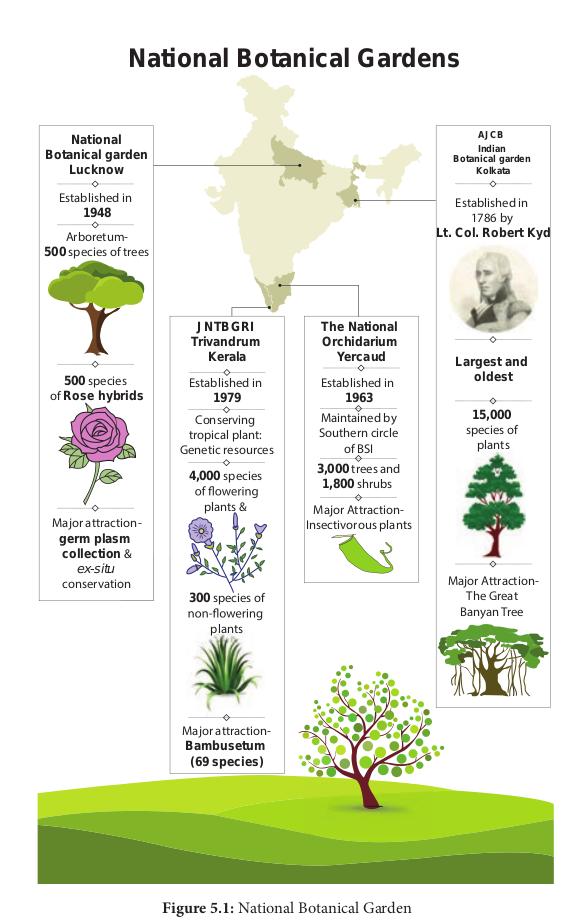
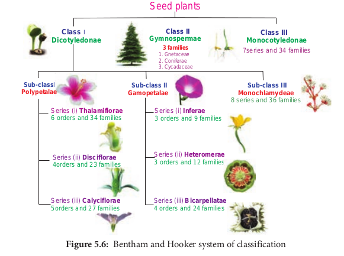
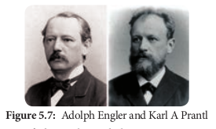
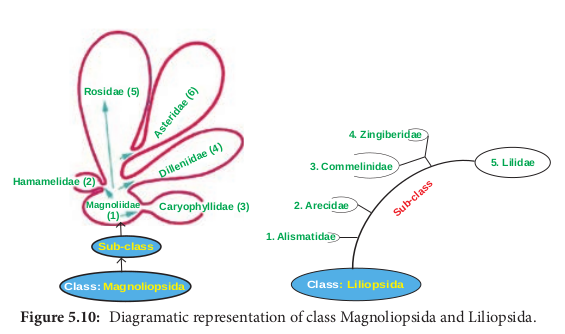
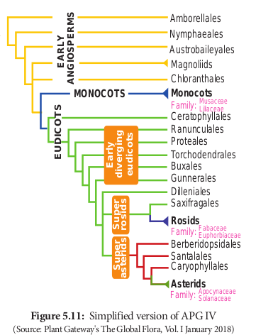
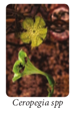

  

The learner will be able to. 
- _Differentiate systematic botany from_

_taxonomy.. 
- _Explain the ICN principles and to_

_discuss the codes of nomenclature.. 
- _Compare the national and international_

_herbaria.. 
- _Appreciate the role of morphology,_

_anatomy, cytology, DNA sequencing in relation to Taxonomy,_

- _Describe diagnostic features of families Fabaceae, Apocynaceae, Solanaceae, Euphorbiaceae, Musaceae and Liliaceae._

**Learning Objectives**

**Chapter Outline 5.1** Taxonomy and Systematics **5.2** Taxonomic Hierarchy **5.3** Concept of species – Morphological,

Biological and Phylogenetic **5.4** International Code of

Botanical Nomenclature **5.5** Taxonomic Aids **5.6** Botanical Gardens **5.7** Herbarium – Preparation and uses **5.8** Classification of Plants **5.9** Need for classification **5.10** Types of classification **5.11** Modern trends

in taxonomy **5.12** Cladistics **5.13** Selected Families

of Angiosperms

**T Syst**

**Chapter**

**5**

**Unit II: P Taxono**  

Plants are the prime companions of human beings in this universe. Plants are the source of food, energy, shelter, clothing, drugs, beverages, oxygen and the aesthetic environment. Taxonomic activity of human is not restricted to living organisms alone. Human beings learn to identify, describe, name and classify food, clothes, books, games, vehicles and other objects that they come across in their life. Every human being thus is a taxonomist from the cradle to the grave.

Taxonomy has witnessed various phases in its early history to the present day modernization. The need for knowledge on plants had been realized since human existence, a man started utilizing plants for food, shelter and as curative agent for ailments.

Theophrastus (372 – 287 BC), the Greek Philosopher known as “**Father of Botany**”. He named and described some 500 plants in his _“De Historia Plantarum”_. Later Dioscorides (62 – 127 AD), Greek physician, described and illustrated in his famous **“Materia medica”** and described about 600 medicinal plants. From 16th century onwards Europe has witnessed a major developments in the field of Taxonomy. Some of the key contributors include Andrea Caesalpino, John Ray, Tournefort, Jean Bauhin and Gaspard Bauhin. Linnaeus **_‘Species Plantarum'_** (1753) laid strong foundation for the binomial nomenclature.

Taxonomy is no more classical morphology based discipline but become a dynamic

**axonomy and ematic Botany**

**lant Morphology and my of Angiosperm**

  

and transdisciplinary subject, making use of many branches of botany such as Cell Biology, Physiology, Biochemistry, Ecology, Pharmacology and also Modern Biotechnology, Molecular Biology and Bioinformatics. It helps to understand biodiversity, wildlife, forest management of natural resources for sustainable use of plants and eco restoration. ## Taxonomy and Systematics
 The word taxonomy is derived from Greek words **_“taxis”_** (arrangement) and **_“nomos”_** (rules or laws). Taxonomy is defined as as “the science dealing with the study of **Differences between Taxonomy and Systemat**

**Taxonomy*. 
- Discipline of classifying organisms into

taxa. 
- Governs the practices of naming,

describing, identifying and specimen preservation.

- Classification + Nomenclature = Taxonomy **Species** is the lowest of classification and

shows the high level of similarities among the organisms. For example, _Helianthus annuus_ and _Helianthus tuberosus_. These two species differ in their morphology. Both of them are herbs but _Helianthus tuberosus_ is a perennial herb.

**Genus** consists of multiple species which have similar characters but differ from the species of another genus. Example: _Helianthus_, _Tridax._

**Family** comprises a number of genera which share some similarities among them. Example: Asteraceae.

**Order** includes group of families which show less similarities among them.

**Class** consists of group of orders which share few similarities.

**Division** is the next level of classification that consists of number of classes.

Example: Magnoliophyta.  

classification including the bases, principles, rules and procedures”.

Simpson (1961) defined Systematics as, “Scientific study of the kinds and diversity of organisms and all relationships among them”. Though there are two terms are used in an interchangeable way, they differ from each other.

## Taxonomic Hierarchy
 Taxonomic hierarchy was introduced by Carolus Linnaeus. It is the arrangement of various taxonomic levels in descending order starting from kingdom up to species.

**ics Systematics**

- Broad field of biology that studies the diversification of species.

- Governs the evolutionary history and phylogenetic relationship in addition to taxonomy.

- Taxonomy + Phylogeny = Systematics

**Kingdom** is the highest level or rank of the classification. Example: Plantae **Rank Ending Example** Kingdom - Plantae Phylum = Division -phyta Magnoliophyta

Subphylum = Sub division -phytina Magnoliophytina

Class -opsida Asteropsida Sub class -idea Asteridea Order -ales Asterales Suborder -ineae Asterineae Family -aceae Asteraceae Sub family -oideae Asteroideae Tribe -eae Heliantheae Genus - Helianthus

Sub genus - _Helianthus_ subg. _Helianthus_

Series - _Helianthus_ ser. _Helianthus_

Species - _Helianthus annuus_

| Taxonomy |Systematics |
|------|------|
. 
- Discipline of classifying organisms intotaxa.- Governs the practices of naming,describing, identifying and specimenpreservation.- Classification + Nomenclature =Taxonomy |- Broad field of biology that studies thediversification of species.- Governs the evolutionar y histor y andphylogenetic relationship in addition totaxonomy.- Taxonomy + Phylogeny = Systematics |

| Rank |Ending |Example |
|------|------|------|
| Kingdom |- |Plantae |
| Phylum =Division |-phyta |Magnoliophyta |
| Subphylum =Sub division |-phytina |Magnoliophytina |
| Class |-opsida |Asteropsida |
| Sub class |-idea |Asteridea |
| Order |-ales |Asterales |
| Suborder |-ineae |Asterineae |
| Family |-aceae |Asteraceae |
| Sub family |-oideae |Asteroideae |
| Tribe |-eae |Heliantheae |
| Genus |- |Helianthus |
| Sub genus |- |Helianthus subg.Helianthus |
| Series |- |Helianthus ser.Helianthus |
| Species |- |Helianthus annuus |
  

## Concept of species-Morphological, Biological and Phylogenetic

Species is the fundamental unit of taxonomic classification. Species is a group of individual organisms which have the following characters. 1. A population of organisms which closely

resemble each other more than the other population.

2\. They descend from a common ancestor. 3. In sexually reproducing organisms, they

interbreed freely in nature, producing fertile offspring. Species concepts can be classified into two

general groups. Concept emphasizing process of evolution that maintains the species as a unit and that can result in evolutionary divergence and speciation. Another concept emphasises the product of evolution in defining a species. **Types of Species** There are different types of species and they are as follows: 1. Process of evolution - Biological Species 2. Product of evolution - Morphological Species

and Phylogenetic Species

**Morphological Species (Taxonomic species)** When the individuals are similar to one another in one or more features and different from other such groups, they are called **morphological species.**

**Biological Species (Isolation Species)** According to **Ernest Mayr** 1963,“ these are groups of populations that interbreed and are reproductively isolated from other such groups in nature”. **Phylogenetic Species** This concept was developed by **Meglitsch** (1954), **Simpson** (1961) and **Wiley** (1978). Wiley defined phylogenetic species as “an evolutionary species is a single lineage of ancestor descendent populations which maintains its identity from other such lineages which has its own evolutionary tendencies and historical fate”.  

## International Code of Botanical Nomenclature (ICBN)
 Assigning name for a plant is known as **Nomenclature.** This is based on the rules and recommendations of the International Code of Botanical Nomenclature. ICBN deals with the names of existing (living) and extinct (fossil) organisms. The elementary rule of naming of plants was first proposed by **Linnaeus** in 1751 in his _Philosophia Botanica_. In 1813 a detailed set of rules regarding plant nomenclature was given by **A.P. de Candolle** in his famous work “_Theorie elementaire de la botanique_”. Then the present ICBN was evolved by following the same rules of **Linnaeus, A.P. de Candolle** and his son **Alphonse de Candolle.**

ICBN due to specific reasons and in order to separate plant kingdom from other organisms, is redesignated as ICN. The International Botanical Congress held in Melbourne in July 2011 brought this change. The ICN stands for International Code of Nomenclature for Algae, Fungi and Plants.

**ICN Principles** International Code of Nomenclature is based on the following six principles. 1. Botanical nomenclature is independent

of zoological and bacteriological nomenclature.

2\. Application of names of taxonomic group is determined by means of nomenclatural types.

3\. Nomenclature of a taxonomic group is based on priority of publication.

4\. Each taxonomic group with a particular circumscription, position and rank can bear only one correct name.

5\. Scientific names of taxonomic groups are treated as Latin regardless of their derivation.

6\. The rules of nomenclature are retroactive unless expressly limited.

  

**Codes of Nomenclature** ICN has formulated a set of rules and recommendations dealing with the botanical name of plants. International Botanical Congress is held at different places every six years. Proposals for nomenclatural changes and changes in rules are discussed and implemented. Changes are published in their website.

18th International Botanical Congress held in 2011at Melbourne, Australia made the following major changes. 1. The code now permits electronic

publication of names of new taxa. 2. Latin diagnosis or description is not

mandatory and permits the use of English or Latin for the publication of a new name (Art-39).

3\. “One fungus, one name” and “one fossil one name” are important changes, the concept of anamorph and teleomorph (for fungi) and morphotaxa (for fossils) have been eliminated. (Previously, sexual and asexual stages of the fungus/ fossils were provided with different names).

**Anamorph** – Asexual reproductive stage of fungus.

**Teleomorph** – Sexual reproductive stage of fungus.

4\. As an experiment with “registration of names” new fungal descriptions require the use of an identifier from a “recognized repository”. There are two recognized repositories **Index fungorum** and **Myco Bank**. 19th International Botanical Congress was

held in Shenzhen in China in 2017. Changes accepted by International Botanical Congress are yet to be published. **Vernacular names (Common names)** Vernacular names are known as **common names.** They are very often descriptive and poetic references to plants. Common name  

refer to more than one plant or many plants may have same common name. These names are regional or local and are not universal. Example: _Albizia amara_ . L belongs to _Mimosaceae_ is called as _Usilai_ in South Tamilnadu and _Thurinji_ in North Tamilnadu.

**Activity** Write common name and scientific name of 10 different plants around your home.

**Scientific Names / Botanical Names** Each and every taxon as per the ICN (species, genus, family etc) can have only one correct scientific name. Scientific name of a species is always a binomial. These names are universally applied. Example: _Oryza sativa L._ is the scientific name of paddy. **Polynomial** Polynomial is a descriptive phrase of a plant. Example: _Ranunculus calycibus retroflexis pedunculis falcatis caule erecto folius compositis._ It means butter cup with reflexed sepals, curved flower stalks, erect stem and compound leaves. Polynomial system of naming a plant is replaced by a binomial system by Linnaeus. **Binomial** Binomial nomenclature was first introduced by **Gaspard Bauhin** and it was implemented by **Carolus Linnaeus**. Scientific name of a species consists of two words and according to binomial nomenclature, the first one is called **genus name** and second one is **specific epithet.** Example: _Mangifera indica_. _Mangifera_ is a genus name and _indica_ is specific epithet. This system is in vogue even now. **Author citation** This refers to valid name of the taxa accompanied by the author’s name who published the name validly. Example: _Solanum nigrum_ L. There are two types of author citation. **Single author**: When a single author proposed a valid name, the name of the author alone

  

is accompanied by his abbreviated name. Example: _Pithecellobium cinereum_ Benth. **Multiple authors**: When two or more authors are associated with a valid publication of name, their names should be noted with the help of Latin word _et_ or &. Example: _Delphinium viscosum_ Hook. f. _et_ Thomson. **Standard form of author’s abbreviations has to be followed.**

**Author** **Standard form of Abbreviation**

Linnaeus L. G.Bentham Benth. William Hooker Hook. Robert Brown R.Br. J.P.Lamarck Lamk. A.P.de Candolle DC. Wallich Wall. Alphonse de Candolle A. DC.

## Taxonomic Aids
 Taxonomic aids are the tools for the taxonomic study. Some techniques, procedures and stored information that are useful in identification and classification of organisms are called **taxonomical aids.** They are required in almost all branches of biological studies for their proper identification and for finding their relationship with others. Some of the taxonomical aids are keys, flora, revisions, monograph, catalogues, herbarium, botanical gardens etc.

**Keys** Taxonomic keys are the tools for the identification of unfamiliar plants. These keys are based on characters which are stable and reliable. The most common type of key is a dichotomous key. It consists of a sequence of two contrasting statements. A pair of contrasting statements is known as **couplet.** Each statement is known as **lead.** The plant is correctly identified with keys by narrowing down the characters found in plant.  

Example:

1\. a) Flowers cream-coloured; fruiting calyx enclosing the berry ......_Physalis_

b) Flowers white or violet; fruiting calyx not enclosing the berry ...._2_

2\. a) Corolla rotate; fruit a berry ....._Solanum_

b) Corolla funnel-form or salver-form; fruit a capsule: ...._3_

3\. a) Radical leaves present; flowers in racemes; fruits without prickles ..._Nicotiana_

b) Radical leaves absent; flowers solitary; fruits with prickles ....._Datura_

Another type of key for identification is the **Polyclave** or **Multi-entry key**. It consists of a list of numerous character states. The user selects all states that match the specimen. Polyclave keys are implemented by a computer algorithm. ## Botanical Gardens
 In true sense all gardens are not botanical gardens. Botanical gardens are centres for collection of plants in their various stages of living. Gardens existed for growing ornamental plants for aesthetic value, religious and status reasons. The famous “hanging gardens” of Babylon in Mesopotamia is an example. For the purpose of science and education the first garden was maintained by **Theophrastus** in his public lecture hall at Athens. First modern botanical garden was established by **Luca Ghini** (1490-1556) a professor of Botany at Pisa, Italy in 1544.

Botanical garden contains special plant collections such as cacti, succulent, green house, shade house, tropical, alpine and exotic plants. Worldwide there are about 1800 botanical gardens and arboreta. **Role of Botanical Garden:** Botanical Gardens play the following important roles. 1. Gardens with aesthetic value which attract

| Author |Standard form of Abbreviation |
|------|------|
| Linnaeus |L. |
| G.B entham |B enth. |
| William Hooker |Hook. |
| Robert Brown |R.Br. |
| J.P.Lamarck |Lamk. |
| A.P.de Candolle |DC. |
| Wallich |Wall. |
| Alphonse de Candolle |A. DC. |
  

Established in **1948**

Arboretum- **500** species of trees

**500** species of **Rose hybrids**

Major attraction- **germ plasm collection** &

_ex-situ_ conservation

**National Botanical garden**

**Lucknow**

**National Bota**

**JNTBGRI Trivandrum**

**Kerala**

Major attraction- **Bambusetum (69 species)**

Conserving tropical plant:

Genetic resources

Established in **1979**

**4,000** species

plants &

**300** species of

plants

Established in 1786 by

**Lt. Col. Robert Kyd**

**Largest and oldest**

Major Attraction- The Great

Banyan Tree

**15,000** species of

plants

**Indian AJCB**

**Botanical garden Kolkata**

**The National Orchidarium**

**Yercaud**

**nical Gardens**

Major Attraction- Insectivorous plants

Maintained by Southern circle

of BSI

Established in **1963**

**3,000** trees and **1,800** shrubs

Botanical Garden

  

a large number of visitors. For example, the Great Banyan Tree _(Ficus benghalensis)_ in the Indian Botanical Garden at Kolkata.

2\. Gardens have a wide range of species and supply taxonomic material for botanical research.

3\. Garden is used for self-instruction or demonstration purposes.

4\. It can integrate information of diverse fields like Anatomy, Embryology, Phyto- chemistry, Cytology, Physiology and Ecology.

5\. Act as a conservation centre for diversity, rare and endangered species.

6\. It offers annual list of available species and a free exchange of seeds.

7\. Botanical garden gives information about method of propagation, sale of plant material to the general public.

**Royal Botanic garden, Kew- England**

Plant collections include Aquatic garden, Arboretum with 14,000 trees, Bonsai collection, Cacti collection and Carnivorous plant collection.

## Herbarium – Preparation and uses
 Herbaria are store houses of preserved plant collections. Plants are preserved in the form of pressed and dried specimens mounted on a sheet of paper. Herbaria act as a centre for research and function as sources of material for systematic work.  

**Preparation of herbarium Specimen** Herbarium Specimen is defined as a pressed and dried plant sample that is permanently glued or strapped to a sheet of paper along with a documentation label.

Preparation of herbarium specimen includes the following steps. **1\. Plant collection:** Field collection, Liquid

preserved collection, Living collection, Collection for molecular studies.

**2\. Documentation of field site data 3. Preparation of plant specimen 4. Mounting herbarium specimen 5. Herbarium labels. 6. Protection of herbarium sheets against**

**mold and insects**

**Uses of Herbarium** 1\. Herbarium provides resource material

for systematic research and studies. 2. It is a place for orderly arrangement of

voucher specimens. 3. Voucher specimen serves as a reference

for comparing doubtful newly collected fresh specimens.

4\. Voucher specimens play a role in studies like floristic diversity, environmental assessment, ecological mechanisms and survey of unexplored areas.

5\. Herbarium provides opportunity for documenting biodiversity and studies related to the field of ecology and conservation biology.

**Kew Herbarium** Kew Garden is situated in South West London that houses the “largest and most diverse botanical and mycological collections in the world” founded in the year 1840. Living collection includes more than 30,000 different kinds of plants. While herbarium which is one of the largest in the world has over seven million preserved plant specimens. The library contains more than 7,50,000 volumes and the

  

**Plant Collection** Plant specimen with flower or fruit is collected

**Documentation of field site data** Certain data are to be recorded at the time of plant collection. It includes date, time, country, state, city, specific locality information, latitude, longitude, elevation and land mark information. These data will be typed onto a herbarium label.

**Preparation of plant specimen** Plant specimen collected from the field is pressed immediately with the help of portable field plant press. plant specimen is transferred to a standard plant press (12” x 18”) which between two outer 12” x 18” frames and secured by two straps.

**Mounting herbarium specimen** The standard size of herbarium sheet is used for mounting the specimen (29cm x 41cm). specimens are affixed to herbarium sheet with standard white glue or solution of Methyl cellulose.

**Herbarium label** Herbarium label size is generally 4-5’’ wide and 2-3’’ tall. A typical label contains all in- formation like habit, habitat, vegetation type, land mark information, latitude, longitude, image document, collection number, date of collection and name of the collector.

**Protection of herbarium sheets against mold and insects**

Apply cation of 2% Mercuric chloride, Naphthalene, DDT, carbon disulphide. Fu- migation using formaldehyde. Presently deep freezing(**\-20oC**) method is followed through- out the world.

**Preparation of herb**  

**arium Specimen**

World’s smallest water – lily _Nymphaea thermarum_ was saved f r o m

extinction when it was grown from seed at Kew in 2009.

  

illustrations and also a collection of more than 1,75,000 prints, books, photographs, letters, manuscripts, periodicals, maps and botanical illustrations.

## Classification of Plants
 Imagine walking into a library and looking for a Harry Potter story book. As you walk into the library you notice that it is under renovation and all the books are scattered. Will it not be hard to find the exact book you are looking for? It might take hours. So you decide to come the next day when all the books are arranged according to the genres. One rack for adventure, another for Detective, Fantasy, Horror, Encyclopaedia and so on. You automatically know Harry Potter is in the fantasy section and it takes less than ten minutes for you to find it. That is because the books have been classified and arranged according to a system.

**International Herbarium**

**National Herbarium**

**S.No Herbarium**

1\. Madras Herbarium BSI campus, Coimbatore

2\. Central National Herbarium West Bengal

3\. Jawaharlal Nehru Tropical Botanical Garden and Research Institute Thiruvananthapuram, Kerala

4\. Presidency College Herbarium, Chennai

**S.No Herbarium**

1\. _Museum National d’Histoire Naturelle_, Pari France

2\. New York Botanical Garden, Bronx, New York, U.S.A

3\. Komarov Botanical Institute, St.Petersburg (Leningrad), Russia

4\. Royal Botanic Gardens, Kew, England, U.K  

Similarly there is a vast assemblage of group of plants in the world. Is it possible to study and understand all of these? No. Since it is difficult to study all these plants together, it is necessary to device some means to make this possible.

Classification is essential to biology because there is a vast diversity of organisms to sort out and compare. Unless they are organized into manageable categories it will be difficult for identification. Biological classifications are the inventions of biologists based upon the best evidence available. The scientific basis for cataloguing and retrieving information about the tremendous diversity of flora is known as **classification**.

Classification paves way for the arrangement of organisms into groups on the basis of their similarities, dissimilarities and relationships. The purpose of classification is to provide a systematic arrangement

**Year Established Acronym Number of specimens**

1955 MH 4,08,776

1795 CAL 2,00,000

1979 TBGRI 30,500

. 1844 PCM 15,000

**Year Established Acronym Number of specimens**

s, 1635 P ,PC 10,000,000

1891 NY 72,00,000

1823 LE 71,60,000

1841 K 70,00,000

| S.No |Herbarium |YearEstablished |Acronym |Number ofspecimens |
|------|------|------|------|------|
| 1. |Museum National d’Histoire Naturelle, Paris,France |1635 |P ,PC |10,000,000 |
| 2. |New York Botanical Garden, Bronx, NewYork, U.S.A |1891 |NY |72,00,000 |
| 3. |Komarov Botanical Institute, St.Petersburg(Leningrad), Russia |1823 |LE |71,60,000 |
| 4. |Royal Botanic Gardens, Kew, England, U.K |1841 |K |70,00,000 |

| S.No |Herbarium |Year Established |Acronym |Number ofspecimens |
|------|------|------|------|------|
| 1. |Madras HerbariumBSI campus, Coimbatore |1955 |MH |4,08,776 |
| 2. |Central National HerbariumWest Bengal |1795 |CAL |2,00,000 |
| 3. |Jawaharlal Nehru Tropical BotanicalGarden and Research Instituteiruvananthapuram, Kerala |1979 |TBGRI |30,500 |
| 4. |Presidency College Herbarium, Chennai. |1844 |PCM |15,000 |
  

**Botanical Survey of India**

On 13 February 1890, a survey was formally constituted and designated as the Botanical Survey of India. After independence, the need was felt for a more comprehensive documentation of the country’s plant resources to boost the economy. Padmashree **Dr.E.K.Janaki Ammal** was appointed as officer on special Duty on 14th Oct 1952. Then reorganization plan was finally approved by the Govt. of India on 29 March 1954, with Calcutta as the headquarters of BSI. Jammu Tavi Botanical Garden has been named after Dr. E. K. Janaki Ammal.

expressing the relationship between the organisms.

Taxonomists have assigned a method of classifying organisms which are called **ranks.** These taxonomical ranks are hierarchical. The scheme of classification has to be flexible, allowing newly discovered living organisms to be added where they fit best.

## Need for Classification
 - Understanding the classification of

organisms can give an insight into other fields and has significant practical value.

- Classification helps us to know about different taxa, their phylogenetic relationship and exact position.

- It helps to train the students of plant sciences with regard to the diversity of  

organisms and their relationship with other biological branches.

## Types of classification
 Taxonomic entities are classified in three ways. They are artificial classification, natural classification and phylogenetic classification.

### Artificial system of classification Carolus Linnaeus
 (1707 -1778) was a great Swedish Botanist and said to be the “**Father**

24 classes recognized by Linnaeus in his _Species Plantarum_ (1753) on the basis of stamens. **No. Classes Characters** 1 2 3 4 5 6 7 8 9 10 11 12

13

14

15

16

17

18

19

20

21 22 23 24

Monandria Diandria Triandria Tetrandria Pentandria Hexandria Heptandria Octandria Ennandria Decandria Dodecandria Icosandria

Polyandria

Didynamia Tetradynamia

Monadelphia

Diadelphia

Polyadelphia

Syngenesia

Gynandria

Monoecia Dioecia Polygamia Cryptogamia

stamen one stamens two stamens three stamens four stamens five stamens six stamens seven stamens eight stamens nine stamens ten stamens 11-19 stamens 20 or more, on the calyx stamens 20 or more, on the receptacle stamens didynamous; 2 short, 2 long stamens tetradyna- mous; 4 long, 2 short stamens monadelphous; united in 1 group stamens diadelphous; united in 2 groups stamens polyadelphous; united in 3 or more groups stamens syngenesious; united by anthers only stamens united with the gynoecium plants monoecious plants dioecious plants polygamous flowerless plants

| 24 c lasses r ecognized b y L innaeus in hi sSpecies P lantarum (1753) o n t he b asis o fstamens. |
|------|------|------|
| No. |Classes |Characters |
| 123456789101112131415161718192021222324 |MonandriaDiandriaTriandriaTetrandriaPentandriaHexandriaHeptandriaOctandriaEnnandriaDecandriaDodecandriaIcosandriaPolyandriaDidynamiaTetradynamiaMonadelphiaDiadelphiaPolyadelphiaSyngenesiaGynandriaMonoeciaDioeciaPolygamiaCryptogamia  |stamen onestamens twostamens threestamens fourstamens vestamens sixstamens sevenstamens eightstamens ninestamens tenstamens 11-19stamens 20 or more, onthe calyxstamens 20 or more, onthe receptaclestamens didynamous;2 short, 2 longstamens tetradyna-mous; 4 long, 2 shortstamens monadelphous;united in 1 groupstamens diadelphous;united in 2 groupsstamens polyadelphous;united in 3 or moregroupsstamens syngenesious;united by anthers onlystamens united withthe gynoecium plantsmonoeciousplants dioeciousplants polygamousowerless plants |
  

**of Taxonomy**.” He outlined an artificial system of classification in “**_Species Plantarum_**” in 1753, wherein he listed and described 7,300 species and arranged in 24 classes mostly on the basis of number, union (adhesion and cohesion), length, and distribution of stamens. The classes were further subdivided on the basis of carpel characteristics into orders. Hence the system of classification is also known as **sexual** **system of classification**.

This system of classification though artificial, was continued for more than 100 years after the death of Linnaeus, due to its simplicity and easy way of identification of plants.

However the system could not hold good due to the following reasons. 1. Totally unrelated plants were kept in a

single group, whereas closely related plants were placed in widely separated groups. Example:

a. Zingiberaceae of monocotyledons and Anacardiaceae of dicotyledonous were placed under the class **Monandria** since these possess single stamens.

b. _Prunus_ was classified along with _Cactus_ because of the same number of stamens.

No attempts were made to classify plants based on either natural or phylogenetic relationships which exist among plant groups.

### Natural system
 Botanists who came after Linnaeus realised that no single character is more important than the other characters. Accordingly an approach to a natural system of classification sprouted in France. The first scheme of classification based on overall similarities was presented by **Antoine Laurent de Jessieu** in 1789.

**Bentham and Hooker system of classification**

**Class I Dicotyledonae:** Plants contain two cotyledons in their seed, leaves with reticulate venation, tap root system and tetramerous or pentamerous flowers come under this class. It includes three sub-classes – **Polypetalae, Gamopetalae** and **Monochlamydeae**.

**Sub-class 1.** Polypetalae: Plants with free petals and dichlamydeous flowers come under polypetalae. It is further divided into three series – **Thalamiflorae, Disciflorae** and **Calyciflorae**.

**Series (i) Thalamiflorae:** Plants having flowers with dome or conical shaped thalamus and superior ovary are included in this series. It includes 6 orders and 34 families.

**Series (ii) Disciflorae:** Flowers having prominent disc shaped thalamus with superior ovary come under this series. It includes 4 orders and 23 families.

**Series (iii) Calyciflorae:** It includes plants having flowers with cup shaped thalamus and

  

with inferior or sometimes with half inferior ovary. Calyciflorae includes 5 orders and 27 families.

**Sub-class 2. Gamopetalae:** Plants with united petals, which are either partially or completely fused to one another and dichlamydeous are placed under Gamopetalae. It is further divided into three series – Inferae, Heteromerae and Bicarpellatae.

**Series (i) Inferae:** The flowers are epigynous and with inferior ovary. Inferae includes 3 orders and 9 families.

**Series (ii) Heteromerae:** The flowers are hypogynous, superior ovary and with more than two carpels. Heteromerae includes 3 orders and 12 families.

**Series (iii) Bicarpellatae:** The flowers are hypogynous, superior ovary and with two carpels. Bicarpellatae includes 4 orders and 24 families.

**Sub-class 3. Monochlamydeae:** Plants with incomplete flowers either apetalous or

Seed p

**Class** I **Dicotyledonae**

**Clas Gymnosp**

**3 fami** 1\. Gneta 2. Conife 3. Cycad

**Sub-class** I **Polypetalae**

**Sub-class II Gamopetalae**

Series (i) **Thalamiflorae** 6 orders and 34 families

Series (ii) **Disciflorae** 4orders and 23 families

Series (iii) **Calyciflorae** 5orders and 27 families

Series (i 3 orders

Series (i 3 orders

Series (i 4 orders

with undifferentiated calyx and corolla are placed under Monochlamydeae. The sepals and petals are not distinguished and they are called **perianth.** Sometimes both the whorls are absent. Monochlamydeae includes 8 series and 36 families.

**Class II Gymnospermae:** Plants that contain naked seeds come under this class. Gymnospermae includes three families – Gnetaceae, Coniferae and Cycadaceae.

**Class III Monocotyledonae:** Plants contain only one cotyledon in their seed, leaves with parallel venation, fibrous root system and trimerous flowers come under this class. The Monocotyledonae has 7 series and 34 families.

The Bentham and Hooker system of classification is still supposed to be the best system of classification. It has been widely practiced in colonial countries and herbaria of those countries were organised based on this system and is still used as a key for the

lants

**s II ermae**

**Class III Monocotyledonae**

**lies** ceae rae aceae

**Sub-class III Monochlamydeae**

8 series and 36 families ) **Inferae** and 9 families

i) **Heteromerae** and 12 families

ii) **Bicarpellatae** and 24 families

7series and 34 families

oker system of classification

  

identification of plants in some herbaria of the world due to the following reasons. 
- Description of plants is quite accurate

and reliable, because it is mainly based on personal studies from actual specimens and not mere comparisons of known **facts.**

- As it is easy to follow, it is used as a key for the identification of plants in several herbaria of the world. Though it is a natural system, this system

was not intended to be phylogenetic.

### Phylogenetic system of classification
 The publication of the **_Origin of Species_** (1859) by **Charles Darwin** has given stimulus for the emergence of phylogenetic system of classification. **I Adolph Engler and Karl A Prantl system of classification**

One of the earliest phylogenetic system of classification of the entire plant Kingdom was jointly proposed by two German botanists **Adolph Engler** ( 1844 -1930) and **Karl A Prantl** (1849 - 1893). They published their

Division: Embryophyta (Siphonogama)

Sub-division: Gymnospermae Sub-division: Angiosp

Class: Monocotyledonae (includes 11 orders 45 families)

Class: Dicotyle (includes 44 or

Archichlamydeae (Apetalae) (i) Corolla polypetalous (ii) Perianth single or double (iii) Includes 33 orders 201 families

Metachlamydeae (Sympetalae) (i) Corolla Gamopeta (ii) Perianth in two w (iii) Includes 11 order

classification in a monumental work “**_Die Naturelichen Pflanzen Familien_**” in 23 volumes (1887-1915)

In this system of classification the plant kingdom was divided into 13 divisions. The first 11 divisions are Thallophytes, twelfth division is **Embryophyta Asiphonogama** (plants with embryos but no pollen tubes; Bryophytes and Pteridophytes) and the thirteenth division is **Embryophyta Siphonogama** (plants with embryos and pollen tubes) which includes seed plants.

**II Arthur Cronquist system of classification Arthur Cronquist** (1919 - 1992) an eminent American taxonomist proposed phylogenetic classification of flowering plants based on a wide range of taxonomic characters including anatomical and phytochemical characters of phylogenetic importance. He has presented his classification in 1968 in his book titled “**The evolution and classification of flowering plants**.” His classification is broadly based on the Principles of phylogeny that finds acceptance with major contemporary authors.

Cronquist classified the angiosperms into two main classes **Magnoliopsida** (=dicotyledons) and **Liliopsida** (= monocotyledons). There are 6 subclasses,

64 orders, 320 families and about 165,000 species in Magnoliopsida, whereas in Liliopsida there are 5 sub classes, 19 orders, 66 families and about 50,000 species.

Cronquist system of classification also could not persist for a long time because, the system is not very useful for identification and cannot be adopted in herbaria due to its high phylogenetic nature.

ermae

donae ders)

lous horls s 57 families

ification

  

### Angiosperm phylogeny group (APG) classification

The most recent classification of flowering plants based on **phylogenetic data** was set in the last decade of twentieth century. Four versions of Angiosperm Phylogenetic Group classification (APG I, APG II, APG III & APG IV) have been published in 1998, 2003, 2009 and 2016 respectively. Each version supplants the previous version. Recognition of **monophyletic** group based on the information received from various disciplines such as gross morphology, anatomy, embryology, palynology, karyology, phytochemistry and more strongly on molecular data with respect to DNA sequences of two chloroplast genes (_atp_B and _rbc_L) and one nuclear gene (nuclear ribosomal 18s DNA).

The most recent updated version, APG IV (2016) recognised 64 orders and 416 families. Of these, 416 families 259 are represented in India.

The outline of APG IV classification is given below.

Angiosperms are classified into three clades early angiosperms, monocots and eudicots. Early angiosperms are classified into **8 orders** and **26 families** (**ANA**\-clade + magnoliids + Chloranthales)

**Hamamelidae (2)**

**Aste rid**

**ae (6)**

**Magnoliidae (1)**

**Dilleniidae (4)**

**Rosidae (5)**

**Caryophyllidae (3)**

**Class: Magnoliopsida**

**Sub-class 1. A**

(So  

**A**mborellales **N**ymphaeales **A**ustrobaileyales

➢ Seeds generally always with two cotyledons.

**Class: Liliopsida**

**5\. Lilidae3. Commelinidae**

**2\. Arecidae**

**lismatidae**

**4\. Zingiberidae**

**Sub-class**

of class Magnoliopsida and Liliopsida.

Amborellales Nymphaeales Austrobaileyales Magnoliids Chloranthales **Monocots** Ceratophyllales Ranunculales Proteales Torchodendrales Buxales Gunnerales Dilleniales Saxifragales **Rosids**

Berberidopsidales Santalales Caryophyllales **Asterids**

**S u**

**p er**

**ro si**

**d s**

**E ar**

**ly d**

**iv er**

**g in**

**g eu**

**d ic**

**o ts**

**E U**

**D IC**

**O T**

**S E**

**A R**

**LY A**

**N G**

**IO S**

**P E**

**R M**

**S**

**MONOCOTS S**

**u p**

**er as**

**te ri**

**d s**

Family: Musaceae Liliaceae

Family: Fabaceae Euphorbiaceae

Family: Apocynaceae Solanaceae

|------|
| MONOCOTS |

  

➢ Presence of ethereal oils. ➢ Leaves are always simple net-veined. ➢ Each floral whorls with many parts. ➢ Perianth usually spirally arranged or

parts in threes. ➢ Stamens with broad filaments. ➢ Anthers tetrasporangiate. ➢ Pollen monosulcate. ➢ Nectaries are rare. ➢ Carpels usually free and ➢ Embryo very small. Monocots are classified into 11 orders

and 77 families (basal monocots + lilioids + commelinids)

➢ Seeds with single cotyledon. ➢ Primary root short-lived. ➢ Single adaxial prophyll. ➢ Ethereal oils rarely present. ➢ Mostly herbaceous, absence of vascular

cambium. ➢ Vascular bundles are scattered in the stem. ➢ Leaf simple with parallel-veined. ➢ Floral parts usually in threes. ➢ Perianth often composed of tepals. ➢ Pollen monosulcate. ➢ Styles normally hollow and ➢ Successive microsporogenesis.

**Changes in earlier taxonomic understanding.** The newly proposed APG classification system has b on the concept of primitive flowering plant familie. 
- The real Ranalean families, especially the arbor

But as per APG classification system, Am Magnoliaceae and Chloranthaceae form the ear

- Monocots are recognised as a monophyletic gr. 
- Dicots are polyphyletic group and as a result the

outdated. 
- Liliaceae (Sensu lato) is split into 14 families. 
- Molluginaceae and Gisekiaceae are recognise. 
- Euphorbiaceae (s.l.) are split in to Phyllanthace. 
- Asclepiadaceae are merged with Apocynaceae . 
- Many genera that were conventionally treated un

and _Vitex_ are transferred to Lamiaceae based on  

Eudicots are divided into 45 orders and 313 families (early diverging eudicots + super rosids + super asterids).

➢ Seeds with always two cotyledons. ➢ Nodes trilacunar with three leaf traces. ➢ Stomata anomocytic. ➢ Ethereal oils rarely present. ➢ Woody or herbaceous plants. ➢ Leaves simple or compound, usually net-

veined. ➢ Flower parts mostly in twos, fours or

fives. ➢ Microsporogenesis simultaneous. ➢ Style solid and ➢ Pollen tricolpate.

APG system is an evolving system that might undergo change periodically based on the new sets of data from various disciplines of Botany. It is the currently accepted system across the world and followed by all the leading taxonomic institutions and practising taxonomists. However, it is yet to percolate into the Indian botanical curriculum.

Classification reflects the state of our knowledge at a given point of time. It will continue to change as we acquire new information.

rought many changes in our earlier understanding . Some of them are given below: escent ones are no more the primitive families. borellaceae, Nymphaceae, Austrobaileyaceae, ly angiosperms. up and hence terminology is retained.

use of the term dicotyledons as a group becomes

separately from Aizoaceae. e, Picrodendraceae and Putranjivaceae. s.l.) der Verbenaceae such as _Clerodendron_, _Tectona_ the modified circumscription of these families.

  

A significant number of major herbaria, including Kew are changing the order of their collections

in accordance with APG. The influential world checklist of

selected plant families (also from kew) is being updated to the APG III system.

A recent photographic survey of the plants of USA and Canada is organized according to the APG III system.

In UK, the latest edition of the standard flora of the British Isles written by Stace is based on the APG III system.

## Modern trends in taxonomy
 Taxonomists now accept that, the morphological characters alone should not be considered in systematic classification of plants. The complete knowledge of taxonomy is possible with the principles of various disciplines like Cytology, Genetics, Anatomy, Physiology, Geographical Distribution, Embryology, Ecology, Palynology, Phenology, Bio-Chemistry, Numerical Taxonomy and Transplant Experiments. These have been found to be useful in solving some of the taxonomical problems by providing additional characters. It has changed the face of classification from **alpha** (classical) to **omega** (modern kind). Thus the new systematic has evolved into a better taxonomy. ### Chemotaxonomy
 Proteins, amino acids, nucleic acids, peptides etc. are the most studied chemicals in

Bentham and Hooker 1883

Engler and Prantl1915

Arthur Cronquist 1981

AP 199

**386 46202 303 Fami**

chemotaxonomy. Chemotaxonomy is the scientific approach of classification of plants on the basis of their biochemical constituents. As proteins are more closely controlled by genes and less subjected to natural selection, it has been used at all hierarchical levels of classification starting from the rank of ‘variety’ up to the rank of division in plants.

The chemical characters can be divided into three main categories.

1\. Easily visible characters like starch grains, silica.

2\. Characters detected by chemical tests like phenolics, oil, fats, waxes.

3\. Proteins. **Aims of chemotaxonomy**

1\. To develop taxonomic characters which may improve existing system of plant classification.

2\. To improve present day knowledge of phylogeny of plants.

### Biosystematics
 Biosystematics is an “Experimental, ecological and cytotaxonomy” through which life forms are studied and their relationships are defined. The term biosystematics was introduced by **Camp** and **Gilly** in 1943. Many authors feel Biosystematics is closer to Cytogenetics and Ecology and much importance given not to classification but to evolution. **Aims of biosystematics** The aims of biosystematics are as follows: 1. To delimit the naturally occurring biotic

community of plant species.

G I 8

APG II 2003

APG III 2009

APG IV 2016

**2 457 413 416 lies**

of classifying flowering plants into families. ew State of World's Plant 2017 )

  

2\. To establish the evolution of a group of taxa by understanding the evolutionary and phylogenetic trends.

3\. To involve any type of data gathering based on modern concepts and not only on morphology and anatomy.

4\. To recognize the various groups as separate biosystematic categories such as ecotypes, ecospecies, cenospecies and comparium.

### Karyotaxonomy
 Chromosomes are the carriers of genetic information. Increased knowledge about the chromosomes have been used for extensive biosystematic studies and resolving many taxonomic problems. Utilization of the characters and phenomena of cytology for the explanation of taxonomic problem is known as **cytotaxonomy** or **karyotaxonomy**. The characters of chromosome such as number, size, morphology and behaviour during meiosis have proved to be of taxonomic value.

### Serotaxonomy (Immunotaxonomy) Systematic serology
 or serotaxonomy had its origin towards the end of twentieth century with the discovery of serological reactions and development of the discipline of immunology. The classification of very similar plants by means of differences in the proteins they contain, to solve taxonomic problems is called **serotaxonomy**. **Smith** (1976) defined it as “**the study of the origins and properties of antisera**.” **Importance of serotaxonomy** It determines the degree of similarity between species, genera, families etc. by comparing the reactions of antigens from various plant taxa with antibodies raised against the antigen of a given taxon.

Example: 1. The assignment of Phaseolus _aureus_ and _P. mungo_ to the genus _Vigna_ is strongly supported by serological evidence by **Chrispeels** and **Gartner**.  

### Molecular taxonomy (molecular systematics / molecular phylogenetics)
 Molecular Taxonomy is the branch of phylogeny that analyses hereditary molecular differences, mainly in DNA sequences, to gain information and to establish genetic relationship between the members of different taxonomic categories. The advent of DNA cloning and sequencing methods have contributed immensely to the development of molecular taxonomy and population genetics over the years. These modern methods have revolutionised the field of molecular taxonomy and population genetics with improved analytical power and precision.

The results of a molecular phylogenetic analysis are expressed in the form of a tree called **phylogenetic tree.** Different molecular markers like allozymes, mitochondrial DNA, microsatellites, RFLP (Restriction Fragment Length Polymorphism), RAPD (Random amplified polymorphic DNA), AFLPs (Amplified Fragment Length Polymorphism), single nucleotide polymorphism- (SNP), microchips or arrays are used in analysis.

**Uses of molecular taxonomy**

1\. Molecular taxonomy helps in establishing the relationship of different plant groups at DNA level.

2\. It unlocks the treasure chest of information on evolutionary history of organisms.

**RFLP (Restriction Fragment Length Polymorphism) RFLP**s is a molecular method of genetic analysis that allows identification of taxa based on unique patterns of restriction sites in specific regions of DNA. It refers to differences between taxa in restriction sites and therefore the lengths of fragments of DNA following cleavage with restriction enzymes.

  

**Amplified Fragment Length Polymorphism (AFLP)** This method is similar to that of identifying RFLPs in that a restriction enzyme is used to cut DNA into numerous smaller pieces, each of which terminates in a characteristic nucleotide sequence due to the action of restriction enzymes.

**AFLP** is largely used for population genetics studies, but has been used in studies of closely related species and even in some cases, for higher level cladistic analysis.

**Random Amplified Polymorphic DNA (RAPD)** It is a method to identify genetic markers using a randomly synthesized primer that will anneal (recombine (DNA) in the double stranded form) to complementary regions located in various locations of isolated DNA. If another complementary site is present on the opposing DNA strand at a distance that is not too great (within the limits of PCR) then the reaction will amplify this region of DNA.

RAPDs like microsatellites may often be used for genetic studies within species but may also be successfully employed in phylogenetic studies to address relationships within a species or between closely related species. However RAPD analysis has the major disadvantage that results are difficult to replicate and in that the homology of similar bands in different taxa may be nuclear.

**Significance of Molecular Taxonomy** 1\. It helps to identify a very large number of

species of plants and animals by the use of conserved molecular sequences.

2\. Using DNA data evolutionary patterns of biodiversity are now investigated.

3\. DNA taxonomy plays a vital role in phytogeography, which ultimately helps in genome mapping and biodiversity conservation.  

4\. DNA- based molecular markers used for designing DNA based molecular probes, have also been developed under the branch of molecular systematics.

### DNA Barcoding
 Have you seen how scanners are used in supermarkets to distinguish the **Universal Product Code** (UPC)? In the same way we can also distinguish one species from another. DNA barcoding is a taxonomic method that uses a very short genetic sequence from a standard part of a genome. The genetic sequence used to identify a plant is known as “**DNA tags**” or “**DNA barcodes**”. **Paul Hebert** in 2003 proposed ‘**DNA barcoding**’ and he is considered as ‘Father of barcoding’.

The gene region that is being used as an effective barcode in plants is present in two genes of the chloroplast, **matK** and **rbcL**, and have been approved as the barcode regions for plants.

Sequence of unknown species can be matched from submitted sequence in GenBank using Blast (web-programme for searching the closely related sequence). **Significance of DNA barcoding** 1\. DNA barcoding greatly helps in

identification and classification of organism.

2\. It aids in mapping the extent of biodiversity.

DNA barcoding techniques require a large database of sequences for comparison and prior knowledge of the barcoding region.

However, DNA barcoding is a helpful tool to determine the authenticity of botanical material in whole, cut or powdered form.

  

### Differences between classical and modern taxonomy

**Classical Taxonomy Modern Taxonomy** It is called old systematics or Alpha (ἀ) taxonomy or Taxonomy

It is called Neosystematics or Biosystematics or Omega (Ω) taxonomy

It is pre Darwinean It is post Darwinean

Species is considered as basic unit and is static

species is considered as dynamic entity and ever changing

Classification is mainly based on morphological characters

Classification is based on morphological, re- productive characters and phylogenetic (evo- lutionary) relationship of the organism

This system is based on the observation of a few samples/ individuals

This system is based on the observation of large number of sam- ples/individuals

## Cladistics
 Analysis of the taxonomic data, and the types of characters that are used in classification have changed from time to time. Plants have been classified based on the morphology before the advancement of microscopes, which help in the inclusions of **sub microscopic** and **microscopic** features. A closer study is necessary while classifying closely related plants. Discovery of new finer molecular analytical techniques coupled with advanced software and computers has ushered in a new era of modern or phylogenetic classification.

The method of classifying organisms into monophyletic group of a common ancestor based on shared apomorphic characters is called **cladistics** (from Greek, _klados_\-branch).

The outcome of a cladistic analysis is a **cladogram**, a tree-shaped diagram that represent the best hypothesis of phylogenetic relationships. Earlier generated cladograms  

were largely on the basis of morphological characters, but now genetic sequencing data and computational softwares are commonly used in phylogenetic analysis. **Cladistic analysis** Cladistics is one of the primary methods of constructing phylogenies, or evolutionary histories. Cladistics uses shared, derived characters to group organisms into clades. These clades have atleast one shared, derived character found in their most recent common ancestor that is not found in other groups hence they are considered more closely related to each other. These shared characters can be morphological such as, leaf, flower, fruit, seed and so on; behavioural, like opening of flowers nocturnal/diurnal; molecular like, DNA or protein sequence and more.

Cladistics accept only **monophyletic groups**. **Paraphyletic** and **polyphyletic** taxa are occasionally considered when such taxa conveniently treated as one group for practical purposes. Example: dicots, sterculiaceae. Polyphyletic groups are rejected by cladistics.

i. **Monophyletic group;** Taxa comprising all the descendants of a common ancestor.

C A D B

**ii. Paraphyletic group;** Taxon that includes an ancestor but not all of the descendants of that ancestor.

A C B D

CB, CBD and ACB are paraphyletic

group

| Classical Taxonomy |Modern Taxonomy |
|------|------|
| It is called oldsystematics or Alpha(ἀ) taxonomy orTaxonomy |It is calledNeosystematics orBiosystematics orOmega (Ω) taxonomy |
| It is pre Darwinean |It is post Darwinean |
| Species is considered asbasic unit and is static |species is consideredas dynamic entity andever changing |
| Classification ismainly based onmorphologicalcharacters |Classification is basedon morphological, re-productive charactersand phylogenetic (evo-lutionary) relationshipof the organism |
| This system is basedon the observation of afew samples/individuals |This system is basedon the observation oflarge number of sam-ples/individuals |

|------|------|------|------|------|

| CB, CBand Aparap |
|------|------|------|------|------|

  

**iii. Polyphyletic group;** Taxa that includes members from two different lineages.

C A D B W X Z Y

**Need for cladistics**

1\. Cladistics is now the most commonly used and accepted method for creating phylogenetic system of classifications.

2\. Cladistics produces a hypothesis about the relationship of organisms to predict the phylogeny

3\. Cladistics helps to elucidate mechanism of evolution.

## Selected Families of Angiosperms Dicot Families 5.13.1 Family: Fabaceae (Pea family) Systematic position

**APG classification Bentham and Hooker classification**

Kingdom Plantae Kingdom Plantae

Clade Angio- sperms Class Dicotyledonae

Clade Eudicots Sub-class Polypetalae Clade Rosids Series Calyciflorae Order Fabales Order Rosales Family Fabaceae Family Fabaceae

**General characters Distribution:** Fabaceae includes about 741 genera and more than 20,200 species. The members are cosmopolitan in distribution but abundant in tropical and subtropical regions.

**Habit:** All types of habits are represented in this family. Mostly herbs (_Crotalaria_), prostrate (_Indigofera enneaphylla)_ erect (_Crotalaria verrucosa_), shrubs (_Cajanus_ _cajan_), small trees (_Sesbania_), climbers (_Clitoria_), large tree (_Pongamia, Dalbergia_),  

woody climber (_Mucuna_), hydrophyte (_Aeschynomene aspera_) commonly called **pith plant.**

**Root:** Tap root system, roots are nodulated, have tubercles c o n t a i n i n g nitrogen – fixing bacteria (_Rhizobium leguminosarum)_

**Stem:** Aerial, herbaceous, woody (_Dalbergia_) twining or climbing (_Clitoria)_.

**Leaf:** Leaf simple or unifoliate (_Desmodium gangeticum_) bifoliate (_Zornia diphylla,_), Trifoliate (_Lablab_ _purpureus)_, alternate, stipulate, leaf base, **pulvinate**, reticulate venation terminal leaflet modifies into a **tendril** in _Pisum sativum._

**Inflorescence:** Raceme (_Crotalaria verrucosa_), panicle (_Dalbergia latifolia_) axillary solitary (_Clitoria ternatea_)

**Flowers:** Bracteate, bracteolate, pedicellete, complete, bisexual, pentamerous, heterochlamydeous, zygomorphic hypogynous or sometimes perigynous.

**Calyx:** Sepals 5, green, synsepalous, more or less united in a tube and persistant, valvate or imbricate, odd sepal is anterior in position.

**Corolla:** Petals 5, apopetalous, unequal and **papilionaceous**, **vexillary** or **descendingly imbricate** aestivation, all petals have claw at the base. The outer most petal is large called **standard petal** or **vexillum**, Lateral 2 petals are lanceolate and curved. They are called **wing petals** or **alae**. Anterior two petals are partly fused and are called **keel petals** or **carina** which encloses the stamens and pistil.

**Androecium:** Stamens 10, diadelphous, usually 9+1 (_Clitoria ternatea_). The odd stamen is posterior in position. In _Aeschynomene aspera_, the

Root nodule

|------|------|------|------|------|

|------|------|------|------|------|

| APG classication |Bentham and Hooker classication |
|------|------|------|------|
| Kingdom |Plantae |Kingdom |Plantae |
| Clade |Angio-sperms |Class |Dicotyledonae |
| Clade |Eudicots |Sub-class |Polypetalae |
| Clade |Rosids |Series |Calyciorae |
| Order |Fabales |Order |Rosales |
| Family |Fabaceae |Family |Fabaceae |
  

stamens are fused to form two bundles each containing five stamens (5)+(5). Stamens are **monadelphous** and **dimorphic** ie. 5 stamens have longer filaments and other 5 stamens have shorter filaments

**Habit**

**Calyx**

Sepal

Stigma

Ovary

Style

Stipe

**Gynoecium C.S.of Ovary**

O

L

**Floral formula Br.,Brl.,%, , K(5),C5,A(9)+1,G1**

**Corolla**

thus the stamens are found at two levels and the shape of anthers also varies in (_Crotalaria verrucosa)_. (5 anthers are long and lanceolate, and the other 5 anthers are short and blunt). Anthers are dithecous,

**L.S of flower**

Standard petal

Wing petal

Keel petal

Stigma

Ovary

Standard petal

Stamen Style

Calyx Stipe

Anther Filament

Single stamen

**Androecium**

vule

ocule

**Floral diagram** _itoria ternatea_

  

basifixed and dehiscing longitudinally.

**Gynoecium:** Monocarpellary, unilocular, ovary superior, with two alternating rows of ovules on marginal placentation. Style simple and bent, stigma flattened or feathery.

**Fruit:** The characteristic fruit of Fabaceae is a legume (_Pisum sativum)_, sometimes indehiscent and rarely a lomentum (_Desmodium)_. In _Arachis hypogea_ the fruit is _**geocarpic**_ (fruits develops and matures under the soil). After fertilization the stipe of the ovary becomes meristematic and grows down into the soil. This ovary gets buried into the soil and develops into fruit.

Seed: Endospermic or non- endospermic (_Pisum sativum_), mostly **reniform**. **Botanical description of _Clitoria ternatea_ (Sangu pushpam)**

**Habit:** Twining climber **Root:** Branched tap root system having

nodules.

**Stem:** Aerial, weak stem and a twiner

**Leaf:** Imparipinnately compound, alternate, stipulate showing reticulate

**Economic Importance**

**Economic importance Binomial U**

Pulses _Cajanus cajan_ (Pigeon Pea) _Phaseolus vulgaris_ (French bean) _Cicer arietinum_ (Chick pea / Channa / _க�ொண்டைக�டை்ை)_

_Vigna mungo_ (black gram / உளுந்து) _Vigna radiata_ (green gram / பொசிபபயறு) _Vigna unguiculata_ (cow pea / தட்டைபபயறு) _Glycine max_ (soya bean) _Macrotyloma uniflorum_ (Horse gram / க�ொள்ளு)

See  

venation. Leaflets are stipellate. Petiolate and stipels are pulvinated.

**Inflorescence:** Solitary and axillary **Flower:** Bracteate, bracteolate, bracteoles

usually large, pedicellate, heterochlamydeous, complete, bisexual, pentamerous, zygomorphic and hypogynous.

**Calyx:** Sepals 5, synsepalous, green showing valvate aestivation. Odd sepal is anterior in position.

**Corolla:** Petals 5, white or blue apopetalous, irregular papilionaceous corolla showing descendingly imbricate aestivation.

**Androecium:** Stamens 10, diadelphous (9)+1, nine stamens fused to form a bundle and the tenth stamen is free. Anthers are dithecous, basifixed, introse and dechiscing by longitudinal slits.

**Gynoecium:** Monocarpellary, uni- locular, with many ovules on mariginal placentation, ovary superior, style simple and incurved with feathery stigma.

**Fruit:** Legume **Seed:** Non-endospermous, reniform. Floral Formula: **Dt0.Dtn0.'.""."M\*7+.E7.C\*;+-3.I3**

**seful part Uses**

ds Sources of protein and starch of our food.

| Economic importance |Binomial |Useful part |Uses |
|------|------|------|------|
| Pulses |Cajanus cajan  (Pigeon Pea)Phaseolus vulgaris (French bean)Cicer arietinum(Chick pea / Channa /க�ொண்Cக�C்ை)Vigna mungo(black gram / உ´Û«)Vigna radiata(green gram / பொzபபய²)Vigna unguiculata(cow pea / தட்Cபபய²)Glycine max (soya bean)Macrotyloma uniflorum(Horse gram / க�ொã´) |Seeds |Sources of protein and starch of our food. |
  

**Economic importance Binomial U**

Food plants _Lablab purpureus_ (field bean)

_Sesbania grandiflora_ (agathi)

_Cyamopsis tetragonoloba_ (cluster bean)

Ten fru Lea

Ten fru

Oil Plants _Arachis hypogea_ (ground nut) _Pongamia pinnata_ (pungam)

See

See

Timber Plants

_Dalbergia latifolia_ (rose wood) _Pterocarpus santalinus_ (red sandalwood) _P.marsupium_ (_வேங்�_)

Tim

Medicinal Plants

_Crotalaria albida Psoralea_ _corylifolia (�ொரவபொ� அரிசி)_

_Glycyrrhiza glabra_ (Licorice root / அதிமதுரம்) _Mucuna pruriens (பூ்ைக�ொலி)_

Ro See Ro

See Fibre Plants _Crotalaria juncea_

(sunhemp / _சணப்ப_) _Sesbania_ sesban _(aegyptiaca)_

Ste fib (Ba

Pith Plant _Aeschynomene aspera_ Ste

Dye Plants _Indigofera tinctoria_ (Avuri)

_Clitoria ternatea_

_Butea monosperma_

Lea

Flo and Flo

Ornamental Plants

_Butea frondosa_ (Flame of the forest), _Clitoria ternatea, Lathyrus odoratus_ (Sweet pea) and _Lupinus hirsutus_ (Lupin)

En pla  

**seful part Uses**

der its ves

der its

Vegetable

Greens

Vegetable

ds

ds

Oil extracted from the seeds is edible and used for cooking. Pongam oil has medicinal value and is used in the preparation of soap.

ber Timber is used for making furniture, cabi- net articles and as building materials.

ots ds

ots

ds

Used as purgative Used in leprosy and leucoderma

Immuno modulater

Neurological remedy m res st)

Used for making ropes.

m pith Used for packing, handicraft and fishing floats

ves

wers seeds wers

Indigo dye obtained from leaves is used to colour printing and in paints. Blue dye is obtained

Natural dye

tire nt

Grown as ornamental plants.

| Economic importance |Binomial |Useful part |Uses |
|------|------|------|------|
| Food plants |Lablab purpureus (field bean)Sesbania grandiflora (agathi)Cyamopsis tetragonoloba(cluster bean) |TenderfruitsLeavesTenderfruits |VegetableGreensVegetable |
| Oil Plants |Arachis hypogea (ground nut)Pongamia pinnata (pungam) |SeedsSeeds |Oil extracted from the seeds is edible andused for cooking.Pongam oil has medicinal value and is usedin the preparation of soap. |
| TimberPlants |Dalbergia latifolia (rose wood)Pterocarpus santalinus(red sandalwood)P.marsupium (வேங்�) |Timber |Timber is used for making furniture, cabi-net articles and as building materials. |
| MedicinalPlants |Crotalaria albidaPsoralea corylifolia(�ொரவபொ� அ…z)Glycyrrhiza glabra(Licorice root / அம«ரÝ)Mucuna pruriens (Á்ைக�ொ‡) |RootsSeedsRootsSeeds |Used as purgativeUsed in leprosy and leucodermaImmuno modulaterNeurological remedy |
| Fibre Plants |Crotalaria juncea(sunhemp / சணப்ப) Sesbania sesban (aegyptiaca) |Stemfibres(Bast) |Used for making ropes. |
| Pith Plant |Aeschynomene aspera |Stem pith |Used for packing, handicraft and fishingfloats |
| Dye Plants |Indigofera tinctoria (Avuri)Clitoria ternateaButea monosperma |LeavesFlowersand seedsFlowers |Indigo dye obtained from leaves is used tocolour printing and in paints.Blue dye is obtainedNatural dye |
| OrnamentalPlants |Butea frondosa(Flame of the forest),Clitoria ternatea,Lathyrus odoratus(Sweet pea) andLupinus hirsutus (Lupin) |Entireplant |Grown as ornamental plants. |
  

### Family: Apocynaceae (milk weed family) (including Asclepiadaceae)

**Systematic position**

**APG classification Bentham and Hooker classification**

Kingdom Plantae Kingdom Plantae

Clade Angiosperms Class Dicotyledonae

Clade Eudicots Sub-class Gamopetalae

Clade Asterides Series Bicarpellatae

Order Gentianales Order Gentianales

Family Apocynaceae Family Apocynaceae

**General Characters Distribution:** This family is represented by 345 genera, 4,675 species. Mostly tropical and subtropical whereas a few species found in temperate region.

**Habit:** Herb (_Catharanthus)_, shrub, (_Nerium)_, tree (_Alstonia_), woody twiner (_Allamanda_) succulent, (_Adenium_) with milky sap in laticiferous vessels.

**Root:** Branched tap root system **Stem: The stems are succulent in some taxa**

(_Stapelia, caralluma_), usually erect, branched

The aerial parts of Galega _officinalis (Fabaceae)_ contains Metformin (dimethyl biguanide). It is now reputed to be the most widely prescribed agent in the treatment of diabetes all over the world.

The attractive seeds of _Adenanthera pavonina_ (Family: Caesalpiniaceae) have been used as units of weight for the measures of gold throughout India.

**Diabetes Remedy**  

solid, glabrous, rarely tube like and thick. **Leaves**: Simple, entire, rarely stipulate

(_Tabernae montana_) exstipulate, opposite decusate (Calotropis) or alternate (Thevetia) or ternate (Nerium), .

**Inflorescence: A Panicle, dichasial cyme,** often umbelliform in (Asclepiadoids) or raceme, or axillary cluster of two flowers each (_Catharanthus_).

**Flowers:** Bracteate, bracteolate, pedicellate, complete, bisexual, actinomorphic, zygo- morphic in (_Ceropegia)_ heterochlamydeous, penta- merous, hypogynous but rarely perigynous or epigynous

**Calyx:** Sepals 5, synsepalous valvate or quincuncial (Thevetia), odd sepal posterior.

**Corolla:** Petals 5, sympetalous united into a tube, salver or funnel shaped; twisted or rarely valvate, often hairy within or contain some corona like out growths at the mouth of the corolla tube.

**Androecium:** Stamens 5 , alternipetalous, often epipetalous, In Asclepiadoids the stamens are connate to the styles to form a

_Ceropegia spp_

The Food and Agriculture Organization (FAO) of the United Nations has been declared 2016 as the year for pulses, to make people more aware of the nutritional value of pulses.

The seeds of Abrus _precatorius_ are used in necklaces and rosaries, but are extremely poisonous and can be fatal if ingested.

**INTERNATIONAL YEAR OF PULSES**

| APG classication |Bentham and Hookerclassication |
|------|------|------|------|
| Kingdom |Plantae |Kingdom |Plantae |
| Clade |Angiosperms |Class |Dicotyledonae |
| Clade |Eudicots |Sub-class |Gamopetalae |
| Clade |Asterides |Series |Bicarpellatae |
| Order |Gentianales |Order |Gentianales |
| Family |Apocynaceae |Family |Apocynaceae |
  

**gynostegium**, pollen grains of each theca of an anther are fused into a waxy mass called pollinium. The right pollinium of each anther attached to the left pollinium of the adjacent anther by a hair like translator, translator arms (**retinacula**) attached together with the gland like structure called **corpusculum**. Anthers are dithecous, basifixed, introse; dehisce longitudinally.

**Gynoecium:** Bicarpellary, carpels apically united, superior, 1 to 2 locule with 2 to many ovules in each locule on marginal placentation. Style one and simple, stigma is characteristically thickened, massive and bilobed. A nectariferous disc is often present around or at the base of the gynoecium, (_Catharanthus_).

**Fruit: The fruit is variable and can be a** berry (_Landolphia_), drupe (_Cerbera_) follicle (_Asclepias_), capsule (_Allamanda_).

**Seed: Seeds are endospermous often** with crown of hairs. **Botanical description of _Catharanthus roseus_ Habit:** Erect ever blooming ornamental plant with milky latex.

**Root:** Branched tap root system

**Economic importance of the family Apocynace**

**S.No Economic importance Binomial**

1 **Food plant** _Carissa carandas (கபரும்�_

_Carissa spinarum (சிறு�ள_

2 **Medicinal plant** _Rauvolfia serpentina_ (Indian snake root /sarpag  

**Stem:** Aerial, erect, cylindrical reddish green, glabrous and branched.

**Leaves:** Usually simple, opposite decussate, exstipulate, subsessile, or petiolate, elliptic – ovate,entire, mucronate, unicostate reticulate venation.

**Inflorescence:** cymose, axillary pairs. **Flower:** Ebracteate, Ebracteolate, subsessile,

complete, bisexual, heterochlamydeous, actinomorphic, hypogynous, pentamerous, rosy purple, white or pink.

**Calyx:** Sepals 5, slightly synsepalous, green showing valvate aestivation.

**Corolla:** Petals 5, sympetalous, throat of corolla tube hairy forming a corona, twisted (hypocrateriform).

**Androecium:** Stamens 5, apostemanous, epipetalous, inserted at the mouth of the corolla tube, filaments short, anthers sagittate, dithecous, dorsifixed, introse.

**Gynoecium:** Bicarpellary, apocarpous, ovaries superior, unilocular, ovules many, placentation marginal, style simple, stigma hour-glass shaped. Two scaly nectaries are present, one on the anterior and another on the posterior side of the ovary.

**Fruit:** A pair of elongated follicles. Floral Formula: **Ebr.,Ebrl., , ,K (5),C(5),A5,G(2)**

**ae**

**Useful part Uses**

_ளொ_) _ொ_)

Fruits Edible and used in pickles

andha) Shoot

Dried roots

To treat hypertension and mental disorders Alkaloid (reserpine) obtained from the dried roots, of the plant can lower the blood pressure and used as sedative for patients suffering from _Schizophrenia._

| S.No |Economicimportance |Binomial |Useful part |Uses |
|------|------|------|------|------|
| 1 |Food plant |Carissa carandas (கப±Ý�ளொ)Carissa spinarum (z²�ளொ) |Fruits |Edible and used in pickles |
| 2 |Medicinal plant |Rauvola serpentina(Indian snake root /sarpagandha) |ShootDried roots |To treat hypertension andmental disordersAlkaloid (reserpine)obtained from the driedroots, of the plant canlower the blood pressureand used as sedative forpatients suering fromSchizophrenia. |
  

 _Cat_](5.14.png "")

**Habit**

**L.S. of the flower Gynoecium**

**C.S. of the ovary Fruit**

**Floral fo**

**Ebr.,Ebrl., , ,K**

A el fo

Leaf

Fruit

Flower

Stigm

Style

Ova

Corolla

Epipetalous stamens Stigma Style Ovary Scal

Scaly nectary

Apocarpous ovary

(hou

Ovule  

_haranthus roseusharanthus roseus_

**Flower entire**

**Seed**

**Floral diagram**

**rmula**

**(5),C(5),A5,G2**

pair of ongated llicles

**Calyx**

Corolla

Calyx

a

ry y nectary

Sepal

r - glass shaped)

  

2 **Medicinal plant** _Thevetia peruviana_ (lucky nut/ தங�அைரி) _Vallaris solanacea_

_Alstonia scholaris_

_Wrightia tomentosa_ (_பொ்_

_Catharanthus roseus_

3\. **Dye yielding plant**

_Wrightia tinctoria_

4\. **_Ornamental plants_**

_Allamanda nerifolia_ (golde trumpet), _Alstonia scholaris,_ _Catharanthus roseus, Nerium indicum Plumeria alba,_

### Family: Solanaceae (Potato Family / Night shade family)

**Systematic Position**

**APG system of classification**

**Bentham and Hooker system of classification**

Kingdom Plantae Kingdom Plantae

Clade Angiosperms Class Dicotyledonae

Clade Eudicot Subclass Gamopetalae

Clade Asterids Series Bicarpellatae

Clade Solanales Order Polemoniales

Family Solanaceae Family Solanaceae

**General Characters Distribution:**

Family Solanaceae includes about 88 genera and about 2650 species, of these _Solanum_ is the largest genus of the family with about 1500 species. Plants are worldwide in  

_ை_)

Seeds

Latex

Bark

Bark and Roots Aerial parts

Used in rheumatism

Useful in toothache and to treat inflated gums.

Used in malaria and dysentery.

Used as antidote to snakebite. Used to treat muscle pain, the alkaloids like vin- blastine and vincristine are mainly used to treat various human cancers.

Seeds An indigo- like dye is obtained from the seeds.

n plant Grown as ornamentals plants.

distribution but more abundant in South America.

**Habit:** Mostly annual herbs, shrubs, small trees (_Solanum violaceum_) lianas with prickles (_Solanum trilobatum_)

**Root:** Branched tap root system.

**Stem:** Herbaceous or woody; erect or twining, or creeping; sometimes modified into tubers (_Solanum tuberosum_) it is covered with Spines (_Solanum tuberosum)_

**Leaves:** Alternate, simple, rarely pinnately compound (_Solanum tuberosum_ and _Lycopersicon esculentum_, exstipulate, opposite or sub-opposite in upper part, unicostate reticulate venation. Yellowish verbs present in _Solanum tuberosum_

**Inflorescence:** Generally axillary or terminal cymose (_Solanum_) or solitary flowers (_Datura stramonium_). Extra axillary

| 2 |Medicinal plant |evetia peruviana(lucky nut/ தங�அை…)Vallaris solanaceaAlstonia scholarisWrightia tomentosa (பொ்ை)Catharanthus roseus |SeedsLatexBarkBark andRootsAerial parts |Used in rheumatismUseful in toothache and totreat inated gums.Used in malaria anddysentery.Used as antidote tosnakebite.Used to treat muscle pain,the alkaloids like vin-blastine and vincristineare mainly used to treatvarious human cancers. |
|------|------|------|------|------|
| 3. |Dye yieldingplant |Wrightia tinctoria |Seeds |An indigo- like dye isobtained from the seeds. |
| 4. |Ornamentalplants |Allamanda nerifolia (goldentrumpet),Alstonia scholaris,Catharanthus roseus,Nerium indicumPlumeria alba, |plant |Grown as ornamentalsplants. |

| APG system ofclassification |Bentham and Hookersystem of classification |
|------|------|------|------|
| Kingdom |Plantae |Kingdom |Plantae |
| Clade |Angiosperms |Class |Dicotyledonae |
| Clade |Eudicot |Subclass |Gamopetalae |
| Clade |Asterids |Series |Bicarpellatae |
| Clade |Solanales |Order |Polemoniales |
| Family |Solanaceae |Family |Solanaceae |
  

scorpiod cyme called **rhiphidium** (_Solanum americanum_) solitary and axillary (_Datura_ and _Nicotiana_) umbellate cyme (_Withania somnifera_).

**Flowers:** Bracteate or ebracteate, pedicellate, bisexual, heterochlamydeous, pentamerous actinomorphic or weakly zygomorphic due to oblique position of ovary, hypogynous.

**Calyx:** Sepals 5, Synsepalous, valvate persistent (_Solanum americanum_), often accrescent. (_Physalis_)

**Corolla:** Petals 5, sympetalous, rotate, tubular (_Solanum_) or bell- shaped (_Atropa_) or infundibuliform (_Petunia_) usually alternate with sepals; rarely bilipped and zygomorphic (_Schizanthus_) usually valvate, sometimes convolute (_Datura_).

**Androecium:** Stamens 5, epipetalous, filaments usually unequal in length, stamens only 2 in _Schizanthus_ (others 3 are reduced to staminode)_,_ Anthers dithecous, dehisce longitudinally or poricidal.

**Gynoecium:** Bicarpellary, syncarpous obliquely placed, ovary superior, bilocular but looks tetralocular due to the formation of false septa, numerous ovules in each locule on axile placentation.

**Fruit:** A capsule or berry. (_Datura_ _&_ _Petunia, Lycopersicon esculentum, Capsicum_)

**Seed:** Endospermous.

**Botanical description of _Datura metel_**

**Habit:** Large, erect and stout herb. **Root:** Branched tap root system. **Stem:** Stem is hollow, green and

herbaceous with strong odour.  

**Leaf:** Simple, alternate, petiolate, entire or deeply lobed, glabrous exstipulate showing unicostate reticulate venation.

**Inflorescence:** Solitary and axillary cyme.

**Flower:** Flowers are large, greenish white, bracteate, ebracteolate, pedicellate, complete, heterochlamydeous, pentamerous, regular, actinomorphic, bisexual and hypogynous.

**Calyx:** Sepals 5, green synsepalous showing valvate aestivation. Calyx is mostly persistent, odd sepal is posterior in position.

**Corolla:** petals 5, greenish white, sympetalous, plicate (folded like a fan) showing twisted aestivation, funnel shaped with wide mouth and 10 lobed.

**Androecium:** Stamens 5, free from one another, epipetalous, alternipetalous and are inserted in the middle of the corolla tube. Anthers are basifixed, dithecous, with long filament, introse and longitudinally dehiscent.

**Gynoecium:** Ovary bicarpellary, syncarpous superior ovary, basically bilocular but tetralocular due to the formation of false septum. Carpels are obliquely placed and ovules on swollen axile placentation. Style simple long and filiform, stigma two lobed.

**Fruit:** Spinescent capsule opening by four apical valves with persistent calyx.

**Seed:** Endospermous. **Floral Formula:** **Dt0.Gdtn0.""".""".M\*7+.E\*7+.C7.I\*4+**

  

**Fruit: Spinescent capsule**

**GCorolla cut openCalyx**

Persistent calyx

Spiny outgrowth

**Floral formu**

**Br.,Ebrl., , ,K(5),C**

**Fruit - After dehiscence**

**Habit**

Sta Co

Ca

Le

Sepal

Corolla

Epipetalo stamens

Anther

**S.No. Economic importance Binomial**

1\. Food plant _Solanum tuberosum_ (potato)

_Lycopersicon esculentum_ (tomato) _Solanum melongena_ (brinjal) _Capsicum annuum_ (bell peppers & chilli papers) _C. frutescens (மிள�ொய்)_

_Physalis peruviana_ (cape gooseberry / கசொடைககு

_தக�ொளி)_  

**ynoecium**

**C.S. of Ovary**

**Floral Diagram la**

**(5),A5,G(2)**

**Flower entire**

Stamen Corolla

Calyx

men rolla

lyx

af

Stigma

Style

Ovary

Ovule Swollen placentaus

Persistent calyx

Spiny outgrowth

Valve Seed

_atura Metel_

**Useful part Uses**

Underground stem tubers Ripened fruits

Tender fruits

Fruits

Fruit

Used as vegetables and also used for the production of starch. Used as delicious vegetable and eaten raw. Cooked and eaten as vegetable. Used as vegetables and powdered chilli is the dried pulverized fruit which is used as spice to add pungency or piquancy and flavour to dishes. Used as delicious fruit.

| Economic importance of the family solanaceae |
|------|------|------|------|------|
| S.No. |Economicimportance |Binomial |Useful part |Uses |
| 1. |Food plant |Solanum tuberosum (potato)Lycopersicon esculentum(tomato)Solanum melongena(brinjal)Capsicum annuum (bellpeppers & chilli papers)C. frutescens (ƒள�ொÞ)Physalis peruviana (capegooseberry / கசொCக¤தக�ொˆ) |Undergroundstem tubersRipened fruitsTender fruitsFruitsFruit |Used as vegetables and also usedfUosr ted ahe ps derod liciouctio un os veg f settar acbh.leand eaten raw.Cooked and eaten asvegetable.Used as vegetables andpowdered chilli is the driedpulverized fruit which is usedas spice to add pungency orpiquancy and flavour to dishes.Used as delicious fruit. |
  

**Economic importance of the family solanaceae**

**S.No. Economic importance Binomial**

2\. Medicinal plant

_Atropa belladonna_ (deadly nightshade)

_Datura stramonium_ _(ஊமத்த)_

_Solanum trilobatum_ (தூதுே்ள) _Withania somnifera_ (Ashwagandha / அமுக�ொரொ)

3\. Tobacco _Nicotiana tabaccum_ (tobacco / பு்�யி்ை)

4\. Ornamental plants

_Cestrum diurnum_ (Day Jasmine) _Cestrum nocturnum_ (Night Jasmine) _Nicotiana alata Petunia hybrida_, _Schizanthus pinnatus_

### Family: Euphorbiaceae (Castor Family / Spurge Family)

**(In APG classification Peraceae, Phyllanthaceae and Picrodendraceae are excluded from the family Euphorbiaceae)**

**Systematic position**

**APG Classification Bentham and Hooker Classification**

Kingdom Plantae Kingdom Plantae _Clade_: Angiosperms Class: Dicotyledonae _Clade_: Eudicots Sub-class: Monochlamydeae  

_Clade_: Rosids Series: Unisexuales Order: Malpighiales Order: Euphorbiales Family: Euphorbiaceae Family: Euphorbiaceae

**General characters Distribution:** Euphorbiaceae includes 214 genera and about 5600 species. The plants of this family are found throughout the world. Well represented in Africa and South America.

**Habit:** Herbs (_Phyllanthus amarus_), mostly shrubs (_Ricinus communics, Jatropha gossypifolia) or tree (Emblica officinalis),_

**Useful part Uses**

Roots

Leaves and roots

Leaves, flowers and berries Roots

A powerful alkaloid ‘atropine’ obtained from root is used in belladonna plasters, tinctures etc. for relieving pain and also for dialating pupils of eyes for eye –testing. Stramonium drug obtained from the leaves and roots of this is used to treat asthma and whooping cough. Used to treat cough.

Used in curing cough and rheumatism.

Leaves are dried and made into tobacco.

Used in cigarette, beedi, hukkah, pipes as well as for chewing and snuffing, alkaloids like nicotine, nornicotine and anabasin are present in tobacco.

Plant Grown in garden as ornamental plants for their aesthetic nature.

Do tomatoes come from a tree?

Solanum betaceum (Tree tomato)

| Economic importance of the family solanaceae |
|------|------|------|------|------|
| S.No. |Economicimportance |Binomial |Useful part |Uses |
| 2. |Medicinalplant |Atropa belladonna(deadly nightshade)Datura stramonium(ஊமத்த)Solanum trilobatum(¾«ே்ள)Withania somnifera(Ashwagandha / அ¯க�ொரொ) |RootsLeaves and rootsLeaves, flowersand berriesRoots |A powerful alkaloid ‘atropine’obtained from root is used inbelladonna plasters, tincturesetc. for relieving pain and alsofor dialating pupils of eyes foreye –testing.Stramonium drug obtainedfrom the leaves and roots ofthis is used to treat asthmaand whooping cough.Used to treat cough.Used in curing cough andrheumatism. |
| 3. |Tobacco |Nicotiana tabaccum(tobacco / ®்�„்ை) |Leaves are driedand made intotobacco. |Used in cigarette, beedi,hukkah, pipes as well asfor chewing and snuffing,alkaloids like nicotine,nornicotine and anabasin arepresent in tobacco. |
| 4. |Ornamentalplants |Cestrum diurnum(Day Jasmine)Cestrum nocturnum (NightJasmine) Nicotiana alataPetunia hybrida, Schizanthuspinnatus |Plant |Grown in garden asornamental plants for theiraesthetic nature.Do tomatoes come from a tree?Solanum betaceum(Tree tomato) |

| Clade: |Rosids |Series: |Unisexuales |
|------|------|------|------|
| Order: |Malpighiales |Order: |Euphorbiales |
| Family: |Euphorbiaceae |Family: |Euphorbiaceae |

| APG Classication |Bentham and HookerClassication |
|------|------|------|------|
| Kingdom |Plantae |Kingdom |Plantae |
| Clade: |Angiosperms |Class: |Dicotyledonae |
| Clade: |Eudicots |Sub-class: |Monochlamydeae |
  

twiners (_Tragia involucrata_) some are xerophytic (_Euphorbia_) with cactus – like (phylloclades) plants usually contain milky or watery sap.

**Root**: Well branched tap root system. **Stem**: Aerial, erect or prostrate

(_E.prostrata_), herbaceous or woody. Stem becomes modified into flattened, leaf-like and becomes succulent in several species of Euphorbia. Such modified stem is called phylloclades. Cylindrical, branched, solid or hollow, usually contain latex either milky (_E.tirucalli_) or watery (_Jatropha curcas_).

**Leaf:** Stipulate or exstipulate. Mostly simple, alternate, often reduced or deciduous as in several species of _Euphorbia_, palmately lobed in (_Ricinus)_ or deeply lobed in (_Manihot)_. The stiplues are modified into a pair of spines (_E.splendens_) or glandular hairs (_Jatropha curcas). The leaves around the cyathium_ inflorescence become beautifully coloured in _E.pulcherrima_ (Paalperukki tree) with unicostate or multicostate reticulate venation.

**Inflorescence: The inflorescence of** Euphorbiaceae varies greatly, Terminal compound raceme – _Croton, Ricinus,_ Catkin – _Acalypha hispida_ Cyme - _Jatropha,_ solitary axillary – _Phyllanthus asperulatus,_ cyathium – _Euphorbia_ species.

Cyathium is an unique and special inflorescence of this family.

**Flowers:** Bracteate, ebracteolate, generally unisexual, homochlamydeous, rarely heterochlamydeous, monoecious or dioecious, actinomorphic, rarely zygomorphic, hypogynous, rearly perigynous.

**Perianth:** Tepals 0 to 5 **biseriate** (male flowers of Croton bonplandianum) uniseriate or aphyllous (_Euphorbia_), valvate or imbricate when present, apophyllous or synphyllous.

**Androecium:** Stamens are 1 to many. In _Euphorbia_ a single stalked stamen represents a single male flower. In Ricinus, usually 5 stamens are present, but each stamen is  

profusely branched. In _Jatroph_a, they are arranged in two whorls each of 5 stamens. The anthers are dithecous, dehisce either by transverse or longitudinal slits.

**Gynoecium:** Tricarpellary, rarely bicarpellary (_Bridelia_), tetra or pentacarpellary (_Wielandia_), syncarpous, ovary superior, rarely semi-inferior, ovules one or two in each locule on axile placentation, Styles 3, each split into two feathery stigma. Nectaries are usually present, gynoecium is present as a pistillode in staminate flowers.

**Fruit**: Fruits are capsule or schizocarp. It breaks violently and dehisce into three one seeded cocci called regma (_Ricinus_ ), drupe in (Emblica officinalis) and berry or samara.

**Seed:** Seeds are endospermous. In _Ricinus_ knob-like caruncle develops from the micropyle,that absorbs and temporarily retains water enabling germination. **Botanical Description Of _Ricinus communis_ (Castor)**

**Habit**: Tall perennial shrub **Root:** Branched tap root system **Stem:** Aerial, erect, cylindrical, branched

and hollow, solid at the base, glabrous, **Leaf:** Simple, petiolate, hollow, exstipulate,

alternate, broad, palmately lobed, usually 7-9 lobes, serrate, palmately reticulate divergent venation.

**Inflorescence: Terminal panicle. Male Flower** Bracteate, ebracteolate,

pedicellate, male flowers (open for one day) towards lower portion of the inflorescence, actinomorphic, incomplete.

**Perianth:** Tepals 5, apophyllous, uniseriate, green, valvate aestivation, odd tepal posterior in position.

**Androecium:** Stamens numerous each stamen profusely branched, anthers globose basifixed.

**Gynocium:** usually absent rarely represented by pistillode.

  

**Male flower Polyadelphous stam**

**Floral diagram of male flower**

**Habit**

Perianth Ovary

Style Stigma

**Female flower**

Perianth

**Floral formula of**

**Floral formula of**

**Br.,Ebrl., , ,**

**Br.,Ebrl., ,**

Crowded and connate stamen

**C.S.of Ova**

**Female Flower** Bracteate, ebracteolate, pedicellate, female flowers (open for fourteen days) found towards the apical portion of inflorescence, actinomorphic, incomplete and hypogynous.

**Perianth:** Tepals 3, apophyllous, green valvate.  

**Androecium**: Absent but staminode is present.

**Gynoecium**: Tricarpellary, syncarpous, ovary superior, distinctly trilobed, trilocular, covered with spiny outgrowth, single large ovule in each locule on axile placentation, style three with three bifid stigma.

**ens Stamen**

**Floral diagram of female flower**

Stamen

Female flower

Male flower

Filament

AntherBranched filament

**male flower**

**female flower**

**P(5),A ,G0**

**,P(3),A 0,G(3)**

Stipitate phalanges

Ovule

Stigma

Style

Ovule Ovary

**L.S.of female flowerry**

_icinus communis_

  

**Fruit**: A schizocarp with spiny outgrowth, splits into three one seeded cocci.

**Seed:** Endospermous, knob-like caruncle develops from the micropyle, that absorbs

**Economic importance**

**Binomial**

**Food plant** _Emblica officinalis (கெல்லிக�ொய் P. acidus (அ்ரகெல்லி) Manihot esculenta_ (மரேள்ளி கிழஙகு / Tapioca)

**Oil plant** Croton oil

Castor Oil

Jatropha Oil

_Croton tiglium_

_Ricinus communis_ (ஆமணககு /Castor)

_Jatropha curcas (�ொடடைொமணககு )_

**Rubber:** _Hevea brasiliensis_ (Para rubber) _Manihot glaziovii_ (Manicoba rubb

**Medicinal plants**

_Euphorbia resinifera_

_Euphorbia hirta_ (அம்மொன் பசசரிசி) _Phyllanthus amarus (கீழொகெல்லி_

_Jatropha gossypifolia_

_Ricinus communis_

**Economic importance of the family Euphor**  

and temporarily retains water enabling germination. **Floral Formula: Male flower: Br.,Ebrl., , ,P(5),A ,G0 Female flower: Br.,Ebrl., , ,P(3),A 0,G(3)**

**Useful part Uses**

) Fruits

Tuberous roots

Rich in vitamin C, which are edible and pickled.

Roots are rich in starch and used for preparing bread, biscuits, chips and other food stuffs.

Seed

Seeds

Seeds

Used as a powerful purgative and also to treat skin diseases. Used as vegetable oil, ricinoleic acid present in this oil eliminate acne causing bacteria apart from that it acts as laxative and lubricant. Used for biofuels.

er)

Coagulated latex

Latex is used in rubber products like tube and tyre.

)

Latex

Whole plant

Entire shoot system

Leaves and roots

Seed oil

_Euphorbium_ drug is obtained from the latex and used as a purgative. Lactogogue

Used to treat Jaundice.

Used in the treatment of leprosy and snakebite.

Purgative

**biaceae**

| Economic importance |Binomial |Useful part |Uses |
|------|------|------|------|
| Food  plant |Emblica ocinalis (கெà‡க �ொÞ ) P. acidus (அ்ரகெà‡)Manihot esculenta(மரே㈠xழங¤  / Tapioca) |FruitsTuberous roots |Rich in vitamin C, which are edible and pickled.Roots are rich in starch and used for preparing bread, biscuits, chips and other food stus. |
| Oil plantCroton oilCastor OilJatropha Oil |Croton tigliumRicinus communis(ஆமணக ¤ /Castor) Jatropha curcas (�ொடCொமணக ¤ ) |SeedSeedsSeeds |Used as a powerful purgative and also to treat skin diseases.Used as vegetable oil, ricinoleic acid present in this oil eliminate acne causing bacteria apart from that it acts as laxative and lubricant.Used for biofuels. |
| Rubber : |Hevea brasiliensis(Para rubber)Manihot glaziovii (Manicoba rubber) |Coagulatedlatex |Latex is used in rubber products like tube and tyre. |
| Medicinal plants |Euphorbia resiniferaEuphorbia hirta (அÝமொå பசச…z)Phyllanthus amarus (Žழொகெà‡ )Jatropha gossypifoliaRicinus communis |LatexWhole plantEntire shoot systemLeaves and rootsSeed oil |Euphorbium drug is obtained from the latex and used as a purgative.LactogogueUsed to treat Jaundice.Used in the treatment of leprosy and snakebite.Purgative |
  

**Dye yielding plants Kamela dye**,

**Blue dye**

**Red dye**

_Mallotus philippensis_

_Jatropha curcas_

_Phyllanthus reticulatus_

**Timber plant** _Aporosa dioica, Bischofia javanica, (வரொமவிருடச_

_Drypetes roxburghii (வீ்ரமரம்)_

**Ornamental plant**

_Acalypha ciliata, Codiaeum varigatum_ _Euphorbia antiquorum, E.pulcherrima, E.splendens. E. tirucalli_ _Jatropha gossypifolia_

**Monocot Family 5.13.5 Family _Musaceae_ – Banana Family Systematic Position**

APG Classification Bentham and Hooker Classification

Kingdom Plantae Kingdom Plantae _Clade_ Angiosperms Class: Monocotyledonae

_Clade_ Monocots Subclass Zingiberidae

_Clade_ Commelinids Series Epigynae

Order Zingiberales Order Zingiberales Family Musaceae Family Musaceae

**M ar**

**an ta**

**ce ae**

**Ca nn**

**ac ea**

**e**

**Zi ng**

**ib er**

**ac ea**

**e**

**Co st**

**ac ea**

**e**

**H el**

**ic on**

**ia ce**

**ae**

**Lo w**

**ia ce**

**ae St**

**re lit**

**zi ac**

**ea e**

**M us**

**ac ea**

**e**

**_Rhizogram of the Zingiberales_**

_Musa velutina_  

Fruits

Bark

Roots

Used for dyeing wool and silk.

Used for dyeing clothes and fishing nets. U_sed_ for tanning and _dyeing_ fishing lines and nets

_ம்)_ Timber Used for packing cases, tea

boxes, veneers, plywood, match industry and several other similar purpose.

Plants Grown as ornamental plants.

Note: Earlier Musaceae was a large family with 6 genera viz. _Musa, Ensete, Ravenala, Strelitzia, Orchidantha_ and _Heliconia_. In APG only Musa and Ensete are retained while _Ravenala, Strelitzia, Orchidantha_ and _Heleconia_ are separated. **General Characters Distribution** Musaceae includes only 2 genera (_Musa_ and _Ensete) and 81 species. The members of this_ family are mainly wet tropical lowlands from West Africa to Pacific (southern Japan to Queensland). (_Musa_ is the most common plant of the family found in India)

**Habit:** Large perennial herbs perennating by means of rhizome ( _Musa paradisiaca_), raraly trees (_Ravenala madagascariensis)_.

**Root:** Fibrous adventitious root system. **Stem:** In _Musa_ the real stem is

found underground called rhizomatous (dichotomously branching in atleast some spp). The apparent aerial erect, unbranched tall pseudostem is formed by the long stiff and sheathy leaf bases which are rolled around

| Dye yielding plants Kamela dye, Blue dyeRed dye |Mallotus philippensisJatropha curcasPhyllanthus reticulatus |FruitsBarkRoots |Used for dyeing wool and silk.Used for dyeing clothes and shing nets.Used for tanning and dyeingshing lines and nets |
|------|------|------|------|
| Timber plant |Aporosa dioica,Bischo¿a javanica, (வரொமŠ±டசÝ)Drypetes roxburghii  ( ்ரமரÝ) |Timber |Used for packing cases, tea boxes, veneers, plywood, match industr y and several other similar purpose. |
| Ornamental plant |Acalypha ciliata,Codiaeum varigatumEuphorbia antiquorum,E.pulcherrima, E.splendens. E. tirucalliJatropha gossypifolia |Plants |Grown as ornamental plants. |

| APG Classication |Bentham and HookerClassication |
|------|------|------|------|
| Kingdom |Plantae |Kingdom |Plantae |
| Clade |Angiosperms |Class: |Monocotyledonae |
| Clade |Monocots |Subclass |Zingiberidae |
| Clade |Commelinids |Series |Epigynae |
| Order |Zingiberales |Order |Zingiberales |
| Family |Musaceae |Family |Musaceae |
  

one another to form an aerial pseudostem. The central axis that is concealed at the bottom of the pseudostem in called shaft, which elongates and pierces through the pseudostem at the time of flowering and produces inflorescence terminally. (Musa) **monocarpic** Stem is aerial and woody in (_Ravenala_ _madagascariensis.)_

**Leaf:** Simple with long and strong petiole, the leaf blade is large and broad with sheathy leaf base. The leaf is exstipulate. Oval, obtuse or oblong with a stout midrib, entire, numerous parallel veins extending up to the margin, rolled in bud. Phyllotaxy is spiral in _Musa_ and distichous i.e. leaves are arranged alternately in two opposite vertical rows in _Ravenala_.

**Inflorescence: Terminal or axillary thyrse** of one to many monochasial branched spadix in Musa, Usually the flowers are protected by large brightly coloured, spirally arranged, boat shaped bract called spathe. Compound cyme in _Ravenala._

**Flowers:** Bracteate, ebracteolate, sessile, trimerous, unisexual or bisexual or polygamous, when unisexual the flowers are monoecious. Flowers are zygyomorphic and epigynous. (In Musa flowers are polygamous i.e. staminate flowers, pistilate flowers and bisexual flowers are present in the same plant).

**Perianth:** Tepals 6, biseriate, arranged in two whorls of 3 each and homochlamydeous, 3 +3 syntepalous. In most of the species of _Musa,_ the three outer tepals and two lateral tepals of the inner whorl are fused to form 5 toothed tube like structure called **abaxial lip**. The posterior inner median tepal alone is free, which is distinctly broad and membranous called **labellum**.

**Androecium:** Stamens 5 or 6, arranged in two whorls of 3 each opposite and adnate to the tepals. In _Musa,_ only 5 stamens are fertile and the inner posterior stamen is either absent or represented by a staminode. In _Ravenala,_ all the six stamens are fertile. Filaments  

free, anthers linear, dithecous dehisce by longitudinal slits, and with sticky pollen.

**Gynoecium:** Tricarpallary, syncarpous, trilocular ovary inferior, ovules many, axile, placentation, style filiform, stigma three lobed septal nectaries are present.

**Fruit:** Elongated thesh (_musa_) berry containing numerous seeds, fruits forming compact bunches, seeds with copious and small embryo in _Musa_. Capsule in _Ravenala._

**Seed:** Larges, starch rich Endosperm (Ensete).

**Botanical Description of _Musa paradisiaca._**

**Habit:** Monocarpic gigantic peremial herb.

**Root:** Fibrous adventitious root system. **Stem: The real stem is underground**

called rhizomatous. The apparent, aerial erect unbranched pseudostem is formed by the long, stiff and sheathy leaf bases which are rolled around one another to form an aerial pseudostem. The central axis that is concealed at the bottom of the pseudostem is called shaft. The shaft elongates, pierces through the pseudostem and produces an inflorescence terminally.

**Leaf:** Simple with a long and strong petiole. The leaf blade is large and broad with sheathy leaf base. Leaf exstipulate and obtuse pinnately parallel venation which extends upto the leaf margin phyllotaxy is spiral.

**Inflorescence: Terminal branched spadix.** Flowers are protected by large, brightly coloured spirally arranged, boat shaped bracts called spathe. When the flowers open, spathe rolls back and falls off.

**Flower:** Bracteate, ebracteolate, sessile, trimerous, unisexual or bisexual, flowers are zygomorphic and epigynous.

**Perianth:** Tepals 6, biseriate, 3+3 syntepalous, arranged in two whorls of 3 each

  

**Habit**

Leaf

Pseudo stem

 _Mus_

Fruit

Branched spadix

**Bisexual flow**

**Inflor**

**Stamens**

Anther

Filament

**C.S of ovary**

Locule Ovule Anterior median carpel

**Gynoec**

and homochlamydeous, the three tepals of the outer whorl and the two lateral tepals of the inner whol are fused by valvate aestivation to form 5 toothed tube like structure called abaxial lip, the posterior inner median tepal is distinctly broad membrancus and free called labellum.

**Androecium:** Stamens 6, arranged in two whorls of 3 each, arranged opposite to the tepals. Only five stamens are fertile and the inner posterior stamen is either absent or represented by staminode. Anthers are dithecous and dehisce by vertical slits. Filament is simple and filiform and rudimentary ovary or pistillode is often present in the male flower.  

**Gynoecium:** Tricarpellary, syncarpous, the median carpel anterior, trilocular, ovary inferior, numerous ovules on axile placentation. Style is simple and filiform, stigma trilobed.

**Fruit: An elongated fleshy berry and** seeds are not produced in cultivated varieties.

Floral Formula

Male flower: **Br,Ebrl,%, ,P(3+2)+1,A3+3,G0**.

Female flower: **Br,Ebrl,%, ,P(3+2)+1,A0,G(3).**

Bisexual flower: **Br,Ebrl,%, ,P(3+2)+1,A3+3,G(3).**

_a paradisiaca_

Ovary

Labellum

Anther Stigma

Inner tepal Outer tepal

**er**

Spathe

Flower

**Spathe with flowersescence**

**Labellum**

Abaxial lip

**Fused tepals**

**ium**

Stigma

Style

Ovary **Floral diagram Floral formula : Bisexual flower**

**Br.,Ebrl.,%, , P(3+2)+1,A3+3,G(3)**

_usa paradisiaca_

  

**Economic Importance of The Family Musa**

**S.No Economic importance**

**Binomial**

1 **Food plant** _Musa paradisiaca_

_Ensete ventricosum_

_Musa chinensis_ (Chinea kela)

2\. **Medicinal plant**

_Musa spp._

3\. **Starch** _Ensete ventricosum_ (Ethiopean banana)

4\. **Fibre yielding plant**

_Musa textilis_ (Manila hemp)

5\. **Ornamental plant**

_Musa coccinea_ (a wild banana species). (_M. acuminata_, _M. veluti_ and _M. ornata_) _Ensete_ _ventricosum_

\*_Ravenala madagascarien_ (traveller’s palm), \*_Strelitzia reginae_ (bird o paradise ) and \*_Heliconia spp_.  

**ceae**

**Useful part Uses**

The raw (tender green) bananas, the shaft and male buds. Leaves

Fruit

Flower stalk (Shaft)

Fruits

Cooked and eaten as vegetable.

Commonly used as plates on festive occasions and are widely used to wrap food items when cooking. Crunchy and salty fried plantain chips are delicious. Edible after cooking. Edible bananas which are sweet, rich in starch and vitamins.

Sap obtained from the sheathy leaf base.

Considered to be an antidote for cobra bite.

The swollen basal parts of leaf sheaths

Used as a source of starch and vitamins.

Fibre Fibre is woven and made into abaca cloth, also used for twine, bagging and wrapping paper.

_na_

Plant Have ornamental scarlet flowers.

Cultivated as ornamentals

_sis_

f

Plant

Grown as ornamental plants

| S.No |Economic importance |Binomial |Useful part |Uses |
|------|------|------|------|------|
| 1 |Food  plant |Musa paradisiacaEnsete ventricosumMusa chinensis (Chinea kela) |e raw (tender green) bananas, the sha and male buds.LeavesFruitFlower stalk (Sha)Fruits |Cooked and eaten as vegetable.Commonly used as plates on festive occasions and are widely used to wrap food items when cooking.Crunchy and salty fried plantain chips are delicious.Edible aer cooking. Edible bananas whichare sweet, rich instarch and vitamins. |
| 2. |Medicinal plant |Musa spp. |Sap obtained from the sheathy leaf base. |Considered to be an antidote for cobra bite. |
| 3. |Starch |Ensete ventricosum(Ethiopean banana) |e swollen basal parts of leaf sheaths |Used as a source of starch and vitamins. |
| 4. |Fibre yielding plant |Musa textilis (Manila hemp) |Fibre |Fibre is woven and made into abaca cloth, also used for twine, bagging and wrapping paper. |
| 5. |Ornamental plant |Musa coccinea(a wild banana species).(M. acuminata, M. velutinaand M. ornata)Ensete ventricosum |Plant |Have ornamental scarlet owers.Cultivated as ornamentals |
| *Ravenala madagascariensis(traveller’s palm),*Strelitzia reginae (bird of paradise ) and *Heliconiaspp. |Plant |Grown as ornamental plants |
  

### Family: Liliaceae (Lily Family)

**Systematic position**

**APG Classification Bentham and Hooker Classification**

Kingdom Plantae Kingdom Plantae

_Clade_ Angiosperms Class Monocotyledons

_Clade_ Monocots Series Coronarieae

Order Liliales Order Liliales

Family Liliaceae Family Liliaceae

Note: Liliaceae of Bentham and Hooker included _Allium, Gloriosa, Smilax, Asparagus, Scilla, Aloe, Dracaena_ etc. Now under APG, it includes only **_Lilium_** and **_Tulipa_**. All others are placed under different families.

**General Characters Distribution:** Liliaceae are fairly large family comprising about 15 genera and 550 species. Members of this family are widely distributed over most part of the world.

**Habit:** Mostly perennial herbs persisting by means of a sympodial rhizome (_Polygonatum)_, by a bulb (_Lilium_) corm (_Colchicum_), shrubby or tree like (_Yucca_ and _Dracaena_). Woody climbers, climbing with the help of stipular tendrils in _Smilax_. Trees in (_Xanthorrhoea),_ succulents (_Aloe)_.

**Root: Adventitious and fibrous, and** typically contractile.

**Stem:** Stems usually bulbous, rhizomatous in some, aerial, erect (_Dracaena_) or climbing (_Smilax)_ in _Ruscus_ the ultimate branches are modified into phylloclades, In Asparagus stem is modified into cladodes and the leaves are reduced to scales.

**Leaf:** Leaves are radical (_Lilium_) or **cauline** (_Dracaena_), usually alternate, opposite (Gloriosa), sometimes fleshy and hollow, reduced to scales (_Ruscus_ and  

_Asparagus). The venation is parallel but_ in species of _Smilax_ it is reticulate. Leaves are usually exstipulate, but in _Smilax_, two tendrils arise from the base of the leaf, which are considered modified stipules.

**Inflorescence: Flowers are usually borne** in simple or branched racemes (_Asphodelus_) spikes in _Aloe_, huge terminal panicle in _Yucca_, solitary and axillary in _Gloriosa_, solitary and terminal in _Tulipa._

**Flowers: Flowers are often showy,** pedicellate, bracteate, ebracteolate, except _Dianella_ and _Lilium_, bisexual, actinomorphic, trimerous, hypogynous, rarely unisexual (_Smilax_) and are dioecious, rarely tetramerous (_Maianthemum_), slightly zygomorphic (_Lilium_) and hypogynous.

**Perianth:** Tepals 6 biseriate arranged in two whorls of 3 each, apotepalous or rarely syntepalous as in _Aloe._ Usually petaloid or sometimes sepaloid, odd tepal of the outer whorl is anterior in position, valvate or imbricate, tepals more than six in _Paris quadrifolia_.

**Androecium:** Stamens 6, arranged in 2 whorls of 3 each, rarely stamens are 3 (_Ruscus_), 4 in _Maianthemum,_ or up to 12, apostamenous, opposite to the tepals, sometimes epitepalous; filaments distinct or connate, anthers dithecous, basifixed or versatile, extrose, or introse, dehiscing usually by vertical slit and sometimes by terminal pores; rarely **synstamenous** (_Ruscus_).

**Gynoecium:** Tricarpallary, syncarpous, the odd carpel usually anterior, ovary superior, trilocular, with 2 rows of numerous ovules on axile placextation; rarely unilocular with parietal placentation, style usually one; stigmas 1 or 3; rarely the ovary is inferior (_Haemodorum_), nectar – secreting **septal glands** are present in the ovary.

**Fruit:** Fruit usually a septicidal or loculicidal capsule or a berry as in _Asparagus_ and _Smilax._

| APG Classification |Bentham and HookerClassification |
|------|------|------|------|
| Kingdom |Plantae |Kingdom |Plantae |
| Clade |Angiosperms |Class |Monocotyledons |
| Clade |Monocots |Series |Coronarieae |
| Order |Liliales |Order |Liliales |
| Family |Liliaceae |Family |Liliaceae |
  

**Botanical description of _Allium cepa_** (In APG classification, _Allium cepa_ is placed under the family Amaryllidaceae)

**Habit:** Perennial herb with bulb. **Root:** Fibrous adventitious root system **Stem:** Underground bulb **Leaf:** A cluster of radical leaves emerges

from the underground bulb, cylindrical and fleshy having sheathy leaf bases with parallel venation.

**Inflorescence: Scapigerous i.e. the** inflorescence axis (peduncle) arising from the ground bearing a cluster of flowers at its apex. Pedicels are of equal length, arising from the apex of the peduncle which brings all flowers at the same level.

**Flower:** Small, white, bracteate, ebracteolate, pedicellate, complete, trimerous,

**Habit**

Inflorescence

Bract

Peduncle

Cylindrical fleshy le

Bulbose stem

actinomorphic and hypogynous. Flowers are protandrous.

**Perianth:** Tepals 6, white, arranged in two whorls of three each, syntepalous showing valvate aestivation.

**Androecium:** Stamens 6, arranged in two whorls of three each, epitepalous, apostamenous /free and opposite to tepals. Anthers dithecous, basifixed, introse, and dehiscing longitudinally.

**Gynoecium:** Tricarpellary and syncarpous. Ovary superior, trilocular with two ovules in each locule on axile placentation. Style simple, slender with simple stigma.

**Fruit:** A loculicidal capsule. **Seed:** Endospermous **Floral Formula:** **Br.,Ebrl., , ,P(3+3) A 3+3,G(3)**

**Flower entire**

**Inflorescence**

Stigma

af

Pedicel

Flower

Bract Peduncle

Epitepalous stamen

Filament

Ovary Perianth

Pedicel

_Alliu cepa_

  

**L.s of flower Gynoecium**

**Habit**

**Floral formula**

**Br.,Ebrl., , ,P(3+3) A3+3,G(3)**

Anther

Style Stigma

Ovary Pedicel

**S.No Economic importance**

**Binomial**

1 Food plant _Allium cepa_

_Allium sativum_

_Asparagus officinalis_

2\. Medicinal plant

_Aloe vera_  

**Floral diagram**

**Flower entire**

**C.S. of ovary**

Style

Stigma

Ovary Ovule

Locule

Carpel

_Allium cepa_ **e**

**Useful part Uses**

Bulbs Used as vegetable, stimulative, diuretic, expectorant with bactericidal properties.

Bulbs

Fleshy

shoots

Used as condiment and also

good for heart.

Used as vegetables.

Leaves Gelatinous glycoside called aloin from succulent leaves are used in soothing lotions, piles and inflammations, hemorrhoidal salves and shampoos.

| S.No |E conomic importance |Binomial |Useful part |Uses |
|------|------|------|------|------|
| 1 |Food plant |Allium cepaAllium sativumAsparagus officinalis |BulbsBulbsFleshyshoots |Used as vegetable, stimulative, diuretic, expectorant with bactericidal properties.Used as condiment and alsogood for heart.Used as vegetables. |
| 2. |Medicinal plant |Aloe vera |Leaves |Gelatinous glycoside called aloin from succulent leaves are used in soothing lotions, piles and inflammations, hemorrhoidal salves and shampoos. |
  

_Asparagus racemosus_

_Colchichum luteum_

_Gloriosa superba_

3\. Fibre yielding plant

_Phormium tenax_

4\. Raticides

Insecticides

_Urginea indica_

_Veratrum album_

5\. Polyploidy

_Colchicum luteum_

6\. Ornamental plants

_Agapanthus africanus_

(African Lily)

_Gloriosa superba_

(Malabar glory lily)

_Lilium giganteum_

_Ruscus aculeatus_ (Butchers Broom)

_Yucca alcifolia_ and _Y.gloriosa_

In _Yucca_ the cross-pollination _Pronuba yuccasella_. Fully ope are visited by the female moth moth collects a lot of pollen g

another flower. Life history of this moth is pollination mechanism in _Yucca_.  

Roots

Roots

Tubers

Medicinal oil is prepared from the root is used for nervous and rheumatic complaints and also in skin diseases.

Used in the treatment of gout and rheumatism.

Tubers helpful in promoting labour pains in women.

Fibre Used for cordage, fishing net, mattings, twines.

Bulbs

Bulbs

Used for killing rats.

Used as insecticide.

Corm Colchicine (alkaloid)

used to induce polyploidy.

Plant Some of the well known garden ornamentals.

**Can you identify this?** a. Name the family. b. Write the binomial. c. List the economic

uses.

is carried out by special moth, ned flowers emit perfumes and , especially during nights. This

rains from one flower and visits intimately associated with the

| Asparagus racemosusColchichum luteumGloriosa superba |RootsRootsTubers |Medicinal oil is prepared from the root is used for ner vous and rheumatic complaints and also in skin diseases.Used in the treatment of gout and rheumatism.Tubers helpful in promoting labour pains in women. |
|------|------|------|------|------|
| 3. |Fibre yielding plant |Phormium tenax |Fibre |Used for cordage, fishing net, mattings, twines. |
| 4. |R aticidesInsecticides |Urginea indicaVeratrum album |BulbsBulbs |Used for killing rats.Used as insecticide. |
| 5. |Polyploidy |Colchicum luteum |Corm |Colchicine (alkaloid)used to induce polyploidy. |
| 6. |Ornamental plants |Agapanthus africanus(African Lily)Gloriosa superba(Malabar glor y lily)Lilium giganteumRuscus aculeatus(Butchers Broom)Yucca alcifolia andY.gloriosa |Plant |Some of the well known garden ornamentals.Can you identif y this?a. Name the family.b. Write the binomial.c. List the economic uses. |
  

**Summary** Taxonomy deals with the identification,

naming and classification of plants. But systematics deals with evolutionary relationship between the organisms in addition to taxonomy. Taxonomic hierarchy was introduced by Carolus Linnaeus. It also includes ranks. Species is the fundamental unit of taxonomic classification. Species concept can be classified into two groups based on the process of evolution and product of evolution. There are three types of species, morphological, biological and phylogenetic species. Taxonomic aids are the tools for the taxonomic study such as keys, flora, revisions, catalogues, botanical gardens and herbaria. Botanical gardens serve different purposes. They have aesthetic value, offers scope for botanical research, conservation of

A scrambling or climbing plant.

The flower petals, wavy on the edges, greenish yellow when bloom, turn flame red at the tips when matures

leaves s leaf tip i

t

The plant contain the alkaloid colchicine. It is widely used as an experimental tool in the study of cell division.

Fruit is a fleshy capsule

Petals and ar backw

A a

.

Gloriosa means full of glor The name of _Gloriosa superba_ is composed of tw

y, superba mea This plant was placed earlier in Liliac

**State Flower of Tamil Nadu**

**_Gloriosa superba_**  

rare species and propagation of many species. Botanical survey of India explores and documents biodiversity all over India. It has 11 regional centres in India. Herbarium preparation includes plant collection, documentation of field data, preparation of plant specimens, mounting and labelling. There are several national and international herbaria. National herbaria include MH, PCM, CAL etc. Kew herbarium is the world’s largest one.

Classification is the basis for cataloguing and retrieving information about the tremendous diversity of flora. It helps us to know about different varieties, their phylogenetic relationship and exact position. Some important systems of classification are fall in to three types; artificial,

natural and phylogenetic. Carolus Linnaeus outlined an artificial system of classification in “_Species Plantarum_” in 1753. The first scheme of classification based on overall similarities was presented by Antoine Laurent De Jessieu in 1789. A widely followed natural system of classification was proposed by George Bentham (1800 - 1884) and Joseph Dalton Hooker. This system was not intended to be phylogenetic. One of the earliest phylogenetic systems of classification was jointly proposed by Adolf Engler and Karl A Prantl in a monumental work “**_Die Naturelichen Pflanzen Familien_**”. Arthur Cronquist proposed phylogenetic classification of flowering plants based on a wide range of taxonomic characters including anatomical and phytochemical of phylogenetic importance in his book titled “The evolution and classification of flowering

ubopposite, the s modified into endril.

have wavy edges e strongly turned ards.

nthers extrose nd versatile.

o greek words ns superb. eae.

  

plants.” Angiosperm phylogeny group (APG) classification is the most recent classification of flowering plants based on phylogenetic data. APG system is an evolving and currently accepted system across the world and followed by all the leading taxonomic institutions and practising taxonomists.

Cladistics is the methodology, used to classify organisms into monophyletic groups, consisting of all the descents of the common ancestors. The outcome of a cladistic analysis is a cladogram and is constructed to represent the best hypothesis of phylogenetic relationships. Chemotaxonomy is the scientific approach of classification of plants on the basis of their biochemical constituents in them. Utilization of the characters of chromosome for the taxonomic inference is known as karyotaxonomy. The application of serology in solving taxonomic problems is called serotaxonomy. Molecular Taxonomy is the branch of phylogeny that analyses hereditary molecular differences, mainly in DNA nuclear and chloroplast sequences, to gain information and to establish genetic relationship between the members of different taxonomic categories. Different molecular markers like allozymes, mitochondrial DNA, microsatellites, RAPDs, AFLPs, single nucleotide polymorphism- (SNP), microchips or arrays are used in analysis. Molecular Taxonomy unlocks the treasure chest of information on evolutionary history of organisms. It plays a vital role in phytogeography, which ultimately helps in genome mapping and biodiversity conservation. DNA barcoding is a taxonomic method that uses a very short genetic sequence from a standard part of a genome. It helps in identification of organisms.  

**Evaluation** 1\. P h y l o g e n e t i c

classification is the most favoured classification because it reflects a. Comparative Anatomy b. Number of flowers produced c. Comparative cytology d. Evolutionary relationships

2\. The taxonomy which involves the similarities and dissimilarities among the immune system of different taxa is termed as a. Chemotaxonomy b. Molecular systematics c. Serotaxonomy d. Numerical taxonomy

3\. Which of the following is a flowering plant with nodules containing filamentous nitrogen fixing micro - organisms? a. _Crotalaria juncea_ b. _Cycas revoluta_ c. _Cicer_ a_rietinum_ d. _Casuarina equisetifolia_

4\. Flowers are zygomorphic in a. _Ceropegia_ b. _Thevetia_ c. _Datura_ d. _Solanum_

5\. What is the role of national gardens in conserving biodiversity – discuss

6\. Where will you place the plants which contain two cotyledons with cup shaped thalamus?

7\. Give the floral characters of _Clitoria ternatea._

8\. How will you distinguish Solanaceae members from Liliaceae members?

  

URL:

**https://play.google.com/store/apps/details?id=in.e**

**Characteristic**

**Step**

**Step 1 Step**

**Steps**

- Scan the QR code or go to google play s. 
- Type online labs and install it. 
- Select biology and select Character of fl. 
- Click theory to know the basic about Ch. 
- Register yourself with mail-id and create

Look inside the **Flower.**

\* Pictures are indicative only

**Activity*. 
- Select simulation and dissect the differen. 
- Record your observations  

**du.olabs.olabs&hl=en**

**s of flowers**

**2**

**3**

**Step 4**

ore

wer racter of flower password to access online lab simulations

flowers

