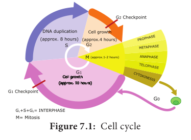

Definition: A series of events leading to the formation of new cell is known as **cell cycle**. The series of events include several phases.
**History Of A Cell**

|**Year**|**Scientist**|**Events**|
|---|---|---|
|1665 | Robert Hooke | Coined word “Cell” |
|1670–74 |Anthony van Leeuwenhoek|First living cells observed in microscope - Structure of bacteria|
|1831–33 |Robert Brown|Presence of nucleus in cells of orchid roots|
|1839 |Jan Evangelista Purkyne (J.E. Purkinje)|Coined “protoplasm”|
|1838–39 |Schleiden & Schwann 1858 Rudolph Ludwig Carl Virchow |Cell theory|
|1858|Rudolph Ludwig Carl Virchow|Cell theory ‘_omnis cellula e cellula’
|1873 |Anton Schneider|_ Described chromosomes (Nuclear filaments) for the first time|
|1882 |Walther Flemming|Coined the word mitosis; chromosome behaviour|
|1883 |Edouard Van Beneden| Cell division in round worm|
|1888 |Theodor Boveri| Centrosome; Chromosome Theory|

### Duration of Cell Cycle

Different kinds of cells have varied duration for cell cycle phases. Eukaryotic cell divides every 24 hours. The cell cycle is divided into mitosis and interphase. In a cell cycle 95% is spent for interphase whereas the mitosis and cytokinesis last only for an hour.

**Table 7.2: Cell cycle of a proliferating human cell**

|**Phase**| **Time duration (in hrs)**|
|---|---|
|G1 |11 |
|S  |8 |
|G2 |4 |
|M | 1 |

The different phases of cell cycle are as follows (Figure 7.1).

### Interphase

Longest part of the cell cycle, but it is of extremely variable length. At first glance the nucleus appears to be resting but this is not the case at all. The chromosomes previously visible as thread like structure, have dispersed. Now they are actively involved in protein synthesis, at least for most of the interphase.

---
C-Value is the amount in picograms of DNA contained within a haploid nucleus.

---

### G1 Phase

The first gap phase – 2C amount of DNA in cells of G1. Cells become metabolically active and grows by producing proteins,lipids, carbohydrates and cell organelles including mitochondria and endoplasmic reticulum. Many checkpoints control the cell cycle. The check point are also called as the **restriction point.** First check point at the end of G1, determines a cells fate whether it will continue in the cell cycle and divide or enter a stage called **G0** a quiescent stage, probably as specified cell or die. Cells are arrested in G1 due to. 
- Nutrient deprivatio. 
- Lack of growth factors or density dependant inhibitio. 
- Undergo metabolic changes and enter into G0 state. 

Biochemicals inside cell activates the cell division. The proteins called kinases and cyclins activate genes and their proteins to perform cell division. Cyclins act as major checkpoint which operates in G1 to determine whether or not a cell divides.

---
**Do You Know ?**
**Dolly** Since the DNA of cells in G0, do not replicate. Researchers are able to fuse the donor cells from a sheep’s mammary glands into G0 state by culturing in the nutrient free state. The G0 donor nucleus synchronised with cytoplasm of the recipient egg, which developed into the clone Dolly.

---

### G0 Phase

Some cells exit G1 and enters a quiescent stage called **G0**, where the cell remains metabolically active without proliferation. Cells can exist for long periods in G0 phase. In G0, cells cease growth with reduced rate of RNA and protein synthesis. The G0 phase is not permanent. Mature neuron and skeletal muscle cell remain permanently in G0. Many cells in animals remains in G0 unless called on to proliferate by appropriate growth  factors or other extracellular signals. G**0** cells are not dormant.

### S phase – Synthesis phase – cells with intermediate amounts of DNA.

Growth of the cell continues as replication of DNA occur, protein molecules called **histones** are synthesised and attach to the DNA. The centrioles duplicate in the cytoplasm. DNA content increases from 2C to 4C.

### G2 – The second Gap phase – 4C amount of DNA in cells of G2 and mitosis

Cell growth continues by protein and cell organelle synthesis, mitochondria and chloroplasts divide. DNA content remains as 4C. Tubulin is synthesised and microtubules are formed. Microtubles organise to form spindle fibre. The spindle begins to form and nuclear division follows.

One of the proteins synthesized only in the G2 period is known as **Maturation Promoting Factor (MPF)**. It brings about condensation of interphase chromosomes into the mitotic form.

DNA damage checkpoints operates in G1 S and G2 phases of the cell cycle. 
