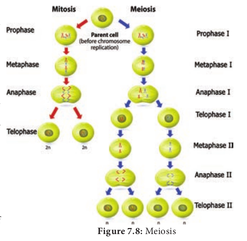

**Table 7.3: Difference between mitosis in Plants and Animals**

|**Plants**|**Animals**|
|---|---|
|Centrioles are absent|Centrioles are present|
|Asters are not formed |Asters are formed |
|Cell division involves the formation of a cell plate|Cell division involves furrowing and cleavage of cytoplasm|
|Occurs mainly at meristem|Occurs in tissues throughout the body|

**Table 7.4: Difference Between Mitosis and Meiosos**
|Mitosis|Meiosos|
|---|---|
|One division| Two division|
|Number of chromosome remain the same|Number of chromosome is halved | 
|Homologous chromosomes line up separately on the metaphase plate|Homologous chromosomes line up in pair at the metaphase plate|
|Homologous chromosome do not pair up|Homologous chromosome pairup to form bivalent| 
|Chiasmata do not form and crossing over never occurs|Chiasmata form and crossing over occurs|
|Daughter cells are genetically identical|Daughter cells are genetically different from parent cell |
|Two daughter cells are formed|four daughter cells are formed|

**Summary**  
