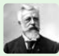

**Nuclear Division** 

There are two types of nuclear division, as **mitosis** and **meiosis**. In mitosis, the daughter cells formed will have the same number of chromosomes as the parent cell, typically diploid (2n) state. Mitosis is the nuclear division that occurs when cells grow or when cells need to be replaced and when organism reproduces asexually.

In meiosis, the daughter cells contain half the number of chromosomes of the parent cell and is known as **haploid state (n)**.

Whichever division takes place, it is normally followed by division of the cytoplasm to form separate cells, called as **cytokinesis**.

---
**Edouard Van Beneden**

a Belgian cytologist, embryologist and marine biologist. He was Professor of Zoology at the University of Liège. He contributed to cytogenetics by his works on the roundworm _Ascaris_. In his work he discovered how chromosomes organized meiosis (the production of gametes).

---
