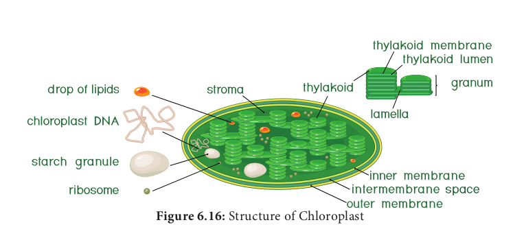
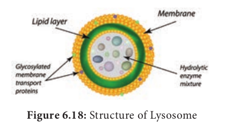
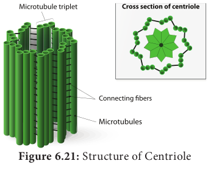

**Endomembrane System**

System of membranes in a eukaryotic cell, comprises the plasma membrane, nuclear membrane, endoplasmic reticulum, golgi apparatus, lysosomes and vacuolar membranes (tonoplast). Endomembranes are made up of phospholipids with embedded proteins that are similar to cell membrane which occur within the cytoplasm. The endomembrane system is evolved from the inward growth of cell membrane in the ancestors of the first eukaryotes (Figure 6.12).

### Endoplasmic Reticulum

The largest of the internal membranes is called the **endoplasmic reticulum** (ER). The name endoplasmic reticulum was given by **K.R. Porter** (1948). It consists of double membrane. Morphologically the structure of endoplasmic reticulum consists of the following:

**1.Cisternae** are long, broad, flat, sac like structures arranged in parallel bundles or stacks to form lamella. The space between membranes of cisternae is filled with fluid.

**2.Vesicles** are oval membrane bound vacuolar structure.

**3.Tubules** are irregular in shape, branched, smooth walled, enclose a space

Endoplasmic reticulum is associated with nuclear membrane and cell surface membrane. It forms a network in cytoplasm and gives mechanical support to the cell. Its chemical environment enables protein folding and undergo modification necessary for their function. Misfolded proteins are pulled out and are degraded in endoplasmic reticulum. When ribosomes are present in the outer surface of the membrane it is called as **rough endoplasmic reticulum(RER)**, when the ribosomes are absent in the endoplasmic reticulum it is called as **smooth Endoplasmic reticulum(SER)**. Rough endoplasmic reticulum is involved in protein synthesis and smooth endoplasmic reticulum are the sites of lipid synthesis. The smooth endoplasmic reticulum contains enzymes that detoxify lipid soluble drugs, certain chemicals and other harmful compounds.

### Golgi Body (Dictyosomes)

In 1898, **Camillo Golgi** visualized a netlike reticulum of fibrils near the nucleus, were named as **Golgi bodies.** In plant cells they are found as smaller vesicles termed as **dictyosomes**. Golgi apparatus is a stack of flat membrane enclosed sacs. It consist of cisternae, tubules, vesicles and golgi vacuoles. In plants, the cisternae are 10-20 in number placed in piles separated from each other by a thin layer of inter cisternal cytoplasm often flat or curved. Peripheral edge of cisternae forms a network of tubules and vesicles.

Tubules interconnect cisternae and are 30-50nm in dimension. Vesicles are large round or concave sac. They are pinched off from the tubules.They are smooth/ secretary or coated type. Golgi vacuoles are large spherical structures filled with granular or amorphous substance, some function like lysosomes. Golgi apparatus compartmentalises a series of steps leading to the production of functional protein.

Small pieces of rough endoplasmic reticulum are pinched off at the ends to form small vesicles. A number of these vesicles then join up and fuse together to make a Golgi body. Golgi complex plays a major role in post translational modification of proteins and glycosylation of lipids (Figure 6.13 and 6.14).

**Functions:** 
- Production of glycoproteins and glycolipid. 
- Transporting and storing of lipids. 
- Formation of lysosomes. 
- Production of digestive enzymes. 
- Cell plate and cell wall formation
- Secretion of carbohydrates for the formation of plant cell walls and insect cuticles.
- **Zymogen granules** (proenzyme/precursor of all enzyme) are synthesised.

### Mitochondria

It was first observed by **A. Kolliker** (1880). **Altmann** (1894) named it as Bioplasts. Later **Benda** (1897, 1898), named as mitochondria. They are ovoid, rounded, rod shape and pleomorphic structures. Mitochondrion consists of double membrane, the outer and inner membrane. The outer membrane is smooth, highly permeable to small molecules and it contains proteins called **Porins**, which form channels that allows free diffusion of molecules smaller than about 1000 daltons and the inner membrane divides mitochondrion into two compartments, outer chamber between two membranes and the inner chamber is filled with matrix.

The inner membrane is convoluted (infoldings), called **crista** (plural: cristae). Cristae contain most of the enzymes for electron transport system. Inner chamber of the mitochondrion is filled with proteinaceous material called **mitochondrial matrix**. The Inner membrane consists of stalked particles called **elementary particles** or **Fernandez Moran particles**, **F1 particles** or **Oxysomes.** Each particle consists of a base, stem and a round head. In the head, ATP synthase is present for oxidative phosphorylation. Inner membrane is impermeable to most ions, small molecules and maintains the proton gradient that drives oxidative phosphorylation (Figure 6.15).

Mitochondria contain 73% of proteins, 25-30% of lipids, 5-7 % of RNA, DNA (in traces) and enzymes (about 60 types). Mitochondria are called **Power house of a cell**, as they produce energy rich ATP.

All the enzymes of Kreb’s cycle are found in the matrix except succinate dehydrogenase. Mitochondria consist of circular DNA and 70S ribosome. They multiply by fission and replicates by strand displacement model. Because of the presence of DNAs it is semi- autonomous organelle. Unique characteristic of mitochondria is that they are inherited from female parent only. Mitochondrial DNA comparisons are used to trace human origins. It is also used to track and date recent evolutionary time because it mutates 5 to 10 time faster than DNA in the nucleus.

### Plastids

The term plastid is derived from the Greek word **_Platikas_** (formed/moulded) and used by **A.F.U. Schimper** in 1885. He classified plastids into following types according to their structure, pigments and function. Plastids multiply by fission.

**Plastids** 
|**Chromoplasts**|**Leucoplasts**|
|---|---|
|Coloured Plastids|Colourless plastids store food materials|  
|**Chloroplast** Occurs in green algae and higher plants. Pigments chlorophyll _a_ and _b_|**Amyloplast** – stores – starch|
|**Phaeoplast** Brown algae and dinoflagellates. Pigment- fucoxanthin|**Elaioplast** – store – lipids (oils). Seed of monocot and dicots.|
|**Rhodoplast** Red algae Pigment- Phycoerythrin|**Aleuroplast** (or) **Proteoplast** Stores – Protein|

According to Schimper, different kind of plastids can transform into one another.

### Chloroplast

Chloroplasts are vital organelle found in green plants. Chloroplast has a double membrane the outer membrane and the inner membrane separated by a space called **periplastidial space**. The space enclosed by the inner membrane of chloroplast is filled with gelatinous matrix, lipo-proteinaceous fluid called **stroma**. Inside the stroma there are flat interconnected sacs called **thylakoid**. The membrane of thylakoid enclose a space called **thylakoid lumen**.  

**Grana** (singular: Granum) are formed when many of these thylakoids are stacked together like pile of coins. Light is absorbed and converted into chemical energy in the granum, which is used in stroma to prepare carbohydrates. Thylakoid contain chlorophyll pigments. The chloroplast contains osmophilic granules, 70s ribosomes, DNA (circular and non histone) and RNA. These chloroplast genome encodes approximately 30 proteins involved in photosynthesis including the components of photosystem I & II, cytochrome bf complex and ATP synthase. One of the subunits of RuBisco is encoded by chloroplast DNA. It is the major protein component of chloroplast stroma, single most abundant protein on earth. The thylakoid contain small, rounded photosynthetic units called **quantosomes**. Chloroplast is a semi-autonomous organelle and divides by fission (Figure 6.16).

**Functions:** 
- Photosynthesi. 
- Light reactions takes place in granum. 
- Dark reactions take place in stroma. 
- Chloroplast is involved in photo-respiration.

### Ribosome

Ribosomes were first observed by **George Palade** (1953) as dense particles or granules in the electron microscope. Electron microscopic observation reveals that ribosomes are composed of two rounded sub units, united together to form a complete unit. Mg2+ is required for structural cohesion of ribosomes. Biogenesis of ribosome is a _de nova_ formation, auto replication and nucleolar origin. Each ribosome is made up of one small and one large sub-unit Ribosomes are the sites of protein synthesis in the cell. Ribosome is not a membrane bound organelle (Figure 6.17).

---
**Do You Know ?**
**Svedberg unit (s).** The size of ribosomes and their subunits are usually given in Svedberg unit (named after Theoder Svedberg, Swedish Chemist Noble Laureate 1929), a measure of a particle size dependent on the speed with which particle sediment in the ultracentrifuge.

---
Ribosome consists of RNA and protein: RNA 60 % and protein 40%. During protein synthesis, many ribosomes are attached to the single mRNA and is called **polysomes** or **polyribosomes**. The function of polysomes is the formation of several copies of a particular polypeptide during protein synthesis. They are free in non-protein synthesising cells. In protein synthesising cells they are linked together with the help of Mg ^2+ ions.

**Types of Ribosomes**
|70S Ribosomes (sub unit 30S and 50S)|80S Ribosomes (sub units 40S and 60S)|
|---|---|
|3 RNA molecule (i) 16SrRNA in 30S subunit (ii) 23S and 5S in 50S large subunit **(Prokaryotic cells of bluegreen , algae bacteria, mitochondria and chloroplast of many algae and higher plants)**|4 RNA molecule (i) 18SrRNA in 40S small subunit (ii) 28S, 5.8S and 5S in larger 60S subunit **(Eukaryotic cells of plants and animals)**|

### Lysosomes (Suicidal Bags of Cell)

Lysosomes were discovered by **Christian de Duve** (1953), these are known as **suicidal bags**. They are spherical bodies enclosed by a single unit membrane. They are found in eukaryotic cell. Lysosomes are small vacuoles formed when small pieces of golgi body are pinched off from its tubules.

They contain a variety of hydrolytic enzymes, that can digest material within the cell. The membrane around lysosome prevent these enzymes from digesting the cell itself (Figure 6.18).

**Functions :**

- **Intracellular digestion:** They digest carbohydrates, proteins and lipids present in cytoplasm.

- **Autophagy:** During adverse condition they digest their own cell organelles like mitochondria and endoplasmic reticulum

- **Autolysis:** Lysosome causes self destruction of cell.

- **Ageing:** Lysosomes have autolytic enzymes that disrupts intracellular molecules.

- **Phagocytosis:** Large cells or contents are engulfed and digested by macrophages, thus forming a phagosome in cytoplasm. These phagosome fuse with lysosome for further digestion.

- **Exocytosis:** Lysosomes release their enzymes outside the cell to digest other cells (Figure 6.19).  

### Microbodies
 Eukaryotic cells contain many enzyme bearing membrane enclosed vesicles called **microbodies**. They are single unit membrane bound cell organelles. Example: Peroxisomes and glyoxysomes.

### Peroxisomes

**Structure of Peroxisome** Peroxisomes were identified as organelles by **Christian de Duve** (1967). Peroxisomes are small spherical bodies and single membrane bound organelle. It takes part in photorespiration and associated with glycolate metabolism. In plants, leaf cells have many peroxisomes. It is also commonly found in liver and kidney of mammals. These are also found in cells of protozoa and yeast (Figure 6.20). 

### Glyoxysomes

Glyoxysome was discovered by **Harry Beevers** (1961). It is a single membrane bound organelle. It is a sub cellular organelle and contains enzymes of glyoxylate pathway. β-oxidation of fatty acid occurs in glyoxysomes of germinating seeds Example: Castor seeds. 

### Sphaerosomes

It is spherical in shape and enclosed by single unit membrane. Example: Storage of fat in the endosperm cells of oil seeds. 

### Centrioles

Centrioles consists of nine triplet peripheral fibrils made up of tubulin. The central part of the centriole is called **hub**, is connected to the tubules of the peripheral triplets by radial spokes (9+0 pattern). The centriole form the basal body of cilia or flagella and spindle fibers which forms the spindle apparatus in animal cells. The membrane is absent in centriole (non-membranous organelle) (Figure 6.21).

### Vacuoles

In plant cells vacuoles are large, bounded by a single unit membrane called **Tonoplast**. The Vacuoles contain cell sap, which is a solution of sugars, amino acids, mineral salts, waste chemical and anthocyanin pigments. Beetroot cells contain anthocyanin pigments in their vacuoles. Vacuoles accumulate products like tannins. The osmotic expansion of a cell kept in water is chiefly regulated by vacuole and the water enters the vacuole by osmosis.

The major function of plant vacuole is to maintain water pressure known as **turgor pressure**, which maintains the plant structure. Vacuoles organises itself into a storage/ sequestration compartment. Example: Vacuoles store, most of the sucrose of the cell.

i. Sugar in Sugar beet and Sugar cane. ii. Malic acid in Apple.
iii. Acids in Citrus fruits. 
iv. Flavonoid pigment cyanidin 3 rutinoside in the petals of _Antirrhinum_. 
