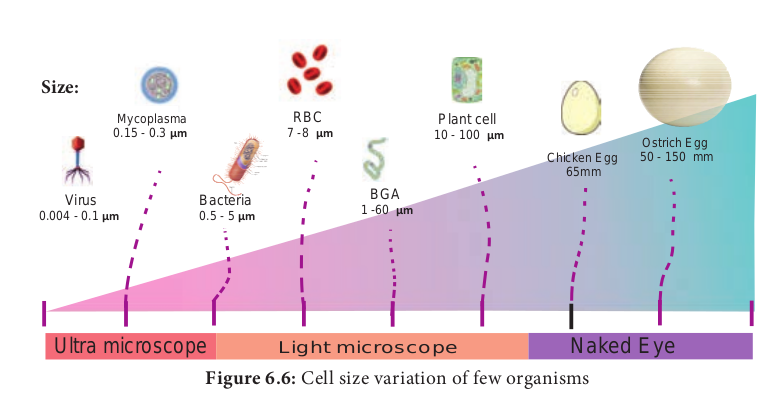

In 1833, German botanist **Matthias Schleiden** and German zoologist **Theodor Schwann** proposed that all plants and animals are composed of cells and that cells were the basic building blocks of life.

---
**Do You Know ?**
**Microscopic measurement** The microscope also has to measure microscopic through a technique ‘**micrometry**’. There are two Scales involved for measuring. 
1. Ocular Micrometre 
2. Stage Micrometre 

**Ocular Micrometre:** 

It is fixed inside the eye p It is a thin transparent glass disc where there divided into 100 equal units. The scale has no values 

**Stage Micrometre:**This is a slide with a line into 100 units. The line is about 10mm. The between two adjacent lines is 10 µm. The value of the stage micrometre is transferre measurement can be made using ocular mi The distance between two adjacent line of ocular meter = ( Number of stage divisions / Number of ocular divisions ) * 10 

---

These observations led to the formulation of modern cell theory.

- All organisms are made up of cells. 
- New cells are formed by the division of pre-existing cells. 
- Cells contains genetic material, which is passed on from parents to daughter cells. 
- All metabolic reactions take place inside the cells. 

### Exception to Cell Theory

Viruses are puzzle in biology. Viruses, viroids and prions are the exception to cell theory. They lack protoplasm, the essential part of the cell and exists as obligate parasites which are sub-cellular in nature.

### Protoplasm Theory 

**Corti** first observed protoplasm. **Felix Dujardin** (1835) observed a living juice in animal cell and called it “**Sarcode**”. **Purkinje** (1839) coined the term protoplasm for sap inside a plant cell. **Hugo Van Mohl** (1846) indicated importance of protoplasm.  

**Max Schultze** (1861) established similarity between Protoplasm and Sarcode and proposed a theory which later on called “**Protoplasm Theory**” by **O. Hertwig** (1892). **Huxley** (1868) proposed Protoplasm as a “**physical basis of life**”. 

**Protoplasm as a Colloidal System** 

Protoplasm is a complex colloidal system which was suggested by **Fisher** in 1894 and **Hardy** in 1899. It is primarily made of water and various other solutes of biological importance such as glucose, fatty acids, amino acids, minerals, vitamins, hormones and enzymes.

These solutes may be homogeneous (soluble in water) or heterogeneous mass (insoluble in water) which forms the basis for its colloidal nature.

**Physical Properties of Protoplasm** 

The protoplasm exists either in semisolid (jelly-like) state called ‘**gel**᾿ due to suspended particles and various chemical bonds or may be liquid state called ‘sol᾿.The colloidal protoplasm which is in gel form can change into sol form by **solation** and the sol can change into gel by gelation. These gel-sol conditions of colloidal system are prime basis for mechanical behaviour of cytoplasm. 

1. Protoplasm is translucent, odourless and polyphasic fluid. 
2. It is a crystal colloid solution which is a mixture of chemical substances forming crystalloid i.e. true solution (sugars, salts, acids, bases) and others forming colloidal solution (Proteins and lipids)
3. It is the most important property of the protoplasm by which it exhibits three main phenomena namely Brownian movement, amoeboid movement and cytoplasmic streaming or cyclosis. Viscosity of protoplasm is 2–20 centipoises. The Refractive index of the protoplasm is 1.4.
4. The pH of the protoplasm is around 6.8, contain 90% water (10% in dormant seeds)
5. Approximately 34 elements are present in protoplasm but only 13 elements are main or universal elements i.e. C, H, O, N, Cl, Ca, P, Na, K, S, Mg, I and Fe. Carbon, Hydrogen, Oxygen and Nitrogen form the 96% of protoplasm.
6. Protoplasm is neither a good nor a bad conductor of electricity. It forms a delimiting membrane in contact with water and solidifies when heated.
7. **Cohesiveness:** Particles or molecules of protoplasm are adhered with each other forces, such as **Van der** **Waal’s bonds**, that hold long chains of molecules together. This property varies with the strength of these forces.
8. **Contractility:** The contractility of proto- plasm is important for the absorption and removal of water especially for stomatal operations.
9. **Surface tension:** The proteins and lipids of the protoplasm have less surface tension, hence they are found at the surface forming the membrane. On the other hand the chemical substances (NaCl) have high surface tension, so they occur in deeper parts of the protoplasm.

### Cell sizes and shapes

Cell greatly vary in size, shape and also in function. Group of cells with similar structures are called **tissue** they integrate together to perform similar function, group of tissue join together to perform similar function called **organ**, group of organs with related function called **organ system**, organ system coordinating together to form an **organism**.

**Shape** The shape of cell vary greatly from organism to organism and within the organism itself. In bacteria, cell shape vary from round (**cocci**) to rectangular (**rod**). In virus, shape of the envelope varies from round to hexagonal or ‘**T**’ shaped. In fungi, globular to elongated cylindrical cells and the spores of fungi vary

---
1 cm                        = 1 / 100 meter 
1 mm = 1 / 10 cm            = 1/10 cm
1 µm = 1/1000,000 metre     = 1/10,000 cm
1 nm = 1/1,000,000,000 metre = 1/10,000,000 cm
1 Aº = 1/10,000,000,000 metre =1/100,000,000 cm

1 m = 10 ^2 cm = 10^3 mm = 10^6 µm = 10^9 nm = 10^10 Aº
m = metre   cm = centimetre   mm = millimetre   µm = micrometre
nm = nanometre   Aº =Angstrom

---

greatly in shape. In plants and animals cells vary in shape according to cell types such as parenchyma, mesophyll, palisade, tracheid, fiber, epithelium and others (Figure 6.6).

