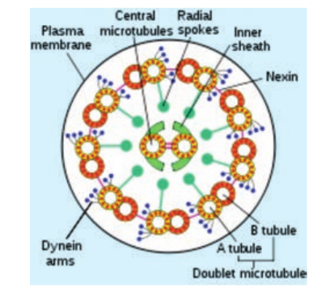
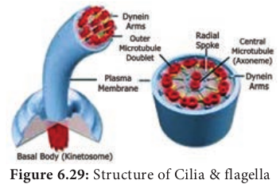

**6.8.1 Prokaryotic Flagellum** 
Bacterial flagella are helical appendages helps in motility. They are much thinner than flagella or cilia of eukaryotes. The filament contains a protein called **flagellin**. The structure consists of a basal body associated with cytoplasmic membrane and cell wall with short hook and helical filament. Bacteria rotates their helical flagella and propels rings present in the basal body which are involved in the rotary motor that spins the flagellum.

---
**Check your grasp ?** When E.coli are cultured in medium rich in glucose they lack flagella. When grown in nutritionally poor medium they possess flagella. What does this indicate about the value of flagella?

Flagella is essential to seek out a nutritionally more favourable environment.

---
**Structure of flagella in Bacteria** 
The gram positive bacteria contain only two basal rings. S-ring is attached to the inside of peptidoglycan and M-ring is attached to the cell membrane. In Gram negative bacteria two pairs of rings proximal and distal ring are connected by a central rod. They are L-Lipopolysaccharide ring, P-Peptidoglycan ring, S-Super membrane ring and M-membrane ring. The outer pair L and P rings is attached to cell wall and the inner pair S and M rings attached to cell membrane (Figure 6.27).

**Mechanism of flagellar movement – proton motive force** 

In flagellar rotation only proton movements are involved and not ATP. Protons flowing back into the cell through the basal body rings of each flagellum drives it to rotate. These rings constitute the rotary motor.The proton motive force (The force derived from the electrical potential and the hydrogen ion gradient across the cytoplasmic membrane) drives the flagellar motor. For the rotation of flagellum the energy is derived from proton gradient across the plasma membrane generated by oxidative phosphorylation. In bacteria flagellar motor is located in the plasma membrane where the oxidative phosphorylation takes place.Therefore, plasma membrane is a site of generation of proton motive force.

### Eukaryotic Flagellum– Cell Motility 
**Structure** 
**Eukaryotic Flagella** are enclosed by unit membrane and it arises from a basal body. Flagella is composed of outer nine pairs of microtubules with two microtubules in its centre (9+2 arrangement). Flagella are microtubule projection of the plasma membrane. Flagellum is longer than cilium (as long as 200µm). The structure of flagellum has an axoneme made up microtubules and protein tubulin (Figure 6.28).

**Movement** 

Outer microtubule doublet is associated with axonemal dynein which generates force for movement. The movement is ATP driven. The interaction between tubulin and dynein is the mechanism for the contraction of cilia and flagella. Dynein molecules uses energy from ATP to shift the adjacent microtubules. This movement bends the cilium or flagellum. 

### Cilia

Cilia (plural) are short cellular, numerous microtubule bound projections of plasma membrane. Cilium (singular) is membrane bound structure made up of basal body, rootlets, basal plate and shaft. The shaft or **axoneme** consists of nine pairs of microtubule doublets, arranged in a circle along the periphery with a two central tubules, (**9+2**) arrangement of microtubules is present. Microtubules are made up of tubulin. The motor protein **dynein** connects the outer microtubule pair and links them to the central pair. Nexin links the peripheral doublets of microtubules (Figure 6.29).

**Summary**
 Cell is the fundamental unit of all organisms which was identified 300 years ago. Microscope offers scope for observing smaller objects and organisms. It works on the principle of light and lenses. Different microscope offers clarity in observing objects depending on the features to be observed. Micrometric techniques are used in measurement of microscopic objects. Electron microscopes are used in understanding the ultra-structural details of cell. Cell theory and doctrine states that all organism are made up of cell and it contains genetic material. Protoplasm theory explains nature and different properties of protoplasm. Cell size and shape differ from type of tissue or organs and organisms. Based on cellular organization and nuclear characters the organisms are classified into prokaryote, eukaryote and mesokaryote.

Key difference between plant cell and animal cell is the cell wall. Protoplasm is the colourless mass includes the cytoplasm, cell organelles and nucleus. Cell wall is the outermost protective covering with three regions primary, secondary wall and middle lamellae. Cell membrane holds the cytoplasmic content called **cytosol**. Cytoplasm includes the matrix and the cell organelles excluding nucleus. Endomembrane system includes endoplasmic reticulum, golgi apparatus, chloroplast, lysosomes, vacuoles, nuclear membrane and plasma membrane. Nucleus is the control unit of the cell, it carries hereditary information. Chromosomes are made up of DNA and associated proteins. Bacterial flagella are made up of helical polymers of a protein called **flagellin**. Proton motive force are involved in flagellar rotation. In Eukaryotes

**Concept Map Cell**
