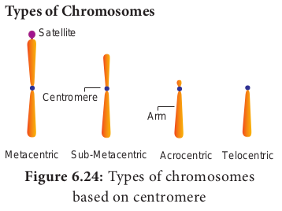

### Nucleus
Nucleus is an important unit of cell which controls all activities of the cell. Nucleus holds the hereditary information. It is the largest among all cell organelles. It may be spherical, cuboidal, ellipsoidal or discoidal.

It is surrounded by a double membrane structure called **nuclear envelope**, which has the inner and outer membrane. The inner membrane is smooth without ribosomes and the outer membrane is rough by the presence of ribosomes and it continues with irregular and infrequent intervals with the endoplasmic reticulum. The membrane is perforated by pores known as **nuclear pores** which allows materials such as mRNA, ribosomal units, proteins and other macromolecules to pass in and out of the nucleus. The pores enclosed by circular structures called **annuli**. The pore and annuli form the **pore complex**. The space between two membranes is called **perinuclear space**.

---
**Do You Know ?**
**Chromatin** is a viscous gelatinous substance that contains DNA, histone & non–histone proteins and RNA. H1, H2A, H2B, H3 and H4 are the different histones found in chromatin. It is formed by a series of repeated units called nucleosomes. Each nucleosome has a core of eight histone subunits.

---
Nuclear space is filled with **nucleoplasm**, a gelatinous matrix has uncondensed **chromatin** network and a conspicuous **nucleolius**. The Chromatin network is an uncoiled, indistinct and remain thread like during the interphase. It has little amount of RNA and DNA bound to histone proteins in eukaryotic cells (Figure 6.22).

During cell division chromatin is condensed into an organized form called **chromosome**. The portion an eukaryotic chromosome which is transcribed into mRNA contains active genes that are nottightly condensed during interphase is called **Euchromatin**. The portion of an eukaryotic chromosome that is not transcribed into mRNA which remains condensed during interphase and stains intensely is called **Heterochromatin. Nucleolus** is a small, dense, spherical structure either present singly or in multiples inside the nucleus and it’s not membrane bound. Nucleoli possess genes for rRNA and tRNA. 

**Functions of the nucleus** 

- Controlling all cellular activitie. 
- Storing the genetic or hereditary information. 
- Coding the information from DNA for the production of enzymes and proteins. 
- DNA duplication and transcription takes place in the nucleus. 
- In nucleolus ribosomal biogenesis takes place.

### Chromosomes 

**Strasburger** (1875) first reported its present in eukaryotic cell and the term ‘chromosome’ was introduced by **Waldeyer** in 1888. **Bridges** (1916) first proved that chromosomes are the physical carriers of genes. It is made up of DNA and associated proteins. 

**Structure of chromosome** 

The chromosomes are composed of thread like strands called **chromatin** which is made up of DNA, protein and RNA. Each chromosome consists of two symmetrical structures called **chromatids**. During cell division the chromatids forms a well organized chromosomes with definite size and shape. They are identical and are called **sister chromatids**. A typical chromosome has narrow zones called **constrictions**. There are two types of constrictions, namely primary constriction and secondary constriction. The **primary constriction** is made up of **centromere** and kinetochore. Both the chromatids are united at centromere, whose number varies. The **monocentric** chromosome has one centromere and the **polycentric** chromosome has many centromeres. Centromere contains a complex system of protein fibres called **kinetochore**. Kinetochore is the region of chromosome which is attached to the spindle fibre during mitosis.

Besides primary there are few **secondary constrictions,** are present. Nucleoli develop from these secondary constrictions are called **nucleolar organizers**. Secondary constrictions contain the genes for ribosomal RNA which induce the formation of nucleoli and are called **nucleolar organizer regions** (Figure 6.23).

A **satellite** or SAT Chromosome is a short chromosomal segment or rounded

body separated from main chromosome by a relatively elongated secondary constriction. It is a morphological entity in certain chromosomes.

**Telomere** is the terminal part of chromosome. It offers stability to the chromosome. DNA of the telomere has specific sequence of nucleotides. Telomere in all eukaryotes are composed of many repeats of short DNA sequences (**5’TTAGGG3’** sequence in _Neurospora crassa_ and human beings). Maintenance of telomeres appears to be an important factor in determining the life span and reproductive capacity of cells, so studies of telomeres and telomerase have the promise of providing new insights into conditions such as ageing and cancer. Telomeres prevent the fusion of chromosomal ends with one another.

---
**Chromonema fibre**: A chromatin fibre, 100 – 130 nm in diameter, an element of higher order packing within the chromosome. During prophase the chromosomal material becomes visible as very thin filament called chromonemata, which is called as chromatids in early stages of condensation. Chromatid and chromonema are the two names for the same structure a single linear DNA molecule with its associated proteins

**Chromomeres**: Chromomeres are bead like accumulations of chromatin material which are visible along interphase chromosomes. They can be seen in polytene chromosomes. At metaphase they are not visible.

---
**Types of Chromosomes**

Based on the position of centromere, chromosomes are called **telocentric** (terminal centromere), **acrocentric** (terminal centromere capped by telomere), **sub metacentric** (centromere subterminal) and **metacentric** (centromere median). The eukaryotic chromosome may be rod shaped (telocentric and acrocentric), L-shaped (sub-metacentric) and V-shaped (metacentric) (Figure 6.24).

Based on the functions of chromosome it can be divided into **autosomes** and **sex chromosomes**. 

Autosomes are present in all cells controlling somatic characteristics of an organism. In human diploid cell, 44 chromosomes are autosomes whereas two are sex chromosomes. Sex chromosomes are involved in the determination of sex. 

**Special types of chromosomes**

These chromosomes are larger in size and are called **giant chromosomes** in certain plants and they are found in the suspensors of the embryo. The polytene chromosome and lamp brush chromosome occur in animals and are also called as **giant chromosomes.**

**Polytene chromosomes** observed in the salivary glands of Drosophila (fruit fly) by **E.G. Balbiani** in 1881. In larvae of many flies, midges (_Dipthera_) and some insects the interphase chromosomes duplicates and reduplicates without nuclear division. A single chromosome which is present in multiple copies form a structure called **polytene chromosome** which can be seen in light microscope. They are genetically active. There is a distinct alternating dark bands and light inter-bands. About 95% of DNA are present in bands and 5% in inter-bands. The polytene chromosome has extremely large puff called **Balbiani rings** which is seen in Chironomous larvae. It is also known as **chromosomal puff**. Puffing of bands are the sites of intense RNA synthesis. As this chromosome occurs in the salivary gland it is known as **salivary gland chromosomes**. Gene expression, transcription of genes and RNA synthesis occurs in the bands along the polytene chromosomes.

**Lampbrush chromosomes** occur at the diplotene stage of first meiotic prophase in oocytes of an animal **Salamandar** and in giant nucleus of the unicellular alga _Acetabularia_. It was first observed by **Flemming** in 1882. The highly condensed chromosome forms the chromosomal axis, from which lateral loops of DNA extend as a result of intense RNA synthesis.

