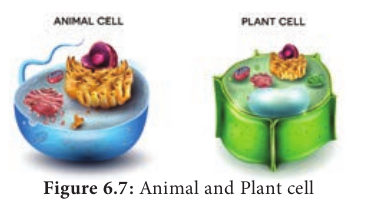
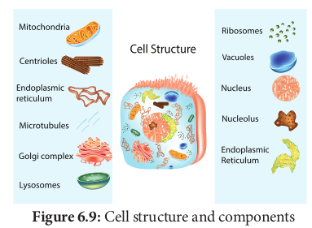
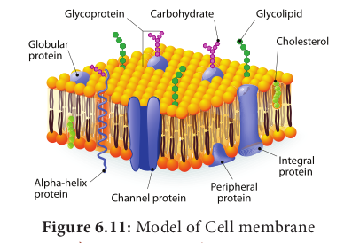

### Plant and Animal cell

**6.5.1 Ultra Structure of an Eukaryotic Cell** 

An eukaryotic cell is highly distinct in its organisation. It shows several variations in different organisms. For instance, eukaryotic cells in plants and animals vary greatly (Figure 6.7).

**Animal Cell** Animal cells are surrounded by cell membrane or plasma membrane. Inside this membrane a gelatinous matrix called **protoplasm** is seen to contain nucleus and other organelles which include the endoplasmic reticulum, mitochondria, golgi bodies, centrioles, lysosomes, ribosomes and cytoskeleton.

**Plant cell** 

A typical plant cell has prominent cell wall, a large central vacuole and plastids in addition to other organelles present in animal cell (Figure 6.8).

**Protoplasm**

Protoplasm is the living content of cell that is surrounded by plasma membrane. It is a colourless material that exists throughout the cell together with cytoplasm, nucleus and other organelles. Protoplasm is composed of a mixture of small particles, 

**Difference between plant and animal cell**

|**S. No** | **Plant cell**| **animal cell**|
|---|---|---|
|1 | Usually they are larger than animal cell |Usually smaller than plant cells |
|2 | Cell wall present in addition to plasma membrane and consists of mid lamellae, primary and secondary walls|Cell wall absent |
|3 |Plasmodesmata present |Plasmodesmata absent |
|4 |Chloroplast present |Chloroplast absent |
|5 |Vacuole large and permanent |Vacuole small and temporary |
|6 |Tonoplast present around vacuole|Tonoplast absent |
|7 |Centrioles absent except motile cells lower plants| Centrioles present |
|8 |Nucleus present along the periphery the cell | Nucleus at the centre of the cell |
|9 |Lysosomes are rare|Lysosomes present |
|10 |Storage material is starch grains|Storage material is a glycogen granules |

such asions, amino acids, monosaccharides, water, macromolecules like nucleic acids, proteins, lipids and polysaccharides. It appears colourless, jelly like gelatinous, viscous elastic and granular. It appears foamy due to the presence of large number of vacuoles. It responds to the stimuli like heat, electric shock, chemicals and so on.

### Cell Wall

Cell wall is the outermost protective cover of the cell. It is present in bacteria, fungi and plants whereas it is absent in animal cell. It was first observed by **Robert Hooke**. It is an actively growing portion. It is made up of different complex material in various organism. In bacteria it is composed of peptidoglycan, in fungi chitin and fungal cellulose, in algae cellulose, galactans and mannans. In plants it is made up of cellulose, hemicellulose, pectin, lignin, cutin, suberin and silica.

In plant, cell wall shows three distinct regions (a) Primary wall (b) Secondary wall (c) Middle lamellae (Figure 6.10).

**a. Primary wall** It is the first layer inner to middle lamella, primarily consisting of loose network of cellulose microfibrils in a gel matrix. It is thin, elastic and extensible.In most plants the microfibrils are made up of cellulose oriented differently based on shape and thickness of the wall. The matrix of the primary wall is composed of hemicellulose, pectin, glycoprotein and water. Hemicellulose binds the microfibrils with matrix and glycoproteins control the orientation of microfibrils while pectin serves as filling material of the matrix. Cells such as parenchyma and meristems have only primary wall.  

**b. Secondary wall** Secondary wall is laid during maturation of the cell. It plays a key role in determining the shape of a cell. It is thick, inelastic and is made up of cellulose and lignin. The secondary wall is divided into three sublayers termed as S1, S2 and S3 where the cellulose microfibrils are compactly arranged with different orientation forming a laminated structure and the cell wall strength is increased.

**c. Middle lamellae** It is the outermost layer made up of calcium and magnesium pectate, deposited at the time of cytokinesis. It is a thin amorphous layer which cements two adjacent cells. It is optically inactive (isotropic).

**Plasmodesmata and Pits** 
Plasmodesmata act as a channel between the protoplasm of adjacent cells through which many substances pass through. Moreover, at few regions, the secondary wall layer is laid unevenly whereas the primary wall and middle lamellae are laid continuously such regions are called pits. The Pits of adjacent cells are opposite to each other. Each pit has a pit chamber and a pit membrane. The pit membrane has many minute pores and thus they are permeable. The pits are of two types namely simple and bordered pit.
 

**Functions of cell wall** 

The cell wall plays a vital role in holding several important functions given below 

1. Offers definite shape and rigidity to the cell. 
2. Serves as barrier for several molecules to enter the cells. 
3. Provides protection to the internal protoplasm against mechanical injury. 
4. Prevents the bursting of cells by maintaining the osmotic pressure. 
5. Plays a major role by acting as a mechanism of defense for the cells.

### Cell Membrane

The cell membrane is also called **cell surface** (or) **plasma membrane**. It is a thin structure which holds the cytoplasmic content called ‘**cytosol**’. It is extremely thin (less than 10nm).

**Fluid Mosaic Model** 
**Jonathan Singer** and **Garth Nicolson** (1972) proposed fluid mosaic model.

It is made up of lipids and proteins together with a little amount of carbohydrate. The lipid membrane is made up of phospholipid. The phospholipid molecule has a hydrophobic tail and hydrophilic head. The hydrophobic tail repels water and hydrophilic head attracts water. The proteins of the membrane are globular proteins which are found intermingled between the lipid bilayer most of which are projecting beyond the lipid bilayer. These proteins are called as **integral proteins**. Few are superficially attached on either surface of the lipid bilayer which are called as **peripheral proteins**. The proteins are involved in transport of molecules across the membranes and also act as enzymes, receptors (or) antigens.

---
**DO YOU KNOW ?**

Water-loving polar molecule are called hydrophilic molecule. They have polar phosphate group responsible for attracting water.

Water hating non-polar molecule are called as hydrophobic molecule. They have fatty acid which is non-polar which cannot attract water

---
Carbohydrate molecules of cell membrane are short chain polysaccharides. These are either bound with ‘**glycoproteins**’ or ‘**glycolipids**’ and form a ‘**glyocalyx’** (Figure 6.11). 

The movement of membrane lipids from one side of the membrane to the other side by vertical movement is called **flip flopping** or **flip flop** movement. This movement takes place more slowly than lateral diffusion of lipid molecule. The Phospholipids can have flip flop movement because they have smaller polar regions, whereas the proteins cannot flip flop because the polar region is extensive.  

**Function of Cell Membrane** 

The functions of the cell membrane is enormous which includes cell signalling, transporting nutrients and water, preventing unwanted substances entering into the cell, and so on.

**Cytoplasm** 

Cytoplasm is the main arena of various activities of a cell. It is the semifluid gelatinous substance that fills the cell. It is made up of eighty percent water and is usually clear and colourless. The cytoplasm is sometimes described as non nuclear content of protoplasm. The cytoplasm serves as a molecular soup where all the cellular organelles are suspended and bound together by a lipid bilayer plasma membrane. It constitutes dissolved nutrients, numerous salts and acids to dissolve waste products. It is a very good conductor of electricity. It gives support and protection to the cell organelles. It helps movement of the cellular materials around the cell through a process called **cytoplasmic streaming**. Further, most cellular activities such as many metabolic pathways including glycolysis and cell division occur in cytoplasm.
