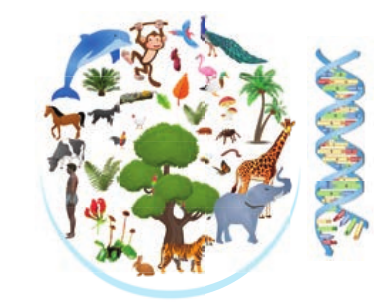

The learner will be able to,

- Differentiate living and non-living things.
- Appreciate the attributes of living organisms.
- Compare the different classifications proposed by biologists.
- Recognize the general characters,structure and reproduction of Bacteria.
- Identify the characteristic features of Archaebacteria, Cyanobacteria, Mycoplasma and Actinomycetes.
- Describe the characteristic features of fungi.
- Outline the classification of fungi.
- Describe the structure and reproduction in Agaricus.
- Discuss the structure and uses of Mycorrhizae and Lichens.

Earth was formed some 4.6 billion years ago. It is the life supporting planet with land forms like mountains, plateaus, glaciers, etc. Life on earth exists within a complex structure called **biosphere**. There exist many mysteries and wonders in the living world some are not visible but the activity of some capture the attention of all. For example the response of sun flower to the sunlight, the twinkling firefly in the dark forest, the rolling water droplets on the surface of lotus leaf, the closure of the leaf of venus fly trap on insect touch and a squid squeezing ink to escape from its predator. From this it is clear that the wonder planet earth harbours both landforms and life forms. Have you thought of DNA molecule? It is essential for the regulation of life and is made up of carbon, hydrogen, oxygen, nitrogen and phosphorus. thus nonliving and living things exist together to make our planet unique.

According to a survey made by Mora _et al.,_ 2011 the number of estimated species on earth is 8.7 million. The living world includes microbes, plants, animals and human beings which possess unique and distinct characteristic feature.
