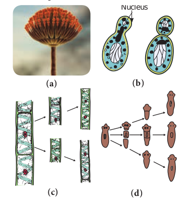
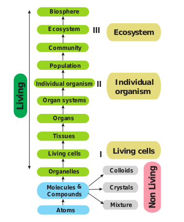

The attributes of living organisms are given below and is represented in Figure 1.1.

**Growth**
Growth is an intrinsic property of all living organisms through which they can increase cells both in number and mass. Unicellular and multicellular organisms grow by cell division. In plants, growth is indefinite and occurs throughout their life. In animals, growth is definite and occurs for some period. Growth in non-living objects is **extrinsic**. Mountains, boulders and sand mounds grow by simple aggregation of material on the surface. Living cells grow by the addition of new protoplasm within the cells. Therefore, growth in living thing is **intrinsic**. In unicellular organisms like Bacteria and Amoeba growth occurs by cell division and such cell division also leads to the growth of their population. Hence, growth and reproduction are mutually inclusive events.

**Cellular structure**
All living organisms are made up of cells which may be prokaryotic or eukaryotic. **Prokaryotes** are unicellular, lack membrane bound nuclei and organelles like mitochondria, endoplasmic reticulum, golgi bodies and so on (Example: Bacteria and Blue green algae). In **Eukaryotes** a definite nucleus and membrane bound organelles are present. Eukaryotes may be unicellular (_Amoeba_) or multicellular (_Oedogonium_).

**Reproduction**
Reproduction is one of the fundamental characteristic features of living organisms. It is the tendency of a living organism to perpetuate its own species. There are two types of reproduction namely asexual and sexual (Figure 1.2).

**Figure 1.2:** Types of Asexual Reproduction (a) Conidia formation-_Penicillium_, (b) Budding-Yeast, (c) Fragmentation- _Spirogyra,_ (d) Regeneration-_Planaria_ Asexual reproduction refers to the production of the progeny possessing features more or less similar to those of parents. The sexual reproduction brings out variation through **recombination.** Asexual reproduction in living organisms occurs by the production of conidia (_Aspergillus, Penicillium_), budding (_Hydra_ and Yeast), binary fission (Bacteria and _Amoeba_) fragmentation (_Spirogyra_), protonema (Mosses) and regeneration (_Planaria_). Exceptions are the sterile worker bees and mules.

**Response to stimuli**
All organisms are capable of sensing their environment and respond to various physical, chemical and biological stimuli. Animals sense their surroundings by sense organs. This is called **Consciousness**. Plants also respond to the stimuli. Bending of plants towards sunlight, the closure of leaves in touch-me-not plant to touch are some examples for response to stimuli in plants. This type of response is called **Irritability.**

**Homeostasis**
Property of self-regulation and tendency to maintain a steady state within an external environment which is liable to change is called **Homeostasis**. It is essential for the living organism to maintain internal condition to survive in the environment.

**Metabolism**
The sum of all the chemical reactions taking place in a cell of living organism is called **metabolism**. It is broadly divided into **anabolism** and **catabolism.** The difference between anabolism and catabolism is given in Table 1.1.

**Table 1.1: Difference between anabolism and catabolism**
|**Anabolism** | **Catabolism**|
|--------------|---------------|
|Building up process | Breaking down process|
|Smaller molecules combine together to form larger molecule|Larger molecule break into smaller units|
|Chemical energy is formed and stored|The stored chemical energy is released and used|
|Example: Synthesis of proteins from amino acids|Example: Breaking down of glucose to CO2 and water|

Movement, Nutrition, Respiration and Excretion are also considered as the property of living things. The levels of organization in living organism begin with atoms and end in **Biosphere**. Each level cannot exist in isolation instead they form levels of integration as given in Figure 1.3.

**Figure 1.3:** The levels of organization and integration in living organism

**Activity 1.1**
Collect _Vallisneria_ leaves or _Chara_ from nearby aquarium and observe a leaf or _Chara_ thallus (internodal region)under the microscope. You could see cells clearly under the microscope. Could you notice the movement of cytoplasm? The movement of cytoplasm is called cytoplasmic streaming or **cyclosis**.
