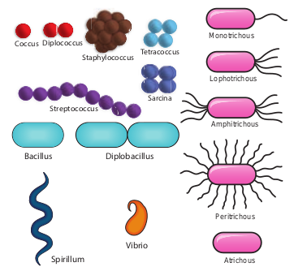
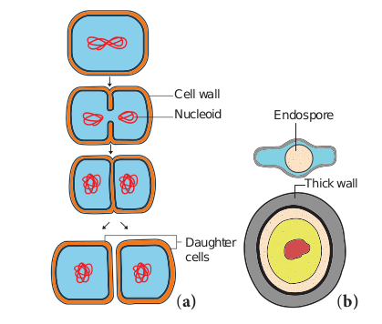
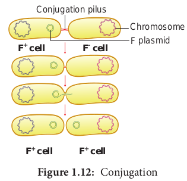
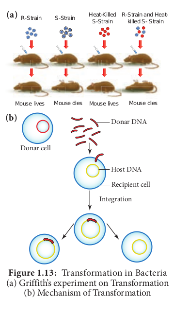
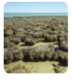
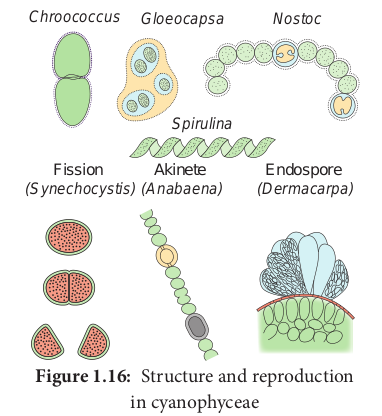
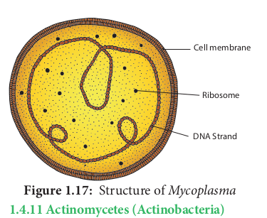

# Bacteria

_Bacteria Friends or Foes?_ Have you noticed the preparation of curd in our home? A little drop of curd turns the milk into curd after some time. What is responsible for this change? Why it Sours? The change is brought by _Lactobacillus lactis_, a bacterium present in the curd. The sourness is due to the formation of Lactic acid. Have you been a victim of Typhoid? It is a bacterial disease caused by _Salmonella_ _typhi,_ a bacterium. So we can consider this prokaryotic organism as friend and foe, due to their beneficial and harmful activities.

**Robert Koch (1843–1910)**
 Robert Heinrich Hermann Koch was a German physician and microbiologist. He is considered as the founder of modern bacteriology.He identified the causal organism for Anthrax, Cholera and Tuberculosis. The experimental evidence for the concept of infection was proved by him (Koch’s postulates). He was awarded Nobel prize in Medicine/Physiology in the year 1905.

## Milestones in Bacteriology

1829 - C.G. Ehrenberg coined the term Bacterium
1884 - Christian Gram introduced Gram staining method
1923 - David H. Bergy published First edition of Bergey’s Manual
1928 - Fredrick Griffith discovered Bacterial transformation
1952 - Joshua Lederberg discovered of Plasmid

Bacteria are prokaryotic, unicellular, ubiq- uitous, microscopic organisms. The study of Bacteria is called Bacteriology. Bacteria were first discovered by a Dutch scientist, Anton van Leeuwenhoek in 1676 and were called “animalcules”.

## General characteristic features of Bacteria

- They are Prokaryotic organisms and lack nuclear membrane and membrane bound organelles.

- The Genetic material is called **nucleoid** or **genophore** or **incipient** **nucleus**

- The cell wall is made up of Polysaccharides and proteins

- Most of them lack chlorophyll, hence they are heterotrophic (_Vibrio cholerae_) but some are autotrophic and possess Bacteriochlorophyll (_Chromatium_)

- They reproduce vegetatively by Binary fission and endospore formation.

- They exhibit variations which are due to genetic recombination and is achieved through conjugation, transformation and transduction.

The shape and flagellation of the bacteria varies and is given in Figure 1.8.

**Figure 1.8 Shape and flagellation in bacteria**

## Ultrastructure of a Bacterial cell

The bacterial cell reveals three layers (i) Capsule/Glycocalyx (ii) Cell wall and (iii) Cytoplasm (Figure 1.9).

**Capsule/Glycocalyx** Some bacteria are surrounded by a gelatinous substance which is composed of polysaccharides or polypeptide or both. A thick layer of **glycocalyx** bound tightly to the

cell wall is called **capsule**. It protects cell from desiccation and antibiotics. The sticky nature helps them to attach to substrates like plant root surfaces, Human teeth and tissues. It helps to retain the nutrients in bacterial cell.

> **Do You Know**
> Duodenal and Gastric ulcers are caused by _Helicobacter pylori,_ a Gram negative bacterium
> Bt toxin from _Bacillus thuringiensis_ finds application in raising insect resistant crops (Bt Crops).

**Cell wall**
The bacterial cell wall is granular and is rigid. It provides protection and gives shape to the cell. The chemical composition of cell wall is rather complex and is made up of peptidoglycan or mucopeptide (N-acetyl glucosamine, N-acetyl muramic acid and peptide chain of 4 or 5 aminoacids). One of the most abundant polypeptide called porin is present and it helps in the diffusion of solutes.

**Plasma membrane**
The plasma membrane is made up of lipoprotein. It controls the entry and exit of small molecules and ions. The enzymes involved in the oxidation of metabolites (i.e., the respiratory chain) as well as the photosystems used in photosynthesis are present in the plasma membrane.

**Cytoplasm**
Cytoplasm is thick and semitransparent. It contains ribosomes and other cell inclusions. Cytoplasmic inclusions like glycogen, poly-β- hydroxybutyrate granules, sulphur granules and gas vesicles are present.

**Bacterial chromosome**
The bacterial chromosome is a single circular DNA molecule, tightly coiled and is not enclosed in a membrane as in Eukaryotes. This genetic material is called **Nucleoid or Genophore.** It is amazing to note that the DNA of _E.coli_ which measures about 1mm long when uncoiled, contains all the genetic information of the organism. The DNA is not bound to **histone** proteins. The single chromosome or the DNA molecule is circular and at one point it is attached to the plasma membrane and it is believed that this attachment may help in the separation of two chromosomes after DNA replication.

**Plasmid**
Plasmids are extra chromosomal double stranded, circular, self-replicating, autonomous elements. The size of a plasmid varies from 1 to 500 kb usually plasmids contribute to about 0.5 to 5.0% of the total DNA of bacteria. They contain genes for fertility, antibiotic resistant and heavy metals. It also help in the production of bacteriocins and toxins which are not found in bacterial chromosome. The number of plasmids per cell varies. Plasmids are classified into different types based on the function. Some of them are F (Fertility) factor, R (Resistance) plasmids, Col (Colicin) plasmids, Ri (Root inducing) plasmids and Ti (Tumour inducing) plasmids.

**Mesosomes**
These are localized infoldings of plasma membrane produced into the cell in the form of vesicles, tubules and lamellae. They are clumped and folded together to maximize their surface area and helps in respiration and in binary fission.

**Polysomes / Polyribosomes**
The ribosomes are the site of protein synthesis. The number of ribosome per cell varies from 10,000 to 15,000. The ribosomes are 70S type and consists of two subunits (50S and 30S). The ribosomes are held together by mRNA and form polyribosomes or polysomes.

**Flagella**
Certain motile bacteria have numerous thin hair like projections of variable length emerge from the cell wall called flagella. It is 20–30 μm in diameter and 15 μm in length. The flagella of Eukaryotic cells contain 9+2 microtubles but each flagellum in bacteria is made up of a single fibril. Flagella are used for locomotion. Based on the number and position of flagella there are different types of bacteria (Figure 1.8)

**Fimbriae or Pili**
Pili or fimbriae are hair like appendages found on surface of cell wall of gram-negative bacteria (Example: _Enterobacterium_). The pili are 0.2 to 20 µm long with a diameter of about 0.025µm. In addition to normal pili there are special type of pili which help in conjugation called sex pili are also found.

## Gram staining procedure

The Gram staining method to differentiate bacteria was developed by Danish Physician Christian Gram in the year1884. It is a differential staining procedure and it classifies bacteria into two classes - Gram positive and Gram negative. The steps involved in Gram staining procedure is given in Figure 1.10. The Gram positive bacteria retain crystal violet and appear dark violet whereas Gram negative type loose the crystal violet and when counterstained by safranin appear red under a microscope.

Most of the gram positive cell wall contain considerable amount of teichoic acid and teichuronic acid. In addition, they may contain

**Figure 1.10:** Steps involved in Gram Staining

polysaccharide molecules. The gram negative cell wall contains three components that lie outside the peptidoglycan layer. 1. Lipoprotein 2. Outer membrane 3.Lipopolysaccharide. Thus the different results in the gram stain

**Table 1.6: Difference between Gram Positive and Gram Negative Bacteria**
| S. No. |Characteristics |Gram positive Bacteria |Gram negative Bacteria |
|------|------|------|------|
| 1. |Cell wall |Thick layered with(0.015 µm-0.02µm) |Thin layered with(0.0075µm–0.012µm) |
| 2. |Rigidity of cell wall |Rigid due to presenceof Peptidoglycans |Elastic due to presence of lipoprotein-polysaccharide mixture |
| 3. |Chemical composition |Peptidoglycans-80%Polysaccharide-20%Teichoic acid present |Peptidoglycans-3 to 12% rest ispolysaccharides and lipoproteins.Teichoic acid absent |
| 4. |Outer membrane |Absent |Present |
| 5. |Periplasmic space |Absent |Present |
| 6. |Susceptibility to penicillin |Highly susceptible |Low susceptible |
| 7. |Nutritional requirements |Relatively complex |Relatively simple |
| 8. |Flagella |Contain 2 basal body rings |Contain 4 basal body rings |
| 9. |Lipid and lipoproteins |Low |High |
| 10. |Lipopolysaccharides |Absent |Present |

are due to differences in the structure and composition of the cell wall. The difference between Gram Positive and Gram negative bacteria is given in Table 1.6.

> **What are Magnetosomes ?**
> Intracellular chains of 40-50 magnetite (Fe3O4) particles are found in bacterium _Aquaspirillum magnetotacticum_. and it help the bacterium to locate nutrient rich sediments.

## Life processes in Bacteria

**Respiration**
Two types of respiration are found in Bacteria. They are 1. Aerobic respiration 2. Anaerobic respiration.

**1. Aerobic respiration**
These bacteria require oxygen as terminal acceptor and will not grow under anaerobic conditions. (i.e. in the absence of O2) **Example:** _Streptococcus._

**Obligate aerobes**
Some _Micrococcus_ **species** are obligate aerobes (i.e. they must have oxygen to survive).

**2\. Anaerobic respiration**

These bacteria do not use oxygen for growth and metabolism but obtain their energy from fermentation reactions.**Example:** _Clostridium._

**Facultative anaerobes**
There are bacteria that can grow either using oxygen as a terminal electron acceptor or anaerobically using fermentation reaction to obtain energy. When a facultative anaerobe such as _E. coli_ is present at a site of infection like an abdominal abscess, it can rapidly consume all available O2 and change to anaerobic metabolism producing an anaerobic environment and thus allow the anaerobic bacteria that are present to grow and cause disease. **Example:** _Escherichia coli_ and _Salmonella._

**Capnophilic Bacteria**
Bacteria which require CO2 for their growth are called as capnophilic bacteria. **Example:** _Campylobacter._

**Nutrition**
On the basis of their mode of nutrition bacteria are classified into two types namely autotrophs and heterotrophs.

**I. Autotrophic Bacteria** Bacteria which can synthesise their own food are called autotrophic bacteria. They may be further subdivided as

**A. Photoautotrophic bacteria** Bacteria use sunlight as their source of energy to synthesize food. They may be

**1. Photolithotrophs** In photolithotrophs the hydrogen donor is an inorganic substance. **a. Green sulphur bacteria:** In this type of bacteria the hydrogen donor is H2S and possess pigment called **Bacterioviridin.** Example: _Chlorobium._ **b. Purple sulphur bacteria:** For bacteria belong to this group the hydrogen donor is thiosulphate, **Bacteriochlorophyll** is present**.** Chlorophyll containing chlorosomes are present Example: _Chromatium_.

**2. Photoorganotrophs** They utilize organic acid or alcohol as hydrogen donor. Example: Purple non sulphur bacteria – _Rhodospirillum._

**B. Chemoautotrophic bacteria** They do not have photosynthetic pigment hence they cannot use sunlight energy. This type of bacteria obtain energy from organic or inorganic substance.

**1. Chemolithotrophs** This type of bacteria oxidize inorganic compound to release energy.
Examples:

1. Sulphur bacteria - _Thiobacillus thiooxidans_
2. Iron bacteria - _Ferrobacillus ferrooxidans_
3. Hydrogen bacteria - _Hydrogenomonas_
4. Nitrifying bacteria - _Nitrosomonas_ and _Nitrobacter_

**2. Chemoorganotrophs** This type of bacteria oxidize organic compounds to release energy.
Examples:

1. Methane bacteria – _Methanococcus_
2. Acetic acid bacteria – _Acetobacter_
3. Lactic acid bacteria – _Lactobacillus_

**II. Heterotrophic Bacteria** They are Parasites (_Mycobacterium_) Saprophytes (_Bacillus mycoides_) or Symbiotic _(Rhizobium_ in root nodules of leguminous crops).

## Reproduction in Bacteria

Bacteria reproduces asexually by binary fission, conidia and endospore formation (Figure 1.11). Among these, binary fission is the most common one.

**Binary fission**
Under favourable conditions the cell divides into two daughter cells. The nuclear material divides first and it is followed by the formation of a simple median constriction which finally results in the separation of two cells.

**Endospores**
During unfavourable condition bacteria produce endospores. Endospores are produced in _Bacillus megaterium_, _Bacillus sphaericus_ and _Clostridium tetani._ Endospores are thick walled resting spores. During favourable condition, they germinate and form bacteria.

**Sexual Reproduction**
Typical sexual reproduction involving the formation and fusion of gametes is absent in bacteria. However gene recombination can occur in bacteria by three different methods they are

1.  Conjugation
2.  Transformation
3.  Transduction

**1. Conjugation**
J. Lederberg and Edward L. Tatum demonstrated conjugation in 32*E. coli*. in the year 1946. In this method of gene transfer the donor cell gets attached to the recipient cell with the help of pili. The pilus grows in size and forms the conjugation tube. The plasmid of donor cell which has the F+ (fertility factor) undergoes replication. Only one strand of DNA is transferred to the recipient cell through conjugation tube. The recipient completes the structure of double stranded DNA by synthesizing the strand that complements the strand acquired from the donor (Figure 1.12).

**2. Transformation**
Transfer of DNA from one bacterium to another is called transformation (Figure 1.13). In 1928 the bacteriologist Frederick Griffith demonstrated transformation in Mice using _Diplococcus pneumoniae_. Two strains of this bacterium are present. One strain produces smooth colonies and are virulent in nature (S-type). In addition another strain produce rough colonies and are avirulent (R-type). When S-type of cells were injected into the mouse, the mouse died. When R-type of cells were injected, the mouse survived. He injected heat killed S-type cells into the mouse. The mouse did not die. When the mixture of heat killed S-type cells and R-type cells were injected into the mouse, the mouse died. The avirulent rough strain of _Diplococcus_ had been transformed into S-type cells. The hereditary material of heat killed S-type cells had transformed R-type cell into virulent smooth strains. Thus the phenomenon of changing the character of one strain by transferring the

DNA of another strain into the former is called Transformation.

**3\. Transduction**
Zinder and Lederberg (1952) discovered Transduction in _Salmonella typhimurum_. Phage mediated DNA transfer is called Transduction (Figure 1.14).

**Transduction is of two types**
(i) Generalized transduction
(ii) Special- ized or Restricted transduction

**(i) Generalized Transduction**
The ability of a bacteriophage to carry genetic material of any region of bacterial DNA is called generalised transduction.

(ii) **Specialized or Restricted Transduction**
The ability of the bacteriophage to carry only a specific region of the bacterial DNA is called specialized or restricted transduction.

**Figure 1.14 Generalised Transduction Specialised Transduction**

## Economic importance of Bacteria

Bacteria are both beneficial and harmful. The beneficial activities of bacteria are given in table 1.7.

**Table 1.7: Economic im Beneficial aspects Bacteria 1. Soil fertility**

| Beneficial aspects                                           | Bacteria                                              | Role                                                                                                                                                                                  |
| ------------------------------------------------------------ | ----------------------------------------------------- | ------------------------------------------------------------------------------------------------------------------------------------------------------------------------------------- |
| Ammonification                                               | 1. _Bacillus ramosus_ 2. _Bacillus mycoides_          | Convert complex proteins in the dead bodies of plants and animals into ammonia which is later converted into ammonium salt                                                            |
| Nitrification                                                | 1._Nitrobacter_ 2. _Nitrosomonas_                     | Convert ammonium salts into nitrites and nitrates                                                                                                                                     |
| Nitrogen fixation                                            | 1._Azotobacter_ 2. _Clostridium_ 3. _Rhizobium_       | (i) Converting atmospheric nitrogen into organic nitrogen (ii) The nitrogenous compounds are also oxidized to nitrogen (iii) All these activities of bacteria increase soil fertility |
| **2. Antibiotics**                                           |
| 1. Streptomycin                                              | _Streptomyces griseus_                                | It cures urinary infections, tuberculosis, meningitis and pneumonia                                                                                                                   |
| 2. Aureomycin                                                | _Streptomyces aureofaciens_                           | It is used as a medicine to treat whooping cough and eye infections                                                                                                                   |
| 3. Chloromycetin                                             | _Streptomyces venezuelae_                             | It cure typhoid fever                                                                                                                                                                 |
| 4. Bacitracin                                                | _Bacillus licheniformis_                              | It is used to treat syphilis                                                                                                                                                          |
| 5. Polymyxin                                                 | _Bacillus polymyxa_                                   | It cure some bacterial diseases                                                                                                                                                       |
| **3\. Industrial Uses**                                      |
| 1\. Lactic acid                                              | _Lactobacillus lactis_ and _Lactobacillus bulgaricus_ | Convert milk sugar lactose into lactic acid                                                                                                                                           |
| 2\. Butter                                                   | _Lactococcus lactis, Leuconostoc citrovorum_          | Convert milk into butter, cheese, curd and yoghurt                                                                                                                                    |
| 3\. cheese                                                   | _Lactobacillus acidophilus, Lactobacillus lactis_     |
| 4\. Curd                                                     | _Lactobacillus lactis_                                |                                                                                                                                                                                       |
| 5\. Yoghurt                                                  | _Lactobacillus bulgaricus_                            |                                                                                                                                                                                       |
| 6\. Vinegar (Acetic acid)                                    | _Acetobacter aceti_                                   | This bacteria oxidizes ethyl alcohol obtained from molasses by fermentation to vinegar(acetic acid)                                                                                   |
| 7\. Alcohol and Acetone(i) Butyl alcohol (ii) Methyl alcohol | _Clostridium acetobutylicum_                          | Alcohols and acetones are prepared from molasses by fermentation activity of the anaerobic bacterium.                                                                                 |
| 8\. Retting of fibres                                        | _Clostridium tertium_                                 | The fibres from the fibre yielding plants are separated by the action of _Clostridium_ is called retting of fibres.                                                                   |
| 9\. Vitamins                                                 | _Escherichia coli_ _Clostridium_ _acetobutylicum_     | Living in the intestine of human beings produce large quantities of vitamin K and vitamin B complex.Vitamins B2 is prepared by the fermentation of sugar.                             |
| 10\. Curing of Tea and Tobacco                               | _Micrococcus candicans,_ _Bacillu megatherium_        | The special flavor and aroma of the tea and tobacco are due to fermentation.                                                                                                          |

Bacteria are known to cause disease in plants, an Table 1.8, 1.9, 1.10 and Figure 1.15.

**Table 1.8: Plant diseases Causes By Bacteria**

| S.No | Name Of The Host | Name Of The Disease | Name of the pathogen                             |
| ---- | ---------------- | ------------------- | ------------------------------------------------ |
| 1    | Rice             | Bacterial blight    | Xanthomonas oryzae                               |
| 2    | Apple            | Fire blight         | Erwinia amylovora                                |
| 3    | Carrot           | Soft rot            | Erwinia caratovora                               |
| 4    | Citrus           | Citrus canker       | Xanthomonas                                      |
| 5    | Cotton           | Angular leaf spot   | Xanthomonas malvacearum                          |
| 6    | Potato           | Ring rot            | Clavibacter michiganensis* subsp. \_sepedonicus* |
| 7    | Potato           | Scab                | Streptomyces scabies\_                           |

**Table 1.9: Animal diseases Causes By Bacteria**

| S.No | Name of the Animal | Name of the disease | Name of the pathogen |
| ---- | ------------------ | ------------------- | -------------------- |
| 1\.  | Sheep              | Anthrax             | Bacillus anthracis   |
| 2.   | Cattle             | Brucellosis         | Brucella abortus     |
| 3.   | Cattle             | Bovine tuberc       | Mycobacterium bovis  |
| 4.   | Cattle             | Black leg           | Clostridium chauvoei |

**Table 1.10: Human diseases caused by Bacteria**
|S.No|Name of the disease |Name of the pathogen|
| --- | ----- | ---- |
|1. |Cholera| _Vibrio cholerae_ |
|2. |Typhoid|_Salmonella typhi_|
|3. |Tuberculosis |_Mycobacterium tuberculosis_| |4. |Leprosy |_Mycobacterium leprae_|
|5. |Pneumonia| _Diplococcus pneumoniae_ |
|6. |Plague |_Yersinia pestis_|
|7. |Diphtheria| _Corynebacterium diptheriae_| |8. |Tetanus |_Clostridium tetani_|
|9. |Food poisoning| _Clostridium botulinum_|
|10. |Syphilis |_Treponema pallidum_|

> **Have you heard about the word “Probiotics”**
> Probiotic milk products and tooth paste are available in the market. _Lactobacillus and Bifidobacterium_ are used to prepare probiotic yoghurt and tooth paste

**Activity 1.3**
Collect some root nodules of leguminous crops. Draw diagram. Wash it in tap water and prepare a smear by squeezing the content into a clean slide. Follow Gram staining method and identify the bacteria.

> **Do You Know**
> Bacteria forms Biofilms and leads to dental caries and Urinary tract infection (UTI)_Ralstonia_ synthesize PHB (Poly-β-hydroxyl butyrate) a microbial plastic which is biodegradable.

## Archaebacteria

Archaebacteria are primitive prokaryotes and are adapted to thrive in extreme environments like hot springs, high salinity, low pH and so on.
They are mostly chemoautotrophs. The unique feature of this group is the presence of lipids like glycerol & isopropyl ethers in their cell membrane. Due to the unique chemical composition the cell membrane show resistance against cell wall antibiotics and lytic agents. Example: _Methanobacterium, Halobacterium, Thermoplasma_.

## Cyanobacteria (Blue Green Algae)

**How old are Cyanobacteria ?Stromatolites reveals the truth.**

Stromatolites are deposits formed when colonies of cyanobacteria bind with calcium carbonate. They have a geological age of 2.7 billion years. Their abundance in the fossil record indicates that cyanobacteria helped in raising the level of free oxygen in the atmosphere.

- Pseudomonas putida\_ is a superbug genetically engineered which breakdown hydrocarbons.

- “Pruteen” is a single cell protein derived from _Methylophilus_ _methylotrophus_.
- Agrobacterium tumefaciens\_ cause crown gall disease in plants but its inherent tumour inducing principle helps to carry the desired gene into the plant through Genetic engineering.
- Thermus aquaticus\_ is a thermophilic gram negative bacteria which produces Taq Polymerase a key enzyme for Polymerase Chain Reaction (PCR).
- Methanobacterium* is employed in biogas production. \_Halobacterium*, an extremophilic bacterium grows in high salinity. It is exploited for the production β carotene.

**Cyanobacteria** are popularly called as 'Blue green algae' or 'Cyanophyceae'. They are photosynthetic, prokaryotic organisms. According to evolutionary record Cyanobacteria are primitive forms and are found in different habitats. Most of them are fresh water and few are marine (_Trichodesmium_ and _Dermacarpa_) _Trichodesmium erythraeum_ a cyanobacterium imparts red colour to Red sea. Species of _Nostoc_, _Anabaena_ lead an endophytic life in the coralloid root of _Cycas_, leaves of aquatic fern _Azolla_ by establishing a symbiotic association and fix atmospheric nitrogen. Members like _Gloeocapsa,_ _Nostoc_, _Scytonema_ are found as phycobionts in lichen thalli.

**Salient features**

- The members of this group are prokaryotes and lack motile reproductive structures.
- The thallus is unicellular in _Chroococcus_,Colonial in _Gloeocapsa_ and filamentous trichome in _Nostoc_.
- Gliding movement is noticed in some species (_Oscillatoria_).
- The protoplasm is differentiated into central region called centroplasm and peripheral region bearing chromatophore called chromoplasm.
- The photosynthetic pigments include c-phyocyanin and c-phycoerythrin along with myxoxanthin and myxoxanthophyll.
- The reserve food material is Cyanophycean starch.
- In some forms a large colourless cell is found in the terminal or intercalary position called Heterocysts. They are involved in nitrogen fixation.
- They reproduce only through vegetative methods and produce Akinetes (thick wall dormant cell formed from vegetative cell), Hormogonia (a portion of filament get detached and reproduce by cell division), fission and endospores.
- The presence of mucilage around the thallus is characteristic feature of this group. Therefore, this group is also called Myxophyceae.
- Sexual reproduction is absent\_..
- _Microcystis aeruginosa_, _Anabaena_
  _flos-aquae_ cause water blooms and release toxins and affect the aquatic organism.

Most of them fix atmospheric nitrogen and are used as biofertilizers (Example: _Nostoc, Anabaena_). _Spirulina_ is rich in protein hence it is used as single cell protein. The thallus organisation and methods of reproduction is given in Figure 1.16.

> **Do You Know ?**
> **A prokaryote takes a joy ride on polar bear**(_Aphanocapsa montana_ \- a cynobacterium grow on the fur of polar bear).

## Mycoplasma or Mollicutes

The Mycoplasma are very small (0.1–0.5µm), pleomorphic gram negative microorganisms. They are first isolated by Nocard and co- workers in the year 1898 from pleural fluid of cattle affected with bovine pleuropneumonia. They lack cell wall and appear like “Fried Egg” in culture. The DNA contains low Guanine and Cytosine content than true bacteria. They cause disease in animals and plants. Little leaf of brinjal, witches broom of legumes phyllody of cloves, sandal spike are some plant diseases caused by mycoplasma. Pleuropneumonia is caused by _Mycoplasma mycoides._ The structure of Mycoplasma is given in Figure 1.17.

## Actinomycetes (Actinobacteria)

Actinomycetes are also called ‘Ray fungi’ due to their mycelia like growth. They are anaerobic or facultative anaerobic microorganisms and are Gram positive. They do not produce an aerial mycelium. Their DNA contains high guanine and cytosine content (Example: _Streptomyces_)_._

_Frankia_ is a symbiotic actinobacterium which produces root nodules and fixes nitrogen in non – leguminous plants such as _Alnus_ and _Casuarina_. They produce multicellular sporangium. _Actinomyces bovis_ grows in oral cavities and cause lumpy jaw.

_Streptomyces_ is a mycelial forming Actinobacteria which lives in soil, they impart “earthy odour” to soil after rain which is due to the presence of Geosmin (volatile organic compound). Some important antibiotics namely, Streptomycin, Chloramphenicol, and Tetracycline are produced from this genus.
