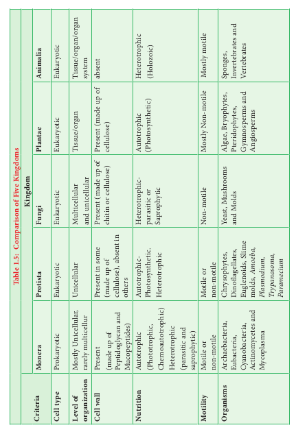

# Classification of Living World

From the previous chapter we know that the planet earth is endowed with living and non -living things. In our daily life we see several things in and around us. Imagine, you are on a trip to Hill station. You are enjoying the beauty of mountains, dazzling colour of the flowers, and melodious sound of the birds. You may be capturing most of the things you come across in the form of photography. Now, from this experience can you mention the objects you have come across? Can you record your observations and tabulate them?. How will you organize the things? Will you place mountain and flowers together or tall trees and trailing herbs in one category or place it in different category? If you place it in different category, what made you to place them in different category? So classification is essential and could be done only by understanding and comparing the things based on some characters. In this chapter we shall learn about classification of living world.

Many attempts have made in the past to classify the organisms on earth. **Theophrastus**, “Father of Botany” used the morphological characters to classify plants into trees, shrubs and herbs. Aristotle classified animals into two groups. i.e., _Enaima_ (with red blood) and _Anaima_ (without red blood).

Carl Linnaeus classified living world into two groups namely Plants and Animals based on morphological characters. His classification faced major setback because Prokaryotes and Eukaryotes were grouped together. Similarly fungi, heterotrophic organisms were placed along with the photosynthetic plants. In course of time, the development of tools compelled taxonomists to look for different areas like cytology, anatomy, embryology, molecular biology, phylogeny etc., for classifying organisms on earth. Thus, new dimensions to classifications were put forth from time to time.

## Need of Classification

Classification is essential to achieve following needs.

- To relate things based on common characteristic features.
- To define organisms based on the salient features.
- Helps in knowing the relationship amongst different groups of organisms.
- It helps in understanding the evolutionary relationship between organisms.

## Classification of Living World

A comparison of classification proposed for classification of living world is given in Table 1.4.

## Five Kingdom Classification

R.H.Whittaker, an American taxonomist proposed five Kingdom classification in the year 1969. The Kingdoms include **Monera,**
**Table 1.4: Systems o f Classification**
| Two Kingdom |Three Kingdom |Four Kingdom |Five Kingdom |
|------|------|------|------|
|||||
| **Carl Linnaeus (1735)** |**Ernst Haeckel (1866)** |**C opeland (1956)** |**R.H. Whittaker (1969)** |
| 1. Plantae 2.Animalia |1. Protista 2. Plantae 3.Animalia |1.Monera 2.Protista 3.Plantae 4.Animalia |1.Monera 2. Protista 3. Fungi 4.Plantae 5. Animalia |

**Protista, Fungi, Plantae and Animalia** (Figure 1.7). The criteria adopted for the classification include cell structure, thallus organization, mode of nutrition, reproduction and phylogenetic relationship . A comparative account of the salient features of each Kingdom is given in Table 1.5

**Merits**

- The classification is based on the complexity of cell structure and organization of thallus.
- It is based on the mode of nutritio.
- Separation of fungi from plant.
- It shows the phylogeny of the organisms

**Demerits**

- The Kingdom Monera and protist accommodate both autotrophic and heterotrophic organisms, cell wall lacking and cell wall bearing organisms thus making these two groups more heterogeneous.

- Viruses were not included in the system.

Carl Woese and co-workers in the year 1990 introduced three domains of life _viz.,_ **Bacteria**, **Archaea** and **Eukarya** based on the difference in rRNA nucleotide sequence, lipid structure of the cell membrane. A revised six Kingdom classification for living world was proposed by Thomas Cavalier-Smith in the year 1998 and the Kingdom **Monera** is divided in to **Archaebacteria** and **Eubacteria.** Recently Ruggierio _et al_., 2015 published a seven Kingdom classification which is a practical extension of Thomas Cavalier’s six Kingdom scheme. According to this classification there are two Super Kingdoms. (**Prokaryota** and **Eukaryota**) **Prokaryota** includes two Kingdoms namely **Archaebacteria** and **Eubacteria.** Eukaryota includes the **Protozoa, Chromista, Fungi, Plantae** and **Animalia.** A new Kingdom, the **Chromista** was erected and it included all algae whose chloroplasts contain chlorophyll a and c, as well as various colourless forms that are closely related to them.Diatoms, Brown algae, Cryptomonads and Oomycetes were placed under this Kingdom.

**Activity 1.2**
Visit to a pond and record the names of the biotic components of it with the help of your teacher. Tabulate the data and segregate them according to Five Kingdom Classification.

> **Do You Know**
> Red tide is caused by toxic bloom of Dinoflagellates like _Gymnodinium_ _breve_ and _Gonyaulax_ _tamarensis_. A major red tide incident in west coast of Florida in the year 1982 killed Hundreds and thousands of fishes.
> 
