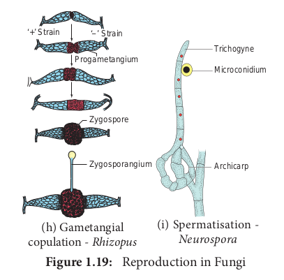
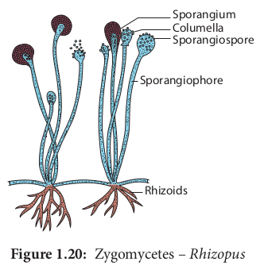
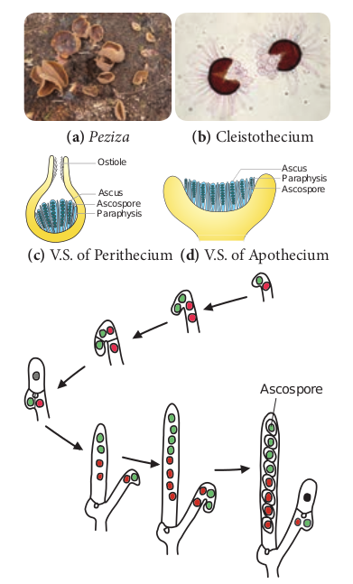
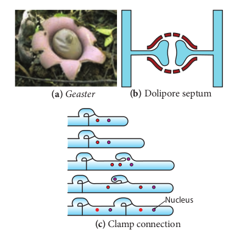
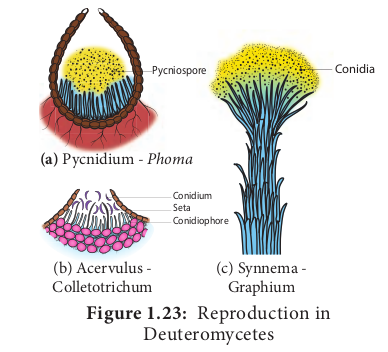
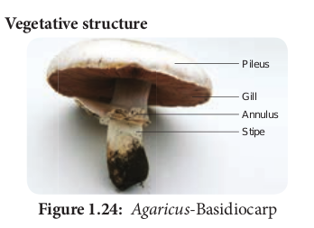
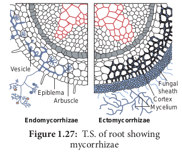

# Fungi

World War II and Penicillin History speaks on fungi **Sir Alexander Fleming**


Discovery of Penicillin in the year 1928 is a serendipity in the world of medicine. The History of World War II recorded the use of Penicillin in the form of yellow powder to save lives of soldiers. For this discovery - The wonderful antibiotic he shared Nobel Prize in Medicine in the year 1945 along with Ernest Boris chain and Sir Howard Walter Florey.

## Milestones in Mycology

- 1729 P.A.Micheli conducted spore culture experiments
- 1767 Fontana proved that Fungi could cause disease in plants
- 1873 C.H. Blackley proved fungi could cause allergy in Human beings
- 1904 A.F.Blakeslee reported heterothallism in fungi
- 1952 Pontecorvo and Roper reported Parasexual cycle

The word ‘fungus’ is derived from Latin meaning ‘mushroom’. Fungi are ubiquitous, eukaryotic, achlorophyllous heterotrophic organisms. They exist in unicellular or multicellular forms. The study of fungi is called mycology. (Gr. mykes – mushroom: logos – study). P.A. Micheli is considered as founder of Mycology. Few renowned mycologists include Arthur H.R. Buller, John Webster, D.L.Hawksworth, G.C.Ainsworth, B.B.Mundkur, K.C.Mehta, C.V. Subramanian and T.S. Sadasivan.

> **E.J. Butler (1874-1943)**
> E.J. Butler is the Father of Indian Mycology. He established Imperial Agricultural Research Institute at Pusa, Bihar. It was later shifted to New Delhi and at present known as Indian Agricultural Research Insitute (IARI). He published a book, ‘Fungi and Disease in Plants’ on Indian plant diseases in the year 1918.

## General characteristic features

- Majority of fungi are made up of thin,filamentous branched structures called hyphae. A number of hyphae get interwoven to form mycelium.The cell wall of fungi is made up of a polysaccharide called **chitin** (polymer of N-acetyl glucosamine) and fungal cellulose.

- The fungal mycelium is categorised into two types based on the presence or absence of septa (Figure 1.18). In lower fungi the hypha is aseptate, multinucleate and is known as coenocytic mycelium (Example: _Albugo_). In higher fungi a septum is present between the cells of the hyphae. Example: _Fusarium._
  

- The mycelium is organised into loosely or compactly interwoven fungal tissues called **plectenchyma**. It is further divided into two types **prosenchyma** and **pseudoparenchyma**. In the former type the hyphae are arranged loosely but parallel to one another. In the latter hyphae are compactly arranged and loose their identity.

- In holocarpic forms the entire thallus is converted into reproductive structure whereas in Eucarpic some regions of the thallus are involved in the reproduction other regions remain vegetative. Fungi reproduce both by asexual and sexual methods. The asexual phase is called **Anamorph** and the sexual phase is called **Teleomorph**. Fungi having both phases are called **Holomorph**.

General sexual reproduction in fungi includes three steps 1. Fusion of two protoplasts (plasmogamy) 2. Fusion of nuclei (karyogamy) and 3. Production of haploid spores through meiosis. Methods of reproduction in fungi is given in Figure 1.19.

## Methods of Reproduction in Fungi

**Asexual Reproduction**

1. Zoospores: They are flagellate structures produced in zoosporangia (Example: Chytrids).
2. Conidia: The spores produced on condiophores (Example*: Aspergillus, Penicillium*).
3. Oidia/Thallospores/Arthrospores: The hypha divided and developed in to spores called oidia (Example: _Erysiphe_)_._
4. Fission: The vegetative cell divides into 2 daughter cells. (Example: _Schizosaccharomyces-\_yeast)_.\_
5. Budding: A small outgrowth is developed on parent cell, which gets detached and becomes independent. (Example: _Saccharomyces-_ yeast*)*
6. Chlamydospore: Thick walled resting spores are called chlamydospores (Example: _Fusarium_)_._

**Sexual Reproduction**

1. Planogametic copulation: Fusion of motile gamete is called planogametic copulation. a. Isogamy – Fusion of morphologically and physiologicall similar gametes. (Example: _Synchytrium)_. b. Anisogamy – Fusion of morphologically or physiologically dissimilar gametes (Example: _Allomyces_). c. Oogamy – Fusion of both morphologically and physiologically dissimilar gametes. (Example: _Monoblepharis_).

2. Gametangial contact: During sexual reproduction a contact is established between antheridium and Oogonium (Example: _Albugo_).

3. Gametangial copulation: Fusion of gametangia to form zygospore (Example: _Mucor, Rhizopus_).

4. Spermatization: In this method a uninucleate pycniospore/microconidium is transferred to receptive hyphal cell (Example: _Puccinia, Neurospora_)

5. Somatogamy: Fusion of two somatic cells of the hyphae (Example: _Agaricus_)
   
   

## Classification of Fungi

Many mycologists have attempted to classify fungi based on vegetative and reproductive characters. Traditional classifications categorise fungi into 4 classes – Phycomycetes, Ascomycetes, Basidiomycetes and Deuteromycetes. Among these ‘Phycomycetes’ include fungal species of Oomycetes, Chytridiomycetes and Zygomycetes which are considered as lower fungi indicating algal origin of fungi. Constantine J. Alexopoulos and The outline of the classification is given below
Charles W. Mims in the year 1979 proposed the classification of fungi in the book entitled ‘Introductory Mycology’. They classified fungi into three divisions namely Gymnomycota, Mastigomycota and Amastigomycota. There are 8 subdivisions, 11 classes, 1 form class and 3 form subclasses in the classification proposed by them.

## Kingdom : Myceteae (Fungi)

These include chlorophyllous, saprophytic or parasitic organisms with unicellular or multicellular (Mycelium) thallus surrounded by chitinous cell wall. Nutrition is absorptive except slime molds.Reproduction is through asexual and sexual methods.

**Division : I Gymnomycota**

Nutrition is phagotrophic, members of this group lack cell wall. Example. _Dictyostelium_

**Division :II Mastigomycota**

Flagellate cells are present (Gamete/ Zoospore). Nutrition absorptive, mycelium coenocytic. Example : _Albugo._
**Division : III Amastigomycota**

Unicellular to multicellular forms are included. The mycelium is septate. Asexual reproduction occurs by budding,


fragmentation,sporangiospores, conidia etc., Meiosis is zygotic. Example : _Peziza_

Recently, with the advent of molecular methods myxomycetes and oomycetes were reclassified and treated under chromista.

The salient features of some of the classes – Oomycetes, Zygomycetes, Ascomycetes, Basidiomycetes and Form class Deuteromycetes are discussed below.

**Oomycetes**
Coenocytic mycelium is present. The cell wall is made up of Glucan and Cellulose. Zoospore with one whiplash and one tinsel flagellum is present. Sexual reproduction is oogamous. Example: _Albugo._

**Zygomycetes**

- Most of the species are saprophytic and live on decaying plant and animal matter in the soil. Some lead parasitic life (Example: _Entomophthora_ on housefly).

- Bread mold fungi (Example: _Mucor, Rhizopus_) and coprophilous fungi (Fungi growing on dung Example: _Pilobolus_) belong to this group (Figure 1.20).



- The mycelium is branched and coenocytic.
- Asexual reproduction by means of spores produced in sporangia.
- Sexual reproduction is by the fusion of the gametangia which results in thick walled zygospore. It remains dormant for long periods. The zygospore undergoes meiosis and produce spores.

**Ascomycetes**

- Ascomycetes include a wide range of fungi such as yeasts, powdery mildews, cup fungi, morels and so on (Figure 1.21).



- Although majority of the species live in terrestrial environment, some live in aquatic environments both fresh water and marine.

- The mycelium is well developed, branched with simple septum.

- Majority of them are saprophytes but few parasites are also known (Powdery mildew _Erysiphe_).

- Asexual reproduction takes place by fission, budding, oidia, conidia, and chlamydospore.

- Sexual reproduction takes place by the fusion of two compatible nuclei.

- Plasmogamy is not immediately followed by karyogamy, instead a dikaryotic condition is prolonged for several generations.

- A special hyphae called ascogenous hyphae is formed.

- A crozier is formed when the tip of the ascogenous hyphae recurves forming a hooked cell. The two nuclei in the penultimate cell of the hypha fuse to form a diploid nucleus. This cell forms young ascus.

- The diploid nucleus undergo meiotic division to produce four haploid nuclei, which further divide mitotically to form eight nuclei. The nucleus gets organised into 8 ascospores.

- The ascospores are found inside a bag like structure called ascus. Due to the presence of ascus, this group is popularly called "Sac fungi".

- Asci gets surrounded by sterile hyphae forming fruit body called ascocarp.

- There are 4 types of ascocarps namely **Cleistothecium** (Completely closed), **Perithecium** (Flask shaped with ostiole), **Apothecium** (Cup shaped, open type) and **Pseudothecium**.

**Basidiomycetes**

- Basidiomycetes include puff balls, toad stools, Bird’s nest fungi, Bracket fungi, stink horns, rusts and smuts (Figure 1.22).

- The members are terrestrial and lead a saprophytic and parasitic mode of life.

- The mycelium is well developed, septate with dolipore septum(bracket like). Three types of mycelium namely primary (Monokaryotic), secondary (Dikaryotic) and tertiary are found.


**Figure 1.22: Structure and Reproduction in Basidiomycetes**

- Clamp connections are formed to maintain dikaryotic condition.

- Asexual reproduction is by means of conidia, oidia or budding.

- Sexual reproduction is present but sex organs are absent. Somatogamy or spermatisation results in plasmogamy. Karyogamy is delayed and dikaryotic phase is prolonged. Karyogamy takes place in basidium and it is immediately followed by meiotic division.

- The four nuclei thus formed are transformed into basidiospores which are borne on sterigmata outside the basidium (Exogenous ). The basidium is club shaped with four basidiospores, thus this group of fungi is popularly called “Club fungi”. The fruit body formed is called Basidiocarp.

**Deuteromycetes or Fungi Imperfecti**
The fungi belonging to this group lack sexual reproduction and are called imperfect fungi. A large number of species live as saprophytes in soil and many are plant and animal parasites. Asexual reproduction takes place by the production of conidia, chlamydospores, budding, oidia etc.,

Conidia are also produced in special structures called **pycnidium**, **acervulus**, **sporodochium** and **synnemata** (Figure 1.23). Parasexual cycle operates in this group of fungi. This brings genetic variation among the species.



**Figure 1.23: Reproduction in Deuteromycetes**

## Economic importance

Fungi provide delicious and nutritious food called mushrooms. They recycle the minerals by decomposing the litter thus adding fertility to the soil. Dairy industry is based on a single celled fungus called yeast. They deteriorate the timber. Fungi cause food poisoning due the production of toxins. The Beneficial and harmful activities of fungi are discussed below:
**Beneficial activities**

**Food**
Mushrooms like _Lentinus edodes, Agaricus bisporus, Volvariella volvaceae_ are consumed for their high nutritive value. Yeasts provide vitamin B and _Eremothecium ashbyii_ is a rich source of Vitamin B12.

**Medicine**
Fungi produce antibiotics which arrest the growth or destroy the bacteria. Some of the antibiotics produced by fungi include Peni- cillin (_Penicillium notatum_) Cephalosporins (_Acremonium_ _chrysogenum_) Griseofulvin (_Penicillium griseofulvum_). Ergot alkaloids (Ergotamine) produced by _Claviceps purpurea_ is used as vasoconstrictors.

**Industries**

**Production of Organic acid:**
For the commercial production of organic acids fungi are employed in the Industries. Some of the organic acids and fungi which help in the production of organic acids are: citric acid and gluconic acid – _Aspergillus niger_, Itaconic acid – _Aspergillus terreus_, Kojic acid – _Aspergillus oryzae._

**Bakery and Brewery**
Yeast(_Saccharomyces cerevisiae_) is used for fermentation of sugars to yield alcohol.Bakeries utilize yeast for the production of Bakery products like Bread, buns, rolls etc., _Penicillium roquefortii_ and _Penicillium camemberti_ were employed in cheese production.

**Production of enzymes**
_Aspergillus oryzae_, _Aspergillus niger_ were employed in the production of enzymes like amylase, protease, lactase etc. **Rennet** which helps in the coagulation of milk in cheese manufacturing is derived from _Mucor_ spp.

**Agriculture**
Mycorrhiza forming fungi like _Rhizoctonia, Phallus_, _Scleroderma_ helps in absorption of water and minerals.

Fungi like _Beauveria bassiana, Metarhizium anisopliae_ are used as Biopesticides to eradicate the pests of crops. Gibberellin, produced by a fungus _Gibberella fujikuroi_ induce the plant growth and is used as growth promoter.

**Harmful activities**
Fungi like _Amanita phalloides_, _Amanita verna_, _Boletus satanus_ are highly poisonous due to the production of Toxins. These fungi are commonly referred as **“Toad stools”**.

_Aspergillus_, _Rhizopus, Mucor_ and _Penicilium_ are involved in spoilage of food materials. _Aspergillus flavus_ infest dried foods and

**Table 1.11: Diseases caused by fungi**
|Name of the disease|Causal organism|
|----|----|
|**Plant diseases** |
Blast of Paddy|Magnaporthe grisea|
|Red rot of sugarcane|Colletotrichum falcatum|
|Anthracnose of Beans|Colletotrichum lindemuthianum||
|White rust of crucifers|Albugo candida|
|Peach leaf curl|Taphrina deformans|
|Rust of wheat|Puccinia graminis tritici|
|**Human diseases**||
|Athlete’s foot|Epidermophyton floccosum|
|Candidiasis|Candida albicans|
|Coccidioidomycosis|Coccidioides immitis|
|Aspergillosis|Aspergillus fumigatus|

produce carcinogenic toxin called aflatoxin.

Patulin, ochratoxin A are some of the toxins produced by fungi.Fungi cause diseases in Human beings and plants (Table 1.11).

> **Activity 1.4**
> Get a button mushroom. Draw diagram of the fruit body. Take a thin longitudinal section passing through the gill and observe the section under a microscope. Record your observations.

> **Do You Know ?**
> Dermatophytes are fungi which cause infection in skin. Example: _Trichophyton_, _Tinea_,_Microsporum_ and _Epidermophyton_ The late blight disease of Potato by _Phytophthora infestans_ caused a million deaths, and drove more to emigrate from Ireland (1843-1845)_._ In India _Helminthosporium oryzae,_ Blight of Paddy is also a factor for Bengal famine in 1942-1943.

> **Activity 1.5**
> Keep a slice of bread in a clean plastic tray or plate. Wet the surface with little water. Leave the setup for 3 or 4 days. Observe the mouldy growth on the surface of the bread. Using a needle remove some mycelium and place it on a slide and stain the mycelium using lactophenol cotton blue. Observe the mycelium and sporangium under the microscope and record your observation and identify the fungi and its group based on characteristic features.

## Agaricus

Class — Basidiomycetes
Order — Agaricales
Family — Agaricaceae
Genus — _Agaricus_

It is a saprophytic fungus found on wood logs, manure piles, fresh litter, pastures etc,. The fruit bodies are the visible part of the fungi. They are found in rings in some species like _Agaricus arvensis_, _Agaricus_ _tabularis_ and hence popularly called ‘Fairy rings”. _Agaricus campestris_ is the most common ‘field mushroom’.

**Vegetative structure**



The thallus is made up of branched structures called hyphae. A large number of hyphae constitute the mycelium. Three types of mycelia are seen namely primary mycelium, secondary mycelium and tertiary mycelium. The primary mycelium develops from the germination of basidiospore. It is septate, uninucleate and haploid. It is also called **monokaryotic mycelium**. Fusion of two primary mycelium of opposite strains give rise to secondary mycelium or **dikaryotic mycelium. The dikaryotic mycelium develops** into hyphal cords called **Rhizomorphs**, and perennates the soil for a long period. The tertiary mycelium found in the fruit body called **basidiocarp**. Each cell of the hyphae posssess a cell wall made up of chitin and cell organelles like mitochondria, golgibodies, endoplasmic reticulum etc., are also present.

**Asexual reproduction**
_Agaricus_ produces chlamydospores during asexual reproduction. During favourable condition the chlamydospores germinate to produce mycelium.

**Sexual reproduction**
_Agaricus_ reproduces by sexual method but sex organs are absent. Majority of the species are heterothallic. _Agaricus bisporus_ is a homothallic species. The opposite strains of mycelium fuse (somatogamy) and results in the formation of dikaryotic or secondary mycelium. Karyogamy takes place in basidium and it is immediately followed by meiosis giving rise to four haploid basidiospores. The basidiospores are borne on sterigmata. The subterranean mycelial strands called rhizomorphs posssess dense knots of dikaryotic hyphae. These knots develop into basidiocarps.

**Basidiocarp**
The mature basidiocarp is umbrella shaped and is divided into 3 parts namely stipe, pileus and gill. The stipe is thick, fleshy and cylindrical in structure. The upper part of the stipe possess a membranous structure called annulus. The upper convex surface is called **pileus** which is white or cream in colour (Figure 1.24). The inner surface of pileus shows radially arranged **gills** or lamellae. The gills vary in length. On both the sides of the gills a fertile layer called **hymenium is present. The stipe is hollow from** the centre and the central part is made up of loosely arranged hyphae whereas the periphery is made up of compactly arranged hyphae forming pseudoparenchymatous tissue. The gill region is divided into 3 regions. The central part of gill between two hymenial layers is called **Trama (Figure 1.25). The subhymenial layers** have closely compact tissue . The hymenium is the fertile layer and possess club shaped basidia. The basidium is interspersed with sterile hyphae called paraphysis. Each basidium bears 4 basidiospores, of these two basidiospores belong to (+) strain and other two of them will be (–) strain. The basidiospores are borne on stalk like structures called sterigmata. The basidiospore on germination produces the haploid primary mycelium.


Thus the life cycle of Agaricus shows a very short diploid phase, haploid phase and a prolonged dikaryotic phase (Figure 1.26).

## Mycorrhizae

The symbiotic association between fungal mycelium and roots of plants is called as mycorrhizae. In this relationship fungi absorb nutrition from the root and in turn the hyphal network of mycorrhizae forming fungi helps the plant to absorb water and mineral nutrients from the soil (Figure 1.27). Mycorrhizae is classified into three types (Table 1.12)



**Importance of Mycorrhizae**

- Helps to derive nutrition in _Monotropa_,a saprophytic angiosperm,

**Mycorrhizae**
| Ectomycorrhizae |Endomycorrhizae |Ectendomycorrhizae |
|------|------|------|
|The fungal mycelium forms a densesheath around the root called mantle.The hyphal net-work penetrate theintercellular spaces of the epidermis and cortex to form Hartig net. Example: Pisolithus tinctorius|The hyphae grows mainly inside the roots,penetrate the outer cortical cells of the plant root. A small portion of the mycelium is found outside the root. This form is also called Vesicular Arbuscular Mycorrhizal fungi (VAM Fungi) due to the presence of Vesicle or arbuscle like haustoria 1. Arbuscular mycorrhizae(AM) Example: Gigaspora 2. Ericoid mycorrhizae -Example: ­ Oidiodendron 3. Orchid mycorrhizae -Example: Rhizoctonia|The fungi form both mantle and also penetrates the cortical cells. |

- Improves the availability of minerals and water to the plants.
- Provides drought resistance to the plant.
- Protects roots of higher plants from the attack of plant pathogens

## Lichens

The symbiotic association between algae and fungi is called lichens. The algal partner is called Phycobiont or Photobiont., and the fungal partner is called Mycobiont. Algae provide nutrition for fungal partner in turn fungi provide protection and also help to fix the thallus to the substratum through rhizinae. Asexual reproduction takes place through fragmentation, Soredia and Isidia. Phycobionts reproduce by akinetes, hormogonia, aplanospore etc., Mycobionts undergo sexual reproduction and produce ascocarps.

**Classification**

- Based on the habitat lichens are classified into following types: **Corticolous**( on Bark) **Lignicolous**(on Wood) **Saxicolous**(on rocks) **Terricolous**(on ground) Marine(on siliceous rocks of sea) Fresh water(on siliceous rock of fresh water).

- On the basis of morphology of the thallus they are divided into **Leprose** (a distinct fungal layer is absent) **Crustose**\-crust like; Foliose-leaf like; **Fruticose**\- branched pendulous shrub like (Figure 1.28).


- The distribution of algal cells distinguishes lichens into two forms namely **Homoiomerous** (Algal cells evenly distributed in the thallus) and **Heteromerous** (a distinct layer of algae and fungi present).

- If the fungal partner of lichen belongs to ascomycetes, it is called **Ascolichen** and if it is basidiomycetes it is called **Basidiolichen**.

Lichens secrete organic acids like Oxalic acids which corrodes the rock surface and helps in weathering of rocks, thus acting as pioneers in Xerosere. Usnic acid produced from lichens show antibiotic properties. Lichens are sensitive to air pollutants especially to sulphur-di-oxide. Therefore, they are considered as pollution indicators. The dye present in litmus paper used as acid base indicator in the laboratories is obtained from _Roccella montagnei. Cladonia rangiferina_ (Reindeer mose) is used as food for animals living in Tundra regions.

**Summary**

Earth is endowed with living and nonliving things. The attributes of living things include growth, metabolism, reproduction, irritability and so on. Viruses are considered as Biological puzzle and exhibit both living and non living characteristic features. They are ultramicroscopic, obligate parasites and cause disease in plants and animals. They multiply by lytic and lysogenic cycle.

Five Kingdom classification was proposed by Whittaker, which include Monera, Protista, Fungi, Plantae and Animalia. Carl woese divided the living world into 3 domains- Bacteria, Archaeae and Eukarya. The domain Eukarya include Plantae, Animalia and Fungi. A new Kingdom called Chromista was erected to include Diatoms, Cryptomonads and Oomycetes. Bacteria are microscopic, prokaryotic organisms and possess peptidoglycan in their cell wall. Based on Gram Staining method they are classified into Gram positive and Gram negative type. They reproduce asexually by binary fission. Sexual reproduction occurs through conjugation, transformation and transduction. Archaebacteria are prokaryotic and are adapted to thrive in extreme environments.

Cyanobacteria are prokaryotic organisms and are also called Blue Green Algae. The members of this group are ensheathed by mucilage cover. They reproduce by vegetative and asexual methods.

Fungi are eukaryotic, heterotrophic, unicellular or multicellular organisms. The cell wall is made up of chitin. They reproduce asexually by producing sporangiospores, conidia, thallospores, chlamydospores etc., The sexual reproduction is isogamous, ansiogamous and oogamous. In addition, gametic copulation, gametic fusion, spermatisation are also found. They are beneficial to mankind. Some are known to cause disease in plants and human beings.

_Agaricus_ belongs to the class Basidiomycetes. It is a saprophytic fungus. Three types of mycelium, primary, secondary and tertiary mycelium are produced. Sexual reproduction is present. Basidiocarps are produced after the sexual reproduction. It bears basidia on which four basidiospores are produced.

The symbiotic association between the roots of higher plants and fungal mycelium is called mycorrhizae. Lichen thallus includes both phycobiont and mycobiont. It is an example for symbiotic association.

**Evaluation**

1. Which one of the following statement about virus is correct?
   a. Possess their own
   metabolic system
   b. They are facultative parasites
   c. They contain DNA or RNA
   d. Enzymes are present

2. Identify the incorrect statement about the Gram positive bacteria
   a. Teichoic acid absent
   b. High percentage of peptidoglycan is found in cell wall
   c. Cell wall is single layered d. Lipopolysaccharide is present in cell wall

3. Identify the Archaebacterium
   a. _Acetobacter_
   b. _Erwinia_
   c. _Treponema_
   d. _Methanobacterium_

4. The correct statement regarding Blue green algae is \_\_\_
   a. lack of motile structures
   b. presence of cellulose in cell wall
   c. absence of mucilage around the thallus
   d. presence of floridean starch

5. Identify the correctly matched pair
   a. Actinomycete – a) Late blight
   b. Mycoplasma – b) lumpy jaw
   c. Bacteria – c) Crown gall
   d. Fungi – d) sandal spike

6. Differentiate homoiomerous and heteromerous lichens.

7. Write the distinguishing features of monera.

8. Why do farmers plant leguminous crops in crop rotations/mixed cropping?

9. Briefly discuss on five Kingdom classification. Add a note on merits and demerits.

10. Give a general account on lichens.

11. Write the outline of the life cycle of _Agaricus_.

12. What is Sterigma?

13. Name the types of mycelium found in _Agaricus_.

14. Differentiate oidium and Chlamydospore.

15. Name the fungal group which possess dolipore septum.

16. Mention the diseases caused by fungi in plants.

17. Give two examples for mycorrhizae forming fungi.

18. Differentiate Gram positive and Gram negative bacteria.

**Bacteria**

Let’s explore the structure and shapes of Bacteria.

**Steps**

- Scan the QR code or go to google play store and type bacteria interactive
  educational VR 3D
- Download the app and install it
- Follow the above steps and explore the interactives of each part and its functions.

**Activity**

- Select structure tap and note the internal structure of bacteria
- Click cell wall and note the difference between different shapes

```
URL:
https://play.google.com/store/apps/details?id=com.rendernet.bacteria&hl=en
```

- Pictures are indicative only
