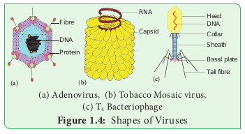
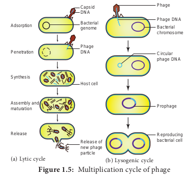
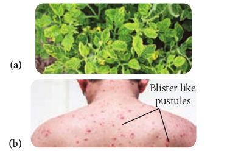

# Viruses

Did you go through the headlines of newspapers in recent times? Have you heard of the terms EBOLA, ZIKA, AIDS, SARS, H1N1 etc.? There are serious entities which are considered as **“Biological Puzzle”** and cause disease in man. They are called viruses. We have learnt about the attributes of living world in the previous chapter. Now we shall discuss about viruses which connect the living and nonliving world.

The word virus is derived from Latin meaning ‘Poison’. Viruses are sub- microscopic, obligate intracellular parasites. They have nucleic acid core surrounded by protein coat. Viruses in their native state contain only a single type of nucleic acid which may be either DNA or RNA. The study of viruses is called **Virology**.

> An American Scientist obtained virus in crystallised form from infected tobacco juice in the year 1935. He was jointly awarded “Nobel Prize” with Dr. J.H. Northrop for Chemistry in 1946.
> 
> **W.M. Stanley (1904-1971)**

## Milestones in Virology

1796 - Edward Jenner used vaccination for small pox

1886 - Adolf Mayer demonstrated the infectious nature of Tobacco mosaic virus using sap of mosaic leaves

1892 - Dimitry Ivanowsky proved that viruses are smaller than bacteria

1898 - M.W. Beijierink defined the infectious agent in tobacco leaves as ῾*Contagium vivum fluidum*’

1915 - F.W.Twort identified Viral infection in Bacteria

1917 - d’Herelle coined the term ‘Bacteriophage’

1984 - Luc Montagnier and Robert Gallo discovered HIV (Human Immuno Deficiency Virus).

## Size and Shape

Viruses are ultramicroscopic particles. They are smaller than bacteria and their diameter range from 20 to 300 nm. (1nm = 10-9metres). Bacteriophage measures about 10-100 nm in size. The size of TMV is 300×20 nm.

Generally viruses are of three types based on shape and symmetry (Figure 1.4).

i. Cuboid symmetry – Example: Adenovirus, Herpes virus.

ii. Helical symmetry – Example: Influenza virus, TMV.

iii. Complex or Atypical – Example: Bacteriophage, Vaccinia virus.

## Characteristic Features of Viruses

**Living Characters**

- Presence of nucleic acid and protein.
- Capable of mutatio.
- Ability to multiply within living cells.
- Able to infect and cause diseases in living beings.
- Show irritability.
- Host –specific

**Non-living Characters**

- Can be crystallized.
- Absence of metabolism.
- Inactive outside the host.
- Do not show functional autonomy.
- Energy producing enzyme system is absent.

## Classification of Viruses

Among various classifications proposed for viruses the classification given by David Baltimore in the year 1971 is given below. The classification is based on mechanism of RNA production, the nature of the genome (single stranded –ss or double stranded - ds), RNA or DNA, the use of reverse transcriptase (RT), ss RNA may be (+) sense or (–) antisense. Viruses are classified into seven classes (Table 1.2).

**Viral genome**
Each virus possesses only one type of nucleic acid either DNA or RNA. The nucleic acid may be in a linear or circular form. Generally nucleic acid is present as a single unit but in wound tumour virus and in influenza virus it is found in segments. The viruses possessing DNA are called **‘Deoxyviruses’** whereas those possessing RNA are called **‘Riboviruses’**. Majority of animal and bacterial viruses are DNA viruses (HIV is the animal virus which possess RNA). Plant viruses generally contain RNA (Cauliflower Mosaic virus possess DNA). The nucleic acids may be single stranded or double stranded. On the basis of nature of nucleic acid viruses are classified into four Categories. They are Viruses with ssDNA (Parvo viruses), dsDNA (Bacteriophages), ssRNA (TMV)and dsRNA(Wound Tumour Virus).

**Table 1.2: Different Classes of viruses**
|Class | Example|
|------|--------|
|Class 1 – Viruses with dsDNA|Adeno viruses|
|Class 2 –Viruses with (+) sense ssDNA|Parvo viruses|
|Class 3 – Viruses with dsRNA | Reo viruses |
|Class 4 – Viruses with (+)sense ssRNA | Toga viruses|
|Class 5 – Viruses with (–)sense ssRNA | Rhabdo viruses |
|Class 6 – Viruses with (+) sense ssRNA –RT: that replicate with DNA intermediate in life cycle |Retro viruses|
|Class 7 – Viruses with ds DNA –RT: that replicate with RNA intermediate in life cycle|Hepadna viruses|

## Tobacco Mosaic Virus (TMV)

Tobacco mosaic virus was discovered in 1892 by Dimitry Ivanowsky from the Tobacco plant. Viruses infect healthy plants through vectors like aphids, locusts etc. The first visible symptom of TMV is discoloration of leaf colour along the veins and show typical yellow and green mottling which is the mosaic symptom. The downward curling and distortion of young apical leaves occurs, plant becomes stunted and yield is affected.

**Structure**
Electron microscopic studies have revealed that TMV is a rod shaped (Figure 1.4b) helical virus measuring about 300x20nm with a molecular weight of 39x106 Daltons. The virion is made up of two constituents, a protein coat called **capsid** and a core called **nucleic acid**. The protein coat is made up of approximately 2130 identical protein subunits called **capsomeres** which are present around a central single stranded RNA molecule. The genetic information necessary for the formation of a complete TMV particle is contained in its RNA. The RNA consists of 6,500 nucleotides.

## Bacteriophage

Viruses infecting bacteria are called **Bacteriophages**. It literally means ‘eaters of bacteria’ (Gr: Phagein = to eat). Phages are abundant in soil, sewage water, fruits, vegetables, and milk.

**Structure of T4 bacteriophage**
The T4 phage is tadpole shaped and consists of head, collar, tail, base plate and fibres (Figure 1.4). The head is hexagonal which consists of about 2000 identical protein subunits. The long helical tail consists of an inner tubular core which is connected to the head by a collar. There is a base plate attached to the end of tail. The base plate contains six spikes and tail fibres. These fibres are used to attach the phage on the cell wall of bacterial host during replication. A dsDNA molecule of about 50 µm is tightly packed inside the head. The DNA is about 1000 times longer than the phage itself.

## Multiplication or Life Cycle of Phages

Phages multiply through two different types of life cycle. a. Lytic or Virulent cycle b. Lysogenic or Avirulent life cycle.

**a. Lytic Cycle**
During lytic cycle of phage, disintegration of host bacterial cell occurs and the progeny virions are released (Figure 1.5a). The steps involved in the lytic cycle are as follows:

**(i) Adsorption**
Phage (T4) particles interact with cell wall of host (_E. coli_). The phage tail makes contact between the two, and tail fibres recognize the specific receptor sites present on bacterial cell surface. The lipopolysaccharides of tail fibres act as receptor in phages. The process involving the recognition of phage to bacterium is called **landing**. Once the contact is established between tail fibres and bacterial cell, tail fibres bend to anchor the pins and base plate to the cell surface. This step is called **pinning.**

**(ii) Penetration**
The penetration process involves mechani- cal and enzymatic digestion of the cell wall of the host. At the recognition site phage digests certain cell wall structure by viral enzyme (lysozyme). After pinning the tail sheath contracts (using ATP) and appears shorter and thicker. After contraction of the base plate enlarges through which DNA is injected into the cell wall without using met- abolic energy. The step involving injection of DNA particle alone into the bacterial cell is called **Transfection**. The empty protein coat leaving outside the cell is known as **‘ghost’**.

**(iii) Synthesis**
This step involves the degradation of bacterial chromosome, protein synthesis and DNA replication. The phage nucleic acid takes over the host biosynthetic machinery. Host DNA gets inactivated and breaks down. Phage DNA suppresses the synthesis of bacterial protein and directs the metabolism of the cell to synthesis the proteins of the phage particles and simultaneously replication of Phage DNA also takes place.

**(iv) Assembly and Maturation**
The DNA of the phage and protein coat are synthesized separately and are assembled to form phage particles. The process of assembling the phage particles is known as **maturation**. After 20 minutes of infection, about 300 new phages are assembled.

**(v) Release**
The phage particle gets accumulated inside the host cell and are released by the lysis of host cell wall.

**Figure 1.5 Multiplication cycle of phage**

**(b) Lysogenic cycle**
In the lysogenic cycle the phage DNA gets integrated into host DNA and gets multiplied along with nucleic acid of the host. No independent viral particle is formed (Figure 1.5b).

As soon as the phage injects its linear DNA into the host cell, it becomes circular and integrates into the bacterial chromosome by recombination. The integrated phage DNA is now called **prophage.** The activity of the prophage gene is repressed by two repressor proteins which are synthesized by phage genes. This checks the synthesis of new phages within the host cell. However, each time the bacterial

> Viruses infecting blue green algae are called **Cyanophages** and are first reported by Safferman and Morris in the year 1963(Example LPP1 - _Lyngbya, Plectonema_ and _Phormidium_). Similarly, Hollings(1962) reported viruses infecting cultivated Mushrooms and causing die back disease. The viruses attacking fungi are called **Mycoviruses** or **Mycophages.**

cell divides, the prophage multiplies along with the bacterial chromosome. On exposure to UV radiation and chemicals the excision of phage DNA may occur and results in lytic cycle.

**Virion** is an intact infective virus particle which is non-replicating outside a host cell.

**Viroid** is a circular molecule of ssRNA without a capsid and was discovered by T.O.Diener in the year 1971. The RNA of viroid has low molecular weight. Viroids cause citrus exocortis and potato spindle tuber disease in plants.

**Virusoids** were discovered by J.W.Randles and Co-workers in 1981.They are the small circular RNAs which are similar to viroids but they are always linked with larger molecules of the viral RNA.

**Prions** were discovered by Stanley B. Prusiner in the year 1982 and are protein- aceous infectious particles. They are the caus- ative agents for about a dozen fatal degenerative disorders of the central nervous system of humans and other animals. For example Creutzfeldt – Jakob Disease (CJD), Bovine Spongiform Encephalopathy (BSE) – com- monly known as mad cow disease and scrapie disease of sheep.

## Viral diseases

Viruses are known to cause disease in plants, animals and Human beings (Figure 1.6). A list of viral disease is given in Table 1.3.

> Streaks on Tulip flowers are due to Tulip Breaking Virus which belong to Potyviridae group.Viruses of Baculoviridae group
> are commercially exploited as insecticides. Cytoplasmic Polyhedrosis Granulo viruses and Entomopox viruses were employed as potential insecticides.
> 

**Figure 1.6: Viral Diseases (a) Mosaic disease of tomato, (b) Symptom of Chicken pox**

**Table 1.3: Viral Diseases**
|Plant diseases | Animal diseases | Human diseases|
|---------------|-----------------|--------------|
|1.Tobacco mosaic 2. Cauliflower mosaic 3. Sugarcane mosaic 4. Potato leaf roll 5. Bunchy top of banana 6. Leaf curl of papaya 7. Vein clearing of Lady’s finger 8. Rice Tungro disease 9. Cucumber mosaic 10. Tomato mosaic disease | 1. Foot and m cattle 2. Rabies of dog 3. Encephalom|1.Common cold 2. Hepatitis B 3. Cancer 4. SARS(Severe Acute Respiratory Syndrome) 5. AIDS(Acquired Immuno Deficiency Syndrome )6. Rabies 7. Mumps7. Mumps 8. Polio 9. Chikungunya 10. Small Pox 11. Chicken pox 12. Measles|
