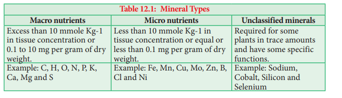
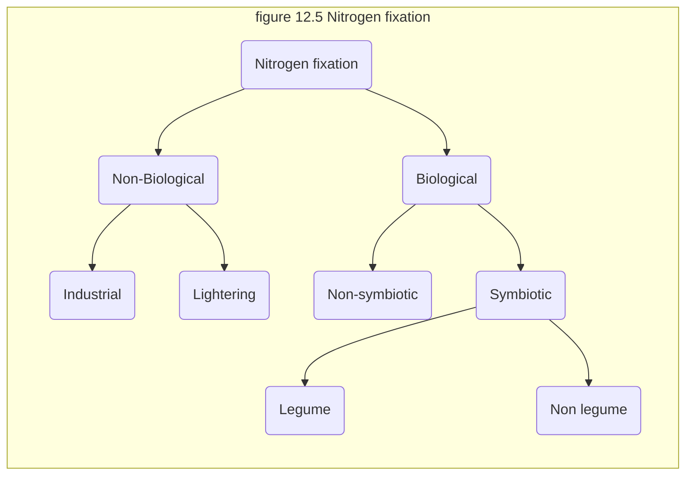
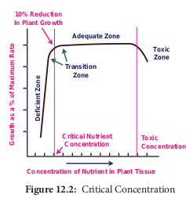
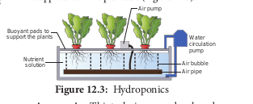
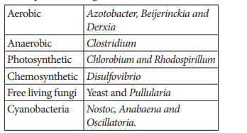
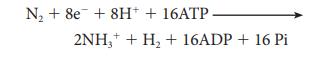
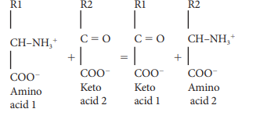
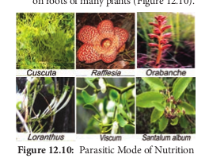

As a traveller you would have got a chance to observe the plants. It is an interesting fact that all plants are not alike. Just spend some time to observe the nature. You can notice plants with attractive leaves, flowers and fruits.

Can you say all plants are healthy and uniform in growth? Some plants are not healthy and show symptoms like texture changes, stunted growth, chlorosis, necrosis and so on. Can you tell what is the reason for all these symptoms? It may be due to infection of microbial pathogens or climatic factors or due to mineral deficiency.

In this chapter we are going to learn about classification of minerals, their functions, deficiency diseases and symptoms, nitrogen metabolism and special modes of nutrition. Further, how can these ideas help us to improve productivity in agriculture?

Plants naturally obtain nutrients from atmosphere, water and soil. Carbon, hydrogen and oxygen are called as skeletal elements and constitute about 94% of dry weight. These elements play an important role in the formation of organic compounds such as carbohydrates, fats and protein. These non-mineral elements are obtained from air and water. Minerals are classified based on essentiality. **Arnon** and **Stout** (1939) gave criteria required for essential minerals: 

1. Elements necessary for growth and development. 

2. They should have direct role in the metabolism of the plant. 

3. It cannot be replaced by other elements. 

4. Deficiency makes the plants impossible to complete their vegetative and reproductive phase.

# 12.1 Classification of minerals 

## 12.1.1 Classification of minerals based ontheir quantity requirements 

Essential elements are classified as **Macro-nutrients Micronutrients** and **Unclassified minerals** based on their requirements. Essential minerals which are required in higher concentration are called Macronutrients. Essential minerals which are required in less concentration called are as Micronutrients.

Minerals like Sodium, Silicon, Cobalt and Selenium are not included in the list of essential nutrients but are required by some plants, these minerals are placed in the list of unclassified minerals. These minerals play specific roles for example, Silicon is essential for pest resistance, prevent water lodging and aids cell wall formation in Equisetaceae (Equisetum), Cyperaceae and Gramineae (Table 12. 1).

### 12.1.2 Classification of minerals based on mobility

If you observe where the deficiency symptoms appear first, you can notice differences in old and younger leaves. It is mainly due to mobility of minerals. Based on this, they are classified into 1. Actively mobile minerals and 2. Relatively immobile minerals (Figure 12.1).

**a. Actively mobile minerals** 

Nitrogen, Phosphorus, Potassium, Magnesium, Chlorine, Sodium, Zinc and Molybdenum.

Deficiency symptoms first appear on old and senescent leaves due to active movement of minerals to younger leaves.

**b. Relatively immobile minerals** 

Calcium, Sulphur, Iron, Boron and Copper shows deficiency symptoms first that appear

  
on young leaves due to the immobile nature of minerals

`table` 12.1
| Classification                 | Description                                          | Example                                         |
|------------------------------|-------------------------------------------------------|-------------------------------------------------|
| Macro nutrients (Primary)      | Elements required by plants in large amounts          |  C, H, O, N, P, K, Ca, Mg and S                  |
| Micro nutrients (Secondary)  | Elements required by plants in small amounts         | Fe, Mn, Cu, Mo, Zn, B, Cl and Ni                |
| Unclassified minerals         | Required for some plants in trace amounts and have some specific functions |  Sodium, Cobalt, Silicon and Selenium           |

### 12.1.3 Classification of minerals based on their functions

**a. Structural component minerals:** 

Minerals like Carbon, Hydrogen, Oxygen and Nitrogen

**b. Enzyme function**: 

**b. Enzyme function**: 

Molybdenum (Mo) is essential for nitrogenase enzyme during reduction of atmospheric nitrogen into ammonia. Zinc (Zn)is an important activator for alcohol dehydrogenase and carbonic anhydrase. Magnesium (Mg) is the activator for RUBP carboxylase- oxygenase and PEP carboxylase. Nickel (Ni) is a constituent of urease and hydrogenase.

**c. Osmotic Potential:** 

Potassium (K) plays a key role in maintaining osmotic potential of the cell. The absorption of water, movement of stomata and turgidity are due to osmotic potential.

**d. Energy components:** 

Magnesium (Mg) in chlorophyll and phosphorous (P) in ATP.
# 12.2 Functions, mode of absorption and deficiency symptoms of macronutrients

Macronutrients, their functions, their mode of absorption, deficiency symptoms and deficiency diseases are discussed here:

Macronutrients, their functions, their mode of absorption, deficiency symptoms and deficiency diseases are discussed here:  

**1. Nitrogen (N):** 

It is required by the plants in greatest amount. It is an essential component of proteins, nucleic acids, amino acids, vitamins, hormones, alkaloids, chlorophyll and cytochrome. It is absorbed by the plants as nitrates (NO3).

**Deficiency symptoms:** Chlorosis, stunted growth, anthocyanin formation.

**2. Phosphorus (P):** 

Constituent of cell membrane, proteins, nucleic acids, ATP, NADP, phytin and sugar phosphate. It is absorbed as H2PO4 1 and HPO4 2 ions.

**Deficiency symptoms:** 
Stunted growth, anthocyanin formation, necrosis, inhibition of cambial activity, affect root growth and fruit ripening.

**3. Potassium (K):** 
Maintains turgidity and osmotic potential of the cell, opening and closure of stomata, phloem translocation, stimulate activity of enzymes, anion and cation balance by ion-exchange. It is absorbed as K1 ions.

**Deficiency symptoms:** 
Marginal chlorosis, necrosis, low cambial activity, loss of apical dominance, lodging in cereals and curled leaf margin.

**4. Calcium (Ca):** 

It is involved in synthesis of calcium pectate in middle lamella, mitotic spindle formation, mitotic cell division, permeability of cell membrane, lipid metabolism, activation of phospholipase, ATPase, amylase and activator of adenyl kinase. It is absorbed as Ca21 exchangeable ions.

**Deficiency symptoms:** 

Chlorosis, necrosis, stunted growth, premature fall of leaves and flowers, inhibit seed formation, Black heart of Celery, Hooked leaf tip in Sugar beet, Musa and Tomato.

**5. Magnesium (Mg):** 

It is a constituent of chlorophyll, activator of enzymes of carbohydrate metabolism (RUBP Carboxylase and PEP Carboxylase) and involved in the synthesis of DNA and RNA. It is essential for binding of ribosomal sub units. It is absorbed as Mg21 ions.

**6. Sulphur (S):** Essential component of amino acids like cystine, cysteine and methionine, constituent of coenzyme A, Vitamins like biotin and thiamine, constituent of proteins and ferredoxin. plants utilise sulphur as sulphate (SO42) ions.

**Deficiency symptoms:** Chlorosis, anthocyanin formation, stunted growth, rolling of leaf tip and reduced nodulation in legumes.

# 12.3 Functions, mode of absorption and deficiency symptoms of micronutrients

Micronutrients even though required in trace amounts are essential for the metabolism of plants. They play key roles in many plants. Example: Boron is essential for translocation of sugars, molybdenum is involved in nitrogen metabolism and zinc is needed for biosynthesis of auxin. Here, we will study about the role of micro nutrients, their functions, their mode of absorption, deficiency symptoms and deficiency diseases. 

**1. Iron (Fe):** 

Iron is required lesser than macronutrient and larger than micronutrients, hence, it can be placed in any one of the groups. Iron is an essential element for the synthesis of chlorophyll and carotenoids. It is the component of cytochrome, ferredoxin, flavoprotein, formation of chlorophyll, porphyrin, activation of catalase, peroxidase enzymes. It is absorbed as ferrous (Fe21) and ferric (Fe31) ions. Absorbtion of Fe2+ ions are comparitively more than Fe3+ ions. Mostly fruit  trees are sensitive to iron. 

**Deficiency:** Interveinal Chlorosis, formation of short and slender stalk and inhibition of chlorophyll formation.

**2. Manganese (Mn):** 

Activator of carboxylases, oxidases, dehydrogenases and kinases, involved in splitting of water to liberate oxygen (photolysis). It is absorbed as manganous (Mn21) ions.

**Deficiency:** Interveinal chlorosis, grey spot on oats leaves and poor root system.

**3. Copper (Cu):** 

Constituent of plastocyanin, component of phenolases, tyrosinase, enzymes involved in redox reactions, synthesis of ascorbic acid, maintains carbohydrate and nitrogen balance, part of oxidase and cytochrome oxidase. It is absorbed as cupric (Cu21) ions.

**Deficiency:** Die back of citrus, Reclamation disease of cereals and legumes, chlorosis, necrosis and Exanthema in Citrus.

**4. Zinc (Zn):** 

Essential for the synthesis of Indole acetic acid (Auxin), activator of carboxylases, alcohol dehydrogenase, lactic dehydrogenase, glutamic acid dehydrogenase, carboxy peptidases and tryptophan synthetase. It is absorbed as Zn21 ions.

**5. Boron (B):** 

Translocation of carbohydrates, uptake and utilisation of Ca11, pollen germination, nitrogen metabolism, fat metabolism, cell elongation and differen- tiation. It is absorbed as (borate) BO32 ions.

**Deficiency:** Death of root and shoot tips, premature fall of flowers and fruits, brown heart of beet root, internal cork of apple and fruit cracks.

**6. Molybdenum (Mo):** 

Component of nitrogenase, nitrate reductase, involved in nitrogen metabolism, and nitrogen fixation. It is absorbed as molybdate (Mo21) ions.

**Deficiency:** Chlorosis, necrosis, delayed flowering, retarded growth and whip tail disease of cauliflower.

**7. Chlorine (Cl):** 

It is involved in Anion – Cation balance, cell division, photolysis of water. It is absorbed as Cl2 ions.

**Deficiency:** Wilting of leaf tips

**8. Nickel (Ni):** Cofactor for enzyme urease and hydrogenase.

**Deficiency:** Necrosis of leaf tips.

# 12.4 Deficiency diseases and symptoms
 The following table (Table 12.2) gives you an idea Minerals and their Deficiency symptoms:

`table`
| Name of deficiency disease and symptoms | Deficiency minerals |
|---|---|
| Chlorosis (Overall) | Nitrogen, Potassium, Magnesium, Sulphur, Iron, Manganese, Zinc and Molybdenum. |
|  a. Interveinal chlorosis | Magnesium, Iron, Manganese and Zinc |
|  b. Marginal chlorosis | Potassium |
| Necrosis (Death of the tissue) | Magnesium, Potassium, Calcium, Zinc, Molybdenum and Copper. |
| Stunted growth | Nitrogen, Phosphorus, Calcium, Potassium and Sulphur. |
| Anthocyanin formation | Nitrogen, Phosphorus, Magnesium and Sulphur |
| Delayed flowering | Nitrogen, Sulphur and Molybdenum |
| Die back of shoot, Reclamation disease, Exanthema in citrus (gums on bark) | Copper |
| Hooked leaf tip | Calcium |
| Little Leaf | Zinc |
| Brown heart of Beet root and Internal cork of apple | Boron |
| Whiptail of cauliflower and cabbage | Molybdenum |
| Curled leaf margin | Potassium |

# 12.5 Critical concentration and toxicity of minerals

## 12.5.1  Critical Concentration

To increase the productivity and also to avoid mineral toxicity knowledge of critical concentration is essential. Mineral nutrients lesser than critical concentration cause deficiency symptoms. Increase of mineral nutrients more than the normal concentration causes toxicity. A concentration, at which 10 % of the dry weight of tissue is reduced, is considered as toxic. Figure 12.2 explains about Critical Concentration.

### 12.5.2 Mineral Toxicity 

**a. Manganese toxicity**

Increased Concentration of Manganese will prevent the uptake of Fe and Mg, prevent translocation of Ca to the shoot apex and cause their deficiency. The symptoms of manganese toxicity are appearance of brown spots surrounded by chlorotic veins.

**b. Aluminium Toxicity** 

Aluminium toxicity causes precipitation of nucleic acid inhibition of ATPase, inhibition of cell division and binding of plasma membrane with Calmodulin.

For theories regarding, translocation of minerals please refer Chapter- 11.  

# 12.6 Hydroponics and Aeroponics 

**1. Hydroponics or Soilless culture:Von Sachs** 

developed a method of growing plants in nutrient solution. The commonly used nutrient solutions are **Knop solution** (1865) and **Arnon** and **Hoagland** **Solution** (1940). Later the term Hydroponics was coined by **Goerick** (1940) and he also introduced commercial techniques for hydroponics. In hydroponics roots are immersed in the solution containing nutrients and air is supplied with help of tube (Figure 12.3).

**Aeroponics:** This technique was developed by **Soifer Hillel** and **David Durger**. It is a system where roots are suspended in air and nutrients are sprayed over the roots by a motor driven rotor (Figure 12.4).

# 12.7 Nitrogen Fixation

 Inspiring act of nature is self-regulation. As all living organisms act as tools for biogeochemical cycles, nitrogen cycle is highly regulated. Life on earth depends on nitrogen cycle. Nitrogen occurs in atmosphere in the form of N2 (N≡N), two nitrogen atoms joined together by strong triple covalent bonds. The process of converting atmospheric nitrogen (N2) into ammonia is termed as nitrogen fixation. Nitrogen fixation can occur by two methods: 1. Biological; 2. Non-Biological (Figure 12.5).

##  12.7.1 Non – Biological nitrogen fixation

 - Nitrogen fixation by chemical process in

**5. Boron (B):** Translocation of carbohydrates, uptake and utilisation of Ca11, pollen germination, nitrogen metabolism, fat metabolism, cell elongation and differen- tiation. It is absorbed as (borate) BO32 ions.

**Deficiency:** Death of root and shoot tips, premature fall of flowers and fruits, brown heart of beet root, internal cork of apple and fruit cracks.

**6. Molybdenum (Mo):** Component of nitrogenase, nitrate reductase, involved in nitrogen metabolism, and nitrogen fixation. It is absorbed as molybdate (Mo21) ions.

**Deficiency:** Chlorosis, necrosis, delayed flowering, retarded growth and whip tail disease of cauliflower.

**7. Chlorine (Cl):** It is involved in Anion – Cation balance, cell division, photolysis of water. It is absorbed as Cl2 ions.

**Deficiency:** Wilting of leaf tips

## Deficiency diseases and symptoms

The following table (Table 12.2) gives you an idea about Minerals and their Deficiency symptoms:

**Table 12.2: Deficiency disease and symptoms**

|                 Name of the deficiency disease and symptoms                  |                              Deficiency minerals                              |
| :--------------------------------------------------------------------------: | :---------------------------------------------------------------------------: |
|                            1. Chlorosis (Overall)                            | Nitrogen, Potassium, Magnesium, Sulphur, Iron,Manganese, Zinc and Molybdenum. |
|                           a. Interveinal chlorosis                           |                     Magnesium, Iron, Manganese and Zinc.                      |
|                            b. Marginal chlorosis                             |                                  Potassium.                                   |
|                      2. Necrosis (Death of the tissue)                       |          Magnesium, Potassium, Calcium, Zinc, Molybdenumand Copper.           |
|                              3. Stunted growth                               |             Nitrogen, Phosphorus, Calcium, Potassium and Sulphur.             |
|                           4. Anthocyanin formation                           |                  Nitrogen, Phosphorus, Magnesium and Sulphur                  |
|                             5. Delayed flowering                             |                       Nitrogen, Sulphur and Molybdenum                        |
| 6. Die back of shoot, Reclamation disease,Exanthema in citrus (gums on bark) |                                    Copper                                     |
|                              7. Hooked leaf tip                              |                                    Calcium                                    |
|                                8. Little Leaf                                |                                     Zinc                                      |
|            9. Brown heart of Beet root and Internalcork of apple             |                                     Boron                                     |
|                   10. Whiptail of cauliflower and cabbage                    |                                  Molybdenum                                   |
|                            11. Curled leaf margin                            |                                   Potassium                                   |

## Critical concentration and toxicity of minerals

### Critical Concentration

To increase the productivity and also to avoid mineral toxicity knowledge of critical concentration is essential. Mineral nutrients lesser than critical concentration cause deficiency symptoms. Increase of mineral nutrients more than the normal concentration causes toxicity. A concentration, at which 10 % of the dry weight of tissue is reduced, is considered as toxic. Figure ##12.2 explains about Critical Concentration.

### Mineral Toxicity

**a. Manganese toxicity**
Increased Concentration of Manganese will prevent the uptake of Fe and Mg, prevent translocation of Ca to the shoot apex and cause their deficiency. The symptoms of manganese toxicity are appearance of brown spots surrounded by chlorotic veins.
####b. Aluminium Toxicity
Aluminium toxicity causes precipitation of nucleic acid, inhibition of ATPase, inhibition of cell division and binding of plasma membrane with Calmodulin.For theories regarding, translocation of minerals please refer Chapter- 11.

## Hydroponics and Aeroponics

**1. Hydroponics or Soilless culture:Von Sachs** developed a method of growing plants in nutrient solution. The commonly used nutrient solutions are **Knop solution** (1865) and **Arnon** and **Hoagland** **Solution** (1940). Later the term Hydroponics was coined by **Goerick** (1940) and he also introduced commercial techniques for hydroponics. In hydroponics roots are immersed in the solution containing nutrients and air is supplied with help of tube (Figure 12.3).

**Aeroponics:** This technique was developed by **Soifer Hillel** and **David Durger**. It is a system where roots are suspended in air and nutrients are sprayed over the roots by a motor driven rotor (Figure 12.4).

# 12.7 Nitrogen Fixation

 Inspiring act of nature is self-regulation. As all living organisms act as tools for biogeochemical cycles, nitrogen cycle is highly regulated. Life on earth depends on nitrogen cycle. Nitrogen occurs in atmosphere in the form of N2 (N≡N), two nitrogen atoms joined together by strong triple covalent bonds. The process of converting atmospheric nitrogen (N2) into ammonia is termed as nitrogen fixation. Nitrogen fixation can occur by two methods: 1. Biological; 2. Non-Biological (Figure 12.5).

##  12.7.1 Non – Biological nitrogen fixation

 - Nitrogen fixation by chemical process in

- Nitrogen fixation by chemical process inindustry.
- Natural electrical discharge during
  lightening fixes atmospheric nitrogen.

### 12.7.2 Biological nitrogen fixation

 Symbiotic bacterium like Rhizobium fixes atmospheric nitrogen. Cyanobacteria found in Lichens, Anthoceros, Azolla and coralloid roots of Cycas also fix nitrogen. Non-symbiotic (free living bacteria) like Clostridium also fix nitrogen.

**a. Symbiotic nitrogen fixation**

**i. Nitrogen fixation with nodulation** 

Rhizobium bacterium is found in leguminous plants and fix atmospheric nitrogen. This kind of symbiotic association is beneficial for both the bacterium and plant. Root nodules are formed due to bacterial infection. Rhizobium enters into the host cell and proliferates, it remains separated from the host cytoplasm by a membrane (Figure 12.6).  

**Stages of Root nodule formation:**

1. Legume plants secretes phenolics which attracts Rhizobium. 

2. Rhizobium reaches the rhizosphere and enters into the root hair, infects the root hair and leads to curling of root hairs.

3. Infection thread grows inwards and separates the infected tissue from normal tissue.

4. A membrane bound bacterium is formed inside the nodule and is called **bacteroid**.

5. Cytokinin from bacteria and auxin from host plant promotes cell division and leads to nodule formation

**Non-Legume** 

Alnus and Casuarina contain the bacterium Frankia. Psychotria contains the bacterium Klebsiella. 

**ii. Nitrogen fixation without nodulation** 

The following plants and prokaryotes are involved in nitrogen fixation.
  

Lichens - Anabaena and Nostoc Anthoceros - Nostoc 
Azolla - Anabaena azollae 
Cycas - Anabaena and Nostoc

**b. Non-symbiotic Nitrogen fixation** 

Free living bacteria and fungi also fix atmospheric nitrogen.

# 12.8 Nitrogen cycle and nitrogen metabolism

## 12.8.1 Nitrogen cycle
 This cycle consists of following stages: 
 
 **1. Fixation of atmospheric nitrogen** 
 
 Di-nitrogen molecule from the atmosphere progressively gets reduced by addition of a pair of hydrogen atoms. Triple bond between two nitrogen atoms (N≡N) are cleaved to produce ammonia (Figure 12.7).

Nitrogen fixation process requires Nitrogenase enzyme complex, Minerals (Mo, Fe and S), anaerobic condition, ATP, electron and glucose 6 phosphate as H1 donor. Nitrogenase enzyme is active only in anaerobic condition. To create this anaerobic condition a pigment known as **leghaemoglobin** is synthesized in the nodules which acts as oxygen scavenger and removes the oxygen. Nitrogen fixing bacteria in root nodules appears pinkish due to the presence of this leghaemoglobin pigment. 

Overall equation:

  

**2. Nitrification** 

Ammonia (NH31) is converted into Nitrite (NO22) by Nitrosomonas bacterium. Nitrite is then converted into Nitrate (NO32) by Nitrobacter bacterium.

Plants are more adapted to absorb nitrate (NO32) than ammonium ions from the soil.

**3. Nitrate Assimilation** 

The process by which nitrate is reduced to ammonia is called **nitrate assimilation** and occurs during nitrogen cycle.

**4. Ammonification** 

Decomposition of organic nitrogen (proteins and amino acids) from dead plants and animals into ammonia is called **ammonification**. Organisim involved in this process are Bacillus ramosus and Bacillus vulgaris.

**5. Denitrification**

Nitrates in the soil are converted back into atmospheric nitrogen by a process called **denitrification**. Bacteria involved in this process are Pseudomonas, Thiobacillus and Bacillus subtilis.

Nitrate Molecular Nitrogen (NO3

The overall process of nitrogen cycle is given in Figure 12.8.

### 12.8.2 Nitrogen Metabolism Ammonium Assimilation (Fate of Ammonia)

 Ammonia is converted into amino acids by the following processes: 
 
**1. Reductive amination** 

Glutamic acid or glutamate is formed by reaction of ammonia with α-ketoglutaric acid.

**2. Transamination** 

Transfer of amino group (NH31) from glutamic acid (glutamate) to keto group of keto acid. Glutamic acid is the main amino acid from which other amino acids are synthesised by transamination. Transamination requires the enzyme transaminase and co enzyme pyridoxal phosphate (derivative of vitamin B6 -pyridoxine) 

**3. Catalytic Amination: (GS/GOGAT Pathway)**

**3. Catalytic Amination: (GS/GOGAT Pathway)**
Glutamate amino acid combines with ammonia to form the amide glutamine.

Glutamine reacts with α ketoglutaric acid to form two molecules of glutamate.

Glutamine 1 α Ketoglutaric acid 2 Glutamate GOGAT (enzyme)

NADH1H1 NAD1 (2- oxoglutarate)

(GOGAT- Glutamine-2-Oxoglutarate aminotransferase)

# 12.9 Special modes of nutrition
 
Nutrition is the process of uptake and utilization of nutrients by living organisms. There are two main types such as **autotrophic** and **heterotrophic** nutrition. Autotrophic nutrition is further divided into **photosynthetic** and **chemosynthetic** nutrition. Heterotrophic nutrition is further divided into saprophytic, parasitic, symbiotic and insectivorous type. In this topic you are going to learn about special mode of nutrition. 

## 12.9.1 Saprophytic mode of nutrition in angiosperms** 

Saprophytes derive nutrients from dead and decaying matter. Bacteria and fungus are main saprophytic organisms. Some angiosperms also follow saprophytic mode of nutrition. Example: Neottia. Roots of Neottia (Bird’s Nest Orchid) associate with mycorrhizae and absorb nutrients as a saprophyte. Monotropa (Indian Pipe) grow on humus rich soil found in thick forests. It absorbs nutrient through mycorrhizal association (Figure 12.9).

**Neottia** **Monotropa** (Bird's Nest Orchid) (Indian Pipe)

## Special modes of nutrition

Nutrition is the process of uptake and utilization of nutrients by living organisms. There are two main types such as **autotrophic** and **heterotrophic** nutrition. Autotrophic nutrition is further divided into **photosynthetic** and **chemosynthetic** nutrition. Heterotrophic nutrition is further divided into saprophytic, parasitic, symbiotic and insectivorous type. In this topic you are going to learn about special mode of nutrition.

### 12.9.2 Parasitic mode of nutrition in angiosperms

Organisms deriving their nutrient from another organism (host) and causing disease to the host are called parasites. 

**a.** **Obligate or Total parasite** - Completely

depends on host for their survival and produces haustoria.

i. **Total stem parasite**: The leafless stem twine around the host and produce haustoria. Example: Cuscuta (Dodder), a rootless plant growing on Zizyphus, Citrus and so on.

ii. **Total root parasite**: They do not have stem axis and grow in the roots of host plants produce haustoria. Example: Rafflesia, Orobanche and Balanophora.

**b. Partial parasite** - Plants of this group contain chlorophyll and synthesize carbohydrates. Water and mineral requirements are dependent on host plant. 

i. **Partial Stem Parasite**: Example:

Loranthus and Viscum (Mistletoe) Loranthus grows on fig and mango trees and absorb water and minerals from xylem.  

ii. **Partial root parasite**: Example: Santalum album (Sandal wood tree) in its juvenile stage produces haustoria which grows on roots of many plants (Figure 12.10).

### 12.9.3 Symbiotic mode of Nutrition
 

a. **Lichens**: It is a mutual association of Algae and Fungi. Algae prepares food and fungi absorbs water and provides thallus structure.

b. **Mycorrhizae**: Fungi associated with roots of higher plants including Gymnosperms. Example: Pinus.

c. **Rhizobium and Legumes**: This symbiotic association fixes atmospheric nitrogen

d. **Cyanobacteria and Coralloid Roots**: This association is found in Cycas where Nostoc associates with its coralloid roots. (Figure 12.11).

### 12.9.4 Insectivorous mode of nutrition
 Plants which are growing in nitrogen deficient areas develop insectivorous habit to resolve nitrogen deficiency. These plants obtain nitrogen from the insects
 
a. **Nepenthes** (Pitcher plant): Pitcher is a modified leaf and contains digestive enzymes. Rim of the pitcher is provided with nectar glands and acts as an attractive lid. When insect is trapped, proteolytic enzymes will digest the insect.

b. **Drosera** (Sundew): It consists of long club shaped leaves with tentacles that secrete sticky digestive fluid which looks like a sundew and attracts insects.

c. **Utricularia** (Bladder wort): Submerged plant in which leaf is modified into a bladder to collect insect in water.

d. **Dionaea** (Venus fly trap): Leaf of this plant modified into a colourful trap. Two folds of lamina consist of sensitive trigger hairs and when insects touch the hairs it will close and traps the insects.(Figure 12.12).

