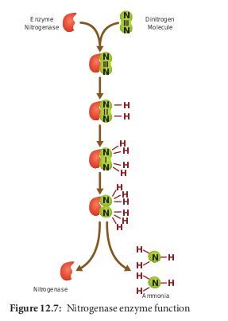
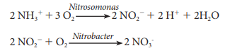
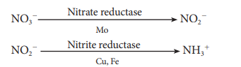
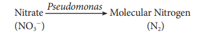
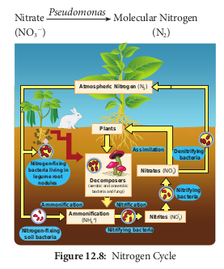
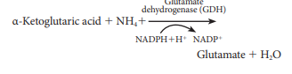

#  Nitrogen cycle and nitrogen metabolism

##  Nitrogen cycle
 This cycle consists of following stages: 
 
 **1. Fixation of atmospheric nitrogen** 
 
 Di-nitrogen molecule from the atmosphere progressively gets reduced by addition of a pair of hydrogen atoms. Triple bond between two nitrogen atoms (N≡N) are cleaved to produce ammonia (Figure 12.7).

Nitrogen fixation process requires Nitrogenase enzyme complex, Minerals (Mo, Fe and S), anaerobic condition, ATP, electron and glucose 6 phosphate as H1 donor. Nitrogenase enzyme is active only in anaerobic condition. To create this anaerobic condition a pigment known as **leghaemoglobin** is synthesized in the nodules which acts as oxygen scavenger and removes the oxygen. Nitrogen fixing bacteria in root nodules appears pinkish due to the presence of this leghaemoglobin pigment. 

`formulae`
Overall equation:

  

**2. Nitrification** 

Ammonia (NH31) is converted into Nitrite (NO22) by Nitrosomonas bacterium. Nitrite is then converted into Nitrate (NO32) by Nitrobacter bacterium.

Plants are more adapted to absorb nitrate (NO32) than ammonium ions from the soil.

`formulae`

**3. Nitrate Assimilation** 

The process by which nitrate is reduced to ammonia is called **nitrate assimilation** and occurs during nitrogen cycle.

`formulae`

**4. Ammonification** 

Decomposition of organic nitrogen (proteins and amino acids) from dead plants and animals into ammonia is called **ammonification**. Organisim involved in this process are Bacillus ramosus and Bacillus vulgaris.

**5. Denitrification**

Nitrates in the soil are converted back into atmospheric nitrogen by a process called **denitrification**. Bacteria involved in this process are Pseudomonas, Thiobacillus and Bacillus subtilis.

`formulae`

Nitrate Molecular Nitrogen (NO3

The overall process of nitrogen cycle is given in Figure 12.8.

### 12.8.2 Nitrogen Metabolism Ammonium Assimilation (Fate of Ammonia)

 Ammonia is converted into amino acids by the following processes: 
 
**1. Reductive amination** 

Glutamic acid or glutamate is formed by reaction of ammonia with α-ketoglutaric acid.

`formulae`

**2. Transamination** 

Transfer of amino group (NH31) from glutamic acid (glutamate) to keto group of keto acid. Glutamic acid is the main amino acid from which other amino acids are synthesised by transamination. Transamination requires the enzyme transaminase and co enzyme pyridoxal phosphate (derivative of vitamin B6 -pyridoxine) 

`formulae`

**3. Catalytic Amination: (GS/GOGAT Pathway)**

Glutamate amino acid combines with ammonia to form the amide glutamine.

Glutamine reacts with α ketoglutaric acid to form two molecules of glutamate.

Glutamine 1 α Ketoglutaric acid 2 Glutamate GOGAT (enzyme)

NADH1H1 NAD1 (2- oxoglutarate)

(GOGAT- Glutamine-2-Oxoglutarate aminotransferase)
