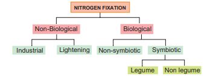
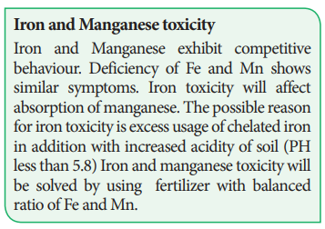
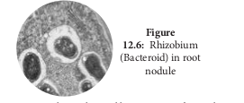

#  Nitrogen Fixation

 Inspiring act of nature is self-regulation. As all living organisms act as tools for biogeochemical cycles, nitrogen cycle is highly regulated. Life on earth depends on nitrogen cycle. Nitrogen occurs in atmosphere in the form of N2 (N≡N), two nitrogen atoms joined together by strong triple covalent bonds. The process of converting atmospheric nitrogen (N2) into ammonia is termed as nitrogen fixation. Nitrogen fixation can occur by two methods: 1. Biological; 2. Non-Biological (Figure 12.5).

##  Non – Biological nitrogen fixation

 - Nitrogen fixation by chemical process in

industry. 
- Natural electrical discharge during

lightening fixes atmospheric nitrogen.

###  Biological nitrogen fixation

 Symbiotic bacterium like Rhizobium fixes atmospheric nitrogen. Cyanobacteria found in Lichens, Anthoceros, Azolla and coralloid roots of Cycas also fix nitrogen. Non-symbiotic (free living bacteria) like Clostridium also fix nitrogen.

**a. Symbiotic nitrogen fixation**

**i. Nitrogen fixation with nodulation** 

Rhizobium bacterium is found in leguminous plants and fix atmospheric nitrogen. This kind of symbiotic association is beneficial for both the bacterium and plant. Root nodules are formed due to bacterial infection. Rhizobium enters into the host cell and proliferates, it remains separated from the host cytoplasm by a membrane (Figure 12.6).  

**Stages of Root nodule formation:**

1. Legume plants secretes phenolics which attracts Rhizobium. 

2. Rhizobium reaches the rhizosphere and enters into the root hair, infects the root hair and leads to curling of root hairs.

3. Infection thread grows inwards and separates the infected tissue from normal tissue.

4. A membrane bound bacterium is formed inside the nodule and is called **bacteroid**.

5. Cytokinin from bacteria and auxin from host plant promotes cell division and leads to nodule formation

**Non-Legume** 

Alnus and Casuarina contain the bacterium Frankia. Psychotria contains the bacterium Klebsiella. 

**ii. Nitrogen fixation without nodulation** 

The following plants and prokaryotes are involved in nitrogen fixation.
  

Lichens - Anabaena and Nostoc Anthoceros - Nostoc 
Azolla - Anabaena azollae 
Cycas - Anabaena and Nostoc

**b. Non-symbiotic Nitrogen fixation** 

Free living bacteria and fungi also fix atmospheric nitrogen.

`table`

