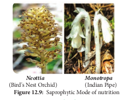
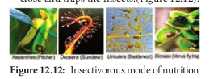

#  Special modes of nutrition
 
Nutrition is the process of uptake and utilization of nutrients by living organisms. There are two main types such as **autotrophic** and **heterotrophic** nutrition. Autotrophic nutrition is further divided into **photosynthetic** and **chemosynthetic** nutrition. Heterotrophic nutrition is further divided into saprophytic, parasitic, symbiotic and insectivorous type. In this topic you are going to learn about special mode of nutrition. 

##  Saprophytic mode of nutrition in angiosperms** 

Saprophytes derive nutrients from dead and decaying matter. Bacteria and fungus are main saprophytic organisms. Some angiosperms also follow saprophytic mode of nutrition. Example: Neottia. Roots of Neottia (Bird’s Nest Orchid) associate with mycorrhizae and absorb nutrients as a saprophyte. Monotropa (Indian Pipe) grow on humus rich soil found in thick forests. It absorbs nutrient through mycorrhizal association (Figure 12.9).

**Neottia** **Monotropa** (Bird's Nest Orchid) (Indian Pipe)

### 12.9.2 Parasitic mode of nutrition in angiosperms

Organisms deriving their nutrient from another organism (host) and causing disease to the host are called parasites. 

**a.** **Obligate or Total parasite** - Completely

depends on host for their survival and produces haustoria.

i. **Total stem parasite**: The leafless stem twine around the host and produce haustoria. Example: Cuscuta (Dodder), a rootless plant growing on Zizyphus, Citrus and so on.

ii. **Total root parasite**: They do not have stem axis and grow in the roots of host plants produce haustoria. Example: Rafflesia, Orobanche and Balanophora.

**b. Partial parasite** - Plants of this group contain chlorophyll and synthesize carbohydrates. Water and mineral requirements are dependent on host plant. 

i. **Partial Stem Parasite**: Example:

Loranthus and Viscum (Mistletoe) Loranthus grows on fig and mango trees and absorb water and minerals from xylem.  

ii. **Partial root parasite**: Example: Santalum album (Sandal wood tree) in its juvenile stage produces haustoria which grows on roots of many plants (Figure 12.10).

### 12.9.3 Symbiotic mode of Nutrition
 
 
a. **Lichens**: It is a mutual association of Algae and Fungi. Algae prepares food and fungi absorbs water and provides thallus structure.

b. **Mycorrhizae**: Fungi associated with roots of higher plants including Gymnosperms. Example: Pinus.

c. **Rhizobium and Legumes**: This symbiotic association fixes atmospheric nitrogen

d. **Cyanobacteria and Coralloid Roots**: This association is found in Cycas where Nostoc associates with its coralloid roots. (Figure 12.11).

### 12.9.4 Insectivorous mode of nutrition
 Plants which are growing in nitrogen deficient areas develop insectivorous habit to resolve nitrogen deficiency. These plants obtain nitrogen from the insects
 
a. **Nepenthes** (Pitcher plant): Pitcher is a modified leaf and contains digestive enzymes. Rim of the pitcher is provided with nectar glands and acts as an attractive lid. When insect is trapped, proteolytic enzymes will digest the insect.

b. **Drosera** (Sundew): It consists of long club shaped leaves with tentacles that secrete sticky digestive fluid which looks like a sundew and attracts insects.

c. **Utricularia** (Bladder wort): Submerged plant in which leaf is modified into a bladder to collect insect in water.

d. **Dionaea** (Venus fly trap): Leaf of this plant modified into a colourful trap. Two folds of lamina consist of sensitive trigger hairs and when insects touch the hairs it will close and traps the insects.(Figure 12.12).

