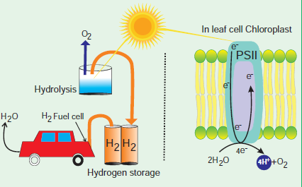

# Chapter Outline

**13.1** Definition, Significance and Site of photosynthesis
**13.2** Photosynthetic pigments
**13.3** Spectrum of electromagnetic radiation
**13.4** Photosynthetic unit
**13.5** Absorption spectrum and Action spectrum
**13.6** Emerson’s experiments & Hill’s reaction
**13.7** Modern concept of photosynthesis
**13.8** Photo-oxidation phase of light reaction
**13.9** Photochemical phase of light reaction
**13.10** Photophosphorylation
**13.11** Dark reaction or C`3` cycle
**13.12** Hatch & Slack Pathway or C`4` Cycle
**13.13** CAM cycle or Crassulacean Acid Metabolism
**13.14** Photorespiration or C`2` Cycle
**13.15** Factors affecting photosynthesis
**13.16** Photosynthesis in bacteria

Life on earth is made up of organic compounds. How do we get these organic compounds? Ultimately, plants are the main source of all kinds of carbon compounds in this planet. We directly or indirectly depend on plants for this. Plants are the major machinery which produce organic compounds like carbohydrates, lipids, proteins, nucleic acids and other biomolecules.

Though man has reached the glory of achievements still he is not able to imitate the metabolic activities of plants which produces energy resources and other biomolecules.

The plants get energy from sun by converting solar or radiant energy into chemical energy by the process of Photosynthesis, which acts as a driving force for both biotic and abiotic world. Photosynthesis produces 1700 million tonnes of dry matter per year by fixing 75 × 10^12^ Kg of carbon every year. Photosynthetic organisms use only 0.2 % of incident solar light on earth. Carbohydrates produced by photosynthesis are the basic raw material for respiration and also to produce many organic compounds. It maintains atmospheric oxygen and carbon dioxide level. Photosynthesis consumes atmospheric carbon dioxide which is continuously added by the respiration of organisms.Photosynthesis is the

>**A quest for future energy**

>Hydrogen is considered as a promisingenergy vector for the next generation. It can be used for “green” electricity production or developing cogeneration systems such as fuel cells. The sustainability of its employment depends on the energy source used to synthesize it from hydrogen-rich compounds such as water or biomass. The splitting of water in hydrogen and oxygen by means of solar radiation in Photolysis is common in plants. Water splitting is not an easy process to mimic artificially but preliminary success is achieved so far. If young minds take up this as their research ambition a revolution can be made in green energy.

>

major endergonic reaction. In this chapter, we will study about the energy yielding process of photosynthesis and various types of energy utilization processes to produce carbohydrates.