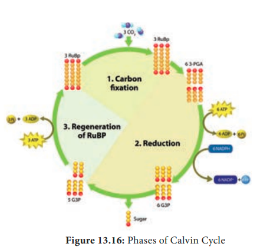
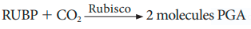
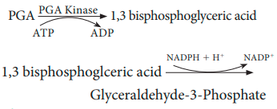
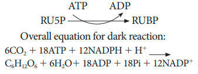

## 13.11 Dark Reaction or C3 Cycle or Biosynthetic Phase or Photosynthetic Carbon Reduction (PCR)Cycle

Biosynthetic phase of photosynthesis utilises assimilatory powers(ATP and NADPH 1 H1) produced during light reaction are used to fix and reduce carbon di oxide into carbohydrates. This reaction does not require light. Therefore, it is named Dark reaction. Ribulose 1,5 bisphosphate (RUBP) act as acceptor molecule of carbon di oxide and fix the CO2 by RUBISCO enzyme. The first product of the pathway is a 3- carbon compound (Phospho Glyceric Acid) and so it is also called as C3 Cycle. It takes place in the stroma of the chloroplast

**M.  Melvin Calvin**, A.A. Benson and their co-workers in the year 1957 found this path way of carbon fixation. Melvin Calvin was awarded Nobel Prize for this in 1961 and this pathway named after the discoverers as Calvin-Benson Cycle. Dark reaction is temperature dependent and so it is also called thermo-chemical reaction. 

Dark reaction consists of three phases: (Figure 13.16).  

1\.Carboxylation (fixation)  

2\. Reduction (Glycolytic Reversal)  

3\. Regeneration

**Phase 1- Carboxylation (Fixation)** 

 The acceptor molecule Ribulose 1,5 Bisphosphate (RUBP) a 5 carbon compound 
 
 with the help of RUBP carboxylase oxygenase (RUBISCO) enzyme accepts one molecule of carbon dioxide to form an unstable 6 carbon compound. This 6C compound is broken down into two molecules of 3-carbon compound phospho glyceric acid (PGA) (Figure 13.17) 
 

 

 **Phase 2 – Glycolytic Reversal / Reduction** 

 Phospho glyceric acid is phosphorylated by ATP and produces 1,3 bis phospho glyceric acid by PGA kinase. 1,3 bis phospho glyceric acid is reduced to glyceraldehyde 3 Phosphate (G-3-P) by using the reducing power NADPH 1 H1. Glyceraldehyde 3 phosphate is converted into its isomeric form di hydroxy acetone phosphate (DHAP). 
 

 **Phase 3 – Regeneration** 

 Regeneration of RUBP involves the formation of several intermediate compounds of 6-carbon, 5-carbon,4-carbon and 7- carbon skeleton. Fixation of one carbon dioxide requires 3 ATPs and 2 NADPH 1 H1, and for the fixation of 6 CO2 requires 18 ATPs and 12 NADPH 1 H1 during C3 cycle. One 6 carbon compound is the net gain to form hexose sugar. 
 
 