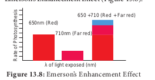

## Emerson’s Experiments and Hill’s Reaction

### Red Drop or Emerson’s First Effect

**Emerson** conducted experiment in _Chlorella_ using only one wavelength of light (monochromatic light) at a time and he measured quantum yield. He plotted a graph of the quantum yield in terms of O2 evolution at various wavelengths of light. His focus was to determine at which wavelength the photochemical yield of oxygen was maximum. He found that in the wavelength of 600 to 680 the yield was constant but suddenly dropped in the region above 680 nm (red region). The fall in the photosynthetic yield beyond red region of the spectrum is referred as **Red drop or Emerson’s first effect.**

### Emerson’s Enhancement Effect

Emerson modified his first experiment by supplying shorter wavelength of light (red light) along with longer wavelength of light (far red light). He found that the monochromatic light of longer wavelength (far red light) when supplemented with shorter wavelength of light (red light) enhanced photosynthetic yield and recovered red drop. This enhancement of photosynthetic yield is referred to as Emerson’s Enhancement Effect (Figure 13.8).

Photosynthetic rate at far red light (710 nm) 5 10 Photosynthetic rate at red light (650 nm) 5 43.5 Photosynthetic rate at red 1 far red (650 1 710 nm) 5 72.5 (Enhancement effect).

### Hill’s Reaction

**R. Hill** (1937) isolated chloroplasts and when they were illuminated in the presence of suitable electron acceptors such as ferricyanide, they were reduced to ferrocyanide and oxygen is evolved. Hill’s Reaction is now considered to be equivalent to Light Reaction.
_Conclusions of Hill’s Reaction:_

1. During photosynthesis oxygen is evolved from water.

2. Electrons for the reduction of CO2 are obtained from water.

3. Reduced substance produced, later helps to reduce CO2 2H2O 1 2A 2 AH2 1 O2

A is the Hydrogen acceptor, the common _in vitro_ hydrogen acceptors are ferricyanide,benzoquinone and Di Chloro Phenol Indole Phenol (DCPIP).
