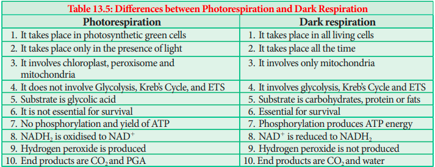
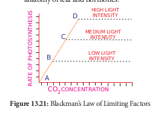

## Factors affecting Photosynthesis

In 1860, **Sachs** gave three cardinal points theory explaining minimum, optimum and maximum factors that control photosynthesis.

In 1905, **Blackman** put forth the importance of smallest factor. **Blackman’s law of limiting factor is actually a modified Law proposed** by **Liebig’s Law of minimum**. According to Blackman, _“When a process is conditioned as to its rapidity by a number of separate factors, the rate of the process is limited by the pace of the lowest factor”._ To conclude in an easy way _“at any given point of time the lowest factor among essentials will limit the rate of photosynthesis”._ For example, when even sufficient light intensity is available, photosynthesis may be low due to low CO2 in the atmosphere. Here, CO2 acts as a limiting factor. If CO2 is increased in the atmosphere the rate of photosynthesis also increases. Further increase in photosynthesis is possible only if the available light intensity is also increased proportionately (Figure 13.21).

Factors affecting photosynthesis are further grouped into External or Environmental factors and Internal factors.

I. **External factors:** Light, carbon dioxide, temperature, water, mineral and pollutants.

II. **Internal factors:** Pigments, protoplasmic factor, accumulation of carbohydrates, anatomy of leaf and hormones.

### External factors

**1. Light**

Energy for photosynthesis comes only from light. Photooxidation of water and excitation of pigment molecules are directly controlled by light. Stomatal movement leading to diffusion of CO2 is indirectly controlled by light.

**a. Intensity of Light:** 
Intensity of light plays a direct role in the rate of photosynthesis. Under low intensity the photosynthetic rate is low and at higher intensity photosynthetic rate is higher. It also depends on the nature of plants. Heliophytes (Bean Plant) require higher intensity than Sciophytes (_Oxalis_).

**b. Quantity of Light:** 
In plants which are exposed to light for longer duration (Long day Plants) photosynthetic rate is higher.

**c. Quality of light:**
Different wavelengths of light affect the rate of photosynthesis because pigment system does not absorb all the rays equally. Photosynthetic rate is maximum in blue and red light. **Photosynthetically Active Radiation** (PAR) is between 400 to 700 nm. Red light induces highest rate of photosynthesis and green light induces lowest rate of photosynthesis.

**2. Carbon dioxide** 
CO2 is found only 0.3 % in the atmosphere but plays a vital role. Increase in concentration of CO2 increases the rate of photosynthesis (CO2 concentration in the atmosphere is 330 ppm). If concentration is increased beyond 500ppm, rate of photosynthesis will be affected showing the inhibitory effect. 

**3. Oxygen** The rate of photosynthesis decreases when there is an increase of oxygen concentration. This Inhibitory effect of oxygen was first discovered by **Warburg** (1920) using green algae _Chlorella._

**4. Temperature** The optimum temperature
for photosynthesis varies.Temperature is
not uniform in all places. In general, the
optimum temperature for photosynthesis is
25oC to 35oC. This is not applicable for
all plants. The ideal temperature
forplants like _Opuntia_ is 55oC, Lichens
20oC and Algae growing in hot spring
photosynthesis is 75oC. Whether high
temperature or low temperature it will
close the stomata as well as inactivate
the enzymes responsible for photosynthesis
(Figure 13.22).

**5. Water** Photolysis of water provides electrons and protons for the reduction of NADP, directly. Indirect roles are stomatal movement and hydration of protoplasm. During water stress, supply of NADPH 1 H1 is affected.

**6. Minerals** Deficiency of certain minerals affect photosynthesis e.g. mineral involved in the synthesis of chlorophyll (Mg, Fe and N), Phosphorylation reactions (P), Photolysis of water (Mn and Cl), formation of plastocyanin (Cu).

**7. Air pollutants** Pollutants like SO2, NO2, O3 (Ozone) and Smog affects rate of photosynthesis.

### Internal Factors

**1. Photosynthetic Pigments**
It is an essential factor and even a small quantity is enough to carry out photosynthesis.
**2. Protoplasmic factor**
Hydrated protoplasm is essential for photosynthesis. It also includes enzymes responsible for Photosynthesis.

**3. Accumulation of Carbohydrates** Photosynthetic end products like carbohydrates are accumulated in cells and if translocation of carbohydrates is slow then this will affect the rate of photosynthesis. 

**4. Anatomy of leaf** Thickness of cuticle and epidermis, distribution of stomata, presence or absence of Kranz anatomy and relative proportion of photosynthetic cells affect photosynthesis. 

**5. Hormones** Hormones like gibberellins and cytokinin increase the rate of photosynthesis.
