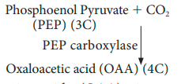
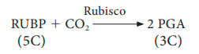

## 13.12 Hatch & Slack Pathway or C4 Cycle or Dicarboxylic Acid Pathway or Dicarboxylation Pathway

Till 1965, Calvin cycle is the only pathway for CO2 fixation. But in 1965, Kortschak, Hart and **Burr** made observations in sugarcane and found C4 or dicarboxylic acid pathway. Malate and aspartate are the major labelled products. This observation was confirmed by Hatch & Slack in 1967. This alternate pathway for the fixation of CO2 was found in several tropical and sub-tropical grasses and some dicots. C4 cycle is discovered in more than 1000 species. Among them 300 species belong to dicots and rest of them are monocots. C4 plants represent about 5% of Earth’s plant biomass and 1% of its known plant species. Despite this scarcity, they account for about 30% of terrestrial carbon fixation. Increasing the proportion of C4 plants on earth could assist biosequestration of CO2 and represent an important climate change avoidance strategy.

C4 pathway is completed in two phases, first phase takes place in stroma of mesophyll cells, where the CO2 acceptor molecule is 3-Carbon compound, phospho enol pyruvate (PEP) to form 4-carbon Oxalo acetic acid (OAA). The first product is a 4-carbon and so it is named as C4 cycle. oxalo acetic acid is a dicarboxylic acid and hence this cycle is also known as **dicarboxylic acid pathway** (Figure 13.18). Carbon dioxide fixation takes place in two places one in mesophyll and another in bundle sheath cell (di carboxylation pathway). It is the adaptation of tropical and sub tropical plants growing in warm and dry conditions. Fixation of CO2 with minimal loss is due to absence of photorespiration. C4 plants require 5 ATP and 2 NADPH 1 H1 to fix one molecule of CO2.

### 13.12.1 Stage: I Mesophyll Cells

Oxaloacetic acid (OAA) is converted into malic acid or aspartic acid and is transported to the bundle sheath cells through plasmodesmata.

### 13.12.2 Stage: II Bundle Sheath Cells

Malic acid undergoes decarboxylation and produces a 3 carbon compound Pyruvic acid and CO2. The released CO2 combines with RUBP and follows the calvin cycle and finally sugar is released to the phloem. Pyruvic acid is transported to the mesophyll cells.

### 13.12.3 Significance of C4 cycle

1. Plants having C4 cycle are mainly of tropical
   and sub-tropical regions and are able to survive in environment with low CO2 concentration.
2. C4 plants are partially adapted to drought conditions.
3. Oxygen has no inhibitory effect on C4 cycle since PEP carboxylase is insensitive to O2.
4. Due to absence of photorespiration, CO2 Compensation Point for C4 is lower than that of C3 plants.
   Differences between C3 Plants (C3 Cycle) and C4 Plants (C4 Cycle) are given in table 13.4.

   **Table 13.4: Differences be C3 Plants**

|                      c3 plant                       |                            c4 plants                             |
| :-------------------------------------------------: | :--------------------------------------------------------------: |
| 1. CO2 fixation takes place in mesophyll cells only |       CO2 fixation takes place mesophyll and bundle sheath       |
|            2. CO2 acceptor is RUBP only             |       2. PEP in mesophyll and RUBP in bundle sheath cells        |
|             3. First product is 3C- PGA             |                   3. First product is 4C- OAA                    |
|           4. Kranz anatomy is not present           |                   4. Kranz anatomy is present                    |
|       5. Granum is present in mesophyll cells       | 5. Granum present in mesophyll cells and absent in bundle sheath |
|                6. Normal Chloroplast                |                     6. Dimorphic chloroplast                     |
|         7. Optimum temperature 20o to 25oC          |                7. Optimum temperature 30o to 45oC                |
|            8. Fixation of CO2 at 50 ppm             |             8. Fixation of CO2 even less than 10 ppm             |
|  9. Less efficient due to higher photorespiration   |          9. More efficient due to less photorespiratio           |
|    10. RUBP carboxylase enzyme used for fixation    |          10. PEP carboxylase and RUBP carboxylase used           |
|     11. 18 ATPs used to synthesize one glucose      |           11. Consumes 30 ATPs to produce one glucose.           |
|     12. Example: Paddy, Wheat, Potato and so on     |  12. Example: Sugar cane, Maize, Sorghum, Amaranthus and so on   |
