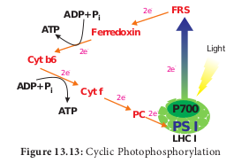
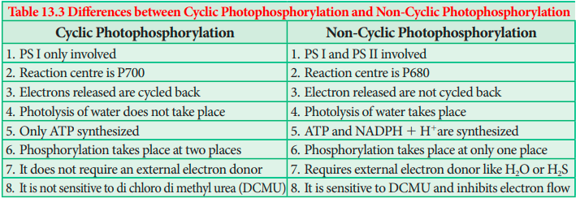
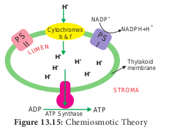

## 13.10 Photophosphorylation

Phosphorylation taking place during respiration is called as **oxidative phosphorylation** and ATP produced by the breakdown of substrate is known as **substrate level phosphorylation**. In this topic, we are going to learn about phosphorylation taking place in chloroplast with the help of light. During the movement of electrons through carrier molecules ATP and NADPH 1 H1 are produced. Phosphorylation is the process of synthesis of ATP by the addition of inorganic phosphate to ADP. The addition of phosphate here takes place with the help of light generated electron and so it is called as **photophosphorylation**. It takes place in both cyclic and non-cyclic electron transport.

### 13.10.1 Cyclic Photophosphorylation

Cyclic photophosphorylation refers to the electrons ejected from the pigment system I (Photosystem I) and again cycled back to the PS I. When the photons activate P700 reaction centre photosystem II is activated. Electrons are raised to the high energy level. The primary electron acceptor is Ferredoxin Reducing Substance (FRS) which transfers electrons to Ferredoxin (Fd), Plastoquinone (PQ), cytochrome b6-f complex, Plastocyanin (PC) and finally back to chlorophyll P700 (PS I). During this movement of electrons Adenosine Di Phosphate (ADP) is phosphorylated, by the addition of inorganic phosphate and generates Adenosine Tri Phosphate (ATP). Cyclic electron transport produces only ATP and there is no NADPH 1 H1 formation. At each step of electron transport, electron loses potential energy and is used by the transport chain to pump H1 ions across the thylakoid membrane. The proton gradient triggers ATP formation in ATP synthase enzyme situated on the thylakoid membrane. Photosystem I need light of longer wave length (> P700 nm). It operates under low light intensity, less CO2 and under anaerobic conditions which makes it considered as earlier in evolution (Figure 13.13).

### 13.10.2 Non-Cyclic Photophosphorylation

When photons are activated reaction centre of pigment system II(P680), electrons moved to the high energy level. Electrons from high energy state passes through series of electron carriers like pheophytin, plastoquinone, cytochrome complex, plastocyanin and finally accepted by PS I (P700). During this movement of electrons from PS II to PS I ATP is generated (Figure 13. 16). PS I (P700) is activated by light, electrons are moved to high energy state and accepted by electron acceptor molecule ferredoxin reducing Substance (FRS). During the downhill movement through ferredoxin, electrons are transferred to NADP1 and reduced into NADPH + H1+ (H+ formed from splitting of water by light).

Electrons released from the photosystem II are not cycled back. It is used for the reduction of NADP1 in to NADPH 1 H1. During the electron transport it generates ATP and hence this type of photophosphorylation is called **non-cyclic photophosphorylation. The** electron flow looks like the appearance of letter ‘Z’ and so known as **Z scheme**. When there is availability of NADP1 for reduction and when there is splitting of water molecules both PS I and PS II are activated (Table 13.3). Non-cyclic electron transport PS I and PS II both are involved co-operatively to transport electrons from water to NADP1 (Figure 13.14).

### 13.10.3 Bio energetics of light reaction

- To release one electron from pigment system it requires two quanta of light.

- One quantum is used for transport of electron from water to PS I.

- Second quantum is used for transport of electron from PS I to NADP+

- Two electrons are required to generate one NADPH 1 H+.

- During Non-Cyclic electron transport two NADPH 1 H1 are produced and it requires 4 electrons.

- Transportation of 4 electrons requires 8 quanta of light.

### 13.10.4 Chemiosmotic Theory

Chemiosmosis theory was proposed by **P. Mitchell** (1966). According to this theory electrons are transported along the membrane through PS I and PS II and connected by Cyto- chrome b6-f complex. The flow of electrical current is due to difference in electrochemical potential of protons across the membrane. Splitting of water molecule takes place inside the membrane. Protons or H1 ions accumulate within the lumen of the thylakoid (H1 increase 1000 to 2000 times). As a result, proton concentration is increased inside the thylakoid lumen. These protons move across the membrane because the primary acceptor of electron is located outside the membrane. Protons in stroma less in number and creates a proton gradient. This gradient is broken down due to the movement of proton across the membrane to the stroma through CFO of the ATP synthase enzyme. The proton motive force created inside the lumen of thylakoid or chemical gradient of H1 ion across the membrane stimulates ATP generation Figure(13.15)

The evolution of one oxygen molecule (4 electrons required) requires 8 quanta of light. C3 plants utilise 3 ATPs and 2 NADPH 1 H1 to evolve one Oxygen molecule. To evolve 6 molecules of Oxygen 18 ATPs and 12 NADPH 1 H1 are utilised. C4 plants utilise 5 ATPs and 2 NADPH 1 H1 to evolve one oxygen molecule. To evolve 6 molecules of Oxygen 30 ATPs and 12 NADPH 1 H1 are utilised. 
