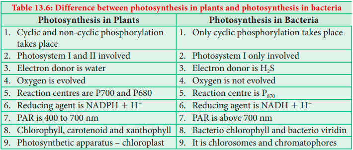

## Photosynthesis in bacteria

Though we study about bacterial photosynthesis as the last part, bacterial photosynthesis formed first and foremost in evolution. Bacteria does not have specialized structures like chloroplast. It has a simple type of photosynthetic apparatus called chlorosomes and chromatophores (Table 13.6). **Van Neil** (1930) discovered a bacterium that releases sulphur instead of oxygen during photosynthesis. Here, electron donor is hydrogen sulphide (H2S) and only one photosystem is involved (PS I) and the reaction centre is P870. Pigments present in bacteria are bacteriochlorophyll a, b, c, d, e and g and carotenoids. Photosynthetic bacteria are classified into three groups: 

1. Green sulphur bacteria. Example:
_Chlorobacterium_ and _Chlorobium._

2. Purple sulphur bacteria. Example: _Thiospirillum and Chromatium._

3. Purple non-sulphur bacteria. Example: _Rhodopseudomonas_ and _Rhodospirillum_.

**Test tube funnel experiment or Experiment to prove oxygen evolved during Photosynthesis** 

1. Place _Hydrilla_ plant at the bottom of abeaker containing water. 
2. Cover the plant with an inverted funnel. 
3. Invert a test tube over the funnel. 
4. Keep this setup in sunlight. 
Note your observations (Figure 13.23).

**Summary** 

Photosynthesis is an oxidation and reduction process. It has two phases: the light reaction and dark reaction. During light reaction water is oxidised to release O2 and during dark reaction CO2is reduced to form sugars. Solar energy is trapped by pigment system I and pigment system II. P700 and P680 act as reaction centres for PS I and PS II respectively. Splitting of water molecule (Photolysis) produces electrons, protons and oxygen. Photophosphorylation takes place through cyclic and non-cyclic mechanisms and generates energy and reducing power. Dark reaction or biosynthetic phase of photosynthesis use the products of light energy (ATP and NADPH 1 H1) and carbon dioxide is reduced to Carbohydrates. Carbon pathway in C3 cycle has RUBP as

the acceptor molecule and the first product is PGA (3C). Carbon pathway in C4 plants involves mesophyll and bundle sheath cells, Kranz anatomy. Dimorphic chloroplast, no photorespiration, acceptor molecule as PEP and first product as OAA (4C) are some of the unique characters of C4 cycle. C2 Cycle or photorespiration is operated when less amount of CO2 is used for reduction and O2 increases. Rubisco starts to play oxygenase role. Succulent and xerophytic plants show reverse stomatal rhythm as they open during night time and close during day time and follow CAM cycle. Night time produces malic acid and during day time malate is converted into pyruvate and produces CO2 which is reduced to carbohydrates. Photosynthesis is affected by internal and external factors. Bacterial photosynthesis is the primitive type of photosynthesis and it involves only photosystem I. 