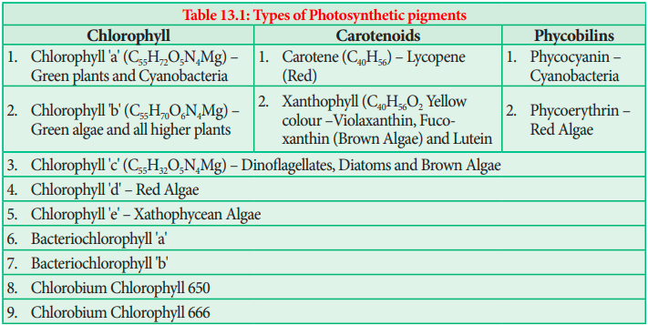

## Photosynthetic Pigments

A photosynthetic pigment is a pigment that is present in chloroplasts or photosynthetic bacteria which captures the light energy necessary for photosynthesis (Table 13.1).

### Chlorophyll

Chlorophyll 'a' is the primary pigment which acts as a reaction centre and all other pigments act as accessory pigments and trap solar energy and then transfer it to chlorophyll 'a'. Chlorophyll molecules have a tadpole like structure. It consists of Mg-Porphyrin head (Hydrophilic Head) and (Lipophilic tail) Phytol tail. The Porphyrin head consists of four pyrrol rings linked together by C-H bridges. Each pyrrole ring comprises of four carbons and one nitrogen atom. Porphyrin ring has several side groups which alter the properties of the pigment. Different side groups are indicative of various types of chlorophyll. The Phytol tail made up of 20 carbon alcohol is attached to carbon 7 of the Pyrrole ring IV. It has a long propionic acid ester bond. Long lipophilic tail helps in anchoring chlorophyll to the lamellae.

### Carotenoids

Carotenoids are yellow to orange pigments, mostly tetraterpens and these pigments absorb light strongly in the blue to violet region of visible spectrum. These pigments protect chlorophyll from photo-oxidative damage. Hence, they are called as shield pigments. These pigments absorb light and transfer these to chlorophyll. Almost all carotenoid pigments have 40 carbon atoms. Ripening of fruits, floral colours and leaf colour change during autumn is due to Carotenoids (Carotene and Xanthophyll) (Figure 13.2).
**i. Carotenes:**
Orange, Red, Yellow and Brownish pigments, hydrocarbons (Lipids) and most of them are tetraterpenes(C40H56). Carotene is the most abundant Carotene in plants and it is a precursor of Vitamin A. Lycopene is the red pigment found in the fruits of tomato, red peppers and roses.
**ii. Xanthophylls:**
Yellow (C40H56O2) pigments are like carotenes but contain oxygen. Lutein is responsible for yellow colour change of leaves during autumn season. Examples: Lutein, Violaxanthin and Fucoxanthin.

### Phycobilins

They are proteinaceous pigments, soluble in water, and do not contain Mg and Phytol tail. They exist in two forms such as 1. Phycocyanin found in cyanobacteria 2. Phycoerythrin found in rhodophycean algae (Red algae).