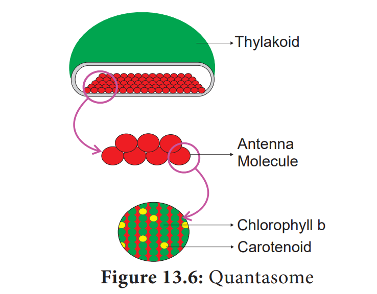

## Photosynthetic Unit (Quantasome)

Quantasomes are the morphological expression of physiological photosynthetic units, located on the inner membrane of thylakoid lamellae. Each quantasome measures about 180 Ao × 160 Ao and 100 Aothickness. In 1952, **Steinman** observed granular structures in chloroplast lamellae under electron microscope. Later, **Park and Biggins**(1964) confirmed these granular structures as physiological units of photosynthesis and coined the term Quantasome. According to them one quantasome contains about 230 chlorophyll molecules. A minimum number of chlorophyll and other accessory pigments act together in a photochemical reaction to release one oxygen or to reduce one molecule of CO2. It constitutes a photosynthetic unit. (Figure 13.6) **Emerson** and **Arnold** (1932) based on flashing light experiment found 2500 chlorophyll molecules are required to fix one molecule of CO2. However, the reduction or fixation of one CO2 requires 10 quanta of light and so each unit would contain 1/10 of 2500 i.e. 250 molecules. Usually 200 to 300 chlorophyll molecules are considered as a physiological unit of photosynthesis. According to Emerson 8 quanta of light are required for the release of one oxygen molecule or reduction of one Carbon dioxide molecule. The quantum yield is 1/8 or 12 %.

