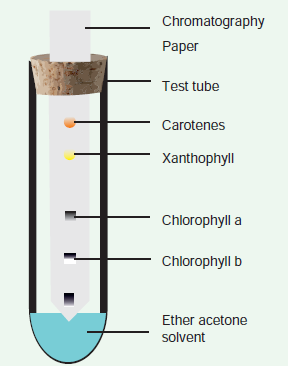

## Spectrum of Electromagnetic Radiation

In the total electromagnetic spectrum,visible light is the smallest part. The entire life on earth depends on light and is the driving force for all organisms. Plants have natural potential to utilize solar energy directly. In the given picture electromagnetic radiation spectrum and components of visible spectrum are mentioned. The wavelength of solar radiation which reaches the earth

is between 300 to 2600 nm. The visible spectrum ranges between 390 to 763 nm (3900 å to 7630 å). The colour of the light is determined by the wavelength. Energy of the quantum is inversely proportional to wavelength. Shorter wavelength has more energy than longer wavelength. Electromagnetic spectrum consists of 7 types of radiations such as gamma rays, X rays, U-V rays, Visible light spectrum, infrared rays, electric rays and radio rays (Figure 13. 4).

>Light is extremely variable and if radiation is evenly distributed over the globe it is sufficient to melt 35 m thick ice layer.

**Properties of Light**

1. Light is a transverse electromagnetic wave.
2. It consists of oscillating electric and magnetic fields that are perpendicular to each other and perpendicular to the direction of propagation of the light.
3. Light moves at a speed of 3 × 108 ms–1
4. Wavelength is the distance between successive crests of the wave.
5. Light as a particle is called **photon**. Each photon contains an amount of energy known as **quantum**.
6. The energy of a photon depends on the frequency of the light (Figure 13.5).

**Separation of Chlorophyll pigments by paper Chromatography method**

1. Step 1. Extract chlorophyll pigment from the leaves using 80% Acetone.

2. Step 2. Allow to concentrate by evaporation.

3. Step 3. Apply few drops on one end above 2 cm from the edge of a chromatographic paper.

4. Step 4. A solvent with mixture of Petroleum ether and acetone in the ratio of 9:1 is prepared and poured into development chamber.

5. Step 5. Place the strip above the solvent by placing one end of the strip touching the solvent

**Observation**

After one hour observe the chromatographic paper. You can find the pigments being separated into four distinct spots (Figure 13. 4).

