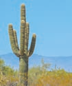

The Banyan tree continues to grow for thousands of years and some others particularly annual plants cease growth within a season or within a year. Can you understand the reasons? How does a zygote give rise to an embryo and an embryo to a seedling? How does a new plant structure arise from the pre-existing structure? Growth is defined as an irreversible permanent increase in size, shape, number,volume and dry weight. Plant growth occurs by cell division, cell enlargement, differentiation and maturation.

Growth is measurable, it is amazing to know that one single maize root apical meristem can give rise to more than 17,500 new cells per hour and cells in a watermelon may increase in size upto 3,50,000 times.

Bamboos are evergreen grasses and certain species of it can grow at the rate of growth 91 cm per day. The Saguaro Cactus is a tree like cactus and is a slow growing plant. The rate of growth is one inch in the first ten years and it does not begin to flower until it is about 60 years old. It’s lifespan exceeds 150 years and takes 75–100 years to grow a side arm.