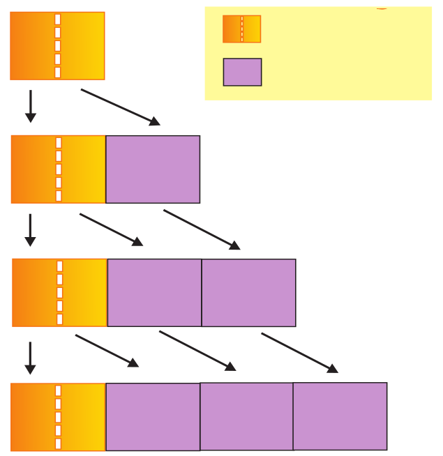
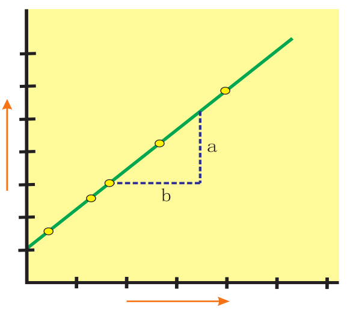
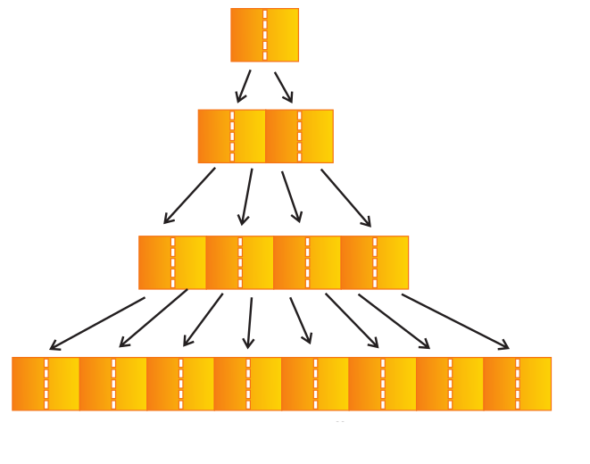
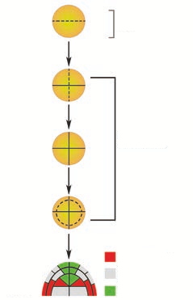
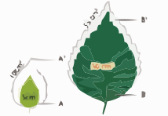
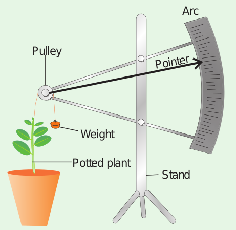

# Characteristics of Growth

- Growth increases in protoplasm at cellular level.
- Stem and roots are indeterminate in growth due to continuous cell division and is called **open form of growth**.
- The primary growth of the plant is due to the activity of apical meristem where, new cells are added to root and shoot apex causing linear growth of plant body.
- The secondary vascular cambium and cork cambium add new cells to cause increase in girth.
- Leaves, flowers and fruits are limited in growth or determinate or **closed form growth.**
- Monocarpic annual plants produce flowers only once during lifetime and dies. `Example: Paddy and Bean`
- Monocarpic perennials produce flowers only once during life time but the plants survive for many years. `Example: Bamboo.`
- Polycarpic perennials produce flowers every year during life time. `Example: Coconut.`

## Kinetics of growth

It is an analysis of the motion of cells or expansion.

## Stages in Growth rate

The total period from initial to the final stage of growth is called the **grand period of growth.** The total growth is plotted against time and `S` shaped sigmoid curve (Grand period curve) is obtained. It consists of four phases. They are:

1. Lag phase
2. Log phase
3. Decelerating phase
4. Maturation phase

### Lag phase

In this phase new cells are formed from pre-existing cells slowly. It is found in the tip of the stem, root and branches. It is the initial stage of growth. In other words, growth starts from this period.

### Log phase or exponential growth

Here, the newly formed cell increases in size rapidly by deposition of cell wall material. Growth rate is maximum and reaches top because of cell division and physiological processes are quite fast. The volume of protoplasm also increases. It results in rapid growth and causes elongation of internode in the stem.

### Decelerating phase or Decline phase or slow growth phase

The rate of growth decreases and becomes limited owing to internal and external or both the factors because the metabolic process becomes slow.

### Maturation phase or Steady state period

In this phase cell wall thickening due to new particle deposition on the inner surface of the cell wall takes place. The overall growth ceases and becomes constant. The growth rate becomes zero.

## Types of growth rate

The increased growth per unit time is termed as growth rate. An organism or part of an organism can produce more cells through arithmetic growth or geometric growth or both.

### Arithmetic Growth Rate

If the length of a plant organ is plotted against time, it shows a linear curve and this growth is called **arithmetic growth**.

- The rate of growth is constant and it increases in an arithmetic manner.
- Only one cell is allowed to divide between the two-resulting progeny cell.
- One continues to divide but the other undergoes cell cycle arrest and begins to develop, differentiate and mature.
- After each round of cell division, only a single cell remains capable of division and one new body cell forms.

For example, starting with a single cell after round 1 of cell division there is one dividing cell and one body cell. After round 2 there are two body cells, after round 3 there are three and so on

The plants single dividing cell would undergo one million rounds of nuclear and undergo one million rounds of nuclear and cellular division. If each round requires one day, this type of arithmetic increase would require one million days or 2739.7 years. This arithmetic rate is capable of producing small number of cells present in very small parts of plants. For example the hair on many leaves and stems consists of just a single row of cells produced by the division of the basal cell, the cell at the bottom of the hair next to other epidermal cells. Hair may contain 5 to 10 cells by the division of the basal cell. So, all its cells could be produced in just five to ten days. In the figure 15.2, on plotting the hight of the plant against time a linear curve is obtained. Mathematically it is expressed as:



L_t = L_0 + r_t \newline

L_t = \text{ length at time ‘t’ } \newline

L_o = \text{ length at time zero }\newline

r = \text{ growth rate of elongation per unit } \newline


### Geometric growth rate

This growth occurs in many higher plants and plant organs and is measured in size or weight. In plant growth, geometric cell division results if all cells of an organism or tissue are active mitotically. Example: Round three produces 8 cells as 2^3 = 8 and after round 20 there are 2^{20} = \text{1,048,576 cells}

The large plant or animal parts are produced this way. In fact, it is common in animals but rare in plants except when they are young and small. Exponential growth curve can be expressed as,



W_t = W_0e^{rt} \newline

W_t = \text{ Final size (weight, height and number) } \newline

W_o = \text{ Initial size at the beginning of the period }\newline

r = \text{ Growth rate } \newline

t = \text{ Time of growth } \newline

e = \text{ Base of the natural logarithms } \newline \newline



Here ‘_r’_ is the relative growth rate and also a measure of the ability of the plant to produce new plant material, referred to as efficiency index. Hence, the final size of W_1 depends on the initial size W_0.

### Arithmetic and Geometric Growth of Embryo

Plants often grow by a combination of arithmetic and geometric growth patterns. A young embryonic plant grows geometrically and cell division becomes restricted to certain cells at the tips of roots and shoots. After this point, growth is of the slower arithmetic type, but some of the new cells that are produced can develop into their mature condition and begin carrying out specialized types of metabolism. Plants are thus a mixture of older, mature cells and young, dividing cells.

Quantitative comparisons between the growth of living system can also be made in two ways and is explained in the table 1.

Two leaves A and B are drawn at a particular time. Then A^1 and B^1 are drawn after a given time. A and B = Area of leaves at a particular time. A^1 and B^1 = Area of leaves after a given time. (A^1-A) and (B^1-B) represents an absolute increase in area in the given time. Leaf A increases from 5 cm^2 to 10 cm^2; 5 cm^2 in a given time. Leaf B increases from 50 cm^2 to 55 cm^2 ; 5 cm^2 in a given time. Hence, both leaves A and B increase their area by 5 cm^2 in a given time. This is absolute growth. Relative growth is faster in leaf A because of initial small size. It decreases with time.

# Measurement of Growth Experiment

## Arc auxanometer

The increase in the length of the stem tip can easily be measured by an arc auxanometer which consists of a small pulley to the axis of which is attached a long pointer sliding over a graduated arc. A thread one end of which is tied to the stem tip and another end to a weight passes over the pulley tightly. As soon as the stem tip increases in length, the pulley moves and the pointer slide over the graduated arc. The reading is taken. The actual increase in the length of the stem is then calculated by knowing the length of the pointer and the radius of the pulley. If the distance travelled by the pointer is 10 and the radius of the pulley is 4 inches and the length of the pint is 20 inches, the actual grown is measured as follows: Actual growth in length = (Distance travelled by the pointer × radius of the pulley) / Length of the pointer.

For example, `actual growth in length = (10 × 4 inches)/ 20 inches = 2 inches`

