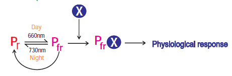
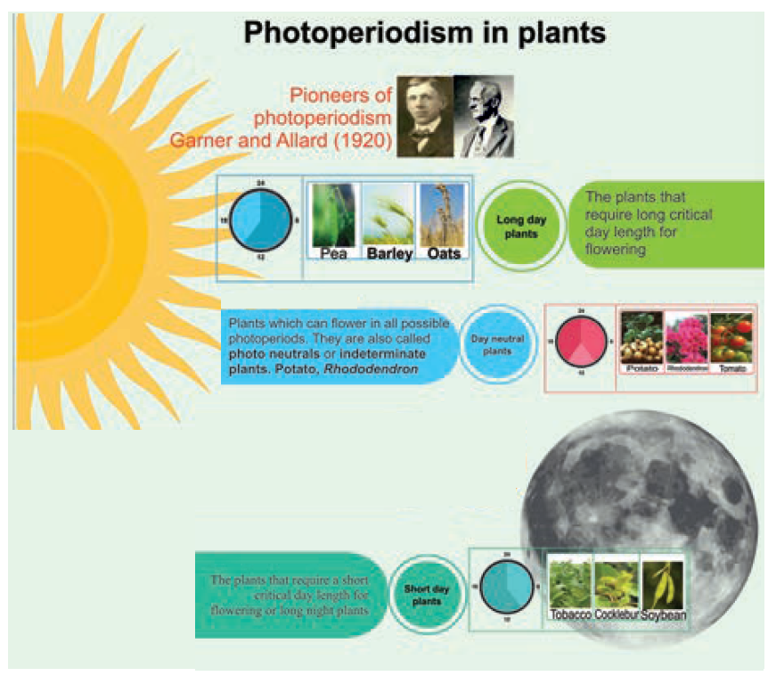

Trees take several years for initiation of flowering whereas an annual herb flowers within few months. Each plant requires a specific time period to complete their vegetative phase which will be followed by reproductive phase as per their internal control points through Biological Clock. The physiological mechanisms in relation to flowering are controlled by (i) light period (Photoperiodism) and (ii) temperature (Vernalization). The physiological change on flowering due to relative length of light and darkness (photoperiod) is called Photoperiodism. The term photoperiodism was coined by **Garner** and **Allard** (1920) when they observed this in ‘Biloxi’ variety of soybean (_Glycine max_) and ‘Maryland mammoth’ variety of tobacco (Nicotiana tabacum). The photoperiod required to induce flowering is called critical **day length**. Maryland mammoth (tobacco variety) requires 12 hours of light and cocklebur (_Xanthium pensylvanicum_) requires 15.05 hours of light for flowering.

**1. Classification of plants based on Photoperiodism**

i. Long day plants: The plants that require long critical day length for flowering are called long day plants or short night plants. Example: Pea, Barley and Oats.

ii. Short day plants: The plants that require a short critical day length for flowering are called short day plants or long night plants. Example: Tobacco, Cocklebur, Soybean, Rice and _Chrysanthemum_.

iii. Day neutral plants: There are a number of plants which can flower in all possible photoperiods. They are also called photo **neutrals** or **indeterminate plants**. Example: Potato, _Rhododendron_, Tomato and Cotton.

**2. Photoperiodic induction** 
An appropriate photoperiod in 24 hours’ cycle constitutes one inductive cycle. Plants may require one or more inductive cycles for flowering. The phenomenon of conversion of leaf primordia into flower primordia under the influence of suitable inductive cycles is called **photoperiodic induction**. Example: _Xanthium_ (SDP) – 1 inductive cycle and _Plantago_ (LDP) – 25 inductive cycles. 

**3. Site of Photoinductive perception**

Photoperiodic stimulus is perceived by the leaves. Floral hormone is synthesised in leaves and translocated to the apical tip to promote flowering. This can be explained by a simple experiment on Cocklebur (_Xanthium pensylvanicum_), a short day plant.  

Usually Xanthium will flower under short day conditions. If the plant is defoliated and kept under short day conditions it will not flower. Flowering will occur even when all the leaves are removed except one leaf. If a cocklebur plant is defoliated and kept under long day conditions, it will not flower. If one of its leaves is exposed to short day condition and rest are in long day condition, flowering will occur (Figure 15.20). 

**4. Importance of photoperiodism** 

1. The knowledge of photoperiodism plays an important role in hybridisation experiments.

2. Photoperiodism is an excellent example of physiological pre-conditioning that is using an external factor to induce physiological changes in the plant.

**5. Phytochrome**

Phytochrome is a bluish biliprotein pigment responsible for the perception of light in photo physiological process. **Butler** **_et al.,_** (1959) named this pigment and it exists in two interconvertible forms: (i) red light absorbing pigment which is designated as Pr and (ii) far red light absorbing pigment which is designated as Pfr. The Pr form absorbs red light in 660nm and changes to Pfr. The Pfr form absorbs far red light in 730nm and changes to Pr. The Pr form is biologically inactive and it is stable whereas Pfr form is biologically active and it is very unstable. In short day plants, Pr promotes flowering and Pfr inhibits the flowering whereas in long day plants flowering is promoted by Pfr and inhibited by Pr form. Pfr is always associated with hydrophobic area of membrane systems while Pr is found in diffused state in the cytoplasm. The interconversion of the two forms of phytochrome is mainly involved in flower induction and also additionally plays

a role in seed germination and changes in membrane conformation.