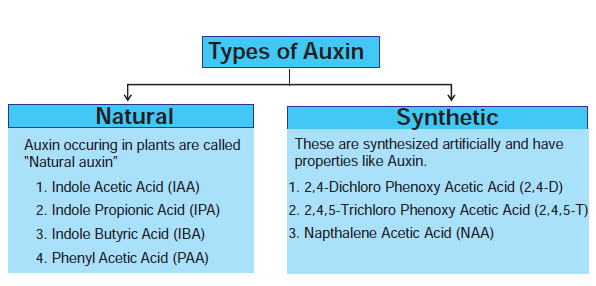
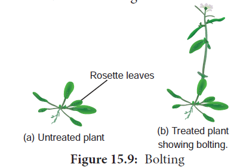
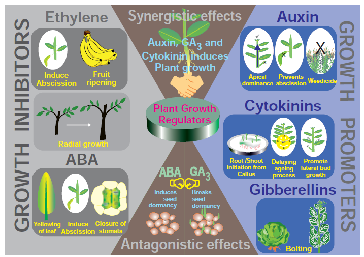

Plant Growth Regulators (chemical messenger) are defined as organic substances which are synthesized in minute quantities in one part of the plant body and transported to another part where they influence specific physiological processes. Five major groups of hormones _viz._, auxins, gibberellins, cytokinins, ethylene and abscisic acid are presently known to coordinate and regulate growth and development in plants. The term phytohormones is implied to those chemical substances which are synthesized by plants and thus, naturally occurring. On the other hand, there are several manufactured chemicals which often resemble the hormones in physiological action and even in molecular structure. Recently, another two groups, the brassinosteroids and polyamines were also known to behave like hormones. 

# Plant growth regulators – classification

Plant Growth Regulators are classified as natural and synthetic based on their source and a detailed flow diagram is given below

```goat
                                                                   +----------------------------------+                                                               
                                                                   |                                  |                                                               
                                                                   |                                  |                                                               
                                                                   |  Plant Growth Regulators (PGRs)  |                                                               
                                                                   |                                  |                                                               
                                                                   +----------------------------------+                                                               
                                            +-------------------------------------------------------------------------------------+                                   
                                            |                                                                                     |                                   
                                            |                                                                                     |                                   
                                            |                                                                                     |                                   
                         +------------------|------------------+                                                          +-------|------+                            
                         |                                     |                                                          |              |                            
                         |   Natural (Phytohormones) Synthetic |                                                          |  Synthetic   |                            
                         |                                     |                                                          |              |                            
                         +-------------------------------------+                                                          +--------------+                            
                                            -                                      +                                              |                                   
               -----------------------------+--------------------------+                                                          |                                   
+----------------------------+                              +----------|----------+                                               |                                   
|                            |                              |                     |                                               |                                   
|    Plant Growth Promoters  |                              |   Growth inhibitors |                                               |                                   
+----------------------------+                              +---------------------+                                               |                                   
              |                                                        |                                                          |                                   
              |                                                        |                                                          |                                   
              |                                                        |                                                          |                                   
              |                                                        |                                                          |                                   
              |                                                        +                                                +---------+--+                                
    +---------+------+                                       +--------------------+                                     |    NAA     |                                
    |    Auxin       |                                       |      Ethylene      |                                     |  2,4 -D    |                                
    |                |                                       |                    |                                     | 2,4,5 - T  |                                
    |  Gibberellin   |                                       |   Abscisic acid    |                                     |            |                                
    |                |                                       |                    |                                     +------------+                                
    |   Cytokinin    |                                       +--------------------+                                                                                   
    +----------------+                                                                                                                                                
                                                                                                                                                                     +
```

#  Characteristics of phytohormones 

- Usually produced in tips of roots, stems and leaves.
- Transfer of hormones from one place to another takes part through conductive systems.
- They are required in trace quantities. 
- All hormones are organic in nature. 
- There are no specialized cells or organs for their secretion. 
- They are capable of influencing physiological activities leading to promotion, inhibition and modification of growth.

# Synergistic and Antagonistic effects

- Synergistic effects: more substance in such a way that both promote each others activity. Example: Activity of auxin and gibberellins or cytokinins.
- Antagonistic effects: The effect of two substances in such a way that they have opposite effects on the same process. One accelerates and other inhibits. Example: ABA and gibberellins during seed or bud dormancy. ABA induces dormancy and gibberellins break it.

# Auxins 

## Discovery
During 1880, **Charles Darwin** noted the unilateral growth and curvature of Canary grass (_Phalaris canariensis_) coleoptile to light. The term auxin (Greek: Auxin – to Grow) was first used by F. W. Went in 1926 using Oats (_Avena_) coleoptile and isolated the auxin. F. W. Went in 1928 collected auxin in agar jelly. **Kogl** and **Haugen Smith** (1931) isolated Auxin from human urine, and called it as **Auxin A**. Later on in 1934, similar active substances was isolated from corn grain oil and was named as **Auxin B**. Kogl _et al.,_ (1934) found heteroauxin in the plant and chemically called it as **Indole Acetic Acid** (IAA) 

## Occurrence
Auxin is generally produced by the growing tips of the stem and root, from where they migrate to the region of the action. 

> Anti-auxin compounds when applied to the plant inhibit the effect of auxin. Example: 2, 4, 5-Tri Iodine Benzoic Acid (TIBA) and Napthylpthalamine.



### Free auxin

They move out of tissues as they are easily diffusible. `Example: IAA`. 

### Bound Auxin

They are not diffusible. `Example: IAA Acetic Acid`. 

## Precursor
The amino acid Tryptophan is the precursor of IAA and zinc is required for its synthesis. 

## Chemical structure
Auxin has similar chemical structure of IAA. 

## Transport in Plants
Auxin is polar in transport. It includes basipetal and acropetal transport. Basipetal means transport through phloem from shoot to root and acropetal means transport through xylem from root to shoot. 

## Bioassay (Avena Curvature Test Went Experiment) 

Bioassay means testing of substances for their activity in causing a growth response in a living plant or its part. **The procedure involves the following steps:** When the _Avena_ seedlings have attained a height of 15 to 30 mm, about 1mm of the coleoptile tip is removed. This apical part is the source of natural auxin. The tip is now placed on agar blocks for few hours. During this period, the auxin diffuses out of these tips into the agar. The auxin containing agar block is now placed on one side of the decapitated stump of Avena coleoptile. The auxin from the agar blocks diffuses down through coleoptile along the side to which the auxin agar block is placed. An agar block without auxin is placed on another decapitated coleoptile. Within an hour, the coleoptiles with auxin agar block bends on the opposite side where the agar block is placed.


This curvature can be measured (Figure 15.8). 

**8. Physiological Effects**. 
- They promote cell elongation in stem and coleoptile. 
- At higher concentrations auxins inhibit the elongation of roots but extermely lower concentrations promotes growth of root.
- Suppression of growth in lateral bud by apical bud due to auxin produced by apical bud is termed as **apical dominance**.
- Auxin prevents abscission. 
- It is used to eradicate weeds. Example: 2,4-D and 2,4,5-T. 
- Synthetic auxins are used in the formation of seedless fruits (Parthenocarpic fruit). 
- It is used to break the dormancy in seeds. 


### Gibberellins 

**1. Discovery**

The effect of gibberellins had been known in Japan since early 1800 where certain rice plants were found to suffer from ‘Bakanae’ or foolish seedling disease. This disease was found by **Kurosawa** (1926) to be caused by a fungus _Gibberella fujikuroi. The active substance_ was separated from fungus and named as     gibberellin by Yabuta (1935). These are more than 100 gibberellins reported from both fungi and higher plants. They are noted as GA1, GA2, GA3 and so on. GA3 is the first discovered gibberellin. In 1938, **Yabuta** and **Sumiki** isolated gibberellin in crystalline form. In1955, **Brain** _et al.,_ gave the name **gibberellic acid**. In 1961, Cross _et al.,_ established its structure.

>**Agent Orange** Mixture of two phenoxy herbicides 2,4-D and 2,4,5-T is given the name ‘Agent orange’ which was used by USA in Vietnam war for defoliation of forest (chemical warfare).


>
In botanical gardens and tea gardens, gardeners trim the plants regularly so that they remain bushy. Does this practice have any scientific explanation?
Yes, trimming of plants removes apical buds and hence apical dominance. The lateral buds sprout and make the plants bushy.

**2. Occurrence** 
The major site of gibberellin production in plants is parts like embryo, roots and young leaves near the tip. Immature seeds are rich in gibberellins. 

**3. Precursors** 
The gibberellins are chemically related to terpenoids (natural rubber, carotenoids and steroids) formed by 5-C precursor, an Isoprenoid unit called Iso Pentenyl Pyrophosphate (IPP) through a number of intermediates. The primary precursor is acetate. 

**4. Chemical structure** 
All gibberellins have gibbane ring structure. 

**5. Transport in plants** 
The transport of gibberellins in plants is non- polar. Gibberellins are translocated through phloem and also occur in xylem due to lateral movement between vascular bundles. 

**6. Bioassay (Dwarf Pea assay)**
Seeds of dwarf pea are allowed to germinate till the formation of the coleoptile. GA solution is applied to some seedlings. Others are kept under control. Epicotyl length is measured and as such, GA stimulating epicotyl growth can be seen. 

**7. Physiological Effects**. 
- It produces extraordinary elongation of stem caused by cell division and cell elongation. 
- Rosette plants (genetic dwarfism) exhibit excessive internodal growth when they are treated with gibberellins. This sudden elongation of stem followed by flowering by the application of gibberellin is called bolting (Figure 15.9).
- Gibberellin breaks dormancy in potato tubers.
- Many biennials usually flower during second year of their growth. For flowering in the first year it self these plants should be treated with gibberellins.
- Formation of seedless fruits without fertili- zation is induced by gibberellins Example: Seedless tomato, apple and cucumber.
- Promotes elongation of inter-node in sugarcane without decreasing sugar content.
- Promotion of flowering in long day plants even under short day conditions.
- It stimulates the seed germination.



### Cytokinins (Cytos – cell, Kinesis – division) 

**1. Discovery**
The presence of cell division inducing substances in plants was first demonstrated by **Haberlandt** in 1913 in Coconut milk (liquid endosperm of coconut) which contains cell division inducing substances. In 1954, Skoog and Miller discovered that autoclaved DNA from herring sperm stimulated cell division in tobacco pith cells. They called this cell division inducing principle as kinetin (chemical structure: 6-Furfuryl Amino Acid). This does not occur in plants. In 1963, Letham introduced the term cytokinin. In 1964, Letham and Miller isolated and identified a new cytokinin called Zeatin from unripe grains of maize. The most widely occurring cytokinin in plants is Iso Pentenyl adenine (IPA). 

**2. Occurrence** 
Cytokinin is formed in root apex, shoot apex, buds and young fruits. 

**3. Precursor** 
Cytokinins are derivatives of the purine adenine. 

**4. Bioassay (Neem Cotyledon Assay)** 
Neem cotyledons are measured and placed in cytokinin solution as well as in ordinary water. Enlargement of cotyledons is an indication of cytokinin activity. 

**5. Transport in plants** 
The distribution of cytokinin in plants is not as wide as those of auxin and gibberellins but found mostly in roots. Cytokinins appear to be translocated through xylem.



**6. Physiological effect**. 
- Cytokinin promotes cell division in the presence of auxin (IAA). 
- Cytokinin induces cell enlargement associated with IAA and gibberellin. 
- Cytokinin can break the dormancy of certain light-sensitive seeds like tobacco and induces seed germination.
- Cytokinin promotes the growth of lateral bud in the presence of apical bud.
- Application of cytokinin delays the process of aging by nutrient mobilization. It is known as Richmond Lang effect.
- Cytokinin (i) increases rate protein synthesis (ii) induces the formation of inter-fascicular cambium (iii) overcomes apical dominance (iv) induces formation of new leaves, chloroplast and lateral shoots.
- Plants accumulate solutes very actively with the help of cytokinins.

### Ethylene (Gaseous Phytohormone)
Almost all plant tissues produce ethylene gas in minute quantities. 

**1. Discovery** 
In 1924, **Denny** found that ethylene stimulates the ripening of lemons. In 1934, **R.** **Gane** found that ripe bananas contain abundant ethylene. In 1935, Cocken et al., identified ethylene as a natural plant hormone.

**2. Occurrence** 
Maximum synthesis occurs during climacteric ripening of fruits (_see_ Box info) and tissues undergoing senescence. It is formed in almost all plant parts like roots, leaves, flowers, fruits and seeds. 

**3. Transport in plants** 
Ethylene can easily diffuse inside the plant through intercellular spaces. 

**4. Precursor** 
It is a derivative of amino acid methionine, linolenic acid and fumaric acid. 

**5. Bioassay (Gas Chromatography)** 
Ethylene can be measured by gas chromatography. This technique helps in the detection of exact amount of ethylene from different plant tissues like lemon and orange. 

**6. Physiological Effects**. 
- Ethylene stimulates respiration and ripening in fruits. 
- It breaks the dormancy of buds, seeds and storage organs. 
- It stimulates formation of abscission zone in leaves, flowers and fruits. This makes the leaves to shed prematurely.
- Inhibition of stem elongation (shortening the internode).
- Growth of lateral roots and root hairs. This increases the absorption surface of the plant roots.
- Ethylene normally reduces flowering in plants except in Pine apple and Mango.

### Abscisic Acid (ABA) (Stress Phyto hormone)


**1. Discovery** 
In 1963, the hormone was first isolated by **Addicott _et al.,_** from young cotton bolls and named as **Abscission II**. Eagles and Wareing during 1963–64 isolated a dormancy inducing substance from leaves of _Betula_ and called it as dormin. In 1965, it was found by Cornsforth _et al_., that both dormin and abscission are chemically same compounds and called **Abscisi**c **Acid (ABA)**. 

**2. Occurrence** 
This hormone is found abundantly inside  

**3. Precursors** 
The hormone is formed from mevalonic acid pathway or xanthophylls. 

**4. Transport in plants** Abscisic acid is transported to all parts of the plant through diffusion as well as through phloem and xylem. 

**5. Chemical structure** 
It has carotenoid structure. 

**6. Bioassay (Rice Coleoptile)** 
The inhibition of IAA induces straight growth of rice seedling coleoptiles. 

**7. Physiological effects**. 
- It helps in reducing transpiration rate by closing stomata. 
- ABA is a powerful growth inhibitor. It causes 50% inhibition of growth in Oat coleoptile.
- It induces bud and seed dormancy. 
- It promotes the abscission of leaves, flowers and fruits by forming abscission layers. 
- ABA plays an important role in plants during water stress and during drought conditions. It results in loss of turgor and closure of stomata.
- In Cannabis sativa, induces male flower formation on female plants.
- It promotes sprouting in storage organs like Potato.
- It inhibits the shoot growth and promotes growth of root system. This character protect the plants from water stress. Hence, ABA is called as **stress hormone.**