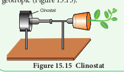

 Plants have the capacity for changing their positions in response to external or internal stimuli, which are known as **plant movements**. Movements are basically of two types: I. Vital movements and II. Physical movements (hygroscopic) (Figure 15.10). **I. Vital movements** Vital movements are those which are exhibited by the living cells or plants or

  

organs and they are always related to the irritability of the protoplasm. These movements are of two types:

A. Movements of locomotion B. Movements of curvature

**A. Movements of locomotion** These movements include the movement of protoplasm inside the cell or movement of whole unicellular or multicellular plant body as in _Chlamydomonas_, gametes and zoospores. **i. Autonomic movements of locomotion** The movements arising from internal changes or internal stimuli of plant body is called **autonomic movements** of locomotion. This movement takes place due to the presence of cilia or flagella and movement of cytoplasm (Cyclosis).

**Plant Movement**

**Vital Movement**

**Variation Movement**

**Tropic (Growth Movem**

**Autonomic (Spontaneous)**

**Autonomic (Spontaneous)**

**Paratonic (Tactic/ Induced)**

**Par (Tactic/**

**Movement of locomotion Movement of curvature**

**Physical Movement**

Ciliary Amoeboid Cyclosis

Phototactic Chemotactic Thermotactic

Geotropic Phototropi Thigmotro Hydrotropi Chemotrop Thermotro Aerotropic

**Growth Movement** Hyponastic Epinastic Nutational

These movements occur in response to light. Example: Zoospores of _Chlamydomonas_

It occurs in response to chemical stimulus. Example: Antherozoids in B r y o p h y t e s a n d P t e r i d o p h y t e s a r e attracted to chemical substances of Archegonia

It occurs in re to heat stimulu Example: _Chlamydomon_ moves from co warm water

**Phototactic Chemotactic Thermota**

**Paratonic or Tactic (induced) movement of locom**

**ii. Paratonic or Tactic (induced) movements of locomotion** The movements due to external factors or stimuli like light, temperature and chemicals are called paratonic movement of locomotion (Figure 15.11). **B. Movement of curvature** In higher plants they are restricted only to bending or curvature of some of their parts. There are mainly two types:

They are i) Autonomic movement of curvature and ii) Paratonic movement of curvature. **i. Autonomic movements of curvature** The movement arising from internal changes or internal stimuli of plant body is called **autonomic movement of curvature. This** does not require any external stimulus. They are two types: a. **Autonomic movement of growth:** It is of

the following types:

Hyponasty Epinasty

 high temperature and remains closed at

**ent)**

**atonic Induced)**

**Nastic (Variation Movement)**

Nyctinastic Seismonastic Thigmonastic

c pic c ic

pic

ments

sponse s.

_as_ ld to

**ctic**

**otion**

s

| Thermotactic |
|------|
| It occurs in  response to heat stimulus. Example: Chlamydomonas moves from cold to warm water |

| Phototactic |Chemotactic |
|------|------|
| These  movements occur  in  response  to light.Example: Zoospores of Chlamydomonas |It  occurs  in  response  to chemical stimulus.Example:  Antherozoids  in Bryophytes  and Pteridophytes  are attracted  to  c hemicalsubstances of Archegonia |

  

3\. Nutation: The growth of the stem apices occurs in a zig-zag manner. It is because the two sides of the stem apex alternatively grow more. Such growth movements are called as nutational movements. In some plants nutational movements allow the shoots apex to grow in helical path in upward direction. This movement is called circumnutation. It is commonly found in the stems of climbers of _Cucurbitaceae_ (Figure 15.13).

It happens in Indian telegraph plant. (_Desmodium gyrans_). The com pound leaf consists of a larger terminal and two smaller lateral leaflets. During day time, the two lateral leaflets move upward at an angle of 90° and come to lie parallel to the rachis. Again, they may move downward at 180° so that they are parallel to the rachis. They may again move upward at 90° to come in their original position. All these movements occur with jerks after intervals, each movement being completed in about 2 minutes (Figure 15.14).

**ii. Paratonic (induces) movements of curvature**

The movement arising from external stimulus is called **Paratonic** (Induced) movements of curvature. They are of two types. 1) Tropic movements 2) Nastic movements (Table 2)

**Table 2: Differences between Tropic M Tropic Movements**

1\. Movement occurs due to unidirectional stimulus. 2. The stimulus acts on protoplasm from one

direction only. 3. The response is directly related to the direction of

the stimulus. 4. These are movements of curvature caused

by unilateral growth. 5. Tropic movements may be phototropic, geotropic,

hydrotropic, thigmotropic, chemotropic, thermotropic or aerotropic.  

 Autonomic Movement of Variation

**a. Tropic movements** A movement that occurs in response to an unidirectional stimulus is called **tropic movement or tropism. There are seven types** in tropic movements (Geotropic, Phototropic, Thigmotropic, Chemotropic, Hydrotropic, Thermotropic and Aerotropic) **1\. Geotropism** The movements which take place in response to gravity stimulus are called **geotropic movements. The primary roots growing** down into soil are **positive geotropic.** Primary stems that grow away from soil (against gravity) are **negative geotropic**. Secondary roots growing at right angles to the force of gravity are **Diageotropic**. Secondary lateral roots which grow obliquely downwards are **Plagiogeotropic**. Lateral roots and branches which are not sensitive to gravitational stimulus are **Apogeotropic**. **2\. Phototropism** The tropic movement taking place as a response to light stimulus is called **phototropism**. Some of the plant parts such as stems, branches, leaves and pedicels of flowers move towards the stimulus of light and are said to be **positively phototropic** **ovements and Nastic movements**

**Nastic movements** These movements occur due to a diffused stimulus. The stimulus acts on the protoplasm from all sides.

The response has no relation to the direction of the stimulus but with organ. These are also the movement of curvature but they are caused by reversible turgor changes. Nastic movements may be seismonastic, photonastic or thermonastic

| Table 2: Dierences between Tropic Movements and Nastic movements |
|------|------|
| Tropic Movements |Nastic movements |
| 1. Movement occurs due to unidirectional stimulus. |ese movements occur due to a diused stimulus. |
| 2. e stimulus acts on protoplasm from onedirection only. |e stimulus acts on the protoplasm from all sides. |
| 3. e response is directly related to the direction ofthe stimulus. |e response has no relation to the direction of thestimulus but with organ. |
| 4. ese are movements of curvature causedby unilateral growth. |ese are also the movement of curvature but theyare caused by reversible turgor changes. |
| 5. Tropic movements may be phototropic, geotropic,hydrotropic, thigmotropic, chemotropic,thermotropic or aerotropic. |Nastic movements may be seismonastic, photonasticor thermonastic |
  

while others such as roots and rhizoids which move away from the stimulus of light are called **negatively phototropic**. **b. Nastic Movements** When growth movements occur in response to an external stimulus which is not unidirectional but diffused, they are called nastic or paratonic movements of variation. Paratonic variation movements are determined by some external stimuli, light, temperature, chemicals and touch. They are: **1\. Nyctinastic movement (or) sleep**

**movement** The diurnal (change in day-night) movements of leaves and flowers of some species which take up sleep position at night are called **nyctinastic movements. They are caused by relative changes** in cell size on the opposite sides of the leaf base called pulvinus. The movements are attributed to the amount of auxin and K1 ions. The entry of water to the lower side of the pulvinus causes the leaves to stand erect and exit of water causes them to drop. They are of two types: **i. Photonasty** The nastic movement caused in response to light is called **photonasty** or **photonastic**

**Experiment to demonstrate negative geotropism in aerial stem** The Clinostat has a rotating pot like container mounted on an axis rod. A potted plant is fitted horizontally on the Clinostat and rotated slowly which completely eliminates gravity as all the sides of the plant are equally stimulated. If the rotation of the Clinostat is stopped for a considerable period of time then the tip of the stem is observed to curve and grow upwards this proves that the stem tip is negatively geotropic (Figure 15.15).

Clinostat

  

**movement. The opening of leaves and flowers** during daytime and their close at night is an example. **ii. Thermonasty** The nastic movement taking place in response to temperature is called **thermonasty** or **thermonastic movement**. In _Crocus_ the flowers open at high temperature and close at low temperature. **2\. Seismonastic movement** This means a response to shaking. The best example is _Mimosa pudica_ (Touch-me-not plant) which is a sensitive plant (Figure 15.17). Such plants respond to stimuli such as touch, blow or metallic shock by folding their leaflets and lowering their leaves .This effect is caused by the movement of water in

**Experiment to demonstrate positive phototropism in shoot tips** A darkened black box is taken having a small window on one side. A well-watered potted plant is placed inside the box. This is referred to as a phototropic chamber or heliotropic chamber. If the window is kept closed for about 24 hours the plant shows normal growth. If the window is kept opened, it is found after two days that the shoot tip bends and grows towards light proving that it is positively phototropic (Figure 15.16).

**Open WindowClosed Window**

**Direction of LightDarkness**

**Figure15.16** Experiment to demonstrate Photropism

  

and out of the parenchymatous cells of the pulvinus (Figure 15.18).

turgid extensor cells

flexor cells

pu lvi

nu s

stretched flexor cells

flaccid extensor cells

(d)

(e) plasma membrane

cell wall H2O

Ca 2+

TnV N

turgid state

swellingshrinking

H 2 O

K+

Cl-

H+

H 2 O

K+

Cl-

H +

flaccid state

H2O H2O H2O

H2OH2O TnV

N

**3\. Thigmonastic movement** The movements found in the leaves of _Drosera and Dionaea (Venus fly trap) result_ in response to the touch stimulus of insects. As soon as an insect sits on the leaf the cilia curve inward to trap the insect and trigger hairs are activated. Similarly, in dionaea, the two halves of the leaf curve upwards along the midrib. These parts of the leaves come  

to their normal position after the insect has been digested (Figure 15.19).

**Figure 15.19: Thigmonasty in Dionaea**

**II Physical Movement (Hygroscopic Movements)**

Physical movements are those which are found in dead parts of the plants and they are not related to any irritability of the protoplasm. They are also called hygroscopic **movements** or **mechanical movements**. Dispersal of spores and seeds, dehiscence of sporangia, bursting of seeds and movement of elaters are the examples of physical or hygroscopic movement.