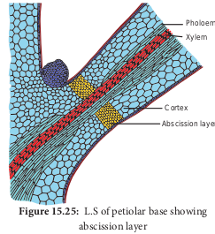

Plant life comprises some sequential events, _viz_: germination, juvenile stage, maturation, old age and death. Old age is called **senescence** in plants. Senescence refers to all collective, progressive and deteriorative processes which ultimately lead to complete loss of organization and function. Unlike animals, plants continuously form new organs and older organs undergo a highly regulated senescence program to maximize nutrient export.

>The branch of botany which deals with ageing, abscission and senescence is called **Phytogerontology**

# Types of Senescence 

**Leopold** (1961) has recognised four types of senescence:

1. Overall senescence 
2. Top senescence 
3. Deciduous senescence 
4. Progressive senescence 

## Overall senescence
This kind of senescence occurs in annual plants when entire plant gets affected and dies.
Example: Wheat and Soybean. It also occurs in few perennials also. Example: _Agave_ and Bamboo.

## Top senescence
It occurs in aerial parts of plants. It is common in perennials, underground and root system remains viable. Example: Banana and _Gladiolus_.

## Deciduous senescence
It is common in deciduous plants and occurs only in leaves of plants, bulk of the stem and root system remains alive. Example: Elm and Maple.

## Progressive senescence
This kind of senescence is gradual. First it occurs in old leaves followed by new leaves then stem and finally root system. It is common in annuals (Figure 15.23).

**Figure 15.23: Different types of senescence in plants**

# Physiology of Senescence
- Cells undergo changes in structure. 
- Vacuole of the cell acts as lysosome and secretes hydrolytic enzymes. 
- The starch content is decreased in the cells. 
- Photosynthesis is reduced due to loss of chlorophyll accompanied by synthesis and accumulation of anthocyanin pigments, therefore the leaf becomes red.
- There is a marked decrease in protein content in the senescing organ.
- RNA content of the leaf particularly rRNA level is decreased in the cells due to increased activity of the enzyme RNAase.
- DNA molecules in senescencing leaves degenerate by the increased activity of enzyme DNAase.

# Factors affecting Senescence
- ABA and ethylene accelerate senescence while auxin and cytokinin retard senescence.
- Nitrogen deficiency increases senescence whereas nitrogen supply retards senescence.
- High temperature accelerates senescence but low temperature retards senescence.
- Senescence is rapid in dark than in light. 
- Water stress leads to accumulation of ABA leading to senescence. 

# Programmed cell death (PCD)

Senescence is controlled by plants own genetic programme and death of the plant or plant part consequent to senescence is called **Programmed Cell Death**. In short senescence of an individual cell is called **PCD**. The proteolytic enzymes involving PCD in plants are **phytaspases** and in animals are **caspases. The nutrients and other substrates** from senescing cells and tissues are remobilized and reallocated to other parts of the plant that survives. The protoplasts of developing xylem vessels and tracheids die and disappear at maturity to make them functionally efficient to conduct water for transport. In aquatic plants, aerenchyma is normally formed in different parts of the plant such as roots and stems which encloses large air spaces that are created through PCD. In the development of unisexual flowers, male and female flowers are present in earlier stages, but only one of these two completes its development while other aborts through PCD (Figure 15.24).

# Abscission
Abscission is a physiological process of shedding of organs like leaves, flowers, fruits and seeds from the parent plant body. When these parts are removed the plant seals off its vascular system to prevent loss of water and nutrients. Final stage of senescence is abscission. In temperate regions all the leaves of deciduous plants fall in autumn and give rise to naked appearance, then the new leaves are developed in the subsequent spring season. But in evergreen plants there is gradual abscission of leaves, the older leaves fall while new leaves are developed continuously throughout the year.

# Morphological and Anatomical changes during abscission
Leaf abscission takes place at the base of petiole which is marked internally by a distinct zone of few layers of thin walled cells arranged transversely. This zone is called **abscission zone or abscission layer**. An abscission layer is greenish-grey in colour and is formed by rows of cells of 2 to 15 cells thick. The cells of abscission layer separate due to dissolution of middle lamella and primary wall of cells by the activity of enzymes **pectinase** and **cellulase** resulting in loosening of cells. Tyloses are also formed blocking the conducting vessels. Degrading of chlorophyll occur leading to the change in the colour of leaves, leaf detachment from the plant and leaf fall. After abscission, outer layer of cells becomes suberized by the development of periderm (Figure 15.25). 

# Hormones influencing abscission
All naturally occurring hormones influence the process of abscission. Auxins and cytokinins retard abscission, while abscisic acid (ABA) and ethylene induce it.

# Significance of abscission
1. Abscission separates dead parts of the plant, like old leaves and ripe fruits. 
2. It helps in dispersal of fruits and continuing the life cycle of the plant.
3. Abscission of leaves in deciduous plants helps in water conservation during summer.
4. In lower plants, shedding of vegetative parts like gemmae or plantlets help in vegetative reproduction.

