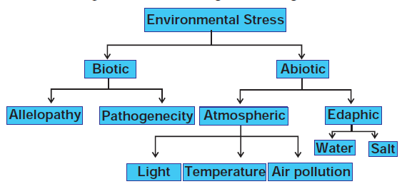

Like all other organisms, plants are also subjected to various environmental stresses such as water deficit, drought, cold, heat, salinity and air pollution. The study of functioning of plants under adverse environmental conditions is called **stress physiology**. **Jacob Levitt (1972) first used the term biological stress** in relation to plants and according to him stress is “any change in environmental condition that might adversely change the growth and development of a plant”.

The reaction of plants facing stress is called **strain**. For example, if a normal plant growing under favourable light conditions is subjected to low light intensity, its photosynthesis is reduced. Thus, low light intensity is referred as stress and reduction of photosynthesis is referred as strain. Biological strains are of two types; Elastic biological strain and Plastic biological strain. If the reaction of plant function is temporary and when it returns to its original state it is called **elastic biological strain**. Example: Temporary wilting. If the reaction is permanent and the plant function does not return to the normal state it is called **plastic biological strain**. Example: Permanent wilting. Some plants get adapted to stress condition and are not adversely affected by stress. Such plants are called **stress resistant** or **stress tolerant** plants. Example: Mangroves. Some plants cannot face stress and they pass their adverse period in dormant state and so they are called **stress enduring plants**. Ephemeral plants are short lived desert plants, which complete their life cycle during the seasonal rains before the onset of dry season. These ephemeral plants are called **stress escapers**. Stress in plants can be classified as given in figure 15.26. 

# Biotic Stresses
These are adverse effects on plants caused by other living organisms such as viruses, bacteria, fungi, parasites, insects, weeds and competing plants. Biotic environmental stress is also caused due to the activity of man by cutting herbs and trees, twigs for fodders, fuels and agricultural purposes. The biotic stresses caused by bacteria, fungi and nematodes that are ever present in the environment are called potential biotic stresses. These are divided into two types. They are: 

**i) Allelopathy** 
An organism producing one or more biochemical substances that greatly influence the germination, growth and reproduction of other organisms is called Allelopathy. These biochemicals are known as allelochemicals. They are beneficial (positive allelopathic) or detrimental (negative allelopathic). These allelochemicals are obtained from leaf after leaching on the ground and also from roots. The term allelopathy is from Greek words _allelon-each other and pathos-to suffer_ and first used in 1937 by Hans Molisch. Allelopathic effect may occur with weeds on crops and _vice versa_ (Figure 15.27).

One of the most famous allelopathic plants is Black walnut (Juglans nigrum). The chemical which is present in Black walnut is Juglone and it is a respiratory inhibitor. Solanaceous plants such as tomato, capsicum and eggplant are susceptible to juglone. These plants when exposed to these allelochemicals exhibit symptoms such as wilting, chlorosis and death.

>**Check your grasp!** Are all plants allelopathic? Can allelopathic chemicals affect animals and humans?

Tree of heaven (_Ailanthus altissima_) is a recent addition to the list of allelopathic trees. **Ailanthone** an allelochemical extracted from the root of _Ailanthus_ acts as potent herbicide. In _Sorghum_ plant the allelochemical sorgolone possess allelopathic activity. It is found in root exudates of most _Sorghum_ species. Root exudation of maize inhibits the growth of some weeds such as _Chenopodium album_ and _Amaranthus retroflexus. The seed exudates of_ oat (Avena fatua) affect the germination of wheat seedling.

**ii. Pathogenecity** 
The effect of microbes that cause diseases in plants. Example: _Xanthomonas citri_ 

# Abiotic Stresses
Abiotic stress may occur due to an atmospheric condition (atmospheric stress) or soil condition (edaphic stress). Atmospheric stresses may occur due to excess and deficient levels of light, temperature and air pollutants. 

**i. Light Stress** 
Light limits the distribution of species. In low light intensity **Sciophytes** (shade loving plants) develop, while in high light intensity **Heliophytes** (high light loving plants) develop. In low light intensity, stomata do not fully open hence there is less diffusion of gases. As a result, there is less photosynthesis and the chlorophyll synthesis is also affected. High light intensity also inhibits photosynthesis. Change in photoperiod inhibits flowering. 

**ii. Temperature** 
Plants are adapted to a particular region and they face temperature stress in another region. 

**a. High temperature** 
High temperature causes soil and atmospheric drought. Plants are subjected to permanent wilting in soil drought and temporary wilting in atmospheric drought. Plants generally die above temperature of 44oC. However, some organisms like _Mastigocladus_ (a cyanobacterium) grow well at 85oC to 90oC in hot springs. At 42oC synthesis of normal protein declines and new protein called Heat Shock Proteins (HSPs) appears. These proteins were discovered in fruit fly (Drosophila melanogaster) and since then they have also been discovered in animals, plants and microorganisms. At high temperature all physiological processes decline. Photosynthesis decreases and respiration increases. So, plants face a shortage of organic substances.  

>Apple, a temperate plant, when planted in tropical condition fails to produce fruits and growth is also affected.

**b. Low Temperature** 
Low temperature stress is quite harmful to plants and the temperature near freezing point causes irreversible damage so that the plants fail to survive under extreme cold conditions. However, some plants growing in alpine and arctic regions can survive under low temperature and such plants are said to be **cold resistant**. Stress due to freezing temperature is called **frost stress**. Temperature below 10oC, decreases root growth, increases leakage of ions and ethylene production.

>Some plant parts like Seeds, pollen grains and embryos can be stored at very low temperature (–196oC).

**iii. Air pollutants** 
Important atmospheric pollutants prevalent in the Indian sub-continent are CO2, CO, SO2, NO2, O3, fluoride and H2S. These pollutants do not cause visible injury but cause hidden injury. If the concentration of these pollutants increases visible injury like chlorotic and necrotic spots appear on leaves as well as inhibit photosynthetic carbon metabolism and biomass formation. Some pollutants at low concentration stimulate plant growth. Example: SO2, NO2 and NO. Respiration and photorespiration are sensitive to air pollutants. If the concentration of air pollutants is high, it inhibits respiration whereas at lower concentration stimulates respiration. Nitrogenous air pollutants under chronic exposure increases chlorophyll content while NO2 reduces pigment content at acute exposure.

**iv. Edaphic Stress** 
They are divided into two types. They are water **stress** and **salt stress:** 

**a. Water stress** 
A common stress condition arising from lack of water or excess of water is called **water stress. The abundance of water leads to a stress** called flood stress and scarcity of water leads to a stress called **drought stress**. 

**I. Flood Stress** 
The temporary inundation of plants and its parts by flooding causes oxygen deficiency to the roots and soil borne microorganisms. Effects of flooding are as follows: Nitrogen turnover in the soil is reduced; Abscisic acid, ethylene and ethylene precursors are formed in larger amount; Stimulation of partial stomatal closure, epinasty and abscission in leaves; Cellular membrane systems break down, mitochondria and microbodies disintegrate and enzymes are partially inhibited. Flood tolerant plants include those found on permanently wet soils. Examples: Marsh plants, shore plants and hydrophytes. Tree species found dominant in flooded sites are also tolerant. Examples: _Taxodium disticum,_ Mangroves and palms are tolerant to flood stress. 

**II. Drought Stress** 
The term ‘drought’ denotes a period without appreciable precipitation, during which the water content of the soil is reduced to such an extent that plants suffer from water deficiency. Effects of drought are as follows: Decrease in cellular growth and synthesis of cell wall components cause the cells to become smaller in size; Nitrogen fixation and its reduction are decreased by decreasing the activity of certain enzymes; Increase in abscisic acid level ultimately closes down the stomatal apparatus to the minimum, hence, transpiration declines; Protochlorophyll formation is inhibited and photosynthetic process declines; ; Wilting in mature leaves is associated with carbohydrate depletion due to mobilization export, followed by leaf senescence.  

**Mechanism of drought resistance**
Xerophytes are well adapted for drought either because,

i. the protoplasm of such plants does not die when it faces extreme or prolonged desiccation (dehydration) hence, it tolerates or endures such conditions. Example: Creosote bush (_Larrea tridentata_) can survive water content drops upto 30% whereas, in most plants the lethal level is below 50–70% or these plants are able to avoid or postpone the lethal level of desiccation because they have developed structural or physiological adaptations. Plants have developed following mechanisms:

- To avoid or postpone desiccation improved water uptake by developing the roots to deep water source
- Improved water uptake by roots which penetrate deep water source; Increasing and enlarging the conductive tissues.
- Stomata present only on the lower epidermis with by dense trichomes;
- Rolling of leaves and water storage in succulent tissue.

During drought stress an essential protection mechanism that stabilizes the cell structure is induced gene expression of **stress protein (dehydrin and osmotin)**. These proteins protect the macromolecules in the cytoplasm and in the nucleus, the cytoskeleton (biomembranes) against denaturation. High desiccation tolerance implies that the protoplasm rehydrates when water becomes available. Plants growing in deserts and arid regions are usually drought resistant.

>Resurrection plants, those plants having ability to survive near total drying which causes them to appeardead. They recover when water is available. Example: _Selaginella lepidophylla_

**b. Salt Stress** 
Presence of high salt concentration in the soil restricts the growth and development of plants. Most commonly the plants which are present near the seashore and estuaries are subjected to salt stress. According to an estimate about one third of irrigated land on earth is affected by salt stress. Na1, Cl2, K1, Ca11 and Mg11 ions usually contribute to soil salinity. Plants growing in such areas face two problems: 

1. Absorption of water from the soil with negative water potential 
2. Interaction with high concentration of toxic sodium carbonate and chloride ions. 

On the basis of salt tolerance, they are grouped into two categories: 

1. Halophytes 
2. Non-halophytes or glycophytes

Halophytes are native to saline soils. The halophytes which can resist a range of salt concentration are called as **euryhaline** and those with narrow range of resistance are called **stenohaline**. Non-halophytes cannot resist salts as the halophytes. _Helianthus annus tolerates high Mn21 ions. Those which_ are present in salt regions face two problems. 

- One is high concentration of salts in soil water leads to decrease in water potential so they grow in opposite direction. Example: _Salicornia._
- Injuries in salt affected plants caused by both osmotic effects and specification effects. Accumulation of chloride ions reduces water absorption and transpiration. 

Salt stress due to deficiency of mineral elements (K, P, S, Fe, Mo, Zn, Mg, Mn) causes physiological disorders which lead to reduced growth and yields. 

1. Salt accumulators absorb and store salts so that the osmotic potential of their cells continues to remain negative throughout the growing region.
2. In some salt hardy plants, the excess salt is excluded on the surface of leaves. Some plants have salt glands which secrete salt (mostly NaCl). The exuded salt absorbs water hygroscopically from the atmosphere.
3. Some plants lose their excess salt by leaching into the soil or by dropping their salt filled leaves.
4. Salt tolerant plants (true halophytes) synthesize large amounts of the amino acid proline, galactosyl glycerol and some organic acids which function in osmotic adjustments.

**Mechanism of salt tolerance** The plants growing in salty habitats like halophytes face the problem of excessive dissolved salts in the solution. Excess of salt creates comparatively more negative osmotic potential so that the plants tend to lose water into surrounding medium. Under such conditions the plants tend to lose water only when their water potential becomes more negative. It is possible only if they absorb excess of salt and accumulate it in their cell saps to maintain the same or higher concentrations as those of outside plants. **The drawbacks:**

1. Salt accumulates in the vacuoles 
2. The plants become succulents 
3. Accumulated salt dehydrates the cytoplasm 
4. Sodium chloride cannot be tolerated in the cytoplasm and it denatures several enzymes

Thus, absorption and accumulation of inorganic salts fail to solve the problem. The plants however tolerate the salt stress by synthesizing organic compounds that can exist at high salt concentrations without denaturing the enzymes. These organic compounds are called **nontoxic organic osmotica**. Examples: Proline and Betalin (osmoregulators).
