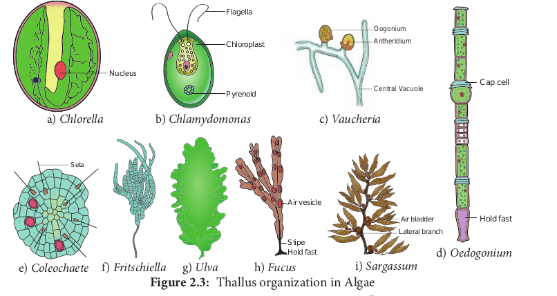
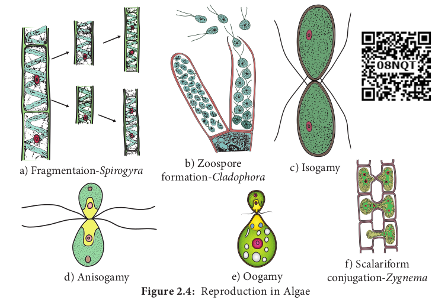

# Algae

Rain brings joy and life to various organisms on earth. Have you noticed some changes in and around you after the rain? Could you identify the reason for the slippery nature of the terrace and green patches on the wall of our home, green colour of puddles and ponds? Why should we clean our water tanks very often? The reason is algae.

Algae are simple plants that lack true roots, true stems and true leaves. Two-third of our earth’s surface is covered by oceans and seas. The photosynthetic plants called algae are present here. More than half of the total primary productivity of the world

> **M.O.Parthasarathy (1886-1963) ‘Father of Indian Phycology’.**  
> He conducted research on structure, cytology, reproduction and taxonomy of Algae. He published a Monograph on Volvocales. New algal forms like _Fritschiella, Ecballocystopsis, Charasiphon_ and _Cylindrocapsopsis_. were reported by him.

depends on this plant group. Further, other aquatic organisms also depend upon them for their existence.

Algae are autotrophs, and grow in a wide range of habitats. Majority of them are aquatic, marine (_Gracilaria,_ and _Sargassum_) and freshwater (_Oedogonium,_ and _Ulothrix_) and also found in soils (_Fritschiella,_ and _Vaucheria_). _Chlorella_ lead an endozoic life in hydra and sponges whereas _Cladophora crispata_ grow on the shells of molluscs. Algae are adapted to thrive in harsh environment too. _Dunaliella salina_ grows in salt pans (**Halophytic alga**). Algae growing in snow are called **Cryophytic algae**. _Chlamydomonas nivalis_ grow in snow covered mountains and impart red colour to the snow (**Red snow**). A few algae grow on the surface of aquatic plants and are called **epiphytic algae** (_Coleochaete,_ and _Rhodymenia_). The study of algae is called **algology** or **phycology**. Some of the eminent algologists include F.E. Fritsch, F.E. Round, R.E. Lee, M.O.Parthasarathy Iyengar, M.S. Randhawa, Y. Bharadwaja, V.S. Sundaralingam and T.V.Desikachary.

## General Characteristic features

The algae show a great diversity in size, shape and structure. A wide range of thallus organisation is found in algae. Unicellular motile (_Chlamydomonas_), unicellular non- motile (_Chlorella_), Colonial motile (_Volvox_), Colonial non motile (_Hydrodictyon_), siphonous (_Vaucheria_), unbranched filamentous (_Spirogyra_), branched filamentous (_Cladophora_), discoid (_Coleochaete_) heterotrichous (_Fritschiella_), Foliaceous (_Ulva_) to giant kelps (_Laminaria_ and _Macrocystis_). The thallus organization in algae is given in Figure 2.3.

Algae are eukaryotes except blue green algae. The plant body does not show differentiation into tissue systems. The cell wall of algae is made up of cellulose and hemicellulose. Siliceous walls are present in diatoms. In _Chara_ the thallus is encrusted with calcium carbonate. Some algae possess algin, polysulphate esters of polysaccharides which are the sources for the alginate, agar agar and carrageenan. The cell has a membrane bound nucleus and cell organelles like chloroplast, mitochondria, endoplasmic reticulum, golgi bodies etc., Pyrenoids are present. They are proteinaceous bodies found in chromatophores and assist in the synthesis and storage of starch. The pigmentation, reserve food material and flagellation differ among the algal groups.

Algae reproduces by vegetative, asexual and sexual methods (Figure 2.4). Vegetative

reproduction includes fission (In unicellular forms the cell divides mitotically to produce two daughter cells Example: _Chlamydomonas)_; Fragmentation (fragments of parent thallus grow into new individual Example: _Ulothrix_) budding (A lateral bud is formed in some members like _Protosiphon_ and helps in reproduction) bulbils, (a wedge shaped modified branch develop in _Sphacelaria_) akinetes (Thick walled spores meant for perennation and germinates with the advent of favourable condition Example: _Pithophora_) and Tubers (Structures found on the rhizoids and the lower nodes of _Chara_ which store food materials).

Asexual reproduction takes place by the production of zoospores motile spores (_Ulothrix, Oedogonium_) aplanospore (thin walled non motile spores Example: _Vaucheria_); autospores (spores which look similar to parent cell Example: _Chlorella_); hypnospore (thick walled aplanospore – Example: _Chlamydomonas nivalis_) and Tetraspores (Diploid thallus of _Polysiphonia_ produce haploid spores after meiosis).

Sexual reproduction in algae is of three types 1. Isogamy (Fusion of morphologically and Physiologically similar gametes Example: _Ulothrix_) 2. Anisogamy (Fusion of either morphologically or physiologically dissimilar gametes Example: _Pandorina_) 3. Oogamy (Fusion of both morphologically and physiologically dissimilar gametes. Example: _Sargassum_). The life cycle shows distinct alternation of generation.

> The Oldest recorded alga is Grypania, which was discovered in the banded iron formations of northern Michigan and dated to approximately 2100Ma

## Classification

F.E. Fritsch proposed a classification for algae based on pigmentation, types of flagella, reserve food materials, thallus structure and reproduction. He published his classification in the book “The structure and reproduction of the Algae”(1935). He classified algae into 11 classes namely Chlorophyceae, Xanthophyceae, Chrysophyceae, Bacillariophyceae, Cryptophyceae, Dinophyceae, Chloromonadineae, Euglenophyceae, Phaeophyceae, Rhodophyceae, Cyanophyceae (Table 2.2).

The salient features of Chlorophyceae, Phaeophyceae and Rhodophyceae are given below.

**Chlorophyceae**
The members are commonly called **‘Green algae’**. Most of the species are aquatic(Fresh water-_Spirogyra_, Marine -_Ulva_). A few are terrestrial(_Trentipohlia_). Variation among the shape of the chloroplast is found in members of algae. It is cup shaped (_Chlamydomonas_), discoid (_Chara_), girdle shaped, (_Ulothrix_), reticulate (_Oedogonium_), spiral (_Spirogyra_), stellate (_Zygnema_) and plate like (_Mougeoutia_).

Chlorophyll ‘a’ and Chlorophyll ‘b’ are the major photosynthetic pigments. Storage bodies called pyrenoids are present in the chloroplast and store starch. They also contain proteins. The cell wall is made up of inner layer of cellulose and outer layer of pectin. Vegetative reproduction takes place by means of fragmentation and asexual reproduction is by the production of zoospores, aplanospores and akinetes. Sexual reproduction is present and may be isogamous, anisogamous or oogamous. Examples for this group of algae includes _Chlorella, Chlamydomonas, Volvox, Spirogyra, Ulothrix, Chara_ and _Ulva._

**Phaeophyceae**
The members of this class are called **‘Brown algae’**. Majority of the forms are found in marine habitats. _Pleurocladia_ is a fresh water form. The thallus is filamentous (_Ectocarpus_) frond like (_Dictyota_)or may be giant kelps (_Laminaria_ and

**Table 2.2 Classification of Algae**

| Class             | Pigments                                                 | Flagella                                                                  | Reserve food              |
| ----------------- | -------------------------------------------------------- | ------------------------------------------------------------------------- | ------------------------- |
| Chlorophyceae     | Chlorophyll a and b Carotenoids, Xathophyll              | 1,2,4 or more equal anterior whiplash flagella                            | Starch                    |
| Xanthophyceae     | Chlorophyll a and b Carotenoids Xathophyll               | 2, unequal anterior 1 tinsel and 1 whiplash                               | Fats and leucosin         |
| Chrysophyceae     | Chlorophyll a and b Carotenoids                          | 1 or 2 unequal or equal anterior both whiplash or 1 whiplash and 1 tinsel | Oils and leucosin         |
| Bacillariophyceae | Chlorophyll a and c Carotenoids,                         | 1 anterior (only in male gametes) tinsel                                  | Leucosin and Fats         |
| Cryptophyceae     | Chlorophyll a and c carotenoids                          | unequal anterior both tinsel and anthophyll flagella                      | Starch                    |
| Dinophyceae       | Chlorophyll a and c carotenoids                          | Two unequal (whiplash)lateral and xanthophyll flagella in different plane | Starch and oil            |
| Chloromonadineae  | Chlorophyll a and b Carotenoids,                         | 2 equal flagella Xathophyll                                               | oil                       |
| Euglenophyceae    | Chlorophyll a and b                                      | One or two anterior tinsel flagella                                       | Fats and paramylon        |
| Phaeophyceae      | Chlorophyll a and c, Xanthophyll                         | Two unequal whiplash and tinsel lateral flagella                          | Laminarin starch and fats |
| Rhodophyceae      | Chlorophyll a, r-Phycoerthythrin                         | absent                                                                    | Floridean starch          |
| Cyanophyceae      | Chlorophyll a, carotenoids,c-Phycocyanin,Allophycocyanin | absent                                                                    | Cyanophycean starch       |

_Macrocystis_). The thallus is differentiated into leaf like photosynthetic part called fronds, a stalk like structure called stipe and a holdfast which attach thallus to the substratum.

The Pigments include Chlorophyll a, c, Carotenoids and Xanthophylls. A golden brown pigment called fucoxanthin is present and it gives shades of colour from olive green to brown to the algal members of this group. Mannitol and Laminarin are the reserve food materials. Motile reproductive structures are present. Two laterally inserted unequal flagella are present. Among these one is whiplash and another is tinsel. Although sexual reproduction ranges from isogamy to oogamy, Most of the forms show oogamous type. Alternation of generation is present (isomorphic, heteromorphic or diplontic). Examples for this group include _Sargassum, Laminaria, Fucus_ and _Dictyota._

**Rhodophyceae**
Members of this group include ‘**Red algae**’ and are mostly marine. The thallus is multicellular, macroscopic and diverse in form. _Porphyridium_ is the unicellular form. Filamentous (_Goniotrichum_) ribbon like (_Porphyra_) are also present. _Corallina_ and _Lithothamnion_ are heavily impregnated with lime and form coral reefs. Apart from chlorophyll a, r-phycoerythrin and r-phycocyanin are the photosynthetic pigments. Asexual reproduction takes place by means of monospores, neutral spores and tetraspores.

The storage product is floridean starch. Sexual reproduction is oogamous. Male sex organ is spermatangium which produces spermatium. Female sex organ is called carpogonium. The spermatium is carried by the water currents and fuse with egg nucleus to form zygote. The zygote develops into carpospores. Meiosis occurs during carpospore formation. Alternation of generation is present. Examples for this group of algae include _Ceramium, Polysiphonia, Gelidium, Cryptonemia_ and _Gigartina_

> A green alga _Botryococcus braunii_ is employed in Bio- fuel production. **Algae in Health care Kelps** are the rich source of Iodine _Chlorella_ is used as single cell Protein (SCP). _Dunaliella salina_ an alga, growing in salt pan is complement to our health and provide β carotene.

## Economic Importance

The Economic importance of Algae is given in Table 2.3
**Table 2.3: Economic importance of Algae**

| Name of the Algae                                   | Economic importance                                                                                                                      |
| --------------------------------------------------- | ---------------------------------------------------------------------------------------------------------------------------------------- |
| Beneficial activities                               |
| Chlorella, Laminaria, Sargassum, Ulva, Enteromorpha | Food                                                                                                                                     |
| Gracilaria, Gelidiella, Gigartina                   | Agar Agar – Cell wall material used for media preparation in the microbiology lab. Packing canned food, cosmetic, textile paper industry |
| Chondrus crispus                                    | Carrageenan – Preparation of tooth paste, paint,blood coagulant                                                                          |
| Laminaria, Ascophyllum                              | Alginate – ice cream, paints, flame proof fabrics                                                                                        |
| Laminaria, Sargassum, Ascophyllum, Fucus            | Fodder                                                                                                                                   |
| Diatom (Siliceous frustules)                        | Diatomaceous earth– water filters, insulation material, reinforcing agent in concrete and rubber.                                        |
| Lithophyllum, Chara, Fucus                          | Fertilizer                                                                                                                               |
| Chlorella                                           | Chlorellin -Antibiotic                                                                                                                   |
| Chlorella, Scenedesmus, Chlamydomonas               | Sewage treatment, Pollution indicators                                                                                                   |
| Harmful activity                                    |
| Cephaleuros virescens                               | Red rust of coffee                                                                                                                       |

> A Productive Cultivation in Sea Algae like Kappaphycus alvarezii, Gracilaria edulis and Gelidiella acerosa are commercially grown in the sea forharvesting the phycocolloids.Sea Palm It is Postelia palmaeformis a brown alga.
> 

## Chara

Class – Chlorophyceae
Order – Charales
Family – Characeae
Genus – _Chara_

_Chara_ is commonly called as ‘ stone wort’ It is a submerged aquatic freshwater alga growing attached to the mud of the lakes and slow running streams. _Chara baltica_ grows in saline water. The thallus is often encrusted with calcium and magnesium carbonate.

**Thallus structure**
The plant body is multicellular, macroscopic and is differentiated into main axis and rhizoids. The rhizoids are thread-like,multicellular structures arise from the lower part of the thallus or peripheral cells of the lower node.They are characterised by the presence of oblique septa. The rhizoids fix the main axis on the substratum and helps in the absorption of salts and solutes \(Figure 2.5).

The main axis is branched, long and is differentiated into nodes and internodes. The internode is made up of an elongated cell in the centre called axial cell or internodal cell. The axial cell is surrounded by vertically elongated small cells which originate from the node. They are called cortical cells. In _C. wallichii_ and _C. corallina_ the cortical cells are absent. Three types of appendages arise from the node. They are 1. Branches of limited growth 2. Branches of unlimited growth 3. Stipuloides. The growth of the main axis and its branching takes place by the apical cell.

The nodal cells are uninucleate with few ellipsoidal chloroplasts. The internodal cells are elongated and possesses a large central vacuole, many nuclei and numerous discoidal chloroplasts.

The cytoplasm is divided into outer ectoplasm and inner endoplasm. The endoplasm shows cytoplasmic streaming.

**Reproduction**
_Chara_ reproduces by vegetative and sexual methods. Vegetative reproduction takes place by amylum stars, root bulbils, amorphous bulbils and secondary protonema.

Sexual reproduction - Sexual reproduction is oogamous. Sex organs are macroscopic and are produced on the branches of limited growth. The male sex organ is called antheridium or globule and the female sex organ is called Oogonium or nucule (Figure 2.6).

The nucule is located above the globule. The antheridium is spherical, macroscopic and its wall is made up of eight cells called shield cells. The antheridium has spermatogenous filaments. These filaments produce antherozoids. The nucule is covered by five spirally twisted tube cells and five coronal cells are present at the top of the nucule (Figure 2.6). The centre of the nucule possesses a single egg. At maturity the tube cells separate and a narrow slit is formed. The antherozoids penetrate the oogonium and one of them fuses with the egg to form a diploid oospore. The oospore secretes a thick wall around and germinate after the resting period. The nucleus of the oospore divides to form 4 haploid daughter nuclei of which, three degenerate. The oospore or zygote germinates to produce haploid protonema. The plant body of _Chara_ is haploid and The oospore is the only diploid phase in the life cycle. Therefore, the life cycle is of haplontic type. Alternation of generations is present (Figure 2.7).

