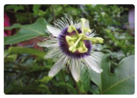

# Angiosperms

In the previous section, the characteristic features of one of the spermatophyte called Gymnosperms were discussed.

Spermatophytes also include plants bearing ovules enclosed in a protective cover called ovary, such plants are called Angiosperms. They constitute major plant group of our earth and are adapted to the terrestrial mode of life. This group of plants appeared during the early cretaceous period (140 million years ago) and dominates the vegetation on a global scale. The sporophyte is the dominant phase and gametophyte is highly reduced.

## Salient features of Angiosperms

- Vascular tissue (Xylem and Phloem) is well developed.
- Flowers are produced instead of con.
- The Ovule remains enclosed in the ovary.
- Pollen tube helps in fertilization, so water is not essential for fertilization.
- Double fertilization is present. The endosperm is triploid.
- Angiosperms are broadly classified into two classes namely Dicotyledons and Monocotyledons.

## Characteristic features of Dicotyledons and Monocotyledons

**Dicotyledons**
**Morphological features**

Reticulate venation is present in the leaves. Presence of two cotyledons in the seed. Primary root radicle persists as tap root. Flowers tetramerous or pentamerous. Tricolpate (3 furrow) pollen is present.

**Anatomical features**

- Vascular bundles are arranged in the form of a ring in stem.
- Vascular bundles are open (Cambium present).
- Secondary growth is present.

**Monocotyledons Morphological features**

Parallel venation is present in the leaves. Presence of single cotyledon in the seed. Radicle doesn’t persist and fibrous root is present.Flowers trimerous. Monocolpate (1 furrow) Pollen is present.

**Anatomical features**.

- Vascular bundles are scattered in the ste.
- Vascular bundles are closed (Cambium absent).
- Secondary growth is absent.

Current Angiosperm Phylogeny Group (APG) System of classification doesn’t recognize dicots as a monophyletic group. Plants that are traditionally classified under dicots are dispersed in several clades such as early Magnolids and Eudicots**.**

**Summary**

Plant Kingdom includes Algae, Bryophytes, Pteridophytes, Gymnosperms and Angiosperms

The life cycle in plants fall under three types 1. Haplontic,2. Diplontic and 3. Haplodiplontic

Algae are autotrophic, chlorophyll bearing organisms. The Plant body is not differentiated into root like, stem like or leaf like structures. A wide range of thallus organization is found in algae. They reproduce vegetatively through fragmentation, tuber and akinete formation. Zoospores, autospores and hypnospores are produced during asexual reproduction and sexual reproduction occurs through isogamy, anisogamy and oogamy.

_Chara_ is a fresh water alga and is popularly called “Stone Worts”. The plant body is multicellular, macroscopic and is differentiated into main axis and rhizoids. Sexual reproduction is oogamous.

Bryophytes are the simplest land plants. They are called amphibians of plant kingdom or nonvascular cryptogams. The plant body is gametophyte. The sporophyte depends upon gametophyte. Conducting tissues like xylem and phloem is absent. Vegetative reproduction takes place through fragmentation, formation of adventitious bud and gemmae. Sexual reproduction is oogamous. Water is essential for fertilization.

_Marchantia_ belongs to the class Hepaticopsida. The thallus is dorsiventral and is attached to the substratum by means of rhizoids. The internal structure of the thallus reveals the presence of photosynthetic region and a storage region. Vegetative reproduction takes place through fragmentation and formation of gemmae. The sexual reproduction is oogamous. Sporophyte bears spores. Alternation of generation is present.

Pteridophytes are also called vascular cryptogams. The plant body is sporophyte and is long lived, which is differentiated into root, stem and leaves. They may be homosporous or heterosporous. The sporangia with spores are found in sporophylls. The sporophylls organise to form cones or strobilus. The spores germinates to produce haploid, multicellular heart shaped independent gametophyte called prothallus. Sexual reproduction is oogamous. The life cycle shows alternation of generation.

The term stele includes central cylinder of vascular tissues comprising xylem, phloem, pericycle, endodermis and pith . There are two major types of stele namely protostele and siphonostele.

_Selaginella_ belongs to the class Lycopsida. The plant body is sporophyte. It is differentiated into stem, leaf, rhizophore and roots. Heterospory is found and two types of spores namely microspores and megaspores are produced in sporangia. The microsporangia and megasporania are borne on sporophylls. The sporophylls are organized to form cone. Sexual reproduction is oogamous. Alternation of generation is present.

Gymnosperms are naked seed producing plants. The plant body is sporophyte and it is the dominant phase. Coralloid roots are found in Cycas. The roots of Pinus possess mycorrhizal association. Two types of branches called long shoot and dwarf shoot are present. Stem shows secondary growth. Spores are produced in cones. Pollen tube helps in fertilization. The endosperm is haploid. Alternation of generation is present

_Cycas belongs to cycadopsida. The plant_ body is sporophyte and looks like a small palm tree. Apart from taproot coralloid roots are present. It is dioecious, microsporophylls are organized into male cone. Ovules are borne on megasporophylls which are not organized into cone. Fertilization results in zygote and it develops into embryo. Alternation of generation is present.

Angiosperms are highly evolved plant group and their ovules remain enclosed in an ovary. A wide range of habit is present. These include trees, shrubs, herbs, climbers, lianas. Double fertilization is present. The endosperm is triploid. They are classified into dicotyledons and monocotyledons.
